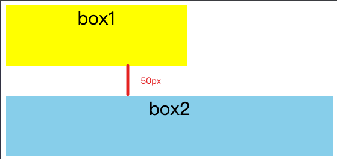

## 常见的定位方案

1. 普通流
   - 元素按照其在HTML中的先后位置由上而下布局
2. 浮动布局（float）
   - 元素首先按照普通流的位置出现，然后根据浮动的方向尽可能的向左或者向右偏移，脱离文档流
3. 绝对定位（absolute）
   - 开启绝对定位，元素会相对于第一个 position 不为 static  的父级元素进行定位，脱离文档流


## 什么是FC

FC 全称是 Formatting Context，元素在标准流里面都是属于一个FC，块级元素如`div p h1 h2`等属于块级格式化上下文（BFC），行内元素如`a span i b`等属于行级格式化上下文（IFC）

在布局的时候块级元素都会在BFC中进行布局，行内元素则会在 IFC 中进行布局


## BFC 概念

**BFC( block formatting contexts )** 块级格式上下文。属于定位方案中的普通流

**特点**：具有BFC 特性的元素可以看作是隔离的独立容器，容器里面的元素不会再布局上影响到外面的元素。简单理解就是一个封闭的大箱子。


## BFC作用

### 垂直方向上外边距重叠

```html
<!DOCTYPE html>
<html>
  <head>
    <meta charset="utf-8">
    <meta name="viewport" content="width=device-width,initial-scale=1.0">
    <title>BFC</title>
    <style>
    	div{
        height: 100px;
        font-size: 30px;
        text-align: center;
      }
      .box1{
          width: 300px;
          background: yellow;
          margin-bottom: 50px;
      }
      .box2{
          background: skyblue;
          margin-top: 50px;
      }
    </style>
  </head>
  <body>
    <div class="box1">box1</div>
		<div class="box2">box2</div>
  </body>
</html>
```



> ***BFC特点一***
>
> 开启BFC其实就是创建BFC，让其包裹的**块级元素**在这个BFC进行布局，布局**在垂直方向上**是从顶部开始从上到下**一个挨着一个的进行排布**，其中元素间**在垂直方向上**的距离由margin决定（BFC解析margin然后设置元素间距），同时**在同一个BFC中**相邻的块级元素间的**间距（margin）将会被折叠（重叠）**，在**水平方向上**元素会紧挨着**BFC元素的左边**

在上面的例子中因为 html 标签本身就是一个BFC，而 box1 和 box2 都属于这个BFC并且她们是相邻的，所以她们在垂直方向上的margin会重叠，要解决这个问题可以将 box1 和 box2 分别处于两个不同的BFC中就可以了，比如给box1包裹一层div 并且设置 `overflow:auto`

> 需要注意，如果给 box1 设置 `overflow:auto`是不行的，因为及时 box1 开启（创建）了BFC，但是此时 box1 和 box2 还是属于同一个BFC的

```html
<style>.container{overflow:auto;}</style>
<div class="container">
	<div class="box1">box1</div>
</div>
<div class="box2">box2</div>
```

此时 box1 属于 container 的BFC，box2 属于 html 的BFC


### 高度塌陷

```html
<!DOCTYPE html>
<html>
  <head>
    <meta charset="utf-8">
    <meta name="viewport" content="width=device-width,initial-scale=1.0">
    <title>BFC</title>
    <style>
    	.container{
        background: red;
      }
      .item{
        width: 100px;
        height: 80px;
        font-size: 30px;
        text-align: center;
        background: yellow;
        border: 1px solid black;
        float: left;
      }
    </style>
  </head>
  <body>
    <div class="container">
      <div class="item">item</div>
      <div class="item">item</div>
      <div class="item">item</div>
      <div class="item">item</div>
  	</div>
  </body>
</html>
```

> ***BFC特点二***
>
> 当浮动元素的**父元素触发 BFC，且父元素没有设置高度或者高度为`auto`时**，会对子元素的高度进行计算从而决定父元素的高度
>
> 1. 如果**子元素只有行内元素**的时，计算行高顶部和底部的距离
> 2. 如果**子元素有块级元素**时，计算由最顶层的块的上边缘和最底层块盒子的下边缘之间的距离
> 3. 如果**子元素是绝对定位**则忽略计算

首先我们知道在没有设置父元素的高度时，父元素的高度是由子元素撑开的，其实在布局的时候是先对子元素进行布局计算，然后子元素在布局计算完成之后将自己的高度汇报个父元素，然后父元素再决定自身的高度的，但是子元素在某些情况下，如脱离文档流的操作（设置浮动`float`，设置绝对定位`position:absolute`），子元素将不再将高度汇报给父元素，父元素无法得知自己应该设置多少高度从而导致**高度塌陷**

上面的例子中就是因为子元素 item 开启了浮动脱离了文档流，导致子元素没有给父元素汇报高度导致高度塌陷，可以使用BFC解决这个问题，因为`container`并**没有设置高度**，所以直接给`container`开启BFC即可。开启之后BFC就会去计算子元素来确定父元素的高度。

> 也可以用经典方案
>
> ```css
> .clear-fix::after{
>   content:"";
>   clear:both;
>   overflow:hidden;
> }
> ```
>
> 


## 开启BFC方法

1. 根元素HTML元素，本身就是一个 BFC
2. 浮动元素：float 除 none 以外的值。
3. 绝对定位元素：position ：absolute / fixed
4. display 为 inline-block，table-cell，flex，flow-root，grid;
5. overflow：除了 visible 以外的其他值。

BFC 一般都是使用在不想受外部布局


## BFC 的特性以及应用

1. 同一个 BFC 环境下，元素在垂直方向上的外边距会折叠

```html
<style>
    div{
        width:100px;
        height:100px;
        background-color:red;
        margin:100px;
    }
</style>
<body>
    <div></div>
    <div></div>
</body>
```

解决：放在不同的 BFC 中，这里两个 div 都存在于同一个 BFC（body） 中，所以只需要将其中一个div 放入到另外一个 bfc 中即可

```html
<style>
    .div-box{
        width:100px;
        height:100px;
        background-color:red;
        margin:100px;
    }
    .bfc-box{
        overflow:hidden;
    }
</style>
<body>
    <div class="bfc-box">
        <div class="div-box"></div>
    </div>
    <div class="div-box"></div>
</body>
```

2. BFC可以包含浮动元素（清除浮动）

```html
<style>
    div{
        border:1px solid red;
    }
    .div-box{
        width:100px;
        height:100px;
        background-color:red;
        float:left;
    }
    .bfc-box{
        overflow:hidden;/*不开启BFC bfc-box将不能被div-box 撑开*/
    }
</style>
<body>
    <div class="bfc-box">
        <div class="div-box"></div>
    </div>
</body>
```

3. BFC 可以阻止元素被浮动元素覆盖

```html
<style>
    .div-box{
        width:100px;
        height:100px;
        background-color:red;
        float:left;
    }
    .text-box{
        width:200px;
        height:200px;
        background-color:black;
        color:white;
    }
    .bfc-box{
        overflow:hidden;/*不开启BFC bfc-box将被div-box 覆盖并且会有文字环绕的效果*/
    }
</style>
<body>
    <div class="div-box"></div>
    <div class="bfc-box text-box">
        不开启BFC bfc-box将被div-box 覆盖并且会有文字环绕的效果
        不开启BFC bfc-box将被div-box 覆盖并且会有文字环绕的效果
        不开启BFC bfc-box将被div-box 覆盖并且会有文字环绕的效果
        不开启BFC bfc-box将被div-box 覆盖并且会有文字环绕的效果
        不开启BFC bfc-box将被div-box 覆盖并且会有文字环绕的效果
        不开启BFC bfc-box将被div-box 覆盖并且会有文字环绕的效果
    </div>
</body>
```
