+ [【Kurt】Blender入门教程笔记](./Blender/【Kurt】Blender入门教程笔记.pdf)
+ [Blender 快捷键](https://hotkeycheatsheet.com/zh/hotkey-cheatsheet/blender)
+ [Blender 键盘快捷键](https://quickref.cn/docs/blender.html)
+ [【Blender】快捷键大全（超级详细，应有尽有，不断更新）](https://zhuanlan.zhihu.com/p/126650481)
+ [Blender 快捷键速查表](https://www.cheat-sheet.cn/post/blender-keyboard-shortcuts/)

## 材质和模型网站

+ https://polyhaven.com
+ https://ambientcg.com
+ https://free3d.com
+ https://cgtrader.com

## blender工具

+ https://budeco.top/

## 插件

编辑-偏好设置-插件

+ LoopTools：快速处理循环定点，桥接定点等
+ Node wrangler：快速创建纹理节点

## **建模篇**

### **一、基础操作**

恢复变换:Alt+G,Alt+R，Alt+S

复制物体: Shift+D  (移动并复制）

删除物体:X或者Delete

隐藏物体:H （或点击小眼睛）/显示全部隐藏物体:Alt+H；隐藏没有被选中的物体: Shift+H

选择物体刷选:C/全选:A/按住Shift可以加选或者减选

视图的切换：

7-顶视图，1-前视图，3-右视图，9反转当前视图

0:切换摄像机的视角

5:切换透视投影和正交投影

2,4,6,8:前后左右角度微调（默认15°）

左上角~按一下可调出视图选项。

或者按住ALT+鼠标中键转动也可切换视图。

打开：编辑-偏好设置-视图切换-围绕选择物体旋转 /编辑-偏好设置-视图切换-缩放至鼠标位置

窗口面板可拆分，可互换 （在每个窗口四角向内，外拖动），鼠标移动到面板边缘，出现加号增加面板，出现三角合并面板，或者右键也可以。

恢复默认面板：上方标题栏点+号，新建一个常规布局。

最大化窗口:Ctrl+空格

游标可以用来定位和当轴心点转动物体。

游标在哪里新建物体就会出现在哪里。

调用游标Pie目录:Shift+s-选中项到游标。物体模式下右键菜单可以设置着色和物体原点位置

游标恢复到世界中心: Shift+c

移动游标:点击游标工具或者Shift+右键

每个物体都有原点，在3D世界的计算机眼里，原点就是储存物体信息的数据点。（通过选项-“仅影响原点”移动）

右侧选项有“仅移动原点”，用完了之后记得关掉。

ALT+G将物体移动到世界中心。

G移动状态下，按住ctrl，可以以每个方格增量为单位进行吸附。

切换全局和局部坐标系:在G移动状态下按两次X，Y，Z。

变换轴心点：活动元素是最后选中的那个物体。黄色框是被选中激活的物体。

坐标轴：移动工具可显示物体坐标轴。

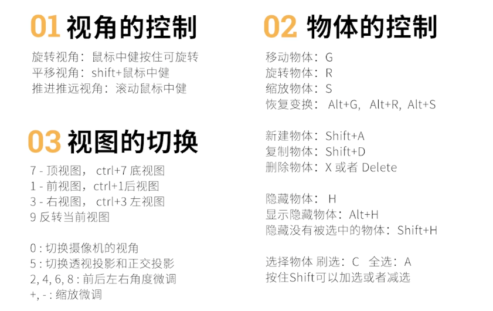

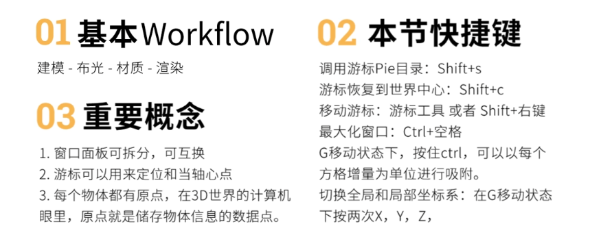

### **二、珍珠耳环的少女**

载入参考图：shift+A 图像-参考

图像属性：将不透明度调低。深度“前”才可在建模时看见图片。

右侧文件夹小三角取消后物体不可选择。

*键盘右下角的“?/”键，可以将选中物体单独显示。

调整摄像机：拉出一个新窗口，在右侧视图勾选锁定摄像机，然后调整视图，新窗口调整视图时，原窗口的摄像机会跟随移动。

点击相机，可在属性栏更改输出分辨率和外边框深度，更方便查看输出范围。

左上角渲染——渲染图像。

选中不同物体和不同视图着色方式，右下边的属性栏也会有不同的工具显示。

金属、高光、糙度三个材质参数比较重要。

新建集合请选中最上方的场景集合新建，不然会新建到其它集合下方。

关掉小眼睛只是隐藏，最后渲染结果还是会出现隐藏物体，若不想要隐藏物体，要将小眼睛后的小相机也关掉。

给物体加颜色时，有HEX模式，颜色数值显示。

选中一个物体，再shift选择一个有材质的物体，CTRL+L关联材质可以复制材质。

### **三、建模的编辑模式**

偏好设置-键位映射-拖动时的饼菜单。按住TAB不松手，鼠标微动，会出来模式选项。

123点线面切换。按住shift选择点面，可同时选中点面。

按W可切换选择模式：框选、刷选、套索。

CTRL+I反选；

CTRL最短路径选择；

L相连元素选择；

ALT双击，选中一圈；

CTRL+ALT双击，可以选择垂直的一圈线：

随机选择；

X：删除边（拆开正方体）/融并边（正方体变三角）

打开面朝向可看法向：蓝正红反。如果看不到蓝色可以再 `偏好设置-主题-3d视图-面朝向正`中的alpha通道调高

SHIFT+N重新计算法向，可以将正面设置在外面

ctrl + shift + n 将反面设置在外面

### **四、建模的十大操作**

**四大操作**：挤出（E）/内插（向内挤出I）/循环切割(CTRL+R)/倒角（CTRL+B）。

CTRL+右键，可以连续不断地挤出。

循环切割右键会默认吸附到最中间的位置。在编辑模式下选中框选工具（不要选中循环切割工具）然后ctrl + R 循环切割点击添加一个切割线口，混动鼠标滚轮个快速添加切线

挤出流形不会有重复边的问题。

挤出各个面。

**六小操作：**合并（M）/断开(V)/填充（F）/切刀（K）/桥接（CTRL+E）/分离（P）

栅格填充必须是偶数边。

单击鼠标左键是确定点点位置，单击鼠标右键可断开连续，单击空格键是退出切刀工具，单击esc会把画好的切线删除。

桥接循环边只能对同一物体使用，在物体模式下选中两个物体可CTRL+J合并两个物体后使用。选中两个物体的循环边（选中一个边后，alt + 鼠标左键，然后按shift 加选另一个物体的一条边，shift + alt + 鼠标左键选中循环边），ctrl + e选中连接循环边

### **五、修改器**

编辑-偏好设置-插件-LOOP

选择锐边，会自动把两个90度夹角的两条边选中。

*表面细分修改器：将网格的面分割，使其看起来更加平滑。

*实体化修改器：增加任意网格表面的厚度。

*倒角修改器：倒角

*布尔修改器

注意修改器的应用顺序，从上到下。

### **六、建模马拉松**

**尽量不要在物体模式下缩放，尽量在编辑模式下缩放；**

**假如你在物体模式下缩放，记得CTRL+A应用这个缩放。**因为在编辑模式下会自动应用变换，而物体模式下不会自动应用，在添加一些修改器时如果没有应用变换可能就会达不到想要的效果

后选中的物体是父，CTRL+P建立父子级。alt+p 可以取消父子级

CTRL+2建立表面细分修改器。

**面吸附**：选中旋转对齐目标和项目的独立元素。

**衰减**编辑：按O进入，鼠标滚动控制G移动的范围。在圆圈范围内的点都会被修改，比如移动的时候，圆圈中心的点是移动范围是正常的，越靠近圆圈边缘的点移动越缓慢

S+X/Y/Z（垂直哪边用哪边）+0使物体某一边变成平面。(就是将某个方向的坐标归0)

选中，P分离，苔藓用实体化修改器添加厚度。

**旋绕**编辑。

**缩裹**修改器：要缩裹，细分必须够，先细分再缩裹。

不规则物体建模：选中一个面，然后不停地挤出。复习切刀K断开V和合并M。

### **七、继续讲修改器**

**阵列**修改器：相对偏移和恒定偏移。

**晶格**形变：新建晶格，把物体框住后选中物体再选晶格，ctrl+p晶格形变。

选中物体-右键-转换到网格，就可以把所有的修改器应用在物体上了。

ctrl+j合并物体，再加上一个简易形变修改器。

物体偏移：要有一个物体来决定偏移程度，新建一个空物体作为对称轴。注意修改阵列物体数量。

要移动阵列修改做的模型，一定要全选把对称轴带上，不然模型会爆掉。

新建空物体包裹住模型，方便移动。

新建一个空物体把需要合并的物体包裹住（先选择树和控制物体阵列的空物体，再选择包裹的空物体），CTRL+P设立父级（后选中的物体是父），就可以一起移动了。ALT+P清空父级

**镜像**修改器：点选范围限制，点不会跑到另一边。

**曲线**，选中两个点，按F，可以将两个点连接；选中曲线的任何一个点，ALT+C也可闭合。

贝塞尔曲线通过控制杆控制曲线；NURBS曲线通过点拟合曲线走势，多一个W值，可以影响曲线的曲率，E可挤出。

通过曲线属性的几何数据-**倒角**-圆-深度调整就可以变成管子。几何数据-倒角-物体可通过选择的物体导出特定的管子形状，可以用来做头发。

选中一个点ALT+S可以缩放管子修改半径。

选中两个点——按X，可删除段数。

**曲线修改器**：让物体随曲线变化。

**父子级**：ALT+D关联性复制：动一个物体其它也会动。

想要叶子和杆联动，设定父级时选择顶点（基于三点）

文件夹移动父级时，右键选择层级，才能把父子级一起移动到文件夹中。

**蒙皮修改器**：CTRL+A修改半径（曲线的是ALT+S）。做树、鹿角应该很好用。

**置换修改器**：新建平面或立方体，添加细分修改器（重要）。

黑0白1。强度力度右键恢复到默认设置。

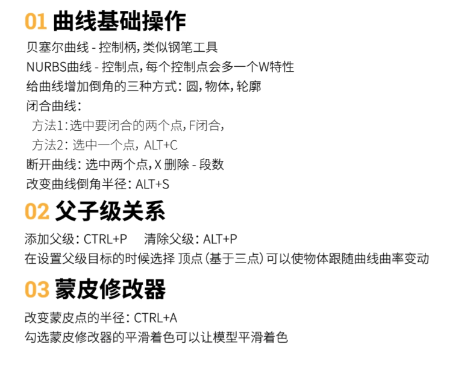

### **八、小狐狸建模：**

设置参考图：正视图加载参考；侧视图加载参考。

现在添加一个正方体，然后进行细分，调整物体符合参考图狐狸头部，应用细分，进入编辑模式，将左边定点删除，然后添加镜像修改器

如果不想定点被拖动到镜像侧可以打开范围限制，如果范围限制不生效就调大合并范围

连按两次G，可沿路径滑动点。

添加镜像修改器的时候注意对称原点。

### **九、其它的一些琐碎和截图：**

SHIFT+A除了新建物体外，还可以收起/打开物体文件夹。

建模模式下，右键转换到网格，可一次性应用修改器。

在物体模式下缩放，一定要CTRL+A应用缩放，让缩放值变为1.

点中场景集合新建，才不会新建到其它文件夹。

基本的东西：模型、灯光、摄像机。

### 纹理和着色器

Physically Based Rendering(基于物理的渲染)

原理化BSDF：**Principled BSDF（原理化 BSDF）** 是 Blender 中一种基于 **OpenPBR** 模型的物理渲染着色器节点，它将金属、漫反射、次表面散射、透射、涂层、光泽、自发光等多层材质特性整合到一个节点中，方便快速创建真实感材质

创建出来材质可以被多次使用，可以快捷选择之前创建过的材质进行使用，如果创建出来的材质没有使用到再下次打开就会不见了，可以打开材质右边的伪用户开关，这样即使材质没有被使用也不会消失

**着色器编辑器**可以通过蓝图节点的方式编辑和创建材质

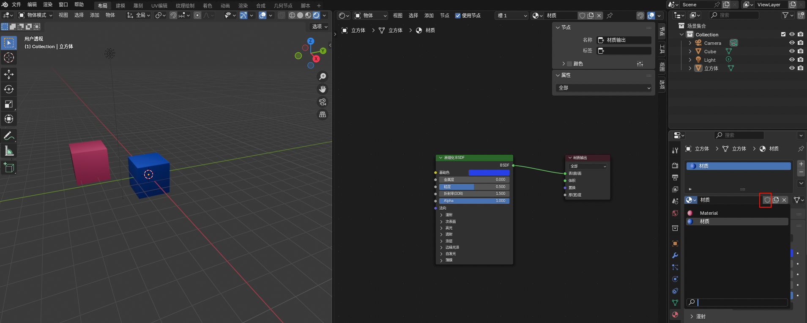

在视图渲染模式下，物体会受灯光影响出现明暗，这样并不方便我们进行材质操作，可以将渲染**场景世界**关闭掉

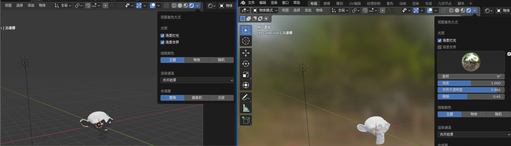

每个材质必须要用材质输出节点才能显示，可以用鼠标点击拔掉线，也可以 alt + 右键 划断连线

一个物体可以有多种材质，但是默认只会应用第一个材质，可以进入编辑模式选择物体或者面然后选择材质，点**指定**给某个面应用材质

创建纹理一般需要五个节点

+ `纹理/图像纹理`：用来加载图片，可以改变图片的投射方式
+ `矢量/映射`：用来控制材质大小、位置、缩放等（用来做微调整）
+ `输入/纹理坐标`：用来控制用什么坐标来将图片（纹理）映着到物体上（怎么把一张2D的图片映射到3D物体上），生成基于全局坐标系，物体基于局部坐标系
+ `原理化BSDF`：用来调整材质的金属度、粗糙度等
+ `材质输出`：应用材质，将材质输出到哪里

节点的左右两边的小点叫**接口**，每个接口的颜色都代表了它传递的数据类型

| 颜色                | 数据类型           | 说明与常见示例                                               |
| :------------------ | :----------------- | :----------------------------------------------------------- |
| 🟡 **黄色**          | 颜色 (Color)       | 存储RGB（红绿蓝）信息，可能包含或不含Alpha（透明度）通道。例如，贴图的颜色信息、RGB节点的输出等。 |
| ⚪ **灰色**          | 数值 (Float/Value) | 代表单个浮点数值，范围通常是0到1。例如，粗糙度、强度的值，或者黑白图像中的亮度信息。 |
| 🔵 **深蓝色**        | 矢量 (Vector)      | 代表三维空间中的坐标、方向或法线信息。例如，纹理坐标节点、法线贴图的输出等。 |
| 🟢 **亮绿色**        | 着色器 (Shader)    | 这是一种特殊的数据类型，代表一整套完整的光照和材质计算流程，而不是单纯的数值或颜色。它是材质输出的最终结果。 |
| 🔵 **浅蓝色**        | 字符串 (String)    | 代表文本数据。常用于需指定名称的节点，如“物体信息”节点。     |
| 🟢 **亮绿色 (特定)** | 整数 (Integer)     | 用于传递不含小数的整数。例如，“整数”节点的输出。             |
| 🩷 **粉色**          | 布尔值 (Boolean)   | 用于传递“真”(True) 或“假”(False) 的逻辑值。例如，在“开关”节点中用作条件判断。 |
| 🟠 **橙色**          | 物体 (Object)      | 用于引用场景中的某个特定物体数据块。例如，“物体信息”节点的输出。 |

连接规则

**相同颜色的接口才能直接连接**，比如黄色对黄色，亮绿色对亮绿色。这是最安全、最直接的做法。

不过，Blender 也允许一些**自动转换（隐式转换）**：

- **颜色 ↔ 数值**：可以互相连接。颜色转数值时，颜色会被转为灰度值；数值转颜色时，数值会被应用在所有颜色通道上。
- **颜色 ↔ 矢量**：可以互相连接。系统会将颜色的 RGB 通道与矢量的 XYZ 分量进行映射。
- **数值/颜色/矢量 → 着色器**：会隐式转换为颜色，并强制通过一个“自发光”节点来输出。

💡 节点连接的实用技巧

在实际操作中，还有几个非常有用的小技巧：

- **连接失败时线会变红**：当你把**亮绿色的“着色器”接口连接到其他颜色的接口时**，连线会显示为红色，这就是在提示你：连接无效，材质会出错。
- **特殊的“省略号”接口**：极少数节点的输入接口是**省略号（...）形状**的。这代表它可以接收多个输入值，比如“混合”节点就常用此设计。
- **隐藏/显示小技巧**：如果觉得节点上接口太多，可以按住 `Ctrl` 再点击接口（有时是 `Ctrl+H`）来快速隐藏它，让节点视图更清爽。

**UV坐标映射**就是将一个3D物体展开成一个平面，然后将图片贴上起之后再合起来。可以在UV编辑窗口查看UV（需要进入编辑模式才能看到）

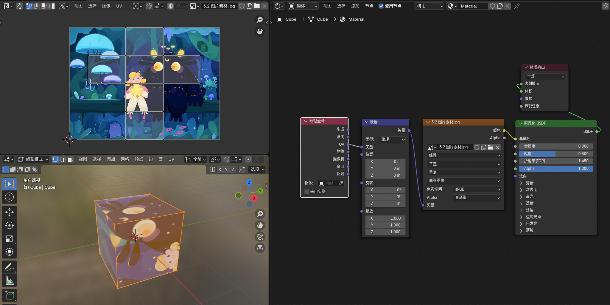

蒙版加纹理，可以用同一个贴图实现不同的效果，蒙版（黑透明白不透明，灰色半透明），可以用黑白图来代替数值的输入

`转换器/混合`

凹凸感纹理需要使用3个部分

+ 一个纹理，一般是黑白灰的纹理贴图，黑色表示凹陷，白色表示凸起，0.5灰色时表示不变
+ 凹凸节点
+ 纹理坐标，映射：做微调，决定怎么映射

**[Node Wangler]** Ctrl+shift+鼠标左键单击，可以快速把一个节点连接到输出上预览

凹凸节点的高度接收一个从0到1的数值（0黑色，1白色，0.5灰色），0.5的时候表示不变，大于0.5凸起，小于则凹陷

凹凸节点制作的凹凸并不是真的凹凸，只是改变了法线，改变光的反射从而让看起来是凹凸的（编辑模式下，打开法线，然后按R，N就可以转动法线）

要真正制作出有形变的凹凸需要使用到置换，(法线贴图是蓝紫色的，因为法线是有方向的在空间中需要三个坐标表示（xyz）在图像上刚好可以用rgb表示，因为法线垂直于切面所以z轴也就是b设置固定为1)

添加置换的方法

+ 使用置换修改器，两种渲染引擎都起作用
+ 使用置换节点，只有cycles渲染引擎起作用

使用置换节点，要开启**置换与凹凸**

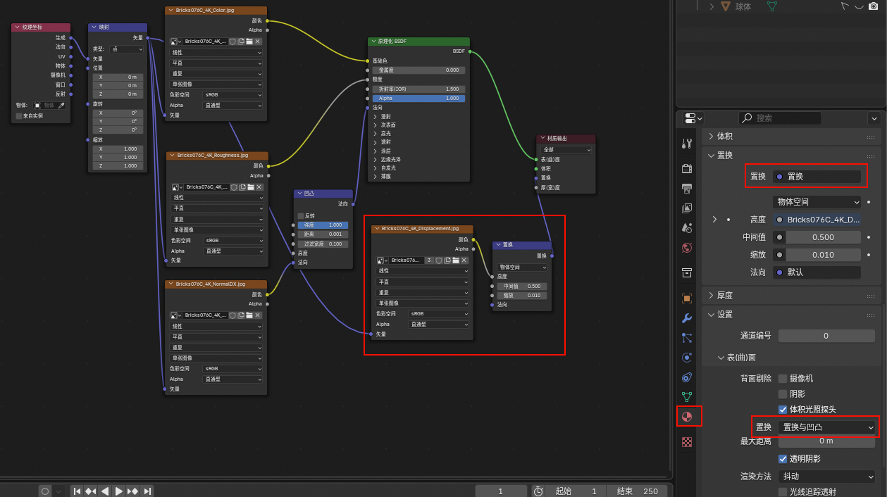

**[Node Wangler]** Ctrl+shift+t（要先选中原理化BSDF节点），可以快速选择颜色贴图、粗糙度贴图、法线贴图、置换贴图（displacement）生成上面的节点

Color结尾的对应颜色--Metalness对应金属--NormalGL对应的法向（还有个DX，这2个应该是凹凸）--Roughness对应糙度--Displacement对应置换深度

AmbientOcclusion对应环境光遮蔽

shift + p可以创建组,解除：选中框按 X

**[Node Wangler]** Ctrl+shift+鼠标拖动接口线到另一个节点可以快捷生成混合节点

**[Node Wangler]** Ctrl+t，快捷生成纹理映射，映射，图像纹理节点

**[Node Wangler]** alt + s,快速交换混合节点入口

### UV纹理绘制

在新建物体的时候默认都会创建一个UV，要自己绘制纹理需要进入纹理绘制模式下，用材质预览方式查看，还需要给物体添加一个进本的着色器，纹理绘制其实就是在一张基础图片下自己绘制图像，所以要增加一个图片纹理节点并创建一个简单的颜色图。

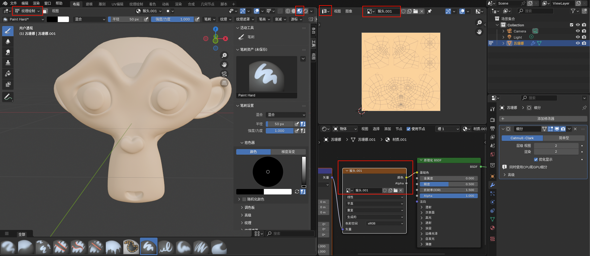

绘制模式下没有擦除工具，可以使用吸管工具吸一下UV里面的颜色（物体上的颜色受光照影响并不是原色），再涂抹上去覆盖掉

在纹理绘制模式下按 N 可以调出工具，F 调节画笔大小，曲线画笔需要按 ctrl + 右键拖拽画完回车，只有油漆桶可以渐变

自建的复杂模型（要把着色器应用上）一般需要自己重新拆UV，在编辑模式下全选按 U 可以选智能拆UV，如果不理想可以`选中一条边按U标记缝合边——全选 U——展开`

### 定点组和置换修改器

在`物体`中添加顶点组，然后选中要设置的顶点点击指定，定点组可以批量设置定点的权重，在权重绘制模式下可以看到各个定点的权重，权重由高到低是`红-黄-绿-蓝`，权重越高受影响越大。在修改器下可以指定顶点组

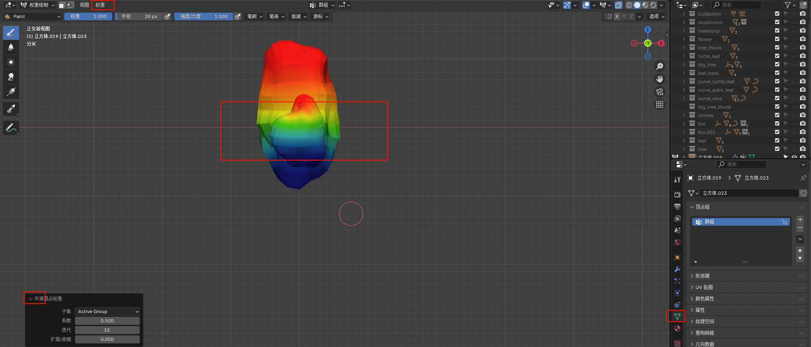

权重的作用：顶点组用于确定修改器在对象上的“作用范围”和“作用强度”，就是通过权重来实现的。

 可以使用`#frame`来获取动画时间帧的值

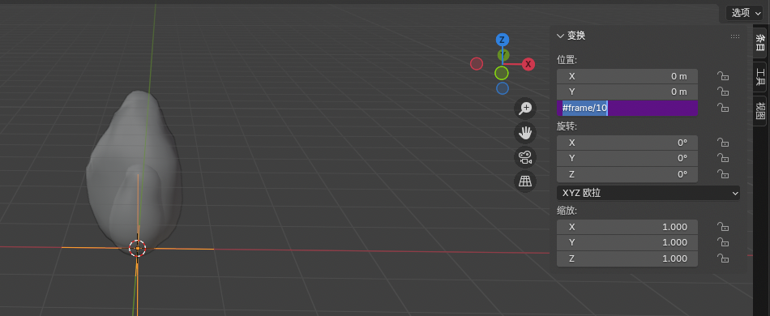

开启辉光的方式，在合成器中创建`滤镜/眩光`节点

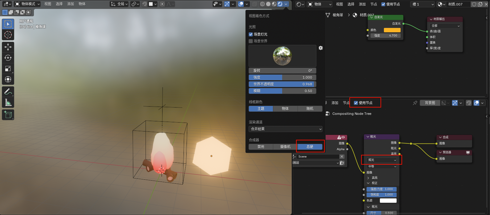

### 布光

光线分为世界环境光和场景灯光

世界环境光也是由着色器节点组成的，可以在着色器界面——世界环境中查看和编辑

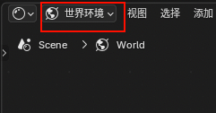

#### 打世界光

1.使用背景节点，也就是默认的那个

2.可以添加天空纹理做世界光

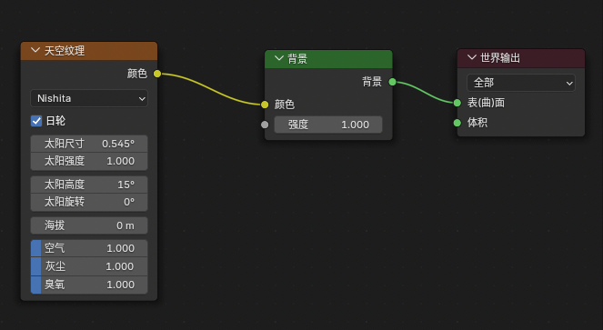

3.使用渐变做世界光（添加渐变纹理是为了更平滑的过渡）

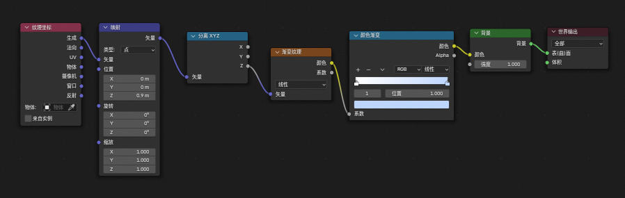

4.用HDRI(全景)贴图做世界光，添加环境纹理并使用HDRI图，在`渲染-胶片-透明`可以把背景隐藏，但是保留光线，添加纹理映射和映射节点可以改变贴图的角度

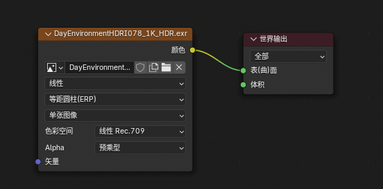

#### 布光workflow

1. 先打世界光，首选确定场景出现的基础环境在哪里，是小黑屋，还是早晨、晚上、中午？
2. 打场景光，常用面光实现

**三点打光法**

+ 主光，将场景中的主要对象照亮，将它凸显出来
+ 辅光，将次要面或阴影照亮
+ 轮廓光，一般从物体背面打过来，形成背光效果凸显物体轮廓，可以将透视阴影关闭从而不对其他光产生影响

### 导入第三方模型

导出blend文件有两种方式关联和追加，可以选择Object目录下模型

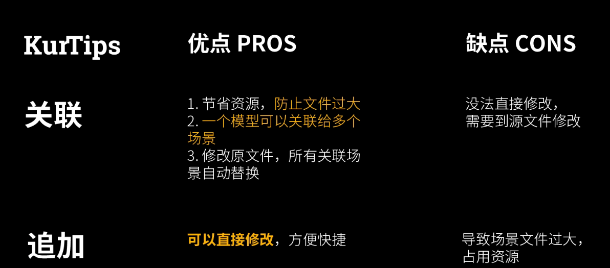

还可以打开一个blend文件选择一个物体 ctrl + c 到另一个blend场景中 ctrl + v

## 动画

### 时间轴动画基础

在属性`输出`栏中可以看到帧率和起始帧，结束。默认是24帧，结束是240，也就是 240 / 24 =10 秒，场景动画一共十秒，可以通过修改这两个值进行时长设置。

按`K`或者`I`可以添加关键帧。关键帧起始就是记录某一时刻下的物体状态数据，当播放动画的时候从当前状态过渡到关键帧记录的状态，也可以对关键帧进行`s`，`g`，`x`，`shift + d`操作

只要是可以设置的属性值都可以添加帧动画，包括材质、纹理、坐标等等，只要将鼠标聚焦到响应的位置按`I`就行

动画的曲线编辑器可以用来编辑动画速度曲线。

### 形态键动画

物体形状修改的动画，在物体数据属性中可以增加形态键。第一个形态键是物体的原始形状，是一个备份。再增加一个键1就可以在这个键上调整物体形态，通过修改键的`相对-值`就可以查看从原始形态到键1形态的形变了。

在做循环动画时可以先给打上一个帧，然后用动画曲线编辑器选中`值`之后添加修改器实现

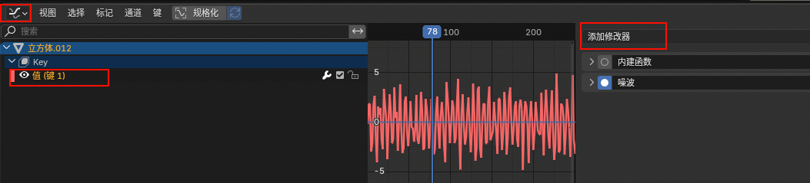

摄像机动画

### 骨骼绑定

在物体模式下新建骨骼和绑定模型，在编辑模式修改骨骼原始形态和位置，挤出（在头部挤出新骨架会成为子集，在头部挤出新骨架会成为兄弟）、细分这些操作依然有效，在姿态模式下摆姿势

要注意子集不能带着父级移动。

物体模式下绑定模型：让模型成为骨架的子集（ctrl + p 选`骨架形变-附带自动权重`）

在给有父级的物体绑定骨骼动画的时候最好先解除父级（alt + p，选保持包换可以避免飞到游标的地方）再绑定，之后再重新加回去，因为要以骨架为父级会和空物体的父级有冲突，所以要先解除空物体的父级。

shift+ctrl+alt+S 缩放柔性骨骼，添加柔性骨骼分段，姿态模式下每段命名BASE、BODY、TOP，解除TOP父级，TOP + BODY 姿态模式下添加约束 ctrl + shift + c 选择拉伸到，选择BODY再骨骼-柔性骨骼下起始控制柄选择绝对—BASE，结束控制柄绝对—BODY，TOP骨骼选项下取消形变，物体模式下绑定物体。

### 物体约束跟随

在物体的`约束`属性中添加`标准跟随`约束可以实现，一个物体跟随另一个物体，约束的`跟随轴`是物体的局部坐标轴，指的是物体的哪个轴要执行跟随的物体，向上就是哪个轴指向上方。

### 合成器

合成器就是给场景或者视频、图片添加特效的工具。在blender中万物都是节点，合成器中也一样是用节点进行编辑的。

**使用**

1. 选择一帧场景将他渲染出来
2. 进入合成器中进行编辑
3. 添加预览器节点

shift + 鼠标右键划连接线可以增加接口，m启用和关闭节点，v缩小预览

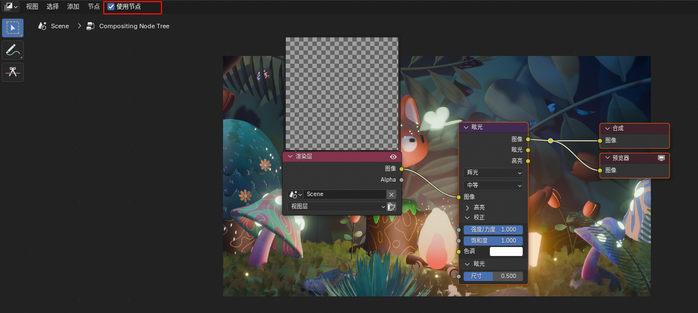

### 渲染输出视频

可以先输出帧图片，然后再将图片合成成视频，这样如果blender崩溃了还可以再崩溃的时候从上次的位置继续渲染。设置好渲染参数之后可以选 `渲染/渲染动画`。

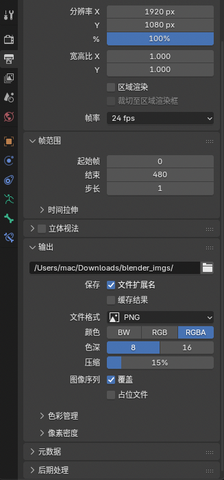

然后通过 blender 的视频编辑就可以合成视频了，渲染动画即可

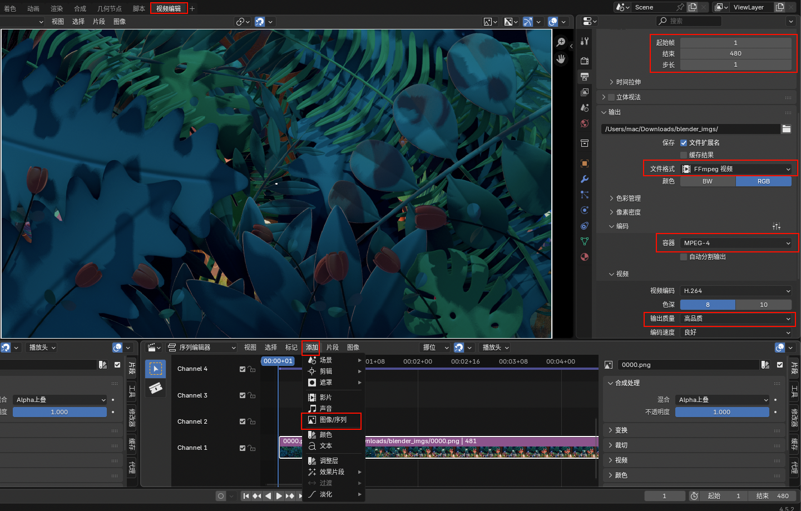

如果在新场景中渲染时显示的是上次的图像场景，可以检查一下视频编辑中是否还有上次的视频内容，如果是就把它删掉就好

# 快捷键

## 搜索功能

通过 F3 可以快速搜索出想要的功能

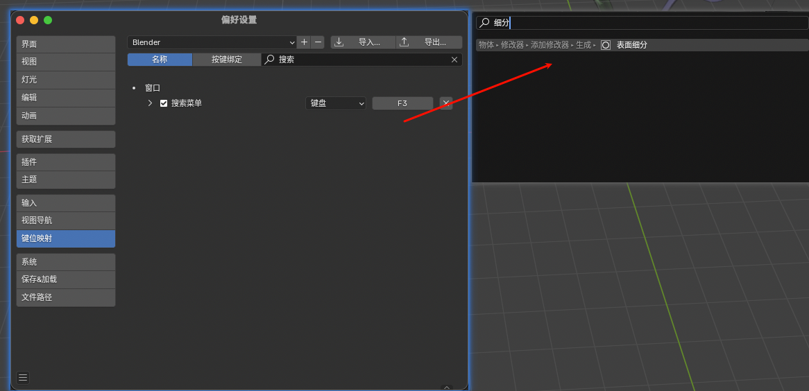

## 通用( 大多数窗口类型 )

| 工具栏                     | T                                   |
| :------------------------- | :---------------------------------- |
| 属性栏                     | N                                   |
| 添加物体/节点              | Shift \+ A                          |
| 删除                       | X *或* Delete                       |
| 搜索                       | F3                                  |
| 移动                       | G                                   |
| 缩放                       | S                                   |
| 旋转                       | R                                   |
| 沿全局坐标轴旋转           | R *然后* X/Y/Z                      |
| 沿局部坐标轴旋转           | R *然后* X,X/Y,Y/Z,Z                |
| 轨迹球旋转                 | R, R                                |
| 精确移动                   | Shift ( *按住* )                    |
| 增量移动                   | Ctrl ( *按住* )                     |
| 复制                       | Shift \+ D                          |
| 链接复制                   | Alt \+ D                            |
| 隐藏                       | H                                   |
| 取消隐藏全部               | Alt \+ H                            |
| 只显示选中部分( 隐藏其他 ) | Shift \+ H                          |
| 注释                       | D ( *按住* ) \+ 鼠标左键 ( *拖动* ) |
| 擦除注释                   | D ( *按住* ) \+ 鼠标右键 ( *拖动* ) |
| 快速收藏夹                 | Q                                   |

## 导航 ( 3D 视图 )

| 旋转视图 | 鼠标中键                   |
| :------- | :------------------------- |
| 平移     | Shift \+ 鼠标中键          |
| 缩放     | 滚轮 *或* Ctrl \+ 鼠标中键 |
| 飞行导航 | Shift \+ \~                |

## 查看 ( 3D 视图 )

数字键盘视图:

|                |     / 独立显示      |                |
| :------------: | :-----------------: | :------------: |
|  **7 顶视图**  |       8 向上        |   9 对向视图   |
|     4 向左     | **5 透视/正交切换** |     6 向右     |
|  **1 前视图**  |       2 向下        |  **3 右视图**  |
| **0 相机视图** |                     | **. 聚焦选中** |

| 视图切换菜单 | \~                         |
| :----------- | :------------------------- |
| 快速视图切换 | Alt \+ 鼠标中键 ( *拖动* ) |
| 显示所有物体 | Home                       |
| 聚焦区域     | Shift \+ B                 |

## 物体模式 ( 3D 视图 )

| 交互模式菜单               | Ctrl \+ TAB                                      |
| :------------------------- | :----------------------------------------------- |
| 编辑/物体模式切换          | TAB                                              |
| 镜像                       | Ctrl \+ M *然后* X/Y/Z ( 或鼠标中键 *( 拖动 ) )* |
| 设置父级                   | Ctrl \+ P                                        |
| 清除父级                   | Alt \+ P                                         |
| 吸附开关                   | Shift \+ TAB                                     |
| 清除位置                   | Alt \+ G                                         |
| 清除旋转                   | Alt \+ R                                         |
| 清除缩放                   | Alt \+ S                                         |
| 应用变换（位置/旋转/缩放） | Ctrl \+ A                                        |
| 合并物体                   | Ctrl \+ J                                        |
| 复制属性到新物体           | Ctrl \+ L                                        |
| 添加细分等级               | Ctrl \+ 0/1/2/3/4/5                              |
| 区域遮罩视图/清除遮罩      | Alt \+ B                                         |
| 吸附3D游标到世界原点       | Shift \+ C                                       |
| 将活动物体移至集合         | M                                                |
| 移动活动摄像机至当前视角   | Ctrl \+ Alt \+ 数字键盘 0                        |
| 设置活动摄像机             | Ctrl \+ 数字键盘 0                               |

## 普通选择 ( 大多数窗口类型 )

| 选择                     | 鼠标左键         |
| :----------------------- | :--------------- |
| 全选                     | A                |
| 取消选择所有             | Alt \+ A         |
| 框选                     | B                |
| 刷选                     | C                |
| 套索选择                 | Ctrl \+ 鼠标右键 |
| 反选                     | Ctrl \+ i        |
| 选择相连元素             | Shift \+ L       |
| 选择相似元素（按组选择） | Shift \+ G       |
| 选择特定物体             | Alt \+ 鼠标左键  |

## 着色 ( 3D 视图 )

| 着色方式菜单 | Z        |
| :----------- | :------- |
| 透视模式     | Alt \+ Z |

## 菜单

| 轴心点菜单         | .          |
| :----------------- | :--------- |
| 吸附菜单（3D游标） | Shift \+ S |
| 坐标系方向菜单     | ,          |

## 选择 ( 编辑模式 )

| 选择所有相连元素         | Ctrl \+ L               |
| :----------------------- | :---------------------- |
| 选择光标下的所有相连元素 | L                       |
| 选择 边/面 循环          | Alt \+ 鼠标左键         |
| 选择边环                 | Ctrl \+ Alt \+ 鼠标右键 |
| 顶点选择模式             | 1                       |
| 边选择模式               | 2                       |
| 面选择模式               | 3                       |
| 选择镜像                 | Ctrl \+ Shift \+ M      |
| 加选/减选                | Ctrl \+/-               |
| 边线折痕                 | Shift \+ E              |

## 曲线编辑 ( 编辑模式 )

| 添加新控制柄   | E *或* Ctrl \+ 鼠标右键 |
| :------------- | :---------------------- |
| 设置控制柄类型 | V                       |
| 删除但保持连接 | Ctrl \+ X               |
| 切换闭合       | Alt \+ C                |
| 倾斜           | Ctrl \+ T               |
| 清除倾斜       | Alt \+ T                |

## 建模 ( 编辑模式 )

| 挤出                   | E                         |
| :--------------------- | :------------------------ |
| 内插                   | i                         |
| 倒角                   | Ctrl \+ B                 |
| 顶点倒角               | Ctrl \+ Shift \+ B        |
| 循环切割               | Ctrl \+ R                 |
| 滑动 顶点/边           | G,G                       |
| 切割                   | K                         |
| 填充面                 | F                         |
| 切变                   | Ctrl \+ Shift \+ Alt \+ S |
| 弯曲                   | Shift \+ W                |
| 拆分                   | Y                         |
| 断离                   | V                         |
| 断离填充               | Alt \+ V                  |
| 合并                   | M                         |
| 重新计算法线           | Shift \+ N                |
| 重新计算法线（向内）   | Ctrl \+ Shift \+ N        |
| 衰减编辑 开/关         | O                         |
| 衰减编辑的衰减方式     | Shift \+ O                |
| 将选定内容分离到新对象 | P                         |

## 纹理 ( 编辑模式 )

| UV映射     | U         |
| :--------- | :-------- |
| 标记缝合边 | Ctrl \+ E |

## UV 编辑器

| 选择孤岛       | L ( *光标下* ) 或 Ctrl \+ L |
| :------------- | :-------------------------- |
| 断离           | V                           |
| 对齐           | Shift \+ W                  |
| 钉固           | P                           |
| 取消钉固       | Alt \+ P                    |
| 选择已钉固顶点 | Shift \+ P                  |

## 图像编辑器 ( 视图 )

| 属性、作用域、槽和元数据 | N              |
| :----------------------- | :------------- |
| 以 100% 比例查看         | 1 ( 数字键盘 ) |
| 视图适配                 | Shift \+ Home  |
| 下一个渲染槽             | J              |
| 上一个渲染槽             | Alt \+ J       |
| 选择渲染槽               | 1-8            |
| 保存图像                 | Alt \+ S       |
| ==图片另存为==           | Shift \+ S     |

## 图像编辑器 ( 绘制 )

| 创建一个新图像 | Alt \+ N   |
| :------------- | :--------- |
| 打开图像       | Alt \+ O   |
| 笔刷属性       | N          |
| 笔刷尺寸       | F          |
| 笔刷强度       | Shift \+ F |
| ==样品颜色==   | S          |
| 翻转颜色       | X          |

## 节点（材质/合成器）

| 断开连接                                    | Ctrl \+ 鼠标右键 ( *拖动* )  |
| :------------------------------------------ | :--------------------------- |
| 添加转接点                                  | Shift \+ 鼠标右键 ( *拖动* ) |
| 所选项添加框（5.0）/连接所选节点（5.0之前） | F                            |
| 特性                                        | N                            |
| 删除所选内容但保持连接                      | Ctrl \+ X                    |
| 复制所选内容并保持连接                      | Ctrl \+ Shift \+ D           |
| 静音所选内容                                | M                            |
| 创建节点组                                  | Ctrl \+ G                    |
| 取消所选节点组                              | Ctrl \+ Alt \+ G             |
| 编辑组（切换）                              | TAB                          |
| ==帧选定节点==                              | Ctrl \+ J                    |
| 显示/隐藏非活动节点槽                       | Ctrl \+ H                    |

### 合成器

| 移动背景图 | Alt \+ 鼠标中键 |
| :--------- | :-------------- |
| 缩放背景图 | V / Alt \+ V    |
| 特性和性能 | N               |

## 雕刻模式

| 反向笔刷          | Ctrl ( 在雕刻时 ) |
| :---------------- | :---------------- |
| 笔刷尺寸          | F                 |
| 笔刷强度          | Shift \+ F        |
| 笔刷选择          | Shift \+ Space    |
| 遮罩（笔刷）      | M                 |
| 抓取（笔刷）      | G                 |
| 充气/放气（笔刷） | i                 |
| 反向遮罩          | Ctrl \+ i         |
| 清除遮罩          | Alt \+ M          |
| 遮罩编辑菜单      | A                 |
| 面组编辑菜单      | Alt \+ W          |
| 隐藏活动面组      | H                 |

## 渲染

| 渲染                     | F12              |
| :----------------------- | :--------------- |
| 渲染动画                 | Ctrl \+ F12      |
| 查看渲染动画             | Ctrl \+ F11      |
| 设置渲染区域             | Ctrl \+ B        |
| 清除渲染区域（全局渲染） | Ctrl \+ Alt \+ B |

## 动画

| 播放/暂停            | Space                  |
| :------------------- | :--------------------- |
| 倒放                 | Ctrl \+ Shift \+ Space |
| 滚动浏览帧           | Alt \+ 滚轮            |
| 上/下 一帧           | 左/右 箭头             |
| 第一帧/最后一帧      | Shift \+ 左/右 箭头    |
| 跳转至关键帧         | 上/下 箭头             |
| 在当前帧上添加关键帧 | i                      |
| 删除当前帧的关键帧   | Alt \+ i               |

### 动画（时间线/动画摄影表/曲线编辑器）

| 切换 曲线编辑器/动画摄影表 | Ctrl \+ TAB                  |
| :------------------------- | :--------------------------- |
| 切换 帧/秒                 | Ctrl \+ T                    |
| 缩放以适应活动关键帧       | Home *或* . ( 数字键盘 )     |
| 设置关键帧插值模式         | T                            |
| 设置关键帧控制柄类型       | V                            |
| 设置函数曲线外插           | Shift \+ E                   |
| 镜像关键帧                 | Ctrl \+ M                    |
| 设置预览范围               | P *然后* 鼠标左键 ( *拖动* ) |
| 自动设置预览范围           | Ctrl \+ Alt \+ P             |
| 清除预览范围               | Alt \+ P                     |
| 时间标记                   | M                            |
| ==重命名标记==             | Ctrl \+ M                    |
| 为选定摄像机添加时间标记   | Ctrl \+ B                    |
| 选择当前帧前/后的关键帧    | \[ / \]                      |
| 选择当前帧上的所有关键帧   | Ctrl \+ K                    |

### 曲线编辑器

| 在光标处添加关键帧 | Ctrl \+ 鼠标右键 |
| :----------------- | :--------------- |
| 属性与修改器       | N                |
| 切换通道的可编辑性 | TAB              |

## 骨骼 ( 绑定 )

| 添加骨骼     | E                |
| :----------- | :--------------- |
| 复制骨骼     | Shift \+ D       |
| 切换骨骼设置 | Shift \+ W       |
| 扭转         | Ctrl \+ R        |
| 清除扭转     | Alt \+ R         |
| 重算扭转     | Shift \+ N       |
| 骨骼对齐     | Ctrl \+ Alt \+ A |
| 切换骨骼方向 | Alt \+ F         |
| 融并骨骼     | Ctrl \+ X        |
| 拆分         | Y                |
| 分离         | P                |
| 选择层级     | \] *和* \[       |

## 姿态模式

| 添加关键帧           | i                  |
| :------------------- | :----------------- |
| 清除位置             | Alt \+ G           |
| 清除旋转             | Alt \+ R           |
| 清除缩放             | Alt \+ S           |
| 应用姿态             | Ctrl \+ A          |
| 传导姿态             | Alt \+ P           |
| 从补间姿态推移姿态   | Ctrl \+ E          |
| 松弛姿态到补间姿态   | Alt \+ E           |
| 姿态补间器           | Shift \+ E         |
| 复制姿态             | Ctrl \+ C          |
| 粘贴姿态             | Ctrl \+ V          |
| 添加IK               | Shift \+ i         |
| ==添加姿态到姿态库== | Shift \+ L         |
| 粘贴已翻转姿态       | Ctrl \+ Shift \+ V |
| 添加约束             | Ctrl \+ Shift \+ C |

## 窗口通用（大多数窗口类型）

| 工具栏                     | T                    |
| :------------------------- | :------------------- |
| 属性栏                     | N                    |
| 最大化区域（但保留工具栏） | Ctrl \+ Space        |
| 全屏区域                   | Ctrl \+ Alt \+ Space |
| 四视图                     | Ctrl \+ Alt \+ Q     |

### 更改窗口类型（在光标下）

| 影片剪辑     | Shift \+ F2  |
| :----------- | :----------- |
| 节点         | Shift \+ F3  |
| Python控制台 | Shift \+ F4  |
| 3D视图       | Shift \+ F5  |
| 曲线         | Shift \+ F6  |
| 属性         | Shift \+ F7  |
| 视频序列     | Shift \+ F8  |
| 大纲视图     | Shift \+ F9  |
| UV/图像      | Shift \+ F10 |
| 文本         | Shift \+ F11 |
| 动画摄影表   | Shift \+ F12 |

