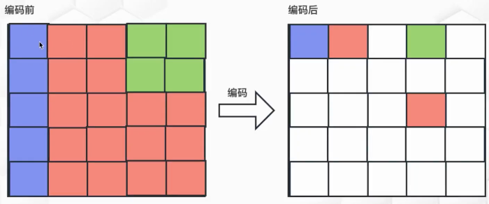
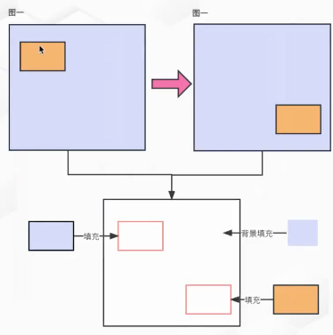
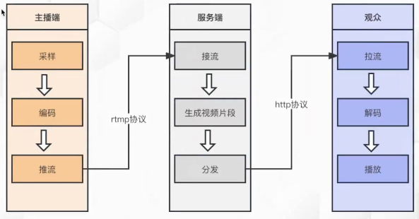
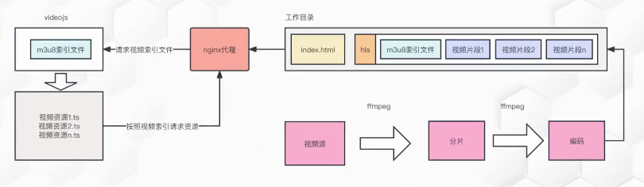

## HTML5的视屏

如何判断一个元素是否支持一个标签？

判断标签元素上是否存在必要的属性，比如`video`标签上是否有`canPlayType`属性

```js
if(document.createElement("video").canPlayType){
  console.log("支持")
}else{
  console.log("不支持")
}
```

如果不支持`video`标签，应该如何提升用户体验

```html
<video src="test.mp4">
  <embed src="test.mp4"></embed>
</video>
```


## 基本概念

+ fps：是指画面每秒传输帧数，通俗来讲就是指动画或视频的画面数
+ 分辨率：水平方向上包含的像素点 x 垂直方向上包含的像素点
+ 码率：视频或者音频单位时间内传递的数据量

### 每帧采集画面的大小如何计算？

```
1帧的采集的大小 = 分辨率 x 24
```

因为一个像素点包含3个数据分别为`r、g、b`，每个数据站一个字节大小，每个字节又等于 8 位，所以1帧上有 `分辨率 x 24 bit` 的数据

### fps、分辨率、码率的关系

+ 帧率越高，每秒经过的画面越多，需要的码率也越高，体积也越大
+ 在码率一定的情况下，分辨率与清晰度成反比关系，分辨率越高图像越不清晰，反之越清晰
+ 在分辨率一定的情况下，码率与清晰度成正比关系，码率越高图像越清晰，反之越不清晰

### 引起画面卡顿的原因有哪些？

设备性能低、网络不好、FPS过低、帧率低、码率小

### 视频编码解码技术原理

所谓的编码算法，就是寻找规律构建一个高效模型，将视频数据中冗余的信息去除，一般的编码方式有两种，根据当前帧图片的帧内编码，根据不同帧进行对比的帧间编码（丢帧的情况下可能会出现卡顿和马赛克的情况）

帧内编码



帧间编码




###  直播推拉流



