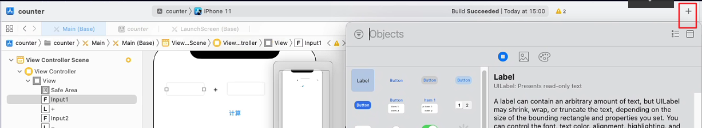

## IOS原生开发

在IOS原生开发中，使用的语言是Objective-c，使用的UI框架是 UIKit 

## 创建IOS项目

使用xcode来创建项目


创建出来的项目如上图所示，在页面的左边是项目文件的目录结构，其中

+ `ViewController` 是项目视图的根管理类，用于管理根页面中所有的东西，包含按钮，文本等各个组件以及与用户的交互
+ `main.storyboard`是一个可视化拖动布局界面，在这个页面可以通过拖拽的方式给页面创建组件和添加绑定事件
+ `Assets`是项目的图片目录，项目中要使用到图片需要将拖到这个目录下
+ `LaunchScreen`是应用的启动页配置的地方
+ `info`是项目中一血基础信息的配置
+ `main.m`是项目的入口文件

然后第二块区域就是`main.storyboard`的拖动布局页面，第三块内容就是与当前布局页面相关联的页面文件，可以右上角的 `list->Assistant`打开


storyBoard 默认是与 ViewController 进行绑定的，当我们编辑 `storyBoard`的时候默认打开的代码就是根的 ViewController 如果需要修改可以在导航中选择自己的类


第四块内容就是UIView相关的信息配置了

在第四块内容顶部的左边的 `+`通过双击或拖拽可以快速在当前页面创建对应的UIView。




## 绑定事件和属性

通过拖拽的方式来完成把布局之后，我们还需要获取到相关的元素和给元素绑定事件，才能完成功能开发。

先选中要注册或要绑定事件的的元素，然后按住`ctrl`键，将它和代码进行连线，从而使他们能够联系起来，并自动生成代码（与定义相连，不是实现）


在生成代码的时候，connection为`outlet`表示定义（注册）属性，在绑定属性的时候`storage`一般都是设置成`weak`，因为 view 和 viewController 有一个互为引用的关系。`action`表示绑定事件，`arguments`是传入的参数，可以在信息中的tag传入信息


也可以先定义好代码之后再进行连线


**需要注意的是**，出现***This class is not key value coding-compliant for the key resultLabel.***，的报错一般都是因为，拖线后@property代码、事件处理方法被删除了。所以在删除来了代码后，UIView 的联系也要删除


```objc
#import "ViewController.h"

//一般都是定义私有的
@interface ViewController ()
- (IBAction)compute;
@property (weak, nonatomic) IBOutlet UITextField *input1;
@property (weak, nonatomic) IBOutlet UITextField *input2;
@property (weak, nonatomic) IBOutlet UILabel *resText;

@end

@implementation ViewController

- (void)viewDidLoad {
    [super viewDidLoad];
    // Do any additional setup after loading the view.
}


- (IBAction)compute {
    NSString *value1 = self.input1.text;
    NSString *value2 = self.input2.text;
    
    int num1 = [value1 intValue];
    int num2 = value2.intValue;
    
    int res = num1 + num2;
    
    self.resText.text = [NSString stringWithFormat:@"%d",res];
}
@end
```

### **IBAction和IBOutlet究竟有什么作用**

**IBAction**

从返回值角度上看，作用相当于void，只有返回值声明为IBAction的方法，才能跟storyboard中的控件进行连线

**IBOutlet**

只有声明为IBOutlet的属性，才能跟storyboard中的控件进行连线

### **Storyboard文件中箭头的含义**

程序的入口.新建一个ViewController后，设置***Is Initial View Controller***属性来让当前View Controller为默认启动项。

### **如何更换storyboard文件**

 项目 ->  General -> Deployment Info -> 改变Main.storyboard


### **如何退出键盘？**

1. `[第一响应者 resignFirstResponder];`，当叫出键盘的那个控件(第一响应者)调用这个方法时，就能退出键盘
2. `[self.view endEditting:YES]` 只要调用这个方法的控件内部存在第一响应者，就能退出键盘

Company Identifier和Bundle Identifier的作用


## IOS 的基本架构

### view和viewController

**UIView**

+ 屏幕上能看得见摸得着的东西就是UIView，比如屏幕上的按钮、文字、图片
+ 一般翻译叫做：视图\控件\组件
+ UIButton、UILabel、UITextField都继承自UIView
+ 每一个UIView都是一个容器，能容纳其他UIView（比如右图中的整个键盘是一个UIView，里面容纳很多小格子的数字UIView）

**UIViewController**

每一个新的界面都是一个新的UIView，在切换过程中，涉及到了UIView的创建和销毁，UIView与用户的交互，其实每当显示一个新的页面时，首先会创建一个新的 UIViewController 对象，然后创建一个对应的全屏UIView，UIViewController负责管理这个UIView，UIViewController 就是UIView的大管家

+ 负责创建、显示、销毁UIView，负责监听UIView内部事件，负责处理UIView与用户的交互
+ UIViewController内部有个UIView属性，就是它负责管理的UIView对象

***UIView与UIViewController的关系***

+ UIView只负责对数据的展示，采集用户的输入、监听用户的事件等
+ 其他的操作比如：每个UIView的创建、销毁、用户触发某个事件后的事件处理程序等这些都交给UIViewController来处理


## IOS应用的运行流程

1. 读取Main.storyboard文件
2. 创建的ViewController对象
3. 根据storyboard文件中描述创建ViewController的UIView对象
4. 将UIView对象显示到用户眼前


## 设置UIView的位置和大小

```objc
- (IBAction)change:(UIButton *)sender {
  	NSLog(@"%@"，sender.tag);//UIView 在info中绑定的tag
    CGRect btnFrame = self.headBtn.frame;
    btnFrame.origin.y -= 10;
  	btnFrame.size.width = 100;
    self.headBtn.frame = btnFrame;
}
```

OC 语法规定： **不允许直接修改对 象的结构体属性的成员**

```objc
self.headBtn.frame.origin.y -= 10;
```

frame 其实就是一个 `CGRect`，可以改变大小和位置，其实还有两个东西可以修改对象的位置和大小

+ `center`，是一个`CGPoint`，可以修改UIView的位置，不过这个位置是UIView的中心点
+ `bounds.size`，是一个`CGSize`，可以修改UIView大小


## UIView控件的常用属性方法

### 常用属性

`self`：指的是 ViewController

`subviews`：子view数组

```objc
self.view.subviews[0].backgroundColor = [UIColor redColor];
```

`superview`：父view

```objc
self.input1.superview.backgroundColor = [UIColor yellowColor];
```

`frame`获取view的大小和位置

```objc
CGRect frame = self.button.frame;
frame.origin.x;
frame.origin.y;
frame.size.width;
frame.size.height;
```

`center`获取view的中心点位置

```objc
CGPoint center = self.button.center;
center.x;
center.y;
```

`bounds`获取view大小，也有坐标x ，y不过都为0

```objc
CGRect bounds = self.button.bounds;
bounds.width;
bounds.height;
```

`tag` view标志，可以用来区分不同的view

```objc
button.tag = 100;
```

`userInteractionEnabled`设置View是否可以进行交互

```objc
self.button.userInteractionEnabled = NO
```


### 常用方法

`addSubview` 添加子控件

```objc
self.view.addSubview(button);
```

`removeFromSuperview` 从父控件删除

```objc
[button removeFromSuperview];
```

`viewWithTag` 如果给View设置了`tag`属性，就可以通过这个属性来查找到对应的View

```objc
UIButton *button = (UIButton *)[self.view viewWithTag:100];
```

`addTarget` 为view 添加事件

```objc
// self表示你 参数中所加的方法（farmImage：）是加到button本身的
// handleClick 是当前ViewController中的方法
[button addTarget:self action:@selector(handleClick) forControlEvent:UIControlEventTouchUpInside]
-(void)handleClick{NSLog(@"click handle")}

// 如果要传递参数可以将参数绑定或者设置在 view 上，因为在绑定的方法中会将当前view传入
button.tag = 100;
[button addTarget:self action:@selector(handleClick:) forControlEvent:UIControlEventTouchUpInside];
//---------------------------------------------
-(void)handleClick:(id)sender{//sender 就是button
  int tag = sender.tag;
  NSLog(@"click handle tag",tag);
}
```

`bringSubviewToFront` 将子view放到最顶层

```objc
[self.view bringSubviewToFront:self.button];
```


## 动态创建控件

可以通过代码的方式动态创建控件，`UIView`也是一个控件，不过这个控件是空白的，一般用来做容器使用

```objc
UIView *cont = [UIView new];
UIButton *button = [UIButton new];
[cont addSubview:button];
```

```objc
#import "ViewController.h"
@interface ViewController ()
@end
@implementation ViewController
// 当要显示一个页面的时候，首先创建这个界面对应的控制器
// 控制器创建好以后，接着创建控制器所管理的个View，当这个View加载完成之后就开始执行 viewDidLoad 方法
// 所以只要viewDidLoad方法执行，就表示控制器所管理的view创建好了
- (void)viewDidLoad{
	[super viewDidLoad];
	
	//创建控件 按钮
	UIButton *button = [[UIButton alloc] init];
	//设置文本和状态，使用默认状态
	[button setTitle:@"click me" forState:UIControlStateNormal];
	//高亮状态下的按钮
	[button setTitle:@"light" forState:UIControlStateHighlighted];
	
	//设置文本颜色
	[button setTitleColor:[UIColor redColor] forState:UIControlStateNormal];
	
	//设置默认状态下按钮的背景,会在 Assets.中查找
  //如果图片是 png 就可以省略后缀
	UIImage *imgNormal = [UIImage imageNamed:@"btn_01"];
	UIImage *imgLight = [UIImage imageNamed:@"btn_02"];
	[button setBackgroundImage:imgNormal forState:UIControlNormal];
	[button setBackgroundImage:imgLight forState:UIControlStateHighlighted];
	
	//设置控件的大小位置
	button.frame = CGRectMake(10,10,50,50);
	
	//为控件添加事件
	[button addTarget:self action:@selector(handleClick) forControlEvent:UIControlEventTouchUpInside]
	
	//将控制器添加到 view
	[self.view addSubView:button];
}
- (void)handleClick{
	NSLLog(@"click button");
}
@end
```


## 平移

```objc
//相对于原来位置
self.button.transform = CGAffineTransformMakeTranslation(0,-50);//向上平移
//相对于原来的transform进行平移
self.button.transform = CGAffineTransformTranslate(self.button.transform,0,50);//向下平移
```

**注意：** `transform`相对于原来位置时，如果联系执行上面代码两次，button不会上移 100 ，因为本来就已经是 50 了。相对于原来的transform进行平移则可以移动100


## 加载文件

### 加载`.plist`文件

在加载文件的时候，必须要传递一个路径的参数，如果传递的是一个文件名就会默认在`Assets`目录中找，如果传递一个绝对路径就会在指定的绝对路径中找。

ios应用是被安装到不用手机使用的，所以他们的根目录是不确定的，所以我们在读取项目中文件的时候需要先获取当前项目的根路径，通过`[NSBundle mainBundle];`可以获取到项目根路径

```objc
// 懒加载 + 缓存
- (void)data{
  if(_data == nil){
    NSString *path = [[NSBundle mainBundle] pathForResource:@"data.plist" ofType:nil];
    NSArray *arr = [NSArray arrayWithContentsOfFile:path];
    _data = arr;
  }
  return _data;
}
```

### 加载 Image 图片

加载图片有两种方式

使用`[UIImage imageNamed:imgName]`

```objc
//如果图片是 png 就可以省略后缀，会在Assets中查找img.png
UIImage img = [UIImage imageNamed:@"img"];
```

这种方式的特点是，加载进来的图片**会被缓存起来，不会被释放**

第二中方式是使用`[UIImage imageWithContentsOfFile:path]`，其中 path 一般都是绝对路径

```objc
NSString *path = [[NSBundle mainBundle] pathForResource:@"img" ofType:nil];
UIImage img = [UIImage imageWithContentsOfFile:path];
```

这种方式图片就不会被缓存，在加载完之后就会释放内存，下次新的数据就可以使用这块内存了


## 动画

### 简易动画

简易动画大致有2种方式

头尾式

```objc
[UIView beginAnimations:nil context:nil]; // 开启动画
[UIView setAnimationDuration:1]; // 设置动画执行时间
/** 需要执行动画的代码 **/
self.headBtn.frame = btnFrame;
[UIView commitAnimations]; // 提交动画
```

block式

```objc
[UIView animateWithDuration:0.5 animations:^{
    /** 需要执行动画的代码 **/
  self.headBtn.frame = btnFrame;
}];
```


### 帧动画

帧动画相关属性和方法，要使用 `UIImageView`作为控件

```objc
// 要播放的序列帧图片数组
@property(nonatomic,copy) NSArray *animationImages;
// 持续时间
@property(nonatomic) NSTimeInterval animationDuration;
// 重复次数
@property(nonatomic) NSInteger animationRepeatCount;

// 开始播放
-(void)startAnimating;
// 停止动画
-(void)stopAnimating;
// 是否正在播放动画
-(void)isAnimating;
```

```objc
-(void)animate{
  NSMutableArray *imgs = [];
  for(int i = 0;i < 11;i++){
    NSString *name = [NSString stringWithFormat:@"img_%02d",i];
    NSString *path = [[NSBundle mainBundle] pathForResource:name ofType:nil];
    UIImage img = [UIImage imageWithContentsOfFile:path];
    [imgs addObject:img];
  }
  self.frameImage.animationImages = imgs;
  self.frameImage.animationDuration = 3;
  self.frameImage.animationRepeatCount = 1;
  
  [self.frameImage startAnimating];
  
  //动画执行完成之后要修改存储图片的数组
  [self.frameImage performSelector:@selector(setAnimationImages:) withObject:nil afterDelay:3]
}
```


## xib 和 storyBoard

创建自定义组件的方式有两种，一种是通过代码直接创建，一种是通过 xib 可视化创建

比如我们要创建一个头像组件`Avatar`


### 准备工作

创建一个专门用来存储数据的类，这样就可以有提示，并且明确知道数据的结构

创建`MYAvatarModel.h`和`MYAvatarModel.m`

```objc
// MYAvatar.h
#import <UIKit/UIKit.h>
#import <Foundation/Foundation.h>
NS_ASSUME_NONNULL_BEGIN
@interface MYAvatarModel : NSObject
@property(nonatomic,copy) NSString *name;
@property(nonatomic,copy) NSString *icon;
-(instancetype)initWithDict:(NSDictionary *)dict;
+(instancetype)avatarWithDict:(NSDictionary *)dict;
@end
NS_ASSUME_NONNULL_END
```

```objc
// MYAvatar.m
#import "MYAvatar.h"
@implementation MYAvatar
-(instancetype)initWithDict:(NSDictionary *)dict{
  if(self = [super init]){
    self.name = dict[@"name"];
    self.icon = dict[@"icon"];
  }
  return self;
}
+(instancetype)avatarWithDict:(NSDictionary *)dict{
  return [[self alloc] initWithDict:dict];
}
@end
```

通过字典数组创建model

```objc
NSDictionary *data = @{@"name":@"jack",@"icon":@"avatar"};
MYAvatarModel *model = [MYAvatarModel avatarWithDict:data];
```


### 通过代码直接创建

这种方式需要我们直接通过代码来创建各种小的控件，然后添加到一个容器 UIView 中

```objc
UIView *container = [UIView new];
UIImage *image = [UIImage new];
UILabel *label = [UIImage new];
[container addSubview:image];
[container addSubview:label];
```

只会我们还要为各个容器设置位置大小，各种属性等等，是相当麻烦的。

### 通过xib 创建组件

xib 和 storyBoard 一样都是用来描述软件界面的文件，不同的是 xib 是一个比较轻量级的view描述文件，适合用来写组件。而 storyBoard  是一个比较重的页面描述文件，适合用来做页面，以及页面的跳转关系。

xib 也可以进行可视化的开发，在加载 xib 的时候，系统会自动生成对应的代码来创建组件。

因为要区分自己的类和系统的类，避免重名，我们使用前缀进行规范，

所以我们创建一个新的 xib 文本，可以在xcode进行创建


创建之后我们就可以通过可视化的形式创建组件


> 刚拖拽出来的组件可以无法修改大小可以在 设置size 为 freedom
>
> 


定义类文件与xib相关联，默认是与根容器的类进行关联的，因为我们的组件容器是一个 UIView，所以默认关联的类是 UIView，所以我们自定义的类必须要要继承 UIView，我们定义同名的类`MYAvatarView.h  MYAvatarView.m `，并进行关联


之后就可进行拖线关联了，并实现这个类

```objc
// MYAvatarView.h
#import <UIKit/UIKit.h>
@class MYAvatarModel;
NS_ASSUME_NONNULL_BEGIN

@interface MYAvatarView : UIView
@property(nonatomic,strong) MYAvatarModel *model;
@end

NS_ASSUME_NONNULL_END
```

```objc
// MYAvatarView.m
#import "MYAvatarView.h"
#import "MYAvatarModel.h"

@interface MYAvatarView ()
@property (weak, nonatomic) IBOutlet UIImageView *icon;
@property (weak, nonatomic) IBOutlet UILabel *name;
@end

@implementation MYAvatarView
 
- (void)setModel:(MYAvatarModel *)model{
    _model = model;
    self.icon.image = model.icon;
    self.name.text = model.icon;
}

@end
```

通过xib创建每个组件之后就需要通过动态加载xib文件创建里面的view，首先需要获取到根目录，之后在应用程序根目录下搜索对应的xib(打包出来的是nib)文件

```objc
NSBoundle *rootBundle = [NSBundle mainBundle];
// 在一个xib文件中可以定义多个组件，所以这里loadNibNamed返回的是一个数组，所以我们要拿到唯一的一个才是我们定义的 view
// 因为我们的根容器是一个 UIView 所以需要用一个 UIView 的指针来接受
// 但是我们的xib与 MYAvatarView 进行关联，所以实际返回的是 MYAvatarView
MYAvatarView *appView = [[rootBundle loadNibNamed:@"MYAvatarView" onwner:nil options:nil] lastObject];

appView.model = model;
```


## 项目目录管理

如果项目有很多文件的话，我们可以建立一个专门的组来分组管理我们的项目，一般的分组方式是 MVC，就是按照M（数据），V（view视图），C（控制器controller）


`New Group`，`New Group without Folder`不回真的创建文件夹，而是一个逻辑文件夹，仅用来分组。


## Delegate（代理）的介绍

概念：Delegate(代理）即一个类通过协议声明一些协议方法，但不实现这些方法，通过指定其他类对象去实现这些方法的过程叫代理;通过代理可以实现不同的类之间的值的传递

代理实现的实例代码，创建一个B视图控制器 在B的.h文件中声明协议以及协议方法 例如：

```objc
//声明B的协议,如果遵从B的协议则可以获得信息
@protocol ShowMessageDelegate <NSObject>
//提供信息(协议方法)
- (void) showMessage:(NSString *)msg;
@end

@interface BViewController : UIViewController <UITextFieldDelegate>
//创建代理成员变量
@property (nonatomic, assign) id<ShowMessageDelegate> delegate;
@end
```

B视图控制器的.m文件中的代码实现 如下：

```objc
- (void)viewDidLoad {
    [super viewDidLoad];
    self.view.backgroundColor = [UIColor lightGrayColor];

    UITextField *tf = [[UITextField alloc] init];
    tf.frame = CGRectMake(20, 150, self.view.frame.size.width - 20 * 2, 40);
    tf.backgroundColor = [UIColor blackColor];
    tf.textColor = [UIColor whiteColor];
    tf.delegate = self;
    [self.view addSubview:tf];
}

//通过此方法将B视图控制器中文本框输入的值传递到该视图控制器的代理对象所在的视图
- (BOOL)textFieldShouldReturn:(UITextField *)textField
{
    //self.delegate  是遵从该视图对象协议的其他对象的实例对象
    //respondsToSelector 判断是否是实现了showMessage: 方法 如果实现了,则返回yes
    if ([self.delegate respondsToSelector:@selector(showMessage:)]) {
        [self.delegate showMessage:textField.text];
    }

    return YES;
}
```

创建一个A视图控制器去成为B视图控制的代理 实现代码 A视图控制器.h文件中的实现

```objc
#import "BViewController.h"
@interface AViewController : UIViewController <ShowMessageDelegate>//遵守B视图控制器声明的协议
@end
```

A视图控制器.m文件中的实现代码

```objc
- (void)viewDidLoad {
    [super viewDidLoad];
    //设置视图的背景色
    self.view.backgroundColor = [UIColor whiteColor];

    //页面跳转按钮
    UIButton *btn = [[UIButton alloc] init];
    btn.frame = CGRectMake(0, self.view.frame.size.height - 44, self.view.frame.size.width, 44);
    btn.backgroundColor = [UIColor blackColor];
    [btn setTitle:@“下一页” forState:UIControlStateNormal];
    [btn addTarget:self action:@selector(pushToNextVC) forControlEvents:UIControlEventTouchUpInside];
    [self.view addSubview:btn];

    //UILabel 用于展示B视图控制器传递过来的值
    UILabel *lab = [[UILabel alloc] init];
    lab.frame = CGRectMake(20, 100, self.view.frame.size.width - 2 * 20, 40);
    lab.backgroundColor = [UIColor blackColor];
    lab.textColor = [UIColor whiteColor];
    lab.font = [UIFont systemFontOfSize:20];
    lab.tag = 1000;
    [self.view addSubview:lab];

}

#pragma mark-下一页跳转方法
- (void)pushToNextVC
{
    BViewController *bVC = [[BViewController alloc] init];
    //指定当前视图控制器对象为B视图控制器的代理对象
    bVC.delegate = self;
    [self.navigationController pushViewController:bVC animated:YES];
}

#pragma mark-实现B视图控制器的协议方法
- (void)showMessage:(NSString *)msg
{
    UILabel *lab = (UILabel *)[self.view viewWithTag:1000];
    lab.text = msg;
}
```

在一些view的生命周期中会向外发送一些消息（调用方法），如果外部的的view需要监听这一消息就需要提供一个代理对象给它进行调用。其实代理对象就是一个拥有特定方法的实例对象，要保证这个对象有指定的方法就需要其对应的类遵守一个协议，这样就能保证view在发生事件的时候能够在 代理对象 中找到这个方法。


## 常用的 UIView

+ `UIView` 空白View，一百用作容器
+ `UILabel` 文本显示
+ `UIImageView` 图片容器
+ `UIButton` 按钮，用途很大，需要直接通过点击交互的
+ `UITextField`文本输入框
+ `UIScrollView`滚动容器，可以实现滚动效果，也可以实现缩放，
  + `contentSize`要注意的是必须要通过`contentSize`设置内容的实际大小，才能滚动，这个大小可以只设置 width 或者 height 中的一个，并不会影响子容器的现实，如果只设置了 width 就会横向滚动，如果只设置了 height 就会纵向滚动，如果同时设置width height就是两边都可以滚动
  + `scrollEnabled`设置是否可以滚动
  + `contentOffset`内容偏移，可以手动控制滚动，通过setter方法进行设置的时候还是可以设置开启动画
  + `showHorizontalScrollIndicator ｜ showVerticalScrollIndicator`是否显示滚动条
  + `contentInset`设置内容的内边距
  + `bounces`是否开启弹簧效果
  + `delegate`代理对象，用来接受事件调用（代理对象必须要遵守相应的协议如，`UIScrollViewDelegate`）
  + `pageEnabled`分页滚动，是根据UIScrollView的宽度进行分页的

+ `UIPageControl`分页指示器
  + `numberOfPages`总页数
  + `currentPage`当前页


## 布局与样式

### `layout` 

`layout` 是UIView的属性与布局、渲染、显示相关属性，可以设置如圆角，阴影，透明度，边框等。其实View中的很多直接设置的样式最终都是设置 layout 的属性

```objc
//设置圆角
self.label.layer.cornerRadius = 5;
self.label.layer.makeToBounds = YES;
```

### 约束


## 问题

**通过代码无法控制图片的缩放？**

可以关闭 view 的 AutoLayout 

**xib 下的 UIView 下面默认有个 safe area ？**

可以通过 Use Safe Area Layout Guide 去除掉


### 绑定事件

对于一些有交互性的View，比如UIButton，UITextField可以通过`addTarget`进行绑定

```objc
[button addTarget:self action:@selector(handleClick) forControlEvent:UIControlEventTouchUpInside]
```

而对于UIImageView、UILabel等没有交互性的View就需要通过`addGestureRecognizer`来添加事件

```objc
imageView.userInteractionEnabled = YES;
[imageView addGestureRecognizer:[[UITapGestureRecognizer alloc] initWithTarget:self action:@selector(handleClick:)]];

// -------------------------
- (void)handleClick:(UITapGestureRecognizer *)param{}
```


## 生命周期

https://www.jianshu.com/p/fcfbd4919b0b

https://blog.csdn.net/qq_27597629/article/details/99962258

https://www.jianshu.com/p/66dff5221f4b


## 文档

[ChinaKingKong博客](https://www.cnblogs.com/ChinaKingKong/tag/)

[中文简要文档](https://developer.apple.com/cn/documentation/)

[苹果开发文档](https://developer.apple.com/documentation/technologies)

[IOS入门实例(组件大全)][https://blog.csdn.net/LIAN_1988/article/details/9142335]

