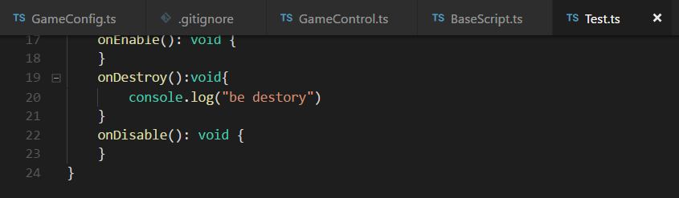

# 场景和节点


在开发的时候是可以使用脚本定义场景中的事件，创建脚本需要在代码模式下，在src目录下创建


创建完成后你ide会自动帮你生成一些事例代码，当然要想在场景中使用节本需要还需要将这个脚本在环境中注册才行，将新建脚本的模块导出


然后再`GameConfig.ts`中导入并注册


之后就可以做行场景中引用了


**注意**：这种生成脚本的方式，在新建新的脚本的时候都是需要在GameConfig.ts中进行手动注册的，如果想要自动注册就需要在src下新建一各文件夹来存放脚本，之后在场景中引用到了脚本的话在编译的时候系统就会自动帮你在GameConfig.ts中注册脚本了。


**组件和节点的生命周期**

```typescript
/**
     *  组件被启动后执行，比如节点被添加到舞台后
     */
    onEnable(): void {

    }

    /**
     *  组件被禁用后执行，比如节点从舞台中移除后
     */
    onDisable(): void {
    }

    /**
     * 组件被激活后执行，此时所有节点和组件均已创建完毕，此方法只执行一次
     */
    onAwake(): void {
        console.log("onAwake");
    }

    /**
     *  手动调用节点销毁时执行，虚方法，使用时覆盖
     */
    onDestroy(): void {
        console.log("onDestroy");
    }

    /**
     *  所有组件onAwake调用完之后，第一次执行update之前执行，只会执行一次
     */
    onStart(): void {
        console.log("onStart");
    }

    /**
     * 每此刷新的时候都会调用
     */
    onUpdate(): void {
        console.log("onUpdate");
    }

    /**
     *  每次刷新时候，发生在uodate之后
     */
    onLateUpdate():void{
        console.log("onLateUpdate");
    } 
```

**脚本的生命周期**

```typescript
declare module laya.components {

  /**
   * <code>Script</code> 类用于创建脚本的父类，该类为抽象类，不允许实例。
   * 组件的生命周期
   */
  class Script extends laya.components.Component  {

    /**
     * @inheritDoc 
     * @override 
     */
    readonly isSingleton:boolean;

    /**
     * 组件被激活后执行，此时所有节点和组件均已创建完毕，次方法只执行一次
     * 此方法为虚方法，使用时重写覆盖即可
     */
    onAwake():void;

    /**
     * 组件被启用后执行，比如节点被添加到舞台后
     * 此方法为虚方法，使用时重写覆盖即可
     */
    onEnable():void;

    /**
     * 第一次执行update之前执行，只会执行一次
     * 此方法为虚方法，使用时重写覆盖即可
     */
    onStart():void;

    /**
     * 开始碰撞时执行
     * 此方法为虚方法，使用时重写覆盖即可
     */
    onTriggerEnter(other:any,self:any,contact:any):void;

    /**
     * 持续碰撞时执行
     * 此方法为虚方法，使用时重写覆盖即可
     */
    onTriggerStay(other:any,self:any,contact:any):void;

    /**
     * 结束碰撞时执行
     * 此方法为虚方法，使用时重写覆盖即可
     */
    onTriggerExit(other:any,self:any,contact:any):void;

    /**
     * 鼠标按下时执行
     * 此方法为虚方法，使用时重写覆盖即可
     */
    onMouseDown(e:laya.events.Event):void;

    /**
     * 鼠标抬起时执行
     * 此方法为虚方法，使用时重写覆盖即可
     */
    onMouseUp(e:laya.events.Event):void;

    /**
     * 鼠标点击时执行
     * 此方法为虚方法，使用时重写覆盖即可
     */
    onClick(e:laya.events.Event):void;

    /**
     * 鼠标在舞台按下时执行
     * 此方法为虚方法，使用时重写覆盖即可
     */
    onStageMouseDown(e:laya.events.Event):void;

    /**
     * 鼠标在舞台抬起时执行
     * 此方法为虚方法，使用时重写覆盖即可
     */
    onStageMouseUp(e:laya.events.Event):void;

    /**
     * 鼠标在舞台点击时执行
     * 此方法为虚方法，使用时重写覆盖即可
     */
    onStageClick(e:laya.events.Event):void;

    /**
     * 鼠标在舞台移动时执行
     * 此方法为虚方法，使用时重写覆盖即可
     */
    onStageMouseMove(e:laya.events.Event):void;

    /**
     * 鼠标双击时执行
     * 此方法为虚方法，使用时重写覆盖即可
     */
    onDoubleClick(e:laya.events.Event):void;

    /**
     * 鼠标右键点击时执行
     * 此方法为虚方法，使用时重写覆盖即可
     */
    onRightClick(e:laya.events.Event):void;

    /**
     * 鼠标移动时执行
     * 此方法为虚方法，使用时重写覆盖即可
     */
    onMouseMove(e:laya.events.Event):void;

    /**
     * 鼠标经过节点时触发
     * 此方法为虚方法，使用时重写覆盖即可
     */
    onMouseOver(e:laya.events.Event):void;

    /**
     * 鼠标离开节点时触发
     * 此方法为虚方法，使用时重写覆盖即可
     */
    onMouseOut(e:laya.events.Event):void;

    /**
     * 键盘按下时执行
     * 此方法为虚方法，使用时重写覆盖即可
     */
    onKeyDown(e:laya.events.Event):void;

    /**
     * 键盘产生一个字符时执行
     * 此方法为虚方法，使用时重写覆盖即可
     */
    onKeyPress(e:laya.events.Event):void;

    /**
     * 键盘抬起时执行
     * 此方法为虚方法，使用时重写覆盖即可
     */
    onKeyUp(e:laya.events.Event):void;

    /**
     * 每帧更新时执行，尽量不要在这里写大循环逻辑或者使用getComponent方法
     * 此方法为虚方法，使用时重写覆盖即可
     */
    onUpdate():void;

    /**
     * 每帧更新时执行，在update之后执行，尽量不要在这里写大循环逻辑或者使用getComponent方法
     * 此方法为虚方法，使用时重写覆盖即可
     */
    onLateUpdate():void;

    /**
     * 渲染之前执行
     * 此方法为虚方法，使用时重写覆盖即可
     */
    onPreRender():void;

    /**
     * 渲染之后执行
     * 此方法为虚方法，使用时重写覆盖即可
     */
    onPostRender():void;

    /**
     * 组件被禁用时执行，比如从节点从舞台移除后
     * 此方法为虚方法，使用时重写覆盖即可
     */
    onDisable():void;

    /**
     * 手动调用节点销毁时执行
     * 此方法为虚方法，使用时重写覆盖即可
     */
    onDestroy():void;
  }

}
```

# 动态添加脚本

在laya中很多节点都是由继承而产生的，继承的好处就是子类可以使用父类的方法。


比如在之前的GameControl.ts中要动态加载脚本文件的话可以使用`this.owner.addComponent()`方法来添加脚本，但是this.owner是一个scene类的数据，他本身是不含有addComponent（属于Node）方法，但是scene继承于Sprite,Sprite继承于Node,所以this.owner是可以调用addComponent方法的。


同理，在ts中使用强制类型装换（`<string> a`或者`a as String`）的时候也是需要两个节点具有继承关系的。不然是没有办法进行强制类型转换的，Laya.Graphics继承于Object，与Node以及Scene没有关系。


## 多脚本继承

在src/script中新建一个BaseScript.ts，然后用这个脚本继承Laya.Script，用这个脚本来写一些公共方法，其他的子脚本可以继承这个BaseScript.ts。





# 节点查找

在场景脚本中查找子节点的方法有两种，一种是使用变量与编辑器绑定，然后在编辑器中为变量绑定节点；第二中就是在脚本中直接使用方法查找；

**第一种**


type类型可以参考[这里](https://ldc2.layabox.com/doc/?nav=zh-ts-3-4-0)

然后直接在编辑器中绑定就好了


需要注意的是不要在节本中设定默认值，因为脚本中的赋值比编辑器拖动赋值优先级高。

**第二种**

通过代码获取（设置组件属性name）

layabox也是一个树形结构。

1. 如果一个组件类绑定到节点上面，可以通过 `this.owner`来获取绑定的节点。
2. 获取一个节点的父亲节点，则使用 `this.owner.parent`
3. 获取节点所在的场景 `this.owner.scene`
4. 根据名称查找孩子节点，则使用` this.owner.getChildByName(“孩子name”);`
5. 通过索引查找孩子节点，则可以使用 `this.owner.getChildAt(0) `获取第一个孩子
6. 获取所有孩子的个数，`this.owner.numChildren `就是所有孩子的个数
7. 获取一个孩子节点的索引下标` this.owner.getChildIndex(childNode) `返回孩子下标
8. 获取自身在父亲节点的下标 `this.owner.parent.getChildIndex(this.owner);`

添加一个自定义节点

```typescript
var txt = new Laya.Text(); //创建一个文本节点
txt.text = 'text'; //设置文本内容
txt.color = '#ffffff'; //设置文本颜色
txt.fontSize = 32;
this.owner.addChild(txt);
```

使用addChildren可以添加多个节点

删除一个节点 this.owner.removeSelf() 将自己从父节点删除

**第三种**

通过设置组件属性var，name和var的区别相当html标签中的name属性和id属性，如果设置了name属性就需要通过`this.owner.getChildByName(“孩子name”);`来获取，但是如果设置了var属性的话就可以通过`this.owner.设置的var值`来获取。


# 事件系统

## 事件处理Handler

layabox提供了定义事件处理的类Handler，推荐使用 Handler.create() 方法从对象池创建，减少对象创建消耗。创建的 Handler 对象不再使用后，可以使用 Handler.recover() 将其回收到对象池，回收后不要再使用此对象，否则会导致不可预料的错误。

**注意：**由于鼠标事件也用本对象池，不正确的回收及调用，可能会影响鼠标事件的执行。

**Handler简单使用**

```typescript
let h:Laya.Handler=Laya.Handler.create({Me:'作用域/执行上下文'},function(x,y,arg){
  console.log(this,x,y,arg);
},['a',1,3,5]);
h.run();//执行：输出{Me:'作用域/执行上下文'} 'a' 1 [3,5]
//run形式执行参数是在Handler创建的时候就已经定义好了的，参数以数组的形式传递的，类似于数组解析，arg是一个函数参数的关键字用于存储剩余参数。

//同时也可以使用runWith()方法动态添加要传递的参数
h.runWith(['b','c']);输出{Me:'作用域/执行上下文'} 'a' 1 [3,5,'b','c']
```

在laya中也是存在时间冒泡的，可以使用`e.stopPropagation()`阻止冒泡