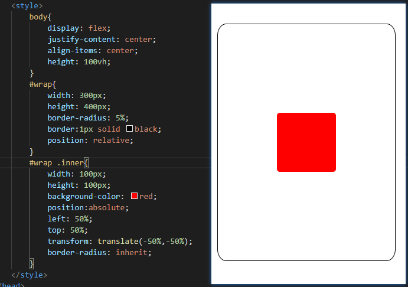

## Less 预编译器

less 是 css 的一种预编译语言，扩展了css的方法以及功能，如变量，方法，函数等特性。使用 less 编写 css 样式可以增强开发项目的效率以及项目的可维护性。

在 less 中css 是可以像dom那样，是有层级的，如下，`#warp .inner`虽然也可以表示层级，但是层级还是不太明显的，如果样式或者类名，id名一多可能就会搞混掉 



所幸的是在 less 中你可以这样子写

```less
#wrap{
    ...
    
    .inner{
        ...
    }
}
```

这样子就和 html 的 dom 结构一样了，有时候你可以都不用在去看 html 就可以知道他们的结构了。


## Less 安装及基本使用

### 使用node安装

less 的运行环境是 node ，使用 less 需要在node 环境下进行。所以想要使用 less 需要先安装

```she
npm install less -g
```

安装之后可以使用 `lessc`命令将`.less`文件编译成`css`文件，之后我们可以直接使用编译出来的文件，在html上。

```shell
lessc input.less output.css
```

将`input.less`编译后输出到`output.css`


### 直接使用 CDN 引入后使用

除了安装后使用以外，还可以使用 CDN 引入。

```html
<script src="less/less.min.js"></script>
```

但是需要注意的是 less 必须在 `<style>`之后引入，并且`<style type="text/less">`这样 less 才能定位获取到需要编译的样式。


### 注释

在less中有两种注释方式可以选择`//`和`/** */`，两种注释的区别在第一种不会被编译到`.css` 文件中，第二种会

### 变量

在 less 中可以使用 `@` 符号定义变量，变量处理可以用做属性值以外还可以用做 属性名 、类名、id名、url。

```less
@width:10px;
@height:@width + 10px;
@color:skyblue;
@id:header;
@myClass:my-class;
@myAttr:border-radius;
@url:"../img";
@themes: "../../src/themes";
@siez:size;

@import "@{themes}/tidal-wave.less";
#@{id}{
    width:@width;
    height:@height;
    background:@color;
}

.@{myClass}{
    width:@width * 2;
    height:@height * 2;
    background:url("@{url}/img.jpg");
    @{myAttr}:10px;
    font-@{size}:18px;
}
```

编译后得到的文件就会是

```css
@import "../../src/themes/tidal-wave.less";
#header {
  width: 10px;
  height: 20px;
  background: skyblue;
}
.my-class {
  width: 20px;
  height: 40px;
  background:url("../img/img.jpg");
  border-radius: 10px;
  font-size:18px;
}
```

**需要注意**的是 less 采用的延迟加载的模式，所以在同一级域中如果有多个同名的变量的话会使用最后定义的那个变量的值，也因如此，变量无需先定义后使用。

```less
@var: 0;
.class {
  @var: 1;
  .brass {
    @var: 2;
    three: @var;
    @var: 3;
  }
  one: @var;
}
```

编译输出的会是

```css
.class {
  one: 1;
}
.class .brass {
  three: 3;
}
```

在 less 3.5 的版本中变量可以支持 map 类型数据了

```less
@map:{
   color:red;
   border-radius:10px;
}
.class {
  color:@map[color];
  border-radius:@map[border-radius];
}
```


### 混合

在 less 中的混合（mixin），更加像是对样式的引用。使用混合可以避免我们写一些重复样式

```less
.center{
    position:absolute;
    left: 50%;
    top: 50%;
    transform: translate(-50%,-50%);
}
#pink{
    color:pink;
}
.my-inner(){
    .inner{
        color:red;
    }
}

.wrap{
    width: 100px;
    height: 100px;
    background-color: red;
    border-radius: inherit;
    .center();
    #pink();
    .my-inner();
}
```

输出为

```css
.center {
  position: absolute;
  left: 50%;
  top: 50%;
  transform: translate(-50%, -50%);
}
#pink {
  color: pink;
}
.wrap {
  width: 100px;
  height: 100px;
  background-color: red;
  border-radius: inherit;
  position: absolute;
  left: 50%;
  top: 50%;
  transform: translate(-50%, -50%);
  color: pink;
}
.wrap .inner {
  color: red;
}
```

从上面中可看到混合不仅能混合属性，也可以混合样式选择器，使用只需要在类样式名`.center`或者id样式名`#pink`后面加个`()`那么这个样式就会被混合到样式中去。但是这种方式会将`.center{..}`和`#pink{..}`这两个样式也会被编译到css中，如果不想要被编译进去可以改为`.center(){..} #pink(){..}`，这样less就会认为这是一个mixin而不是一个样式。

#### 带参数的混合

混合还可以带参数，并且有匹配模式的区分，使用带参数的混合可以极大降低代码的重复性,如创建四个方向的箭头

```less
.triangle(@_;@w:50;@c:red){
    width:0px;
    height:0px;
    overflow:hiddle;
}
.triangle(left;@w:50;@c:red){
    border-width:@w;
    border-style:dashed solid dashed dashed;
    border-color:transparent @c transparent transparent;
}
.triangle(right;@w:50;@c:blue){
    border-width:@w;
    border-style:dashed dashed dashed solid;
    border-color:transparent transparent transparent @c;
}

.my-arrow-left{
    .triangle(left, 40,black);
}

.my-arrow-right{
    .triangle(right);
}
```

编译后会有

```css
.my-arrow-left {
  width: 0px;
  height: 0px;
  overflow: hiddle;
  border-width: 40;
  border-style: dashed solid dashed dashed;
  border-color: transparent black transparent transparent;
}
.my-arrow-right {
  width: 0px;
  height: 0px;
  overflow: hiddle;
  border-width: 50;
  border-style: dashed dashed dashed solid;
  border-color: transparent transparent transparent blue;
}

```

mixin 在传参数的说可以传递多个并且可以设置默认值，如果要开启 匹配模式的话第一个参数就是模式名，之后可以通过这个 模式名来定位，如果多个相同的名字的混合的话会全部引入，合并但不会覆盖。所以公共样式和默认样式的 mixin 一定要放在前面。

#### 根据条件混合

less 提供的`when`关键字可以让我们实现按条件混合

```less
.mixin() when (@mode = huge) { 
	color:red;
}
.mixin2(1){val:1}
.mixin2(2){val:2}
.mixin2(@a) when (default()){val:@a}

.my-class1{
  @mode:huge;
  .mixin();
}
.my-class2{
  @mode:huge2;
  .mixin();
  background-color: #fff;
}
.my-class3{
  .mixin2(1);
  .mixin2(3);
}
```

编译为

```css
.my-class1 {
  color: red;
}
.my-class2 {
  background-color: #fff;
}
.my-class3 {
  val: 1;
  val: 3;
}
```

默认函数`default()`仅在保护条件内可用时返回true，并且与任何其他mixin不匹配，否则返回false。 当默认函数在mixin guard条件之外使用时，它解释为常规css。

#### 混合合并

如果混合进来的演示和当前样式中有相同的属性的话，可以使用`+`(,合并)或者`+_`（空格合并）标记要合并的元素

```less
.mixin() {
  box-shadow+: inset 0 0 10px #555;
    transform+_: scale(2);
}
.myclass {
  .mixin();
  box-shadow+: 0 0 20px black;
  transform+_: rotate(15deg);
}
```

编译后

```css
.myclass {
  box-shadow: inset 0 0 10px #555, 0 0 20px black;
  transform: scale(2) rotate(15deg);
}
```


### 嵌套

less 提供了一种类似于html标签层级结构的嵌套模板，使得css的结构更加清晰明了。如

```less
#header {
  color: black;
  .nav {
    font-size: 12px;
  }
  .logo {
    width: 300px;
  }
}
```

这样子默认解析出来的就会是 `#header .nav`和`#header .logo`但是如果想要表示`> ~ +`的关系或者`:hover`等伪类的话就无法实现了，这时候可以使用`&`来表示父级，这里表示的父级的完整关系。

```less
#header {
  color: black;
  .nav {
    font-size: 12px;
      &:hover {
        font-size: 16px;
      }
  }
}
```

这里的`&`表示的是`#header .nav`。

### 转义

转义（Escaping）允许你使用任意字符串作为属性或变量值。任何 `~"anything"` 或 `~'anything'` 形式的内容都将按原样输出。

```less
@min768: ~"(min-width: 768px)";
.element {
  @media @min768 {
    font-size: 1.2rem;
  }
}
```

编译为

```css
@media (min-width: 768px) {
  .element {
    font-size: 1.2rem;
  }
}
```


### 函数

在 less 中为我们提供了很多的函数，如基本的流程控制函数`if() each()`还有生成数据的方法如`range()`，字符串方法`escape() e() replace()`当，这样 less 就更加灵活并且可以让我们想开发程序一样写css样式。

常用的函数

#### 条件判断

`if(条件,符合条件结果,不符合条件结果)`

```less
@some:foo;
div{
  margin:if((2>1),0,3px);
  color:if(iscolor(@some),@some,black);
}
```

输出结果为

```css
div{
  margin:0;
  color:black;
}
```


`boolean(表达式|布尔值)`

```less
@isTrue:true;
@cod:boolean(2>1);

div{
  background:if(@isTrue,blue,red);
  color:if(@cod,red,blue);
}
```

编译后的到的是

```css
div {
  background: blue;
  color: red;
}
```


#### 列表循环

在 less 中也可以定义列表，列表元素之间用`,`或者` `分隔，可以通过`length(@list)`获得列表的长度，通过`extract(@list,index)`通过索引获得列表的元素。

```less
@list: "red", "black", "white", "pink";
div:{
  order:length(@list);
  color:extract(@list,0);
}
```

可以通过`range(起始值,最终值，步长)`来生成一定范围内的有序数据，如

```less
@pixelList:range(10px,30px,10px);
div{
  border-shadow:@pixelList red;
}
```

生成的是

```css
div {
  box-shadow: 10px 20px 30px red;
}
```


`each(列表,{})`这个函数可以遍历列表，在代码块中可以通过默认的`@value`接收数值，`@key`接收键值（遍历map或者mixin类型数据时，为列表时值为`@index`），`@index`接收索引。

```less
@list: blue green red;
each(@list, .(@v, @k, @i) {
        .item@{i} {
            @{k}: @v;
        }
    })

@maps:{
    one: blue;
    two: green;
    three: red;
}
each(@maps, .(@v, @k, @i) {
   .div@{i}{
       @{k}: @v;
   }
})

.set-2() {
    one: blue;
    two: green;
    three: red;
}
.set-2 {
    each(.set-2(), .(@v, @k, @i) {
            @{k}-@{i}: @v;
        }
    );
}
```

编译结果为

```css
.item1 {
  1: blue;
}
.item2 {
  2: green;
}
.item3 {
  3: red;
}

.div1 {
  one: blue;
}
.div2 {
  two: green;
}
.div3 {
  three: red;
}

.set-2 {
  one-1: blue;
  two-2: green;
  three-3: red;
}

```

除上面这些常用的函数外，还提供了数学函数`abs() pow() sin() cos()`等等，判断类型的函数`iscolor() isnumber() isstring()`，处理图片的函数`image-size() image-width() image-height() data-uri()`等等许多的函数可以使用。

### 命名空间与访问符

有时，出于组织结构或仅仅是为了提供一些封装的目的，你希望对混合（mixins）进行分组。你可以用 Less 更直观地实现这一需求。假设你希望将一些混合（mixins）和变量置于 `#bundle` 之下，为了以后方便重用或分发：

```less
#bundle() {
  .button {
    display: block;
    border: 1px solid black;
    background-color: grey;
    &:hover {
      background-color: white;
    }
  }
  .tab { ... }
  .citation { ... }
}
```

现在，如果我们希望把 `.button` 类混合到 `#header a` 中，我们可以这样做：

```less
#header a {
  color: orange;
  #bundle.button();  // 还可以书写为 #bundle > .button 形式
}
```

输出为

```css
#header a {
  color: orange;
  display: block;
  border: 1px solid black;
  background-color: grey;
}
#header a:hover {
  background-color: white;
}

```

**注意**：如果不希望它们出现在输出的 CSS 中，例如 `#bundle .tab`，请将 `()` 附加到命名空间（例如 `#bundle()`）后面。


### 继承

`extend`就相当于Java的继承，它允许一个选择器继承另一个选择器的样式。Extend有两种语法格式。

```less
<selector>:extend(<parentSelector>) { }

<selector> {
	&:extend(<parentSelector>);
}
```

假设有一个 `.inline` 的类，现在希望 `nav ul `选择器能够让继承 `.inline`类的 `color `属性，就可以使用以下两种方式的任意一种来实现

```less
.inline {
    color: red;
}
nav ul:extend(.inline) {}
//---------------
nav ul {
    &:extend(.inline);
}
```

这两种方式得到的结果完全相同，编译后的CSS代码为：

```css
.inline,nav ul {
  color: red;
}
```

一个选择器还可以继承多个选择器的属性，只需写多个 :extend 语句就可以了。如，.e 同时继承了 .f 和 .g 的属性：

```less
.e:extend(.f) {}.e:extend(.g) {}
```

为了方便，Less允许仅使用一个 :extend 语句，只需在括号中提供用逗号隔开的选择器列表即可。什么两个 :extend 语句的等价写法为：

```less
.e:extend(.f, .g) {}
```