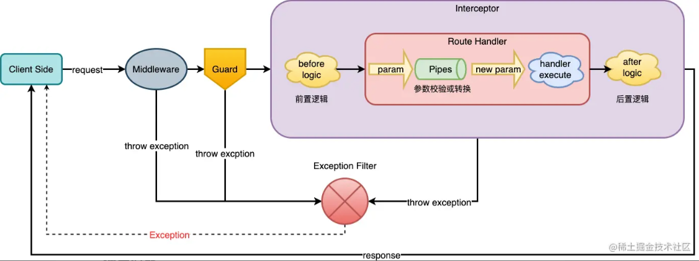
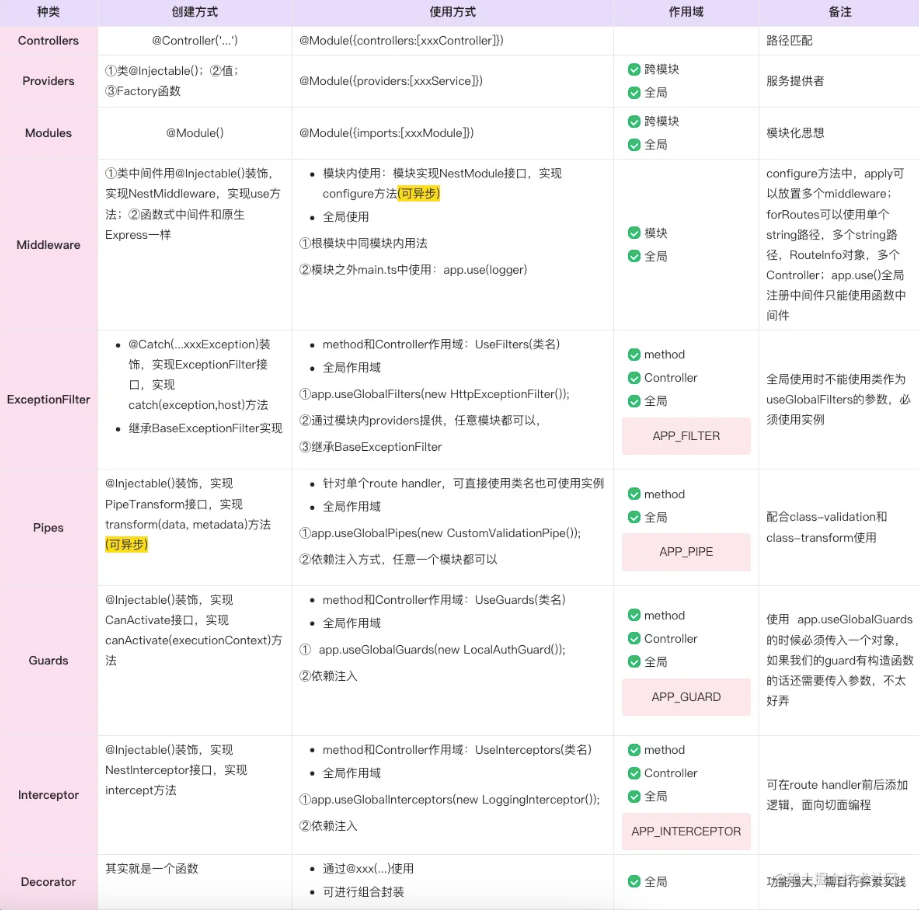

## Nestjs是什么

Nestjs 是一个可扩张的nodejs的服务器端应用程序的框架，使用渐进式 JavaScript，内置并完全支持 TypeScript ，并结合了 OOP（面向对象编程），FP（函数式编程）和 FRP（函数式响应编程）的元素。

在底层，Nest使用强大的 HTTP Server 框架，如 Express（默认）和 Fastify。Nest 在这些框架之上提供了一定程度的抽象，同时也将其 API 直接暴露给开发人员。完全可以认为Nestjs其实是一套服务端框架的装备，nestjs的服务核心是可以变更的。

由于Nestjs借鉴了很多 Angular 的知识，而Angular又借鉴了很多Java（SpringBoot）开发的思想，使用OOP、AOP、IOC等设计模式，从而使Nestjs看起来非常想想 SpringBoot。


## 教程

Nestjs 教程可以直接在[Nestjs中文网](https://docs.nestjs.cn)或者[官网教程](https://docs.nestjs.com/)中查看，里面的例子很丰富基本可以根据官网文档自学.

Nestjs的cli工具提供了很多快捷创建文件的命令可以通过命令来查看

```shell
nest -h
```


## 一些概念

+ 模块：每个 Nest 应用程序至少有一个模块，即根模块。可以认为模块就是各种功能的容器。
+ 控制器：一般用来定义和控制路由。
+ 服务（provider）：又名提供着，一般又来处理和数据有关的东西。下面的的几个东西其实都是服务（provider），不过各自着重的点不一样，`xxx.service.ts` 一般用来处理数据库的IO操作
+ 中间件：对请求发送过来的数据进行首次处理，比如获取 cookie
+ 守卫：一般用来做授权验证
+ 拦截器：用来拦截发送过来的数据/发送回去的数据，并且可以对数据进行转换。
+ 管道：对接收的的数据进行解析或者验证、转换
+ 错误过滤器：对Nestjs抛出的错误进行再处理

数据的流动过程





对于拦截器（Interceptor），拦截器的只使用了一次装饰器就可以对来回的数据进行拦截，这里使用了rxjs 来完成这一操作

```typescript
import { Injectable, NestInterceptor, ExecutionContext, CallHandler } from '@nestjs/common';
import { Observable } from 'rxjs';
import { tap } from 'rxjs/operators';

@Injectable()
export class LoggingInterceptor implements NestInterceptor {
  intercept(context: ExecutionContext, next: CallHandler): Observable<any> {
    console.log('Before...');

    const now = Date.now();
    return next
      .handle() //handle就是当前调用的方法,返回值会被包装成 Observable
      .pipe(
        tap(() => console.log(`After... ${Date.now() - now}ms`)),
      );
  }
}
```


## Geteways 网关

在NestJS中，Gateway（网关）是一个充当应用程序与外部系统之间交互媒介的组件。它可以看作是应用程序与其他服务、API或协议之间的桥梁。

通常情况下，网关在应用程序的边界处起到了重要的作用。它负责处理进入应用程序的请求，并将其转发给适当的处理程序或微服务。同时，网关还可以在请求转发之前进行验证、授权、日志记录等操作。

通过使用网关，您可以将不同的通信协议、服务或API集成到您的应用程序中，从而构建出更加灵活和可扩展的系统架构。

总而言之，NestJS中的网关是一个用于处理进入应用程序的请求，并将其转发到相应处理程序或微服务的组件。它可以帮助您实现应用程序与外部系统之间的交互和集成。

请求发送过来Nestjs服务器上最先经过的是网关这一层，在NestJS中，请求首先会经过网关层。网关充当了应用程序与外部系统之间的入口点，它负责接收进入应用程序的请求，并在将其转发到适当的处理程序或微服务之前进行必要的验证、授权、日志记录等操作。

通常情况下，NestJS应用程序可以有多个网关。每个网关可以监听不同的路由或协议，以便处理不同类型的请求。例如，您可以为 RESTful API 创建一个网关来处理HTTP请求，同时也可以为WebSocket连接创建另一个网关。

通过使用网关，您可以实现以下功能：

1. API 网关：如果你的应用程序需要暴露一组 RESTful API 给客户端，你可以创建一个 API 网关，它会接收请求并将它们路由到相应的控制器或模块中进行处理。
2. WebSocket 网关：如果您希望在应用程序中使用 WebSocket 协议进行实时通信，您可以创建一个 WebSocket 网关来处理 WebSocket 连接和消息的传输。
3. GraphQL 网关：如果您正在使用 GraphQL 构建应用程序，您可以创建一个 GraphQL 网关，该网关将负责接收 GraphQL 查询，并将其路由到相应的解析器进行处理。
4. 请求路由：根据不同的URL路径或请求头，将请求路由到相应的处理程序或微服务。
5. 鉴权和认证：对请求进行验证和身份验证，确保只有经过授权的用户才能访问特定资源或执行特定操作。
6. 请求转换和校验：对请求进行预处理，例如解析请求体、验证请求参数和数据转换等。
7. 日志记录和监控：记录请求的相关信息，例如请求方法、URL、响应时间等，以便于排查问题和监控应用程序性能。

需要注意的是，网关并不是必需的，您可以选择直接将请求发送到控制器或模块，而不经过网关。但是，通过使用网关，您可以更好地组织和管理应用程序的路由和请求处理逻辑，从而实现更加灵活和可扩展的架构。


## 参考

[Nestjs中文网](https://nest.nodejs.cn/)

[Nestjs学习系列](https://juejin.cn/column/7171420703424512036)

[😯 学习nestjs，这可能是原理讲的最清晰的一篇文章了](https://zhuanlan.zhihu.com/p/484626675)

[Nest 通关秘籍-01.开篇词](https://www.bilibili.com/video/BV1zo4y1M7bu/?spm_id_from=333.788&vd_source=41ed998ac767425fb616fd9071ce9682)

[Nest 通关秘籍](https://juejin.cn/book/7226988578700525605)


## Rxjs

Rxjs官方是这样说的: Think of RxJS as Lodash for events. 把Rxjs想像成针对events的lodash，也就是说，Rxjs本质是个工具库，处理的是事件。这里的events，可以称之为流。

那么流是指什么呢？举个例子，代码中每1s输出一个数字，用户每一次对元素的点击，就像是在时间这个维度上，产生了一个数据集。这个数据集不像数组那样，它不是一开始都存在的，而是随着时间的流逝，一个一个数据被输出出来。这种异步行为产生的数据，就可以被称之为一个流，在Rxjs中，称之为observable（抛开英文，本质其实就是一个数据的集合，只是这些数据不一定是一开始就设定好的，而是随着时间而不断产生的）。而Rxjs，就是为了处理这种流而产生的工具，比如流与流的合并，流的截断，延迟，消抖等等操作。

### 理解基本定义: observable, observer, subscription

### **observable, observer**

可以通过如下的方式构建一个最基础的流，500ms时输出一个数组[1,2,3]，1s时输出一个对象{a: 1000}， 3s时，输出'end'， 然后在第4s终止该流。

```js
import { Observable } from "rxjs";

// stream$尾部的$是表示当前这个变量是个ovservable
const stream$ = new Observable(subscriber => {
  setTimeout(() => {
    subscriber.next([1, 2, 3]);
  }, 500);
  setTimeout(() => {
    subscriber.next({ a: 1000 });
  }, 1000);
  setTimeout(() => {
    subscriber.next("end");
  }, 3000);
  setTimeout(() => {
    subscriber.complete();
  }, 4000);
});

// 启动流
const subscription = stream$.subscribe({
  complete: () => console.log("done"),
  next: v => console.log(v),
  error: () => console.log("error")
});
```

输出

```
[1,2,3]  // 500ms时
{a:1000} // 1000ms时
end 		 // 3000ms时
done 		 // 4000ms时
```

在上述的代码中，通过`new Observalbe(fn)`定义了一个流，又通过`stream$.subscribe(obj)`启动了这个流，当500ms后，执行了``subsciber.next([1,2,3])`，此时，通过传入的`obj.next`方法输出了该值。

1. subscribe不是订阅，而是启动这个流，可以看到，subscribe后，才会执行next方法
2.  构建observable的时候，会有一个subscriber.next，这里就是控制这个流中数据的输出。

同时`subscription`还有一个`unsubscribe`可以用来**停止流**的执行.

> 可以简单理解为一下源码
>
> ```js
> class Observable(){
>   constructor(behaivor){
>     this.behaivor = behaivor;
>   }
>   subscribe(observer){
>     this.behaivor(observer);
>   }
> }
> 
> const obs$ = new Observable(cb => {
>   cb.next();
>   cb.complete();
> })
> obs$.subscribe({
>   next:val => console.log(val),
>   complete:()=>console.log("complete")
> })
> ```

1. `stream$`, 对应到Rxjs中，就是一个observable，单纯从英文翻译到中文的含义来看，基本很难理解。但是它的本质其实就是一个随时间不断产生数据的一个集合，称之为流更容易理解。而其对象存在一个subscribe方法，调用该方法后，才会启动这个流（也就是数据才会开始产生），这里需要注意的是多次启动的每一个流都是独立的，互不干扰。
2. `observer`，代码中是`stream$.subscribe(observer)`，对应到Rxjs中，也是称之为observer，从英文翻译到中文的含义来看，也很难理解。从行为上来看，无非就是定义了如何处理上述流产生的数据，称之为流的处理方法，更容易理解
3. `subscription`，也就是`const subscription = stream$.subscribe(observer);`，这里对应到Rxjs，英文也是称之为subscription，翻译过来是订阅，也是比较难以理解，其实它的本质就是暂存了一个启动后的流，之前提到，每一个启动后的流都是相互独立的，而这个启动后的流，就存储在subscription中，提供了unsubscribe，来停止这个流。

### **Subject**

```js
import { Subject } from "rxjs";

// 创建subject
const subject = new Subject();

// 订阅一个observer
subject.subscribe(v => console.log("stream 1", v));
// 再订阅一个observer
subject.subscribe(v => console.log("stream 2", v));
// 延时1s再订阅一个observer
setTimeout(() => {
  subject.subscribe(v => console.log("stream 3", v));
}, 1000);
// 产生数据1
subject.next(1);
// 产生数据2
subject.next(2);
// 延时3s产生数据3
setTimeout(() => {
  subject.next(3);
}, 3000);

// output
// stream 1 1 //立即输出
// stream 2 1 //立即输出
// stream 1 2 //立即输出
// stream 2 2 //立即输出
// stream 1 3 //3s后输出
// stream 2 3 //3s后输出
// stream 3 3 //3s后输出
```

可以看到，Subject的行为和发布订阅模式非常接近，subscribe去订阅，next触发。事件的订阅通过subscribe，事件的触发使用next，从而实现一个发布订阅的模式

[**别再被Rxjs的概念淹没了**](https://zhuanlan.zhihu.com/p/274469124)

### **操作符**

操作符是**函数**。有两种操作符：

可联入管道的**操作符**是可以使用语法 `observableInstance.pipe(operator())` 联入 Observables 管道的类型。

其中`tap`就是rxjs的一个操作符，这个操作符会在`handle`执行完成之后执行

操作符的工作原理


[操作符分类](https://rxjs.tech/guide/operators#categories-of-operators)


