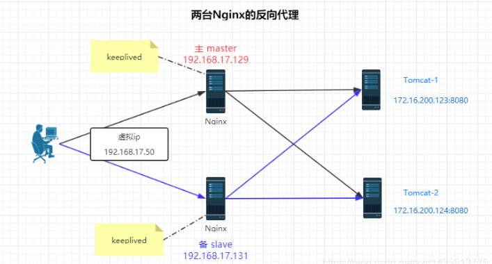

## Nginx是什么？

Nginx 是**高性能的 HTTP** 和**反向代理**的服务器，处理高并发能力是十分强大的，能经受高负 载的考验,有报告表明能支持高达 50,000 个并发连接数。

### 正向代理

需要在客户端配置代理服务器进行指定网站访问


### 反向代理

暴露的是代理服务器地址，隐藏了真实服务器 IP 地址。


**正向代理就是客户端自己设置的代理**，明确知道请求的目标服务器地址是什么，**反向代理就是服务端设置的代理**，客户端不知道目标服务器的地址，只能拿到代理服务器的地址

### 负载均衡

增加服务器的数量，然后将请求分发到各个服务器上，将原先请求集中到单个服务器上的 情况改为将请求分发到多个服务器上，将负载分发到不同的服务器，也就是我们所说的负 载均衡


### 动静分离


## 安装

### **安装要求的环境**

**安装gcc环境**

```shell
yum install gcc-c++
```

**第三方的开发包**

```shell
yum install -y pcre pcre-devel
```

PCRE(Perl Compatible Regular Expressions)是一个Perl库，包括 perl 兼容的正则表达式库。nginx的http模块使用pcre来解析正则表达式，所以需要在linux上安装pcre库；pcre-devel是使用pcre开发的一个二次开发库。nginx也需要此库

**zlib**

```shell
yum install -y zlib zlib-devel
```

zlib库提供了很多种压缩和解压缩的方式，nginx使用zlib对http包的内容进行gzip，所以需要在linux上安装zlib库

**openssl**

```shell
yum install -y openssl openssl-devel
```

nginx不仅支持http协议，还支持https（即在ssl协议上传输http），所以需要在linux安装openssl库

### 安装Nginx

下载nginx源码包，**把nginx源码包上传到linux系统上**

```
https://nginx.org/download/nginx-1.24.0.tar.gz
```

解压到/usr/local下面

```shell
tar -xvf nginx-1.24.0.tar.gz -C /usr/local
```

使用cofigure命令创建一个makeFile文件，**执行下面的命令的时候，一定要进入到nginx-1.24.0目录里面去**

```shell
./configure \
--prefix=/usr/local/nginx \   #表示软件安装到/usr/local/nginx下面
--pid-path=/var/run/nginx/nginx.pid \
--lock-path=/var/lock/nginx.lock \
--error-log-path=/var/log/nginx/error.log \
--http-log-path=/var/log/nginx/access.log \
--with-http_gzip_static_module \
--http-client-body-temp-path=/var/temp/nginx/client \
--http-proxy-temp-path=/var/temp/nginx/proxy \
--http-fastcgi-temp-path=/var/temp/nginx/fastcgi \
--http-uwsgi-temp-path=/var/temp/nginx/uwsgi \
--http-scgi-temp-path=/var/temp/nginx/scgi \
--with-http_stub_status_module \
--with-http_ssl_module \
--with-file-aio \
--with-http_realip_module
```

> - *--prefix=path — 定义服务器文件的完整路径，该路径同时也是configure命令设置的 相对路径（除类库源文件外）以及nginx.conf文件定义的相对路径的基准路径。其默认 值是/usr/local/nginx。*
> - *--sbin-path=path — 设置nginx可执行文件的完整路径，该路径仅在安装期间使用， 默认路径为prefix/sbin/nginx。*
> - *--conf-path=path — 设置配置文件nginx.conf的完整路径。如有必要，总是可以 在nginx启动时通过命令行参数-cfile指定一个不同的配置文件路径。 默认路径为prefix/conf/nginx.conf。*
> - *--pid-path=path — 设置nginx.pid文件的完整路径，该文件存储了主进程的进程ID。安装完成后， 该路径总是可以在nginx.conf文件中用 pid指令来修改。 默认路径为prefix/logs/nginx.pid。*
> - *--error-log-path=path — 设置记录主要错误、警告以及调试信息日志的完整路径。安装完成后， 该路径总是可以在nginx.conf文件中用 error_log 指令来修改。 默认路径为prefix/logs/error.log。*
> - *--http-log-path=path — 设置记录HTTP服务器主要请求日志的完整路径。安装完成后， 该路径总是可以在nginx.conf文件用 access_log 指令来修改。 默认路径为prefix/logs/access.log*
> - *--user=name — 设置工作进程以某非特权用户的身份运行。安装完成后，该用户名总是可以在 nginx.conf文件用user指令来修改。 其默认值为nobody。*
> - *--group=name — 设置工作进程以某非特权用户的身份运行。安装完成后，该用户名总是可以在 nginx.conf用user指令来修改。 其默认名称与未授权用户名称相同。*
> - *--with-select_module*
> - *--without-select_module — 设置是否将select()方法模块编译进nginx中。如果系统平台不支持kqueue、epoll、rtsig或/dev/poll等更合适的方法， 该模块会被自动编译。*
> - *--with-poll_module*
> - *--without-poll_module — 设置是否将poll()方法模块编译进nginx中。如果系统平台不支持kqueue、epoll、rtsig或/dev/poll等更合适的方法， 该模块会被自动编译。*
> - *--without-http_gzip_module — 不编译http_gzip_module模块。该模块可以压缩HTTP服务器的响应，该模块需要zlib库才能编译和运行。*
> - *--without-http_rewrite_module — 不编译http_rewrite_module模块。该模块允许HTTP服务器重定向请求，改变请求的URI地址 。创建并运行该模块需要PCRE库支持。*
> - *--without-http_proxy_module — 不编译HTTP服务器的代理模块。*
> - *--with-http_ssl_module — 为HTTP服务器编译HTTPS协议支持的模块。该模块默认是不编译的。它需要OpenSSL库才能编译和运行。*
> - *--with-pcre=path — 设置PCRE库源文件的路径地址。PCRE库的发行版(version 4.4 — 8.30)需要先从PCRE站点下载并解压缩。 剩下的安装工作由nginx的./configure和make命令来完成。该库应用于location 指令的正则表达式支持以及ngx_http_rewrite_module模块。*
> - *--with-pcre-jit — 编译PCRE库时增加“实时编译（pcre_jit）”支持。*
> - *--with-zlib=path — 设置zlib库源文件的路径地址。zlib库的发行版(version 1.1.3 — 1.2.5)需要先从zlib站点下载并解压缩。 剩下的安装工作由nginx的./configure和make命令来完成。该库应用于 ngx_http_gzip_module模块。*
> - *--with-cc-opt=parameters — 设置将会添加额外参数到CFLAGS变量中。当在FreeBSD使用系统PCRE库时，需要指定 --with-cc-opt="-I /usr/local/include"。 如果需要增加select()方法所支持的文件数量，也可以参照如下方式指定：*
> - *--with-cc-opt="-D FD_SETSIZE=2048"。*
> - *--with-ld-opt=parameters — 设置将会在链接（linking）过程中使用的额外参数。当在FreeBSD使用系统PCRE库时，需要指定 --with-ld-opt="-L /usr/local/lib"。*

启动nginx之前，上边将临时文件目录指定为/var/temp/nginx，需要在/var下创建temp及nginx目

```shell
mkdir /var/temp/nginx -p
```

进入nginx-1.24.0里面执行make命令进行编译,执行make install 命令进行安装

```shell
make && make install
```

进入安装位置/usr/local/nginx查看目录结构

```shell
cd /usr/local/nginx && ll
```

进入` /usr/local/nginx/sbin`目录，执行命令./nginx，**启动nginx**

查看nginx是否启动` ps -aux | grep nginx`


## 访问Nginx服务

在 windows 系统中访问 linux 中 nginx，默认不能访问的，因为防火墙问题 

1. 关闭防火墙 
2. 开放访问的端口号，80 端口

```shell
#查看开放的端口号
firewall-cmd --list-all
#设置开放的端口号
firewall-cmd --add-service=http –permanent
firewall-cmd --add-port=80/tcp --permanent
#重启防火墙
firewall-cmd –reload
```

之后在浏览器输入`http://IP地址`


## Nginx 的常用的命令

进入 nginx 目录中

```shell
cd /usr/local/nginx/sbin
```

```shell
# 1、查看 nginx 版本号
./nginx -v
# 2、启动 nginx
./nginx
# 3、停止 nginx
./nginx -s stop
# 4、重新加载 nginx
./nginx -s reload
```


## Nginx 的配置文件

nginx 配置文件位置`/usr/local/nginx/conf/nginx.conf`

**nginx文件结构**

首先我们先简单了解 nginx 的文件结构，nginx 的 HTTP 配置主要包括三个区块，结构如下：

```nginx
Global: nginx 运行相关
Events: 与用户的网络连接相关
http
    http Global: 代理，缓存，日志，以及第三方模块的配置
    server
        server Global: 虚拟主机相关
        location: 地址定向，数据缓存，应答控制，以及第三方模块的配置
```

配置文件中的内容，包含三部分内容

1. 全局块：配置服务器整体运行的配置指令,比如 `worker_processes 1;`处理并发数的配置 
2. events 块：影响 Nginx 服务器与用户的网络连接，比如 `worker_connections 1024; `支持的最大连接数为 1024 
3. http 块
   1. http 全局块
   2. server 块

```yml
# 全局参数
user nginx;              # Nginx进程运行用户
worker_processes auto;   # Nginx工作进程数，通常设置为CPU核数
error_log /var/log/nginx/error.log warn;    # 错误日志路径和日志级别
pid /run/nginx.pid;      # 进程PID保存路径

# 定义事件模块
events {
    worker_connections 1024;    # 每个工作进程最大并发连接数
    use epoll;                  # 使用epoll网络模型，提高性能
    multi_accept on;            # 开启支持多个连接同时建立
}

# 定义HTTP服务器模块
http {
    # 缓存文件目录
    client_body_temp_path /var/cache/nginx/client_temp;
    proxy_temp_path /var/cache/nginx/proxy_temp;
    fastcgi_temp_path /var/cache/nginx/fastcgi_temp;

    # 定义日志格式，main是默认的日志格式
    log_format main '$remote_addr - $remote_user [$time_local] "$request" '
        '$status $body_bytes_sent "$http_referer" '
        '"$http_user_agent" "$http_x_forwarded_for"';

    # 默认访问日志保存路径和格式
    access_log /var/log/nginx/access.log main;

    # 定义MIME类型
    include /etc/nginx/mime.types;
    default_type application/octet-stream;

    # 代理参数
    proxy_connect_timeout 6s;       # 连接超时时间
    proxy_send_timeout 10s;         # 发送超时时间
    proxy_read_timeout 10s;         # 接收超时时间
    proxy_buffer_size 16k;          # 缓冲区大小
    proxy_buffers 4 32k;            # 缓冲区个数和大小
    proxy_busy_buffers_size 64k;    # 忙碌缓冲区大小
    proxy_temp_file_write_size 64k; # 代理临时文件写入大小

    # 启用压缩，可以提高网站访问速度
    gzip on;
    gzip_min_length 1k;                    # 最小压缩文件大小
    gzip_types text/plain text/css application/json application/javascript application/xml;

    # 定义HTTP服务器
    server {
        listen 80;              # 监听端口

        server_name example.com;    # 域名

        # 重定向到HTTPS，强制使用HTTPS访问
        if ($scheme != "https") {
            return 301 https://$server_name$request_uri;
        }

        # HTTPS服务器配置
        ssl_certificate      /etc/nginx/ssl/server.crt;    # SSL证书路径
        ssl_certificate_key  /etc/nginx/ssl/server.key;    # SSL私钥路径

        # SSL会话缓存参数
        ssl_session_cache shared:SSL:10m;
        ssl_session_timeout 10m;
        ssl_protocols TLSv1 TLSv1.1 TLSv1.2;
        ssl_prefer_server_ciphers on;
        ssl_ciphers ECDH+AESGCM:ECDH+AES256:ECDH+AES128:DH+3DES:!ADH:!AECDH:!MD5;

        # 配置代理路径
        location / {
            proxy_pass http://localhost:8080;        # 转发请求的目标地址
            proxy_set_header Host $host;             # 设置请求头中的Host字段
            proxy_set_header X-Forwarded-For $proxy_add_x_forwarded_for;
                            # 设置HTTP头中的X-Forwarded-For字段，表示客户端真实IP，多个IP用逗号隔开
            proxy_set_header X-Real-IP $remote_addr; # 设置请求头中的X-Real-IP字段，表示客户端真实IP
        }

        # 配置静态文件访问路径
        location /static/ {
            alias /path/to/static/files/;   # 静态文件的目录
            expires 7d;                     # 静态文件缓存时间
            add_header Pragma public;       # 添加HTTP响应头
            add_header Cache-Control "public, must-revalidate, proxy-revalidate";
        }

        # 配置错误页面
        error_page 404 /404.html;           # 404错误页
        location = /404.html {
            internal;                       # 不接受外部访问
            root /usr/share/nginx/html;     # 404错误页文件所在目录
        }

        # 配置重定向
        location /old/ {
            rewrite ^/old/([^/]+) /new/$1 permanent;   # 将/old/xxx路径重定向为/new/xxx，返回301状态码
        }
    }

    # 其他服务配置
    # server {
    #     ...
    # }

    # 配置TCP负载均衡
    upstream backends {
        server backend1.example.com:8080 weight=5;  # 后端服务器地址和权重
        server backend2.example.com:8080;
        server backend3.example.com:8080 backup;   # 备用服务器
        keepalive 16;                               # 连接池大小
    }

    server {
        listen 80;
        server_name example.com;

        location / {
            proxy_pass http://backends;             # 负载均衡转发请求的目标地址
            proxy_set_header Host $host;            # 设置请求头中的Host字段
            proxy_set_header X-Real-IP $remote_addr; # 设置请求头中的X-Real-IP字段，表示客户端真实IP
        }
    }
}
```

其中 `location`的配置有多种配置方式

```yml
location [=|~|~*|^~] /uri/ { 
… 
}
```

> + ~ ：波浪线表示执行一个正则匹配，区分大小写
> + ~* ：表示执行一个正则匹配，不区分大小写
> + = ：进行普通字符精确匹配
> + ^~ ：代表精准匹配开头, 命中开头后直接返回, 不再进行后续匹配

还可以配置命名 location

```yml
location / {
    try_files $uri $uri/ @custom
}
location @custom {
    # ...do something
}
```

```yml
#这是精准匹配, 只有请求路径完全匹配`/index.html`才会命中它
location = /index.html {
  ...
}
#这是精准匹配开头, 只要请求路径的开头是`/image/`, 就会命中并立即返回
location ^~ /image/ {
  ...
}
#这是无匹配方式符号的普通匹配, 如果请求路径开头是`/image/`, 则会命中, 但是不会立即返回还会接着进行普通匹配
location /image/ {
  ...
}
#这是无匹配方式符号的普通匹配, 如果请求路径开头是`/image/meinv`, 则会命中, 但是不会立即返回还会接着进行普通匹配, 同时会舍弃掉上面那个匹配
location /image/meinv {
  ...
}

#区分大小写的正则匹配, 如果路径包含 /image/ 则立即返回, 注意这里并不需要开头命中, 因为这是正则表达式
location ~ /image/ {
  ...
}

#区分大小写的正则匹配, 如果路径包含 /image(不分大小写)/ 则立即返回, 注意这里并不需要开头命中, 因为这是正则表达式, 但由于上面一个正则匹配规则在前面, 所以如果路径包含 /image/ 则会被挡下来, 匹配不到这里.
location *~ /IMAGE/ {
  ... 
}
```


## 实例

### 准备工作

先在linux上安装`nodejs`，然后安装`http-server`，之后在`/home/用户名/`下创建一个目录用来开启http-server服务

```shell
#安装nodejs,下载相应版本的.gz源码，并放到linux上
tar -xvf node-v18.10.0-linux-arm64.tar.gz -C /usr/local
#安装 http-server
pnpm install http-server -g
#创建服务目录
cd /home/xxx && mkdir test-server
```

然后在`test-server`下创建一个`index.html`

```html
<!DOCTYPE html>
<html>
  <head></head>
  <body>
    <h1>hello nginx 80</h1>
  </body>
</html>
```

启动服务

```shell
cd /home/xxx/test-server && http-server -p 8080
```

对外开放端口 8080

```shell
firewall-cmd --add-port=8080/tcp --permanent
firewall-cmd –reload
```

查看已经开放的端口号

```shell
firewall-cmd --list-all
```


### 反向代理

**例子1:**

打开浏览器，在浏览器地址栏输入地址 www.123.com，跳转到 liunx 系统`http-server`服务主页面中

在当前电脑中配置 hosts（linux的ip为 192.168.162.128）

```
192.168.162.128 www.123.com
```

设置nginx的代理

```config
server {
  listen 			80;
  server_name 192.168.162.128;
	
  location / { 
    proxy_pass http://127.0.0.1:8080
  }
}
```

重启nginx服务

```shell
./nginx -s reload
```

**例子2:**

使用 nginx 反向代理，根据访问的路径跳转到不同端口的服务中 nginx 监听端口为 9001

访问 http://192.168.162.128:9001/edu/ 直接跳转到 127.0.0.1:8080 

访问 http://192.168.162.128:9001/vod/ 直接跳转到 127.0.0.1:8081

```yaml
server {
  listen 			9001;
  server_name 192.168.162.128;
	
  location ~ /edu/ { 
    proxy_pass http://127.0.0.1:8080
  }
  
  location ~ /vod/ { 
    proxy_pass http://127.0.0.1:8081
  }
}
```

记得开放对外访问的端口号 9001 8080 8081


### 负载均衡

浏览器地址栏输入地址 http://192.168.162.128/edu/a.html，负载均衡效果，平均 8080 和 8081 端口中

```yaml
upstream myserver {
	server 192.168.162.128:8080;
	server 192.168.162.128:8081;
}
server {
  listen 			80;
  server_name 192.168.162.128;
	
  location / { 
    proxy_pass http://myserver;
  }
}
```

> **nginx 分配服务器策略**
>
> + 第一种 轮询（默认） 每个请求按时间顺序逐一分配到不同的后端服务器，如果后端服务器 down 掉，能自动剔除。 
> + 第二种 weight weight 代表权重默认为 1,权重越高被分配的客户端越多 
> + 第三种 ip_hash 每个请求按访问 ip 的 hash 结果分配，这样每个访客固定访问一个后端服务器 
> + 第四种 fair（第三方） 按后端服务器的响应时间来分配请求，响应时间短的优先分配。

### 动静分离

**什么是动静分离**

通过 location 指定不同的后缀名实现不同的请求转发。通过 expires 参数设置，可以使浏 览器缓存过期时间，减少与服务器之前的请求和流量。具体 Expires 定义：是给一个资源 设定一个过期时间，也就是说无需去服务端验证，直接通过浏览器自身确认是否过期即可， 所以不会产生额外的流量。此种方法非常适合不经常变动的资源。（如果经常更新的文件， 不建议使用 Expires 来缓存），我这里设置 3d，表示在这 3 天之内访问这个 URL，发送一 个请求，比对服务器该文件最后更新时间没有变化，则不会从服务器抓取，返回状态码 304， 如果有修改，则直接从服务器重新下载，返回状态码 200。


假设我们的在服务器上有目录`data/image,data/www`，其中image是图片目录属于静态资源，www是网站首页是动态资源

那么当访问 http://192.168.162.128/image/01.jpg 时使用静态服务，访问 http://192.168.162.128/www/a.html 时使用动态服务

 ```yaml
 server {
   listen 			80;
   server_name 192.168.162.128;
 	
   location /www/ {
   	root	/data/;
     index index.html index.htm;
   }
   
   location /image/ { 
     root	/data/;
     autoindex on; # 是否显示索引目录
   }
 }
 ```


### 高可用的集群

如果我们有多台服务器，当其中一台服务器宕机了 ，那么可以启用备份的服务器来继续提供服务，下面使用两台Nginx做反向代理服务器，当其中一台Nginx宕机之后，仍能用另一台来工作，两台Nginx之间用keeplived来监测心跳



配置高可用的准备工作

1. 需要两台服务器 192.168.17.129 和 192.168.17.131
2. 在两台服务器安装 nginx
3. 在两台服务器安装 keepalived

安装 keepalived

```shell
yum install keepalived –y
```

安装之后，在 etc 里面生成目录 keepalived，有文件 keepalived.conf

配置keepalived

```yml
# /etc/keepalived/keepalivec.conf
global_defs {
  notification_email {
    acassen@firewall.loc
    failover@firewall.loc
    sysadmin@firewall.loc
  }
  notification_email_from Alexandre.Cassen@firewall.loc
  smtp_server 192.168.17.129	# 主服务器地址
  smtp_connect_timeout 30
  router_id LVS_DEVEL
}
vrrp_script chk_http_port {
  script "/usr/local/src/nginx_check.sh" # 检查 nginx 是否还活着的脚本
  interval 2 #（检测脚本执行的间隔）
  weight 2
}
vrrp_instance VI_1 {
  state BACKUP # 备份服务器上将 MASTER 改为 BACKUP
  interface ens33 # 网卡
  virtual_router_id 51 # 主、备机的 virtual_router_id 必须相同
  priority 90 # 主、备机取不同的优先级，主机值较大，备份机值较小
  advert_int 1
  authentication {
    auth_type PASS
    auth_pass 1111
  }
  virtual_ipaddress {
  	192.168.17.50 # VRRP H 虚拟地址
  }
}
```

在/usr/local/src 添加检测脚本`nginx_check.sh`

```bash
#!/bin/bash
A=`ps -C nginx –no-header |wc -l`
if [ $A -eq 0 ];then
 /usr/local/nginx/sbin/nginx
 sleep 2
 if [ `ps -C nginx --no-header |wc -l` -eq 0 ];then
 	killall keepalived
 fi
fi
```

把两台服务器上 nginx 和 keepalived 启动

```shell
./nginx
systemctl start keepalived.service
```

测试

在浏览器上访问虚拟地址`192.168.17.50`，可以正常访问，之后把主服务器（192.168.17.129）nginx 和 keepalived 停止，再输入 192.168.17.50 发现依然可以访问就说明配置成功。


## Nginx 的原理

Nginx上有两个进程`mater` 和` worker`，`master`负责对用户的请求进行分发，`worker`负责实际处理请求，最终到底谁处理请求是通过`worker`的争抢来决定的


**一个 master 和多个 woker 有好处?**

1. 可以使用 nginx –s reload 热部署，利用 nginx 进行热部署操作
2. 每个 woker 是独立的进程，如果有其中的一个 woker 出现问题，其他 woker 独立的， 继续进行争抢，实现请求过程，不会造成服务中断

**设置多少个 woker 合适?**

worker 数和服务器的 cpu 数相等是最为适宜的

**发送请求，占用了 woker 的几个连接数？**

2 或者 4 个，如果是请求静态资源，需要worker连接客户端要2个连接数；如果是反向代理，worker需要谅解客户端2个连接数，加上worker和tomcat的两个连接数；

**nginx 有一个 master，有四个 woker，每个 woker 支持最大的连接数 1024，支持的 最大并发数是多少？**

普通的静态访问最大并发数是： worker_connections * worker_processes /2.

而如果是 HTTP 作 为反向代理来说，最大并发数量应该是 worker_connections * worker_processes/4。


## 参考

[nginx安装及其配置详细教程](https://zhuanlan.zhihu.com/p/83890573)

[最全Nginx 配置文件详解及安装](https://zhuanlan.zhihu.com/p/92995126)

[nginx 教程——尚硅谷.pdf](Nginx/nginx教程——尚硅谷.pdf)