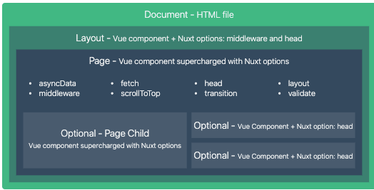

# Nuxtjs


## 为什么要用 Nuxtjs

Nuxtjs 是 vuejs 的一个服务端渲染（SSR：server side render）框架，这种服务端渲染就是对 在服务端将 vue 编译讯渲染后成 html 之后在返回给浏览器，这样做的好处就是**有利于 SEO**。因为使用vue开发的应用基本上所有的 html 的 DOM 元素都是动态生成的，这样也就导致了，当查看源码的时候 html 上就只有几行代码而已，并且都是对 js 文件的引用，而浏览器的爬虫是不会进入到 js 文件中查看具体代码的，因此是不利于做SEO的。


## 哪些应用 / 网站适合使用 SSR。

如果应用 / 网站需要通过浏览器做引流的就需要使用SSR，如新闻、博客、电影、官网等网站或者应用。

在以前也是有SSR 的，并且以前的应用更加广，以前是可以使用 php、J2EE 这些技术做的，但是后来应为 前后端分离开发的趋势越来越大，采用这种方式进行开发的人也越来越多，后面就逐渐少了。


## Nuxt.js是特点（优点）：

- 基于 Vue.js
- 自动代码分层
- 服务端渲染
- 强大的路由功能，支持异步数据
- 静态文件服务
- ES6/ES7 语法支持
- 打包和压缩 JS 和 CSS
- HTML头部标签管理
- 本地开发支持热加载
- 集成ESLint
- 支持各种样式预处理器： SASS、LESS、 Stylus等等


## Nuxt SSR工作原理

以往用Vue编写的项目一般都是 SPA 的项目，具有快捷，方便的特性，而且由于使用声明式编程的形式进行开发，开发效率也会比较高，但是对SEO并不友好，因为页面上的内容都是通过JS 进行动态生成的，也就说搜索引擎首页到的页面其实是一个空白的页面。而如果要对SEO友好，就需要后端将页面的内容全部返回。

Nuxt 其实就相当于是一个用Vue + NodeJS 服务编写的中台服务器，用Vue来编写页面，并启用一个服务器，当有请求访问页面的时候再将页面在中台中创建并生成好想对应的渲染代码（html+css+js，也就是一个页面），返回给前端。




## 创建项目

可以通过 `create-nuxt-app`脚手架进行项目创建

```shell
npx create-nuxt-app <项目名>
```

也可以直接安装nuxt，之后再自己创建项目的架构

```shell
mkdir <项目名> && cd <项目名>
npm init
npm install nuxt
```

之后可以再`package.json`中配置相应的命令

```json
{
  "name": "my-app",
  "scripts": {
    "dev": "nuxt",
    "start":"nuxt start",
    "build":"nuxt build",
    "generate":"nuxt generate"
  }
}
```

> Nuxt.js 中已经集成了vue，vuex，vue-router，还有一个服务端框架

需要注意的是Nuxt.js 会依据 `pages` 目录中的所有 `*.vue` 文件生成应用的路由配置


## nuxt 项目的的目录结构

```
|-- .nuxt                            // Nuxt自动生成，临时的用于编辑的文件，build
|-- assets                           // 用于组织未编译的静态资源入LESS、SASS 或 JavaScript
|-- components                       // 用于自己编写的Vue组件，比如滚动组件，日历组件，分页组件
|-- layouts                          // 布局目录，用于组织应用的布局组件，不可更改。
|-- middleware                       // 用于存放中间件
|-- pages                            // 用于存放写的页面，我们主要的工作区域
|-- plugins                          // 用于存放JavaScript插件的地方
|-- static                           // 用于存放静态资源文件，比如图片
|-- store                            // 用于组织应用的Vuex 状态管理。
|-- .editorconfig                    // 开发工具格式配置
|-- .eslintrc.js                     // ESLint的配置文件，用于检查代码格式
|-- .gitignore                       // 配置git不上传的文件
|-- nuxt.config.json                 // 用于组织Nuxt.js应用的个性化配置，已覆盖默认配置
|-- package-lock.json                // npm自动生成，用于帮助package的统一性设置的，yarn也有相同的操作
|-- package.json                     // npm包管理配置文件
```


## 关于一些配置项

### 配置开发服务的端口和地址

可以在 nuxt.config.js 中配置服务的端口和地址

```js
export default {
  server: {
    port: 8000, // default: 3000
    host: '0.0.0.0' // default: localhost,
  }
}
```

这个的意思就是在执行 nuxt 命令的时候加上以上参数 ，如 `npm run dev`对应的是`nuxt`,就是 `nuxt --host 127.0.0.1 –port 3000`

### 关于样式配置

可以在 nuxt.config.js 中配置初始化样式

```js
export default = {
  css:["~assets/css/init.css"] 
}
```

~ ：是根目录的别名

一般设置这个属性是为了添加一些默认的样式，或者是使不同浏览组件的样式差异减小（统一样式），这个也可以使用 github 上现成的库 `normailze.css`(使很多浏览器css效果差异变得最小)


### 关于覆盖 webpack 部分配置

在nuxt.config.js里是可以对webpack的基本配置进行覆盖的，比如现在我们要配置一个url-loader来进行小图片的64位打包。就可以在nuxt.config.js的build选项里进行配置。

```js
build: {
    loaders:[
      {
        test:/\.(png|jpe?g|gif|svg)$/,
        loader:"url-loader",
        query:{
          limit:10000,
          name:'img/[name].[hash].[ext]'
        }
      }
    ],
}
```

其他的配置可以参考[官网中的配置](https://www.nuxtjs.cn/api/configuration-build)


### 关于开发代理

在 Nuxt 中设置开发代理时比较麻烦的，需要安装`@nuxtjs/axios`，`@nuxtjs/proxy`这两个库，然后在`nuxt.config.js`中进行配置

```js
export default {
  modules: [
    '@nuxtjs/axios',
    //'@nuxtjs/proxy'，这个可以不引入，但是必须要安装
  ],

  axios: {
    proxy: true // 开启代理
  },

  proxy: {
    '/api/': { target: 'http://api.example.com', pathRewrite: {'^/api/': ''} }
    '/api2/': 'http://api.another-website.com'
  }
}
```

**需要注意的是，在修改配置文件之后需要先进行打包`npm run build`，之后在`npm run dev`才会生效果**

> 在github上查找nuxt相关的库（模块）的时候，如果按`@nuxtjs/axios`进行搜索的话是搜索不到，正确的搜索应该是`axios-module`，`proxy-module`.
>
> nuxt的专用库可以在(https://github.com/nuxt-community)，这个专栏中查看


## 路由使用

### 路由配置

在 nuxt 中无需自己亲自配置和书写路由配置。nuxt 会根据 pages 目录下的文件夹自行创建路由配置，可以在 .nuxt/router.js 中查看。如 `pages/news/index.vue`，将会被编译成下面这样，并且默认使用的首路由懒加载

```js
{
  name:"news",//表示的是 index.vue
  path:"/news",
  component:"pages/news/index.vue"
}
```

nuxt 中有和 vue-router 中的`<route-link> <route-view>`相对应的组件`<nuxt-link>`，`<nuxt-child>`用法基本一致，同样的在也可以使用编程式导航`this.$router.push()`等。

### 嵌套路由，动态路由，视图

关于动态路由、嵌套路由的创建安方法可以在[官网](https://www.nuxtjs.cn/guide/routing)查看。


## 默认模板和默认布局

### 默认模板

模板可以将组件添加的默认的 HTML 中也就是相当于将组件插入到网页中。如果需要使用默认模板可以在根目录中创建 app.html 文件，这个就是 nuxt 默认模板文件

```html
<!DOCTYPE html>
<html {{ HTML_ATTRS }}>
  <head {{ HEAD_ATTRS }}>
    {{ HEAD }}
  </head>
  <body {{ BODY_ATTRS }}>
    {{ APP }}
  </body>
</html>
```

这里的`{{HEAD}}`读取的是nuxt.config.js里的信息，`{{APP}}`就是我们写的pages文件夹下的主体页面了。需要注意的是HEAD和APP都需要大写。


### 默认布局

使用默认布局也是可以达到和默认模板相同的效果的，只需要在 `layouts/default.vue `中定义就好

```vue
<template>
  <div>
    <h2>my nuxt demo</h2>
    <nuxt />
  </div>
</template>
```

其中`<nuxt />`就相当于是一个占位符，那个页面使用了这个布局`<nuxt />`就是哪个页面。

**使用其他布局**

`layouts/blog.vue`

```vue
<template>
  <div>
    <h2>my nuxt demo2</h2>
    <nuxt />
  </div>
</template>
```

使用

```vue
<template>
  <!-- Your template -->
</template>
<script>
  export default {
    layout: 'blog'
    // page component definitions
  }
</script>
```


## 设置错误页面和个性meta标签

### 设置错误页面

可以在 layouts 目录下创建 error.vue 进行错误页面的自定义

```vue
<template>
  <div>
      <h2 v-if="error.statusCode==404">404页面不存在</h2>
      <h2 v-else>500服务器错误</h2>
      <ul>
          <li><nuxt-link to="/">HOME</nuxt-link></li>
      </ul>
  </div>
</template>

<script>
export default {
  props:['error'],
}
</script>
```

代码用v-if进行判断错误类型，需要注意的是这个错误是你需要在`<script>`里进行声明的，如果不声明程序是找不到error.statusCode的。


### 单独设置个性meta标签

可以在 nuxt.config.js 中设置 head 中的内容，这个是全局设置的。在 nuxt 中提供了一个 head 方法我们去自定义 html 的 head 数据，并且在每个组件中都可以设置，最终在指定页上显示指定的head，如在 pages/news/index.vue 下

```js
export default {
  data(){
    return {
      title: "hello jack"
    }
  },
  head(){
    return {
      title: this.title,
      meta: [
        {hid:"description",name:"news",content:"this is news page"}
      ]
    }
  }
}
```

hid 相当于一个唯一标识，如果有重复会被覆盖。如果没有就会新增。


## 安装第三方库

假如我们想使用 [vue-notifications](https://github.com/se-panfilov/vue-notifications) 显示应用的通知信息，我们需要在程序运行前配置好这个插件。

首先增加文件 `plugins/vue-notifications.js`：

```js
import Vue from 'vue'
import VueNotifications from 'vue-notifications'

Vue.use(VueNotifications)
```

然后, 在 `nuxt.config.js` 内配置 `plugins` 如下：

```js
module.exports = {
  plugins: ['~/plugins/vue-notifications']
}
```

**plugins 中注册的文件会在运行的时候被引入调用**

如果插件位于`node_modules`并导出模块，需要将其添加到`transpile`构建选项：

```js
module.exports = {
  build: {
    transpile: ['vue-notifications']
  }
}
```

**插件模式**

`nuxt.config.js`:

```js
export default {
  plugins: [
    { src: '~/plugins/both-sides.js' },
    { src: '~/plugins/client-only.js', mode: 'client' },
    { src: '~/plugins/server-only.js', mode: 'server' }
  ]
  //plugins: [
  //  '~/plugins/foo.client.js', // only in client side
  //  '~/plugins/bar.server.js', // only in server side
  //  '~/plugins/baz.js' // both client & server
  //]
}
```


**安装使用 element-ui**

```shell
npm i element-ui
```

`plugins/element-ui-plugin.js`

```js
import Vue from 'vue'
import Element from 'element-ui'
import locale from 'element-ui/lib/locale/lang/en'

Vue.use(Element, { locale })
```

`nuxt.config.js`

```js
export default {
  css: ['element-ui/lib/theme-chalk/index.css'],
  plugins: [
    '@/plugins/element-ui-plugin'
  ],
  build: {
    transpile: [/^element-ui/],
  }
}
```


## [使用Vuex](https://www.nuxtjs.cn/guide/vuex-store)


## 服务端API

### asyncData 异步数据加载

asyncData 方法是nuxt 提供给我们的在组件被初始化前去加载准备数据的方法，但需要**注意**的是由于`asyncData`方法是在组件 **初始化** 前被调用的，所以在方法内是没有办法通过 `this` 来引用组件的实例对象。

`asyncData(context,callback)` 接收两个参数，第一个是当前主键的执行上下文（包括，请求参数，请求对象，响应对象等），第二个参数相当于是 data 方法和Object.assign 的结合，可以将数据导出到 data 中。但是 asyncData 的返回值应该要是一个 对象，这个对象将会被合并到 data中去

```js
export default {
  data(){
    return {
      title:"hello",
    }
  }
  asyncData(){
    let data = null;				//返回 {title:"world",name:"haha"}
    axios.get("http://localhost:3000/getData").then(res=>{
      data = res.data;
    })
    return data;
  }//之后就可以在模板中 直接使用 title 和 name
}
```

> **beforeCreate 和 created 会在服务端进行执行，为什么不在这里进行数据请求？**
>
> 因为服务端是以同步的方式执行 beforeCreate 和 created 的，而请求是异步的，服务端并不会等结果返回才渲染，而是执行完之后继续下一步，所以在 beforeCreate 和 created 请求得到的时候并不会被渲染到 html 中。
>
> 这里还有一个**大坑**，asyncData 只在首屏被执行，其它时候相当于 created 或 mounted 在客户端渲染页面。
>
> 也就说，asyncData达到首屏初始化效果的，只能是从浏览器输入url的那个链接，或者重新刷新后的链接。如果是当前页面的跳转，它仅是客户端加载，无法达到渲染的效果。
>
> **且asyncData为页面级生命周期，不支持组件级别。**

### fetch 填充应用的状态树

fetch 方法用于在渲染页面前填充应用的状态树（store）数据， 与 asyncData 方法类似，不同的是它不会设置组件的数据。

如果页面组件设置了 `fetch` 方法，它会在组件每次加载前被调用（在服务端或切换至目标路由之前）。

```js
<template>
  <h1>Stars: {{ $store.state.stars }}</h1>
</template>

<script>
  export default {
    fetch({ store, params }) {
      return axios.get('http://my-api/stars').then(res => {
        store.commit('setStars', res.data)
      })
    }
  }
</script>
```

> **asyncData 和 fetch**
>
> + asyncData只能用于页面组件，不能用于自定义组件，它可以返回一个对象，该对象中的值会覆盖data中对应的属性值。
> + fetch 可以在任何组件中使用，无论是页面组件还是自定义组件（Nuxt的2.12版本及之后，fetch的用法跟之前的版本完全不一样，而如果你在fetch中接受了一个context对象，那么它将被视为旧版的fetch，旧版的fetch中不能使用this.xxx来响应式的修改数据，但是新版可以）
> + 这2个生命周期都是在服务端中运行

### validate参数校验

nuxt 提供了一个路由参数验证的函数 `validate(routeParams)`，接收路由参数对象，在 pages/news/_id.vue

```js
export default {
  validate({params}){
    return /^\d+$/.test(params.id);
  }
}
```

如果返回的是 true 则正常显示页面，如果是 false 则显示 nuxt 准备的错误页面。

## 关于生命周期

Vue 的生命周期中只有`beforeCreate`，`created`会在服务端和客户端运行，其他的生命周期都只会在客户端运行。所以我们平常在Vue的`mounted`中的请求将不会被执行。

在服务端执行完成Vue的整个流程生成对应的html文件之后，相应的js部分代码也会被生成并加入到html中，所以之后在客户端显示html页面的时候Vue中的生命周期等函数也会被执行

## 配置环境变量

如果`.env`在项目根目录中有文件，它将使用[dotenv](https://github.com/motdotla/dotenv)自动加载，并且可以通过`process.env`进行访问，也可以`nuxt dev --dotenv <file>`来指定文件

`.env`:

```text
BASE_URL=/api
PUBLIC_URL=https://nuxtjs.org
API_SECRET=1234
```

`nuxt.config.js`:

```js
export default {
  publicRuntimeConfig: {
    baseURL: process.env.BASE_URL
  },
  privateRuntimeConfig: {
    baseURL: '${PUBLIC_URL}${BASE_URL}',
    API_SECRET: '${API_SECRET}' // similar to using process.env.API_SECRET
  }
}
```

- `publicRuntimeConfig`可用于`$config`服务器和客户端。
- `privateRuntimeConfig`仅在使用相同**的服务器上可用**`$config`（它覆盖`publicRuntimeConfig`）

`$config`在上下文中的任何地方都可用（包括页面、store和插件）

```js
export default {
  asyncData({ $config: { baseURL } }) {
    fetch(`${baseURL}/test`)
  },
  mounted() {
    console.log(this.$config.API_SECRET)
  }
}
```


## 发布项目

nuxt 有两种发布模式

1. 一种是通过`nuxt generate`命令将每个页面都编译打包成HTML文件（会放在dist文件夹），然后将这些HTML文件部署到静态服务器上
   + 这样打包有一个弊端，当你首屏的数据发生更改的时候，他还是显示的是之前的数据，要想改变的话，需要重新打包发布才行。
   + 所以，如果你的首屏是动态的就不建议使用这种打包方式了。
   + 打包之后每个页面都生成了HTML页面，只有首屏的数据是之前渲染好了，但是其它数据还是从后台获取，比如翻页，第二页数据是重新请求后台的，你再次返回第一页也是再次请求的
2. 一种是通过`nuxt build`命令进行打包生成的是动态页面（这种方式是需要自己启动服务器的），然后将项目中除了`.nuxt 、node_modules`之外的所有文件都复制到服务器中（最好是放到一个文件夹中），然后运行`npm i`，`npm run start`就可以开启服务了。

https://blog.csdn.net/Tomwildboar/article/details/102745299


## 静态资源文件和生产静态HTML

一些图片在项目开发时可用，但是打包后就不可用了，这可能是因为自己运行html文件中的原因，nuxt 需要运行在服务端开可以动态的路由请求到响应的资源，本地的话是不可以的。

一般静态资源文件都是放在 /static 下的。在引入的时候可以 使用 `~` 代替根目录，这样方便查找

```css
<div></div>
 .diss{
    width: 300px;
    height: 100px;
    background-image: url('~static/logo.png')
  }
```


## 参考

[Vue现有项目改造为Nuxt项目](https://segmentfault.com/a/1190000019909396)

https://juejin.cn/post/6844904067584507911

[Nuxt.js 从入门与分析，实践后的近万字总结](https://juejin.cn/post/7019486902336094238#heading-14)