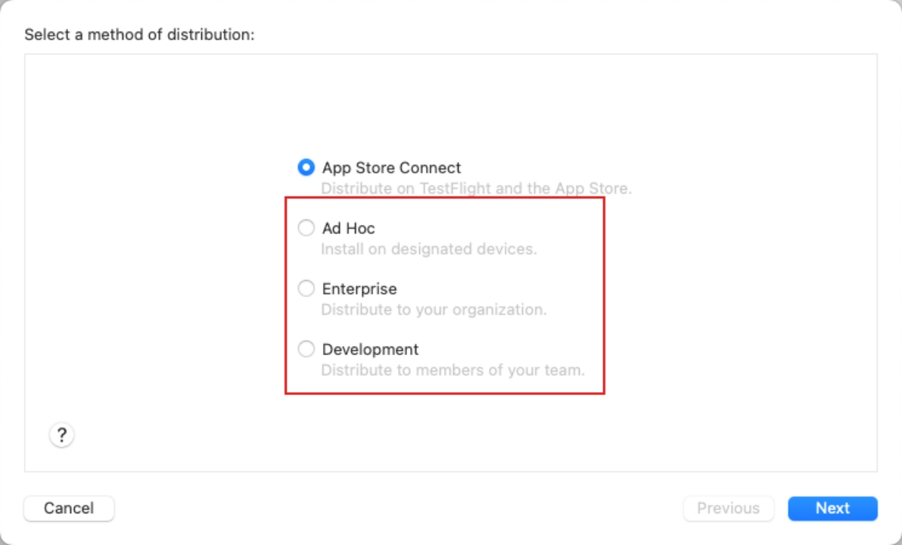
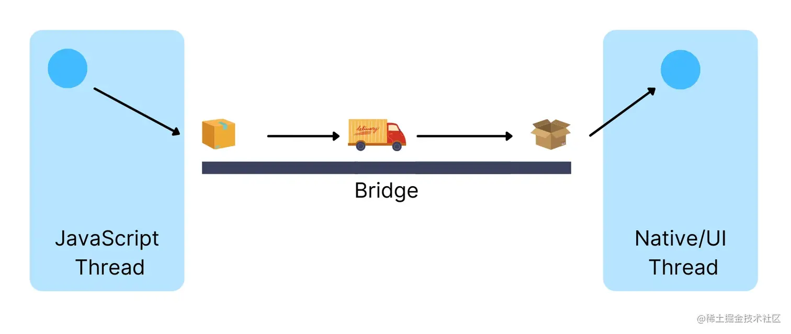
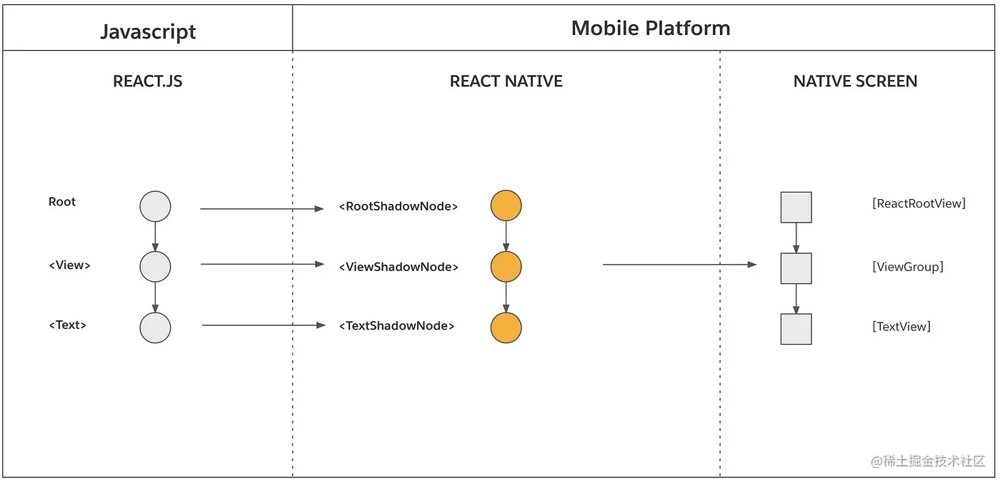
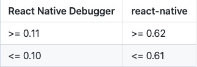
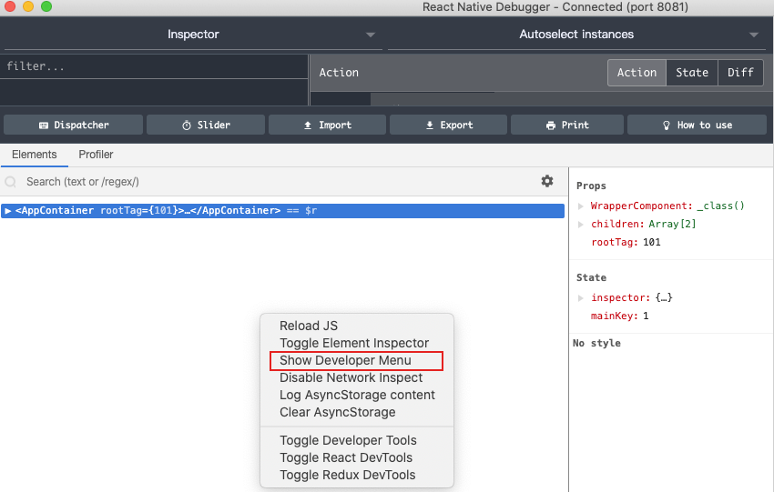

## app的分类

目前 app 分为原生app ，web App，以及Hybird App（混合app），他们三者的主要区别是

**原生app**：基于手机本地环境进行开发，可以调度、访问、使用手机上资源，但是对于不同的平台需要使用不同的语言和工具进行开发，开发难度和开发周期会比较长。

**web app**：使用 html5，css，javascript 等纯前端技术进行开发，开发难度低，且开发周期短，但是web app是运行在手机浏览器上的并且资源都存储在云端服务器上，这也导致了每次打开app 都需要去请求资源，用户体验略差，并且也不能调用手机上的 资源和功能（位置，摄像头等）。

**Hybird App**：结合了原生app资源使用自由和web app 开发成本低的优点，开发成本低，可以调用手机上的资源。Hybird App 的底层使用的是一套编写好的手机原生框架，可以开放给其他的框架进行接入，所以开发 Hybird App 的方式也很多 ，如 react native，uniapp，taro 等。


## **环境搭建**

跟着React Native中文网的[搭建开发环境](https://reactnative.cn/docs/environment-setup)教程来搭建就可以了，不过有几个需要注意的地方

### 对于 Android  SDK

按照教程来搭建基本不会有什么问题，最主要的问题就是在安装Android SDK的时候，如果没有使用科学上网工具的话，一般是下载不成功的，所以最好是根据教程上写的用科学上网工具来代理下载，一般可用的科学上网工具有很多比如[蓝灯](https://github.com/getlantern/lantern)，[佛跳墙](https://github.com/getfotiaoqiang/fotiaoqiang)，[pigcha](https://pigpigchacha.github.io/officialsite)，[clash](https://doc.loxcloud.com/android-clash.html)，[极光](https://www.toolait.cn/app/893.html)等等。

### 对于 Android 模拟器

我觉得 Android Studio 里面的模拟器已经很够用了不用安装 genymotion 等其他的模拟器了，可以在Android Studio中的 `Tools -> Android AVD`中创建和管理模拟器。将项目的`AwesomeProject/android`导入到项目中编译并运行到模拟器，然后再运行`yarn android`即可。

> **Android的一些常用命令**
>
> + `android list avd`  查看现在有哪些模拟器可以使用，
> + `emulator -avd 模拟器名字`或者`emulator @模拟器名字`  启动相应的模拟器。
> + `adb devices`  查看当前运行中的模拟器
> + `android list target` 列出当前可用的SDK版本
> + `android create avd -n <name> -t <targetID> [-<option> <value>]` 创建模拟器，最好是在Android studio 中创建
> + `adb push D:\test.txt /sdcard/` 将D盘的`test.txt`文件添加到模拟器的`/sdcard/`下
> + `adb pull /sdcard/test.txt D:\ `将模拟器的`test.txt` 文件复制到`D:\`
> + `adb shell pm setInstallLocation 1`默认安装在手机内存
> + `adb shell pm setInstallLocation 2`默认安装在SD卡
> + `adb shell input keyevent 82` 打开模拟器调试面板
>
> 其他的常用[命令….](https://blog.csdn.net/gabbzang/article/details/9393981)

### 其他的一些问题

> [VSCode终端不能使用命令](https://blog.csdn.net/weixin_51781586/article/details/114577951)
>
> [使用第三方模拟器运行react native项目](https://www.jianshu.com/p/3ed09488058c)
>
> [使用VsCode开发调试React Native笔记](https://www.jianshu.com/p/dfa3d8ea6d90)
>
> [react-native系列(3)入门篇：使用VSCode及RN的代码调试过程](https://blog.csdn.net/zeping891103/article/details/85860149)
>
> [RN Android "unabled to connect with remote debugger"](https://www.jianshu.com/p/abda49aac8b2)


### 对于 IOS 环境

只要跟着React Native中文网来做的话都不会有太大的问题，最难搞的就是使用`pod install`的时候出现的一些不明所以的问题.

**错误一：**

```shell
[!] Oh no, an error occurred.
Search for existing github issues similar to yours:
https://github.com/CocoaPods/CocoaPods/search?q=invalid+byte+sequence+in+US-ASCII&type=Issues
```

主要原因应该是，Profile 文件的编码方式被改变了，所以修改一下即可

```shell
$ export LANG=en_US.UTF-8
$ export LANGUAGE=en_US.UTF-8
$ export LC_ALL=en_US.UTF-8
```


**错误二：**

```shell
[!] Oh no, an error occurred.  
  
Search for existing GitHub issues similar to yours:  
https://github.com/CocoaPods/CocoaPods/search?q=No+such+file+or+directory+-+%2FUsers%2Frwx-mac%2FDesktop%2FHe%2FHeAmap%2FPods%2FAMapSearch%2FAMapSearchKit.framework%2FResources&type=Issues  
```

主要的原因应该是pod的版本问题

解决方式一：从新安装pod的repos/master

```shell
cd ~/.cocoapods/repos
rm -rf master
pod setup
```

解决方式二：更新cocoapods

```shell
$ sudo gem update --system
$ sudo gem install cocoapods -n/usr/local/bin
```

解决方式三：重新安装cocoapods

```shell
sudo gem uninstall cocoapods
sudo gem install cocoapods
pod setup
```

解决方式四：安装0.38.1版本cocoapods

```shell
sudo gem uninstall cocoapods
sudo gem install cocoapods -v 0.38.1
sudo rm -rf ~/.cocoapods && sudo rm -fr ~/.cocoapods/repos/master && pod setup && pod install
```


**错误三：**


这个错误一般是在安装某个模块的时候出现的，是因为网络差导致的，毕竟pod也是优先使用国外的资源的，所以要解决这个问题可以修改数据源

对于旧版的 CocoaPods 1.3之前 可以使用如下方法使用 tuna 的镜像：

```shell
$ pod repo remove master
$ pod repo add master https://mirrors.tuna.tsinghua.edu.cn/git/CocoaPods/Specs.git
$ pod repo update
```

新版的 CocoaPods 1.3之后 不允许用pod repo add直接添加master库了，但是依然可以：

```shell
$ cd ~/.cocoapods/repos 
$ pod repo remove master
$ git clone https://mirrors.tuna.tsinghua.edu.cn/git/CocoaPods/Specs.git master
```

最后进入自己的工程，在自己工程的podfile第一行加上：

```
source 'https://mirrors.tuna.tsinghua.edu.cn/git/CocoaPods/Specs.git'
```

如果你用的是cocoapods1.8，可以还会报CDN错误，可以再执行一下这个

```shell
pod repo remove trunk
```

如果这样改完之后下载速度还是很慢的话建议使用一下git/npm代理工具进行加速，如边车[dev-sidecar](https://gitee.com/docmirror/dev-sidecar)


**错误四：**

```shell
[!] /bin/bash -c 
set -e
#!/bin/bash
# Copyright (c) Facebook, Inc. and its affiliates.
#
# This source code is licensed under the MIT license found in the
# LICENSE file in the root directory of this source tree.

set -e

PLATFORM_NAME="${PLATFORM_NAME:-iphoneos}"
CURRENT_ARCH="${CURRENT_ARCH}"
.....
```

解决方式

```shell
sudo xcode-select --switch /Applications/Xcode.app
```


其他问题

```shell
pod search boost

npm config set registry https://registry.npm.taobao.org
npm config set disturl https://npm.taobao.org/dist

sudo chmod go-w /usr/local/bin #需要授权的路径
```


### 对于旧项目迁移到新设备

**arm64 问题**

在用react native开发IOS端项目的时候，如果用比较新机器，或者说用新版本的xcode（12以上）来运行旧项目的时候可能会报错，显示很多第三方库或者原生东西需要`arm64`版本的包才可以运行。

比如 原本是 rn 0.58 版本的ios项目在xcode12上运行是正常的，但是迁移到xcode13（macos mini M1芯片）的时候就会报错，需要`arm64`

```
"building for iOS Simulator, but linking in object file built for iOS, file '/Users/.../Pods/AlipaySDK-iOS/AlipaySDK.framework/AlipaySDK' for architecture arm64

clang: error: linker command failed with exit code 1 (use -v to see invocation)"
```

原因是因为xcode 在12之后就默认只打包64位的应用了，之前是有使用32位的，所以会报错

**解决**

右键点击` xcode -> 显示简介 `然后将`使用Rosetta打开`钩上，之后关闭，重启 xcode ，清理掉缓冲就可以了，重新以debug模式运行到模拟器就好了，（但是需要注意的是这样改可以以debug模式运行到模拟器、真机，release模式只能运行到真机，但是不能运行到模拟器；也可以用来发布项目）


https://mirari.cc/2021/07/28/M1%E8%8A%AF%E7%89%87Mac%E6%90%AD%E5%BB%BAios%E5%BC%80%E5%8F%91%E7%8E%AF%E5%A2%83%E8%B8%A9%E5%9D%91/


**main.jsbundle 不存在问题**

在完成上面的步骤之后运行到模拟器上是没有问题的，但是当发布项目的时候就可能会报错`main.jsbundle`文件不存在

```
main.jsbundle does not exist. this must be a bug with + echo 'react native
```

**解决**

在项目中运行下面命令生成`main.jsbundle`

```shell
react-native bundle --entry-file index.js --platform ios --dev false --bundle-output ios/main.jsbundle --assets-dest ios
```

> 如果没有全局安装过`react-native-cli`，需要在前面加上 npx

之后打开Xcode>选择项目目标>在构建阶段中将`main.jsbundle`添加到`Copy Bundle Resource`


之后在 `AppDelegate.m`上替换

```objc
jsCodeLocation = [[RCTBundleURLProvider sharedSettings] jsBundleURLForBundleRoot:@"index" fallbackResource:nil];
```

为

```objc
#if DEBUG
jsCodeLocation = [[RCTBundleURLProvider sharedSettings] jsBundleURLForBundleRoot:@"index" fallbackResource:nil];
#else
jsCodeLocation = [[NSBundle mainBundle] URLForResource:@"main" withExtension:@"jsbundle"];
#endif
```

> 如果只写`jsCodeLocation = [[NSBundle mainBundle] URLForResource:@"main" withExtension:@"jsbundle"];`可能会导致debugger服务无法打开

**特别注意的是在以release模式打包到真机的话需要重新运行一下命令生成`main.jsboundle`和资源，这样新修改的代码才会被打包就去。**因为在debug模式的时候是使用`/index.js`来作为入口的，release模式下是用`main.jsboundle`最为入口的

https://www.codenong.com/49505446/


**打包到真机没有静态资源图片**

完成上面操作之后运行到模拟器上可能是正常的，而到真机上可能会出现静态资源图片不显示的问题，这是因为，打包出来的图片并没有被添加到app程序上。

**解决**

其实在生成`main.jsbundle`文件的时候，同时也生成了`ios/assets`文件夹，这个文件夹就是打包生成的静态文件资源。然后将这个文件夹也添加到`Copy Bundle Resource`即可

https://blog.csdn.net/weixin_43586120/article/details/104622566


**关于`__attribute__((__unused__))`为null**

```
static BOOL RCTParseUnused(const char **input)
{
  return RCTReadString(input, "__unused") ||
         RCTReadString(input, "__attribute__((unused))");
}
```

替换为

```
static BOOL RCTParseUnused(const char **input)
{
  return RCTReadString(input, "attribute((unused))") ||
         RCTReadString(input, "__attribute__((__unused__))") ||
         RCTReadString(input, "__unused");
}
```

https://my.oschina.net/jack088/blog/4333197

https://github.com/qiuxiang/react-native-amap-geolocation/tree/v1.0.0/docs


**关于`_initializeModules:(NSArray<id<RCTBridgeModule>> *)modules`问题**

```
- (NSArray<RCTModuleData *> *)_initializeModules:(NSArray<id<RCTBridgeModule>> *)modules
                               withDispatchGroup:(dispatch_group_t)dispatchGroup
                                lazilyDiscovered:(BOOL)lazilyDiscovered
```

替换

```
- (NSArray<RCTModuleData *> *)_initializeModules:(NSArray *)modules
                               withDispatchGroup:(dispatch_group_t)dispatchGroup
                               lazilyDiscovered:(BOOL)lazilyDiscovered
```


**开发时真机调试接收不到消息推送**

先检查一下消息推送证书有没有过期，过期了就去开发者后台重新下载一个并下载安装（只需要下载安装生产版本的就好，沙盒版本的可以用在开发环境，生产版本的可以用在开发环境也可以用在生产环境）。

之后生成新的 .p12 文件，设置验证密码为 1234，然后将 .p12 文件和验证密码发给后端进行配置

如果还是不行就尝试一下，不同数据线链接进行打包，而是使用 archer 打包生产包，然后使用app的下载链接进行下载安装（这种方式打包出来的是使用生产版本的证书，而使用数据线直接打包使用的应该是开发环境的证书）

 

 https://www.jianshu.com/p/062cee6fa136

https://www.jianshu.com/p/fc962db539e6

https://www.jianshu.com/p/2eac49af58bf


## 关于安装第三方库

对于一些不依赖于与原生代码的库可以直接使用`npm`或`yarn`安装之后使用，有一些库基于一些原生代码实现，你必须把这些文件添加到你的应用，否则应用会在你使用这些库的时候产生报错

下载某个库到本地

```shell
npm install ******
```

链接某个库到项目中

```shell
react-native link *****
```

React Native 0.60 及更高版本链接是自动的，但是对于Mac开发IOS可能还需要在项目中运行`cd ios && pod install`进行链接

> 在接入高德地图的时候，在使用`react-native-amap-geolocation`的时候需要注意rn 0.6之前的使用 1.0.0 版本的
>
> https://my.oschina.net/jack088/blog/4333197
>
> https://github.com/qiuxiang/react-native-amap-geolocation/tree/v1.0.0/docs


## 关于布局

在react-native中大多数容器默认已经开启为`display:flex;`布局，并且默认的排列方向（主轴方向）是`flex-directive:column`垂直方向。所以在react-native中可以直接给元素定义flex的相关属性。


## 关于导出的原生方法

有时候 App 需要访问平台 API，但 React Native 可能还没有相应的模块封装；或者你需要复用 Objective-C、Swift 或 C++代码，而不是用 JavaScript 重新实现一遍；又或者你需要实现某些高性能、多线程的代码，譬如图片处理、数据库、或者各种高级扩展等等。

官方文档上也详细的给出了使用文档，不过不需要注意的是`RCT_EXPORT_METHOD`**导出的是实例方法，而不是类方法**，所以在导出的方法中可以访问到实例属性


## 关于React-Native的基本原理

### react native和原生如何进行通信？



JS 与 Native 之间的通信是通过 JSBridge 来完成的。

当 JS 调用某个 Native 方法（比如开启蓝牙权限）时，一般会执行以下事项：

1. JS 线程将事件消息序列化成 JSON
2. JS 线程将序列化后的 JSON 信息传递给 JSBridge
3. JSBridge 将信息传递给 Native 之前，会先将其反序列化
4. Native 线程接收到反序列化后的信息，并执行对应的 Native 代码


### react native 如何将UI渲染为原生UI



架构的渲染器是 UI Manager，当我们执行页面渲染时，它是这么运行的：

1. React 在 JS 侧会根据代码创建一个 ReactElementTree
2. 渲染器会根据 ReactElementTree 在 C++ 层创建一个 ReactShadowTree
3. 布局引擎（比如 Yoga）会处理这个 ReactShadowTree 并计算出元素的布局位置
4. 处理完成后，ShadowTree 会被转换成由 Native 组件构成的 HostViewTree（比如 View 组件会被转换成 Native 的 ViewGroup 组件）

架构中通信都是要经过 JSBridge 的，因此旧架构的渲染器也会存在转换慢以及重复数据等问题。同时由于通信非同步，会存在前面提到的渲染阻塞问题。


### react native 如何查找原生模块

所有 NativeModules 在 App 启动时都需要被初始化：

1. 首先 Native 开发者先定义好接口，然后把 NativeModules 注册进一个 Module 列表中
2. RN 在启动时，会把所有的 Modules 初始化，并生成一份映射表，这份映射表会被注入到 C++ 层和 JS 层
3. 这样，在 Native 层、C++ 层和 JS 层都存在同一份映射表，JS 可以通过 JSBridge 调用映射表中对应的 Native 方法

架构存在一个很明显的问题：即使用户可能永远不会使用到某个 NativeModules，这个 Module 还是会在应用已启动时就被初始化。这有可能会影响到应用的启动时间


### 来源

作者：龙飞_longfe
链接：https://juejin.cn/post/7212143399037190181
来源：稀土掘金


## 关于样式

在react-native中不支持使用样式类名（也就是className）来定义样式，仅支持通过style来设置样式，并且样式的设置需要使用对象来设置`style={{color:'white',backgroundColor:'blue'}}`，react-native中也不全支持css属性，每个组件也都有自己特定的属性，所以具体样式还是要参考文档。

一般通过`StyleSheet`来创建样式

```js
const styles = StyleSheet.create({
  width:110;
})
```

https://www.bookstack.cn/read/react-native-stylesheet-guide/README.md

### 样式的继承

react-native提倡的是每个组件都相互独立互不影响，所以react-native中大多数属性是不可继承的。不过也有例外，React Native 实际上还是有一部分样式继承的实现，不过仅限于文本标签的子树。在下面的代码里，第二部分会在加粗的同时又显示为红色：

```react
<Text style={{ fontWeight: 'bold' }}>
  I am bold
  <Text style={{ color: 'red' }}>and red</Text>
</Text>
```

### 抽离公共样式

有时候多个组件使用的样式是同一基本样式，但是组件之间又略有不同，这时候可以使用数组的方式来设置组件的样式，将公共的样式抽离出来然后添加到各组件的样式数组，并且后面的样式回覆盖前面的样式。

```react
const commonStyle = {fontSize:30,color:'skyblue'};
<Text style={[backgroundColor:'yellow',commonStyle]}>and red</Text>
<Text style={[backgroundColor:'green',commonStyle]}>and red</Text>
```

### StyleSheet样式表的优点

采用StyleSheet样式表的优点注意如下： 

 **从代码质量角度来分析:**

- 从render渲染方法中移除了styles样式相关代码，这样可以使代码更加容易阅读
- 通过对不同样式命名，正好也是对render方法中的组件的一种标志
- 这样的写法做到了业务和样式的分离，为后面分层开发打下了基础

**从性能角度来分析:** 

+ 通过StyleSheet，我们可以通过标志的样式ID来引用，而不是每次都要创建一个新的Style对象   
+ 该允许样式通过桥接在原生代码和JavaScript中传递一次，后面全部通过该id进行引用(不过现在该功能还没有实现)


## 基础组件的使用

### View

View 组件相当于是 div 标签，就是一个普通的容器，不过不可以插入文本节点`<View>hello</View>`，文本节点需要使用Text来包裹`<View><Text>hello</Text></View>`，也不能设置字体大小、颜色等。

### Text

Text 组件相当于是一个 span 标签，不过里面的布局不是按flexbox进行布局的，而是文本排列布局。这意味着`<Text>`内部的元素不再是一个个矩形，而可能会在行末进行折叠。

### TextInput

文本输入组件，相当于是一个`textarea`标签，可以输入单行或者多行文本。

在使用`TextInput`组件的时候可能会遇到一种常见的问题就是，聚焦的时候弹出软键盘可能会把输入框挡住，这时候可以使用`<KeyboardAvoidingView>`将不想被遮住的内容包裹住，它的作用就是在弹出软键盘的时候会将内容的位置做出调整。

还有一个问题就是，当只有一个`TextInput`的时候，聚焦后点击其他地方不会失去焦点导致软键盘收不起来，这时候可以使用`<ScrollView keyboardShouldPersistTaps='never' >`来包裹内容，之后在点击其他的组件的时候`TextInput`就会失去焦点

### Image与ImageBackground

两个组件都是用来加载图片的，不过Image加载的是普通图片，ImageBackground用来加载背景图片，不过Image标签中不能插入内容，而ImageBackground则是相当于一个带背景的容器。通过设置`source`来确定图片，`source`接收的是一个对象值

对于本地的图片，需要使用`require`来导入图片（`require`返回的也是一个对象，并且也包含了宽高）

```react
<Image source={require('./assets/a.png')}>
<ImageBackground source={require('./assets/a.png')}>
```

对于网络图片或者base64的图片可以使用`{uri:'https://picsum.photos',width:30,height:30}`来设置（记得要设置宽高，否则图片不会显示），这里的`width height`指的是图片的宽高，而不是容器的宽高，容器的宽高需要通过`style`来设置

```react
<Image source={{uri:'https://picsum.photos',width:30,height:30}}>
<ImageBackground source={{uri:'https://picsum.photos'},style={{width:30,height:30}}}>
```

如果图片大小和容器大小不一致，可以使用`style={{resizeMode:'cover'}}`或者`<Image source={require('./assets/a.png') resizeMethod='scale'}>`来设置图片的缩放模式

需要注意的是默认情况下 Android 是不支持 GIF 和 WebP 格式的，需要在`android/app/build.gradle`文件中根据需要手动添加以下模块：

```
dependencies {
  // 如果你需要支持Android4.0(API level 14)之前的版本
  implementation 'com.facebook.fresco:animated-base-support:1.3.0'

  // 如果你需要支持GIF动图
  implementation 'com.facebook.fresco:animated-gif:2.5.0'

  // 如果你需要支持WebP格式，包括WebP动图
  implementation 'com.facebook.fresco:animated-webp:2.5.0'
  implementation 'com.facebook.fresco:webpsupport:2.5.0'

  // 如果只需要支持WebP格式而不需要动图
  implementation 'com.facebook.fresco:webpsupport:2.5.0'
}
```


### Button

Button组件是一个简单的跨平台的按钮组件，它是`TouchableOpacity、TouchableHighlight`或`TouchableNativeFeedback`组件的上层封装，可以理解为`TouchableOpacity、TouchableHighlight`或`TouchableNativeFeedback`是仅有反馈而仅带基础样式的组件，而Button则是带有反馈并且有定制样式的组件。需要注意的是Button在 IOS 和 Android 上的样式表现是不一样的，这样就会让界面在IOS和Android上表现不同意，为了解决这个问题，一般需要我们自己在`TouchableOpacity、TouchableHighlight`或`TouchableNativeFeedback`上封装一个样式统一的组件，或者使用第三方button库（如`react-native-action-button`），或者使用第三方UI库（`react-native-elements`、`ant-design-mobile-rn`）


### ScrollView

是一个滚动组件，这个容器支持纵向滚动，也支持横向滚动，但是必须给组件设置宽高，当内容的宽高超出了容器的宽高才会开启滚动。

**对于子元素容器**
且子元素将会被全部包裹到一个容器元素中，可以通过`contentContainerStyle`来设置容器的样式。考虑到性能问题，一般用来做引导图、轮播图等数据量不大的。

**下拉刷新操作**
对于垂直方向的列表，`ScrollView` 提供了一个`refreshControl`的属性来给提供下拉刷新的功能，`refreshControl`接受一个组件作为值，这个组件必须有两个属性`refreshing`（是否处于刷新状态）和`onRefresh`（刷新时的事件），`react-native`也已经提供给了这个组件`RefreshControl`。


### FlatList | SectionList | VirtualizedList

`ScrollView` 组件比较适合处理数据量少（节点少）的情况，而如果处理数据量比价大的时候就容易出现卡顿的现象，对于数据量大节点多的情况应该使用`FlatList | SectionList | VirtualizedList`。`FlatList | SectionList`都继承于`VirtualizedList`，并且同时拥有`VirtualizedList`与`ScrollView`的所有`props`。

`FlatList`与`SectionList`相差无几，不同的是`SectionList`支持分组，`FlatList`支持多列布局。


### StatusBar

状态栏，一个应用中只有一个状态栏，如果有多个的话后面的会把前面的覆盖掉。


## 获取组件位置和大小

### 获取设备屏幕的宽高

```js
import {Dimensions} from 'react-native';
var {height, width} = Dimensions.get('window');
```

### 获取元素的大小和位置信息

onLayout事件属性

```jsx
<View onLayout={this._onLayout}><View>
```

```js
_onLayout = (e) => {
	let {x,y,width,height} = e.nativeEvent.layout
}
// or
import {NativeModules} from 'react-native'
_onLayout = (e) => {
  	e.persist();
	 NativeModules.UIManager.measure(e.target, (x, y, width, height, pageX, pageY)=>{
     	// todo
	})
}
```

x和y表示左上角的顶点坐标相对于父节点的左上角（0，0），pageX, pageY相对于屏幕的左上角（0，0）

### 元素自带measure方法

```jsx
<View ref={(ref) => this.chatView = ref}></View>
```

在componentDidMount方法里添加一个定时器，定时器里再进行测量，否则拿到的数据为0

```js
setTimeOut(() => {
  this.refs.chatView.measure((x,y,width,height,pageX, pageY) => {
    //todo
  })
});
```

### 使用UIManager measure方法

```js
import {
   UIManager,
   findNodeHandle
} from 'react-native'

handleClick = () => {
	UIManager.measure(findNodeHandle(this.buttonRef),(x,y,width,height,pageX,pageY)=>{
		// todo
 })
}
```

```jsx
<TouchableButton ref={(ref)=>this.buttonRef=ref} onPress={this.handleClick}/>
```


## 网络请求

在软件开发里面不存在跨域的问题（跨域主要是因为浏览ajax引擎的同源策略导致的，而在应用中不存在ajax引擎所以不会有跨越问题）。在react-native中网络请求不再是使用xhr了，而是使用[fetch](https://developer.mozilla.org/zh-CN/docs/Web/API/Fetch_API/Using_Fetch)来发送网络请求了。不过仍然可以使用第三方的网络请求框架如[frisbee](https://github.com/niftylettuce/frisbee)或是[axios](https://github.com/mzabriskie/axios)等。

fetch的简单使用：发送get请求

```js
fetch('https://mywebsite.com/mydata.json').then(res=>res.json()).then(res=>console.log(res));
```

发送post请求

```js
fetch('https://mywebsite.com/endpoint/', {
  method: 'POST',
  headers: {
    Accept: 'application/json',
    'Content-Type': 'application/json'
  },
  body: JSON.stringify({
    firstParam: 'yourValue',
    secondParam: 'yourOtherValue'
  })
});
```


使用axios的话需要先安装

```shell
npm i axios -S
```

然后参考文档进行封装使用就好了。


## 调试

一般可以直接使用谷歌浏览器或者rn推荐的调试工具`react-native-debugger`来调试，两种方式的区别在于

谷歌浏览器调仅可以看到输出，不能看到标签结构也不能看到网络请求（可以通过配置来解决）。`react-native-debugger`则可以看到输出，也可以看到标签结构，但是也不能看到网络请求（可以通过配置来解决）。

**使用`react-native-debugger`**

**安装**：可以直接去[官网下载安装程序](https://github.com/jhen0409/react-native-debugger/releases)直接安装（推荐使用这种方式，简单快捷不容易出错），也可以使用npm或者yarn进行安装（推荐使用cnpm或者使用yarn安装，不然可能会报electron丢失）

```shell
cnpm i react-native-debugger -g
yarn add react-native-debugger global
```

**运行：**在运行之前**最好先将在管理面板停掉debug`stop debugger`，然后在将debugger浏览器也关闭掉**

```shell
react-native-debugger
```

运行成功后再在管理面板开起来就好了。如果还不行的话可以重新reload一下react native应用

### bug与问题

**版本问题**

如果发现一直链接不上很有可以是因为`react-native`和`react-native-debugger`的版本对不上



如果还是连不上就检查一下 debugger浏览器 是否关闭了。

**查看网络请求问题**

默认情况下`react-native-debugger`是无法查看请求的，不过可以已通过配置来开启。

第一种方法是在`react-native-debugger`应用的顶部选项`Debugger->open config file`打开配置文件，然后修改

```txt
// 此处仅列出用到的两个配置
{
    ...
    // 默认启动的监听端口
    defaultRNPackagerPorts: [8081],
    // 是否启动network插入监听，默认为false，开启之后可在rn-debugger的network中看到网络请求
    defaultNetworkInspect: true,
    ...
}
```

然后保存重启一下再连接上就好。

第二种方法（我也没有试过）,在rn项目的入口文件`index.js`添加

```
GLOBAL.XMLHttpRequest = GLOBAL.originalXMLHttpRequest || GLOBAL.XMLHttpRequest
```


**关于开发者菜单**

再rn项目开发中很蛋疼的一件事就是通过按按键`command + D`或者`ctrl + m`的情况下无法打开开发者菜单，如果是android的话还可以通过`adb shell input keyevent 82`开打开，但是在IOS就不行了（其实可以在模拟器的`Device -> Shake`手动摇晃设备唤出，但是不一定成功）。

但是在`react-native-debugger`就可以解决这个问题，在`Element`面板中右键点击就可以看到有显示菜单的选项了。完美解决!!!!~~~`react-native-debugger`牛逼



而且`Toggle Element Inspector`可以直接快速切换聚焦模式，`Disable Network Inspect`可以打开或者关闭网络请求监听，`Log AsyncStorage content`可以打印缓存信息，`Clear AsyncStorage`可以快速清除缓存。


## 使用导航（react-navigation）

目前 react-native 常用的导航库有`react-navigation`和`react-native-navigation`，使用导航就可以开始进行多页面的开发以及进行页面的跳转了。

### react-navigator

**安装：**

最好是安装[官网教程](https://reactnavigation.org/docs/getting-started)来进行安装，因为每个版本要安装的东西都不太一样，现在的是6.x的

```shell
yarn add @react-navigation/native @react-navigation/native-stack react-native-screens react-native-safe-area-context 
```

如果用的是react-native0.59及以下的版本还需要运行

```shell
react-native link @react-navigation/native
react-native link @react-navigation/native-stack
react-native link react-native-screens
react-native link react-native-safe-area-context
```

> 如果还需要进行IOS端的开发，还需要运行`cd ios && pod install`（记得确保网络稳定，不然会失败）

进行安卓开发还需要在`android/app/src/main/java/<your package name>/MainActivity.java`文件下添加

```java
import android.os.Bundle;
------------------------------------------
@Override
protected void onCreate(Bundle savedInstanceState) {
  super.onCreate(null);
}
```


### **注册路由**

```react
import * as React from 'react';
import { View, Text } from 'react-native';
import { NavigationContainer } from '@react-navigation/native';
import { createNativeStackNavigator } from '@react-navigation/native-stack';

function HomeScreen() {
  return (
    <View style={{ flex: 1, alignItems: 'center', justifyContent: 'center' }}>
      <Text>Home Screen</Text>
    </View>
  );
}
function DetailScreen() {
  return (
    <View style={{ flex: 1, alignItems: 'center', justifyContent: 'center' }}>
      <Text>Detail Screen</Text>
    </View>
  );
}
function CarScreen() {
  return (
    <View style={{ flex: 1, alignItems: 'center', justifyContent: 'center' }}>
      <Text>Car Screen</Text>
    </View>
  );
}

const Stack = createNativeStackNavigator();

function App() {
  return (
    <NavigationContainer>
      <Stack.Navigator initialRouteName="Home">
        <Stack.Screen name="Home" component={HomeScreen}  options={{ title: 'Overview' }}/>
        <Stack.Screen name="Car" component={() => <CarScreen />} />
        <Stack.Screen name="Detail">
        	{props => <DetailScreen {...props} extraData={someData}/>}
        </Stack.Screen>
      </Stack.Navigator>
    </NavigationContainer>
  );
}

export default App;
```

`NavigationContainer`是一个管理我们的导航树并包含[导航状态的组件](https://reactnavigation.org/docs/navigation-state)。此组件必须包装所有导航器结构。通常，我们会在应用程序的根目录渲染这个组件，这通常是从`App.js`.

`createNativeStackNavigator`是一个函数，它返回一个包含 2 个属性的对象：`Screen`和`Navigator`。它们都是用于配置导航器的 React 组件。本`Navigator`应包含`Screen`的元素作为其子定义路由配置。可以将`Screen`看成就是一个页面的容器，可以通过`options`来设置页面的属性（具体可以参看[官网配置](https://reactnavigation.org/docs/headers)）。

`initialRouteName`初始路由名，可以定义初始的页面，不过即使不定义也会以第一个路由为初始路由

> 其实可以通过修改`initialRouteName`来达到路由跳转的目的，但是这样做不会使用到路由栈，这样也就不能使用返回，而且可能导致快速刷新失效

上面三种注册路由的方式有自己的特点

```react
<Stack.Screen name="Home" component={HomeScreen}  options={{ title: 'Overview' }}/>
```

这种方式注册的路由在切换页面的时候组件不会被卸载，重新切换回来的时候也不会重新安装，相当于使用vue中的keep-alive

```react
<Stack.Screen name="Car" component={() => <CarScreen />} />
```

这种方式注册的路由在切换页面的时候组件会被卸载，重新切换回来的时候会重新安装

```react
<Stack.Screen name="Detail">
  {props => <DetailScreen {...props} extraData={someData}/>}
</Stack.Screen>
```

这种方式注册的路由在切换页面的时候组件会被卸载，重新切换回来的时候会重新安装，不过可以传递更多额外的数据


### **路由跳转**

注册成为页面的组件将会在`props`接受到一个`navigation`对象，这个对象就是用来做路由跳转的。

+ `navigation.navigate('Home') | navigation.navigate({name:'Home'})`跳转到Home页面，如果现在已经在Home页面了，将什么都不做，页不会把页面加到路由栈中
+ `navigation.push('Home') | navigation.push({name:'Home'})`跳转到Home页面，即使已经在Home页面了，也会进行跳转，并且将路由加入到路由栈中
+ `navigation.goBack()`返回上一路由
+ `navigation.popToTop()`回到栈顶路由
+ `navigation.replace()`替换当前路由为新路由
+ 还有其他的一些[API](https://reactnavigation.org/docs/navigation-prop)

```react
function HomeScreen({navigation}) {
  return (
    <View style={{ flex: 1, alignItems: 'center', justifyContent: 'center' }}>
      <Text>Home Screen</Text>
      <Button title="to Details" onPress={()=>navigation.navigate('Details')} />
    </View>
  );
}
```


### **路由传参**

在`react-navigation`中可以在`navigation.navigate`以及`navigation.push`的第二个参数上传递路由参数，这些参数将会被集合到要跳转的路由的`props`的`route.params`中，route中还还有路由的其他一些信息.

```react
function HomeScreen({navigation}) {
  return (
    <View style={{ flex: 1, alignItems: 'center', justifyContent: 'center' }}>
      <Text>Home Screen</Text>
      <Button title="to Details" onPress={()=>navigation.navigate('Details',{data:'2222'})} />
      <Button title="to Details" onPress={()=>navigation.navigate({
          name:'Details',
          params:{data:'2222'}
        })} />
    </View>
  );
}
```


### **修改路由参数**

我们知道直接修改`props`中的值是不推荐的，而且即使修改数据成功也不会触发页面更新，甚至有可能会导致错误，所以不推荐直接修改props.route.params中的数据，可以使用`navigation.setParams()`方法进行修改，使用方式与`setState`差不多。

```react
function DetailScreen({route,navigation}) {
  return (
    <View style={{ flex: 1, alignItems: 'center', justifyContent: 'center' }}>
      <Text>Detail Screen {route.params.data}</Text>
      <Button title="setParams" onPress={()=>navigation.setParams({data:'3333'})} />
    </View>
  );
}
```


### **初始化参数**

在导航到此屏幕时未指定任何参数，则将使用初始参数。它们也与您传递的任何参数浅合并

```react
<Stack.Screen
  name="Details"
  component={DetailsScreen}
  initialParams={{ itemId: 42 }}
/>
```


### **传递参数给嵌套路由**

如果您有嵌套的导航器，则需要以稍微不同的方式传递参数。例如，假设您在`Account`屏幕内有一个导航器，并且想要将参数传递到该导航器内的屏幕`Settings`。然后你可以传递参数如下：

```js
navigation.navigate('Account', {
  screen: 'Settings',
  params: { user: 'jane' },
});
```


### 路由生命周期函数

在路由跳转的时候，页面不会被卸载，也就是说A页面跳转到B页面的时候，A的卸载钩子并不会被触发，而B在第一次进入的时候会触发挂载钩子；当从B页面返回A页面的时候页不会再出发挂载钩子了。因此我们需要使用别的方式来执行在页面显示以及页面隐藏时候要做的操作，`react-navigation` 在`navigation`对象中提供了`addlistener`方法（返回一个移除函数，可以在页面隐藏的时候执行，以此来移除监听）监听路由的相关事件

- `focus` - 当屏幕进入焦点时发出此事件
- `blur` - 当屏幕失焦时发出此事件
- `beforeRemove`- 当用户离开屏幕时触发此事件
- `state` (高级) - 当导航器的状态改变时发出这个事件

每个注册为事件侦听器的回调都接收一个事件对象作为其参数。事件对象包含几个属性：

- `data`- 有关导航器传递的事件的附加数据。`undefined`如果没有传递数据，则可能会出现这种情况。
- `target`- 应接收事件的屏幕的路由键。对于某些事件，这可能是`undefined`因为该事件与特定屏幕无关。
- `preventDefault`- 对于某些事件，`preventDefault`事件对象上可能有一个方法。调用此方法将阻止事件执行的默认操作（例如在 上切换选项卡`tabPress`）。对阻止操作的支持仅适用于某些事件，例如`tabPress`并不适用于所有事件。

要记住的一件事是，您只能监听来自直接父导航器的事件。如果孙级页面需要监听到爷级页面的事件可以在孙级组件用`navigation.getParent()`获取对父导航器的导航道具的引用并添加一个监听器。

```react
function Profile({ navigation }) {
  React.useEffect(() => {
    const unsubscribe = navigation.addListener('focus', () => {
      // 页面激活（显示）的时候执行
    });
		//在离开页面的时候移除监听
    return unsubscribe;
  }, [navigation]);
  return <ProfileContent />;
}
```

除了使用`navigation.addListener`来监听页面事件之外，还可以在`<Stack.Screen listeners={(props)=>({focus:e=>{}}) >`的`listeners`中设置监听器这种方式和`navigation.addListener`基本一致；还可以在`<Stack.Navigator screenListeners={(props)=>({focus:e=>{}} \>`的`screenListeners`中设置，不同与前两种这种监听的是所有页面。

当然还可以使用相关的Hooks来实现，比如`useFocusEffect`等。

并且 react-navigation 除了 stack（可以看作是顶部navbar式路由导航），还支持[tab](https://reactnavigation.org/docs/tab-based-navigation)（底部tabbar式路由导航），以及[drawer](https://reactnavigation.org/docs/drawer-based-navigation)（侧边弹出式路由导航）等[多种导航器](https://reactnavigation.org/docs/material-top-tab-navigator)，还有多种[API](https://reactnavigation.org/docs/navigation-container)以及[Hooks](https://reactnavigation.org/docs/use-navigation)。具体使用可以查看[官网](https://reactnavigation.org/docs/getting-started)


### 导航状态及修改

没有被实例化的导航器（Stack.Navigator、Tab.Navigator、Drawer.Navigator）都会有用自己的状态，可以通过`navigation.getState()`方法或者使用`useNavigationState(state=>state.index)`（这个方法获取到的状态是*实时更新*的）获取到，这个状态包含以下的一些属性

```js
const state = {
  type: 'stack',
  key: 'stack-1',
  routeNames: ['Home', 'Profile', 'Settings'],
  routes: [
    { key: 'home-1', name: 'Home', params: { sortBy: 'latest' } },
    { key: 'settings-1', name: 'Settings' },
  ],
  index: 1,
  stale: false,
};
```

- `type`- 状态所属的导航器的类型，例如`stack`、`tab`、`drawer`。
- `key` - 识别导航器的唯一键。
- `routeNames`- 在导航器中定义的屏幕名称。这是一个包含每个屏幕字符串的唯一数组。
- `routes`- 在导航器中呈现的路线对象（屏幕）列表。它还表示堆栈导航器中的历史记录。此数组中应至少存在一项。
- `index`-`routes`数组中聚焦路线对象的索引。
- `history`- 访问项目列表。这是一个可选属性，并非在所有导航器中都存在。例如，它仅存在于核心的选项卡和抽屉导航器中。`history`数组中项目的形状可能因导航器而异。此数组中应至少存在一项。
- `stale`- 导航状态被假定为陈旧，除非该`stale`属性显式设置为`false`。

`routes`数组中的每个路由对象可能包含以下属性：

- `key`- 屏幕的唯一键。导航到此屏幕时自动创建或添加。
- `name`- 屏幕名称。在导航器组件层次结构中定义。
- `params`- 包含在导航时定义的参数的可选对象，例如`navigate('Home', { sortBy: 'latest' })`。
- `state` - 包含嵌套在此屏幕内的子导航器的导航状态的可选对象。

有时候可能需要对导航状态进行修改，在`navigation`中提供了两种方式来给我们对导航状态进行修改，一种是`navigation.reset()`方法，这个方法用于重置导航状态的，并且只能对当前自己的路由器做修改

```js
navigation.reset({
  index: 0,
  routes: [{ name: 'Profile' }],
});
```

还有一种方式是全局的方法，就是使用`navigation.dispatch(action)`方法来进行修改，action可以是`commonActions`、`StackActions`、`TabActions`、`DrawerActions`等导航器的action，`navigation.dispatch`不仅可以配合`commonAcions`来修改当前所在导航器的状态，也可以配置其他的actions来修改App中任意用到的导航器的状态。`navigation.dispatch`多用于修改嵌套或兄弟导航器的状态，或触发其他导航器的方法。比如说 drawer 导航器嵌套来一个 stack 导航器，想要在 stack 操作 drawer 导航器

```js
navigation.dispatch(DrawerActions.toggleDrawer());
```

如果有多个同种类的导航器还可以使用`source`和`target`来指定特定的导航器

```js
navigation.dispatch({
  ...CommonActions.navigate('Profile'),
  source: 'someRoutekey',//发起操作的路由的key，一般是当前的屏的key route.key
  target: 'someStatekey',//要接受并执行操作的导航器的key，一般都是由外部传入 route.params.key
});
```


## 使用状态管理（mobx）

在react 和 vue 中多层嵌套组件之间或者兄弟组件的通信是非常麻烦的，一般都是会使用状态管理的库进行管理公共的数据，在vue中一般使用的是vuex，在react中常用的是redux和mobx、dva等，不过现在react中也更加鼓励使用函数式组件进行开发，同样可以使用`useReducer`和`useContext`来实现状态管理。

由于我还没有用过mobx，所以打算先学习并使用mobx。


### mobx安装

```shell
npm install mobx mobx-react -S
```

如果想要想要使用装饰器的话还需要安装配置点东西（装饰器都有对应的函数替代）

安装`babel-preset-mobx`

```shell
npm install babel-preset-mobx -D
```

然后配置`.babelrc`文件

```json
{
  "presets": ["mobx"]
}
```

参考[官网配置](https://cn.mobx.js.org/best/decorators.html)即可


### mobx的基本使用

个人感觉mobx比redux要简单一些，因为只需要熟悉几个常用的api即可。

对于mobx的api，只需要了解下面几个api就好:

#### `observable`

`observable`将数据转换成可监测的响应式数据，可以监测基本数据类型、引用类型、普通对象、类实例、数组和映射。

```js
@observable list = ['my'];
const todo = observable({name:'jack'})
```

#### `computed`

`computed`计算属性，当函数中使用到的被`observable`的数据有改变的时候下次访问计算属性时函数才会被执行，同vue的computed

```js
class Todos{
  @observable list = ['my'];
	@computed get listLength(){
    console.log('list computed');
    return list.length;
  })
}
let todos = new Todos();
todos.list.push('xx');
console.log(todos.listLength);//list computed 2
```

使用函数式的computed是返回的是一个对象，需要通过`.get()`方法获取值，还可以在`.observe(callback)` 来观察值的改变

```js
var name = observable.box("John");
var upperCaseName = computed(() =>name.get().toUpperCase());
var disposer = upperCaseName.observe(change => console.log(change.newValue));
name.set("Dave");
// 输出: 'DAVE'
```

#### `autorun`

`autorun`其实这个就相当于是一个自动执行的computed，只要函数中的某个被`observable`的数据有变化，函数就会执行，并且`autorun`在定义的时候会立即执行一次，而且会返回一个**解除监听的函数**，在选择使用`autorun`还是使用`computed`的时候可以按这个规则：如果你有一个函数应该自动运行，但不会产生一个新的值，请使用`autorun`。 其余情况都应该使用 `computed`

```js
var numbers = observable([1,2,3]);
var sum = computed(() => numbers.reduce((a, b) => a + b, 0));
var disposer = autorun(() => console.log(sum.get()));
// 输出 '6'
numbers.push(4);
// 输出 '10'
disposer();//解除监听
numbers.push(5);
// 不会再输出任何值。`sum` 不会再重新计算。
```

`autorun`还可以接收第二个参数,`autorun(fn,{delay:300})`，这个参数用于配置，其中的delay选项可以用来实现防抖操作.

#### `reaction`

`reaction`其实是`autorun`的变种，或者说是`computed autorun`的语法糖，返回一个清理函数；`reaction(sendDataFn,effctFn,options)`，第一个参数的返回值将会传递给第二个函数的第一个形参data，并且**只要且只有**`sendDataFn`中有被监测`observable`的数据发生变化就会调用`effctFn`；`effctFn`接收两个参数，第一个是`sendDataFn`的返回值，第二个是当前`reaction`的实例对象。

```js
const counter = observable({ count: 0 });
// 只调用一次并清理掉 reaction : 对 observable 值作出反应。
const reaction3 = reaction(
    () => counter.count,
    (count, reaction) => {
        console.log("reaction 3: invoked. counter.count = " + count);
        reaction.dispose();
    }
);
counter.count = 1;// 输出: reaction 3: invoked. counter.count = 1
counter.count = 2;// 输出:(There are no logging, because of reaction disposed. But, counter continue reaction)
console.log(counter.count);// 输出:2
```

#### `when`

`when`和`reaction`类似，使用方式相近`when(condFn,effectFn,options)`，当`condFn`中被`observable`的数据发生变化的时候`condFn`就会被执行，如果返回值是 true 那么就会触发`effectFn`，同样的`when`函数返回一个清理器以提前取消自动运行程序。并且当美誉提供`effectFn`的时候`when`返回的是一个promise，也就是说可以配合async/await使用

```js
const flag = obsevable({isShow:false});
when(()=flag.isShow,()=>console.log('be actived when flag.isShow is true'));
flag.isShow = true;
```

#### `action`

`action`用来修改被`observable`的值，虽然被`observable`的值可以直接修改，但是官方也还是**推荐在`action`中对被监视的值做修改动作**，因为这种方式是可以被开发工具捕获的，也就是便于调试和观察，应该永远只对**修改**状态的函数使用动作。 只执行查找，过滤器等函数不应该被标记为动作，以允许 MobX 跟踪它们的调用。

`aciotn`常用方式有`@action fnName(data){}`，相当于是`action('fnName',(data)=>{})`；还有一种是`@action.bound fnName(data){}`相当于`action.bound('fnName',(data)=>{})`。这种方式可以明确绑定的this（不过不能和箭头函数一起使用）。

```js
class Ticker {
    @observable tick = 0

    @action
    increment() {
        this.tick++ // 'this' 永远都是正确的
    }
}

const ticker = new Ticker()
setInterval(ticker.increment, 1000)
```

**需要注意的是**，`action`是不支持处理异步操作的，也就说在`antion`中有 `setTimeout`、promise 的 `then` 或 `async` 语句的回调函数中改变状体将不会起作用并且会报警告，因为他们的回调函数不是action动作的一部分（调用栈不同），比如

```js
mobx.configure({ enforceActions: true }) // 不允许在动作之外进行状态修改

class Store {
    @observable githubProjects = []
    @observable state = "pending" // "pending" / "done" / "error"

    @action
    fetchProjects() {
        this.githubProjects = []
        this.state = "pending"
        fetchGithubProjectsSomehow().then(
            projects => {
                const filteredProjects = somePreprocessing(projects)
                this.githubProjects = filteredProjects
                this.state = "done"
            },
            error => {
                this.state = "error"
            }
        )
    }
}
```

解决异步的几种方式

1.拆分动作

```js
mobx.configure({ enforceActions: true })

class Store {
    @observable githubProjects = []
    @observable state = "pending" // "pending" / "done" / "error"

    @action
    fetchProjects() {
        this.githubProjects = []
        this.state = "pending"
        fetchGithubProjectsSomehow().then(this.fetchProjectsSuccess, this.fetchProjectsError)

    }

    @action.bound
    fetchProjectsSuccess(projects) {
        const filteredProjects = somePreprocessing(projects)
        this.githubProjects = filteredProjects
        this.state = "done"
    }
    @action.bound 
		fetchProjectsError(error) {
            this.state = "error"
    }
}
```

2.使用`action`函数包裹

```js
mobx.configure({ enforceActions: true })

class Store {
    @observable githubProjects = []
    @observable state = "pending" // "pending" / "done" / "error"

    @action
    fetchProjects() {
        this.githubProjects = []
        this.state = "pending"
        fetchGithubProjectsSomehow().then(
            // 内联创建的动作
            action("fetchSuccess", projects => {
                const filteredProjects = somePreprocessing(projects)
                this.githubProjects = filteredProjects
                this.state = "done"
            }),
            // 内联创建的动作
            action("fetchError", error => {
                this.state = "error"
            })
        )
    }
}
```

3.使用`runInAction(actionName?,fn)`函数，顾名思义就是当前动作还要运行在哪个`action`中，当不传递actionName的时候默认运行在所在的action中，**需要注意**，在使用async/await的时候，`await xxxx`之后的代码都相当于是在then中的所以也要使用`runInAction`解决异步问题。

```js
mobx.configure({ enforceActions: true })

class Store {
    @observable githubProjects = []
    @observable state = "pending" // "pending" / "done" / "error"

    @action
    fetchProjects() {
        this.githubProjects = []
        this.state = "pending"
        fetchGithubProjectsSomehow().then(
            projects => {
                const filteredProjects = somePreprocessing(projects)
                // 将‘“最终的”修改放入一个异步动作中
                runInAction(() => {
                    this.githubProjects = filteredProjects
                    this.state = "done"
                })
            },
            error => {
                // 过程的另一个结局:...
                runInAction(() => {
                    this.state = "error"
                })
            }
        )
    }
}
```

4.使用`flow`解决。它们使用生成器。它的工作原理与 `async` / `await` 是一样的。只是使用 `function *` 来代替 `async`，使用 `yield` 代替 `await` 。 使用 `flow` 的优点是它在语法上基本与 `async` / `await` 是相同的 (只是关键字不同)，并且不需要手动用 `@action` 来包装异步代码

```js
mobx.configure({ enforceActions: true })

class Store {
    @observable githubProjects = []
    @observable state = "pending"

    fetchProjects = flow(function * () { // <- 注意*号，这是生成器函数！
        this.githubProjects = []
        this.state = "pending"
        try {
            const projects = yield fetchGithubProjectsSomehow() // 用 yield 代替 await
            const filteredProjects = somePreprocessing(projects)
            // 异步代码块会被自动包装成动作并修改状态
            this.state = "done"
            this.githubProjects = filteredProjects
        } catch (error) {
            this.state = "error"
        }
    })
}

```

#### `decorator`

`decorator`在不是装饰器的时候有用，就是用来批量给数据添加对应的装饰函数

```js
class Person {
    name = "John"
    age = 42
    showAge = false

    get labelText() {
        return this.showAge ? `${this.name} (age: ${this.age})` : this.name;
    }

    setAge(age) {
        this.age = age;
    }
}
// 使用 decorate 时，所有字段都应该指定 (毕竟，类里的非 observable 字段可能会更多)
decorate(Person, {
    name: observable,
    age: observable,
    showAge: observable,
    labelText: computed,
    setAge: action
})

```


#### mobx6的新Api

`makeObservable(target, annotations?, options?)`

这个函数可以捕获*已经存在*的对象属性并且使得它们可观察。 `annotations` 参数将会为每一个成员映射 [注解](https://zh.mobx.js.org/observable-state.html#可用的注解)

```js
class Store{
    constructor(){
        makeObservable(this,{
            name:observable,
            changeName:action
        })
    }
    name = 'jack';
	changeName(val){
        this.name = val;
    }
}
```


`makeAutoObservable(target, overrides?, options?)`

就像是加强版的 `makeObservable`，在默认情况下它将推断所有的属性。你仍然可以使用 `overrides` 重写某些注解的默认行为

```js
class Store{
    constructor(){
        makeAutoObservable(this);//会自动推导
    }
    name = 'jack';
	changeName(val){
        this.name = val;
    }
}
```

`makeAutoObservable makeObservable`和`observable`的主要区别是前者数据是固定的，后者可以增删数据。


### mobx-react

对于mobx-react，需要了解一下这几个api：

#### `observer`

`observer`函数/装饰器可以用来将 React 组件转变成响应式组件。它用 `mobx.autorun` 包装了组件的 render 函数以确保任何组件渲染中使用的数据变化时都可以强制刷新组件。

也就是说在react中想要实现当状态该改变的时候页面也跟着刷新的话就需要使用`observe`包裹组件

```react
import {observer} from "mobx-react";

var timerData = observable({
    secondsPassed: 0
});

setInterval(() => {
    timerData.secondsPassed++;
}, 1000);

@observer 
class Timer extends React.Component {
    render() {
        return (<span>Seconds passed: { this.props.timerData.secondsPassed } </span> )
    }
};

ReactDOM.render(<Timer timerData={timerData} />, document.body);
```

**注意：**当 `observer` 需要组合其它装饰器或高阶组件时，请确保 `observer` 是最深处(第一个应用)的装饰器，否则它可能什么都不做。还有就是Mobx***观察的是数据的属性***而***不是值***，所以当

```jsx
React.render(<Timer timerData={timerData.secondsPassed} />, document.body)
```

这样将***观察数据的值***传递给`Timer`，当`timerData.secondsPassed`变化的时候`Timer`组件不会变化。

 

#### `Provider`和`inject`

`mobx-react` 包还提供了 `Provider` 组件，它使用了 React 的上下文(context)机制，可以用来向下传递 `stores`。 要连接到这些 stores，需要传递一个 stores 名称的列表给 `inject`，这使得 stores 可以作为组件的 `props` 使用。

```jsx
const colors = observable({
   foreground: '#000',
   background: '#fff'
});

const App = () =>
  <Provider colors={colors}>
     <app stuff... />
  </Provider>;

const Button = inject("colors")(observer(({ colors, label, onClick }) =>
  <button style={{
      color: colors.foreground,
      backgroundColor: colors.background
    }}
    onClick={onClick}
  >{label}</button>
));

// 稍后..
colors.foreground = 'blue';
// 所有button都会更新
```


### mobx注意事项

mobx的[中文网](https://cn.mobx.js.org/)的东西是比较旧的，最好还是看[官网](https://zh.mobx.js.org/)的，官网上还有新的一些配置、`makeAutoObservable`、拦截器、代理等新的功能。

mobx中文网的[mobx 不起作用的常见原因](https://cn.mobx.js.org/best/react.html)也值得一看。

**关于mobx数据改变了但是页面没有更新的问题**

如有下面的状态管理器，并且在组件中使用时，有可能会出现数据更新了但是页面却没有更新的情况。

store.js

```js
class Store{
    @observable name = 'jack';
	@action changeName(val){
        this.name = val;
    }
}
export default new Store();
```

app.js

```jsx
import Store from '....'
export default App = ()=>{
    return 
    <Provider store={store}>
        <MyComp></MyComp>
    </Provider>
}
```

MyComp.js

```jsx
export default MyComp = inject('Store')(observer(({Store})=>{
    const changeValue = () =>{
        Store.cahngeName('rocy')
    }
    return 
    <View>
        <Text>Store Value:{Store.name}</Text>
        <Button title="change Value" onPress={changeVaule}></Button>
    </View>
}))
```

如果你用的是mobx4/5的或那么应该是正常的，但是如果用的是mobx6及以上的话就很有可能会出现数据发生了改变但是页面却没有更新的情况，这应该是版本更新导致监测的策略发生了变化，mobx6默认不支持@observable这种修饰器语法。


解决方式一：降低版本至 @babel/plugin-proposal-decorators: ^7.10.1, mobx: ^5.15.4, mobx-react: ^6.2.2

```SHELL
npm i @babel/plugin-proposal-decorators@7.10.1 -D
npm i mobx@5.15.4 mobx-react@6.2.2 -S
```

解决方式二：修改配置使其支持https://mobx.js.org/enabling-decorators.html#how-to-enable-decorator-support

```shell
npm i --save-dev @babel/plugin-proposal-class-properties @babel/plugin-proposal-decorators
```

```json
{
    "plugins": [
        ["@babel/plugin-proposal-decorators", { "legacy": true }],
        ["@babel/plugin-proposal-class-properties", { "loose": false }]
        // In contrast to MobX 4/5, "loose" must be false!    ^
    ]
}
```

解决方式三：使用`makeAutoObservable`或者`makeObervable`

```js
class Store{
  constructor(){
    makeAutoObservable(this);
  }
  name = 'jack';
	changeName(val){
    this.name = val;
  }
}
export default new Store();
```


## UI框架

因为react-native提供的原生UI组件在安卓和IOS上显示是不一样的，比如说`Button`组件，这样如果我们要同一的去进行多端开发的话就不得不自己去封装一个样式统一的组件，这样工作量会非常的大，所以一般都会使用同一的UI库，常用的UI库有[Ant Design Mobile RN](https://rn.mobile.ant.design/index-cn)，[React-Native-Elements](https://reactnativeelements.com/docs/)。

### 关于React Native版本≥0.60使用 react-native link无效的解决方案(react-native link @ant-design/icons-react-native)

1. 在ReactNative项目根目录创建`react-native.config.js`文件

```js
module.exports = {
  project:{
    ios:{},
    android:{}
  },
  assets:['./src/assets/fonts']
}
```

2.然后将`node_modules/@ant-design/icons-react-native`下面的`fonts`文件夹复制到`./src/assets/fonts`

3.之后运行`npx run react-native link`


## 屏幕适配方案

React Native 中使用的尺寸单位是dp(一种基于屏幕密度的抽象单位。在每英寸160点的显示器上，1dp = 1px),而设计师使用的是px, 这两种尺寸如何换算呢？官方提供了PixelRatio

```js
import {PixelRatio} from 'react-native';
const dp2px = dp=>PixelRatio.getPixelSizeForLayoutSize(dp);
const px2dp = px=>PixelRatio.roundToNearestPixel(px);
```

设计师给你一个尺寸，比如100px*200px的View，按照下面的方式可实现设计还原：

```jsx
<View style={{width:px2dp(100),height:px2dp(200),backgroundColor:"red"}}></View>
```

在React Native 中 PixelRatio.get() 是获取屏幕密度的.

```js
80  dpi 上 PixelRatio.get()=0.5 1dp=0.5px
160 dpi 上 PixelRatio.get()=1 1dp=1px (基准)
320 dpi 上 PixelRatio.get()=2 1dp=2px
```

从上面的规律分析得出 react native 中 `1px=1dp/屏幕密度` 而`屏幕密度=PixelRatio.get()`所以 `1px=1dp/PixelRatio.get()`

其实在正常情况下，`{width:100}`在不同屏幕上表现其实是一样的，只不过一般情况下UI设计师给到我们的UI并不是标准的尺寸（1dp = 1px 为标准情况，即UI尺寸为 375 x 667，PixelRatio.get() = 1），但是一般情况下移动端都是按照 IPhone 6 的尺寸进行设计的，所以尺寸就成了 750 x 1334，所以在给 React native 元素设置尺寸的时候就需要进行转化，比如真机使用的是 375 x 667，而设计稿为 750 x 1334 ，在设计稿中测得尺寸为 100px，那么我们应该写的尺寸应该 是 50dp

### 转化设计稿大小

将设计稿尺寸转成与开发使用机尺寸大小一样，这样就可以直接使用测量出来的尺寸。但是这样比较麻烦，因为每张设计图都需要进行转化，并且转化出来的图片可能会失真。

### 根节点缩放

将组件的根节点进行缩放，之后就能正常的按照设计稿进行尺寸设置，有两种模式

**fixedWidth 模式**是保持原始宽高比缩放应用程序内容，缩放后应用程序内容在水平和垂直方向都填满播放器窗口，但只保持应用程序内容的原始宽度不变，高度可能会改变,简言之**宽度固定，高度自适应**。

**fixedHeight 模式**是保持原始宽高比缩放应用程序内容，缩放后应用程序内容在水平和垂直方向都填满播放器窗口，但只保持应用程序内容的原始高度不变，宽度可能会改变,简言之**高度固定，宽度自适应**。

```jsx
import React, {Component, PropTypes} from 'react';
import {
    Dimensions,
    PixelRatio,
    Platform,
    StatusBar,
    View
} from 'react-native';

let props = {};
export default class Resolution {
    static get(useFixWidth = true){
        return useFixWidth?{...props.fw}:{...props.fh}
    }

    static setDesignSize(dwidth=750,dheight=1336,dim="window"){
        let designSize = {width:dwidth,height:dheight};

        let navHeight = Platform.OS === 'android' ? StatusBar.currentHeight : 64;
        let pxRatio = PixelRatio.get(dim);
        let {width,height} = Dimensions.get(dim);
        if(dim != "screen")height-=navHeight;
        let w = PixelRatio.getPixelSizeForLayoutSize(width);
        let h = PixelRatio.getPixelSizeForLayoutSize(height);

        let fw_design_scale = designSize.width/w;
        fw_width = designSize.width;
        fw_height = h*fw_design_scale;
        fw_scale = 1/pxRatio/fw_design_scale;

        let fh_design_scale = designSize.height/h;
        fh_width = w*fh_design_scale;
        fh_height = designSize.height;
        fh_scale = 1/pxRatio/fh_design_scale;

        props.fw = {width:fw_width,height:fw_height,scale:fw_scale,navHeight};
        props.fh = {width:fh_width,height:fh_height,scale:fh_scale,navHeight};
    }

    static FixWidthView = (p) => {
        let {width,height,scale,navHeight} = props.fw;
        return (
            <View {...p} style={{
              marginTop:navHeight,
              width:width,
              height:height,
              backgroundColor: 'transparent',
              transform:[{translateX:-width*.5},
                         {translateY:-height*.5},
                         {scale:scale},
                         {translateX:width*.5},
                         {translateY:height*.5}]
            }}>
            </View>
        );
    };

    static FixHeightView = (p) => {
        let {width,height,scale,navHeight} = props.fh;
        return (
            <View {...p} style={{
              marginTop:navHeight,
              width:width,
              height:height,
              backgroundColor: 'transparent',
              transform:[{translateX:-width*.5},
                         {translateY:-height*.5},
                         {scale:scale},
                         {translateX:width*.5},
                         {translateY:height*.5}]
            }}>
                {p.children}
            </View>
        );
    };
};
//init
Resolution.setDesignSize();
```

使用

```jsx
<Resolution.FixWidthView style={styles.container}>
  <Image source={require("./assets/bg_day.jpg")} style={{position:"absolute"}}/>
  <Text style={styles.welcome}>
    Welcome to React Native!
  </Text>
  <Text style={styles.instructions}>
    To get started, edit index.ios.js
  </Text>
  <Text style={styles.instructions}>
    Press Cmd+R to reload,{'\n'}
    Cmd+D or shake for dev menu
  </Text>
</Resolution.FixWidthView>
```


### 使用rpx进行适配

rpx 就是在横向上将屏幕分成 750 份，也就是在物理像素 375 x 667 的设备上 `1rpx = 375 / 750 * 1px = 0.5px`

为了方便编写尺寸我们可以扩展一下啊 js 中的 Number 类。

```js
const Dimensions = require('Dimensions');
const window = Dimensions.get('window');//获取的尺寸不包括状态栏和底部虚拟菜单栏高度，screen 包括
// https://segmentfault.com/a/1190000039805723

const isInit = false;

class SizeFit{
	static initialize(standardSize = 750,standardRem = 16){
		if(isInit) return;
		isInit = true;
		this.windowWidth = window.width;
		this.windowHeight = window.height;
		this.rpx = this.windowWidth / standardSize;
		this.px = this.rpx * 2;
		this.rem = standardRem;
		this.textScale = 1;//window.fontScale 是系统的字体缩放系数
	}
	static setRpx(number){
		if(!isInit) SizeFit.initialize();
		return number * this.rpx;
	}
	static setPx(number){
		if(!isInit) SizeFit.initialize();
		return number * this.px;
	}
	static setVW(percent){
		if(!isInit) SizeFit.initialize();
		return  percent / 100 * this.windowWidth;
	}
	static setVH(percent){
		if(!isInit) SizeFit.initialize();
		return  percent / 100 * this.windowHeight;
	}
	static setRem(size){
		if(!isInit) SizeFit.initialize();
		return  size * this.rem;
	}
	static setTextSize(size){
		if(!isInit) SizeFit.initialize();
		return  this.setRpx(size) * this.textScale;
	}
}

/**
 * 扩展Number 的属性
 * 使用的时候用 22..rpx,22.6.rpx,(22).rpx，
 * 尽量不要使用负数，使用负数可能回导致数据超长(过大)或者不是正确值
 * 记得使用StyleSheet.create()创建样式
 * 避免直接在render函数中直接使用，
 * 因为每次更新都执行计算会消耗性能
 * 
 * 真机上可能出现的问题：
 * 尽量不要使用负数，使用负数可能回导致数据超长(过大)或者不是正确值
 * 
 * 属性值尽量不要使用表达式，如果要使用，最好是写一个变量来定义值
 * width:100..vh - 10..rpx --> let w = 100..vh - 10..rpx;width:w;
 * 不过真机上也可能会出现问题
 */
(function extensionNumber(){
	Object.defineProperties(Number.prototype,{
		"rpx":{
			get(){
				return +SizeFit.setRpx(this).toFixed(0);
			}
		},
		"px":{
			get(){
				return +SizeFit.setPx(this).toFixed(0);
			}
		},
		"vw":{
			get(){
				return +SizeFit.setVW(this).toFixed(0);
			}
		},
		"vh":{
			get(){
				return +SizeFit.setVH(this).toFixed(0);
			}
		},
		"rem":{
			get(){
				return +SizeFit.setRem(this).toFixed(0);
			}
		},
		"trpx":{
			get(){
				return +SizeFit.setTextSize(this).toFixed(0);
			}
		},
	})
})()

export default SizeFit;
```


## 常用文档

[React-Native 中文网](https://reactnative.cn/)

[React-Native 学习指南](https://github.com/reactnativecn/react-native-guide)

[React-Native 组件库](https://js.coach/)

[React Native Directory](https://reactnative.directory/)


