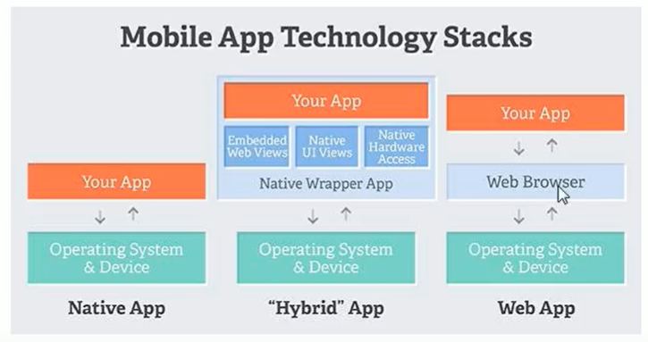

## app的分类

目前 app 分为原生app ，web App，以及Hybird App（混合app），他们三者的主要区别是

**原生app**：基于手机本地环境进行开发，可以调度、访问、使用手机上资源，但是对于不同的平台需要使用不同的语言和工具进行开发，开发难度和开发周期会比较长。

**web app**：使用 html5，css，javascript 等纯前端技术进行开发，开发难度低，且开发周期短，但是web app是运行在手机浏览器上的并且资源都存储在云端服务器上，这也导致了每次打开app 都需要去请求资源，用户体验略差，并且也不能调用手机上的 资源和功能（位置，摄像头等）。

**Hybird App**：结合了原生app资源使用自由和web app 开发成本低的优点，开发成本低，可以调用手机上的资源。Hybird App 的底层使用的是一套编写好的手机原生框架，可以开放给其他的框架进行接入，所以开发 Hybird App 的方式也很多 ，如 react native，uniapp，taro 等。




## **环境搭建**

跟着React Native中文网的[搭建开发环境](https://reactnative.cn/docs/environment-setup)教程来搭建就可以了，不过有几个需要注意的地方

### 对于 Android  SDK

按照教程来搭建基本不会有什么问题，最主要的问题就是在安装Android SDK的时候，如果没有使用科学上网工具的话，一般是下载不成功的，所以最好是根据教程上写的用科学上网工具来代理下载，一般可用的科学上网工具有很多比如[蓝灯](https://github.com/getlantern/lantern)，[佛跳墙](https://github.com/getfotiaoqiang/fotiaoqiang)等等。

### 对于 Android 模拟器

我觉得 Android Studio 里面的模拟器已经很够用了不用安装 genymotion 等其他的模拟器了，可以在Android Studio中的 `Tools -> Android AVD`中创建和管理模拟器。将项目的`AwesomeProject/android`导入到项目中编译并运行到模拟器，然后再运行`yarn android`即可。

> **Android的一些常用命令**
>
> + `android list avd`  查看现在有哪些模拟器可以使用，
> + `emulator -avd 模拟器名字`或者`emulator @模拟器名字`  启动相应的模拟器。
> + `adb devices`  查看当前运行中的模拟器
> + `android list target` 列出当前可用的SDK版本
> + `android create avd -n <name> -t <targetID> [-<option> <value>]` 创建模拟器，最好是在Android studio 中创建
> + `adb push D:\test.txt /sdcard/` 将D盘的`test.txt`文件添加到模拟器的`/sdcard/`下
> + `adb pull /sdcard/test.txt D:\ `将模拟器的`test.txt` 文件复制到`D:\`
> + `adb shell pm setInstallLocation 1`默认安装在手机内存
> + `adb shell pm setInstallLocation 2`默认安装在SD卡
> + `adb shell input keyevent 82` 打开模拟器调试面板
>
> 其他的常用[命令….](https://blog.csdn.net/gabbzang/article/details/9393981)

### 其他的一些问题

> [VSCode终端不能使用命令](https://blog.csdn.net/weixin_51781586/article/details/114577951)
>
> [使用第三方模拟器运行react native项目](https://www.jianshu.com/p/3ed09488058c)
>
> [使用VsCode开发调试React Native笔记](https://www.jianshu.com/p/dfa3d8ea6d90)
>
> [react-native系列(3)入门篇：使用VSCode及RN的代码调试过程](https://blog.csdn.net/zeping891103/article/details/85860149)
>
> [RN Android "unabled to connect with remote debugger"](https://www.jianshu.com/p/abda49aac8b2)


### 对于 IOS 环境

只要跟着React Native中文网来做的话都不会有太大的问题，最难搞的就是使用`pod install`的时候出现的一些不明所以的问题.

**错误一：**

```shell
[!] Oh no, an error occurred.
Search for existing github issues similar to yours:
https://github.com/CocoaPods/CocoaPods/search?q=invalid+byte+sequence+in+US-ASCII&type=Issues
```

主要原因应该是，Profile 文件的编码方式被改变了，所以修改一下即可

```shell
$ export LANG=en_US.UTF-8
$ export LANGUAGE=en_US.UTF-8
$ export LC_ALL=en_US.UTF-8
```


**错误二：**

```shell
[!] Oh no, an error occurred.  
  
Search for existing GitHub issues similar to yours:  
https://github.com/CocoaPods/CocoaPods/search?q=No+such+file+or+directory+-+%2FUsers%2Frwx-mac%2FDesktop%2FHe%2FHeAmap%2FPods%2FAMapSearch%2FAMapSearchKit.framework%2FResources&type=Issues  
```

主要的原因应该是pod的版本问题

解决方式一：从新安装pod的repos/master

```shell
cd ~/.cocoapods/repos
rm -rf master
pod setup
```

解决方式二：更新cocoapods

```shell
$ sudo gem update --system
$ sudo gem install cocoapods -n/usr/local/bin
```

解决方式三：重新安装cocoapods

```shell
sudo gem uninstall cocoapods
sudo gem install cocoapods
pod setup
```

解决方式四：安装0.38.1版本cocoapods

```shell
sudo gem uninstall cocoapods
sudo gem install cocoapods -v 0.38.1
sudo rm -rf ~/.cocoapods && sudo rm -fr ~/.cocoapods/repos/master && pod setup && pod install
```


**错误三：**


这个错误一般是在安装某个模块的时候出现的，是因为网络差导致的，毕竟pod也是优先使用国外的资源的，所以要解决这个问题可以修改数据源

对于旧版的 CocoaPods 1.3之前 可以使用如下方法使用 tuna 的镜像：

```shell
$ pod repo remove master
$ pod repo add master https://mirrors.tuna.tsinghua.edu.cn/git/CocoaPods/Specs.git
$ pod repo update
```

新版的 CocoaPods 1.3之后 不允许用pod repo add直接添加master库了，但是依然可以：

```shell
$ cd ~/.cocoapods/repos 
$ pod repo remove master
$ git clone https://mirrors.tuna.tsinghua.edu.cn/git/CocoaPods/Specs.git master
```

最后进入自己的工程，在自己工程的podfile第一行加上：

```
source 'https://mirrors.tuna.tsinghua.edu.cn/git/CocoaPods/Specs.git'
```

如果你用的是cocoapods1.8，可以还会报CDN错误，可以再执行一下这个

```shell
pod repo remove trunk
```

如果这样改完之后下载速度还是很慢的话建议使用一下git/npm代理工具进行加速，如边车[dev-sidecar](https://gitee.com/docmirror/dev-sidecar)


**错误四：**

```shell
[!] /bin/bash -c 
set -e
#!/bin/bash
# Copyright (c) Facebook, Inc. and its affiliates.
#
# This source code is licensed under the MIT license found in the
# LICENSE file in the root directory of this source tree.

set -e

PLATFORM_NAME="${PLATFORM_NAME:-iphoneos}"
CURRENT_ARCH="${CURRENT_ARCH}"
.....
```

解决方式

```shell
sudo xcode-select --switch /Applications/Xcode.app
```


## 关于安装第三方库

对于一些不依赖于与原生代码的库可以直接使用`npm`或`yarn`安装之后使用，有一些库基于一些原生代码实现，你必须把这些文件添加到你的应用，否则应用会在你使用这些库的时候产生报错

下载某个库到本地

```shell
npm install ******
```

链接某个库到项目中

```shell
react-native link *****
```

React Native 0.60 及更高版本链接是自动的，但是对于Mac开发IOS可能还需要在项目中运行`cd ios && pod install`进行链接


## 关于布局

在react-native中大多数容器默认已经开启为`display:flex;`布局，并且默认的排列方向（主轴方向）是`flex-directive:column`垂直方向。所以在react-native中可以直接给元素定义flex的相关属性。


## 关于样式

在react-native中支持使用样式类名（也就是className）来定义样式，仅支持通过style来设置样式，并且样式的设置需要使用对象来设置`style={{color:'white',backgroundColor:'blue'}}`，react-native中也不全支持css属性，每个组件也都有自己特定的属性，所以具体样式还是要参考文档。

### 样式的继承

react-native提倡的是每个组件都相互独立互不影响，所以react-native中大多数属性是不可继承的。不过也有例外，React Native 实际上还是有一部分样式继承的实现，不过仅限于文本标签的子树。在下面的代码里，第二部分会在加粗的同时又显示为红色：

```react
<Text style={{ fontWeight: 'bold' }}>
  I am bold
  <Text style={{ color: 'red' }}>and red</Text>
</Text>
```

### 抽离公共样式

有时候多个组件使用的样式是同一基本样式，但是组件之间又略有不同，这时候可以使用数组的方式来设置组件的样式，将公共的样式抽离出来然后添加到各组件的样式数组，并且后面的样式回覆盖前面的样式。

```react
const commonStyle = {fontSize:30,color:'skyblue'};
<Text style={[backgroundColor:'yellow',commonStyle]}>and red</Text>
<Text style={[backgroundColor:'green',commonStyle]}>and red</Text>
```


## 基础组件的使用

### View

View 组件相当于是 div 标签，就是一个普通的容器，不过不可以插入文本节点`<View>hello</View>`，文本节点需要使用Text来包裹`<View><Text>hello</Text></View>`，也不能设置字体大小、颜色等。

### Text

Text 组件相当于是一个 span 标签，不过里面的布局不是按flexbox进行布局的，而是文本排列布局。这意味着`<Text>`内部的元素不再是一个个矩形，而可能会在行末进行折叠。

### Image与ImageBackground

两个组件都是用来加载图片的，不过Image加载的是普通图片，ImageBackground用来加载背景图片，不过Image标签中不能插入内容，而ImageBackground则是相当于一个带背景的容器。通过设置`source`来确定图片，`source`接收的是一个对象值

对于本地的图片，需要使用`require`来导入图片（`require`返回的也是一个对象，并且也包含了宽高）

```react
<Image source={require('./assets/a.png')}>
<ImageBackground source={require('./assets/a.png')}>
```

对于网络图片或者base64的图片可以使用`{uri:'https://picsum.photos',width:30,height:30}`来设置（记得要设置宽高，否则图片不会显示），这里的`width height`指的是图片的宽高，而不是容器的宽高，容器的宽高需要通过`style`来设置

```react
<Image source={{uri:'https://picsum.photos',width:30,height:30}}>
<ImageBackground source={{uri:'https://picsum.photos'},style={{width:30,height:30}}}>
```

如果图片大小和容器大小不一致，可以使用`style={{resizeMode:'cover'}}`或者`<Image source={require('./assets/a.png') resizeMethod='scale'}>`来设置图片的缩放模式

需要注意的是默认情况下 Android 是不支持 GIF 和 WebP 格式的，需要在`android/app/build.gradle`文件中根据需要手动添加以下模块：

```
dependencies {
  // 如果你需要支持Android4.0(API level 14)之前的版本
  implementation 'com.facebook.fresco:animated-base-support:1.3.0'

  // 如果你需要支持GIF动图
  implementation 'com.facebook.fresco:animated-gif:2.5.0'

  // 如果你需要支持WebP格式，包括WebP动图
  implementation 'com.facebook.fresco:animated-webp:2.5.0'
  implementation 'com.facebook.fresco:webpsupport:2.5.0'

  // 如果只需要支持WebP格式而不需要动图
  implementation 'com.facebook.fresco:webpsupport:2.5.0'
}
```


### Button

Button组件是一个简单的跨平台的按钮组件，它是`TouchableOpacity、TouchableHighlight`或`TouchableNativeFeedback`组件的上层封装，可以理解为`TouchableOpacity、TouchableHighlight`或`TouchableNativeFeedback`是仅有反馈而仅带基础样式的组件，而Button则是带有反馈并且有定制样式的组件。需要注意的是Button在 IOS 和 Android 上的样式表现是不一样的，这样就会让界面在IOS和Android上表现不同意，为了解决这个问题，一般需要我们自己在`TouchableOpacity、TouchableHighlight`或`TouchableNativeFeedback`上封装一个样式统一的组件，或者使用第三方button库（如`react-native-action-button`），或者使用第三方UI库（`react-native-elements`、`ant-design-mobile-rn`）


### ScrollView

是一个滚动组件，这个容器支持纵向滚动，也支持横向滚动，但是必须给组件设置宽高，当内容的宽高超出了容器的宽高才会开启滚动。

**对于子元素容器**
且子元素将会被全部包裹到一个容器元素中，可以通过`contentContainerStyle`来设置容器的样式。考虑到性能问题，一般用来做引导图、轮播图等数据量不大的。

**下拉刷新操作**
对于垂直方向的列表，`ScrollView` 提供了一个`refreshControl`的属性来给提供下拉刷新的功能，`refreshControl`接受一个组件作为值，这个组件必须有两个属性`refreshing`（是否处于刷新状态）和`onRefresh`（刷新时的事件），`react-native`也已经提供给了这个组件`RefreshControl`。


### FlatList | SectionList | VirtualizedList

`ScrollView` 组件比较适合处理数据量少（节点少）的情况，而如果处理数据量比价大的时候就容易出现卡顿的现象，对于数据量大节点多的情况应该使用`FlatList | SectionList | VirtualizedList`。`FlatList | SectionList`都继承于`VirtualizedList`，并且同时拥有`VirtualizedList`与`ScrollView`的所有`props`。

`FlatList`与`SectionList`相差无几，不同的是`SectionList`支持分组，`FlatList`支持多列布局。


### StatusBar

状态栏，一个应用中只有一个状态栏，如果有多个的话后面的会把前面的覆盖掉。


## 网落请求

在软件开发里面不存在跨域的问题（跨域主要是因为浏览ajax引擎的同源策略导致的，而在应用中不存在ajax引擎所以不会有跨越问题）。在react-native中网络请求不再是使用xhr了，而是使用[fetch](https://developer.mozilla.org/zh-CN/docs/Web/API/Fetch_API/Using_Fetch)来发送网络请求了。不过仍然可以使用第三方的网络请求框架如[frisbee](https://github.com/niftylettuce/frisbee)或是[axios](https://github.com/mzabriskie/axios)等。

fetch的简单使用：发送get请求

```js
fetch('https://mywebsite.com/mydata.json').then(res=>res.json()).then(res=>console.log(res));
```

发送post请求

```js
fetch('https://mywebsite.com/endpoint/', {
  method: 'POST',
  headers: {
    Accept: 'application/json',
    'Content-Type': 'application/json'
  },
  body: JSON.stringify({
    firstParam: 'yourValue',
    secondParam: 'yourOtherValue'
  })
});
```


使用axios的话需要先安装

```shell
npm i axios -S
```

然后参考文档进行封装使用就好了。


## 调试

一般可以直接使用谷歌浏览器或者rn推荐的调试工具`react-native-debugger`来调试，两种方式的区别在于

谷歌浏览器调仅可以看到输出，不能看到标签结构也不能看到网络请求（可以通过配置来解决）。`react-native-debugger`则可以看到输出，也可以看到标签结构，但是也不能看到网络请求（可以通过配置来解决）。

想要查看网络请求可以在入口文件`index.js`添件

```js
GLOBAL.XMLHttpRequest = GLOBAL.originalXMLHttpRequest || GLOBAL.XMLHttpRequest
```

使用`react-native-debugger`

**安装**：可以直接去官网下载安装程序直接安装，也可以使用npm或者yarn进行安装（推荐使用cnpm或者使用yarn安装，不然可能会报electron丢失）

```shell
cnpm i react-native-debugger -g
yarn add react-native-debugger global
```

**运行：**在运行之前最好先将在管理面板停掉debug`stop debugger`，然后在将debbger浏览器关闭掉

```shell
react-native-debugger
```

运行成功后再在管理面板开起来就好了。


## 使用导航（react-navigation）

目前 react-native 常用的导航库有`react-navigation`和`react-native-navigation`，使用导航就可以开始进行多页面的开发以及进行页面的跳转了。

### react-navigator

**安装：**

最好是安装[官网教程](https://reactnavigation.org/docs/getting-started)来进行安装，因为每个版本要安装的东西都不太一样，现在的是6.x的

```shell
yarn add @react-navigation/native @react-navigation/native-stack react-native-screens react-native-safe-area-context 
```

如果用的是react-native0.59及以下的版本还需要运行

```shell
react-native link @react-navigation/native
react-native link @react-navigation/native-stack
react-native link react-native-screens
react-native link react-native-safe-area-context
```

> 如果还需要进行IOS端的开发，还需要运行`cd ios && pod install`（记得确保网络稳定，不然会失败）

进行安卓开发还需要在`android/app/src/main/java/<your package name>/MainActivity.java`文件下添加

```java
import android.os.Bundle;
------------------------------------------
@Override
protected void onCreate(Bundle savedInstanceState) {
  super.onCreate(null);
}
```


### **注册路由**

```react
import * as React from 'react';
import { View, Text } from 'react-native';
import { NavigationContainer } from '@react-navigation/native';
import { createNativeStackNavigator } from '@react-navigation/native-stack';

function HomeScreen() {
  return (
    <View style={{ flex: 1, alignItems: 'center', justifyContent: 'center' }}>
      <Text>Home Screen</Text>
    </View>
  );
}
function DetailScreen() {
  return (
    <View style={{ flex: 1, alignItems: 'center', justifyContent: 'center' }}>
      <Text>Detail Screen</Text>
    </View>
  );
}
function CarScreen() {
  return (
    <View style={{ flex: 1, alignItems: 'center', justifyContent: 'center' }}>
      <Text>Car Screen</Text>
    </View>
  );
}

const Stack = createNativeStackNavigator();

function App() {
  return (
    <NavigationContainer>
      <Stack.Navigator initialRouteName="Home">
        <Stack.Screen name="Home" component={HomeScreen}  options={{ title: 'Overview' }}/>
        <Stack.Screen name="Car" component={() => <CarScreen />} />
        <Stack.Screen name="Detail">
        	{props => <DetailScreen {...props} extraData={someData}/>}
        </Stack.Screen>
      </Stack.Navigator>
    </NavigationContainer>
  );
}

export default App;
```

`NavigationContainer`是一个管理我们的导航树并包含[导航状态的组件](https://reactnavigation.org/docs/navigation-state)。此组件必须包装所有导航器结构。通常，我们会在应用程序的根目录渲染这个组件，这通常是从`App.js`.

`createNativeStackNavigator`是一个函数，它返回一个包含 2 个属性的对象：`Screen`和`Navigator`。它们都是用于配置导航器的 React 组件。本`Navigator`应包含`Screen`的元素作为其子定义路由配置。可以将`Screen`看成就是一个页面的容器，可以通过`options`来设置页面的属性（具体可以参看[官网配置](https://reactnavigation.org/docs/headers)）。

`initialRouteName`初始路由名，可以定义初始的页面，不过即使不定义也会以第一个路由为初始路由

> 其实可以通过修改`initialRouteName`来达到路由跳转的目的，但是这样做不会使用到路由栈，这样也就不能使用返回，而且可能导致快速刷新失效

上面三种注册路由的方式有自己的特点

```react
<Stack.Screen name="Home" component={HomeScreen}  options={{ title: 'Overview' }}/>
```

这种方式注册的路由在切换页面的时候组件不会被卸载，重新切换回来的时候也不会重新安装，相当于使用vue中的keep-alive

```react
<Stack.Screen name="Car" component={() => <CarScreen />} />
```

这种方式注册的路由在切换页面的时候组件会被卸载，重新切换回来的时候会重新安装

```react
<Stack.Screen name="Detail">
  {props => <DetailScreen {...props} extraData={someData}/>}
</Stack.Screen>
```

这种方式注册的路由在切换页面的时候组件会被卸载，重新切换回来的时候会重新安装，不过可以传递更多额外的数据


### **路由跳转**

注册成为页面的组件将会在`props`接受到一个`navigation`对象，这个对象就是用来做路由跳转的。

+ `navigation.navigate('Home') | navigation.navigate({name:'Home'})`跳转到Home页面，如果现在已经在Home页面了，将什么都不做，页不会把页面加到路由栈中
+ `navigation.push('Home') | navigation.push({name:'Home'})`跳转到Home页面，即使已经在Home页面了，也会进行跳转，并且将路由加入到路由栈中
+ `navigation.goBack()`返回上一路由
+ `navigation.popToTop()`回到栈顶路由
+ 还有其他的一些[API](https://reactnavigation.org/docs/navigation-prop)

```react
function HomeScreen({navigation}) {
  return (
    <View style={{ flex: 1, alignItems: 'center', justifyContent: 'center' }}>
      <Text>Home Screen</Text>
      <Button title="to Details" onPress={()=>navigation.navigate('Details')} />
    </View>
  );
}
```


### **路由传参**

在`react-navigation`中可以在`navigation.navigate`以及`navigation.push`的第二个参数上传递路由参数，这些参数将会被集合到要跳转的路由的`props`的`route.params`中，route中还还有路由的其他一些信息.

```react
function HomeScreen({navigation}) {
  return (
    <View style={{ flex: 1, alignItems: 'center', justifyContent: 'center' }}>
      <Text>Home Screen</Text>
      <Button title="to Details" onPress={()=>navigation.navigate('Details',{data:'2222'})} />
      <Button title="to Details" onPress={()=>navigation.navigate({
          name:'Details',
          params:{data:'2222'}
        })} />
    </View>
  );
}
```


### **修改路由参数**

我们知道直接修改`props`中的值是不推荐的，而且即使修改数据成功也不会触发页面更新，甚至有可能会导致错误，所以不推荐直接修改props.route.params中的数据，可以使用`navigation.setParams()`方法进行修改，使用方式与`setState`差不多。

```react
function DetailScreen({route,navigation}) {
  return (
    <View style={{ flex: 1, alignItems: 'center', justifyContent: 'center' }}>
      <Text>Detail Screen {route.params.data}</Text>
      <Button title="setParams" onPress={()=>navigation.setParams({data:'3333'})} />
    </View>
  );
}
```


### **初始化参数**

在导航到此屏幕时未指定任何参数，则将使用初始参数。它们也与您传递的任何参数浅合并

```react
<Stack.Screen
  name="Details"
  component={DetailsScreen}
  initialParams={{ itemId: 42 }}
/>
```


### **传递参数给嵌套路由**

如果您有嵌套的导航器，则需要以稍微不同的方式传递参数。例如，假设您在`Account`屏幕内有一个导航器，并且想要将参数传递到该导航器内的屏幕`Settings`。然后你可以传递参数如下：

```js
navigation.navigate('Account', {
  screen: 'Settings',
  params: { user: 'jane' },
});
```


### 路由生命周期函数

在路由跳转的时候，页面不会被卸载，也就是说A页面跳转到B页面的时候，A的卸载钩子并不会被触发，而B在第一次进入的时候会触发挂载钩子；当从B页面返回A页面的时候页不会再出发挂载钩子了。因此我们需要使用别的方式来执行在页面显示以及页面隐藏时候要做的操作，`react-navigation` 在`navigation`对象中提供了`addlistener`方法（返回一个移除函数，可以在页面隐藏的时候执行，以此来移除监听）监听路由的相关事件

- `focus` - 当屏幕进入焦点时发出此事件
- `blur` - 当屏幕失焦时发出此事件
- `beforeRemove`- 当用户离开屏幕时触发此事件
- `state` (高级) - 当导航器的状态改变时发出这个事件

每个注册为事件侦听器的回调都接收一个事件对象作为其参数。事件对象包含几个属性：

- `data`- 有关导航器传递的事件的附加数据。`undefined`如果没有传递数据，则可能会出现这种情况。
- `target`- 应接收事件的屏幕的路由键。对于某些事件，这可能是`undefined`因为该事件与特定屏幕无关。
- `preventDefault`- 对于某些事件，`preventDefault`事件对象上可能有一个方法。调用此方法将阻止事件执行的默认操作（例如在 上切换选项卡`tabPress`）。对阻止操作的支持仅适用于某些事件，例如`tabPress`并不适用于所有事件。

要记住的一件事是，您只能监听来自直接父导航器的事件。如果孙级页面需要监听到爷级页面的事件可以在孙级组件用`navigation.getParent()`获取对父导航器的导航道具的引用并添加一个监听器。

```react
function Profile({ navigation }) {
  React.useEffect(() => {
    const unsubscribe = navigation.addListener('focus', () => {
      // 页面激活（显示）的时候执行
    });
		//在离开页面的时候移除监听
    return unsubscribe;
  }, [navigation]);
  return <ProfileContent />;
}
```

除了使用`navigation.addListener`来监听页面事件之外，还可以在`<Stack.Screen listeners={(props)=>({focus:e=>{}}) >`的`listeners`中设置监听器这种方式和`navigation.addListener`基本一致；还可以在`<Stack.Navigator screenListeners={(props)=>({focus:e=>{}} \>`的`screenListeners`中设置，不同与前两种这种监听的是所有页面。

当然还可以使用相关的Hooks来实现，比如`useFocusEffect`等。

并且 react-navigation 除了 stack（可以看作是顶部navbar式路由导航），还支持[tab](https://reactnavigation.org/docs/tab-based-navigation)（底部tabbar式路由导航），以及[drawer](https://reactnavigation.org/docs/drawer-based-navigation)（侧边弹出式路由导航）等[多种导航器](https://reactnavigation.org/docs/material-top-tab-navigator)，还有多种[API](https://reactnavigation.org/docs/navigation-container)以及[Hooks](https://reactnavigation.org/docs/use-navigation)。具体使用可以查看[官网](https://reactnavigation.org/docs/getting-started)


### 导航状态及修改

没有被实例化的导航器（Stack.Navigator、Tab.Navigator、Drawer.Navigator）都会有用自己的状态，可以通过`navigation.getState()`方法或者使用`useNavigationState(state=>state.index)`（这个方法获取到的状态是*实时更新*的）获取到，这个状态包含以下的一些属性

```js
const state = {
  type: 'stack',
  key: 'stack-1',
  routeNames: ['Home', 'Profile', 'Settings'],
  routes: [
    { key: 'home-1', name: 'Home', params: { sortBy: 'latest' } },
    { key: 'settings-1', name: 'Settings' },
  ],
  index: 1,
  stale: false,
};
```

- `type`- 状态所属的导航器的类型，例如`stack`、`tab`、`drawer`。
- `key` - 识别导航器的唯一键。
- `routeNames`- 在导航器中定义的屏幕名称。这是一个包含每个屏幕字符串的唯一数组。
- `routes`- 在导航器中呈现的路线对象（屏幕）列表。它还表示堆栈导航器中的历史记录。此数组中应至少存在一项。
- `index`-`routes`数组中聚焦路线对象的索引。
- `history`- 访问项目列表。这是一个可选属性，并非在所有导航器中都存在。例如，它仅存在于核心的选项卡和抽屉导航器中。`history`数组中项目的形状可能因导航器而异。此数组中应至少存在一项。
- `stale`- 导航状态被假定为陈旧，除非该`stale`属性显式设置为`false`。

`routes`数组中的每个路由对象可能包含以下属性：

- `key`- 屏幕的唯一键。导航到此屏幕时自动创建或添加。
- `name`- 屏幕名称。在导航器组件层次结构中定义。
- `params`- 包含在导航时定义的参数的可选对象，例如`navigate('Home', { sortBy: 'latest' })`。
- `state` - 包含嵌套在此屏幕内的子导航器的导航状态的可选对象。

有时候可能需要对导航状态进行修改，在`navigation`中提供了两种方式来给我们对导航状态进行修改，一种是`navigation.reset()`方法，这个方法用于重置导航状态的，并且只能对当前自己的路由器做修改

```js
navigation.reset({
  index: 0,
  routes: [{ name: 'Profile' }],
});
```

还有一种方式是全局的方法，就是使用`navigation.dispatch(action)`方法来进行修改，action可以是`commonActions`、`StackActions`、`TabActions`、`DrawerActions`等导航器的action，`navigation.dispatch`不仅可以配合`commonAcions`来修改当前所在导航器的状态，也可以配置其他的actions来修改App中任意用到的导航器的状态。`navigation.dispatch`多用于修改嵌套或兄弟导航器的状态，或触发其他导航器的方法。比如说 drawer 导航器嵌套来一个 stack 导航器，想要在 stack 操作 drawer 导航器

```js
navigation.dispatch(DrawerActions.toggleDrawer());
```

如果有多个同种类的导航器还可以使用`source`和`target`来指定特定的导航器

```js
navigation.dispatch({
  ...CommonActions.navigate('Profile'),
  source: 'someRoutekey',//发起操作的路由的key，一般是当前的屏的key route.key
  target: 'someStatekey',//要接受并执行操作的导航器的key，一般都是由外部传入 route.params.key
});
```


## 使用状态管理（mobx）

在react 和 vue 中多层嵌套组件之间或者兄弟组件的通信是非常麻烦的，一般都是会使用状态管理的库进行管理公共的数据，在vue中一般使用的是vuex，在react中常用的是redux和mobx、dva等，不过现在react中也更加鼓励使用函数式组件进行开发，同样可以使用`useReducer`和`useContext`来实现状态管理。

由于我还没有用过mobx，所以打算先学习并使用mobx。


### mobx安装

```shell
npm install mobx mobx-react -S
```

如果想要想要使用装饰器的话还需要安装配置点东西（装饰器都有对应的函数替代）

安装`babel-preset-mobx`

```shell
npm install babel-preset-mobx -D
```

然后配置`.babelrc`文件

```json
{
  "presets": ["mobx"]
}
```

参考[官网配置](https://cn.mobx.js.org/best/decorators.html)即可


### mobx的基本使用

个人感觉mobx比redux要简单一些，因为只需要熟悉几个常用的api即可。

对于mobx的api，只需要了解下面几个api就好:

#### `observable`

`observable`将数据转换成可监测的响应式数据，可以监测基本数据类型、引用类型、普通对象、类实例、数组和映射。

```js
@observable list = ['my'];
const todo = observable({name:'jack'})
```

#### `computed`

`computed`计算属性，当函数中使用到的被`observable`的数据有改变的时候下次访问计算属性时函数才会被执行，同vue的computed

```js
class Todos{
  @observable list = ['my'];
	@computed get listLength(){
    console.log('list computed');
    return list.length;
  })
}
let todos = new Todos();
todos.list.push('xx');
console.log(todos.listLength);//list computed 2
```

使用函数式的computed是返回的是一个对象，需要通过`.get()`方法获取值，还可以在`.observe(callback)` 来观察值的改变

```js
var name = observable.box("John");
var upperCaseName = computed(() =>name.get().toUpperCase());
var disposer = upperCaseName.observe(change => console.log(change.newValue));
name.set("Dave");
// 输出: 'DAVE'
```

#### `autorun`

`autorun`其实这个就相当于是一个自动执行的computed，只要函数中的某个被`observable`的数据有变化，函数就会执行，并且`autorun`在定义的时候会立即执行一次，而且会返回一个**解除监听的函数**，在选择使用`autorun`还是使用`computed`的时候可以按这个规则：如果你有一个函数应该自动运行，但不会产生一个新的值，请使用`autorun`。 其余情况都应该使用 `computed`

```js
var numbers = observable([1,2,3]);
var sum = computed(() => numbers.reduce((a, b) => a + b, 0));
var disposer = autorun(() => console.log(sum.get()));
// 输出 '6'
numbers.push(4);
// 输出 '10'
disposer();//解除监听
numbers.push(5);
// 不会再输出任何值。`sum` 不会再重新计算。
```

`autorun`还可以接收第二个参数,`autorun(fn,{delay:300})`，这个参数用于配置，其中的delay选项可以用来实现防抖操作.

#### `reaction`

`reaction`其实是`autorun`的变种，或者说是`computed autorun`的语法糖，返回一个清理函数；`reaction(sendDataFn,effctFn,options)`，第一个参数的返回值将会传递给第二个函数的第一个形参data，并且**只要且只有**`sendDataFn`中有被监测`observable`的数据发生变化就会调用`effctFn`；`effctFn`接收两个参数，第一个是`sendDataFn`的返回值，第二个是当前`reaction`的实例对象。

```js
const counter = observable({ count: 0 });
// 只调用一次并清理掉 reaction : 对 observable 值作出反应。
const reaction3 = reaction(
    () => counter.count,
    (count, reaction) => {
        console.log("reaction 3: invoked. counter.count = " + count);
        reaction.dispose();
    }
);
counter.count = 1;// 输出: reaction 3: invoked. counter.count = 1
counter.count = 2;// 输出:(There are no logging, because of reaction disposed. But, counter continue reaction)
console.log(counter.count);// 输出:2
```

#### `when`

`when`和`reaction`类似，使用方式相近`when(condFn,effectFn,options)`，当`condFn`中被`observable`的数据发生变化的时候`condFn`就会被执行，如果返回值是 true 那么就会触发`effectFn`，同样的`when`函数返回一个清理器以提前取消自动运行程序。并且当美誉提供`effectFn`的时候`when`返回的是一个promise，也就是说可以配合async/await使用

```js
const flag = obsevable({isShow:false});
when(()=flag.isShow,()=>console.log('be actived when flag.isShow is true'));
flag.isShow = true;
```

#### `action`

`action`用来修改被`observable`的值，虽然被`observable`的值可以直接修改，但是官方也还是**推荐在`action`中对被监视的值做修改动作**，因为这种方式是可以被开发工具捕获的，也就是便于调试和观察，应该永远只对**修改**状态的函数使用动作。 只执行查找，过滤器等函数不应该被标记为动作，以允许 MobX 跟踪它们的调用。

`aciotn`常用方式有`@action fnName(data){}`，相当于是`action('fnName',(data)=>{})`；还有一种是`@action.bound fnName(data){}`相当于`action.bound('fnName',(data)=>{})`。这种方式可以明确绑定的this（不过不能和箭头函数一起使用）。

```js
class Ticker {
    @observable tick = 0

    @action
    increment() {
        this.tick++ // 'this' 永远都是正确的
    }
}

const ticker = new Ticker()
setInterval(ticker.increment, 1000)
```

**需要注意的是**，`action`是不支持处理异步操作的，也就说在`antion`中有 `setTimeout`、promise 的 `then` 或 `async` 语句的回调函数中改变状体将不会起作用并且会报警告，因为他们的回调函数不是action动作的一部分（调用栈不同），比如

```js
mobx.configure({ enforceActions: true }) // 不允许在动作之外进行状态修改

class Store {
    @observable githubProjects = []
    @observable state = "pending" // "pending" / "done" / "error"

    @action
    fetchProjects() {
        this.githubProjects = []
        this.state = "pending"
        fetchGithubProjectsSomehow().then(
            projects => {
                const filteredProjects = somePreprocessing(projects)
                this.githubProjects = filteredProjects
                this.state = "done"
            },
            error => {
                this.state = "error"
            }
        )
    }
}
```

解决异步的几种方式

1.拆分动作

```js
mobx.configure({ enforceActions: true })

class Store {
    @observable githubProjects = []
    @observable state = "pending" // "pending" / "done" / "error"

    @action
    fetchProjects() {
        this.githubProjects = []
        this.state = "pending"
        fetchGithubProjectsSomehow().then(this.fetchProjectsSuccess, this.fetchProjectsError)

    }

    @action.bound
    fetchProjectsSuccess(projects) {
        const filteredProjects = somePreprocessing(projects)
        this.githubProjects = filteredProjects
        this.state = "done"
    }
    @action.bound 
		fetchProjectsError(error) {
            this.state = "error"
    }
}
```

2.使用`action`函数包裹

```js
mobx.configure({ enforceActions: true })

class Store {
    @observable githubProjects = []
    @observable state = "pending" // "pending" / "done" / "error"

    @action
    fetchProjects() {
        this.githubProjects = []
        this.state = "pending"
        fetchGithubProjectsSomehow().then(
            // 内联创建的动作
            action("fetchSuccess", projects => {
                const filteredProjects = somePreprocessing(projects)
                this.githubProjects = filteredProjects
                this.state = "done"
            }),
            // 内联创建的动作
            action("fetchError", error => {
                this.state = "error"
            })
        )
    }
}
```

3.使用`runInAction(actionName?,fn)`函数，顾名思义就是当前动作还要运行在哪个`action`中，当不传递actionName的时候默认运行在所在的action中，**需要注意**，在使用async/await的时候，`await xxxx`之后的代码都相当于是在then中的所以也要使用`runInAction`解决异步问题。

```js
mobx.configure({ enforceActions: true })

class Store {
    @observable githubProjects = []
    @observable state = "pending" // "pending" / "done" / "error"

    @action
    fetchProjects() {
        this.githubProjects = []
        this.state = "pending"
        fetchGithubProjectsSomehow().then(
            projects => {
                const filteredProjects = somePreprocessing(projects)
                // 将‘“最终的”修改放入一个异步动作中
                runInAction(() => {
                    this.githubProjects = filteredProjects
                    this.state = "done"
                })
            },
            error => {
                // 过程的另一个结局:...
                runInAction(() => {
                    this.state = "error"
                })
            }
        )
    }
}
```

4.使用`flow`解决。它们使用生成器。它的工作原理与 `async` / `await` 是一样的。只是使用 `function *` 来代替 `async`，使用 `yield` 代替 `await` 。 使用 `flow` 的优点是它在语法上基本与 `async` / `await` 是相同的 (只是关键字不同)，并且不需要手动用 `@action` 来包装异步代码

```js
mobx.configure({ enforceActions: true })

class Store {
    @observable githubProjects = []
    @observable state = "pending"

    fetchProjects = flow(function * () { // <- 注意*号，这是生成器函数！
        this.githubProjects = []
        this.state = "pending"
        try {
            const projects = yield fetchGithubProjectsSomehow() // 用 yield 代替 await
            const filteredProjects = somePreprocessing(projects)
            // 异步代码块会被自动包装成动作并修改状态
            this.state = "done"
            this.githubProjects = filteredProjects
        } catch (error) {
            this.state = "error"
        }
    })
}

```

#### `decorator`

`decorator`在不是装饰器的时候有用，就是用来批量给数据添加对应的装饰函数

```js
class Person {
    name = "John"
    age = 42
    showAge = false

    get labelText() {
        return this.showAge ? `${this.name} (age: ${this.age})` : this.name;
    }

    setAge(age) {
        this.age = age;
    }
}
// 使用 decorate 时，所有字段都应该指定 (毕竟，类里的非 observable 字段可能会更多)
decorate(Person, {
    name: observable,
    age: observable,
    showAge: observable,
    labelText: computed,
    setAge: action
})

```


### mobx-react

对于mobx-react，需要了解一下这几个api：

#### `observer`

`observer`函数/装饰器可以用来将 React 组件转变成响应式组件。它用 `mobx.autorun` 包装了组件的 render 函数以确保任何组件渲染中使用的数据变化时都可以强制刷新组件。

也就是说在react中想要实现当状态该改变的时候页面也跟着刷新的话就需要使用`observe`包裹组件

```react
import {observer} from "mobx-react";

var timerData = observable({
    secondsPassed: 0
});

setInterval(() => {
    timerData.secondsPassed++;
}, 1000);

@observer 
class Timer extends React.Component {
    render() {
        return (<span>Seconds passed: { this.props.timerData.secondsPassed } </span> )
    }
};

ReactDOM.render(<Timer timerData={timerData} />, document.body);
```

**注意：**当 `observer` 需要组合其它装饰器或高阶组件时，请确保 `observer` 是最深处(第一个应用)的装饰器，否则它可能什么都不做。还有就是Mobx***观察的是数据的属性***而***不是值***，所以当

```js
React.render(<Timer timerData={timerData.secondsPassed} />, document.body)
```

这样将***观察数据的值***传递给`Timer`，当`timerData.secondsPassed`变化的时候`Timer`组件不会变化。

 

#### `Provider`和`Inject`

`mobx-react` 包还提供了 `Provider` 组件，它使用了 React 的上下文(context)机制，可以用来向下传递 `stores`。 要连接到这些 stores，需要传递一个 stores 名称的列表给 `inject`，这使得 stores 可以作为组件的 `props` 使用。

```js
const colors = observable({
   foreground: '#000',
   background: '#fff'
});

const App = () =>
  <Provider colors={colors}>
     <app stuff... />
  </Provider>;

const Button = inject("colors")(observer(({ colors, label, onClick }) =>
  <button style={{
      color: colors.foreground,
      backgroundColor: colors.background
    }}
    onClick={onClick}
  >{label}</button>
));

// 稍后..
colors.foreground = 'blue';
// 所有button都会更新
```


mobx 不起作用的常见[原因](https://cn.mobx.js.org/best/react.html)


## UI框架


## 常用文档

[React-Native 中文网](https://reactnative.cn/)

[React-Native 学习指南](https://github.com/reactnativecn/react-native-guide)

[React-Native 组件库](https://js.coach/)

[React Native Directory](https://reactnative.directory/)


