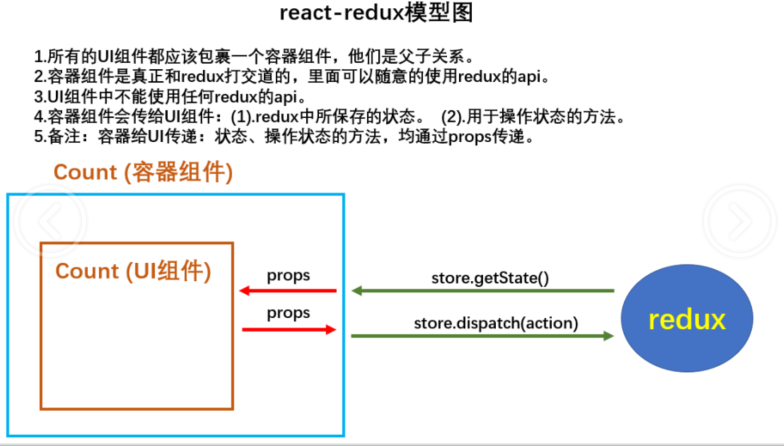

# **React**

react和vue一样也是一个种渐进式的前端框架，它不仅能用于构建单页应用，也可以在现有的多页应用的某一些页面上使用。这个可以根据自己的使用cdn的方式在默写页面使用react来构建项目。

## 创建项目

### 通过cdn创建项目

```html
<!DOCTYPE html>
<html lang="en">
<head>
    <meta charset="UTF-8">
    <meta name="viewport" content="width=device-width, initial-scale=1.0">
    <title>Document</title>
</head>
<body>
    <div id="app"></div>
  	<!-react核心库-->
  	<script src="https://unpkg.com/react@16/umd/react.development.js" crossorigin></script>
  	<!-react操作dom核心库-->
  	<script src="https://unpkg.com/react-dom@16/umd/react-dom.development.js" crossorigin></script>
  	<!-解析jsx语法核心库-->
  	<script src="https://unpkg.com/babel-standalone@6/babel.min.js"></script>
  	<!-要写jsx语法type必须设置为text/babel,将jsx语法转化成js-->
  	<script type="text/babel">
  		const root=document.getElementById('app');
  		const world = React.createElement('span',{id:'span1'},'world');//也可以使用react提供的创建虚拟dom的方法创建
        function Hello(props) {
            return <h1>hello {world}</h1>
        }
  		ReactDOM.render(<Hello /> ,root);
  	</script>
</body>
</html>
```


### 通过react脚手架创建项目

对于 nodejs 版本大于等于5.6 可以直接使用 npm 自带的` create-react-app `命令进行构建

```shell
# 创建项目
npx create-react-app my-app
# 进入项目并运行
cd my-app
npm start
```

`create-react-app`命令中是使用 babel 和 webpack 了。

如果不想使用`create-react-app`进行创建项目可以使用npm自己搭建，但是需要安装`react`和`react-dom`这两包，同时对于解析react语法代码可能需要使用 `@babel/preset-react`。


## React基础

在react中创建虚拟dom有两种方法一种是使用`React.createElement()`方法，一种是使用jsx语法，而jsx语法最终会被babel解析成 `React.createElement()`方法去执行，所以可以所jsx是`React.createElement()`的语法糖

### jsx语法

react支持 jsx 语法，jsx 是指融合了JavaScript 和 XML的新语法 ，比如react的渲染函数

```react
let react="React";
ReactDOM.render(<h1>hello {react}</h1>,document.getElementById('app'));
```

这里的 `ReactDOM.render(html,target)`中 html就是xml语法，在解析 jsx 的时候语法`<>`就会按 html 解析得到dom节点，遇到`{}`就会按 js 语法解析，然后会将这个节点插入到target目标节点中，并执行 js代码。

**js语法规则**

1. 定义虚拟DOM时，不能用引号
2. 标签中混入的js表达式（会返回一个值）要用`{}`
3. 样式类名指定不能用class，要使用className
4. 内联样式，要用`style={{key:value}}`的形式去写，key是小驼峰写法
5. 只有一个根标签
6. 标签必须闭合
7. 标签首字母
	- 若小写字母开发，则将该标签装换为html中的同名元素，如果html中没有该标签的同名元素，则会报错
	- 如果是大写字母开头，则将该标签按组件进行解析


### 元素渲染

 React 元素是不可变对象。一旦被创建，你就无法更改它的子元素或者属性。一个元素就像电影的单帧：它代表了某个特定时刻的 UI。

也就是无法通过像代码插值的方式进行修改元素`<{tag}>`，所以只能通过dom操作或者直接使用`ReactDOM.render(html,target)`方法重新渲染，在html中可以使用想php那样的混合式开发，这里你可能会觉得从新渲染dom会很消耗性能，但是由于react的虚拟dom和diff算法的原因，在渲染同一块dom的情况下只会去更新有变化的dom，所以性能方法不会有太大的损耗。比如

```react
//():如果存在标签结构，并且标签结构要换行，需要使用() 括起来
function trik(){
  let element=(
  	<div>
      <h1>hello world!</h1>
      <h2>It is {new Date().toLocaleTimeString()}</h2>
    </div>
  )
  ReactDom.render(element,document.getElementById('root'));
}
setInterval(()=>{
  trik();
},1000)
```

如果打开开发者工具就会看到 只有`<h2>`标签的 时间那部分文本节点变化，其他的几点都不会被重新渲染。


### React组件化

像vue一样组件有组件的文件，对于vue而言组件的文件可以是vue，而对于react可以是 js 也可以是 jsx（这种文件有代码提示）。

可以使用 类 或 hook 的方式创建 react 组件.

```jsx
import React from "react";
import Home from "./home";//其他组件
//使用类的新式创建组件
export default class App extends React.Component{
  //渲染函数
  render(){
    return (
      <div>
        <h1>hello react component</h1>
        <Home />
      </div>
    )
  }
}
```

在入口中使用

```jsx
import App from "./app";
ReactDom.render(<App/>,document.getElementById("root"));
```

执行 `ReactDom.render(<App/>...`之后做的事情

1. React解析组件标签，找到 App 组件
2. 发现组件是使用类定义的，随后将new出来该类的实例，并通过实例调用原形上的render 方法
3. 将render返回的虚拟DOM转为真实DOM，随后呈现在页面上


### 组件的props属性

组件的复用性很重要，但是这就需要要组件是一样可配置，可复用的组件的了，也就是根据自己的需求或者提供的数据来渲染出自己想要的效果。在组件里面的render函数中提供了一个`props`属性，通过这个属性可以访问到父组件在**子组件标签**通过属性绑定的值中传入的数据，**但是该属性是只读（readonly）的**，所以不可以在子组件中修改数据。这也是react的特点之一——单向数据流。

```js
//父组件 father.jsx
import MyList from './child'
export default class Father extends React.Component{
  render(){
    const list=['java','javaScript','c','c++'];
    const data={
      listData:list,
      title:"langues learning" 
    }
    return (
    	<MyList listData=list title="langues learning" />
      //可以使用...简洁设置属性
      <MyList {...data} />
    )
  }
} 
```

**注意**：对象是不能直接是使用`...`展开的，需要先用`{}`进行包裹，这种展开一般用于复制浅层的对象`obj={name:'ll'};let a={...obj}`，也可以在复制的时候修改或添加属性`obj={name:'ll'};let a={...obj,age:10,name:'kk'}`。但是这里的`<MyList {...data} />`并不是复制对象，而是react的特殊语法支持而已。

```jsx
//子组件 child.jsx
export default class MyList extends React.Component{
  render(){
    const fatherData=this.props.listData;
    const title=this.props.title;
    return (
      <div>
        <h2>{title}</h2>
        {/**jsx 语法的注释*/ }
        <ul>
          {
            fatherData.map((element, index) => {
              return <li key={index}>{element}</li>
            })
          }
        </ul>
      </div>
    )
  }
} 
```

需要**注意**的是，如果是**类定义**的组件在写了构造函数`constructor`的时候必选要接收 props 参数并且使用super传递给父类，不然容易出现props丢失的bug。如果是函数形式定义的组件传入的参数就是props

```jsx
export default class Test extends React.Component{
  constructor(props){
    super(props);
  }
} 
```


### 组件的state与事件绑定

组件中的state（StateComponent），说白了就是组件自己内部的先定义数据（可以理解为vue2中组件的data函数），state可以在组件的构造函数`constructor`中定义。在组件中通过`this.state.count`访问。通过`this.setState(newVal)`更新（不要直接通过`this.state.count=0`这种方式修改state对象的值）。

```jsx
export default class Test extends React.Component{
  constructor(props){
    super(props);
    this.state={
      count:1,
      flag:true,
    }
    this.cutCount1=this.cutCount1.bind(this);//效率高
  }
  addCount(){
    this.setState({
      count:this.state.count+1
    })
  }
  cutCount1(){
    this.setState({
      count:this.state.count-1
    })
  }
  cutCount2:()=>{//效率高
    this.setState({
      count:this.state.count-1
    })
  }
  render(){
    let showVal=this.state.flag?'hello':'gun';
    return (
     	<div>
        {showVal}
        <h1>current count:{this.state.count}</h1>
        <button onClick={this.addCount.bind(this)}>add count</button>//效率较低,因为每次渲染都会重新绑定
        <button onClick={this.cutCount1}>cut count1</button>
        <button onClick={this.cutCount2}>cut count2</button>
      </div>
    )
  }
}
```

**注意**：

1. 在绑定事件的时候需要使用`bind`或者箭头函数改变`this`，使`this`指向为当前组件，因为`onClick={this.addCount}`相当于`onClick=function(){...}`，当编译成js（类中会开启局部的严格模式）之后调用方法，this 就会是undefined而不是window，undefined和window上是没有 setState 方法的，所以会报错。**还有就是尽量避免将props的值复制给state**
2. React将在html标签上的事件全都重写了一遍，他们的区别就是在DOM中事件名可能是全小写的`onclick,onblur` ，那么在React中对应的是小驼峰写法`onClick,onBlur`。
	- React使用的是自定义（合成）事件，而不是使用原生的DOM事件是为了更好的兼容性
	- React中的时间是通过事件委托的方式处理的，为了更加高效
	- 可以使用`event.target`得到发生的事件的DOM元素对象

也可以在构造函数中去定义一个一样名字的实例方法。

```jsx
export default class Test extends React.Component{
  constructor(props){
    super(props);
    this.state={
      count:1,
      flag:true,
    }
    this.cutCount=this.cutCount.bind(this);
	}
  .....
}
```


### React生命周期函数

生命周期钩子函数流程图（旧）


- componentWillMount：在组件渲染之前执行
- componentDidMount：在组件渲染之后执行
- shouldComponentUpdate(nextProps,nextState)：返回true或者false，true代表允许改变，false代表不允许改变，即使设置为true也不能在子组件中修改props的值
- componentWillUpdate：在数据改变之前执行
- componentDidUpdate：数据修改完成时执行（state，props）
- componentWillReveiceProps：props发生改变时执行，但是第一次接收props值时不会执行，并且这个函数会接收新的props
- componentWillUnmount：组件卸载前执行
- ReactDOM.unmountComponentAtNode(content)：将当前组件从content节点中移除。

总结：

1. 初始化阶段：由React.render()触发---初次渲染
	- constructor()
	- componentWillMount();
	- render()
	- **componentDidMount();**
2. 更新阶段：由组件内部this.setState()或者父组件render触发
	- shouldComponentUpdate()
	- componentWillUpdate()
	- **render()**
	- componentDidUpdate()
3. 卸载组件：由React.unmountComponentAtNode()触发
	- **componentWillUnmount();**


生命周期钩子函数流程图（新）

 

在新的组件生命周期里面有三个在17版本已经过时

1. `componentWillMount`组件即将被挂载
2. `componentWillUpdate`组件即将更新
3. `componentWillReveiceProps`组件即将接收来自父组件的数据

如果还需要使用这几个组件可以加个 UNSAFE_ 前缀`UNSAFE_componentWillMount`，但是可能会在18版本启用。

在17有两个新的钩子函数

1. `static getDerivedStateFromProps(props?,state?):state`挂载和更新组件的时候都会调用，这是个静态的方法，并且接收父组件的数据props需要返回一个状态对象或者null。而且需要注意的是如果调用了这个方法，那个之后的状态都会是以这个方法的返回的状态为主（返回为状态对象时）。如果state的值在任何时候都取决于props时适用
2. `getSnapshotBeforeUpdate`在渲染组件完成之后数据更新完成之前执行，需要返回一个快照值（可以是任意值）或者null，传递出来的快照值会传给`componentDidUpdate(preProps,preState,snapshotValue)`
	- preProps：更改前的props
	- preState：更改前的state
	- snapshotValue：传递出来的快照值

总结：

1. 初始化阶段：由React.render()触发---初次渲染
	- constructor()
	- getDerivedStateFromProps()
	- render()
	- **componentDidMount();**
2. 更新阶段：由组件内部this.setState()或者父组件render触发
	- getDerivedStateFromProps()
	- shouldComponentUpdate()
	- getSnapshotBeforeUpdate()
	- **render()**
	- componentDidUpdate()
3. 卸载组件：由React.unmountComponentAtNode()触发
	- **componentWillUnmount();**

```jsx
//父组件
export default class LifeFather extends React.Component{
	constructor(props){
    super(props);
    this.state={
      title:'life-cycle'
    }
  }
  changeTitle=()=>{
    this.setState({
      title:`life-cycle${Math.random()*10}`,
    })
  }
  changeData=(data)=>{
    this.setState({
      title:data,
    })
  }
  render(){
    return (
      <div>
        <Life-child fatherTitle={this.state.title} changeFatherData={this.changeData} />
        <button onClick={this.changeTitle}>changeTitle</button>
      </div>
    )
  }
}
```

```jsx
//子组件
export default class LifeChild extends React.Component{
	constructor(props){
    super(props);
    this.state={
      data:`state${Math.random()*10}`
    }
  }
  componentWillMount=()=>{
    console.log("componentWillMount")
  }
  componentDidMount=()=>{
    console.log("componentDidMount")
  }
  shouldComponentUpdate=()=>{
    console.log("shouldComponentUpdate")
    return true;
  }
  componentWillUpdate=()=>{
    console.log("componentWillUpdate")
  }
  componentDidUpdate=()=>{
    console.log("componentDidUpdate")
  }
  componentWillReveiceProps=()=>{
    console.log("componentWillReveiceProps")
  }
  componentWillUnmount=()=>{
    console.log("componentWillUnmount")
  }
  changeChildProps=()=>{
    this.props.fatherTitle=`child-props${Math.random()*10}`
  }
  changeState=()=>{
		this.setState({
      data:`state${Math.random()*10}`
    })
  }
  changerParentData=()=>{
    this.props.changeFatherData("child change fater");
  }
  render(){
    return (
      <div>
        <h1>this father title:{this.props.fatherTitle}</h1>
        <h2>this Child props (fater-title):{this.props.fatherTitle}</h2>
        <h2>this Child state:{this.state.data}</h2>
        <button onClick={this.changeChildProps}>changeChildProps</button>
        <button onClick={this.changeState}>changeState</button>
        <button onClick={this.changerParentData}>changerParentData</button>
       </div>
    )
  }
}
```

**注意**：当shouldComponentUpdate返回的是true时，能改变的是父子组件的state，当返回的是false 时，父子组件的state都是不能改变的，即使是在父组件中的shouldComponentUpdate返回的是true也不行。

**组件间传值**

react的组件间传值和vue的传值方式是一样的

**父传子**：在子组件标签的属性绑定父组件的数据，然后再子组件通过props属性访问

**子传父**：在子组件标签的属性绑定父组件的方法，然后再子组件通过props属性调用父组件的方法并传值

和vue一样除了这种方式之外，也可以使用事件车或者redux实现组件间的通信。


### setState方法是同步还是异步？

1. setState会引起视图的重绘
2. 在可控的情况下是异步的，在非可控的情况下是同步

```jsx
import React from 'react';
export default class SetStateAsync extends React.Component{
    constructor(props){
        super(props);
        this.state={
            count:1
        }
    }
    changeState(){
        this.setState({
            count:this.state.count+1
        })
        console.log(this.state.count);
    }
    render(){
        return (
            <div>
            <h2>{this.state.count}</h2>
            <button onClick={this.changeState.bind(this)}>changeState</button>
            </div>
        )
    }
}
```

当这样写的时候你会发现视图更新了，但是打印出来的值永远都是前面的值，不是实时更新的值。此时的 this.setState 是异步的。


如果想要实时更新的值可以这样写

```jsx
this.setState({
  count:this.state.count+1
},()=>{
  console.log(this.state.count);
})
```

也可以使用es6的新特性 async - await 和promise实现同步形式

```jsx
import React from 'react';
export default class SetStateAsync extends React.Component{
    constructor(props){
        super(props);
        this.state={
            count:1
        }
    }
    async changeState(){
        await this.setStateAsync({ count: this.state.count + 1})
        console.log(this.state.count);
    }
    setStateAsync(state){
        return new Promise((resolve)=>{
            this.setState(state,resolve);
        })
    }
    render(){
        return (
            <div>
            <h2>{this.state.count}</h2>
            <button onClick={this.changeState.bind(this)}>changeState</button>
            </div>
        )
    }
}
```


### 条件渲染

就是根据自定义的条件渲染指定的dom节点。常见的使用场景是：对视图进行条件切换，做缺省值。但是在react里面并没有像vue里面的指令 v-if 或者 v-show 。在react中使用的条件渲染的方式是使用三元运算或者if（js语法）。

```jsx
import React from 'react';
export default class SetStateAsync extends React.Component {
    constructor(props) {
        super(props);
        this.state = {
            isLogin: false,
        }
    }
    login() {
        this.setState({
            isLogin: true
        })
    }
    render() {
        let loginTitle = this.state.isLogin ?
            'is Login' : 'please Login';
        return (
            <div>
                <h2>{loginTitle}</h2>
                {
                    this.state.isLogin ? <div>{(() => <a href="//#region ">is Login</a>)()}</div> : <a href="//#region ">please Login</a>
                }
                <button onClick={this.login.bind(this)}>login</button>
            </div>
        )
    }
}
```

如果**想要阻止组件渲染 / 隐藏组件可以将 render 函数返回 null。**


### React的Diffing算法

虚拟dom中key 的作用

1. 简单来说：key是虚拟dom对象的标识，在更新的显示时key起极其重要的作用。
2. 详细的说：当状态中的数据发生变化是，react会根据【新数据】生成【新的虚拟dom】，随后react进行【新虚拟dom】与【旧的虚拟dom】的diff比较，比较规则如下。
	1. 旧虚dom中找到了与新虚拟dom相同的key
		- 如果虚拟dom中内容没有变，直接使用之前的真实dom
		- 如果虚拟dom中内容变了，则生成新的真实dom，然后替换掉页面中之前的真实dom
	2. 旧的虚拟dom中没有找到与新虚拟dom相同key
		- 根据数据创建行的真实dom，然后渲染到页面上
3. 用index作为key可能会引发的问题：
	1. 如果对数据进行逆序添加、逆序删除等破坏顺序的操作：
		- 会产生没有必要的真实dom更新==>界面效果没有问题，但是效率会变低
	2. 如果结构中还包含输入类的dom：
		- 会产生错误的dom更新==>界面会有问题
	3. 如果不存在对数据进行逆序添加、逆序删除等会破坏数据顺序的操作的话使用index作为key也是没有问题的。

例子

```jsx
class StudentList extends React.Component{
  state={
    student1:[
      {name:'a',age:10},
      {name:'b',age:11},
    ],
    student2:[
      {id:1,name:'a',age:10},
      {id:1,name:'b',age:11},
    ],
  }
	clickHandle=()=>{
    let {student1,student2}=this.state;
    this.setState({
      student1:[{name:'c',age:1},...student1],
			student2:[{id:student2.length+1,name:'c',age:1},...student2],
    })
  }
	render(){
    return (
    	<div>
      	<button onClick={this.clickHandle}>addStudent</button>
        <br />
        <ul>
          {this.state.student1.map((item,i)=>{
           return (
           	<li key={i}>{item.name}---{item.age}</li>
             <input type='text'></input>
           )
          })}
        </ul>
        <br /><span>{String('==').repeat(30)}</span>
        <ul>
          {this.state.student1.map((item,i)=>{
            return (
           	<li key={item.id}>{item.name}---{item.age}</li>
             <input type='text'></input>
           )
          })}
        </ul>
      </div>
    )
  }
}
```

react的diffing算法的对比是按照节点去对比的，先对比节点的名字然后对比节点的属性，节点内容（文本节点值），子节点，对于输入类型的节点是不会对比输入的内容的，所以即使内容不一样，但是节点名字，节点属性一致就会被复用。

### 列表渲染

在react中如果`<h1>{['a','b','c']}</h1>`arr为一个数组，那个将会被解析出来显示`<h1>abc</h1>`，那么想要渲染一个列表的话可以直接将数组装换成html元素数组。在`{}`中是使用不了for相关语法的

```jsx
export default class ListRender extends React.Component{
 	constructor(props){
    super(props);
    this.state={
      list:['java','javascript','typescript','c','c++','c#'],
    }
  }
  render(){
   	return (
    	<ul>
      	{this.state.list.map(item=>{
          return <li>{item}</li>
        })}
      </ul>
    )
  }
}
```


### react的表单以及受控组件和非受控组件

在表单中很多时候都会给用户操作，即让用户进行输入，选择等的操作，一般情况我们想要将用户的操作的新数据同步保存下来就需要使用到dom获取到节点的值然后将值保存更新到系统中，但是在react，vue等框架中是是不需要开发者过多得操作dom的。这就需要自动将数组保存下来的程序了，vue有双向数据绑定的特性所以只需要使用`v-model`指令实现即可，但是react中是没有这个特性的，所以也可以使用state结合onchange事件进行实现。（在react中的onchange事件并不是DOM中的onchange事件，在dom中onchange只有在失去焦点的时候才会被触发，但是在react中每次输入都会被触发，它更加像是DOM中的onInput事件）

```jsx
import React from 'react';
export default class SetStateAsync extends React.Component {
    constructor(props) {
        super(props);
        this.state = {
            value: '',
        }
    }
    changeHandler=(e)=>{
        this.setState({
            value: e.target.value
        })
    }
    render() {
        return (
            <div>
               <input type='text' value={this.state.value} onChange={this.changeHandler}></input>
            </div>
        )
    }
}
```

这种受state进行管控并且组件可以根据state做成相应表现的叫做**受控组件。**

但是这种当你有很多的事件表单属性值需要进行管控的话，就可能需要有很多个不同的change事件了，当然后也可以是使用name属性进行自动适配

```jsx
import React from 'react';
export default class SetStateAsync extends React.Component {
    constructor(props) {
        super(props);
        this.state = {
            username: '',
          	password:'',
        }
    }
    changeHandler=(e)=>{
        this.setState({
            [e.target.name]: e.target.value
        })
    }
    render() {
        return (
            <div>
               <input type='text' value={this.state.username} onChange={this.changeHandler} name='username'></input>
            <input type='password' value={this.state.password} onChange={this.changeHandler} name='password'></input>
            </div>
        )
    }
}
```

**受控组件**：页面中所有的输入类的DOM的值随着修改实时存储到状态state中（类似vue中的双向数据绑定），最后通过state获取到DOM的值就是受控组件

**非受控组件**：当需要使用到DOM的值的时候直接通过获取DOM（ref，函数式ref，createRef，id）然后再获取到值来使用的方式是非受控组件


### Refs属性

下面是几个适合使用 refs 的情况：

- 管理焦点，文本选择或媒体播放。
- 触发强制动画。
- 集成第三方 DOM 库。

当我们需要是在是需要使用到dom的时候就可以使用**非受控组件**。使用refs属性可以直接获取到绑定的dom了

```jsx
import React from 'react';
export default class SetStateAsync extends React.Component {
    constructor() {
        super();
        this.myPassword=React.createRef();
    }
    submitTxt=(e)=>{
        console.log(this.refs.username,this.age,this.myPassword);
    }
    render() {
        return (
            <div>
               <input type='text' ref='username'></input>
            	<input type='number' ref={age=>this.age=age}></input>
            	 <input type='password' ref={this.myPassword}></input>
            	 <button onClick={this.submitTxt}></button>
            </div>
        )
    }  
}
```

即可以使用`React.createRef()`创建好ref对象之后将这个对象交给元素，也可以直接向vue那样给元素一个ref的属性值`<h1 ref='titleH1'>`然后通过`this.refs.titleH1`进行访问，也可以使函数`ref={input=>this.input=input}`直接将这个元素存储在当前类的属性中

总的来说，定义ref的方法有三种

1. 通过字符串的方式`<h1 ref='titleH1' >`，这种方式有可能会被弃用，所以不建议使用
2. 通过内联的函数方式`<h1 onClick={title=>this.title=title}>`，这种方式会在渲染的时候被调用一次，在数据更新的时候会被调用两次，第一传入的是null（为了清空原来的ref），第二次才会是当前节点(创建新的ref)。使用**类绑定的函数**(将内联函数设置到为类中的一个函数)可以避免这种情况。
3. 使用`React.createRef()`函数创建ref.

不过毕竟不推荐操作dom，所以可以使用受控组件尽量不要使用非受控组件

 

### 状态提升

因为在react中组件的状态是相对封闭的，也就是其他的组件不可以直接的获取或访问到组件中的state状态数据，如果想要实现组件间的通信，父子组件间可以通过方法和props的方式传递值。兄弟组件间的传值就需要父子组件间的规则，以父组件来作为桥梁，作为中心数据源，子组件通过调用父组件的方法来间接修改兄弟件的值。也就是在兄弟组件间通信的时候就需要使用到**状态提升**（状态数据中心化）

软妹币和多乐的转换例子  1多乐=7软妹币

```jsx
// child.jsx
import React from 'react';
export default class Child extends React.Component {
    constructor(props) {
        super(props);
        this.state={
          type:null,
          value:1
        }
    }
  	componentDidMount(){
      this.setState({
        type:this.props.type
        value:this.props.value
      })
    }
    changeValue=(e)=>{
        this.props.changeValue(this.state.type,this.state.value);
    }
    render() {
        return (
            <fieldset>
            <legend>{this.state.type}</legend>
            <input type='text' vlaue={this.state.value} onChange={this.changeValue}></input>
            </fieldset>
        )
    }
}
```

```jsx
// parent.jsx
import React from 'react';
import MoneyChild from './moneyChild';
export default class Child extends React.Component {
    constructor(props) {
        super(props);
        this.state={
          rmbType:1,
          doleType:7,
        }
    }
    changeValue=(type,value)=>{
      	let changeType=type=='rmbType'?'doleType':'rmbType';
      	let changeValue=type=='rmbType'?value/7:value*7;
        this.setState({
          [changeType]:changeValue
        });
    }
    render() {
        return (
            <div>
          		<MoneyChild type={'rmbType'} value={this.state.rmbType} changeValue={this.changeValue}></MoneyChild>
            	<MoneyChild type={'doleType'} value={this.state.doleType} changeValue={this.changeValue}></MoneyChild>
          	</div>
        )
    }
}
```

记住一个准则，状态（数据）在那个组件，那个修改状态的方法就应该在那个组件。


### 组件的组合使用（slot）

在react中并没有slot这个属性，不像vue可以在一个组件中定义一个插槽slot然后可以将组件中插入的内容直接放入到指定的插槽位置，但是在react 中有组合这个概念。可以通过`this.props.children`获取得到组件中插入的全部内容，如果想要将内容插入到指定的位置也可以使用props传递组件，通过`this.props.xxx`来访问。props是可以传递任意类型的数据，十分强大。

```jsx
import React from 'react';
export default class Child extends React.Component {
  render(){
    return (
    	<div>
      	{this.props.title}
        {this.props.content}
        {this.props.children}
      </div>
    )
  }
}
```

```jsx
import React from 'react';
import Child form './child'
export default class Parent extends React.Component {
  render(){
    return (
    	<Child
        title={<h2>hello</h2>}
        content={<h3>world</h3>}
        >
        <p>Are you sure?</p>
        <button>yes</button>&nbsp;&nbsp;
        <button>no</button>
      </Child>
    )
  }
}
```


### props属性限制（proptypes）

`prop-types`插件是react自带的，它可以对接收的props属性进行限定，可以设置具体解锁什么类型的数据，也可以设置数据必须项等。还可以对组合形式的组件的子元素进行限定。

```jsx
import PropTypes from 'prop-types';
class Test extends React.Component{
  constructor(props){
    super(props);
  }
}
Test.propTypes={
  name:PropTypes.string.isRequired,
  age:PropTypes.number,
}
Test.defaultProps={
  name:'sb',
  age:-10
}
```

既然propTypes可以直接添加到类上，那么这个就是一个静态属性，所以propTypes可以直接在定义类的时候添加，同理state也就是个实例属性

```jsx
import PropTypes from 'prop-types';
class Test extends React.Component{
  constructor(props){
    super(props);
  }
  state={
    count:1
  }
  static propTypes={
    name:PropTypes.string.isRequired,
    age:PropTypes.number,
  }
  static defaultProps={
    name:'sb',
    age:-10 
  }
}
```


[使用 PropTypes 进行类型检查](https://react.docschina.org/docs/typechecking-with-proptypes.html)


### 在jsx中使用样式

**样式添加**

在jsx中可以通过正常html标签属性style只能使用对象的方式为元素添加样式（规则和vue 的为style绑定样式-对象 一样），而如果想要引用外被的css文件中的样式就需要使用 import 将css文件引入当前组件中。

**注意**：在jsx中绑定class名需要使用className，因为class会和类的class冲突.

```jsx
import React from 'react';
import PropTypes from 'prop-types';
import 'current.css';
class Test extends React.Component{
  constructor(props){
    super(props);
    this.state={
      css:{color:'red'}
    }
  }
  render(){
    return (
      <div>
        <h1 className='h1'>className</h1>
      	<h1 style='color:red'>style</h1><!--这样是不行的-->
        <h1 style={{color:'red'}}>styleObj</h1>
        <h1 style={this.state.css}>styleObj</h1>
      </div>
    )
  }
}
```


**同名样式覆盖解决**

组件中的样式文件最终会被webpack抽出组合成一个样式文件，这样的话如果不同组件使用的样式类名相同，那么就有可能会被后被打包的组件的样式所覆盖，处理这种情况的方法有两种

1. 使用 scss / less 的一个父样式组件名包裹自己单独的样式
2. 使用webpack的导入模块的方式

```jsx
//在Hello组件中
// 1.使用第一种方式
// 2.在父组件Hello中
<div className='hello'>
	<h1 className='title'>hello world</h1>
</div>
// 3.css文件就可以使用scss
.hello{ 
  .title{
    color:red;
  }
}

// 1.使用第二中方法
// 2.将组件的样式文件命名问 index.module.css;
// 3.在hello组件中使用import导入，webpack会将index.module.css文件组装成一个对象
import hello from './index.module.css';
<h1 className={hello.title}>hello world</h1>
```


### 脚手架配置跨域请求代理

在向不同源（协议，ip，端口不同）的服务器发送ajax请求的时候，请求是会被服务端（server）接收并且返回的，但是在客户端（client）由于**ajax引擎**在接收数据的时候会先验证这个数据是否是同源的，如果是的话就直接接收，如果不是那么会将这个返回的数据进行拦截。那么根据这个原因，可以由客户端创建一个不携带ajax引擎的中转代理服务器为我们发送请求，然后由中转服务器接收并且返回数据给到客户端


在使用webpack搭建的项目中可以使用两种方法开启中转服务器

1. 在package.json中配置`{"proxy":"http://localhost:5000"}`，开启中转服务器之后（其实是一个请求的代理），当请求的是本地3000端口下的服务器没有资源的的时候，中转服务器就会发送送个3000端口的请求在中转服务器上代理发送给端口为5000的服务。但是这种方式只能指定一个服务端，当需要发送不同于这个端的请求的时候还是会有错误。
2. 在webpack.config.js中配置

```js
module.exports={
  ...,
  devServer:{
    port:9000,
    proxy:{
      '/api':{//检测 以 /api 开头的url地址将被代理到目标地址
        target:'http://localhost:5000',//要转发的地址
        pathRewrite:{'/api':''},//将请求转发给 http://localhost:3000时将 /api 替换为空 ' '
      }
    }
  }
}
```

**注意**：两种方法只能使用一种

**在react中配置跨域代理**

使用react的脚手架创建的项目可以直接这样配置，本地服务地址`http://localhost:3000`

在项目的 src 文件夹创建`setupProxy.js`，在这个文件里面应该以`CommonJS`的规范

```js
const proxy=require('http-proxy-middleware');
module.exports=function(app){//app是express实例
  app.use(
    proxy('/api1',{//遇见/api1前缀的请求，就会触发该代理
      target:'http://localhost:5000',//请求转发给谁
      changeOrigin:true,//控住服务器端接收的请求头Host的值
      pathRewrite:{//重写请求的路径
        '^/api1':'',
      }
    }),
    proxy('/api2',{
      target:'http://localhost:5001',
      changeOrigin:true,
      pathRewrite:{
        '^/api2':'',
      }
    })
  )
}
```

react脚手架将会在运行的时候执行`/src/setupProxy.js`，配置中的属性意义

+ `proxy('/api2',...`：遇见/api1前缀的请求，就会触发该代理。那么在发送请求的时候就可以写成`http://localhost:3000/api1/getStu`或者直接`/api1/getStu`，如果没有写`/api1`那个将会在本地资源中找`getStu`，不会被代理。
+ `target`：目标服务器的地址
+ `changeOrigin`，控住服务器端接收的请求头Host的值，默认为false，当设置为true的时候服务端接收到的请求头中的Host将会是target：`http://localhost:5000`，如果是false那么将会是当前的本地服务地址`http://localhost:3000`。
+ `pathRewrite`：重写请求的路径，将路径中的`/api1`重写`http://localhost:3000/api1/getStu --> http://localhost:5000/getStu`，如果没有配置这个那么将会发送这样的请求`http://localhost:5000/api1/getStu`


### react中父子，兄弟组件间通信的方法

在react中要实现兄弟、父子组件间的数据通信除了使用**状态提升**外，还可以使用一些其他的插件来实现（数据中心化），可以自己写一个发布订阅的脚本或者直接使用现成的插件`pubsub-js`，又或者是使用redux实现。

使用`pubsub-js`实现数据通行，先要安装`pubsub-js`

```shell
npm i pubsub-js -S
```

使用

```jsx
import PubSub from 'pubsub-js'
//订阅消息 PubSub.subscribe(消息名,消息回调函数) 返回消息标识 
//消息回调函数接收两个参数（消息名，消息数据）
let msg='myMsg';
let mySubscribe=(msg,data)=>{
  console.log(data);
}
let token=PubSub.subscribe(msg,mySubscribe)
//发布消息 PubSub.publish(消息名,数据);
PubSub.publish('myMsg',2);
//移除订阅 PubSub.unsubscribe(消息标识|消息回调函数|消息名);
PubSub.unsubscribe(token);//移除一个订阅
PubSub.unsubscribe(mySubscribe);//移除全部以 mySubscribe 回调的订阅
PubSub.unsubscribe(msg);//移除全部消息中匹配 /myMsg/ 的订阅
```


## [react-router基本使用](https://reactrouter.com/web/guides/quick-start)

路由也分前端路由和后端路由，前端路由表示/route/r1，其中r1表示的是组件component；而在后端路由中一般指的是api或者方法。

### 安装

react-router有很多的版本，有对于网页的，也有对于原生app的，还有对于服务器端的

```shell
npm i react-router-dom -S
```

`react-router-dom`就是对于网页端的。

在`react-router`中有几个比较基本的组件

+ `<BrowserRouter>`：使用`pushState`和`popState`事件构建路由（使用的是正常的url模式 /）使用的是H5推出的 history上的api
+ `<HashRouter>`：使用`window.location.hash`和`hashchange`事件构建路由(使用的是hash的路由模式 #，#后的内容都不会被发给后端)
+ `<Route>`：根据`path属性`生成`路径匹配正则表达式`,与当前路径pathname比较，通过`context`对象将最新的**history**、**location**、**match**信息传给子元素（路由内容主体）。
+ `<Switch>`：渲染第一个匹配的child路由，匹配到就停止。（一般由于页面内容的切换）
+ `<Link>`：是对a标签的封装。a标签直接跳转会刷新页面，Link好处是跳转地址不用关心是hash还是browserHistory，都是通过history方式跳转的不会刷新页面。
+ `<NavLink>`：它将在与当前URL匹配时将样式属性添加到呈现的元素。（一般用于页签 有activeClassName和activeStyle设置活动中的页签的样式）
	+ `<NavLink>`和`<Link>`的**相关模式**：
		+ **跳转模式**默认使用的是`push`方式如果想要使用`replace`方式可以使用 replace 属性开启`<Link replace={true}>`。默认的**路由匹配模式**是模糊匹配，如果想要开启精准匹配可使用 exact 属性开启`<Link exact={true}>`
+ `<Redirect>`：很像服务端302跳转，会重定向到一个新位置


#### `<NavLink>`和`<Link>`的**相关模式**：

- **跳转模式**默认使用的是`push`方式如果想要使用`replace`方式可以使用 replace 属性开启`<Link replace={true}>`。默认的**路由匹配模式**是模糊匹配，如果想要开启精准匹配可使用 exact 属性开启`<Link exact={true}>`

#### `<BrowserRouter>`和`<HashRouter>`的区别

1. 底层原理不同：
	- BrowserRouter使用的是H5的history API ，不兼容IE9及以下的版本
	- HashRouter使用的是URL的哈希值
2. url表现不同
	- BrowserRouter的路径中没有#，如：`http://localhost:8000/demo/test`
	- HashRouter的路径包含#，如`http://localhost:8000/#/demo/test`
3. 刷新后对路由state参数的影响
	- BroserRouter没有影响。因为state保存在history对象中
	- HashRouter刷新后会导致路由的state参数的丢失

**注意**：`<Route>`、`<Switch>`、`<Link>`、`<NavLink>`、`<Redirect>`必须被`<BrowserRouter>`或者`<HashRouter>`包裹


### 使用

首先是选择使用哪种路由模式可以使用普通的也可以是使用hash模式`<BrowserRouter>`是正常模式，`<HashRouter>`是hash模式

```jsx
ReactDOM.render((
	<BrowserRouter>
    <App></App>
  </BrowserRouter>
),parentNode)
```

如果需要使用路由连接的方式进行跳转，可以使用`<NavLink>`或者`<Link>`进行跳转，如果只显示单页组件的话就可以直接使用 `<Route>`即可，但是如果是要做到有切换效果的话就需要使用`<Switch>`

```jsx
<p>
  <NavLink activeClassName='active' className='nav' to='/currentMsg'>currentMsg</NavLink>&nbsp;&nbsp;&nbsp;&nbsp;
  <NavLink activeClassName='active' className='nav' to='/msgList'>msgList</NavLink>
</p>
<div>
  <Switch>
    <Route path='/currentMsg' component={CurrentMsg}></Route>
    <Route path='/msgList' component={MsgList}></Route>
    <Redirect to='/currentMsg'></Redirect>
  </Switch>
</div>
```

`<NavLink>`和`<Link>`的 to 的路径是和 `<Route>`的 path 相对应的。`<Redirect to='/currentMsg' />`将会默认显示第一个路径的路由组件。


### **样式丢失问题**

当使用的是多级的路径的时候，可能会刷新的时候出现丢失在 index.html 中引入的本地样式的情况。比如说在 index.html 中引入的是 bootstrap.css 样式表`<link rel='stylesheet' href="./css/bootstrap.css">`。

**在react-router中如果路径不匹配任何一个路由，则会将 public 的 index.html 返回**

在第一次访问项目的时候地址会是`http://loaclhost---其实就是项目中的public目录`，加载的 bootstrap.css 路径则是`http://loaclhost/css/bootstrap.css`这个是可以正常返回的，但是当点击了下面的导航标签后路由将会变成`http://loaclhost/xxxxx/currentMsg`，加载 currentMsg 组件内容，此时是正常当时当刷新的时候你会发现此时的地址仍然会是`http://loaclhost/xxxxx/currentMsg`，此时加载 bootstrap.css 的请求就会变成`http://loaclhost/xxxxx/css/bootstrap.css`，这样返回的将会使 index.html 并不会是样式表 bootstrap.css 。所以样式就会丢失。

```jsx
<NavLink  to='/xxxxx/currentMsg'>currentMsg</NavLink>
<Route path='/xxxxx/currentMsg' component={CurrentMsg}></Route>
```

**解决方法**

1. 将index.html中的样式表导入写成 `<link rel='stylesheet' href="/css/bootstrap.css">`，以public目录绝对路径为准
2. 将index.html中的样式表导入写成 `<link rel='stylesheet' href="%PUBLIC_URL%/css/bootstrap.css">`，`%PUBLIC_URL%`就是public的绝对路径
3. 使用`<HashRouter>`哈希模式路由器


### 路由匹配模式

路由模式使用的**模糊匹配**，既下面这种不完全匹配的路径也是可以匹配上的

```jsx
<NavLink  to='/currentMsg/a/n'>currentMsg</NavLink>
<Route path='/currentMsg' component={CurrentMsg}></Route>
```

如果要开启**严格模式**精准匹配则是可以使用 Route 的 exact 属性

```jsx
<NavLink  to='/currentMsg/a/n'>currentMsg</NavLink>
<Route exact={true} path='/currentMsg' component={CurrentMsg}></Route>
//这样就不会匹配了
```

**注意**：开启精准匹配可能会导致无法配置二级路由


### 嵌套路由

如果被路由的组件中还有路由操作，并且路由到的组件需要在当前组件显示的话，需要注意路由的地址——需要带上父组件的路由

```jsx
//此时父组件的路由是 /home
<NavLink  to='/home/currentMsg'>currentMsg</NavLink>
<Route path='/home/currentMsg' component={CurrentMsg}></Route>
```


### 传递路由参数

1. **params传参**：直接在路由的url中传递参数`/currentMsg/1`，然后使用`this.props.match.params.xxx`来接收

```jsx
<NavLink  to='/currentMsg/1'>currentMsg</NavLink>
<Route path='/currentMsg/:mid' component={CurrentMsg}></Route>
//在 CurrentMsg 组件中可以接收
console.log(this.props.match.params.mid);// 1
```

2. **search传参**：直接在路由的 url 写上 urlencoded 方式（key1=value1&key2=value2）的参数`/currentMsg?id=1`，然后解析`this.props.location.search`可以得到数据。

```jsx
<NavLink  to='/currentMsg?mid=1'>currentMsg</NavLink>
<Route path='/currentMsg' component={CurrentMsg}></Route>
// 在 CurrentMsg 组件中可以接收
console.log(this.props.location.search);// ?mid=1
// 此时可以使用 react 自带的库 querystring 来进行解析,不过还是需要先处理掉 ? 号。
// 其实在axios中也自带了querystring库
// urlencoded ==> Object 使用的是 qs.parse(str)
// Object ==> urlencoded 使用的是 qs.stringify(obj)
import qs from 'querystring'
console.log(qs.parse(this.props.location.search.slice(1)));//{mid:1}
```

3. **state传参**：传递的是一个对象，直接在路由上已对象的形式编写连接`{pathname:'/currentMsg',state:{id:1}}`，然后再组件中的`this.props.location.state`可以接收到参数

```jsx
<NavLink  to={{pathname:'/currentMsg',state:{mid:1}}}>currentMsg</NavLink>
<Route path='/currentMsg' component={CurrentMsg}></Route>
//在 CurrentMsg 组件中可以接收
console.log(this.props.location.state);// {mid:1}
```


### 编程式路由导航

可以不用通过路由组件来进行路由跳转，可以使用`this.props.history.push('/home')`或者`this.props.history.replace('/home')`，其实`<route>`组件会将其他很多的一些属性挂载到组件的props下。history对象还有以下比较常用的方法

- `push(path, [state])` -（功能）将新条目推入历史记录堆栈
- `replace(path, [state])` -（函数）替换历史记录堆栈上的当前条目
- `go(n)`-（函数）通过`n`条目在历史记录堆栈中移动指针
- `goBack()` -（功能）等同于 `go(-1)`
- `goForward()` -（功能）等同于 `go(1)`

[其他属性](https://reactrouter.com/web/api/history)


### **withRouter**函数使用

一般组件`<Hello />`是不可以使用路由组件`<Route path='/history' component={Hello}>`的方法的，可以使用`withRouter`方法可以给一般组件添加上路由组件的上的属性和方法

```jsx
import {withRouter} from 'react-router-dom';
class Hello extends React.Component{
  ....
}
export default withRouter(Hello);
```


### render属性实现路由拦截

render 是 `<Route>` 组件的一个属性，可以用于替换component 属性，render 的属性值是一个 函数，该函数接收一个参数——props，props是Route 组件上的属性和方法（context），在匹配到路由的时候被调用。

```jsx
const routes=[
  { path: "/", name: "App", component: Index },
  { path: "/home", name: "Home", component: Home },
  { path: "/about", name: "About", component: About,auth: true},
]
export default class Test extends React.Component{
  render(){
    return (
      	<BrowserRouter>
      			<Switch>
               {routes.map((item, index) => 
                 {
                   return 
                    <Route 
                      key={index} 
                      path={item.path} 
                      exact 
                      render={props =>
                       (!item.auth ? 
                          (<item.component {...props} />) : 
                          (
                          token ? 
                           <item.component {...props} /> : 
                           <Redirect to={{pathname: '/login',state: { from: props.location }}} />
                          )
                       )
                  } 
                   />
               })}
               {/*所有错误路由跳转页面*/}
               <Route component={NotFound} />
             </Switch>
      	</BrowserRouter>
    )
  }
}
```

[react-router-dom实现全局路由登陆拦截](https://www.cnblogs.com/kdcg/p/9309600.html)

[react-router中Route组件之特殊的children](https://blog.csdn.net/weixin_42542616/article/details/107606664)


## redux  

redux是一个集中式的状态管理库，可以实现数据的中心话管理，方便组件间的数据通信，相当于vuex。但是值得注意的是redux不是专门服务于react 的react插件，它也可以用于其他的库，不过它和react最为契合而已。

### redux在react应用中的数据流向


redux采用的开发模式也是 发布订阅 模式，`dispatch`方法就是一个发布消息的操作，而redux有个`subscribe`方法就是一个订阅者。应为react中的state必须通过 setState 方法进行修改，所以使用reducers会根据输入的stae生成并返回一个新的state。 

**counter实例**

```jsx
import React from 'react';
export default class Counter extends React.Component{
    constructor(props){
        super(props);
        this.state={
            counter: 0,
        }
        this.selectDom=React.createRef();
    }
    normalAdd=()=>{
        let val=this.selectDom.current.value;
        let counter=this.state.counter + Number(val);
        this.setState({
            counter
        })
    }
    normalCut=()=>{
        let val = this.selectDom.current.value;
        let counter = this.state.counter - Number(val);
        this.setState({
            counter
        })
    }
    addOdd=()=>{
        if(this.state.counter%2===0) return;
        let val = this.selectDom.current.value;
        let counter = this.state.counter + Number(val);
        this.setState({
            counter
        })
    }
    asyncAdd=()=>{
        setTimeout(() => {
            let val = this.selectDom.current.value;
            let counter = this.state.counter + Number(val);
            this.setState({
                counter
            })
        }, 1000);
    }
    render(){
        return (
            <div>
                <h3>current Counter is {this.state.counter}</h3>
                <select ref={this.selectDom} name="counterNum" id="counterNum">
                    <option value="1">1</option>
                    <option value="2">2</option>
                    <option value="3">3</option>
                </select>&nbsp;&nbsp;&nbsp;&nbsp;
                <button onClick={this.normalAdd}>+</button>&nbsp;&nbsp;&nbsp;&nbsp;
                <button onClick={this.normalCut}>-</button>&nbsp;&nbsp;&nbsp;&nbsp;
                <button onClick={this.addOdd}>increment if odd</button>&nbsp;&nbsp;&nbsp;&nbsp;
                <button onClick={this.asyncAdd}>increment async</button>
            </div>
        )
    }
}
```


### 使用

根据图示我们需要先将组件中的数据先创建出来，然后将这些数据添加给 redux 的 Store 进行管理。可以使用`createStore`方法创建指定 reducer 的 store 对象。

**store**对象是redux中最核心的对象，它是将 state ，action，reducer联系在一起的对象，它的内部维和了state和 reducer 。store中有核心的方法是

+ `getState()`用于获取state中的数据
+ `dispatch(action)`发布消息执行，active 一般是一个行为对象`{type:'事件名',[数据属性名]:值}`
+ `subscribe(listener)`订阅消息者，执行发布出来的消息。lisener是执行订阅时的回调函数，在执行消息后调用

**reducer**是一个根据老的 state 和 action ，产生新的stae的纯函数

当只有一个数据需要交给createStore生成store进行管理时，只需要导出响应的函数就好了

```jsx
//reduers.js
export function counter(state=0,action){
  switch(action.type){
    case 'INCREMENT':
      return state+action.number;
    case 'DECREMENT':
      return state-action.number;
    default:
      return state;
  }
}
```

注意，如果state是一个对象的话，返回数据的时候最好是使用`Object.assign({},state,{count:newCount})`来生成一个新的对象。


### 多个reducer时的使用

当有多个数据需要交给createStore生成store进行管理时，需要使用 `combineReducers`函数将多个函数合并成一个reducer进行导出

```js
import {combineReducers} from 'redux';
function counter(state=0,action){...}
function comments(state=[],action){...}
export default combineReducers({
	counter,
	comments
});
```

 此时向外暴露出去的就是一个对象`{counter,comments}`

创建 store

```jsx
import {createStore} from './redux';
//如果导出的是一个reducer
import {counter} from './reduers';
const store=createStore(counter);//使用一个函数创建一个store
//如果导出的是多个reducer 
//import reducers from './reduers';
//const store=createStore(reducers);
export default store
```

创建后获取值

```js
import store from './store';
store.getState();
```

获取到counter的值，其实就是执行了`counter()`函数，而且是没有传参时候的执行结果（但并不是默认的0，而是 修改后的state值）。这里也就是说这个store只托管了原来的 counter 一个数据，有些鸡肋。

发布消息

```js
 store.dispatch({ type: 'INCREMENT', number: 5 });
```

为了方便管理和数据结构的同一，一般会使用`actionCreator`工厂函数来创建action。

**actions.js**

```js
export increment=(number)=>{type:'INCREMENT',number:number}
export decrement=(number)=>{type:'DECREMENT',number:number}
```

需要使用 store 的组件中

```js
export * as actions from './actions'
//使用后就是
 store.dispatch(increment(5));
 store.dispatch(actions.decrement(5));
```


在发出消息之后就应该去解锁并且执行代码更新状态和重新渲染页面了

```jsx
function render() {
  ReactDOM.render(
    <BrowserRouter>
      <App></App>
    </BrowserRouter>,
    document.getElementById("app")
  );
}

render();

const unSubscribe = store.subscribe(render);
```

`subscribe`会在改变state之后就执行回调函数更新页面显示，并且返回一个函数，这个函数是解绑函数，在个别情况下可以用来解绑事件订阅，以此来避免内存溢出


redux使用起来还是比较麻烦，并且和react的代码耦合度比较高

## react-redux

react-redux 是react的一个插件，用于简化redux在react中的使用，并且降低代码耦合度



如上图所是，可以有`./components/count`组件，然后通过connect方法可以等组件的容器

`./container/count.js`

```jsx
import {connect} from 'react-redux';
import Count from './component/count';
import {increment,decrement} from './redux/actions.js';

/**
	1.mapStateToProps返回的是一个对象
	2.返回的对象中的key就作为传递给UI组件的props的key，value就作为传递给UI组件props的value
	3.mapStateToProps用于传递状态
	4.参数state就是store.getState()之后的数据
*/
function mapStateToProps(state){
  return {
    count:state
  }
}

/**
	1.mapDispatchToProps返回的是一个对象
	2.返回的对象中的key就作为传递给UI组件的props的key，value就作为传递给UI组件props的value
	3.mapDispatchToProps用于传递状态的操作方法
	4.参数dispatch就是store的dispatch方法
*/
function mapDispatchToProps(dispatch){
  return {
    jia:(data)=>dispatch(increment(data)),
    jian:(data)=>dispatch(decrement(data)),
  }
}

export default connect(mapStateToProps,mapDispatchToProps)(Count);
```

渲染的时候渲染UI组件容器即可，并且需要传递 store

`./app.jsx`

```jsx
import Count from './container/count';
import store from "./redux/store";
export default class App extends React.Component{
  render(){
    return (
    	<div>
      	<Count store={store}/>
      </div>
    )
  }
}
```

mapDispatchToProps可以做一个简化，connec(mapstate,mapDispathc)的第二个参数可以是一个对象（key为属性名，value为action的工厂函数），当第二个参数传入的是一个对象而不是一个函数的时候react-redux将会帮忙做一个自动包装分发动作，所以最终可以写成

```js
export default connect(
  state=>({count:state}),
  {
    jia:increment,
    jian:decrement
  }
)(Count);
```

**connect会自动帮容器添加store.subscribe()检测状态变化。**


### 使用Provider给全部子容器添加状态

在使用redux的时候需要使用store.dispatch()，发送消息的的时候需要使用store.subscribe()进行状态变化的检测，但是使用了reacr-redux的connect之后就不需要使用store.subscribe()进行检测了，因为connect在包装的时候已经将这一个功能添加进去了。

上面的Count例子中直接给**Count容器**添加了store`<Count store={store} />`的方法只会将store添加到store中，换句话说就是如果还有其他的容器组件的话就需要再为其添加store才行。而使用`<Provider store={store}>`可以为所有需要使用到store的容器组件添加上store。

在index.js文件中

```jsx
import store from './store';
import {Provider} from 'react-redux';
import App from './app';
ReactDOM.render((
  <Provider store={store}>
  	<App></App>
  </Provider>
),root)
```

在app.jsx中

```jsx
import {connect} from 'react-redux'; 
import PropTypes from 'prop-types';
import {increment,decrement} from './actions.js'
export class App extends React.Component{
  static propTypes={
    counter:PropTypes.number.isRequired,
    increment:PropTypes.func.isRequired,
    decrement:PropTypes.func.isRequired
  }
  ....
}

export defalut connect(
	state=>({counter:state.counter}),
  {increment,decrement}
)(App);
```

使用 connect 方法可以将 App 组件代理出去返回的是一个包装了App组件的父容器，在 Provider 组件渲染后，会将connect函数的第一个参数（返回属性对象的函数，用于构建UI组件与redux），和第二个属性参数的属性对象都添加到 App组件上

**注意**：如果connect函数的第一参数（函数）的参数就是用于生成store的reducers对象，所以如果 用于生成store 的reducers是多个的话，就应该是这样

```js
export defalut connect(
	state=>({counter:state.counter}),
  {increment,decrement}
)(App);
```

最终在react的开发工具上看到的就会是

```jsx
<Provider store={store}>
  	<App counter=0 increment=fn() decrement=fn()></App>
</Provider>
```

这样在App组件上就可以直接使用 `props` 上面的属性访问 store上的属性和方法了，`this.props.counter  this.props.increment(5)`

react-redux的设计思想


简单来说就是将使用 connect 函数代理的那一部分代码移动到 containers 文件夹下一个与ui组件相对应的文件下。这样可以方便管理，但是如果组件相当多的情况下就不必这样子拆分。

`./container/counter.js`

```jsx
//导入组件和store中的方法
import App from './app';
import {increment,decrement} from './actions.js'
export defalut connect(
	state=>({counter:state.counter}),
  {increment,decrement}
)(App);
```


### react-redux处理异步操作

#### redux-thunk

react-redux 默认是不支持处理异步操作的，也就是在 reducer 中无法使用异步的方法，这时候可以使用`redux-thunk`的异步中间件。

在前面的**counter实例**中的 asyncAdd 方法是一个异步的操作，但是异步的那一部分并不在redux中，所以是可以有异步操作的，但是如果要在redux中实现异步的操作（一般请求数据会在redux中进行）就需要使用`redux-thunk`异步中间件

在 redux 中有一个 applymiddleware 函数，这个是为redux添加中间件的函数

```js
//store.js中
import {createStore,appluMiddleware} from 'redux';
import thunk from 'redux-thunk';
import counter from './counter';
const store = createStore(
	counter,
  applyMiddleware(thunk)
)
```

在 `actions.js`中添加异步的 action 

actions.js中

```js
// 同步的action 返回的是一个对象
export increment=(number)=>{type:'INCREMENT',number:number}
export decrement=(number)=>{type:'DECREMENT',number:number}
//异步的 action 返回的则是一个函数,并且这函数返回的是接收store dispatch方法的函数
export incrementAsync=(number)=>{
  return dispatch=>{
    //这里做异步操作
    setTimeout(()=>{
      dispatch({type:'INCREMENT',number:number})
    },1000)
  }
}
```

redux-thunk 是在actions 中进行异步处理的。

#### redux-saga

redux-sage同样是redux中处理异步的库，它基于 generator ，使得异步代码看起来更加像是同步的。更加易于理解。

主要的 middleware 方法有:

+ `createSagaMiddleware(options)`创建一个Redux middleware，并将 Sagas 连接到 Redux Store 通过 createStore 第三个参数传入
+ `middleware.run(saga,...arg)`动态地运行saga，只能用于在appleMiddleware 阶段之后执行 Saga

```js
import {createStore,applyMiddleware} from 'redux';
import createSagaMiddleware from 'redux-sage';

function defReducer(state,action){
  if(action.type == 'CHANGE'){
    return state + 1;
  }else{
    return state;
  }
}

function* defSage(){
  
}

//创建saga中间件
const sagaMiddleware = createSagaMiddleware();

//导出并创建store
export default createStore(defReducer,{},appleMiddleware(sagaMiddleware));

//运行saga任务进行监听
sagaMiddleware.run(defSaga)
```


## React Hooks

它改变了原始的React类的开发方式，改用了函数形式；它改变了复杂的状态操作形式，让程序员用起来更轻松;它改变了一个状态组件的复用性，让组件的复用性大大增加。以往开发的时候可能需要区分无状态组件和有状态组件，需要有自己的 state 的时候要使用 类式组件，不需要有自己的state的时候可以选择使用 函数式组件，因为函数式组件中是没有 state 可以使用的。但是现在 React 在16.0.8的时候提供了许多的 hooks，其中就包或了 useState ，这个hooks可以在函数式组件中创建出 state ，这样的话在之后的开发中无论是有状态的组件还是无状态组件都可以使用函数式组件了。

例子：简单计数器组件

类式组件

```jsx
import React,{Component} from "react";
class CountExample extends Component{
    constructor(props){
        super(props);
        this.state = {
            count:0,
        }
    }
    render(){
        return (
            <div>
                <h2>class Count Example</h2>
                <h3>click Times:{this.state.count}</h3>
                <button onClick={this.addCount.bind(this)}>add count</button>
            </div>
        )
    }
    addCount(){
        let {count} = this.state;
        count++;
        this.setState({count,});
    }
}

export default CountExample;
```

函数式组件

```jsx
import React , { useState } from "react";
function HooksExample(props){
    let [count,setCount] = useState(0);
    return (
        <div>
            <h2>class Count Example</h2>
            <h3>click Times:{count}</h3>
            <button onClick={()=>{setCount(count+1)}}>add count</button>
        </div>
    )
}

export default HooksExample;
```

以上看来明显是 函数式组件更为简洁，方便。`React`自动帮助我们记忆了组件的上一次状态值，但是需要注意的是 函数式组件 在每次变更的时候 函数都会重新执行。

### useState

+ **useState** 是 React 提供的一个函数，这个函数接收一个参数（state 的初始值），返回一个只有两个元素的数组（第一个原生为state的初始值，第二个为 改变state的方法）。
	+ **注意**：由于useState 是通过顺序控制信息对应的，所以必须要保持使用 useState 的顺序是一致的。

```jsx
import React , { useState } from "react";
let showB = true;
function HooksExample(props){
    let [a] = useState("A");
    if(showB){
      let [b] = useState("B");
      showB = false;
    }
    let [c] = useState("C");
    return (
        <div>
            <div>{a}</div>
            <div>{b}</div>
            <div>{c}</button>
        </div>
    )
}
```

上面这样在第一次渲染的时候是有 [a,b,c] 三个状态，但是在第二次渲染的时候就会变成是 [a,c] 这样和第一次的就对应不上了，在React 中也是不允许这样的做的（useState 不可以在 if 这种可能会破坏顺序的语句中使用）；

**注意：就是React Hooks不能出现在条件判断语句中，因为它必须有完全一样的渲染顺序**。


### useEffect

effect Hooks 代表的是一个副作用的函数（副作用函数会在 更新dom之后执行），简单来说就是用来处理与主逻辑功能关系不大的代码的。并且 useEffect 是异步执行的，不用担心发送请求等操作会被阻断。

**实现 `componentDidMount`和`componentDidUpdat `**

```jsx
import React , { useState,useEffect } from "react";
function HooksExample(props){
    let [count,setCount] = useState(0);
  	useEffect(()=>{
      console.log(`useEffect => count:${count}`);
    })
    return (
        <div>
            <h2>class Count Example</h2>
            <h3>click Times:{count}</h3>
            <button onClick={()=>{setCount(count+1)}}>add count</button>
        </div>
    )
}

export default HooksExample;
```

**当直接使用` useEffect(()=>{})`**，的时候相当于是类式组件的的 `componentDidMount `和 `componentDidUpdate `生命周期函数，首次渲染和之后的每次渲染都会调用一遍。

**实现 `componentWillUnmount`**

useEffect 其实有两个参数 `useEffect(fun,[state])`，如果在组件解绑的时候会执行 fun 返回的方法，这样子做虽然能达到解绑的效果，但是当状态变化的时候还是会执行解绑，这就和 `componentWillUnmount`不一样了。那么这时候就需要使用到 useEffect 的第二个参数了，这个参数是一个组件的**状态数组**，也就是当数组中的状态变化的时候才执行 fun 返回的解绑函数，在不传的时候就默认是组件的所有状态；当传空数组`[]`时，就是当组件将被销毁时才进行解绑，这样就实现了`componentWillUnmount`。

```jsx
import React, { useState, useEffect } from "react";
import { BrowserRouter as Router, Route, Link } from "react-router-dom";

function Index(){
    useEffect(()=>{
        console.log("enter Index page");
        return ()=>{
            console.log("out Index page");
        }
    },[])
    return (
        <div>
            <h3>Index page</h3>
        </div>
    )
}

function List() {
    useEffect(() => {
        console.log("enter List page");
        return () => {
            console.log("out List page");
        }
    },[])
    return (
        <div>
            <h3>List page</h3>
        </div>
    )
}

function HooksExample2(props) {
    let [count, setCount] = useState(0);
    useEffect((count) => {
        console.log(`useEffect => count:${count}`);
        return ()=>{
            console.log("count out");
        }
    },[])
    return (
        <div>
            <h2>class Count Example</h2>
            <h3>click Times:{count}</h3>
            <button onClick={() => { setCount(count + 1) }}>add count</button>
            
            <Router>
                <ul>
                    <li><Link to="/">Index</Link></li>
                    <li><Link to="/List">List</Link></li>
                </ul>
                <Route path="/" exact component={Index}></Route>
                <Route path="/List" component={List}></Route>
            </Router>
        </div>
    )
}
export default HooksExample2;
```


### useContext

在函数式组件中，函数接收一个参数，这个参数就是父组件传过来的 props ，一般父子组件之间的通信都可以用props来实现，但是如果要实现祖孙组件之间的传值就会极为麻烦，因为每个属性都需要手动地设置给每个子组件。为了解决祖孙组件传值的麻烦， React 提供的 Context Hooks ，每个子组件都可以使用这个来获取祖组件提供的数据。

```jsx
import React,{createContext,useContext,useState} from 'react';

const TestContext = createContext(0);
function Child(props) {
    let value = useContext(TestContext);
    return (
        <div>
            <h3>child get value:{value}</h3>
            <h3>child get props:{props.title}</h3>
            <Grandson />
        </div>
    )
}

function Grandson(props) {
    let value = useContext(TestContext);
    return (
        <div>
            <h3>grandson get value:{value}</h3>
        </div>
    )
}

function ContextExample(props) {
    let [count] = useState("hello");
    return (
        <div>
            <h3>props text:{props.title}</h3>
            <TestContext.Provider value={count}>
                <Child title='ContextExample' />
            </TestContext.Provider>
        </div>
    )
}
export default ContextExample;
```

使用 `createContext`函数接收一个参数，这个参数是一个默认值，需要尽量保持和要传到的数据的类型一致。`createContext`创建一个 `context` 的容器组件，通过组件的 provider 就可以将数据共享给子孙组件使用了`TestContext.Provider value={count}`。在子孙组件中除了可以通过`useContext(context)`获取到数据之外还可以通过`context`的 `consumer` 获取

```jsx
<TestContext.Consumer>
    {
        value => ( // value就是context中的value数据
            要显示的内容
        )
    }
</TestContext.Consumer>
```


### useReducer

`useReducer`和`useState`很像，接收两个参数，第一个为 reducer函数用于状态管理，第二个为初始值。`useReducer`和`useState`都是对于状态 `state`的管理，但是 `setState` 是异步的，在执行的时候很可能会有延迟的情况发生比如

```jsx
function Add(){
  let [a,setA] = useState(0);
  let [b,setB] = useState(0);
  let [c,setC] = useState(0);
  function add(){
    setA(1);
    setB(2);
    setC(a+b);
  }
  return (
  	<div>
    	<h2>sum:{c}</h2>
      <button onClick={add.bind(this)}>sum</button>
    </div>
  )
}
```

当点击 sum 的时候将会显示 `sum:0`而不是`sum:3`，这是因为 `setXxx`是异步的原因。使用 `useReducer`的话，就不会出现这种情况，并且个人觉得`useReducer`更加利于状态的管理，对于数据量比较大的 state使用 `useReducer`会更好，改写上面的代码为

```jsx
function reducer(state,action){
  switch(action.type){
    case "a":
      return {...state,a:action.num,c:state.b+action.num};
    case "b":
      return {...state,b:action.num,c:state.a+action.num};
    default:
      return state;
  }
}
function Add(){
  let [state,dispatch] = useReducer(reducer,{a:0,b:0,c:0});
  function add(){
    dispatch({type:"a",num:1});
    dispatch({type:"b",num:2});
  }
  return (
  	<div>
    	<h2>sum:{state.c}</h2>
      <button onClick={add.bind(this)}>sum</button>
    </div>
  )
}
```

#### **useReducer 结合 useContext 模拟 redux**

既然使用 `useReducer`可以管理大体量的数据，使用`useContext`可以提供一个集中数据管理（祖组件与子孙组件数据通信）的方案，那么结合使用这两个东西就可模拟仿制一个简单版本的 `redux`了。

首先先创建一个提供全局数据的组件 `ShareComp.jsx`

```jsx
import React,{useReducer,createContext} from 'react'
export const GlobalContext = createContext({});
export const UPDATA_VALUE = "UPDATA_VALUE";
const initState = 0;
function reducer(state, action) {
    switch (action.type) {
        case UPDATA_VALUE:
            return state + action.value;
        default:
            return state;
    }
}

function ShareComp({ children }){
    let [value, dispatch] = useReducer(reducer, initState);
    return (
        <>
            <GlobalContext.Provider value={{ value, dispatch }}>
                {children}
            </GlobalContext.Provider>
        </>
    )
}

export default ShareComp;
```

这样就得到了一个提供共享数据的组件 `ShareComp` 了，接着将需要使用共享状态的组件使用 `ShareComp `进行包裹，被包裹的子组件就可以使用`useContext`获得数据和操作状态的方法 `dispatch`

创建两个兄弟组件`BrotherOne`和`BrotherTwo`，以及一个子组件 `Child`

```jsx
import React, { useContext } from 'react';
import {GlobalContext,UPDATA_VALUE} from "./ShareComp";
export function BrotherOne(){
  let {value,dispatch} = useContext(GlobalContext);
  return (
  	<div>
    	<h2>BrotherOne value:{value}</h2>
      <button onClick={()=>{dispatch({type:UPDATA_VALUE,value:1})}}>Change</button>
    </div>
  )
}

export function BrotherTwo(){
  let {value,dispatch} = useContext(GlobalContext);
  return (
  	<div>
    	<h2>BrotherTwo value:{value}</h2>
      <Child>In Brother Two</Child>
      <button onClick={()=>{dispatch({type:UPDATA_VALUE,value:2})}}>Change</button>
    </div>
  )
}

export function Child({children}){
  let {value} = useContext(GlobalContext);
  return <h3>Child {children}, Child Value: {value}</h3>
}
```

接下里编写页面组件 `VirtualRedux`使用 `ShareComp`作为容器组件

```jsx
import ShareComp from "./ShareComp";
import {BrotherOne,BrotherTwo} from "./Brother";
function VirtualRedux(){
  return (
  	<ShareComp>
    	<BrotherOne />
      <BrotherTwo />
    </ShareComp>
  )
}

export default VirtualRedux
```

以上当点击 兄弟组件中的 change 按钮的时候，你会发现每个绑定了`useContext(GlobalContext)`中 value 组件都会被更新，相比于 redux 而言，上面的 虚拟redux 要更加简洁。

### memo,seMemo 和 useCallback

```jsx
function App(){
  const [n,setN] = useState(0);
  const [m,setM] = useState(0);
  
  const add=()=>{
    setN(i=>i+1);
  };
  const addChild=()=>{
    setM(i=>i+1);
  };
  
  return(
    <div>
      <div>
        n:{n}
        <button onClick={add}>n+1</button>
        <button onClick={addChild}>m+1</button>
      </div>
      <Child data={m} />
    </div>
  )
}
function Child(props){
  console.log('child执行了')
  return (
            <div>
              child:{props.data}
            </div>
          )
}
```

当执行 `add`的时候明明只是更改了 `n`，但是会发现引用了`m`的`child`也会被重新渲染，打印出`child执行了`，这样的效果显然是会非常损耗性能的。这时候需要使用 `React.memo()`方法对`Child`组件进行包装了，`React.memo(Child)`会返回一个新的组件，且当组件引用的状态发生改变的时候才会被重新执行更新，这样就极大降低了性能损耗。

```js
const Child2 = React.memo(Child);
```

此时当再次点击`add`的时候`Child`组件不会更新，`addChild`执行时才会更新。使用`React.memo`可以达到类式组件的`pureComponent`的效果

`React.memo()`解决了子组件引用父组件中的状态时，不相关状态的更新子组件也更新的问题。但是却解决不了子组件引用父组件的函数时，父组件更新子组件也更新的问题，如下

```jsx
function Child(props){
  console.log('child执行了')
  return (
            <div>
              child:{props.data}
            </div>
          )
}
const Child2 = React.memo(Child);

function App(){
  const [n,setN] = useState(0);
  const [m,setM] = useState(0);
  
  const add=()=>{
    setN(i=>i+1);
  };
  const addChild=()=>{
    setM(i=>i+1);
  };
  const getRandom = ()=>Math.random();
  const showLog = ()=>{console.log("update")};
  return(
    <div>
      <div>
        n:{n}
        <button onClick={add}>n+1</button>
        <button onClick={addChild}>m+1</button>
      </div>
      <Child2 data={m} onGetRandom={getRandom} onShowLog={showLog}/>
    </div>
  )
}
```

上面的`Child2`是通过`React.memo(Child)`处理得来的，正常来说当 `n`更新的时候`Child2`不会更新，但是在上面的例子中会发现，`Child2`仍然会更新。这是因为当`n`更新的时候，都会执行`const getRandom = ()=>Math.random();`和`const showLog = ()=>{console.log("update")};`此时 两个函数的地址都发送了改变，引用他们的`Child2`也会被认为是发生了改变需要更新。那个这个问题需要怎么解决呢？可以使用 `useMemo`或者`useCallback`解决函数地址的更新问题， 两者的使用都是`useMemo(fn,deps) useCallback(fn,deps)`，都可以对函数进行缓存，当依赖的状态发送改变的时候才会更新函数，不同的地方是`useMemo`的 fn 需要返回一个值（可以是函数也可以是一个普通值），而`useCallback`不需要；两个其实没有太大的区别。

```jsx
const getRandom = useMemo(()=>{
  return ()=>Math.random();
},[m]);
const showLog = useCallback(()=>{console.log("update")},[m]);
```

上面就是当`m`变化的时候才更新函数。如果`deps`不传就表示每次都更新，当为`[]`时表示每次都不更新。

### useRef

`useRef(initValue)`其实就是相当于类式组件的`createRef()`，可以创建出一个容器用于保存 DOM 元素，`initValue`是`current`的初始值，也就是实现非受控组件。并且不仅可以保存 DOM 元素，也可以用来保存普通变量值，但是这种使用方式并不常用，也不实用，因为修改值并不会通知页面更新。

```jsx
function InputRef(){
    const inputEl = useRef(null)
    const onButtonClick=()=>{ 
        inputEl.current.value="Hello ,useRef"
        console.log(inputEl)
    }
    //使用 ref 保存变量
    const [text, setText] = useState('text ref');
  	const textRef = useRef()
    useEffect(()=>{
      textRef.current = text;
      console.log('textRef.current:', textRef.current);
    })
    return (
        <>
            {/*保存input的ref到inputEl */}
            <input ref={inputEl} type="text"/>
            <button onClick = {onButtonClick}>在input上展示文字</button>
            <br/>
            <br/>
            <input value={text} onChange={(e)=>{setText(e.target.value)}} />
        </>
    )
}
```

### useImperativeHandle 和 React.forwardRef  共享子组件数据

`React.forwardRef `可以将父组件传递的 ref 转发给子组件，依次来获取到子组件中供父组件操作的非受控组件，也就是可直接通过传入一个 ref 给子组件就可以获取打子组件中的 DOM 。

```jsx
import React, { useCallback, useRef } from 'react';
import ReactDOM from 'react-dom';

// 实现 ref 的转发
const FancyButton = React.forwardRef((props, ref) => (
  <div>
    <input ref={ref} type="text" />
    <button>{props.children}</button>
  </div>
));

// 父组件中使用子组件的 ref
function App() {
  const ref = useRef();
  const handleClick = useCallback(() => ref.current.focus(), [ ref ]);

  return (
    <div>
      <FancyButton ref={ref}>Click Me</FancyButton>
      <button onClick={handleClick}>获取焦点</button>
    </div>
  )
}
```

`React.forwardRef(fn)`中的 fn 接收两个参数，一个参数是组件的 props ，第二个则是父组件传递过来的 ref 。可以将子组件中的 DOM 装载到 ref 中供父组件使用。但是提供给父组件的 ref 拥有且只有 DOM 节点的全部方法，这样既不安全，功能方法也不完全，没有达到向父组件提供更多方法的效果。

可以通过 `useImperativeHandle `对 ref 进行劫持，实现安全管控的效果。

```jsx
const FancyInput = React.forwardRef((props, ref) => {
  const [ fresh, setFresh ] = useState(false)
  const attRef = useRef(0);
  useImperativeHandle(ref, () => ({
    attRef,
    fresh
  }), [ fresh ]);

  const handleClick = useCallback(() => {
    attRef.current++;
  }, []);

  return (
    <div>
      {attRef.current}
      <button onClick={handleClick}>Fancy</button>
      <button onClick={() => setFresh(!fresh)}>刷新</button>
    </div>
  )
});

const App = props => {
  const fancyInputRef = useRef();
  return (
    <div>
      <FancyInput ref={fancyInputRef} />
      <button
        onClick={() => console.log(fancyInputRef.current)}
      >父组件访问子组件的实例属性</button>
    </div>
  )
}
```

上面的例子中，当点击`Fancy`按钮的时候，页面并不会更新，在点击 刷新 按钮的时候组件才会重新渲染。但是在父组件中是可以获取到最新的值的，并且获取到的不再是 DOM 节点，而是通过`useImperativeHandle`返回的对象。

[React Hooks系列之useImperativeHandle](https://blog.csdn.net/weixin_43720095/article/details/104967478)


### 自定义Hooks

除了使用 React 提供给我们的 Hooks 外，我们还可以自定义 Hooks，自定义的 Hooks 其实也就是一个可以使用 React Hooks 的函数而已，使用自定义的 Hooks 可以将组件中相同的逻辑代码抽出来，当成是公共的方法。

#### **获取窗口大小**的 Hooks `useWinSize`

```jsx
function useWinSize(){
  let [size,setSize] = useState({
    width:window.document.clientWidth,
    height:window.document.clientHeight
  });
  const onResize = useCallback(()=>{
    setSize({
		width:window.document.clientWidth,
		height:window.document.clientHeight
    })
  },[]);
  useEffect(()=>{
    window.addEventListener("resize",onResize);
    return ()=>{
      window.removeEventListener('resize',onResize)
    }
  },[])
  return size;
}
```

然后可以在组件中直接调用 `useWinSize`方法来获取窗口的大小

```jsx
function WinSize(props){
  let {width,heigth} = useWinSize();
  return (
  	<div>window size:width-{width},height-{height}</div>
  )
}
```

#### **实现类式组件中的 setState** 

```jsx
import { useEffect, useRef, useState } from "react";

const useXState = (initState) => {
  const [state, setState] = useState(initState);

  let isUpdate = useRef();

  const setXState = (state, cb) => {
    setState((prev) => {
      isUpdate.current = cb;

      return typeof state === "function" ? state(prev) : state;
    });
  };

  useEffect(() => {
    if (isUpdate.current) {
      isUpdate.current();
    }
  });

  return [state, setXState];
};

export default useXState;
```

**注意**：自定义 Hooks 的名字必须要由 use 开头。

[10分钟教你手写8个常用的自定义hooks](https://www.imooc.com/article/301277)


## react，redux调试插件

react：react Developer Tools  是浏览器的插件安装即可使用

redux：redux DevTools  是浏览器的插件，安装后还需要编码才可使用：

安装`redux-devtools-extension`库

```shell
npm i redux-devtools-extension -D
```

在项目中的redux核心的store配置处`store.js`

```js
import reducers from './redux/reducers';
import {createStore,applyMiddleware} from 'redux';
import thunk from 'redux-thunk';
import {composeWithDevTools} from 'redux-devtools-extension';
export default createStore(reducers,composeWithDevTools(
  applyMiddleware(thunk)))
```


## 高级函数和函数科里化


## 纯函数

1. 一类特别的函数：只要是同样的输入（实参），必定会得到同样的输出，如`demo(1)==1`;
2. 必须遵守以下的约束
	- 不得改写参数数据
	- 不会产生任何副作用，例如网络请求，输入和输出设备
	- 不能调用Date.now()或者Math.random()等不纯的方法
3. redux和reducer函数必须是一个纯函数

# 总结及扩展

## 1. setState

### setState更新状态的2种写法

```
	(1). setState(stateChange, [callback])------对象式的setState
          1.stateChange为状态改变对象(该对象可以体现出状态的更改)
          2.callback是可选的回调函数, 它在状态更新完毕、界面也更新后(render调用后)才被调用
					
	(2). setState(updater, [callback])------函数式的setState
          1.updater为返回stateChange对象的函数。
          2.updater可以接收到state和props。
          3.callback是可选的回调函数, 它在状态更新、界面也更新后(render调用后)才被调用。
          
总结:
		1.对象式的setState是函数式的setState的简写方式(语法糖)
		2.使用原则：
				(1).如果新状态不依赖于原状态 ===> 使用对象方式
				(2).如果新状态依赖于原状态 ===> 使用函数方式
				(3).如果需要在setState()执行后获取最新的状态数据, 
					要在第二个callback函数中读取
```


------


## 2. lazyLoad

### 路由组件的lazyLoad

```jsx
	//1.通过React的lazy函数配合import()函数动态加载路由组件 ===> 路由组件代码会被分开打包
	const Xxxx = lazy(()=>import('@/pages/Login'))
	
	//2.通过<Suspense>指定在加载得到路由打包文件前显示一个自定义loading界面
	<Suspense fallback={<h1>loading.....</h1>}>
        <Switch>
            <Route path="/xxx" component={Xxxx}/>
            <Redirect to="/login"/>
        </Switch>
  </Suspense>
```

fallback指定的组件必须是一个已经就位的组件（不可以使用路由懒加载）

------


## 3. Hooks

#### 1. React Hook/Hooks是什么?

```
(1). Hook是React 16.8.0版本增加的新特性/新语法
(2). 可以让你在函数组件中使用 state 以及其他的 React 特性
```

#### 2. 三个常用的Hook

```
(1). State Hook: React.useState()
(2). Effect Hook: React.useEffect()
(3). Ref Hook: React.useRef()
```

#### 3. State Hook

```
(1). State Hook让函数组件也可以有state状态, 并进行状态数据的读写操作
(2). 语法: const [xxx, setXxx] = React.useState(initValue)  
(3). useState()说明:
        参数: 第一次初始化指定的值在内部作缓存
        返回值: 包含2个元素的数组, 第1个为内部当前状态值, 第2个为更新状态值的函数
(4). setXxx()2种写法:
        setXxx(newValue): 参数为非函数值, 直接指定新的状态值, 内部用其覆盖原来的状态值
        setXxx(value => newValue): 参数为函数, 接收原本的状态值, 返回新的状态值, 内部用其覆盖原来的状态值
```

#### 4. Effect Hook

```
(1). Effect Hook 可以让你在函数组件中执行副作用操作(用于模拟类组件中的生命周期钩子)
(2). React中的副作用操作:
        发ajax请求数据获取
        设置订阅 / 启动定时器
        手动更改真实DOM
(3). 语法和说明: 
        useEffect(() => { 
          // 在此可以执行任何带副作用操作
          return () => { // 在组件卸载前执行
            // 在此做一些收尾工作, 比如清除定时器/取消订阅等
          }
        }, [stateValue]) // 如果指定的是[], 回调函数只会在第一次render()后执行，stateValue是要检测的状态，如果这个状态变化将会调用回调函数，如果不传第二个参数则默认检测所有状态
    
(4). 可以把 useEffect Hook 看做如下三个函数的组合
        componentDidMount()
        componentDidUpdate()
    	componentWillUnmount() 
```

#### 5. Ref Hook

```
(1). Ref Hook可以在函数组件中存储/查找组件内的标签或任意其它数据
(2). 语法: const refContainer = useRef()
(3). 作用:保存标签对象,功能与React.createRef()一样
```


------


## 4. Fragment

### 使用

	<Fragment><Fragment>
	<></>

### 作用

> 可以不用必须有一个真实的DOM根标签了


<hr/>
## 5. Context

### 理解

> 一种组件间通信方式, 常用于【祖组件】与【后代组件】间通信

### 使用

```
1) 创建Context容器对象：
	const XxxContext = React.createContext()  
	
2) 渲染子组时，外面包裹xxxContext.Provider, 通过value属性给后代组件传递数据：
	<xxxContext.Provider value={数据}>
		子组件
  </xxxContext.Provider>
    
3) 后代组件读取数据：

	//第一种方式:仅适用于类组件 
	  static contextType = xxxContext  // 声明接收context
	  this.context // 读取context中的value数据
	  
	//第二种方式: 函数组件与类组件都可以
	  <xxxContext.Consumer>
	    {
	      value => ( // value就是context中的value数据
	        要显示的内容
	      )
	    }
	  </xxxContext.Consumer>
```

### 注意

	在应用开发中一般不用context, 一般都用它的封装react插件


<hr/>
## 6. 组件优化

### Component的2个问题 

> 1. 只要执行setState(),即使不改变状态数据, 组件也会重新render() ==> 效率低
>
> 2. 只当前组件重新render(), 就会自动重新render子组件，纵使子组件没有用到父组件的任何数据 ==> 效率低

### 效率高的做法

>  只有当组件的state或props数据发生改变时才重新render()

### 原因

>  Component中的shouldComponentUpdate()总是返回true

### 解决

	办法1: 
		重写shouldComponentUpdate()方法
		比较新旧state或props数据, 如果有变化才返回true, 如果没有返回false
	办法2:  
		使用React.PureComponent 代替 React.Component
		PureComponent重写了shouldComponentUpdate(), 只有state或props数据有变化才返回true
		注意: 
			只是进行state和props数据的浅比较, 如果只是数据对象内部数据变了, 返回false  
			不要直接修改state数据, 而是要产生新数据
	项目中一般使用PureComponent来优化


<hr/>
## 7. render props

### 如何向组件内部动态传入带内容的结构(标签)?

	Vue中: 
		使用slot技术, 也就是通过组件标签体传入结构  <A><B/></A>
	React中:
		使用children props: 通过组件标签体传入结构
		使用render props: 通过组件标签属性传入结构,而且可以携带数据，一般用render函数属性

### children props

	<A>
	  <B>xxxx</B>
	</A>
	{this.props.children}
	问题: 如果B组件需要A组件内的数据, ==> 做不到 

### render props

	<A render={(data) => <C data={data}></C>}></A>
	A组件: {this.props.render(内部state数据)}
	C组件: 读取A组件传入的数据显示 {this.props.data} 


<hr/>
## 8. 错误边界

#### 理解：

错误边界(Error boundary)：用来捕获后代组件错误，渲染出备用页面

#### 特点：

只能捕获后代组件生命周期产生的错误，不能捕获自己组件产生的错误和其他组件在合成事件、定时器中产生的错误

##### 使用方式：

getDerivedStateFromError配合componentDidCatch

```js
// 生命周期函数，一旦后台组件报错，就会触发
static getDerivedStateFromError(error) {
    console.log(error);
    // 在render之前触发
    // 返回新的state
    return {
        hasError: true,
    };
}

componentDidCatch(error, info) {
    // 统计页面的错误。发送请求发送到后台去
    console.log(error, info);
}
```
错误边界在生产环境中生效

## 9. 组件通信方式总结

#### 组件间的关系：

- 父子组件
- 兄弟组件（非嵌套组件）
- 祖孙组件（跨级组件）

#### 几种通信方式：

		1.props：
			(1).children props
			(2).render props
		2.消息订阅-发布：
			pubs-sub、event等等
		3.集中式管理：
			redux、dva等等
		4.conText:
			生产者-消费者模式---->context.Provider/context.Cusomer

#### 比较好的搭配方式：
		父子组件：props
		兄弟组件：消息订阅-发布、集中式管理
		祖孙组件(跨级组件)：消息订阅-发布、集中式管理、conText(开发用的少，封装插件用的多)

