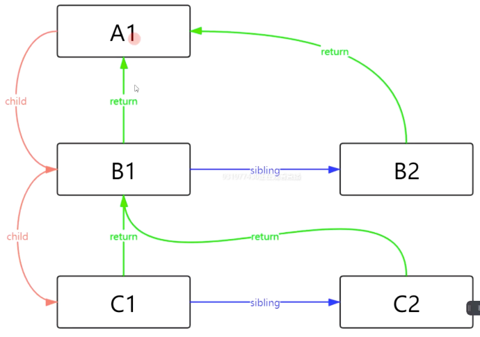

## Fiber 前置知识

### 屏幕刷新率

大多数设备的屏幕刷新率为 60 次/秒，浏览器渲染动画或者页面每一帧的速率也需要和设备屏幕的刷新率保持一致，而浏览器页面是一帧一帧绘制出来的，当每秒绘制的帧数（FPS）达到 60 时页面就比较流畅，小于这个值的时候页面会卡顿，每个帧绘制的时间时 1/60 = 16.6ms ，所以每一帧分到的时间时 16.6ms 。所以我们在书写代码的时候要尽量将一帧的工作量控制在 16ms 内

### 帧


一帧包含了用户的交互、js的执行、以及`requestAnimationFrame`的调用，布局计算以及页面的重绘等工作。 假如某一帧里面要执行的任务不多，在不到16ms的时间内就完成了上述任务的话，那么这一帧就会有一定的**空闲时间**，这段时间就恰好可以用来执行`requestIdleCallback`的回调，相对应的如果这一帧的任务很多没有剩余的时间就不会执行`requestIdleCallback`的回调，并且只有等到有帧有剩余时间的时候才会执行

> `var handle = requestIdleCallback(fn,timeout)`还可以接受一个超时时间，如果超过这个时间还没有执行就会立即执行，并且在回调函数中可以接受到一个 deadline 对象，这个对象有两个属性，`deadline.timeRemaining()` 可以返回当前帧还剩下多少时间可以使用，`didTimeout本次callback的执行是因为超时的原因
>
> `cancelIdleCallback(handle)`可以取消调用
>
> 不要在`requestIdleCallback`中操作DOM，因为会**引起重新渲染**
>
> **空闲时间**
>
> 一般空闲时间是小于 16ms 的，但是当用户属于空闲状态（没有与网页进行任何交互），并且没有屏幕中也没有动画执行。此时空闲时间是无限长的。但是为了避免不可预测的事（用户突然和网页进行交互），空闲时间最大应该被限制在50ms以内。

```JS
function sleep(delay){
  for(let now=Date.now();Date.now() - now > delay;){}
}
const works = [
  ()=>{
    console.log("task 1 start")
    sleep(20)
    console.log("task 1 end")
  },
  ()=>{
    console.log("task 2 start")
    sleep(20)
    console.log("task 2 end")
  },
  ()=>{
    console.log("task 3 start")
    sleep(20)
    console.log("task 3 end")
  },
]

requestIdleCallback(workLoop,{timeout:1000});
function workLoop(deadline){
 console.log(`deadline,timeRemain:${deadline.timeRemaining()},didTimeout:${deadline.didTimeout}`)
  if((deadline.timeRemaining() > 0 || deadline.didTimeout) && works.length){
    performUnitOfWork()
  }
  if(works.length){
    requestIdleCallback(workLoop,{timeout:1000});
  }
}
function performUnitOfWork(){
  works.shift()();
}
```

目前 react 的 fiber 就是运用了`requestIdleCallback`的原理将任务进行时间分片分割成多个小任务，然后按照优先级来在绘制之后执行。但是目前`requestIdleCallback`只有Chrome支持，所以React利用`MessageChannel`来模拟了`requestIdleCallback`

### MessageChannel

`MessageChannel`API允许我们创建一个新的消息通道，并通过它的两个 `MessagePort` 属性发送数据，`MessageChannel`创建了一个通信管道，这个管道有两个端口，每个端口都可以通过`postMessage`发送数据，而另一个端口通过绑定`onmessage`事件就可以接受到来自另一个端口的数据，同时MessageChannel 是一个宏任务。

```js
var channel = new MessageChannel();
```

获取实例的两个端口，注意的是，两个端口都是只读的

```js
channel.port1
channel.port2
```

简单来说，`MessageChannel`创建了一个通信的管道，这个管道有两个端口，每个端口都可以通过`postMessage`发送数据，而一个端口只要绑定了`onmessage`回调方法，就可以接收从另一个端口传过来的数据。

一个简单的例子：

```jsx
var channel = new MessageChannel();
var port1 = channel.port1;
var port2 = channel.port2;
port1.onmessage = function(event) {
  console.log("port1收到来自port2的数据：" + event.data);
}
port2.onmessage = function(event) {
  console.log("port2收到来自port1的数据：" + event.data);
}

port1.postMessage("发送给port2");
port2.postMessage("发送给port1");
```

常用于 **web worker兄弟线程通信**， **iframe兄弟通信**

```js
//web worker兄弟线程通信
let worker1 = new Worker('./worker1.js');
let worker2 = new Worker('./worker2.js');
let ms = new MessageChannel();

// 把 port1 分配给 worker1
worker1.postMessage('main', [ms.port1]);
// 把 port2 分配给 worker2
worker2.postMessage('main', [ms.port2]);

//------------------------------------------
//iframe兄弟通信
var {port1,port2} = new MessageChannel();
var iframe1 = document.getElementById('iframe1');
iframe1.contentWindow.postMessage('main','*',[port1]);
var iframe2 = document.getElementById('iframe2');
iframe2.contentWindow.postMessage('main','*',[port2]);
//-----------------iframe
window.addEventListener('message',function(event){
  let messageDom = document.getElementById('message');
  messageDom.innerHTML = "收到"  + event.origin + "消息：" + event.data;
  let port = event.ports[0];
  port.onmessage = function(e){
    messageDom.innerHTML += '<br/>收到' + e.origin + '消息: ' + e.data;
  }
  port.postMessage('from iframe1');
}, false);
```


## 链表

Fiber 中很多地方都使用到链表结构

```js
class Update{
  constructor(payload,nextUpdate){
    this.payload = payload;
    this.nextUpdate = nextUpdate;
  }
}
class UpdateQueue{
  constructor(){
    this.baseState = null;//原状态
    this.firstUpdate = null;//第一个更新
    this.lastUpdate = null;//最后一个更新
  }
  enqueueUpdate(update){
    if(this.firstUpdate){
      this.firstUpdate = this.lastUpdate = update
    }else{
      this.lastUpdate.nextUpdate = update
      this.lastUpdate = update
    }
  }
  //便利链表进行更新
  forceUpdate(){
    let currentState = this.baseState || {}
    let currentUpdate = this.firstUpdate;
    while(currentUpdate){
      let nextState = typeof currentUpdate.payload === 'function' ? 
          currentUpdate.payload(currentState) : currentUpdate.payload;
      currentState = {...currentState,...nextState};//合并状态
      currentUpdate = currentUpdate.nextUpdate;//继续下一个更新
    }
    //更新完成之后重置链表
    this.firstUpdate = this.lastUpdate = null;
    this.baseState = currentState;
    return currentState;
  }
}
let queue = new UpdateQueue()
queue.enqueueUpdate(new Update({name:"jack"}))
queue.enqueueUpdate(new Update({age:12}))
queue.enqueueUpdate(new Update((state)=>({age:state.age + 1})))
queue.enqueueUpdate(new Update((state)=>({age:state.age + 1})))
queue.forceUpdate()
```


### react为什么要用Fiber

Fiber 架构是在React 16的时候才被提出的，在这之前 React 执行任务是使用协调的完成的

+ React 会递归对比 虚拟DOM树，找出需要变动的节点，然后同步更新它们，这个过程 React 称为**协程**（Reconcilation）
+ 在 Reconcilation 期间，React会一直占用浏览器资源，一则会导致用户出发的事件得不到响应，二则会导致掉帧，用户会感觉到卡顿

实际上React16之前的版本在遍历和对比 虚拟DOM 是从根节点开始采用深度遍历（递归遍历）进行的，这样的遍历方式中途是不能中断的，并且会导致执行栈过深所以就会一直占用浏览器资源。在React 16 之后就开始采用 Fiber 架构可以中断任务，将操作权限交还给浏览器，从而不占用资源，之后当浏览器有空闲的时候再继续任务。

### Fiber 是什么

我们可以通过一些调度策略合理分配CPU资源，从而提高用户的响应速度。通过Fiber架构，让自己的Reconciliation过程变成可被中断，适时地让出CPU执行权，从而可以让浏览器及时响应用户的交互


#### Fiber 是一种数据结构

React 目前的做法是使用链表，每个虚拟DOM节点内部表示为一个Fiber



Fiber 的结构应该是这样的

```ts
type Fiber = {
  type:any,//类型
  sibling:Fiber,//下一个兄弟节点
  child:Fiber,//第一个子节点
  return:Fiber,//父节点
}
```


### Fiber的执行阶段

每次渲染有两个阶段：Reconciliation（协调/render）阶段，Commit（提交）阶段

+ Reconciliation（协调/render）阶段：可以认为是 Diff 阶段，这个阶段可以被中断，这个阶段会找出所有节点变更，例如节点新增、删除、属性变更等等，这些变更React 称为副作用（Effect）
+ Commit（提交）阶段：将上一个阶段计算出来的需要处理的副作用一次性执行，这个阶段必须同步执行，不能被打断

**Reconciliation（协调/render）阶段**

这个阶段会重新构建Fiber树，上面图中的fiber树应该是这样的

```js
// element.js
let A1 = {type:"div",key:"A1"}
let B1 = {type:"div",key:"B1",return:A1}
let B2 = {type:"div",key:"B2",return:A1}
let C1 = {type:"div",key:"C1",return:B1}
let C2 = {type:"div",key:"C2",return:B1}
A1.child = B1
B1.sibling = B2
B1.child = C1
C1.sibling = C2
module.exports = A1
```

遍历规则：

+ 下一个节点：先儿子，后弟弟，再叔叔
+ 自己所有子节点完成后自己完成

```js
let rootFiber = require("./element")
let nextUnitOfWork = null;
function workLoop(){
  //如果有待执行的执行单元就执行，然后返回下一个执行单元
  while((deadline.timeRemaining() > 1 || deadline.didTimeout) && nextUnitOfWork){
    nextUnitOfWork = performUnitOfWork(nextUnitOfWork);
  }
  if(!nextUnitOfWork){//全部遍历完成
    console.log("render阶段结束")
  }else{//有还没有完成的任务（任务别中断）在下一次空闲时继续
    requestIdleCallback(workLoop,{timeout:1000})
  }
}
function performUnitOfWork(fiber){
  beginWork(fiber);
  if(fiber.child){//如果有儿子返回打儿子
    return fiber.child
  }
  //如果没有儿子，说明此fiber已经完成了
  while(fiber){
    completeUnitOfWork(fiber)
    if(fiber.sibling){
      return fiber.sibling
    }
    fiber = fiber.return
  }
}
function completeUnitOfWork(fiber){
  console.log('结束',fiber.key)
}
function beginWork(fiber){
  console.log('开始',fiber.key)
}
nextUnitOfWork = rootFiber
requestIdleCallback(workLoop,{timeout:1000})
```


## 参考

+ [React 技术揭秘](https://kasong.gitee.io/just-react/)
+ [这可能是最通俗的 React Fiber(时间分片) 打开方式](https://juejin.cn/post/6844903975112671239)
+ [你应该知道的requestIdleCallback](https://juejin.cn/post/6844903592831238157)
+ [手写React的Fiber架构，深入理解其原理](https://juejin.cn/post/6844904197008130062)