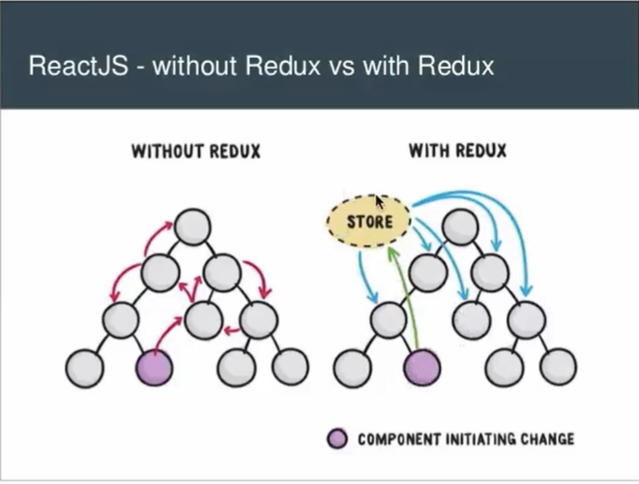
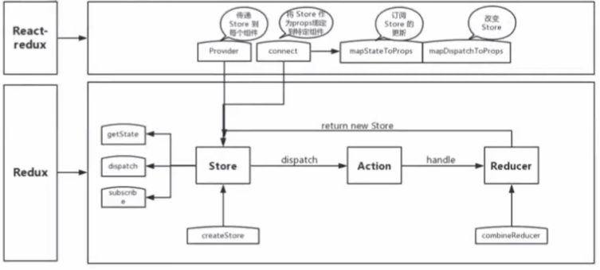

# React 常见问题

## Redux 是如何将 State 注入到 React 组件上去的

React 是用于构建用户界面的javaScript 库（负责组件的UI界面渲染）

Redux 是 javascript 状态容器（负责管理数据的工具），是一个独立的库，和 React 没有什么特别的关系，所以要在 React 中使用Redux 还需要 react-redux 将他们连接起来

### Redux 解决了什么问题？



Redux 主要解决的是组件间通信麻烦的问题，应为在React 中数据是单向流动并且是相对独立的，也就是所组件间的数据是不可以随便访问的，如果想要**父子组件间进行相互通行**的话可以使用 **props** 以及 **状态提升** 的方式实现，如果想要事件**兄弟组件间的通信**，就需要通过 父组件 作为桥梁 结合 props 和 状态提升 来实现。这显然是非常麻烦且不好维护的。

### Redux 的原理

Redux 的原理就是使用了发布订阅模式，其核心就是 `createStore`

createStore.js

```js
/**
* @param reducer reducer
* @param preloadedState 初始值
* @param enhancer 中间件
*/
export default function createStore(reducer,preloadedState,enhancer){
    //实现第二个参数选填，只有当第二个参数传入的是中间件才会执行下面的代码
    if(typeof preloadedState === "function" && typeof enhancer === "undefined"){
        enhancer = preloadedState;
        preloadedState = undefined;
    }
    
    let currentReducer = reducer;
    let currentState = preloadedState; //整个应用所有的 State 都存储在这个变量里
    let currentListeners = [];// 订阅传进来的回调函数
    
    let nextListeners = currentListeners;// 回调函数的备份
    
    //获取状态
    function getState(){
        return currentState;
    }
    
    // 订阅器
    function subscribe(listener){
        if(nextListeners === currentListeners){
            // 浅复制 currentListeners 避免其他地方使用到 currentListeners 从而造成数据不一致
            nextListeners = [...currentListeners];
        }
        nextListeners.push(listener);
        
        return function unsubscribe(){
            if(nextListeners === currentListeners){
                nextListeners = [...currentListeners];
            }
            const index = nextListeners.indexOf(listener);
            nextListeners.splice(index,1);
        }
    }
    
    //发布器
    function dispatch(action){
        currentState = currentReducer(currentState,action);//调用reduce来更新数据
        const listeners = (currentListeners = nextListeners);//保证当前的 listeners 是最新的
        for(let i = 0;i < listeners.lengthl;i++){
            listeners[i]();//依次执行回调函数
        }
        return action;
    }
    
    //手动触发一次，进行初始化
    dispatch({type:"INIT"});
    
    return {
        getState,
        dispatch,
        subscribe,
    }
}
```

> redux 就是帮我们用一个变量存储所有的 State ，并且 提供了发布功能来修改数据，以及订阅功能来触发回调


### react-redux 做了什么



**Provider**：传递 Store 到每个组件

```js
import React from "react";
import PropTypes from "prop-types";

export default class Provider extends React.Component {
    // context 往所有子组件，孙组件里传递数据
    // props   父组件往子组件里传递数据
    // state   组件自身的数据
    
    //声明一个 context 数据
    getChildContext(){
        return {store:this.store}
    }
    
    constructor(props,context){
        super(props,context);
        this.store = props.store;
    }
    
    render(){
        return React.Children.only(this.props.children);
    }
}

Provider.childContextTypes = {
    store:PropTypes.object
}
```

> Provider 就是通过 React 的 Context API 把数据往下传的

**connect** ：将store 作为props 绑定到特定组件

```jsx
import React from "react";
import PropTypes from "prop-types";

const connect = (mapStateToProps = state => state,mapDispatchToProps = {}) => (
    (WrapComponent) => {
        return class ConnectComponent extends React.Component {
            static contextTypes = {
                store:PropTypes.object
            }
            constroctor(prop,context){
                super(props,context);
                this.state = {
                    props:{},//声明一个叫props 的state
                }
            }
        	componentDidMount(){
                const {store} = this.context;//从Context中获取到 store 对象
                store.subscribe(()=>this.update());//订阅 redux 事件
            }
        	update(){
                const { store } = this.context;//从Context中获取到 store 对象
                const stateProps = mapStateToProps(store.getState())//把 store 中的全部数据传到组件内部
                const dispatchProps = mapDispatchToProps(store.dispatch);//把 store.dispatch 传到组件内部
                
                //调用 setState 触发组件更新
                // 将最新的 state 以及 dispatch 合并当前组件的 props 上
                this.setState({
                    props:{
                        ...this.state.props,
                        ...stateProps,
                        ...dispatchProps
                    }
                })
            }
        	render(){
                return <WrapComponent {...this.state.props}></WrapComponent>
            }
        }
    }
)

export default connect;
```

```js
const mapStateToProps = state => {
    return {
        value:state
    }
}

const mapDispatchToProps = dispatch => {
    return {
        onIncrement:()=> dispatch({type:"INCREMENT"}),
        onDecrement:()=> dispatch({type:"DECREMENT"})
    }
}
```

> connect 就是一个高阶组件，接收 provider 传递过来的 store 对象，并订阅 store 中的数据，如果 store 中的数据发生变化，就调用 setState 触发组件更新。


### 总结：

+ redux 是一个独立的库，和react 并没有什么关系，如果 react 需要使用 redux 需要 react-redux 来转化
+ redux 的原理就是一个发布订阅器，帮我们把一个变量的所有 State ，并且提供发布功能来修改数据，以及订阅功能来触发回调
+ react-redux 的作用就是订阅 Store 里的数据更新，他包含两个重要的元素 ：Provider 和 connect 方法
	+ Provider 的作用就是通过 Context API 把 Store 对象注入到 React 组件上去
	+ connect 方法就是一个高阶组件，在高阶组件里通过订阅 Store 中的数据的更新，从而通过调用 setState 方法来触发组件更新


### redux 缺点 

+ 样板模板太多，修改数据的链路太长。比如 reducers 和 actions 这些很多都是一模一样的格式，只是数据的不同，但是却又不得不创建。
+ 解决方案：
	+ 使用 redux-actions 来减少书写固定不变的代码
	+ 同时还可以使用 yeoman 等 cli 工具，帮我们用命令一键创建模板文件和样本代码


## 为什么 redux 处理不了异步问题

从 redux 代码的原理出发

```js
dispatch(action) // action = {type:xx,preload:xxx}

// reducer 是一个纯函数，无法处理其他类型的数据

// 所以 dispatch 默认接收的 action 不可以是其他类型的数据
dispatch((dispatch)=>{
    setTimeout(()=>{
        dispatch({type:"INCREMENT"})
    },3000);
})
```

dispatch 默认接收的 action 只能是 object 类型，因为 reducer 里面要接收 action.type 来处理不同的数据。

解决方法：

+ 使用 redux-thunk 中间件
+ 使用 redux-saga 中间件


## React hooks 是什么

在react中创建组件有两种方式，一种是以类的方法创建，一种是以函数的方式创建，函数方式创建的组件是没有自己的state的，也没有 this 。而在 react 16.8 之后提供了 许多的 hooks ，这些hooks是一个新的 API ，可用来创建所需的全部操作和数据，如生命周期，state 等，

+ React hooks 是一个新的API，可以用函数来写所有的组件
+ 可以让函数组件拥有自己的状态管理（包括 state 和生命周期函数）
+ 可以通过创建自定义的 hooks 来抽离可复用的业务组件