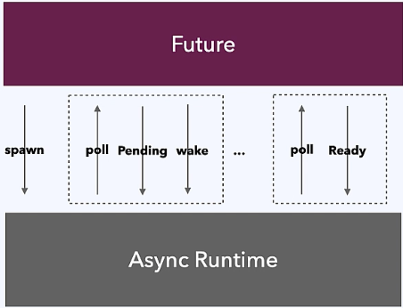
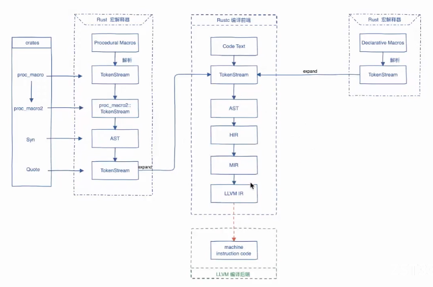
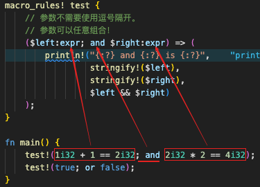

## 资料

- [rust 中文书](https://rustwiki.org/)
- [Rust 实践指南](https://books.niqin.com/read/rust-guide/zh-cn/3-env/3.1-rust-toolchain-cn.html)
- [rust 迷你数据库项目](https://github.com/rosedblabs/rust-practice)
- [Rust 数据内存布局](https://mp.weixin.qq.com/s/GVlLBvaprI75d-GkE2P_QA)
- [rust 文章集](https://github.com/rust-boom/rust-boom)
- [过程宏练习项目](https://github.com/dtolnay/proc-macro-workshop) [Rust 过程宏开发实战系列](https://www.bilibili.com/video/BV16A411N7m2/?spm_id_from=333.337.search-card.all.click&vd_source=41ed998ac767425fb616fd9071ce9682)
- [Rust 宏小册](https://zjp-cn.github.io/tlborm/#rust-宏小册)
- [http://blog.ideawand.com](http://blog.ideawand.com)
- [Rust 语言圣经](https://course.rs/about-book.html)
- [Rusty Book(锈书)](https://rusty.course.rs/awesome-daily-dev.html)
- [crates.io](https://crates.io/)/[lib.rs](https://lib.rs/)，查找库

## Rustup换源

### Rustup 镜像配置

编辑或创建 `~/.cargo/config` 文件（Windows 在 `%USERPROFILE%\.cargo\config`），添加以下内容： **中国科学技术大学 (USTC)源:**

```toml
[source.crates-io]
replace-with = 'ustc'

[source.ustc]
registry = "https://mirrors.ustc.edu.cn/crates.io-index"

[net]
git-fetch-with-cli = true
```

**或者使用清华大学源：**

```toml
[source.crates-io]
replace-with = 'tuna'

[source.tuna]
registry = "https://mirrors.tuna.tsinghua.edu.cn/git/crates.io-index.git"
```

### Rustup 工具链镜像

**mac/linux**

**中国科学技术大学 (USTC)源:**

```bash
export RUSTUP_DIST_SERVER=https://mirrors.ustc.edu.cn/rust-static
export RUSTUP_UPDATE_ROOT=https://mirrors.ustc.edu.cn/rust-static/rustup
```

**或者使用清华大学源：**

```bash
export RUSTUP_DIST_SERVER=https://mirrors.tuna.tsinghua.edu.cn/rustup
```

**Windows 系统：**

右键 **"此电脑" → 属性 → 高级系统设置 → 环境变量**，在 **"用户变量"** 或 **"系统变量"** 中新建：

- 变量名：`RUSTUP_DIST_SERVER`
- 变量值：`https://mirrors.ustc.edu.cn/rust-static`
- 变量名：`RUSTUP_UPDATE_ROOT`
- 变量值：`https://mirrors.ustc.edu.cn/rust-static/rustup`


## Result 和 Option

```rust
enum Result<T, E> {
    Ok(T),
    Err(E),
}

enum Option<T> {
  Some(T),
  None,
}
```

常用枚举`Result`用于对错误进行处理，`Option`主要用于对值可能是`None`的数据进行处理

```rust
let f = File::open("hello.txt").unwrap();// Result 有方法 unwrap 可以直接获取Ok值，但是不对Err进行处理，出错就直接终止程序
let f = File::open("hello.txt").unwrap().expect("Failed to open hello.txt");// 定义错误信息
```

**`?`用于Result操作**，注意使用`?`时一定要在返回值中定义接受错误

```rust
fn open_file() -> Result<File, Box<dyn std::error::Error>> {
    let mut f = File::open("hello.txt")?;//不会直接中断程序，会调用Err将错误往上抛
    Ok(f)
}
```

**`?`用于 Option 的返回**

`Option` 就通过 `?` 返回 `None`：

```rust
fn first(arr: &[i32]) -> Option<&i32> {
   let v = arr.get(0)?;
   Some(v)
}
```

`?` 操作符需要一个变量来承载正确的值，这个函数只会返回 `Some(&i32)` 或者 `None`，只有错误值能直接返回，正确的值不行

```rust
// 错误
fn first(arr: &[i32]) -> Option<&i32> {
   arr.get(0)?
}
```


## 所有权

所有权规则

1. Rust 中的每一个值都有一个 **所有者**（*owner*）。
2. 值在任一时刻有且只有一个所有者。
3. 当所有者离开作用域，这个值将被丢弃。

变量所有权有三种使用方式 **移动，复制，借用/引用**

**移动**

```rust
let word1 = String::from("hello word");
let word2 = word1; // word1 所有权移动给了 word2，word1将会在下一个步被清除不可再访问。
let word3 = String::from("jack");
let word4 = say_hey(word3); // word3的所有权被移动给了函数say_hey的形参，之后也是不能使用 word3了，但是可以再函数中将变量翻译再接收
//let word5 = say_hey(word3.clone()); // 将值克隆出来赋值不会移动变量所有权

println!("{} {} {}", word1, word2, word3);

let num1 = 10; // 标量
let num2 = num1; //标量可以这样赋值，之后也可以使用num1，因为标量实现了copy trait再赋值的时候会自动copy值出来
println!("num2: {}", num2);

fn say_hey(str: String) -> String {
    println!("say: {}", str);
    str
}
```

**引用/借用**

```rust
let word6 = String::from("rocy");
let word7:&String = &word6;// 不可变引用
say_hey2(word7);// 将所有权借用给另一个变量这样就不会将所有权移动,也不用再调用函数后再接受一遍返回

let mut word8 = String::from("Tom");
let word9: &mut String = &mut word8;// 注意不同赋值方式得到的类型是不一样的，尽量保存一致
// let word9: &String = &word8;
// let word9: &mut str = word8.as_mut();
println!("{} {}", word6, word7);

fn say_hey2(str: &str) -> &str {
    println!("say: {}", str);
}
```

引用的规则

- 在任意给定时间，**要么**只能有一个可变引用，**要么**只能有多个不可变引用。
- 引用必须总是有效的。

这一限制让可变性以一种受到严格控制的方式出现，从而防止在同一时间对同一数据存在多个可变引用。这个限制的好处是 Rust 可以在编译时防止数据竞争

```rust
let mut s = String::from("hello");

let r1 = &s; // 没问题
let r2 = &s; // 没问题
let r3 = &mut s; // 大问题

println!("{r1}, {r2}, and {r3}");
```

为什么会有问题？比如说我先有一个文件用多个两个线程去处理，一个线程拿到了不可变应用`r1`用于读取文件，另一个线程拿到了可变引用`r2`用于写，当我要读的文件内容是`我的朋友她很漂亮`，当`r1`读取到`她`整个字的偏旁`女`时`r2`将`她很漂亮`改成了`妈很好看`，那么`r1`最终得到的就会时`妈`，和原来的数据不一致。

```rust
let mut s = String::from("hello");

let r1 = &s; // 没问题
let r2 = &s; // 没问题
println!("{r1} and {r2}");
// 此位置之后 r1 和 r2 不再使用

let r3 = &mut s; // 没问题
println!("{r3}");
```

**悬垂引用**

```rust
fn main() {
    let reference_to_nothing = dangle();
}

fn dangle() -> &String {
    let s = String::from("hello");

    &s
}// 运行结束后 s 被释放，&s变成了悬垂引用
```


## 生命周期

**生命周期注解语法**

生命周期参数名称必须以撇号（`'`）开头，其名称通常全是小写，类似于泛型其名称非常短。大多数人使用 `'a` 作为第一个生命周期注解。生命周期参数注解位于引用的 `&` 之后，并有一个空格来将引用类型与生命周期注解分隔开。

```rust
&i32        // 引用
&'a i32     // 带有显式生命周期的引用
&'a mut i32 // 带有显式生命周期的可变引用
```

```rust
fn main() {
    let string1 = String::from("abcd");
    let string2 = "xyz";

    let result = longest(string1.as_str(), string2);
    println!("The longest string is {result}");
}
fn longest(x: &str, y: &str) -> &str {
    if x.len() > y.len() { x } else { y }
}
```

`longest`方法并不能通过编译检查，因为你和编译器都不知道在调用`longest`的时候传入进来的数据有没有被清除，这是就需要我们指明数据的生命周期，告诉编译器在调用函数时参数一定还没有被清除

```rust
fn longest<'a>(x: &'a str, y: &'a str) -> &'a str {
    if x.len() > y.len() { x } else { y }
}
```

泛型生命周期 `'a` 的具体生命周期等同于 `x` 和 `y` 的生命周期中较小的那一个。因为我们用相同的生命周期参数 `'a` 标注了返回的引用值，所以返回的引用值就能保证在 `x` 和 `y` 中较短的那个生命周期结束之前保持有效。

**生命周期省略**

函数或方法的参数的生命周期被称为 **输入生命周期**（*input lifetimes*），而返回值的生命周期被称为 **输出生命周期**（*output lifetimes*）。

编译器采用三条规则来判断引用何时不需要明确的注解。第一条规则适用于输入生命周期，后两条规则适用于输出生命周期。

1. 第一条规则是编译器为每一个引用参数都分配一个生命周期参数。换句话说就是，函数有一个引用参数的就有一个生命周期参数：`fn foo<'a>(x: &'a i32)`，有两个引用参数的函数就有两个不同的生命周期参数，`fn foo<'a, 'b>(x: &'a i32, y: &'b i32)`，依此类推。
2. 第二条规则是如果只有一个输入生命周期参数，那么将它赋予给所有输出生命周期参数：`fn foo<'a>(x: &'a i32) -> &'a i32`。
3. 第三条规则是如果方法有多个输入生命周期参数并且其中一个参数是 `&self` 或 `&mut self`，说明这是个方法，那么所有输出生命周期参数被赋予 `self` 的生命周期。第三条规则使得方法更容易读写，因为只需更少的符号。

```rust
impl<'a> ImportantExcerpt<'a> {
    fn announce_and_return_part<'b>(&'a self, announcement: &'b str) -> &'a str {
        println!("Attention please: {}", announcement);
        self.part
    }
}
```

由于 `&'a self` 是被引用的一方，因此引用它的 `&'b str` 必须要活得比它短，否则会出现悬垂引用。因此说明生命周期 `'b` 必须要比 `'a` 小，只要满足了这一点，编译器就不会再报错：

```rust
impl<'a: 'b, 'b> ImportantExcerpt<'a> {
    fn announce_and_return_part(&'a self, announcement: &'b str) -> &'b str {
        println!("Attention please: {}", announcement);
        self.part
    }
}
```

- `'a: 'b`，是生命周期约束语法，跟泛型约束非常相似，用于说明 `'a` 必须比 `'b` 活得久
- 可以把 `'a` 和 `'b` 都在同一个地方声明（如上），或者分开声明但通过 `where 'a: 'b` 约束生命周期关系，如下：

```rust
impl<'a> ImportantExcerpt<'a> {
    fn announce_and_return_part<'b>(&'a self, announcement: &'b str) -> &'b str
    where
        'a: 'b,
    {
        println!("Attention please: {}", announcement);
        self.part
    }
}
```

总之，实现方法比想象中简单：加一个约束，就能暗示编译器，尽管引用吧，反正我想引用的内容比我活得久，爱咋咋地，我怎么都不会引用到无效的内容！

**静态生命周期**

这里有一种特殊的生命周期值得讨论：`'static`，其生命周期**能够**存活于整个程序期间。所有的字符串字面值都拥有 `'static` 生命周期，我们也可以选择像下面这样标注出来：

```rust
let s: &'static str = "I have a static lifetime.";
```

这个字符串的文本被直接储存在程序的二进制文件中而这个文件总是可用的。因此所有的字符串字面值都是 `'static` 的。

有时候，`'static` 确实可以帮助我们解决非常复杂的生命周期问题甚至是无法被手动解决的生命周期问题，那么此时就应该放心大胆的用，只要你确定：**你的所有引用的生命周期都是正确的，只是编译器太笨不懂罢了**。

总结下：

- 生命周期 `'static` 意味着能和程序活得一样久，例如字符串字面量和特征对象
- 实在遇到解决不了的生命周期标注问题，可以尝试 `T: 'static`，有时候它会给你奇迹

## 错误处理

**不可恢复的错误：panic**

```rust
let v = ver![1,2,3];
println!("{}",v[12]);
```

数组访问越界会导致 panic 错误使得程序崩溃，还可以通过`panic!`宏来手动触发这个错误

```rus
panic!("crash and burn");
```

`cargo run` 运行项目可以得到简易的报错信息，`RUST_BACKTRACE=1 cargo run`可以看到报错的栈信息

**可恢复的错误 Result**

```rust
use std::fs::File;
use std::io::ErrorKind;

fn main() {
    let f = File::open("hello.txt");

    let f = match f {
        Ok(file) => file,
        Err(error) => match error.kind() {
            ErrorKind::NotFound => match File::create("hello.txt") {
                Ok(fc) => fc,
                Err(e) => panic!("Problem creating the file: {:?}", e),
            },
            other_error => panic!("Problem opening the file: {:?}", other_error),
        },
    };
}
```


## 包和模块

### 创建包和库

创建`Package`

```shell
cargo new my-project
```

创建`lib`库

```shell
cargo new my-lib --lib
```

与 `src/main.rs` 一样，Cargo 知道，如果一个 `Package` 包含有 `src/lib.rs`，意味它包含有一个库类型的同名包 `my-lib`，该包的根文件是 `src/lib.rs`。

**易混淆的 Package 和包**

看完上面，相信大家看出来为何 `Package` 和包容易被混淆了吧？因为你用 `cargo new` 创建的 `Package` 和它其中包含的包是同名的！

不过，只要你牢记 `Package` 是一个项目工程，而包只是一个编译单元，也就不会再混淆这两个概念：`src/main.rs` 和 `src/lib.rs` 都是编译单元，因此它们都是包。

### 定义模块

模块定义语法

```rust
pub mod 模块名字{
  // 定义模块、方法、结构体等，注意不用pub休息的定义在外部文件无法导入使用
}
```

在项目中需要创建`src/lib.rs`或者直接通过`cargo new my-lib --lib`进行新项目直接创建，在里面写入模块定义。

```rust
mod front_of_house {
    mod hosting {
        fn add_to_waitlist() {}

        fn seat_at_table() {}
    }

    mod serving {
        fn take_order() {}

        fn serve_order() {}

        fn take_payment() {}
    }
}
```

使用，在`src/lib.rs`中使用

```rust
// 绝对路径，从包根开始，路径名以包名或者 crate 作为开头，crate表示src/lib.rs文件
crate::front_of_house::hosting::add_to_waitlist();

// 相对路径,从当前模块开始，以 self，super 或当前模块的标识符作为开头
front_of_house::hosting::add_to_waitlist();
```

`super` 代表的是父模块为开始的引用方式，非常类似于文件系统中的 `..` 语法：`../a/b` 文件名：src/lib.rs

```rust
fn serve_order() {}

// 厨房模块
mod back_of_house {
    fn fix_incorrect_order() {
        cook_order();
        super::serve_order();
    }

    fn cook_order() {}
}
```

`self` 其实就是引用自身模块中的项

```rust
fn serve_order() {
    self::back_of_house::cook_order()
}

mod back_of_house {
    fn fix_incorrect_order() {
        cook_order();
        crate::serve_order();
    }

    pub fn cook_order() {}
}
```

### 模块与文件分离

**以文件作为模块**

当模块变多或者变大时，需要将模块放入一个单独的文件中，让代码更好维护。现在，把 `front_of_house` 前厅分离出来，放入一个单独的文件中 `src/front_of_house.rs`：

```rust
pub mod hosting {
    pub fn add_to_waitlist() {}
}
```

然后，将以下代码留在 `src/lib.rs` 中：

```rust
mod front_of_house;

// 使用
pub use crate::front_of_house::hosting;

pub fn eat_at_restaurant() {
    hosting::add_to_waitlist();
    hosting::add_to_waitlist();
    hosting::add_to_waitlist();
}
```

- `mod front_of_house;` 告诉 Rust 从另一个和模块 `front_of_house` 同名的文件中加载该模块的内容
- 使用绝对路径的方式来引用 `hosting` 模块：`crate::front_of_house::hosting;`

**以文件夹作为模块**

如果需要将文件夹作为一个模块，我们需要进行显式指定暴露哪些子模块。按照上述的报错信息，我们有两种方法：

- 在 `front_of_house` 目录里创建一个 `mod.rs`，如果你使用的 `rustc` 版本 `1.30` 之前，这是唯一的方法。
- 在 `front_of_house` **同级**目录里创建一个与模块（目录）**同名**的 rs 文件 `front_of_house.rs`，在新版本里，更建议使用这样的命名方式来避免项目中存在大量同名的 `mod.rs` 文件（ Python 点了个 `踩`）。

如果使用第二种方式，文件结构将如下所示：

```shell
src
├── front_of_house
│   └── hosting.rs
├── front_of_house.rs
└── lib.rs
```

而无论是上述哪个方式创建的文件，其内容都是一样的，你需要在定义你(`mod.rs` 或 `front_of_house.rs`)的子模块（子模块名与文件名相同）：

```rust
pub mod hosting;
```

### 导入模块

```rust
use 模块相对路径/绝对路径/系统模块路径;
```

```rust
use crate::front_of_house::hosting;
use std::fmt::Result;
// as 设置别名
use std::io::Result as IoResult;
// 引入项再导出，这里 use 代表引入 hosting 模块到当前作用域，pub 表示将该引入的内容再度设置为可见
pub use crate::front_of_house::hosting;
// 批量导入
use std::collections::{HashMap,BTreeMap,HashSet};
// 导入包下所有
use std::collections::*;
```

### 限制可见性语法

`pub(crate)` 或 `pub(in crate::a)` 就是限制可见性语法，前者是限制在整个包内可见，后者是通过绝对路径，限制在包内的某个模块内可见，总结一下：

- `pub` 意味着可见性无任何限制
- `pub(crate)` 表示在当前包可见
- `pub(self)` 在当前模块可见
- `pub(super)` 在父模块可见
- `pub(in <path>)` 表示在某个路径代表的模块中可见，其中 `path` 必须是父模块或者祖先模块


## 智能指针

### `Box::new`

**`Box::new`可以将放在栈上的数据放到堆上**

```rust
let num = 1;
// 数据存储到堆上,栈上的数据在移动所有权的时候会自动进行复制，所以num还可以用
let num2 = Box::new(num);
println!("{},{}", num, num2);
```

通常情况下在栈上比较大的数据才需要存储到堆上

```rust
// 在栈上创建一个长度为1000的数组
let arr = [0;1000];
// 将arr所有权转移arr1，由于 `arr` 分配在栈上，因此这里实际上是直接重新深拷贝了一份数据
let arr1 = arr;

// arr 和 arr1 都拥有各自的栈上数组，因此不会报错
println!("{:?}", arr.len());
println!("{:?}", arr1.len());

// 在堆上创建一个长度为1000的数组，然后使用一个智能指针指向它
let arr = Box::new([0;1000]);
// 将堆上数组的所有权转移给 arr1，由于数据在堆上，因此仅仅拷贝了智能指针的结构体，底层数据并没有被拷贝
// 所有权顺利转移给 arr1，arr 不再拥有所有权
let arr1 = arr;
println!("{:?}", arr1.len());
// 由于 arr 不再拥有底层数组的所有权，因此下面代码将报错
// println!("{:?}", arr.len());
```

**将动态大小类型变为 Sized 固定大小类型**，Rust 需要在编译时知道类型占用多少空间，如果一种类型在编译时无法知道具体的大小，那么被称为动态大小类型 DST。其中一种无法在编译时知道大小的类型是**递归类型**

```rust
// 每个节点包含一个 i32 值，还包含了一个新的 List
enum List {
    Cons(i32, Box<List>),
    Nil,
}
```

特征对象 `trait` 也是DST的，因为实现这个 `trait` 的结构体还可以添加更多东西所以大小是不固定的

```rust
trait Draw {
    fn draw(&self);
}

struct Button {
    id: u32,
}
impl Draw for Button {
    fn draw(&self) {
        println!("这是屏幕上第{}号按钮", self.id)
    }
}

struct Select {
    id: u32,
}

impl Draw for Select {
    fn draw(&self) {
        println!("这个选择框贼难用{}", self.id)
    }
}

fn main() {
    let elems: Vec<Box<dyn Draw>> = vec![Box::new(Button { id: 1 }), Box::new(Select { id: 2 })];

    for e in elems {
        e.draw()
    }
}
```

> `dyn` 是 dynamic dispatch（动态分发） 的标记，读作 “dynamic”。它出现在 trait 对象（trait object） 类型里，表示：在运行时才知道具体是哪种类型，但通过统一的 trait 接口来调用。
>
> 这里 `Vec` 里要放 两种不同结构体（`Button` 和 `Select`），它们大小不同、类型也不同，不能直接写成：
>
> ```rust
> Vec<Draw> // 只能放类型-struct,不能直接放trait
> Vec<Button>  // 只能放 Button
> ```
>
> ```rust
> let ver:Vec<Box<i32>> = ver![Box::new(1),Box::new(2),Box::new(3),Box::new(4)];
> ```
>
> 上面的数据的结构如下
>
> ```rust
>                     (heap)
> (stack)    (heap)   ┌───┐
> ┌──────┐   ┌───┐ ┌─→│ 1 │
> │ vec2 │──→│B1 │─┘  └───┘
> └──────┘   ├───┤    ┌───┐
>            │B2 │───→│ 2 │
>            ├───┤    └───┘
>            │B3 │─┐  ┌───┐
>            ├───┤ └─→│ 3 │
>            │B4 │─┐  └───┘
>            └───┘ │  ┌───┐
>                  └─→│ 4 │
>                     └───┘
> ```
>
> 

**Box内存与数据访问**

```rust
let arr:Vec<Box<i32>> = ver![Box::new(1),Box::new(2),Box::new(3),Box::new(4)];
```

上面的数据的结构如下

```rust
                    (heap)
(stack)    (heap)   ┌───┐
┌──────┐   ┌───┐ ┌─→│ 1 │
│ vec2 │──→│B1 │─┘  └───┘
└──────┘   ├───┤    ┌───┐
           │B2 │───→│ 2 │
           ├───┤    └───┘
           │B3 │─┐  ┌───┐
           ├───┤ └─→│ 3 │
           │B4 │─┐  └───┘
           └───┘ │  ┌───┐
                 └─→│ 4 │
                    └───┘
```

可以看出智能指针 `vec2` 依然是存储在栈上，然后指针指向一个堆上的数组，该数组中每个元素都是一个 `Box` 智能指针，最终 `Box` 智能指针又指向了存储在堆上的实际值。

因此当我们从数组中取出某个元素时，取到的是对应的智能指针 `Box`，需要对该智能指针进行解引用，才能取出最终的值：

```rust
fn main() {
    let arr:Vec<Box<i32>> = ver![Box::new(1),Box::new(2),Box::new(3),Box::new(4)];
    let (first, second) = (&arr[0], &arr[1]);
    let sum = **first + **second;
}
```

以上代码有几个值得注意的点：

- 使用 `&` 借用数组中的元素，否则会报所有权错误
- 表达式不能隐式的解引用，因此必须使用 `**` 做两次解引用，第一次将 `&Box<i32>` 类型转成 `Box<i32>`，第二次将 `Box<i32>` 转成 `i32`

### `Box::leak`

`Box::leak`可以消费掉 `Box` 并且强制目标值从内存中泄漏，也就是将值变成和整个程序活得一样久。那么我说一个简单的场景，**你需要一个在运行期初始化的值，但是可以全局有效，也就是和整个程序活得一样久**，那么就可以使用 `Box::leak`，例如有一个存储配置的结构体实例，它是在运行期动态插入内容，那么就可以将其转为全局有效

```rust
fn main() {
   let s = gen_static_str();
   println!("{}", s);
}

fn gen_static_str() -> &'static str{
    let mut s = String::new();
    s.push_str("hello, world");

    Box::leak(s.into_boxed_str())
}
```

### 解引用 Deref 规则总结

**引用归一化**

Rust 编译器实际上只能对 `&v` 形式的引用进行解引用操作，那么问题来了，如果是一个智能指针或者 `&&&&v` 类型的呢？ 该如何对这两个进行解引用？

答案是：Rust 会在解引用时自动把智能指针和 `&&&&v` 做引用归一化操作，转换成 `&v` 形式，最终再对 `&v` 进行解引用：

- 把智能指针（比如在库中定义的，Box、Rc、Arc、Cow 等）从结构体脱壳为内部的引用类型，也就是转成结构体内部的 `&v`
- 把多重`&`，例如 `&&&&&&&v`，归一成 `&v`

```rust
fn foo(s: &str) {}

// 由于 String 实现了 Deref<Target=str>
let owned = "Hello".to_string();

// 因此下面的函数可以正常运行：
foo(&owned);
```

```rust
struct Foo;

impl Foo {
    fn foo(&self) { println!("Foo"); }
}

let f = &&Foo;
// 无论多长的引用编译器都会尽量自己解引用到最后一层得到 &f，之后进行 *(f.deref)
f.foo();
(&f).foo();
(&&f).foo();
(&&&&&&&&f).foo();
```

### Drop 释放资源

```rust
struct HasDrop1;
impl Drop for HasDrop1 {
    fn drop(&mut self) {
        println!("Dropping HasDrop1!");
    }
}
fn main() {
    {
      let h = HasDrop1;
  	}
  	// h 被释放时打印 Dropping HasDrop1!
    println!("Running!");
}
```

### Rc 与 Arc

`Rc<T>` 引用计数(reference counting)，顾名思义，通过记录一个数据被引用的次数来确定该数据是否正在被使用。当引用次数归零时，就代表该数据不再被使用，因此可以被清理释放。当我们**希望在堆上分配一个对象供程序的多个部分使用且无法确定哪个部分最后一个结束时，就可以使用 `Rc` 成为数据值的所有者**

```rust
use std::rc::Rc;
fn main() {
  	// Rc::new 创建了一个新的 Rc<String> 智能指针并赋给变量 a,并且引用计算加1，也就是直接将String加入堆得到引用指针，而不需要所有者
  	// 也就不需要担心所有者被丢弃其他引用变成悬垂引用
    let a = Rc::new(String::from("hello, world"));
  	// Rc::clone 引用计算加1
    let b = Rc::clone(&a);

    assert_eq!(2, Rc::strong_count(&a));
    assert_eq!(Rc::strong_count(&a), Rc::strong_count(&b))
}
```

`Rc` 与 `Arc`用法一致，且都是**不可变引用**，区别在于**`Arc`适用于多线程，是线程安全的**

**Weak**

`Weak` 非常类似于 `Rc`，但是与 `Rc` 持有所有权不同，`Weak` 不持有所有权，它仅仅保存一份指向数据的弱引用：如果你想要访问数据，需要通过 `Weak` 指针的 `upgrade` 方法实现，该方法返回一个类型为 `Option<Rc<T>>` 的值。

因为 `Weak` 引用不计入所有权，**不保证引用关系依然存在**，因此它**无法阻止所引用的内存值被释放掉**，而且 `Weak` 本身不对值的存在性做任何担保，引用的值还存在就返回 `Some`，不存在就返回 `None`。

`Weak` 通过 `use std::rc::Weak` 来引入，它具有以下特点:

- 可访问，但没有所有权，不增加引用计数，因此不会影响被引用值的释放回收
- 可由 `Rc<T>` 调用 `downgrade` 方法转换成 `Weak<T>`
- `Weak<T>` 可使用 `upgrade` 方法转换成 `Option<Rc<T>>`，如果资源已经被释放，则 `Option` 的值是 `None`
- 常用于解决循环引用的问题

```rust
use std::rc::Rc;
fn main() {
    // 创建Rc，持有一个值5
    let five = Rc::new(5);

    // 通过Rc，创建一个Weak指针
    let weak_five = Rc::downgrade(&five);

    // Weak引用的资源依然存在，取到值5
    let strong_five: Option<Rc<_>> = weak_five.upgrade();
    assert_eq!(*strong_five.unwrap(), 5);

    // 手动释放资源`five`
    drop(five);

    // Weak引用的资源已不存在，因此返回None
    let strong_five: Option<Rc<_>> = weak_five.upgrade();
    assert_eq!(strong_five, None);
}
```


### Cell 和 RefCell

所有权、借用规则与这些智能指针做一个对比：

| Rust 规则                            | 智能指针带来的额外规则                  |
| :----------------------------------- | :-------------------------------------- |
| 一个数据只有一个所有者               | `Rc/Arc`让一个数据可以拥有多个所有者    |
| 要么多个不可变借用，要么一个可变借用 | `RefCell`实现编译期可变、不可变引用共存 |
| 违背规则导致**编译错误**             | 违背规则导致**运行时`panic`**           |

`Cell` 和 `RefCell` 在功能上没有区别，区别在于 `Cell<T>` 适用于 `T` 实现 `Copy` 的情况

```rust
use std::cell::Cell;
fn main() {
  let c = Cell::new("asdf");
  let one = c.get();
  c.set("qwer");
  let two = c.get();
  println!("{},{}", one, two);
}
```

`RefCell` 用于引用

```rust
use std::cell::RefCell;

fn main() {
    let s = RefCell::new(String::from("hello, world"));
    let s1 = s.borrow();
    let s2 = s.borrow_mut();

    println!("{},{}", s1, s2);// 这样写不会报错，但是运行起来会导致panic，因为RefCell 仍然遵守「同一时刻：要么多个不可变借用，要么一个可变借用」，只是检查从编译期挪到了运行期。
}
```

> `Cell` 和 `RefCell` 一样是对象，也会拥有所有者，一旦所有全被移动或者所有者被销毁那么对象也就不可用，他们的引用就会变成悬垂引用

**Rc + RefCell 组合使用**

在 Rust 中，一个常见的组合就是 `Rc` 和 `RefCell` 在一起使用，前者可以实现一个数据拥有多个所有者，后者可以实现数据的可变性：

```rust
use std::cell::RefCell;
use std::rc::Rc;
fn main() {
    let s = Rc::new(RefCell::new("我很善变，还拥有多个主人".to_string()));

    let s1 = s.clone();
    let s2 = s.clone();
    // let mut s2 = s.borrow_mut();
    s2.borrow_mut().push_str(", oh yeah!");

    println!("{:?}\n{:?}\n{:?}", s, s1, s2);
}
```

上面代码中，我们使用 `RefCell<String>` 包裹一个字符串，同时通过 `Rc` 创建了它的三个所有者：`s`、`s1`和`s2`，并且通过其中一个所有者 `s2` 对字符串内容进行了修改。

由于 `Rc` 的所有者们共享同一个底层的数据，因此当一个所有者修改了数据时，会导致全部所有者持有的数据都发生了变化。


## （async/await）异步编程

**Send 和 Sync**

+ **Send**：ownership 可以 send 到其他线程
+ **Sync**：可以并发，无线程安全问题

这两个作为标识，决定类型拥有的特性

**Rust Future**

Rust只提供Future机制以及相应的async/await的语法支持，async runtime 留给社区开发

Future 与 Async runtime 的交互，poll方法、Context、Poll enum，是和 AsyncRumtime交互的关键

+ Async runtime通过poll方法让 Future 执行
+ Future通过Poll告诉Async runtime 执行情况
+ Future 通过Context 告诉Async runtime自己已就绪



## 宏

Rust 提供了一个强大的宏系统，可进行元编程,简单来说宏就是提供一种可可以解析代码并注入代码的能力,宏并不产生函数调用，而是展开成源码，并和程序的其余部分一起被编译

这个是 rust 的编译过程，[图解 Rust 编译器与语言设计 | Part 1 ：Rust 编译过程与宏展开](https://juejin.cn/post/6927467074868658189?searchId=20241008150631DA929AC5157DEC34B3D0)



> proc-macro2,是将 TokenStream 转化成更加易用的抽象,将类似 proc-macro 的功能引入其他上下文，如 build.rs 和 main.rs。还有就是提供单元测试功能. `quote!` 生成的是 `proc-macro2::TokenStream`,可能需要使用`proc-macro2::TokenStream`的`into()`方法将其转化成`proc-macro::TokenStream`

也可以在`play.rust-lang.org`这里查看 rust 最终编译的结果.

宏又分为 过程宏 和 声明宏,这个两个宏需要不同的解析器来对其进行解析

### 声明宏

声明宏 相对于 过程宏来说要相对简单,而且 声明宏 语句匹配规程类似于正则表达式的匹配方式,就比如下面这个 声明宏 里面

```rust
macro_rules! test {
    // 参数不需要使用逗号隔开。
    // 参数可以任意组合！
    ($left:expr; and $right:expr) => (
        println!("{:?} and {:?} is {:?}",
                 stringify!($left),
                 stringify!($right),
                 $left && $right)
    );
}

fn main() {
    test!(1i32 + 1 == 2i32; and 2i32 * 2 == 4i32);
    test!(true; or false);
}
```

- expr 用于表达式
- ident 表示标识符,如函数名,属性名等

其他的占位捕获词 https://rustwiki.org/zh-CN/rust-by-example/macros/designators.html, [全部指示符](https://doc.rust-lang.org/reference/macros-by-example.html)



### 过程宏

结合上面 rust 编译过程的图来说,过程宏应该接受 `TokenStream` 并通过`Syn` 将其重新解析成功 AST 在对 AST 进行转化后通过 `quote` 再转回为 `TokenStream`返回, 这样才能让它再次混入回编译的源码 `TokenStream` 中

```rust
use proc_macro;

#[some_attribute]
pub fn some_name(input: TokenStream) -> TokenStream {
}
```

**为什么过程宏必须定义在一个独立的 crate 中?为什么不能在一个 crate 中即定义过程宏又实用过程宏**

**原因**:考虑过程宏是在编译一个 crate 之前对 crate 的代码进行加工的一段程序,这段程序也是需要编译后执行的. 如果定义过程宏和实用过程宏的代码写在一个 crate 中,那就回陷入死锁.

- 要编译的代码首先需要运行过程宏来展开,否则代码是不完整的,没法编译 crate.
- 不能编译 crate,crate 中的过程宏代码就没法执行,就不能展开被过程宏装饰的代码

创建一个项目,然后创建一个宏 crate

```shell
cargo new proc_macro_proj
cd proc_macro
cargo new --lib my_proc_macro
```

然后修改`my_proc_macro/Cargo.toml`中添加`[lib]`节点,并添加依赖

```toml
[dependencies]
proc-macro = "1.0.7"
quote = "1"
syn = {version = "1.0.56",feature = ["full","extra-traits"]}

[lib]
proc-macro = true
```

这样表示这个 crate 是一个 proc-macro,增加这个配置之后,这个 crate 的特性就会发生一些变化,例如,这一个 crate 将只能对外导出内部定义的过程宏,而不能导出内部定义的其他内容

然后将过程宏和项目关联起来,在`proc_macro_proj/Cargo.toml`中添加依赖

```toml
[dependencies]
my_proc_macro = {path = "./my_proc_macro"}
```

过程宏也有区分

- `#[proc_macro_attribute]`是在告诉编译器我们在定义一个 属性式 的过程宏,可以**替换**修饰的代码

  - **仅适用于特定项**：属性宏只能应用于函数、结构体、枚举等特定的项，而不能应用于表达式等其他类型的代码。
  - **无法修改输入项**：属性宏只能生成新的代码，而不能修改输入项的内容。例如，无法在函数内部添加新的语句或修改函数的签名。
  - **不支持模式匹配**：与声明宏不同，属性宏不能进行模式匹配，只能对整个输入项进行处理

- `#[proc_macro]`用于定义 函数式 过程宏

  - **输入参数的限制**：类函数宏的输入参数必须是`TokenStream`类型，这限制了宏接受输入参数的种类。在某些情况下，这可能会导致输入参数的处理较长
  - **代码可读性**：由于类函数宏生成的代码在宏定义中是以字符串形式存在的，因此在生成复杂的代码时，可读性可能会下降。在使用类函数宏时，需要注意代码生成的可读性和维护性。
  - **宏展开的过程**：类函数宏的展开过程是在编译期间进行的，这意味着宏展开的过程对于开发者来说是不可见的。在调试宏相关的问题时，可能会增加一些困难。

- `#[proc_macro_drive]`用于定义 派生式过程宏,会修饰的代码之后**追加**代码
  - **trait 的限制**：派生宏只能自动实现由 Rust 标准库或第三方库定义的 trait，无法自动实现用户自定义的 trait。
  - **复杂数据结构的支持**：对于一些复杂的数据结构，特别是包含泛型参数或嵌套类型的数据结构，派生宏可能无法处理。
  - **代码生成的安全性**：由于派生宏是在编译期间执行，生成的代码必须是合法的 Rust 代码。如果宏的处理逻辑出现错误，可能会导致编译错误或不符合预期的代码生成。

过程宏的本质就是一个编译环节的过滤器,或者说是一个中间件,它接收一段用户编写的源代码,做一同操作之后返回给编译器一段经过修改的代码.

> 另外,因为宏的执行是在编译过程中执行的,所以没有很好的办法去进行调试,并且实用`print`进行打印的时候也是会被吞掉的,可以使用`eprint`来打印

其实写宏并不一定需要`syn`和`quote`包,下面这个过程宏一样是可以运行的,使用这两个包的原因是`syn`可以将 TokenStream 转化成更加易用读懂和更加符合 rust 规范的的数据结构(AST),而 quote 这是方便我们自定义新代码,而不用进行麻烦的字符串拼接.

```rust
// my_proc_macro
#[proc_macro]
pub fn sql(input: TokenStream) -> TokenStream {
    "fn hello() {println!(\"hello world\");}".parse().unwrap()
}

// proc_macro_proj
fn main() {
    sql!(select * from table1 where id = 100 and count = 1 order by time desc);
    hello();
}
```