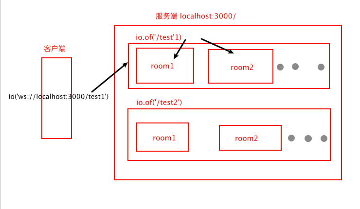

# socket.io

在 nodejs 中没有现成的 websocket 模块可以使用，但是可以使用其他人大牛写好的 websocket 库，避免重新造轮子。一些好用的 websocket 有 `socket.io`，`websocket`，`ws`等等，并且一般的 websocket 的库都提供了 前端版本的接口和后端版本的接口。其中 socket.io 可以说是龙头大哥了。

Socket.IO 服务器 (Node.js) 和 Socket.IO 客户端（浏览器、Node.js 或[其他编程语言](https://socket.io/docs/v4/#what-socketio-is)）之间的双向通道尽可能使用[WebSocket 连接](https://developer.mozilla.org/en-US/docs/Web/API/WebSocket)建立，并将使用 HTTP 长轮询作为后备.

**Socket.IO** 代码库分为两个不同的层：

- 底层管道：我们称之为**Engine.IO，Socket.IO**内部的引擎
- 高级 API：**Socket.IO** 本身

**Engine.IO**

Engine.IO 负责建立服务器和客户端之间的低级连接。它处理：

- 各种[传输](https://socket.io/docs/v4/how-it-works/#transports)和[升级机制](https://socket.io/docs/v4/how-it-works/#upgrade-mechanism)
- 断线[检测](https://socket.io/docs/v4/how-it-works/#disconnection-detection)

## 服务端创建与使用

可以基于http、http2、https创建服务。服务端创建

```js
import { createServer } from "http";
import { Server } from "socket.io";

const httpServer = createServer();
const io = new Server(httpServer, {});

io.on("connection", (socket) => {});

httpServer.listen(3000);
```

`io`代表的是服务器实例



### 服务端常用属性和方法

**服务器实例方法**

+ `io.emit(eventName,data)`，向所有客户端连接发送数据。（`io.send(data)`发送的是`message`事件）
+ `io.on(eventName,socket=>{})`，监听指定事件，socket 是客户端连接。eventName可以是
  + `connection`创建连接
  + `connect`和`connection`一致
  + `disconnect`关闭连接
  + `new_namespace` 创建新命名空间，回调函数中的参数是命名空间名
+ `io.in(rooms/socketId)`，表示去到指定的房间。可以对指定房间/客户端连接做操作，比如将room1 房间内的连接全部断掉`io.of('/test').in('room1').disconnectSockets(true)`
+ `io.to(rooms/socketId)`，和`in`一样，为后续事件发射设置一个修饰符，指定向哪个房间或连接做操作
+ `io.except(rooms)`，为后续事件发射设置一个修饰符，该事件将仅*广播*给未加入给定的客户端`rooms`。
+ `io.of(nsp)`，创建命名空间，可以用来划分不同的区域来存放不同的连接，默认的命名空间是`/`，那么客户端连接的时候就是`io('ws://example.com')`，如果是`test`，那么连接应该是`ws://example.com/test`，此时这个连接会走`io.of('/test')`就会被划分到`test`这个命名空间内。因为返回的还是一个服务器实例，所以还可以在后面接其他的操作，比如`on、、in、emit、to`等。
+ `io.socketsJoin(rooms)`，表示将客户端连接加入到知道的房间内。rooms 可以是当字符串，也可以是字符传数组。
+ `io.socketsLeave(rooms)`，表示将rooms中的客户端全部移除。
+ `io.disconnectSockets()`，表示客户端全部断开。
+ `io.close()`，表示关闭服务器
+ `io.fetchSockets()`，获取所有的客户端连接，是一个异步的方法
+ `io.allSockets()`，或者所有的sockeId，是一个异步api
+ `io.use((socket,next)=>{})`,注册使用中间件

```js
//将来源于 ws://localhost:3000/test 的连接全部都加入到房间room1
io.of('/test').socketsJoin('room1');
io.on('connection',socket=>{
  //建立连接的时候 向命名空间/test 内在 room1，room2，不在room3的客户端发送sendData事件
  io.of('/test').in('room1').to('room2').except('room3').emit('sendData','hello');
})
```


**客户端连接实例方法**

socket 连接对象中有几个比较重要的属性分别是`id`会话唯一id，`headers`请求头，`query`请求参数，`auth`鉴权数据，`rooms`当前所在的房间

比较常用的方法是

+ `socket.emit(eventName,data,cb)`，向客户端连接发送数据。（`socket.send(data)`发送的是`message`事件），cb是回调函数，可以被客户端掉用。
+ `socket.on(eventName,(...arg)=>{})`可以绑定任意事件，除此之外还有其他绑定事件的方法
  + `socket.once(eventName,(...arg)=>{})` 只会触发一次
  + `socket.onAny(eventName,(...arg)=>{})` 触发任意事件都会触发
  + `socket.prependAny(eventName,(...arg)=>{})` 会在其他事件触发之前触发
  + `socket.removeListener(eventName,(...arg)=>{})`
  + `socket.removeAllListener(eventName,(...arg)=>{})`
  + `socket.offAny(eventName,(...arg)=>{})`
+ `socket.join(rooms)`加入某个房间
+ `socket.leave(rooms)`离开某个房间
+ `socket.to(rooms)/socket.in(rooms)`进入某个房间，想房间内的连接发送数据等操作
+ `socket.except(rooms)`排除某个房间
+ `socket.timeout(num)`设置超时时间，单位：毫秒
+ `socket.disconnect(true)`断开连接
+ `socket.close()`关闭连接
+ `socket.broadcast.emit(en,data)`向除自己外的其他连接广播数据

```js
io.on('connection',socket=>{
  socket.in('room1').to('room2').except('room3').emit('hello','world');
  socket.broadcast.emit('hello','大家好')
})
```


### 客户端常用属性和方法

```html
<script src="/socket.io/socket.io.js"></script>
<script>
  const socket = io('ws://localhost:3000/test',{
    withCredentials: true,//是否应使用 cookie、授权标头或 TLS 客户端证书等凭据进行跨站点请求。
    //鉴权数据
    auth: {token: "123"},
    //查询参数
    query: {"my-key": "my-value"}
  });
</script>
```

处理直接使用`io()`来创建连接之后还可以使用`Manager`来创建，可以让我们将相同的配置写到一个manager中然后就可以使用这个Manager实例创建多个连接

```js
import { Manager } from "socket.io-client";

const manager = new Manager("https://example.com",{autoConnect:true});//autoConnect 设置为false，就需要手动调用 manager.open()/manager.connect() 来连接

const socket = manager.socket("/"); // 连接到主空间
const adminSocket = manager.socket("/admin"); // 连接到/admin
```

**Manger的几个方法**

+ `manager.socket(nsp)`,建立连接
+ `manager.open(cb)/manager.connect(cb)`,连接服务器
+ `manager.reconnection(true)`,重连
+ `manager.reconnectionAttempts(num)`,设置`reconnectionAttempts`选项
+ `manager.reconnectionDelay(num)`,设置`reconnectionDelay`选项
+ `manager.reconnectionDelayMax(num)`,设置`reconnectionDelayMax`选项
+ `manager.timeout(num)`,设置`timeout`选项

**socket 方法和属性**

+ `socket.id`,会话的唯一标识符，建立连接之后才会 有
+ `socket.connected`,是否连接到服务器
+ `socket.disconnected`,是否与服务器断开连接。
+ `socket.connect()/socket.open()`,手动连接。

socket其他方法和服务端的socket 一致，只不过在客户端没有命名空间以及房间的概念。

# socket.io实现简易聊天室

1. 安装`socket.io  express`

   ```shell
   npm i socket.io express --save
   ```

2. 构建工程目录

   ```shell
   npm init -y
   ```

3. 新建server.js

   ```js
   const express=require('express');
   const io=reqire('socket.io');
   const path=require('path');
   
   const app=express();
   
   const server=require('http').createServer(app);
   
   //存储连线
   users=[];
   connections=[];
   
   server.listen(process.env.PORT||5000,function(){
     console.log("server is running in : http://localhost:5000")
   });
   
   app.get('/',function(req,res){
     res.sendFile(path.join(__dirname,'/index.html'));
   })
   
   //监听ws连线
   io.sockets.on('connection',function(socket){
    	//将连线存储起来
     connetions.push(socket);
     console.log('连线',connetions);
     
    	//断线处理：将连线去除
     socket.on('disconnect',function(data){
       connections.splice(connections.indexOf(socket),1);
       console.log("user disconnect:%s online",connections.length)
     })
     
     //接收来自客户端的信息后，向客户端发送信息
       socket.on('send message',function(data){
         io.sockets.emit('new message',{msg:data})
       })
     
     // 用户登录
   	socket.on('new user',function(data,callback){
   		if(users.indexOf(data)!=-1){
   			callback(true);
   		}else{
   			callback(true);
   			socket.username=data;
   			users.push(data);
   			io.sockets.emit('get users',users);
   		}
   	})
   })
   ```

   注意：server 和 client 分别是 sockets 和 socket，注意一下。

4. 新建index.html文件

   ```html
   <!DOCTYPE html>
   <html>
   	<head>
   		<meta charset="utf-8">
   		<title></title>
   		<link href="https://cdn.bootcdn.net/ajax/libs/twitter-bootstrap/4.4.1/css/bootstrap.min.css" rel="stylesheet">
   		<script src="https://cdn.bootcdn.net/ajax/libs/jquery/3.5.0/jquery.min.js"></script>
   		<script src="https://cdn.bootcdn.net/ajax/libs/socket.io/2.3.0/socket.io.js"></script>
   		<style type="text/css">
   			#chatroom{
   				display: none;
   			}
   		</style>
   	</head>
   	<body>
   		<div class="container">
   			<div id="userLogin" class="row">
   				<p id="loginError"></p>
   				<div class="col-md-12">
   					<form id="userForm" action="" method="">
   						<div class="form-group">
   							<input class="form-control" type="text" name="username" id="username" value="enter username" />
   							<input class="btn btn-primary" type="submit" name="loginBtn" id="loginBtn" value="Login" />
   						</div>
   					</form>
   				</div>
   			</div>
   			
   			<div id="chatroom" class="row">
   				<div class="col-md-4">
   					<div class="jumbotron">
   						<h1>Users</h1>
   						<ul class="list-group" id="users">
   							
   						</ul>
   					</div>
   				</div>
   				<div class="col-md-8">
   					<div class="chat" id="chat">
   					</div>
   					<form action="" id="mseeageForm">
   						<div class="form-group">
   							<textarea class="form-control" id="message" placeholder="请输入内容">
   							</textarea>
   							<input type="submit" name="btn" id="btn" class="btn btn-primary" value="ENTER" />
   						</div>
   					</form>
   				</div>
   			</div>
   		</div>
   		<script type="text/javascript">
   			$(function(){
   				const socket=io.connect();
   				const messageForm=$('#mseeageForm');
   				const message=$('#message');
   				const chat=$('#chat');
   				
   				const users=$('#users')
   				const loginError=$('#loginError');
   				const userLogin=$('#userLogin');
   				const userForm=$('#userForm');
   				const username=$('#username');
   				const chatroom=$('#chatroom');
   				
   				userForm.submit(function(e){
   					e.preventDefault();
   					// 登录
   					socket.emit('new user',username.val(),function(data){
   						if(data){
   							userLogin.hide();
   							chatroom.show();
   						}else{
   							loginError.text('login error')
   						}
   					});
   					username.val('');
   				})
   				// 登录成功后接收数据
   				socket.on('get users',function(data){
   					data.forEach(item=>{
   						users.append(`<li class="list-group-item">${item}</li>`)
   					})
   				})
   				
   				messageForm.submit(function(e){
   					e.preventDefault();
   					// 发送数据
   					socket.emit('send message',message.val());
   					message.val('');
   				})
   				// 接收数据
   				socket.on('new message',function({msg,username}){
   					chat.append(`<p><b>${username}：</b>${msg}</p>`)
   				})
   			})
   		</script>
   	</body>
   </html>
   ```

   