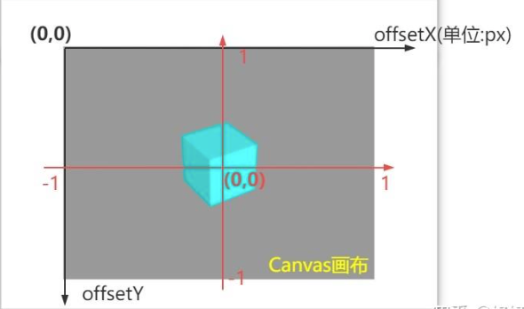

获取物体大小

```js
loader.load(path, function(gltf) {
  // 使用THREE.Box3()来获取整个模型的大小
  const box = new THREE.Box3().setFromObject(gltf.scene)
  const center = box.getCenter(new THREE.Vector3())
  const size = box.getSize(new THREE.Vector3())

  const aspect = targetSize ? new THREE.Vector3().copy(targetSize.divide(size)) : new THREE.Vector3(1, 1, 1)

  // 通过位置需要根据缩放比例进行调整
  gltf.scene.position.copy(position.sub(center).multiply(aspect))
  gltf.scene.scale.copy(aspect)
  resolve(gltf.scene)
}, undefined, function(error) {
  reject(error)
})
```

```js
geometry.computeBoundingBox();
var bb = geometry.boundingBox;
var object3DWidth  = bb.max.x - bb.min.x;
var object3DHeight = bb.max.y - bb.min.y;
var object3DDepth  = bb.max.z - bb.min.z;
```

### 坐标差异



在`threejs`中有三种坐标，屏幕坐标，世界坐标，局部坐标

#### 世界坐标

是以Sence为参照进行描述的坐标信息。是由局部坐标加上父级的变化场景：平移（position）、旋转（rotation）、缩放（scale）计算后得出。Three.js中常见的世界坐标有mesh.getWorldPosition()、THREE.Box3()、THREE.Box2()等。

#### 局部坐标（本地坐标）

是以父层级为参照进行描述的坐标信息。可以理解成在建模时，基于建模原点生成的一个坐标数据。一般，不明确指明是世界坐标，大多说的是本地坐标信息。Three.js中常见的局部坐标有：mesh。position，geometry.vertices等。

#### **屏幕坐标**

在屏幕上，对于用户的操作我们能获取的只能是屏幕坐标。在处理其与Three.js场景进行交互时，我们需要进行屏幕坐标和世界坐标的相互转化。

### 获取屏幕坐标

```js
renderer.domElement.addEventListener("click", mouseClick, false);
function mouseClick(evt){
  console.log(evt.clientX,evt.clientY);
}
```

#### 获取物体本地坐标

```js
const mesh = new THREE.Mesh(geometry, material); 
// 本地坐标
mesh.position;
```

#### 获取世界坐标

```js
const worldPosition= new Vector3();
mesh.getWorldPosition(worldPosition);
```

#### 本地坐标转世界坐标

```js
const vector = mesh.position.clone();
const worldPosition =  mesh.localToWorld( vector );
```

#### 世界坐标转本地坐标

```js
const localPosition =  mesh.worldToLocal( worldPosition );
```

#### **屏幕坐标转标准化设备坐标**

```js
function screenToNDC(px,py){
  const ndc = new THREE.Vector3();
  ndc.x = (px / canvasWidth) * 2 - 1;
  ndc.y = -(py / canvasHeight) * 2 + 1;
  ndc.z = 0.5; // 深度值，0.5 表示视锥体中间位置
  return ndc
}
```

#### 屏幕坐标转世界坐标

```js
function screenToWorld(screenX, screenY, camera，hyper_z = 0.5) {
    const vector = new THREE.Vector3();
    vector.set(
        (screenX / window.innerWidth) * 2 - 1,
        -(screenY / window.innerHeight) * 2 + 1,
        hyper_z
    );
    vector.unproject(camera);
    vector.applyMatrix4(camera.matrixWorldInverse);
    return vector;
}
```

#### 世界坐标转屏幕坐标，获取点击到的三维坐标图形，将其转化为屏幕坐标，获取其屏幕坐标的x,y值

```js
function worldToScreen(domElement, camera, worldPosition) {
  const centerX = domElement.clientWidth / 2;
  const centerY = domElement.clientHeight / 2;
  const worldVector = new THREE.Vector3(worldPosition.x, worldPosition.y, worldPosition.z);
  const standardVec = worldVector.project(camera);
  const screenX = centerX * standardVec.x + centerX;
  const screenY = -centerY * standardVec.y + centerY;
  return new THREE.Vector2(screenX, screenY);
}
```

#### 射线拾取

```js
function mouseClick(event){
  // 将鼠标坐标归一化到x:[-1,1],y:[-1,1]范围中
  mouse.x = (event.clientX / window.innerWidth) * 2 - 1
  mouse.y = -(event.clientY / window.innerHeight) * 2 + 1
  // 设置射线起点为鼠标位置，射线的方向为相机视角方向
  raycaster.setFromCamera(mouse, camera)
  // 计算射线相交
  const intersects = raycaster.intersectObjects(scene.children, true)
  if (intersects.length > 0) {
    // 选中物体
    const selectedObject = intersects[0].object
    alert(`点击了${selectedObject.name}`)
    // 改变当前被点击物体的颜色
    selectedObject.material.color.set(0xff62e258)
  } 
}
```

### 窗口变化的自适应渲染

```js
window.addEventListener('resize', onWindowResize);

// 正投影相机OrthographicCamera自适应渲染
function onWindowResize(){
  // 重置渲染器输出画布canvas尺寸
  renderer.setSize(window.innerWidth,window.innerHeight);
  // 重置相机投影的相关参数
  k = window.innerWidth/window.innerHeight;//窗口宽高比
  // s 是控制left, right, top, bottom范围大小
  camera.left = -s*k;
  camera.right = s*k;
  camera.top = s;
  camera.bottom = -s;
  camera.updateProjectionMatrix ();
};

// 透视投影相机PerspectiveCamera自适应渲染
function onWindowResize(){
  // 重置渲染器输出画布canvas尺寸
  renderer.setSize(window.innerWidth,window.innerHeight);
  // 全屏情况下：设置观察范围长宽比aspect为窗口宽高比
  camera.aspect = window.innerWidth/window.innerHeight;
  camera.updateProjectionMatrix ();
}
```


#### 模型网站

+ https://sketchfab.com
+ https://budeco.top/
+ [glTF车模定义及获取渠道（含PBR材质补充）.pdf](./Threejs/glTF车模定义及获取渠道（含PBR材质补充）.pdf)

#### 参考

+ [threejs画面拖动事件判断](https://yleave.github.io/2021/01/13/WebGL/ThreeJS/threejs%E7%94%BB%E9%9D%A2%E6%8B%96%E5%8A%A8%E4%BA%8B%E4%BB%B6%E5%88%A4%E6%96%AD/)
+ [Three.js OrbitControls：实现鼠标左键直接平移场景](https://juejin.cn/post/7525628668984098826)
+ [ThreeJS 屏幕坐标与世界坐标互转 ](https://yleave.github.io/2020/10/17/WebGL/ThreeJS/ThreeJS-%E5%B1%8F%E5%B9%95%E5%9D%90%E6%A0%87%E4%B8%8E%E4%B8%96%E7%95%8C%E5%9D%90%E6%A0%87%E4%BA%92%E8%BD%AC/)
+ [ThreeJS教程：屏幕坐标转标准设备坐标](https://zhuanlan.zhihu.com/p/635113828)
+ [Three.js物体点击交互事件全解析：从原理到实践](https://developer.baidu.com/article/detail.html?id=3953717)
+ [小程序版threejs](https://three-x.cn/)