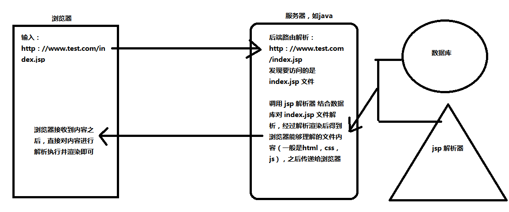

# 路由

> 路由就是通过互联网吧信息从源地址传输到目标地址的活动

路由的主要作用和功能：

+ 决定数据包从来源到目的地的路径
+ 转送将输入端的数据转移到合适的输出端

路由核心：路由表

路由表本质上是一个映射表，决定了数据包的指向。

```json
{
    "内网ip地址1":"电脑 mac 地址1",
    "内网ip地址2":"电脑 mac 地址2",
    .....
}
```


# 前端渲染和后端渲染

## 后端渲染和后端路由

> 很久以前的开发网站的技术中，前端和后端的开发是合并在一起的，一般都是有后端来独自完成网站的开发，如以往的 jsp，php 就是使用这种技术的，**他们在接收到请求的时候就会将后端的文件（java 中的 jsp 文件：包含html，css，java代码，.php文件：包含html，css，php代码）进行解析渲染成浏览器认识的文件，然后将解析渲染候的文件传递给浏览器**。其中决定请求的 url 执行的是哪个页面文件（jsp/php）的映射关系就是**后端路由**。 
>
> 传统的后端渲染，由于其开发成本比较高，而且项目耦合度高往往难以维护，所以现在很多都已经不再使用旧的后端渲染方案了，从而出现了**前后端分离开发**的模式，但是由于nodejs崛起，以及网站对seo的需求，现在也出现了新型的后端渲染技术方案。




## 前端渲染和前端路由

### 前端渲染

后端渲染是大部分的操作都是直接在后端直接完成，然后直接交给浏览器去渲染执行，而前端渲染的话，就是在服务中加多一个静态服务器（可能和后端服务器是同一个，也可以是分离开的独立服务器），静态服务器只负责将浏览器访问到的页面（如html）和页面所使用到的资源（如 图片，css，js等）直接返回，不会进行解析操作，后端服务器就只负责提供 API 获取数据。浏览器在接收到内容之后就在进行解析渲染执行（如 ajax 请求，js创建dom等）。

下面是一个前后端分离情况下，前端渲染的基本过程


### 前端路由

由于移动应用的兴起，出现了一种叫做 SPA （Single Page Application，也叫单页富应用，就是只有一张Web页面的应用，是加载单个HTML 页面并在用户与应用程序交互时动态更新该页面的Web应用程序）的技术。上面的前端渲染中一个url 对于 一个页面（也就是一份 html，css，js），这样有多少个页面可能就有多少个url，同样要访问其他的页面也需要发请求去获得另外一个页面的数据。而 SPA 则是 只有一个 页面（也就是只要一份 html，css，js），这个页面包含网站中所有需要使用的**全部页面代码资源**（里面的js不会马上全部执行。而是等到需要的时候再执行），当我们去访问其他的页面的时候就不会再发送请求去获取资源，而是通过访问的 url 如`test.com/home`来确定访问的是 home 这个页面，然后从全部页面代码资源中抽取出相关的代码直接使用，而实现这个 url 解析的功能就是**前端路由**。


### 前端路由的基本原理

我们在改变浏览器地址栏的地址的时候一般会发送一个新的请求来加载新的页面，但是在 SPA 只会发送一次请求回去全部的代码资源，之后访问网站的其他页面将不在发送请求，也就意味这即使是访问该站下的其他页面，即使地址变化了也不需要去请求了，目前可以实现这个需求的是`location.hash`和 html5 的`history.pushState()`两种方法。而 Vue-Router 也是基于这两个东西的。

#### hash 哈希模式

比如当我们在网站`www.test.com`使用`location.hash = "aaa"`时会发现地址栏的地址也会发送改变，变成`www.test.com/#aaa`，其实就是之前我们使用的锚点，是不会发送请求的。location 对象还定义了很多方法和属性给我们使用，如`location.hash`可以获得`#`后的内容，`locaition.search`可以活动url的查询参数，`location.href="https://jd.com"`跳转到京东，location对象主要是对地址栏的 url 做处理的。

#### history 模式

`history`对象是 html5 新增的一个对象，这个对象其实就是浏览器的 url 访问栈，就是使用栈结构存储了我们访问过的url（栈顶即使正在访问的 url）。使用 `history` 对象的方法也可以改变 url 但是不发送请求。

+ `history.pushState(data,title,url)`：想栈中压入一个地址，如在`www.test.com`上写入`history.pushState({},{},"sss")`地址栏将会变成`www.test.com/sss`
+ `history.replaceState(data,title,url)`：会将当前栈顶元素（也就是正在访问的 url ）替换成 指定的 url。使用该方法后也就不能放回被替换前的 url 了。
+ `history.back()`：将当前栈顶出栈，返回上一个 url，效果等同于`history.go(-1)`；
+ `history.forward()`：将上一个被出栈的 url ，重新入栈，显示下一个url，效果等同于`history.go(1)`；
+ `history.go(n)`：顺序弹出或压入 url，使用`history.go(0)`可以请求当前 url 刷新页面。

# Vue Router

> vue- router 是 Vue.js 官方的路由管理器。它和 Vue.js 的核心深度集成，让构建单页面应用变得易如反掌。
>
> vue-router 是基于路由和组件的：路由用于设置访问路径，将路径和组件映射起来；在vue-router的单页应用中，页面的路径的改变就是组件的切换。

## vue-router 的基本使用

### 安装

```shell
npm i vue-router -S
```

### 为 Vue 安装 vue-router 插件

```js
import VueRouter form "vue-router";
import Vue from "vue";

//通过 Vue.use(插件) ，安装插件
Vue.use(VueRouter);
//定义 路由-组件映射关系
const routers = [
    {
        path:"/home",//路由路径
        compoment:Home,//路由组件
        meta:{},//源数据，用来描述数据的数据（自定义数据）,
        children:[],//子路由
    }
];
// 创建 VueRouter 对象
const router = new VueRouter({
    //定义路由-组件映射关系
    routers,
})

//导出路由对象
module.exports = router;
```

### 将路由挂载到 vue 实例上

在入口文件 index.js 上

```js
import Vue from "vue";
import App from "./App.vue";
import router from "./router/router.js";

new Vue({
    render:h=>h(App),
    router,//将路由挂载到 vue 实例上
}).$mount("#app");
```

### 使用`<router-link>`定义跳转，`<router-view>`定义显示内容区域

```vue
<template>
	<div id="app">
        <router-link to="/home">首页</router-link>
        <router-link to="/news">新闻</router-link>
        <router-view></router-view>
    </div>
</template>
```

+ `<router-link>`和`<router-view>`是 vue-router 定义注册的全局组件，
+ `<router-link>`类式与 HTML 中的`<a>`负责路由的跳转，事实上`<router-link>` 默认也是渲染成`<a>`的，如果不想要渲染成`a`，可以使用**`tag`属性**自定义标签名`<router-link tag="div">`，这样就会被渲染成`<div>`。
+ `<router-view>`是作为展示容器存在，会更具变更的路由展示项对应的组件。
+ `<router-link>` 的跳转也是会被加入到浏览器的 url 历史中，如果不想要某个路由加入历史，可以使用**`replace`属性**实现`<router-link to="/home" repalce>首页</router-link>`，这个就相当于是`history.replaceState()`
+ 激活的`<router-link>`会被增加名为`router-link-active`的class，这个class 的名可以通过`<router-link> active-class="my-active"`改变，也可以在router实例里面进行全局配置

```js
const router = new VueRouter({
    linkActiveClass:"my-active"
})
```


### 重定向

上面的在第一次打开的时候会出现空白的情况，因为没有点击标签，路由指向的是`/`，但是路由映射中并没有哪个组件映射到这个路由。需要使用**重定向（redirect）**来使`/`指向到`/home`。

```js
const reouters = [
    {path:"/",redirect:"/home"},
    {path:"/home",compoment:Home}
]
```


### 路由模式

vue-router 默认使用的路由模式是 hash 模式。所以在`www.test.com/#/`（#/ 是首页）上点击`首页`标签的时候路由将会变成`www.test.com/#/home`，并且查看元素会发现`<router-link to="/home">首页</router-link>`被渲染成`<a href="#/home">首页</a>`。

如果需要改变路由模式就需要在路由的配置中定义模式

```js
const router = new VueRouter({
    //定义路由-组件映射关系
    routers,
    mode:"history",//定义模式
})
```


### 编程式导航

处理使用`<router-link>`进行修改路由跳转之外，还可以使用代码进行修改。通过代码修改路由的方式就是**编程式导航**

`$router`里面主要的跳转方法有`push`和`replace`，`$router.push`相当于是`history.pushSatate`，`$router.replace`相当于是`history.replaceSatate`.

```vue
<template>
	<div id="app">
        <button @click="toPath1">首页</button>
        <button @click="toPath2">新闻</button>
        <router-view></router-view>
    </div>
</template>

<script>
	export defalut {
        methods:{
            toPath1(){
                this.$router.push("/home");
            },
            toPath2(){
                this.$router.replace("/news");
            },
        }
    }
</script>
```

#### `$router`和`$route`

vue-router 在组成的时候为vue 提供了一个`$router`和`$route`属性，`$router`里面包含 vue-router 的一些跳转方法，`$route`里面包含跳转的路由参数。

> `$router`即使路由的实例对象，`$route`当前激活状态的完整的路由映射配置对象。

`$route`里的常用属性

| 属性名                  | 说明                                                         |
| ----------------------- | ------------------------------------------------------------ |
| `$route.path`           | 当前路由的名字(一般为#后面的部分,但不包含query查询值)，`http://example.com/#/login?name=aa`，`this.$route.path;`输出 `/login` |
| `$route.query`          | 可访问携带的查询参数                                         |
| `$route.params`         | 路由转跳携带参数                                             |
| `$route.hash`           | 当前路径的哈希值，带#                                        |
| `$route.fullPath`       | 完整的路径值。`http://example.com/#/login?name=aa`，`this.$toute.fullPath;`  输出`/login?name=aa` |
| `$route.name`           | 命名路由的                                                   |
| `$route.matched`        | 当前路由下路由声明的所有信息，包括子路由（也就是将深层路由对象拉平为一维的数组），从父路由(如果有)到当前路由为止 |
| `$route.redirectedFrom` | 重定向来源。如：`{ path: '*',redirect: {name: 'hello'}}`，此时访问不存在的路由 http://example.com/#/a 会重定向到hello。在hello访问`this.$route.redirectedFrom;`   输出“/a” |


### 动态路由

简单来说动态路由就是在路由上添加参数，并一同传递给一个页面。比如要个给`/user`页面传递一个参数`1`就可以这样写`/user/1`，这个1是可以动态变化的所以就是动态路由。

在 vue-router 中配置动态路由

```js
const routers = [
    {
        path:"/user/:id",
        component:User,
    }
]
```

使用`<router-link to="/user/1">用户1</router-link>`，点击跳转后到 user 路由组件页面可以使用`$route.params.id`接收参数


### 路由懒加载

> 当打包构建应用时，JavaScript 包会变得非常大，影响页面加载。如果我们能把不同路由对应的组件分割成不同的代码块，然后当路由被访问的时候才加载对应组件，这样就更加高效了。

SPA 是一次性加载全部的代码资源文件的，但是如果代码资源文件（js）很到的时候，加载的时候可能会很长，导致用户页面白屏事件长的问题，为了解决这个问题就需要使用到路由懒加载（在第一次请求资源的是偶只返回必要的资源，其余资源在使用到的时候在请求）。

**路由懒加载作用**

+ 将路由对应的组件打包成一个个的 js 代码块
+ 访问到路由的时候才加载对应的文件

```js
const routers = [
    {
        path:"/user/:id",
        component:() => import("../view/User"),
    }
]
```

> **早期路由懒加载的实现方式**
>
> Vue 异步组件结合 webpack 代码分析
>
> ```js
> const Home = resolve => { require.ensure(['../view/Home.vue'],()=>{resolve(require('../view/Home.vue')})}
> ```
>
> AMD 写法
>
> ```js
> const Home = resolve => require(['../view/Home.vue'],resolve);
> ```
>
> ES6 写法
>
> ```js
> const Home = () => import("../view/Home.vue");
> ```


### 嵌套路由

**常见功能需求**

+ 访问`/home`时显示 home 页面，然后访问`home/news`和`home/message`时分别显示 home 页面下的 news 组件页面和 message 组件页面
+ 一个路由映射一个组件，访问这两个路径也会分别渲染两个组件

App.vue

```vue
<template>
	<div id="app">
        <router-view></router-view>
    </div>
</template>
```

Home.vue

```vue
<template>
	<div>
        <router-link to="/home/news">news</router-link>
        <router-link to="/home/message">message</router-link>
        <router-view></router-view>
    </div>
</template>
```

News.vue 和 Message.vue

```vue
<template>
	<h2>News</h2>
</template>
<!--------------------------->
<template>
	<h2>Message</h2>
</template>
```

路由映射配置

```js
const routers = [
    {
        path:"/",
        redirect:"/home"
    },
    {
        path:"/home",
        component:()=>import("../view/Home"),
        children:[
        	{path:"",redirect:"news"},// 当访问的是 /home 时重定向到 /home/news
            {path:"news",name:"news",component:()=>import("../view/News")},
            {path:"message",component:()=>import("../view/Message")},
        ]
    }
]
```


### 参数传递

使用动态路由可以传递简单的参数，但是用来传递复杂的参数（数组，对象等）时就不太合适了。在 vue-router 中除了使用动态路由传递参数之外还可以使用`params`(类似post)和`query`(类似get)进行传参（动态路由也是params的一种）。

#### 使用 `query` 进行传参

普通方式

```html
<router-link :to="/home/news?name=jack&age=18">news</router-link>
<router-link :to="{path:'/home/news',query:{name:'jack',age:18}}">news</router-link>
<router-link :to="{name:'news',query:{name:'jack',age:18}}">news</router-link>
```

编程方式

```js
this.$router({path:'/home/news',query:{name:'jack',age:18}});
this.$router({name:'news',query:{name:'jack',age:18}});
```

query 参数会被拼接成查询参数，拼接到 url 上 `http://www.test.com/#/home/news?name=jack&age=18`；同时也不用再想配置动态路由那样配置路由映射。

接收

```js
this.$route.query.name;
this.$route.query.age;
```


#### 使用 `params` 进行传参

配置路由

```js
const routers = [
    {
        path:"/home",
        component:()=>import("../view/Home"),
        children:[
            {path:"news/:name/:age",name:"news",component:()=>import("../view/News")},
        ]
    }
]
```

普通方式

```html
<router-link :to="/home/news/jack/18">news</router-link>
<router-link :to="{name:'news',params:{name:'jack',age:18}}">news</router-link>
```

编程方式

```js
this.$router({name:'news',params:{name:'jack',age:18}});
```

接收

```js
this.$route.params.name;
this.$route.params.age;
```

**注意**：使用params传参只能用name来引入路由，即push里面只能是name:’xxxx’,不能是path:’/xxx’,因为params只能用name来引入路由


### 导航守卫

导航守卫 就是监听路由跳转的过程，是从哪个路由跳转到那个路由的。导航守卫一般用作与页面跳转管理，比如说是在希望访问`/User`时必须是登录的状态。也可用来设置 页面`<title>`。

#### 全局导航守卫

全局导航守卫 是定义在 vue-router 实例上的，在 router.js 上

```js
// 全局前置导航守卫，跳转前执行
router.beforEach((to,from,next)=>{})
// 全局后置导航守卫，跳转后执行
router.afterEach((to,from)=>{})
```

+ `to`,是 $route,要跳转的目标路由映射配置对象
+ `from`,是 $route,当前导航正要离开的路由映射配置对象
+ `next`,是一个方法，类式与`$router.push`，用来控制跳转

#### 路由独享守卫

```js
const routes = [
    {
        path: "/login",
        name: "Login1",//命名路由 使用时：router-link :to="{name:'Login1'}"
        component: Login,
        beforeEnter:(to,from,next)=>{//路由独享守卫  进入路由时触发
            console.log("beforeEnter");
            next()
        }
    }
]
```

#### 组件内的守卫

```js
const Foo = {
  template: `...`,
  beforeRouteEnter (to, from, next) {
    // 在渲染该组件的对应路由被 confirm 前调用
    // 不！能！获取组件实例 `this`
    // 因为当守卫执行前，组件实例还没被创建
  },
  beforeRouteUpdate (to, from, next) {
    // 在当前路由改变，但是该组件被复用时调用
    // 举例来说，对于一个带有动态参数的路径 /foo/:id，在 /foo/1 和 /foo/2 之间跳转的时候，
    // 由于会渲染同样的 Foo 组件，因此组件实例会被复用。而这个钩子就会在这个情况下被调用。
    // 可以访问组件实例 `this`
  },
  beforeRouteLeave (to, from, next) {
    // 导航离开该组件的对应路由时调用
    // 可以访问组件实例 `this`
  }
}
```

`beforeRouteEnter`守卫不能访问this，因为守卫在导航确认前被调用，因此即将登场的新组件还没被创造。不过，可以通过传一个替换给next来访问组件实例。在导航被确认的时候执行替换，并且把组件实例作为替代方法的参数。

```js
beforeRouteEnter (to, from, next) {
  next(vm => {
    // 通过 `vm` 访问组件实例
  })
}
```


### addRoutes 动态添加路由规则

在前端进行路由鉴权的时候经常会使用到，比如在后台管理系统中的侧边栏需要根据不同角色的不同权限显示不同的侧边栏选项，一般后端会在用户登录到系统的时候将用户接访问的路由数组返回，这时候就需要使用到 `router.addRoutes(规则数组)`方法来将新的路由规则添加上去（也可以使用`router.addRoute(单条规则)`添加）。如果需要将路由规则添加为某个路由的子路由可以这样

```js
router.addRoute(parentName: string, route: RouteConfig)
```

添加一条新的路由规则记录作为现有路由的子路由。如果该路由规则有 `name`，并且已经存在一个与之相同的名字，则会覆盖它。

> 有时候可能会有这样的需求：在后台系统中切换角色后，路由和菜单都发生变化；这样的需求只通过上面添加路由的方法是实现不了的，因为我们需要在添加新路由之前将之前的路由规则都清空掉留下初始的路由规则，但是vue-router并没有给我们提供清除路由的方法。
>
> 我们可以通过过修改`router`实例的`matcher`来实现，因为`router.matcher`保存着注册的路由信息，我们只需要对这个属性进行操作即可
>
> ```js
> const createRouter = new Router({
>     scrollBehavior:()=>({y:0}),
>     routes:constantRouters,//不需要权限的路由
> })
> 
> const router = createRouter();
> 
> export function resetRouter(){
>     let newRouter = createRouter();
>    	router.matcher = newRouter.matcher;
> }
> 
> export default router;
> ```


### `<keep-alive>`缓存组件

从一个路由跳转到另一个路由的时候，会先将当前的路由组件销毁掉，然后再创建新的路由组件。如果路由切换得比较频繁这样做就会非常消耗资源。vue 中提供了用来缓存组件的`<keep-alive>`组件，来解决这个问题。

```vue
<template>
	<div>
        <keep-alive>
        	<router-view></router-view>
        </keep-alive>
    </div>
</template>
```

使用`<keep-alive>`包裹的路由容器`<router-view>`里面的 路由组件 可以使用`activated`和`disactivated`，两个钩子函数。

+ `activated`：在被路由组件被激活的时候执行
+ `disactivated`：跳转路由后执行。

#### include 和 exclude

`<router-view>` 也是一个组件，如果直接被包裹在`<keep-alive>`里面的话，所有的路径匹配到的路由组件都会被缓存，这时如果有些路由组价不希望被缓存，就可以使用`exclude`属性来排除缓存，`include`是定义必须要缓存的组件（一般不用）。

用法：`exclude="comp1,comp2"`。comp1，comp2 是组件的 name 属性值

```vue
<template>
	<h2>comp1</h2>
</template>

<script>
export default {
    name:"comp1",
}
</script>
```

```vue
<template>
	<div>
        <keep-alive exclude="comp1">
        	<router-view></router-view>
        </keep-alive>
    </div>
</template>
```


## 多次跳转同一路由报错

<font color="red">vue路由跳转报错Avoided redundant navigation to current location: “/xxxxxx“.</font>


>**问题出现原因**：`重复路由跳转`，比如说当前路由是商品详情页面`/goodsDetail`，但是点击按钮进行`this.$router.push`操作，要跳转的还是商品详情页面`/goodsDetail`。

### 解决方法

1. 升级vue-router版本为3.0即可解决，项目目录下运行命令：

```shel
npm i vue-router@3.0 -S
```

2. 修改VueRouter原型对象上的push方法，在router文件夹下的index.js中加入如下代码：

```js
import Vue from 'vue'
import VueRouter from 'vue-router'

Vue.use(VueRouter);
//获取原型对象上的push函数
const originalPush = VueRouter.prototype.push
//修改原型对象中的push方法
VueRouter.prototype.push = function push(location) {
  return originalPush.call(this, location).catch(err => err);
}
const routes = []
const router = new VueRouter({
  routes,
  mode:"history",
})
export default router
```


参考：https://blog.csdn.net/weixin_43242112/article/details/107595460

