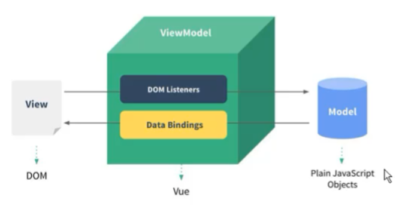
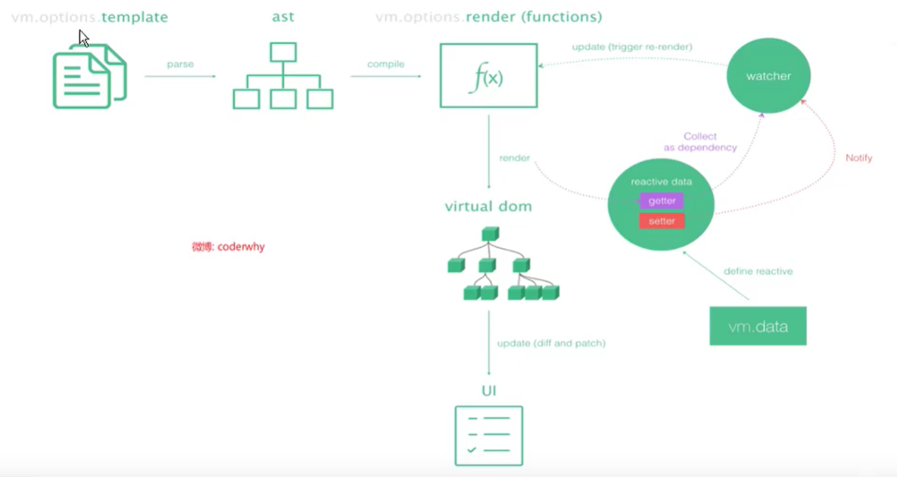
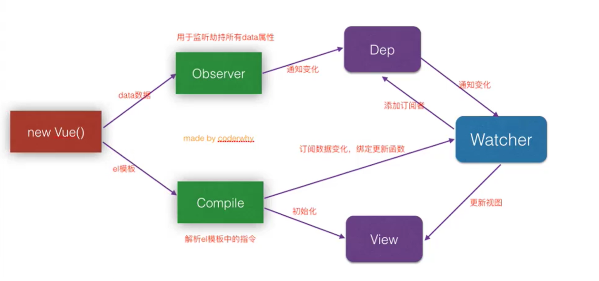
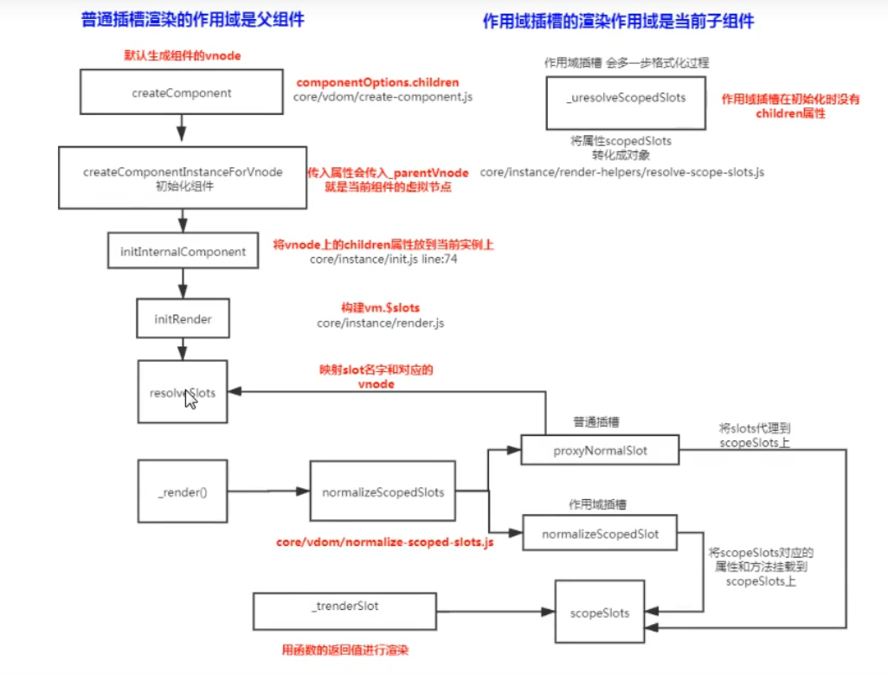

# VUE2基础

是一套用于构建用户界面的**渐进式框架**。与其它大型框架不同的是，Vue 被设计为可以自底向上逐层应用。Vue 的核心库只关注视图层，不仅易于上手，还便于与第三方库或既有项目整合。另一方面，当与[现代化的工具链](https://cn.vuejs.org/v2/guide/single-file-components.html)以及各种[支持类库](https://github.com/vuejs/awesome-vue#libraries--plugins)结合使用时，Vue 也完全能够为复杂的单页应用提供驱动。

以往我们通过dom获取到HTML元素或者使用js生成html的元素，然后再对这个元素进行操作的方式叫做编程式渲染，但是vue使用的是声明式的渲染后，及将页面和逻辑操作分开，页面只需要负责页面结构表现即可，逻辑操作只需负责数据的操作就好不再需要关心页面的事情。这种声明式渲染将使得项目更加易于管理。

## VUE中的MVVM



M:模型层（主要负责业务数据相关）

1. 视图层

2. 数据可能是我们固定的死数据，更多的是来自我们服务器，从网络上请求下来的数据。

	（可以理解为vue中的data）

V:视图层（负责视图相关，细分下来就是html+css层）

1. 前端开发中通常是DOM层
2. 主要作用是给用户展示各种信息

VM:视图模型层（负责监听M或者V的修改，是实现MVVM双向绑定的要点）

1. 是view和model沟通的桥梁

2. 一方面它实现了Data Binding（数据绑定）,将model的改变实时反应到了View中

3. 另一方面它实现了DOM listener，也就是DOM监听，当DOM发生一些事情，比如点击、滚动、touch等时，可以监听到，并在需要的情况下改变对应的Data。

	（可以理解为vue实例，当有DOM中数据变化是vue实例会解析DOM中vue的指令等进而响应到data中）

[MVC，MVP 和 MVVM 的图示](http://www.ruanyifeng.com/blog/2015/02/mvcmvp_mvvm.html)

[理解VUE双向数据绑定原理和实现](https://www.jianshu.com/p/e7ebb1500613)

[vue核心之虚拟DOM(vdom)](https://www.jianshu.com/p/af0b398602bc)


## Vue生命周期函数


[详解vue生命周期](https://segmentfault.com/a/1190000011381906)


## 安装及基本使用

使用 CDN 或者直接引入脚本的形式，Vue 是作为 一个类被引入的，在实例化的时候需要传入一个 options 对象。

```
options 常用的属性
{
    el:"#app",                 要管理的容器对象，可以是选择器或dom
    template:"#temp",           要使用的模板，在定义组件的时候使用，可以是html字符串，或者选择器
    data:{message:"h"},        定义数据
    components:{"list":list},  注册组件
    methods:{},                注册事件
}
```


### 创建vue 实例

```html
<!DOCTYPE html>
<html>
	<head>
		<meta charset="utf-8">
		<title></title>
	</head>
	<body>
		<div id="app">
			{{message}}
		</div>
		<script src="https://cdn.bootcdn.net/ajax/libs/vue/2.6.14/vue.js"></script>
		<script type="text/javascript">
			let app = new Vue({
				el:"#app",
				data:{
					message:"hello world"
				}
			})
		</script>
	</body>
</html>
```

### 定义组件（template 方式）

```html
<!DOCTYPE html>
<html>
	<head>
		<meta charset="utf-8">
		<title></title>
	</head>
	<body>
		<div id="app">
			{{message}}
		</div>
		<script src="https://cdn.bootcdn.net/ajax/libs/vue/2.6.14/vue.js"></script>
		<script type="text/javascript">
			let app = new Vue({
				el:"#app",
				data:{
					message:"hello world"
				}
			})
		</script>
	</body>
</html>
```

### v-bind:属性，给属性绑定变量值，样式绑定

如果想要为元素的属性绑定变量可以使用 `v-bind` 进行绑定，这个特别常用，特别是在绑定class 和 style 的时候。还有就是 v-bind 绑定的数据中可以做一些简单的运算。

在vue中有

```js
let app = new Vue({
    el:"#app",
    data:{
        message:"hello world",
        imgSrc:"https://picsum.photos/300/200",
        isShowRed:true,
        addGreen:"green",
        baseStyle1:{fontSize:"50px"},
        baseStyle2:{color:"red"},
    }
})
```

绑定数据

```html


<!--class 绑定对象类型样式-->
<div :class="{'red':isShowRed,'green':false,'yellow':isShowRed==1}">hello</div>

<!--class 绑定数组类型样式-->
<div :style="['red',addGreen,isShowRed==1?'yellow':'']">hello</div>

<!--style 绑定对象类型样式-->
<div :style="{fontSize:'30px',color:'red'}">hello</div>
<!--style 绑定数组类型样式-->
<div :style="[baseStyle1,baseStyle2]">hello</div>
```

当 v-bind:style 使用需要添加浏览器引擎前缀的 CSS property 时，如 transform，Vue.js 会自动侦测并添加相应的前缀。当为组件绑定class的时候，将会把绑定的class属性名追加到组件的根元素中，并不会覆盖。

> 如果我们需要将父组件的props、属性或者一个对象的数据数据统统都绑定到DOM或者子组件上可以直接使用`v-bind=obj`的方式实现
>
> ```vue
> <div v-bind="{id:idName,title:'ssss'}"></div>
> <!--相当于是 <div :id="idName" :title="'ssss'"}"></div>   -->
> 
> <child-comp v-bind="$props"></child-comp><!--向子组件传递自身全部props -->
> <child-comp v-bind="$attrs"></child-comp><!--向子组件传递自身全部attrs -->
> ```
>
> 还可以使用`v-on="$listeners"`向子组件传递自身上的方法


### 计算属性 computed

当我们需要将一些数据经过处理之后才显示的话，可以使用函数或者计算属性来实现，**函数的写法并不美观，而且还比较耗费性能**，所以一般都是使用计算属性的。

计算属性相当于是一个对象中的 getter ，可以让我们以访问属性的方式调用函数，而且在vue 中 计算属性所依赖的数据发生变化之后计算属性也会更新（**而且当多次调用的时候如果*依赖的属性*没有变化的话就会使用缓存值而不会在计算**），实现即时响应。

```js
let app = new Vue({
    el:"#app",
    data:{
        firstName:"jack",
        lastName:"lanmao"
    },
    computed:{
        fullName:function(){
            return this.firstName + this.lastName;
        },
        // fullName:{
        //     get:function(){
        //         return this.firstName + this.lastName;
        //     },
        //     set:function(val){
        //         console.log("不能设置",val)
        //     }
        // }
    }
})
```

```html
<div>{{fullName}}</div>
```

**需要注意的是在给数组或者对象设置计算属性的时候需要使用能被vue检测的修改形式设置**

```js
computed: {
  now: function () {
    return Date.now()
  },//计算一次后不再更新
  cmpArr1:function(){
    return this.arr[0];
  },//this.arr[0]=5时，计算一次后不再更新
  cmpArr2:function(){
    return this.arr;
  },//this.arr[0]=5时，会计算
}
```


### 侦听器 watch

侦听器watch，可以监听数据的变化，也可以监听计算属性的变化。

```html
<div id="watch-example">
  <p>
    Ask a yes/no question:
    <input v-model="question">
  </p>
  <p>{{ answer }}</p>
</div>
```

```js
var watchExampleVM = new Vue({
    el: '#watch-example',
    data: {
        question: '',
        answer: 'I cannot give you an answer until you ask a question!',
        a:{
            b:{
                c:1
            }
        }
    },
    watch: {
        // 如果 `question` 发生改变，这个函数就会运行
        question: function (newQuestion, oldQuestion) {
            this.answer = 'Waiting for you to stop typing...'
        },
        // 对深层对象 进行监听
        "a.b.c":function(oldVal,newVal){
            this.answer = "c change";
        },
        // 或者可以使用 对象配置形式设置，
        a:{
            deep:true,
            handle(newVal,oldVal){
                
            }
        }
    }
})
```

使用 `watch` ，允许我们执行异步操作 (访问一个 API)，限制我们执行该操作的频率，并在我们得到最终结果前，设置中间状态。这些都是计算属性无法做到的。


### 计算属性和侦听器的区别

**计算属性computed :** 

1. 支持缓存，只有依赖数据发生改变，才会重新进行计算
2. 不支持异步，当computed内有异步操作时无效，无法监听数据的变化
3. computed 属性值会默认走缓存，计算属性是基于它们的响应式依赖进行缓存的，也就是基于data中声明过或者父组件传递的props中的数据通过计算得到的值
4. 如果一个属性是由其他属性计算而来的，这个属性依赖其他属性，是一个多对一或者一对一，一般用computed
5. 如果computed属性属性值是函数，那么默认会走get方法；函数的返回值就是属性的属性值；在computed中的，属性都有一个get和一个set方法，当数据变化时，调用set方法。

**侦听属性watch：**

1. 不支持缓存，数据变，直接会触发相应的操作；
	2.watch支持异步；
	3.监听的函数接收两个参数，第一个参数是最新的值；第二个参数是输入之前的值；
2. 当一个属性发生变化时，需要执行对应的操作；一对多；
3. 监听数据必须是data中声明过或者父组件传递过来的props中的数据，当数据变化时，触发其他操作，函数有两个参数。
	1. immediate：组件加载立即触发回调函数执行，
	2. deep: 深度监听，为了发现对象内部值的变化，复杂类型的数据时使用，例如数组中的对象内容的改变，注意监听数组的变动不需要这么做。注意：deep无法监听到数组的变动和对象的新增，参考vue数组变异,只有以响应式的方式触发才会被监听到。


### v-on:事件名，绑定事件

#### 关于传递参数

在vue中可以使用`v-on`进行事件绑定，简写为`@`；当需要使用传递参数的时候可以直接在按正常的函数传参方式传递`@click="say('hello')"`，那么传入的参数就是hello，如果不传的话`@click="say"`，那个参数为事件对象`event`；那么如果想要在其他的参数位置传入事件对象的话可以使用`$event`传入；`@click="say('hello',$event)"`;

#### **事件修饰符**

一般的事件修饰符有

```
@click.stop				阻止事件冒泡，e.stopPropagation()
@click.noce				只会触发一次
@click.self				当点击的是当前元素的时候才触发，不会被事件冒泡触发
@click.capture			设置为事件捕获阶段触发
@click.prevent			阻止默认行为，如e.preventDefault()
@click.native			使用组件原来的事件，一般用于组件上

对于键盘的修饰符
@keyUp.keyCode;   keyCode可以是键盘按键的键（id），也可以是vue定义好的一下键名，如enter，esc等。
```


### v-if、v-show 条件渲染

v-if 和 v-show 都可以控制元素的显示与隐藏，他们的不同之处在于，v-if 为 false 时vue不会渲染后这样元素，并且在页面上也不会有这个元素，而且当 v-if 为 true 变为 false 的时候vue就将这个元素从页面上移除，而v-show 则是相当于是将元素的 display 设置为 none。

**当 v-if 与 v-for 一起使用时，v-for 具有比 v-if 更高的优先级。**

### v-for 遍历显示

v-for 可以用来遍历数组，也可以用来遍历对象，不过一定要注意使用 key 搭配只使用，不然可能会出现一些出乎意料的情况。

```html
<--渲染数组--!>
<li v-for="(item,index) in arr"></li>
<--渲染整数--!>
<li v-for="n in 10"></li>
<--渲染对象--!>
<li v-for="(val,key,index) in obj"></li>
<--渲染计算属性，适用于检测数组的变化--!>
<li v-for="(val,key,index) in evenNumbers"></li>
<--渲染函数，适用于嵌套循环的时候--!>
<li v-for="(set,key1,index1) in sets">
	<li v-for="(n,key2,index2) in even(set)"></li>
</li>

<script>
let vm=new Vue({
  data: {
  numbers: [ 1, 2, 3, 4, 5 ],
  sets: [[ 1, 2, 3, 4, 5 ], [6, 7, 8, 9, 10]]
},
methods: {
  even: function (numbers) {
    return numbers.filter(function (number) {
      return number % 2 === 0
    })
  }
},
computed: {
  evenNumbers: function () {
    return this.numbers.filter(function (number) {
      return number % 2 === 0
    })
  }
}
})
</script>
```

### **key属性**

Vue 会尽可能高效地渲染元素，通常会复用已有元素而不是从头开始渲染。这么做除了使 Vue 变得非常快之外，还有其它一些好处。例如，如果你允许用户在不同的登录方式之间切换：

```html
<template v-if="loginType === 'username'">
  <label>Username</label>
  <input placeholder="Enter your username">
</template>
<template v-else>
  <label>Email</label>
  <input placeholder="Enter your email address">
</template>
```

那么在上面的代码中切换 loginType 将不会清除用户已经输入的内容。因为两个模板使用了相同的元素，对于vue来说这两个input标签并没有位置、标签的变化，因此vue的diff算法会认为这个input标签并没有改变，vue将默认复用这个input，所以`<input>` 不会被替换掉——仅仅是替换了它的 placeholder等属性。当我们给对应的input加上`key`之后就再次点击切换按钮input就会被替换掉，key的作用就是告诉vue这个不要复用这个标签需要重新渲染。在做动画过度切换页面的元素的时候也需要尽可能的加上key属性。

[vue中：key的作用](https://www.jianshu.com/p/0044532e4a93)

[Vue2.0 v-for 中 :key 到底有什么用？](https://www.zhihu.com/question/61064119/answer/766607894)


### 过滤器 filters 

过滤器可以用来对页面中要显示的数据进行再处理，比如格式化时间、给价格加上单位等。

```html
<div id="app">
    {{time|formatTime}}
</div>
```

```js
let app = new Vue({
    el:"#app",
    data:{
        time:Date.now(),
    },
    filters:{
        formatTime(val){
            let date = new Date(val)
            return date.toLocaleDateString();
        }
    }
})
```

数据与过滤函数之间通过`|`进行划分，同时还可以定义多个过滤器，过滤器与过滤器之间也是通过`|`进行划分，上一个过滤器的结果将作为数据传递到下一个过滤器中

```html
<div id="app">
    {{time|formatTime|addStr}}
</div>
```

```js
let app = new Vue({
    el:"#app",
    data:{
        time:Date.now(),
    },
    filters:{
        formatTime(val){
            let date = new Date(val)
            return date.toLocaleDateString();
        },
        addStr(val){
            return val + "china";
        }
    }
})
```

### v-model 双向数据绑定

在 HTML 中和用户进行交互最频繁的元素莫过于是 输入框了，在以往如果我们要获取用户的输入就需要先获取到input元素，然后后在获取元素的值，如果我们需要将自己的值反馈到input同样也是需要以上步骤的，这样的比较麻烦，在 vue 中可以使用 v-model 指令来绑定 input 的值，这样当输入框的值发生变化的时候就会直接反映到数据上，而且在代码上修改的值也可以马上反映到输入框上。

```html
输入框绑定的值是 value
<input type="text" v-model="inputVal" /> 

单选框绑定的是 value
<input type="radio" v-model="radioVal" value="man"/> 
<input type="radio" v-model="radioVal" value="women"/> 

当只有一个时，绑定的是 selected
<input type="checkbox" v-model="sigleCheckboxVal" /> 
当有多个时绑定的是value，并且会将选中的值将入到数组中
<input type="checkbox" v-model="checkboxVal" value="1"/> 
<input type="checkbox" v-model="checkboxVal" value="1" /> 

单选列表绑定的是value，值等于选中的 option 的 value
<select name="list" v-model="selectItem">
    <option value="1">1</option>
    <option value="2">2</option>
    <option value="3">3</option>
    <option value="4">4</option>
</select>
多选列表绑定的是value，值等于选中的 option 的 value 的数组
<select name="list" v-model="selectItems" multiple>
    <option value="1">1</option>
    <option value="2">2</option>
    <option value="3">3</option>
    <option value="4">4</option>
</select>

输入单选列表绑定的是value
<input list="browsers" v-model="browsers" />
<datalist id="browsers">
    <option value="Internet Explorer">
    <option value="Firefox">
    <option value="Chrome">
    <option value="Opera">
    <option value="Safari">
</datalist>
```

```js
let app = new Vue({
    el:"#app",
    data:{
        inputVal:"hello world",
        radioVal:"",
        sigleCheckboxVal:false,
        checkboxVal:[],
        selectItem:"",
        selectItems:[],
        browsers:"",
    }
})
```

其实在vue 中的v-model其实就是`:value`和`@input`事件的集合，在组件开发的时候我们通常是自定义`v-model`已满足自己的需求。

#### 修饰符

在 v-model 中有几个修饰符对 input 绑定的数据做前置处理，比如`lazy`，`number`，`trim`

+ `v-model.lazy`：当失去焦点、值变化的时候才同步数据
+ `v-model.number`：将输入的值进行number转化
+ `v-model.trim`：将输入的值的空格去掉


### 常用的指令

+ `v-once`：定义元素只渲染一次
+ `v-bind:src="msg" | :src="msg"`：绑定数据
+ `v-on:click="clickHandle" | @click="clickHandle"`：绑定事件
+ `v-show="flag"`：控制元素是否显示
+ `v-if="flag"`：条件判断
+ `v-else`：和`v-if`并用，为反向条件
+ `v-else-if="flag"`：和`v-if`并用，为其他条件
+ `v-for="item in arr"`：遍历循环
+ `v-html="<i>ss</i>"`：以html方式将字符串插入到元素中
+ `v-text="<i>ss</i>"`：以文本方式将字符串插入到元素中
+ `v-pre="<i>s  s</i>"`：以文本方式将字符串原封不动地插入到元素中
+ `v-model="msg"`：绑定响应式数据
+ `v-cloak`：这个属性在vue解析之前，是存在的，在vue解析之后就会被移除掉，所以可以利用这个属性来控制元素在vue解析好之后才显示出来，避免用户看到一些内容源代码`{{message}}`。可以在style中添加一个属性选择器`[v-cloak]{display:none}`。

[自定义指令](https://cn.vuejs.org/v2/guide/custom-directive.html#ad)


### 组件化

组件化思想是一种将复杂问题简单化的设计，一个复杂的页面可以将切割成一个个比较简单的小模块，然后进行拼接组装成完整的页面使用，而且如果其他的页面也需要使用到这组件的话就可以直接引入使用无需重新定义了，在vue 中定义组件有两个步骤，分别是

+ `Vue.extend()`：定义组件的构造器
+ `Vue.component()`：注册组件

`Vue.component()`是为将组件注册成全局组件，一般我们都是将组件注册成局部组件的，可以使用options中的`components：{"my-comp1":comp1}`注册。

对于组件，你可以将它理解成是一个微型的vue，在vue 的 options 在组件中同样可以使用，但是有些需要注意的问题是

+ 组件中的 data 必须是一个函数，并返回一个对象。保持组件数据独立，避免多次使用的时候数据紊乱
+ 组件的注册名不能有大写字母，因为 html 标签是不区分大小写的

```html
<div id="app">
    <my-comp1></my-comp1>
    <my-comp2></my-comp2>
</div>

<template id="comp2">
	<div style="color:red">world</div>
</template>
```

```js
let app = new Vue({
    el:"#app"
})
let comp1 = Vue.extend({
    template:'<div style="color:green">{{msg}} </div>',
    data(){
        return {msg:"hello "}
    }
})
Vue.component("my-comp1",comp1);
Vue.component("my-comp2",{
    template:'#comp2'
});
```


#### template 和 el 的关系

```js
let app = new Vue({
    el:"#app",
    template:'<div style="color:green">{{msg}} </div>',
})
```

当template 和 el同时存在的时候，vue 会使用 template 的内容替换掉 el 容器。


### 通过 ref  获取元素

在vue中尽量不要用以前的`getElementById()`等原生的方式获取 Dom 元素，可以使用`ref="test"`设置（相等于是 id），用`this.$refs.test`来回去。

> 当 `ref` 定义在组件上`this.$refs`获取到的就是组件对象，当定义在dom元素上时获取到的就是DOM对象。每个组件上都有一个`this.$el`属性，这个属性就是当前组件的DOM，所以可以使用1`this.$refs.test.$el`获取组件的dom对象


### 动态组件  `is`

有的时候，在不同组件之间进行动态切换是非常有用的，可以使用`v-if`或者`v-show`实现，也可以使用`is`属性实现，`is`属性定义当前元素要以哪个组件进行渲染

```vue
<!-- 组件会在 `currentTabComponent` 改变时改变 -->
<component v-bind:is="currentTabComponent"></component>
```

`currentTabComponent` 可以包括**已注册的组件的名字，或者是组件的选项对象**。比如vue官网实例

```html
<!DOCTYPE html>
<html>
  <head>
    <title>Dynamic Components Example</title>
    <script src="https://unpkg.com/vue"></script>
    <style>
      .tab-button {
        padding: 6px 10px;
        border-top-left-radius: 3px;
        border-top-right-radius: 3px;
        border: 1px solid #ccc;
        cursor: pointer;
        background: #f0f0f0;
        margin-bottom: -1px;
        margin-right: -1px;
      }
      .tab-button:hover {
        background: #e0e0e0;
      }
      .tab-button.active {
        background: #e0e0e0;
      }
      .tab {
        border: 1px solid #ccc;
        padding: 10px;
      }
    </style>
  </head>
  <body>
    <div id="dynamic-component-demo" class="demo">
      <button
        v-for="tab in tabs"
        v-bind:key="tab"
        v-bind:class="['tab-button', { active: currentTab === tab }]"
        v-on:click="currentTab = tab"
      >
        {{ tab }}
      </button>

      <component v-bind:is="currentTabComponent" class="tab"></component>
    </div>

    <script>
      Vue.component("tab-home", {
        template: "<div>Home component</div>"
      });
      Vue.component("tab-posts", {
        template: "<div>Posts component</div>"
      });
      Vue.component("tab-archive", {
        template: "<div>Archive component</div>"
      });

      new Vue({
        el: "#dynamic-component-demo",
        data: {
          currentTab: "Home",
          tabs: ["Home", "Posts", "Archive"]
        },
        computed: {
          currentTabComponent: function() {
            return "tab-" + this.currentTab.toLowerCase();
          }
        }
      });
    </script>
  </body>
</html>
```

#### 解析 DOM 模板时的注意事项

有些 HTML 元素，诸如 `<ul>`、`<ol>`、`<table>` 和 `<select>`，对于哪些元素可以出现在其内部是有严格限制的。而有些元素，诸如 `<li>`、`<tr>` 和 `<option>`，只能出现在其它某些特定的元素内部。

这会导致我们使用这些有约束条件的元素时遇到一些问题。例如：

```html
<table>
  <blog-post-row></blog-post-row>
</table>
```

这个自定义组件 `<blog-post-row>` 会被作为无效的内容提升到外部，并导致最终渲染结果出错。这是可以使用`is`来解决

```html
<table>
  <tr is="blog-post-row"></tr>
</table>
```


### 父子组件通信

在 vue 中**父组件给子组件传值**需要使用`v-bind:msg="sss"`将数据传递给子组件，而在子组件需要用`props:["msg"]`接收，如果要**子组件向父组件进行传值**就需要父组件提供一个方法给子组件`@parenget="update"`，然后子主键可已通过`this.$emit("parenget",data)`方法将数据传递给父组件。

**需要注意**的是绑定的属性名是不能有大写字母的也就是不能有驼峰写法，比如`v-bind:myMsg`是不合法的，如果实在要用驼峰写法的话可以使用`-`来连接如`v-bind:my-msg`，这样在子组件中接收使用就可以使用驼峰的写法`props:["myMsg"]`。**还有就是 `props` 中的数据(父传子的数据)最好不要在子组件中进行修改**，如果实在是要修改，就在 data 中定义新的变量或者定义一个计算属性，然后将 props 的变量值赋给它，然后使用data或者计算属性数据即可。

子组件的`props`除了可以是一个数组外，还可以是一个对象，并且对象的情况使用得更多，应为使用对象可以对数据的类型进行约束，也定义默认值。

```js
new Vue({
    props:{
        msg:String,
        obj:{
            type:Object,
            default:()=>({}),
        }
    }
})
```

```html
<div id="app">
    <my-comp1></my-comp1>
</div>

<template id="comp1">
    <div>
        <div style="color:red">comp1</div>
        <div>from child data:{{childData}}</div>
        <my-comp2 :msg="msg" @parenget="update"></my-comp2>
    </div>
</template>

<template id="comp2">
    <div>
        <div style="color:red">comp2</div>
        <div style="color:red">parent data:{{msg}}</div>
        <button @click="updateParen">updateParen</button>
    </div>
</template>
```

```js
let comp2 = Vue.extend({
    template:'#comp2',
    props:["msg"],
    methods:{
        updateParen(){
            this.$emit("parenget","comp2")
        }
    }
})
let comp1 = Vue.extend({
    template:'#comp1',
    data(){
        return {msg:"hello ",childData:""}
    },
    components:{
        "my-comp2":comp2
    },
    methods:{
        update(data){
            this.childData = data;
        }
    }
})

let app = new Vue({
    el:"#app",
    components:{
        "my-comp1":comp1
    }
})
```


### 父子组件的访问方式

有时候我们在父组件中希望直接获取子组件对象，直接方法子组件里面的属性或者方法。父组件如果想要访问子组件可以使用两种方式，第一种是在父组件中直接使用`this.$children`（是个组件的数组，仅包含vue组件，不包含dom）或者通过`this.$refs`（是个对象）配合`ref`属性使用（想当与是 html中的id）进行访问。（`this.$children`和`this.$parent`一般都不用）

```html
<div id="app">
    <my-comp1></my-comp1>
    <my-comp2 ref="aa"></my-comp2>
    <div>
        hhhhhhhh
    </div>
</div>
```

#### 父组件访问子组件

```js
let app = new Vue({
    el:"#app",
    components:{
        "my-comp1":comp1,
        "my-comp2":comp2
    },
    methods:{
       	showChildren(){
            console.log(this.$children);
            console.log(this.$refs.aa);
        }
    }
})
```

#### 子组件访问父组件

```js
let comp2 = Vue.extend({
    template:'#comp2',
    props:["msg"],
    methods:{
        updateParen(){
            this.$emit("parenget","comp2")
        },
        showParent(){
            console.log(this.$parent);
        }
    }
})
```

#### 访问根组件

可以直接使用`this.$root`，这里指向`app`。


### 插槽 slot

在 vue 的主键中可以使用 插槽来增加组件的扩展性，可以让我们定制式地将自己的 dom 插入到组件中去显示。也就可以扩展组件的功能。对于组件插槽的开发原则是**保留共性，提取不同**

插槽也分为普通插槽，作用域插槽，具名插槽。


#### 普通插槽

普通插槽也就是默认的插槽，在组件中只有一个插槽，这个插槽的位置时固定的，而且是默认的。

```html
<div id="app">
    <my-comp1></my-comp1>
    <my-comp1>
    	我是普通插槽的内容
    </my-comp1>
</div>

<template id="comp1">
    <div style="color:red">我是组件，我下面有个插槽</div>
    <slot><div>我是默认内容</div></slot>
</template>
```

组件标签中的内容将会被放在到插槽`<slot>`的位置上。`<slot>`标签中的内容是默认值，当组件标签中没有传递内容进来时就会显示默认的内容。


#### 具名插槽

具名插槽也就是给插槽定义一个名字，当有多个插槽的时候可以很地找到要插入内容的插槽。

```html
<div id="app">
    <my-comp1>
        <template v-slot:left><button>返回</button></template>
        <input type="text"/>
        <template v-slot:right><button>前往</button></template>
    </my-comp1>
</div>

<template id="comp1">
    <slot name="left">left</slot>
    <slot>content</slot>
    <slot name="right"><div>right</div></slot>
</template>
```

**需要注意**的是，`v-slot`需要使用在`<template>`上，`<template>`作为一个容器，vue是不会渲染这个标签的。如果某个组件中只用一个默认的插槽，那么也是可以使用`v-slot`的。

> 在vue 2.6 之前的版本里，可以直接使用`<div slot="插槽名">dd</div>`来定义将当前元素插入到那个插槽里面，不写就是插入到默认的插槽中，但是在vue2.6 之后需要使用`<template v-slot:插槽名="要接收的作用域插槽数据">ssfsdf</template>`来实现，需要注意的是如果不需要接收数据的话`="要接收的作用域插槽数据"`可以不写，如果要插入的是默认插槽的话可以直接`v-slot`或者`v-slot:default`


#### 作用域插槽

**编译作用域**：vue 在编译 html 模板的时候，如果模板中有使用到变量的话会使用当前组件所处的作用域的变量。不会向上找也不会向下找，只会在当前的作用域查找。比如

```html
<div id="app">
    <my-comp1 v-show="isShow"></my-comp1>
</div>
```

vue实例中有变量`isShow:true`，`my-comp1`中也有变量`isShow:false`，这个组件还是会被渲染。

> **父级模板里的所有内容都是在父级作用域中编译的；子模板里的所有内容都是在子作用域中编译的。**


**作用域插槽**：父组件替换插槽的标签，但是内容由子组件决定。（简单来说就是将子组件的数据通过插槽传递给父组件使用）

现在有一个需求，要将子组件中的数据：`["java","javascript","c","c++","php"]`默认以列表的形式显示，也可以自定义展示。

```html
<div id="app">
    <my-comp1></my-comp1>
    
    <my-comp1>
        <template v-slot:default="soltData">
            <span>{{soltData.langs.join("-")}}</span>
        </template>
    </my-comp1>
</div>

<template id="comp1">
    <slot v-bind:langs>
    	<ul>
            <li v-for="item in arr">{{item}}</li>
        </ul>
    </slot>
</template>
```

```js
let app = new Vue({
    el:"#app",
    components:{
        "my-comp1":{
            template:"#comp1",
            data(){
                return {
                    arr:["java","javascript","c","c++","php"]
                }
            }
        },
    },
})
```

子组件要通过插槽将数据暴露出去需要使用`v-bind`来实现 -`<slot v-bind:dataName="data">`，然后父组件要在插槽中使用`<template v-slot:slotName="slotData">`接收数据，然后使用`{{slotData.dataName}}`。

+ data：子组件中的数据
+ dataName：要暴露出去的**数据的名字**
+ slotName：在具名插槽中就是**插槽的名字**，如果只有一个插槽的是有不写，或者使用`default`表示
+ slotData：可以是任意名字，就是子组件插槽暴露出来的所有数据，**是一个对象**。既然是一个对象，默认也就可以使用对象的解构`v-slot:slotName="{dataName}"`


### mixin 混入公共逻辑

有时候，组件间可能会有许多一样的逻辑和数据，这时我们可以将这些重复的逻辑和数据抽离出来，然后使用 `mixin` 来讲公共的逻辑混入进去。

全局`mixin`

```js
Vue.mixin({
  data(){
    return {
      firstName:"wellm"
    }
  },
  beforeCreate(){
    console.log("mixin,beforeCreate");
  }
})
```

全局的`mixin`会给每个组件注入。

组件`mixin`使用

```js
const myMixin = {
    created(){
        console.log("mixin created log");
    }
}

Vue.component("my-comp",Vue.extend({
    template:"#comp",
    mixins:[myMixin],
    created(){
        console.log("comp created log");
    }
}))
```

使用全局`mixin`，`Vue.mixin(options)`，这里的`options`和组件的`options`一样，如果`mixin`和组件中的选项有重复的会以组件的为准；同名钩子函数将合并为一个数组，因此都将被调用（混入对象的钩子将在组件自身钩子**之前**调用）；值为对象的选项，例如 `methods`、`components` 和 `directives`，将被合并为同一个对象。两个对象键名冲突时，取组件对象的键值对；data中的属性重名以组件的为准）；不同组件中的相同mixin数据是不共享的（也就是data是独立的，效果就是组件中的data）。


## `$nextTick()` 渲染DOM后执行的回调

**Vue.nextTick()**

> 在下次 DOM 更新循环结束之后执行延迟回调。在修改数据之后立即使用这个方法，获取更新后的 DOM。
>
> 所以就衍生出了这个**获取更新后的DOM的Vue方法**。所以**放在Vue.nextTick()回调函数中的执行的应该是会对DOM进行操作的 js**代码
>
> **理解：nextTick()，是将回调函数延迟在下一次dom更新数据后调用**
>
> **简单的理解是：当数据更新了，在dom中渲染后，自动执行该函数**

例子1

```vue
<template>
  <div class="hello">
    <div>
      <button id="firstBtn" @click="testClick()" ref="aa">{{testMsg}}</button>
    </div>
  </div>
</template>
 
<script>
export default {
  name: 'HelloWorld',
  data () {
    return {
      testMsg:"原始值",
    }
  },
  methods:{
    testClick(){
      this.testMsg="修改后的值";
      console.log(that.$refs.aa.innerText);   //that.$refs.aa获取指定DOM，输出：原始值
    }
  }
}
</script>
```

使用`this.$nextTick()`

```js
methods:{
    testClick(){
        let that=;
        this.testMsg="修改后的值";
        this.$nextTick(()=>{
            console.log(this.$refs.aa.innerText);  //输出：修改后的值
        });
    }
}
```

**注意**：Vue 实现响应式并不是数据发生变化之后 DOM 立即变化，而是按一定的策略进行 DOM 的更新。`$nextTick `是在下次 DOM 更新循环结束之后执行延迟回调，在修改数据之后使用 `$nextTick`，则可以在回调中获取更新后的 DOM

##### **什么时候需要用的Vue.nextTick()？？**

1、Vue生命周期的created()钩子函数进行的DOM操作一定要放在Vue.nextTick()的回调函数中，原因是在created()钩子函数执行的时候DOM 其实并未进行任何渲染，而此时进行DOM操作无异于徒劳，所以此处一定要将DOM操作的js代码放进Vue.nextTick()的回调函数中。与之对应的就是mounted钩子函数，因为该钩子函数执行时所有的DOM挂载已完成。

```js
  created(){
    let that=this;
    that.$nextTick(function(){  //不使用this.$nextTick()方法会报错
        that.$refs.aa.innerHTML="created中更改了按钮内容";  //写入到DOM元素
    });
  },
```

2、当项目中你想在改变DOM元素的数据后基于新的dom做点什么，对新DOM一系列的js操作都需要放进Vue.nextTick()的回调函数中；通俗的理解是：更改数据后当你想立即使用js操作新的视图的时候需要使用它

```vue
<template>
  <div class="hello">
    <h3 id="h">{{testMsg}}</h3>
  </div>
</template>

<script>
export default {
  name: 'HelloWorld',
  data () {
    return {
      testMsg:"原始值",
    }
  },
  methods:{
    changeTxt:function(){
      let that=this;
      that.testMsg="修改后的文本值";  //vue数据改变，改变dom结构
      let domTxt=document.getElementById('h').innerText;  //后续js对dom的操作
      console.log(domTxt);  //输出可以看到vue数据修改后DOM并没有立即更新，后续的dom都不是最新的
      if(domTxt==="原始值"){
        console.log("文本data被修改后dom内容没立即更新");
      }else {
        console.log("文本data被修改后dom内容被马上更新了");
      }
    },

  }
}
</script>
```

正确的用法是：vue改变dom元素结构后使用vue.$nextTick()方法来实现dom数据更新后延迟执行后续代码

```js
changeTxt:function(){
  let that=this;
  that.testMsg="修改后的文本值";  //修改dom结构
   
  that.$nextTick(function(){  //使用vue.$nextTick()方法可以dom数据更新后延迟执行
    let domTxt=document.getElementById('h').innerText; 
    console.log(domTxt);  //输出可以看到vue数据修改后并没有DOM没有立即更新，
    if(domTxt==="原始值"){
      console.log("文本data被修改后dom内容没立即更新");
    }else {
      console.log("文本data被修改后dom内容被马上更新了");
    }
  });
},
```

3、在使用某个第三方插件时 ，希望在vue生成的某些dom动态发生变化时重新应用该插件，也会用到该方法，这时候就需要在 `$nextTick` 的回调函数中执行重新应用插件的方法。

 

##### Vue.nextTick(callback) 使用原理：

原因是，Vue是异步执行dom更新的，一旦观察到数据变化，Vue就会开启一个队列，然后把在同一个事件循环 (event loop) 当中观察到数据变化的 watcher 推送进这个队列。如果这个watcher被触发多次，只会被推送到队列一次。这种缓冲行为可以有效的去掉重复数据造成的不必要的计算和Dom操作。而在下一个事件循环时，Vue会清空队列，并进行必要的DOM更新。

当你设置 `vm.someData = 'new value'`，DOM 并不会马上更新，而是在异步队列被清除，也就是下一个事件循环开始时执行更新时才会进行必要的DOM更新。如果此时你想要根据更新的 DOM 状态去做某些事情，就会出现问题。。为了在数据变化之后等待 Vue 完成更新 DOM ，可以在数据变化之后立即使用 `Vue.nextTick(callback)` 。这样回调函数在 DOM 更新完成后就会调用。

**原文链接**：https://blog.csdn.net/zhouzuoluo/article/details/84752280


## 属性的计算属性

在vue的开发中会很频繁的使用到这几个指令，`v-bind,v-on,v-model`,可以使用缩写来减少工作量。并且在2.6.0版本后还新增了一个属性的计算属性。

```html
data:{
bindname:"title",
onevent:"click"
}
<div v-bind:title="hello"></div> ==> <div :title="hello"></div> ==> <div :[bindname]="hello"></div>
<div v-on:click="hello"></div> ==> <div @click="hello"></div> ==> <div @[onevent]="alert('hello')"></div>
```

需要注意的是计算属性的名字不能是有大写，应为在编译模板的时候会将这些变量名变成全小写。


## runtime-compiler  和 runtime-only 的区别

runtime-compiler 和 runtime-only 都是 vue 的一个版本，其主要的区别在于渲染的步骤不同，也在于其入口的不同

runtime-compiler 版本的 入口 `main.js`。runtime-compiler 支持template 语法，而runtime-only不支持，但是runtime-only运行跟快也更小。

```js
import Vue from "vue";
import App from "./App";

Vue.config.productionTip = false;
new Vue({
    el:"#app",
    template:"<App />",
    components:{ App },
})
```

runtime-only 版本的 入口 `main.js`;

```js
import Vue from "vue";
import App from "./App";

Vue.config.productionTip = false;
new Vue({
    el:"#app",
    render:h=>h(App)
})
```

**vue 程序运行的过程**



**runtime-compiler 和  runtime-only 的渲染执行过程**

+ **runtime-compiler**：`vue.options.template-->ast(抽象语法树)-->render-->vdom(虚拟dom)-->ui(页面显示)`
	+ 我们如果没有对代码做预编译，但又使用了 Vue 的 template 属性并传入一个字符串，则需要在客户端编译模板。`new Vue({el:"#app",template:"<br/>"})`
	+ 只有以下情况会用到runtime-compiler：(没有使用到compiler的情况只有：没有指定template，但指定了render。)
		+ 有指定template
		+ 没指定template，也没指定render（这时候使用的就是被挂载元素的outerHtml）
+ **runtime-only**：`render-->vdom-->ui`
	+ 在使用了vue-loader和vue-template-compiler插件会将.vue文件编译成js文件，将里面的template编译形成render函数，所以我们得到的是render函数的版本，所以也就不用使用 runtime-compiler 对 template 进行编译转化了。所以运行的时候是不带编译的，编译是在离线的时候做的。

> render函数的本质
>
> ```js
> render:function(createElement){
>     //普通用法
>     //return createElement('标签',{属性eg  class:'box'},['内容1','内容2']});
>     //createElement也可以传入对象
>     //return createElement(组件对象)
>     return createElement(app);
> }
> ```


## 强制更新

在修改vue中数组或者对象数据的时候，可以不会反应到页面上，也就是没有进行响应，但是数据的确是改变了，此时可能是由于一些不恰当的修改方式导致的，可以排查修改方式，也可以使用`this.$forceUpdate()`方法进行强制更新。


## 编程式事件绑定

+ 通过 `$emit(eventName, data)` 触发一个事件
+ 通过 `$on(eventName, eventHandler)` 侦听一个事件
+ 通过 `$once(eventName, eventHandler)` 一次性侦听一个事件
	+ `$on`和`$once`绑定的事件名可以添加`hook`关键字，把事件绑定到生命周期上，`$once("hook:beforeDestory",()=>{this.removeNot()})`；事件将会在`beforeDestory`钩子执行
+ 通过 `$off(eventName, eventHandler)` 停止侦听一个事件
	+ 如果没有提供参数，则移除所有的事件监听器；
	+ 如果只提供了事件，则移除该事件所有的监听器；
	+ 如果同时提供了事件与回调，则只移除这个回调的监听器


## 递归组件

在制作文件目录这种不确定会有多少层元素的UI时，可以使用递归组件来完成。递归组件一定是需要使用到 name 来事件，因为需要使用name来调用自身。但是一定要注意的是，必须要使用`v-if`来中断递归，不然容易出现`max stack size exceeded`

```js
name: 'stack-overflow',
template: '<div v-if="count<=100"><stack-overflow></stack-overflow></div>'
```

组件循环引用，可能会出现`Failed to mount component: template or render function not defined.`的问题，这是因为组件没有被正常引入进来，可以使用组件懒加载解决

```vue
<!-- tree-folder 组件 -->
<p>
  <span>{{ folder.name }}</span>
  <tree-folder-contents :children="folder.children"/>
</p>

<!-- tree-folder-contents 组件 -->
<ul>
  <li v-for="child in children">
    <tree-folder v-if="child.children" :folder="child"/>
    <span v-else>{{ child.name }}</span>
  </li>
</ul>
```

组件懒加载方式解决。

```js
components: {
  TreeFolderContents: () => import('./tree-folder-contents.vue')
}
```


## 动画与过度

[进入/离开 & 列表过渡](https://cn.vuejs.org/v2/guide/transitions.html)


## Vue2的响应式数据原理

vue2中的响应式数据的实现原理是使用`Object.defineProperty()`和`发布订阅模式`实现的，通过`Object.defineProperty`方法对 data 中的数据进行劫持，这样在访问和设置属性的时候就可以最一些相应的操作了。具体的流程如下



当 实例化 Vue 的时候对 data 中的数据进行劫持，并且每个数据都会对一个发布对象（Dep，里面的订阅者是全部与该数据相关的watcher）。在解析 html 代码的时候找出全部依赖 data 中数据的 对象 watcher（其实也就是DOM 或者虚拟DOM），watcher 是发布订阅系统中的订阅者，会被加入到相关的Dep中，并且初始化View。当data数据中的某个数据发生变化的时候会使 Dep 通知全部相关的 watcher 发生改变，从而更新 view.

简单实现

```js
class Vue {
    constructor(options){
       	//保存数据
        this.$options = options;
        this.$data = options.data;
        this.$el = options.el;
        
        //将 data 添加到响应式系统中
        new Observer(this.$data);
        
        //代理 this.$data 的数据
        Object.keys(this.$data).forEach(key => {
            this._proxy(key);
        })
        
        // 处理 el
        new Compiler(this.$el,this);
    }
    
    // 通过代理使通过 vue实例.key 和 this.key 方法的数据是$data中的数据
    _proxy(key){
        Object.defineProperty(this,key,{
            configurable:true,
            enumerable:true,
            set(newValue){
                this.$data[key] = newValue;
            },
            get(){
                return this.$data[key];
            }
        })
    }
}
```

```js
class Observer{
    constructor(data){
        this.data = data;
        
        Object.keys(data).forEach(key => {
            // 将 data 中的数据，注册成响应式的数据
            this.defineReactive(this.data,key,data[key]);
        })
    }
    defineReactive(data,key,val){
        // 一个 属性对应一个dep对象
        const dep = new Dep();
        Object.defineProperty(data,key,{
            configurable:true,
            enumerable:true,
            get(){
                if(Dep.target){
                    dep.addSub(Dep.target);
                }
                return val
            },
            set(newValue){
                if(newValue === val){
                    return;
                }
                val = newValue;
                dep.notify();
            }
        })
    }
}
```

```js
class Dep {
    constructor(){
        this.subs = [];
    }
    addSub(sub){
        this.subs.push(sub);
    }
    notify(){
        this.subs.forEach(sub => {
            sub.update();
        })
    }
}
```

```js
const reg = /\{\{(.*)\}\}/;
class Compiler {
    constructor(el,vm){
        this.el = document.querySelector(el);
        this.vm = vm;
        
        this.frag = this._createFragment();
        this.el.appendChild(this.frag);
    }
    _createFragment(){
        const frag = document.createDocumentFragment();
        
        let child;
        while(child = this.el.firstChild){
            this._compile(child);//解析 html <h2>{{msg}}</h2>
            frag.appendChild(child);//将一个节点添加到另一个节点上会将节点从原来的地方移除
        }
        return frag;
    }
    _compile(node){
        if(node.nodeType === 1){//标签节点
            const attrs = node.attributes;
            if(attrs.hasOwnProperty("v-model")){//处理双向数据绑定
                const name = attrs['v-model'].nodeValue;
                node.addEventListener("input",e => {
                    this.vm[name] = e.target.value;
                })
            }
        }
        if(node.nodeType === 3){//文本节点
            if(reg.test(node.nodeValue)){
                const name = RegExp.$1.trim();
                new Watcher(node,name,this.vm);
            }
        }
    }
}
```

```js
class Watcher {
    constructor(node,name,vm){
        this.node = node;
        this.name = name;
        this.vm = vm;
        Dep.target = this;
        this.update();//这里访问 this.vm[this.name] 时候会触发 数据拦截器的 get 方法将当前watcher 添加到 dep 的订阅者数组中。
        Dep.target = null;//添加完成后将 target 置空，防止多次添加
    }
    update(){//更新dom节点，vue 中是使用 虚拟dom的diff算法实现，并不是想下面那么简单的
        this.node.nodeValue = this.vm[this.name];
    }
}
```

其中更深层的还有 html 的解析，使用的是 mustache 模板解析，还有在更新 view 的时候vue使用的虚拟 dom 的 diff 算法。


## 自定义插件

vue 的插件其实本质上是一个对象，这个对象必须要有一个`install`的方法，这个方法接收两个参数一个是`Vue`构造器，一个是`Vue`的选项`options`。

> `Vue.use`会自动阻止多次注册相同插件，届时即使多次调用也只会注册一次该插件

自定义一个Vue的插件

```js
let busCar = {
    install:function(Vue,options){
        Vue.protoType.$bus = new Vue();
    }
}
export default busCar;
```


#  Vue的常见问题


## vue无法检测数组数据变化

```js
let v m=new Vue({
  el:"#app",
  data:{
    arr:['jack','rocy','bear','lily'];
  }
})
```

**注意点：**

无法检测data中的数据

1. 当一个实例创建的时候，vue会将他的data中的数据加入到Vue的响应式系统中，也就是所之后再vue实例创建之前在data中的数据才会是响应式的（被Object.defineProperty()劫持，其实也应该加入了发布订阅模式）。在之后添加的属性如`this.$vm.newProp=2;`这个属性将不会是响应式的，但是可以通过`this.$set(target, key, value)`或者`Vue.set(target, key, value)`来添加数据
2. 使用`Object.freeze()`来解除检测
3. 无法监听到数组或者对象内部值的变化

```js
//无法检测直接按下标或者.运算符修改的数据
this.arr[0]="Big";
this.arr.length=2;
this.obj["age"]=18;
this.obj.name="jack";
//这些修改方式都不会被检测并渲染到dom中
```

但是vue可以监听数组或者对象直接的数值改变，还有一些数组的方法也可以被监听

```js
this.arr=['rocy','jack','kali','lily'];
//数组使用做这些方法也是会被监测的push、pop、shift、unshift、splice、sort、reverse
this.obj={
      age:18,
      name:"bear",
    }

//也可以监听到数组中的对象的数值变化。
data:{
  arr:[{a:11},2]
}
arr[0].a = 22;//可以监听到
arr[1] = 3;//不能监听到
```

除了直接改变数组合对象的值的方法也可以使用`this.$set(target, key, value)`或者`Vue.set(target, key, value)`来添加数据，使数组或者对象的元素变成响应式的数据。

```js
this.$set(this.arr,0,"hello");
this.$set(this.obj,age,15);

//或者可以将这个属性添加到vue的watch观察器中
//组件内写法
watch:{
    obj:{
       handler:(n,o)=>{
           //逻辑处理
       },
       deep:true
    }    
```

相比之下，也有非变更方法，例如 map()、filter()、concat() 和 slice()。它们不会变更原始数组，而总是返回一个新数组。当使用非变更方法时，可以用新数组替换旧数组，Vue 为了使得 DOM 元素得到最大范围的重用而实现了一些智能的启发式方法，所以用一个含有相同元素的数组去替换原来的数组是非常高效的操作。

 [vue为什么不能检测数组的变化](https://www.cnblogs.com/youhong/p/12173354.html)


## v-html 是会引发什么问题？

v-html 和 v-text 一样，可以替换元素中的文本，不同的是 v-html 是 innerHtml 实现，所以会解析值中的 html 代码，而 v-text 则是 innerText ，并不会解析 之中的 html 。但是 v-html 容易导致 xss 攻击，如

```html
<input type="text" v-mode="msg" />
<div v-html="msg"></div>
```

当在输入框中输入而已 html 代码时就会导致 xss 攻击了，如``


## Vue 组件如何通信？

1. 父子间通信 父 -> 子 通过` props`、子 -> 父 通过 `$emit`
2. 获取父子组件实例的方式，`$parent、$children`
3. 在父组件中提供数据子组件进行消费 `Provide、inject`
4. `Ref`获取实例的方式调用组件的属性或方法
5. `Event Bus`实现跨组件通信 `Vue.prototype.$bus = new Vue()`，然后使用 `$on 、$emit`(发布订阅)
6. Vuex 状态管理实现通信


## Vue中相同逻辑如何抽离？

可以使用 `Vue.mixin`用法。给组件每个生命周期，函数等都混入一些公共逻辑

```js
Vue.mixin({
  data(){
    return {
      firstName:"wellm"
    }
  },
  beforeCreate(){
    console.log("mixin,beforeCreate");
  }
})
```


## 为什么要使用异步组件

如果组件功能多打包出来的结果就会变大，会导致白屏事件变长，使用异步的方式来加载组件就可以减小文件大小，减短页面白屏事件；异步加载主要依赖了 `import()`语法，同时也可以实现文件的分隔加载

```js
components:{
  AddCustomerSchedule:(resolve) => import("../components/AddCustomer")
}
```


## 什么是插槽？什么是作用域插槽

### 1.插槽

+ 创建组件虚拟节点时，会将组件的儿子的虚拟节点保存起来，当初始化组件时，通过插槽属性将儿子进行分类`{a:[vnode],b:[vnode]}`
+ 渲染组件时会拿对应的slot属性的节点进行替换操作。（插槽的作用域为父组件）

```html
<app>
  <div slot="a">xxxx</div>
  <div slot="b">yyyyy</div>
</app>

<slot name="a"></slot>
<slot name="b"></slot>
```


### 2.作用域插槽：

+ 作用域插槽在解析的时候，不会作为组件的孩子节点。会解析成函数，当子组件渲染时，会调用此函数进行渲染（插槽的作用域为子组件）

```html
<app>
  <div slot-scope="msg" slot="footer">{{msg.a}}</div>
</app>

<slot name="footer" a="1" b="2"></slot>
```





## 对 keep-alive 的了解

`keep-alive`可以实现组件的缓存，当组件切换时不会对当前组件进行卸载，常用的2个属性是 `include` 和 `exclude`，可以控制组件的缓存与否，2个的生命周期`activated deactivated`分别会在组件激活、隐藏的时候调用。


## Vue 常见的性能优化

### 1.编码优化

+ 不要将所有的数据都放在 data 中，data 中的数据都会增加 getter 和setter，会收集对应的 watcher
+ vue 在 v-for 的时候给每项元素绑定事件需要使用事件代理
+ SPA 页面采用 keep-alive 缓存组件
+ 拆分组件（提高复用性、增加代码的可维护性，减少不必要的渲染）
+ v-if 当值为 false 时内部指令不会执行，具有阻断功能，很多情况使用 v-if 代替 v-show
+ key 保证唯一性（默认vue会采用就地复用策略）
+ Object.freeze 冻结数据，消除响应式数据
+ 合理使用路由懒加载，异步组件
+ 尽量采用 runtime 运行时脚本
+ 数据持久化问题（防抖、节流）

### 2.vue 加载性能优化

+ 第三方模块按需带入 （babel-plugin-component）
+ 滚动到可视区域动态加载（虚拟滚动列表：vue-virtual-scroll-list）
+ 图片懒加载（vue-lazyload）

### 3.用户体验

+ app-skeleton 骨架屏
+ app-shell app壳
+ pwa

### 4.SEO 优化：

+ 预渲染插件 `prerender-spa-plugin`
+ 服务端渲染 ssr

### 5.打包优化

+ 使用 cdn 的方式加载第三方模块
+ 多线程打包 happypack
+ splitChunks 抽离公共文件
+ sourceMap 生成

### 6.缓存、压缩

+ 客户端缓存、服务端缓存
+ 服务端gzip压缩


## v-model 的实现原理机自定义 v-model

v-model 可以简单理解为是 value 和 @input 事件的语法糖，但是这是一种针对 input 输入框的，因为在 input （type  = “text”）中就有 value 值已经@input 事件可以相应 value 的修改；但是在 type 为 checkbox、select、这些并不是通过 value 来对状态进行控制，并且通过 @input 无法对其进行监听，不过这些在 vue 中已经做了相应的处理，一样能正常使用 v-model。

### 自定义 v-model 

可以使用 vue 2.6 开始新增的一个选项 model

```js
Vue.component("el-checkbox",{
  template:`
		<input type='checkbox' :checked="check" @change="$emit('change',$event.target.checked)">
	`,
  model:{
    prop:"checked",//更改默认的 value 的属性名
    event:"change",//更改默认的方法名
  },
  props:{
    checked:Boolean
  },
})
```


## 组件中的 data 为什么是一个函数？

为了保持数据的独立性，如果说data 是像根元素上的data一样，是对象，那么当有多个地方使用到了这个组件的时候，一个地方中的 data 中的数据修改，将会导致其他全部的组件都会发生改变；而使用函数返回一个 对象 就利用了闭包的特性，是数据变得独立且更加安全，每一个组件都会有一个全新的 data ，保持数据的互相独立。


## 路由和组件的懒加载

### 路由懒加载

1. 使用 webpack 的 resolve 方法

```js
import Vue fom 'vue';
import Router from 'vue-router';
Vue.use(Router);
export default new Router({
  routers:[
    {
      path:'/home',
      name:'home',
      component:resolve=>require(['@/components/home'],resolve)
    }
  ]
})
```

2. 使用 es6 的 import() 方法

```js
import Vue fom 'vue';
import Router from 'vue-router';
//指定了相同的webpackChunkName，会合并打包成一个js文件
const Home = ()=>import(/* webpackChunkName: 'ImportFuncDemo' */ '@/components/home');
Vue.use(Router);
export default new Router({
  routers:[
    {
      path:'/home',
      name:'home',
      component:Home
    }
  ]
})
```

3. 使用webpack提供的 require.ensure() 方法

```js
import Vue fom 'vue';
import Router from 'vue-router';
Vue.use(Router);
const Home=r=>require.ensure([],()=>r(require('@/components/home')),'home')
export default new Router({
  routers:[
    {
      path:'/home',
      name:'home',
      component:Home
    }
  ]
})
```


### **组件懒加载**

组件懒加载和路由懒加载的方法是一样的只不过是位置不一样而已，如使用 import 方法

```vue
<template>
	<div>
    <h3>{{this.txt}}</h3>
    <test></test>
  </div>
</template>

<script>
  const Test = ()=>import('@/components/test')
	export default {
    data(){
      return {
        txt:'hello'
      }
    },
    components:{
      [Test.name]:Test
    }
  }
</script>
```

也可以配置在加载或者出错的时候显示不同的组件

```js
const cmp = () => ({
  component:import("./mycmp.vue"),//要加载的组件
  loading:LoadingComponent,//加载时显示的组件
  error:ErrorComponent,//出错时显示的组件
  delay:200,//加载延迟
  timeout:3000,//加载超时时间，超时显示失败组件
})
```


## Vue3的改进

+ vue3 采用TS来编写
+ 支持`Composition API` ，解决逻辑结构复杂的问题
+ Vue3 中响应式数据原理改成 `proxy`
+ `vdom`的对比算法更新，只更新vdom的绑定了动态数据的部分


## Vue-router路由守卫执行流程

1. 导航被触发。
2. 在失活的组件里调用 `beforeRouteLeave` 守卫。
3. 调用全局的 `beforeEach` 守卫。
4. 在重用的组件里调用 `beforeRouteUpdate` 守卫 (2.2+)。
5. 在路由配置里调用 `beforeEnter`。
6. 解析异步路由组件。
7. 在被激活的组件里调用 `beforeRouteEnter`。
8. 调用全局的 `beforeResolve` 守卫 (2.5+)。
9. 导航被确认。
10. 调用全局的 `afterEach` 钩子。
11. 触发 DOM 更新。
12. 调用 `beforeRouteEnter` 守卫中传给 `next` 的回调函数，创建好的组件实例会作为回调函数的参数传入。


## Vuex 的 action 和 mutation 的区别

+ mutation 是同步更新数据（内部会进行是否为异步方式更新的检测）
+ action 异步操作，可以获取数据后调用 mutation 提交最终数据


## Vuex 的原理

[简单理解vuex原理](https://zhuanlan.zhihu.com/p/243012421)