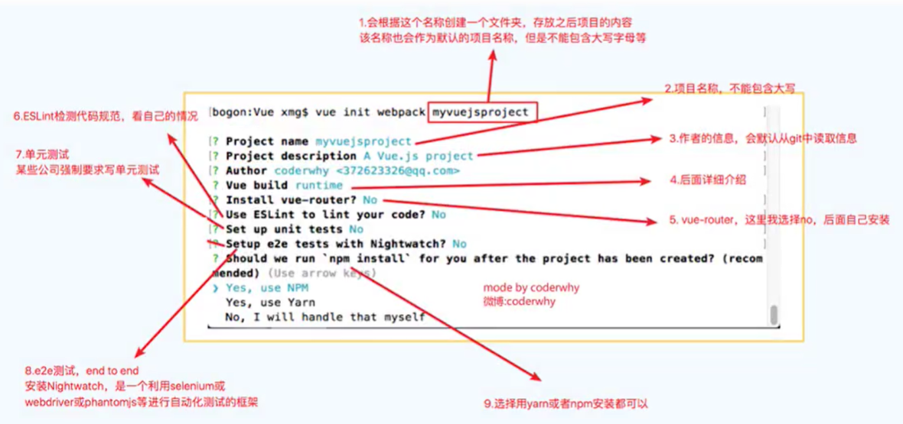
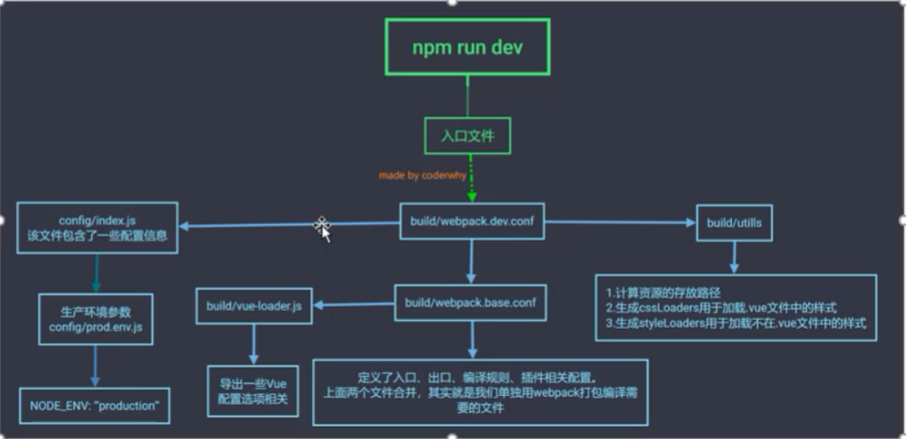
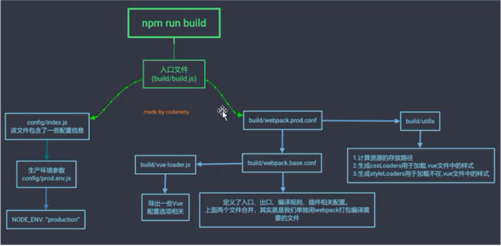

# VueCli 

vue cli 是构建vue项目的脚手架，只需要执行一条命令就可以快速创建出用于开发的vue项目，不在需要使用webpack进行搭建，可以省去一大堆的配置，让我们能专心于业务逻辑开发。

vuecli 也是基于webpack 的，所以也可以让我们进行个性化配置。

具体的配置以及属性使用可以看[官网](https://cli.vuejs.org/zh/guide/)的参考

## VueCli2

### 安装

```shell
npm i vue-cli -g
```

如果一直安装不成功可以先以**管理员方式**运行`npm clean cache --force`，然后再安装，或者直接去`C:\Users\用户\AppData\Roaming`下，将`npm-cache`删除到再试。

### 创建项目

```shell
vue init webpack 项目名字
```



### 自定义配置

自定义的配置可以在项目的`config`文件夹下修改相应的配置文件。如`webpack.prod.js`、`webpack.dev.js`等。


## VueCli3

### 安装

```shell
npm install -g @vue/cli
```

在脚手架3中想要使用脚手架2需要先安装脚手架3都安装，在用命令安装脚手架2的模本：`npm install @vue/cli-init -g`

### 创建项目

```shell
vue create 项目名称
```

### 自定义配置

#### 使用图形化界面修改配置

#### 使用`vue.config.js`文件手写配置

在vue-cli3下，如果要自定义配置，就需要在根目录下新建一个`vue.config.js`文件，具体配置和`webpack.config.js`一样

```js
module.exports = {
    ...
}
```

#### 添加webpack配置

如果要添加 webpack 配置可使用`configureWebpack`属性。

```js
module.exports = {
  configureWebpack: {
    plugins: [
      new MyAwesomeWebpackPlugin()
    ]
  }
}
```

### 开启UI界面

```html
vue ui
```


## npm run dev 的执行过程




## npm run build 的执行过程

