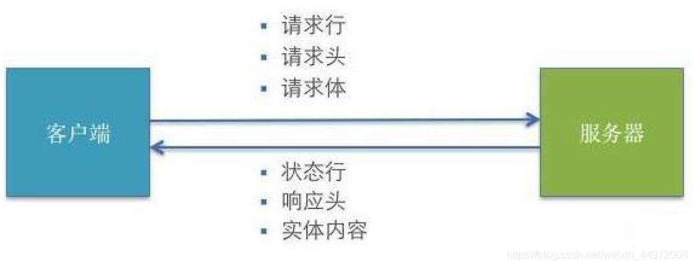

# Ajax

AJAX 全称为Asynchronous JavaScript And XML，就是异步的 JS 和 XML通过AJAX 可以在浏览器中向服务器发送异步请求，最大的优势：**无刷新获取数据**。

AJAX 不是新的编程语言，而是一种将现有的标准组合在一起使用的新方式

> **XML**
>
> + 可扩展标记语言
> + 被设计用来传输和存储数据
> + 和HTML 类似，不同的是HTML 中都是预定义标签，而XML 中没有预定义标签，
> 	全都是自定义标签，用来表示一些数据。
>
> ```xml
> <student>
> 	<name>孙悟空</name>
> 	<age>18</age>
> 	<gender>男</gender>
> </student>
> ```
>
> 现在更多使用json：`{"name":"孙悟空","age":18,"gender":"男"}`

## AJAX 的优点

1. 可以无需刷新页面而与服务器端进行通信
2. 允许你根据用户事件来更新部分页面内容

## AJAX 的缺点

1. 没有浏览历史，不能回退
2. 存在跨域问题(同源)
3. SEO 不友好

## HTTP 请求交互的基本过程



1. 前后应用从浏览器端向服务器发送HTTP 请求(请求报文)
2. 后台服务器接收到请求后, 调度服务器应用处理请求, 向浏览器端返回HTTP响应(响应报文)
3. 浏览器端接收到响应, 解析显示响应体/调用监视回调

## HTTP 请求报文

### 请求行

```
method url
GET /product_detail?id=2
POST /login

##多个请求头
Host: www.baidu.com
Cookie: BAIDUID=AD3B0FA706E; BIDUPSID=AD3B0FA706;
Content-Type: application/x-www-form-urlencoded 或者application/json
```

### 请求体

```
username=tom&pwd=123
{"username": "tom", "pwd": 123}
```


## HTTP 响应报文

1. 响应状态行: `status statusText`
2. 多个响应头

```
Content-Type: text/html;charset=utf-8
Set-Cookie: BD_CK_SAM=1;path=/
```

3. 响应体`html text/json text/css/图片...`

## post 请求体参数格式

+ `Content-Type: application/x-www-form-urlencoded;charset=utf-8`：用于键值对参数，参数的键值用=连接, 参数之间用&连接。例如: `name=jack&age=12`
+ `Content-Type: application/json;charset=utf-8`：用于 json 字符串参数，例如: `{"name": "jack", "age": 12}`
+ `Content-Type: multipart/form-data`：用于文件上传请求

## 常见的响应状态码

```
200 OK 请求成功。一般用于GET 与POST 请求
201 Created 已创建。成功请求并创建了新的资源
401 Unauthorized 未授权/请求要求用户的身份认证
404 Not Found 服务器无法根据客户端的请求找到资源
500 Internal Server Error 服务器内部错误，无法完成请求
```

## 不同类型的请求及其作用

1. `GET`: 从服务器端**读取**数据（查）
2. `POST`: 向服务器端**添加**新数据 （增）
3. `PUT`: **更新**服务器端已经数据 （改）
4. `DELETE`: **删除**服务器端数据 （删）

## API 的分类

1. REST API: restful （Representational State Transfer (资源)表现层状态转化）
	- 发送请求进行CRUD 哪个操作由请求方式来决定
	- 同一个请求路径可以进行多个操作
	- 请求方式会用到GET/POST/PUT/DELETE
2. 非REST API: restless
	- 请求方式不决定请求的CRUD 操作
	-  一个请求路径只对应一个操作
	-  一般只有GET/POST

## 区别 一般http请求 与 ajax请求

1. ajax请求 是一种特别的 http请求
2. 对服务器端来说, 没有任何区别, 区别在**浏览器端**
3. 浏览器端发请求: 只有`XHR` 或`fetch` 发出的才是ajax 请求, 其它所有的都是非ajax 请求
4. 浏览器端接收到响应
	-  一般请求: 浏览器一般会直接显示响应体数据, 也就是我们常说的刷新/跳转页面
	- ajax请求: 浏览器不会对界面进行任何更新操作, 只是**调用监视的回调函数**并**传入响应相关数据**


## 使用express搭建一个简单的服务器

```js
// 1. 引入express
const express = require('express');

// 2. 创建应用对象
const app = express();

// 3. 创建路由规则 request：是对请求报文的封装 response：是对响应报文的封装
//get请求
app.get('/', (request, response) => {
    //  设置响应
    response.send("Hello Express");
});
app.get('/server', (request, response) => {
  // 设置响应头 设置允许跨域
  response.setHeader('Access-Control-Allow-Origin', '*');
  // 设置响应体
  response.send("Hello Ajax");
});

//post请求
app.post('/server', (request, response) => {
  // 设置响应头, 设置允许跨域
  response.setHeader('Access-Control-Allow-Origin', '*');
  // 设置响应体
  response.send("Hello Ajax POST");
});

//json数据请求
app.all('/json-server', (request, response) => {
  // 设置响应头, 设置允许跨域
  response.setHeader('Access-Control-Allow-Origin', '*');
  // 设置响应头, 设置允许自定义头信息
  response.setHeader('Access-Control-Allow-Headers', '*');
  // 响应一个数据
  const data = {
    name: 'jack'
  };
  // 对 对象 进行 字符串 转换
  let str = JSON.stringify(data)
  // 设置响应体 
  response.send(str);
});

//处理jsonp数据请求
app.get("/testAJAX" , function (req , res) {
	console.log("收到请求");
	var callback = req.query.callback;
	var obj = {
		name:"孙悟空",
		age:18
	}
	res.send(callback+"("+JSON.stringify(obj)+")");
});

// 4. 监听端口，启动服务
app.listen(8000, () => {
    console.log("服务已经启动, 8000 端口监听中...");
})
```


## XMLHttpRequest 

### 基本使用

```js
// 创建对象
var xhr = new XMLHttpRequest();
// 请求方式 method:GET/POST,url:接口地址
xhr.open(method, url);
// 可以设置请求头，一般不设置
xhr.setRequestHeader('Content-Type', 'application/x-www-form-urlencoded');
// 发送请求  get请求不传 body 参数，只有post请求使用
xhr.send(body) 
// 接收响应（事件绑定，处理服务端返回的结果）
xhr.onreadystatechange = function (){
	// readyState 是 xhr对象中的属性, 表示状态 0 1 2 3 4
	if(xhr.readyState == 4 && xhr.status == 200){
        //xhr.responseXML 接收 xml格式 的响应数据
		//xhr.responseText 接收 文本格式 的响应数据
		var text = xhr.responseText;
		console.log(text);
	}
}
```

### readyState 状态值的意义

```
0: 表示XMLHttpRequest 实例已经生成，但是open()方法还没有被调用
1: 表示send()方法还没有被调用，仍然可以使用setRequestHeader()，设定HTTP请求的头信息
2: 表示send()方法已经执行，并且头信息和状态码已经收到
3: 表示正在接收服务器传来的body 部分的数据
4: 表示服务器数据已经完全接收，或者本次接收已经失败了
```

### 发送 ajax get请求

```js
// 1. 创建对象 
const xhr = new XMLHttpRequest();
// 2. 初始化 设置请求方法和url
xhr.open('GET', 'http://127.0.0.1:8000/server')
// 3. 发送
xhr.send();
// 4. 事件绑定 处理服务端返回的结果
xhr.onreadystatechange = function(){
    // readyState 是 xhr 对象中的属性, 表示状态 0 1 2 3 4
    //判断 (服务端返回了所有的结果)
    if(xhr.readyState === 4){
        //判断响应状态码 200  404  403 401 500
        if(xhr.status >= 200 && xhr.status < 300){
            // 处理结果 行 头 空行 体
            // 响应
            console.log('状态码', xhr.status); // 状态码
            console.log('状态字符串', xhr.statusText); // 状态字符串
            console.log('所有响应头', xhr.getAllResponseHeaders()); // 所有响应头
            console.log('响应体', xhr.response); // 响应体

            //设置 result 的文本
            result.innerHTML=xhr.response;
        }else{
        }
    }
} 
```

发送带参数的get：`xhr.open('GET', 'http://127.0.0.1:8000/server?a=100&b=200&c=300');`

### 发送 ajax POST请求

```js
// 1. 创建对象
const xhr = new XMLHttpRequest();
// 2. 初始化 设置类型（请求方式）与url
xhr.open('POST', 'http://127.0.0.1:8000/server');
// 3. 发送   设置请求参数（请求体）
xhr.send('a=100&b=200&c=300');
// 4. 事件绑定
xhr.onreadystatechange = function(){
    // 判断
    if(xhr.readyState === 4){
        if(xhr.status >=200 && xhr.status < 300){
            // 处理服务端返回的结果
            result.innerHTML = xhr.response;
        }
    }
}
```

### 设置请求头信息

```js
// 设置请求体内容的类型
xhr.setRequesHeader('Content-Type','application/x-www-from-urlencoded');
// 自定义头信息
xhr.setRequesHeader('name', 'ykyk');
```

### 请求json数据

```js
// 发送请求
const xhr = new XMLHttpRequest();
// *2*.(自动转换) 设置响应体数据的类型(自动转换)
xhr.responseType = 'json';
// 初始化
xhr.open('GET', 'http://127.0.0.1:8000/json-server');
// 发送
xhr.send();
// 事件绑定
xhr.onreadystatechange = function(){
    if(xhr.readyState === 4){
        if(xhr.status >= 200 && xhr.status < 300){
            console.log(xhr.response);
            // 1. 手动对数据转化 (字符串再转换成json)
            // let data = JSON.parse(xhr.response); //转换成json
            // result.innerHTML = data.name;
            // *2*. (自动转换)自动转换(自动转换)
            result.innerHTML = xhr.response.name; //已经自动变成json
        }
    }
}
```

### 请求超时与网络异常

```js
// 超时设置 （2秒）
xhr.timeout = 2000;
// 超时回调
xhr.ontimeout = function(){
	alert('网络超时，请稍后重试')
}
// 网络异常回调
xhr.onerror = function(){
	alert('网络异常，请稍后重试')
}
```

### 取消请求

```js
// 手动取消
xhr.abort()
```

### 解决 IE 缓存问题

**问题**：在一些浏览器中(IE),由于缓存机制的存在，ajax 只会发送的第一次请求，剩余多次请求不会在发送给浏览器而是直接加载缓存中的数据。

**解决方式**：浏览器的缓存是根据url 地址来记录的，所以我们只需要修改url 地址即可避免缓存问题

```js
xhr.open("get","/testAJAX?t="+Date.now());
```


## jQuery 中的AJAX

### get 请求 和 post 请求

```js
$.get(url, [data], [callback], [type])
```

```js
$.post(url, [data], [callback], [type])
```

**参数意义**

- url:请求的URL 地址
- data:请求携带的参数
- callback:载入成功时回调函数
- type:设置返回内容格式，xml, html, script, json, text, _default


## 使用 XHR 实现文件上传进度

 xhr 实例上有个 `upload` 对象，这个对象是`XMLHttpRequestUpload`的实例，这个对象可以定义在文件上传中的许多事件

| 事件          | 相应属性的信息类型               |
| ------------- | -------------------------------- |
| `onloadstart` | 获取开始                         |
| `onprogress`  | 数据传输进行中                   |
| `onabort`     | 获取操作终止                     |
| `onerror`     | 获取失败                         |
| `onload`      | 获取成功                         |
| `ontimeout`   | 获取操作在用户规定的时间内未完成 |
| `onloadend`   | 获取完成（不论成功与否）         |

在 `onprogress` 事件中会回传一个 ProgressEvent   对象 ，这个对象中有三个比较重要大数据

- lengthComputable 只读属性是一个布尔Boolean 标志，表示ProgressEvent 所关联的资源是否具有可以计算的长度 (MDN)
- loaded表示已经接收的字节数
- total 表示文件的字节

```js
var xhr = new XMLHttpRequest();  // 先new 一个XMLHttpRequest。
xhr.open('POST', 'url');   // 设置xhr得请求方式和url。

xhr.onreadystatechange = function() {   // 等待ajax请求完成。
    if (xhr.status === 200) {
        console.log(xhr.responseText);
    } else {
        console.log('上传出错');
    }
};
// 获取上传进度
xhr.upload.onprogress = function(event) { 
    console.log(event.loaded)
    console.log(event.total)
    if (event.lengthComputable) {
        var percent = Math.floor(event.loaded / event.total * 100);
        document.querySelector("#progress .progress-item").style.width = percent + "%";
        // 设置进度显示
        console.log(percent)
    }
};
xhr.send(fd);
```

