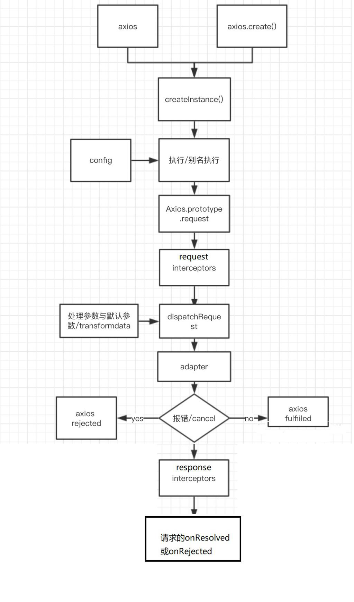
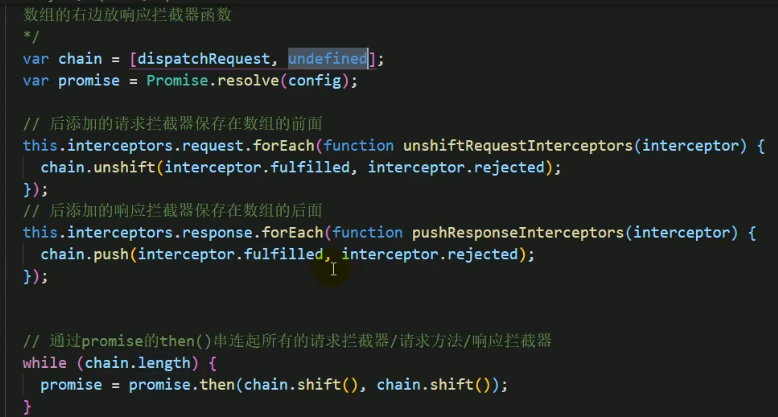
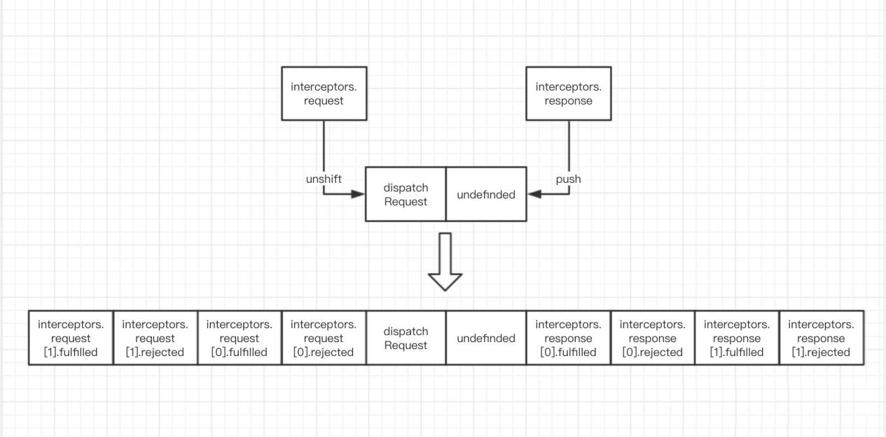

## http相关

## 1. 前后台交互的基本过程

1. 前后应用从浏览器端向服务器发送HTTP请求(请求报文)
2. 后台服务器接收到请求后, 调度服务器应用处理请求, 向浏览器端返回HTTP响应(响应报文)
3. 浏览器端接收到响应, 解析显示响应体/调用监视回调

## 2. HTTP请求报文

1. 请求行: 请求方式/url
2. 多个请求头: 一个请求头由 name:value 组成, 如Host/Cookie/Content-Type头
3. 请求体

## 3. HTTP响应报文

1. 响应行: 响应状态码/对应的文本
2. 多个响应头: 如 Content-Type / Set-Cookie 头
3. 响应体

## 4. post请求体文本参数格式

1. Content-Type: application/x-www-form-urlencoded;charset=utf-8
    用于键值对参数，参数的键值用=连接, 参数之间用&连接
    例如: name=%E5%B0%8F%E6%98%8E&age=12
2. Content-Type: application/json;charset=utf-8
    用于json字符串参数
    例如: {"name": "%E5%B0%8F%E6%98%8E", "age": 12}

## 5. 常见响应状态码

```
200	OK                     请求成功。一般用于GET与POST请求
201 Created                已创建。成功请求并创建了新的资源
301 redirect							临时重定向		
302 											永久重定向
304												数据没有变化，使用协商缓存的资源
401 Unauthorized           未授权/请求要求用户的身份认证
404 Not Found              服务器无法根据客户端的请求找到资源
500 Internal Server Error  服务器内部错误，无法完成请求
```

## 6. 不同类型的请求及其作用:

1. GET: 从服务器端读取数据
2. POST: 向服务器端添加新数据
3. PUT: 更新服务器端已经数据
4. DELETE: 删除服务器端数据

## 7. API的分类

1. **REST API:    restful**
    发送请求进行CRUD哪个操作由请求方式来决定
    同一个请求路径可以进行多个操作
    请求方式会用到GET/POST/PUT/DELETE
2. **非REST API:   restless**
    请求方式不决定请求的CRUD操作
    一个请求路径只对应一个操作
    一般只有GET/POST
    测试: 可以使用json-server快速搭建模拟的rest api 接口

### json-server 模拟 REST 方格的 API

1. 安装

```shell
npm i -g json-server
```

2. 在空文件夹中写入初始 json 文件 `/json-server/rest-server/db.json`

```js
{
  "posts": [
    { "id": 1, "title": "json-server", "author": "typicode" }
  ],
  "comments": [
    { "id": 1, "body": "some comment", "postId": 1 }
  ],
  "profile": { "name": "typicode" }
}
```

3. 然后再当前的目录下 使用命令启动服务即可

```shell
json-server --watch db.json --port 4000
```

当在浏览器地址栏输入 `http://localhost:4000/posts` 时返回的将会使一个数组，当输入的是`http://localhost:4000/posts/1` 使用的是 param 方式传参的时候返回的将会是一个指定的对象，但是如果使用的查询参数的形式 `http://localhost:4000/posts?id=1` 的时候后json-server将会执行过滤操作，所以最后返回的也会是一个数组。如果想要测试其他的接口的话，可以使用 XHR 、axios、接口调试工具进行测试，如使用 axios

```js
axios.get("http://localhost:4000/posts/1").then(res=>{
  console.log(res);
})

axios.post("http://localhost:4000/posts",{"title":"hello","author":"world"}).then(res=>{
  console.log(res);
})

axios.put("http://localhost:4000/posts/2",{"title":"hello...","author":"world..."}).then(res=>{
  console.log(res);
})

axios.delete("http://localhost:4000/posts/2").then(res=>{
  console.log(res);
})
```


## 8. 理解XHR

- 使用XMLHttpRequest (XHR)对象可以与服务器交互, 也就是发送ajax请求
- 前端可以获取到数据，而无需让整个的页面刷新。
- 这使得Web页面可以只更新页面的局部，而不影响用户的操作。

## 9. 区别ajax请求与一般HTTP请求

- ajax请求是一种特别的http请求: 只有通过XHR/fetch发送的是ajax请求, 其它都是一般HTTP请求
- 对服务器端来说, 没有任何区别, 区别在浏览器端
- 浏览器端发请求: 只有XHR或fetch发出的才是ajax请求, 其它所有的都是非ajax请求
- 浏览器端接收到响应
	- 一般请求: 浏览器一般会直接显示响应体数据, 也就是我们常说的刷新/跳转页面
	- ajax请求: 浏览器不会对界面进行任何更新操作, 只是调用监视的回调函数并传入响应相关数据

## 10. 使用XHR封装一个发ajax请求的通用函数

- 函数的返回值为promise, 成功的结果为response, 异常的结果为error
- 能处理多种类型的请求: GET/POST/PUT/DELETE
- 函数的参数为一个配置对象: url/method/params/data
- 响应json数据自动解析为了js

### XHR 的 API

+ status 响应的状态吗
+ statusText 响应状态文本
+ readyState 标识请求的状态
	+ 0 初始，创建xhr对象的时候
	+ 1 open() 之后
	+ 2 send() 之后
	+ 3 请求中
	+ 4 请求完成
+ onreadystatechange 绑定 readyState 改表的监听
+ responseType 响应数据类型，如果是 json 得到响应后自动解析成响应体数据
+ response 响应体数据
+ timeout 指定超时时间，默认为0 无限制
+ onerror 绑定请求网络错误的监听
+ open() 初始化一个请求，参数为 (method,url,[async]);
+ send(data) 发送请求
+ abort() 中断请求
+ getResponseHeader(name) 获取响应头的值
+ getAllResponseHeaders() 获取全部响应头key-value 组成的字符串
+ setRequestHeader(name,value) 设置请求头


### 使用 XHR 封装一个简单版本的 axios

函数接收一个配置数据，返回一个promise对象，成功结果为response，失败结果为error，可以处理 GET/POST/PUT/DELETE 请求方式，并且将相应的 json 数据自动解析为 js

```js
function axios({
  url,
  method = "GET",
  params = {},
  data = {}
}){
  return new Promise((resolve,reject) => {
    //如果有params参数，将数据拼接成query参数
    let querys = [];
    for(let key in params){
      querys.push(`${key}=${params[key]}`);
    }
    queryStr = querys.join("&");
    queryStr&&(url += "?" + queryStr);
    
    let xhr = new XMLHttpRequest();
    method = method.toUpperCase();
    xhr.open(method, url, true);
    if(method === "GET" || method === "DELETE"){
      xhr.send();
    }else{
      //设置请求头，告诉服务端要发送的数据是json数据
      xhr.setRequestHeader("Content-Type","application/json;charset=utf-8");
      xhr.send(JSON.stringify(data));
    }
    //监听状态改变
    xhr.onreadystateChange = function(){
      if(xhr.readyState !== 4){
        return;
      }
      let {status,statusText} = xhr;
      //如果相应状态码在[200,300)之间便是成功，否则失败
      if(status >= 200 && status < 300){
        const response = {
          data: JSON.parse(xhr.response),
          status,
          statusText,
        }
        resolve(response);
      }else{
        reject(new Error("request error status is" + status))
      }
    }
  })
}
```

**注意**：一般需要对闯入的 url 进行编码，因为 url 中可能会出现一些特殊字符

+ encodeURI / decodeURI ：主要对整个 url 进行编码
+ encodeComponent / decodeComponent：主要对参数进行编码
+ escape / unescape：主要对整个 url 进行编码，但是后端中可能不支持解码方法，上面的两种方式绝大部分 语言都是支持的。


## 11. axios的特点

- 基于promise的封装XHR的异步ajax请求库
- 浏览器端/node端都可以使用
- 支持请求／响应拦截器
- 支持请求取消
- 请求/响应数据转换
- 批量发送多个请求

## 12. axios常用语法

```
axios(config): 通用/最本质的发任意类型请求的方式
axios(url[, config]): 可以只指定url发get请求
axios.request(config): 等同于axios(config)
axios.get(url[, config]): 发get请求
axios.delete(url[, config]): 发delete请求
axios.post(url[, data, config]): 发post请求
axios.put(url[, data, config]): 发put请求

axios.defaults.xxx: 请求的默认全局配置
axios.interceptors.request.use(): 添加请求拦截器
axios.interceptors.response.use(): 添加响应拦截器

axios.create([config]): 创建一个新的axios(它没有下面的功能)

axios.Cancel(): 用于创建取消请求的错误对象
axios.CancelToken(): 用于创建取消请求的token对象
axios.isCancel(): 是否是一个取消请求的错误
axios.all(promises): 用于批量执行多个异步请求
axios.spread(): 用来指定接收所有成功数据的回调函数的方法
```

 

### config 全配置

```js
{
   // `url` 是用于请求的服务器 URL
  url: '/user',

  // `method` 是创建请求时使用的方法
  method: 'get', // default

  // `baseURL` 将自动加在 `url` 前面，除非 `url` 是一个绝对 URL。
  // 它可以通过设置一个 `baseURL` 便于为 axios 实例的方法传递相对 URL
  baseURL: 'https://some-domain.com/api/',

  // `transformRequest` 允许在向服务器发送前，修改请求数据
  // 只能用在 'PUT', 'POST' 和 'PATCH' 这几个请求方法
  // 后面数组中的函数必须返回一个字符串，或 ArrayBuffer，或 Stream
  transformRequest: [function (data, headers) {
    // 对 data 进行任意转换处理
    return data;
  }],

  // `transformResponse` 在传递给 then/catch 前，允许修改响应数据
  transformResponse: [function (data) {
    // 对 data 进行任意转换处理
    return data;
  }],

  // `headers` 是即将被发送的自定义请求头
  headers: {'X-Requested-With': 'XMLHttpRequest'},

  // `params` 是即将与请求一起发送的 URL 参数
  // 必须是一个无格式对象(plain object)或 URLSearchParams 对象
  params: {
    ID: 12345
  },

   // `paramsSerializer` 是一个负责 `params` 序列化的函数
  // (e.g. https://www.npmjs.com/package/qs, http://api.jquery.com/jquery.param/)
  paramsSerializer: function(params) {
    return Qs.stringify(params, {arrayFormat: 'brackets'})
  },

  // `data` 是作为请求主体被发送的数据
  // 只适用于这些请求方法 'PUT', 'POST', 和 'PATCH'
  // 在没有设置 `transformRequest` 时，必须是以下类型之一：
  // - string, plain object, ArrayBuffer, ArrayBufferView, URLSearchParams
  // - 浏览器专属：FormData, File, Blob
  // - Node 专属： Stream
  data: {
    firstName: 'Fred'
  },

  // `timeout` 指定请求超时的毫秒数(0 表示无超时时间)
  // 如果请求话费了超过 `timeout` 的时间，请求将被中断
  timeout: 1000,

   // `withCredentials` 表示跨域请求时是否需要使用凭证，在同源请求时无效；
   //在跨域请求的时候设置为true，并且服务也设置了Access-Control-Allow-Origin、Access-Control-Allow-Credentials后，请求将可以在请求头中携带cookie
  withCredentials: false, // default

  // `adapter` 允许自定义处理请求，以使测试更轻松
  // 返回一个 promise 并应用一个有效的响应 (查阅 [response docs](#response-api)).
  adapter: function (config) {
    /* ... */
  },

 // `auth` 表示应该使用 HTTP 基础验证，并提供凭据
  // 这将设置一个 `Authorization` 头，覆写掉现有的任意使用 `headers` 设置的自定义 `Authorization`头
  auth: {
    username: 'janedoe',
    password: 's00pers3cret'
  },

   // `responseType` 表示服务器响应的数据类型，可以是 'arraybuffer', 'blob', 'document', 'json', 'text', 'stream'
  responseType: 'json', // default

  // `responseEncoding` indicates encoding to use for decoding responses
  // Note: Ignored for `responseType` of 'stream' or client-side requests
  responseEncoding: 'utf8', // default

   // `xsrfCookieName` 是用作 xsrf token 的值的cookie的名称
  xsrfCookieName: 'XSRF-TOKEN', // default

  // `xsrfHeaderName` is the name of the http header that carries the xsrf token value
  xsrfHeaderName: 'X-XSRF-TOKEN', // default

   // `onUploadProgress` 允许为上传处理进度事件
  onUploadProgress: function (progressEvent) {
    // Do whatever you want with the native progress event
  },

  // `onDownloadProgress` 允许为下载处理进度事件
  onDownloadProgress: function (progressEvent) {
    // 对原生进度事件的处理
  },

   // `maxContentLength` 定义允许的响应内容的最大尺寸
  maxContentLength: 2000,

  // `validateStatus` 定义对于给定的HTTP 响应状态码是 resolve 或 reject  promise 。如果 `validateStatus` 返回 `true` (或者设置为 `null` 或 `undefined`)，promise 将被 resolve; 否则，promise 将被 rejecte
  validateStatus: function (status) {
    return status >= 200 && status < 300; // default
  },

  // `maxRedirects` 定义在 node.js 中 follow 的最大重定向数目
  // 如果设置为0，将不会 follow 任何重定向
  maxRedirects: 5, // default

  // `socketPath` defines a UNIX Socket to be used in node.js.
  // e.g. '/var/run/docker.sock' to send requests to the docker daemon.
  // Only either `socketPath` or `proxy` can be specified.
  // If both are specified, `socketPath` is used.
  socketPath: null, // default

  // `httpAgent` 和 `httpsAgent` 分别在 node.js 中用于定义在执行 http 和 https 时使用的自定义代理。允许像这样配置选项：
  // `keepAlive` 默认没有启用
  httpAgent: new http.Agent({ keepAlive: true }),
  httpsAgent: new https.Agent({ keepAlive: true }),

  // 'proxy' 定义代理服务器的主机名称和端口
  // `auth` 表示 HTTP 基础验证应当用于连接代理，并提供凭据
  // 这将会设置一个 `Proxy-Authorization` 头，覆写掉已有的通过使用 `header` 设置的自定义 `Proxy-Authorization` 头。
  proxy: {
    host: '127.0.0.1',
    port: 9000,
    auth: {
      username: 'mikeymike',
      password: 'rapunz3l'
    }
  },

  // `cancelToken` 指定用于取消请求的 cancel token
  // （查看后面的 Cancellation 这节了解更多）
  cancelToken: new CancelToken(function (cancel) {
  })
}
```


## axios.create(config) 方法理解

1. 根据配置对象创建一个新的 axios 实例对象，也就每个 axios 都可以有自己独特的配置
2. 新 axios 只是没有取消请求和批量发送的方法，其他的是一样的
3. 为什么要设计这个语法？
	- 项目中有部分接口的配置与另一部分结需要的配置不太一样，如何处理
	- 创建两个新的 axios ，每个都有自己特有的配置，分别引用到不同的接口请求中


## axios 的拦截器

axios 的拦截器分为请求拦截器和响应拦截器，这两个拦截器都可以绑定多个。**对于请求拦截器**，绑定的时候需要传入两个函数作为参数，并且第一个参数接收一个axios请求的配置对象，并返回一个配置对象，请求将以返回的配置为准，而且**如果绑定多个拦截器的话，那么返回的这个配置对象将会使下一个拦截器接收到的参数数据**。在这里可以设置自己的请求头和一些数据的验证，请求的转发等。至于第二个函数接收一个错误对象，并返回一个失败状态的promise对象。**对于响应拦截器**，绑定的时候需要传入两个函数作为参数，第一个函数接收一个响应对象作为参数，并返回一个响应对象，axios 的 then 将以返回对象为准，而且如果绑定多个拦截器的话，那么返回的这个响应对象将会使下一个拦截器接收到的参数数据；

```js
//请求拦截器
axios.interceptors.request.use(
    config => {
        return config;
    },
    err => {
        return Promise.reject(err);
    }
)

//请求响应拦截器
axios.interceptors.response.use(
    response => {
        return response;
    },
    err => {
        return Promise.reject(err);
    }
)
```


## axios 取消请求操作

当有一些请求比较消耗时间的时候，为了能能让用户有更好的体验，一般都会有一个取消请求的操作，在 axios 中可以为每一个请求指定绑定一个取消请求的执行器，当需要取消的时候就执行即可，并且取消请求后执行失败回调。

```js
let cancel = null;
function getData(){
    if(typeof cancel == "function"){
        cancel("取消请求");
    }
    axios({
        url:'http://localhost:3000/posts',
        method:"GET",
        params:{
            id:1
        },
        cancelToken:new axios.CancelToken(c=>{
            cancel = c;//c 是取消请求的函数
        })
    }).then(res=>{
        cancel = null;
    },err=>{
        if(axios.isCancel(err)){
            console.log("取消请求导致的错误");
        }else{
            cancel = null;
            console.log("请求出错")
        }
    })
}

//取消请求
function cancelRequest(){
    cancel('强制取消请求完成');
}
```

需要注意的是，如果使用上面 getData() 连续发请求的时候，为了保持只有一个请求，所以在发送的时候将前一个请求取消。这时候在错误回调中需要**只在**是请求出错的时候才将 取消函数设置为 null ，**不能**在取消请求的情况下也将 取消函数 设置为null。

因为错误回调是异步的，假设连续调用了 3 次 getData () ，并且在回调中同一将 cancel 设置为 null 。第一次时 cancel 为 c1 函数，然后第二次调用时取消了 c1，但是 cancel 并没有立马被设置为 null，因为错误回调是异步的，然后  cancel 被设置为 c2，此时宏任务完成执行微任务错误回调，cancel 被设置为 null ，c1 取消完成 ，在第三次点击的时候就不会取消第二次的请求了。所以需要在请求错误的时候才将 cancel 设置为 null，而不是取消请求的时候。

但是一般取消请求的操作都是配合请求拦截器以及响应拦截器进行设置的

```js
let cancel = null;
axios.interceptors.request.use(config=>{
  if(typeof cancel == "function"){
    cancel("取消请求");
  }
  config.cancelToken = new axios.CancelToken(c=>{
    cancel = c;
  })
  return config;
})
axios.interceptors.response.use(res=>{
  cancel = null;
  return res;
},err=>{
  if(!axios.isCancel(err)){
    cancel = null;
    return Promise.reject(err);
  }
  return new Promise(()=>{});
})

function getData(){
  if(typeof cancel == "function"){
    cancel("取消请求");
  }
  axios({
    url:'http://localhost:3000/posts',
    method:"GET",
    params:{
      id:1
    },
  }).then(res=>{
    console.log("请求成功")
  },err=>{
    console.log("请求出错")
  })
}
```


## axios 使用文件上传进入

axios的配置中可以配置 文件上传的事件`onUploadProgress`，开启文件上传的事件处理，也可以定义下载的事件

```js
// config
{
  // `onUploadProgress` 允许为上传处理进度事件
  onUploadProgress: function (progressEvent) {
    // 对原生进度事件的处理
  },

  // `onDownloadProgress` 允许为下载处理进度事件
  onDownloadProgress: function (progressEvent) {
    // 对原生进度事件的处理
  },
}
```

```js
if (typeof config.onUploadProgress === 'function' && request.upload) {
    request.upload.addEventListener('progress', config.onUploadProgress);
}
```


# axios的神奇之处

从 axios 的一般使用`axios(config)`来看，它是一个函数，但是从这些用法`axios.get(),axios.post()`来看，它又是一个实例对象。那么从源码中结构

```
-adapters
	-http.js
	-xhr.js
-cancel
	-Cancel.js
	-CancelToken.js
	-isCancel.js
-core
	-Axios.js
	-InterceptorManager.js
	-dispatchRequest.js
	-....
-helpers
-axios.js
-default.js
-utils.js
```


## axios 的创建和执行流程



**整体的主要流程**

```
request(config) ==> dispatchRequest(config) ==> xhrAdapter(config)
```


## 1. axios 与 Axios 的关系 

1. 从语法上看 axios 不是 Axios 的实例
2. 从功能上看 axios 是 Axios 的实例
	- axios 是 Axios.prototype.request 函数 bind() 返回的函数
	- axios 作为对象有 Axios 原型对象上的所有方法，有 Axios 对象上的所有属性。

## 2.instance 与 axios 的区别

- 相同
	1. 都是一个能发任意请求的函数 request(config);
	2. 都有发特定请求的各种方法 get()/post()/put()/delete();
	3. 都有默认配置和拦截器的属性 defaults/interceptors
- 不同
	1. 默认匹配的值很可能不一样
	2. instance 没有 axios 后面添加的一些方法 create()/CancelToken()/all()


## 3.request串联整个流程

axios 通过结合 promise 和 数组结构方便地实现请求的流程，整个请求的流程是 请求拦截器 --> 请求 --> 响应拦截器

axios.js 的 request 方法





+  request (config) ：将请求拦截器 /dispatchRequest()/ 响应拦截器 通过promise串联起来，返回promise
+  dispatchRequest(config)：转换请求数据 ==> 调用xhrAdapter() 发送请求 ==> 请求返回后转换响应数据，返回promise
	+ 请求转换器: 对请求头和请求体数据进行特定处理的函数`setContentTypeIfUnset(headers, 'application/json;charset=utf-8');`
	+ 响应转换器: 将响应体json字符串解析为js对象或数组的函数`response.data = JSON.parse(response.data)`
+ xhrAdapter(config)：创建XHR对象，根据 config 进行相应设置，发送特定请求，并接受响应数据返回promise


## 如何取消未完成的请求

1. 当配置了cancelToken对象时，保存cancel函数
	- 保存cancel函数创建一个用于将来中断请求的cancelPromise
	- 并定义了一个用于取消请求的cancel函数
	- 将cancel函数传递出来
2. 调用cancel()取消请求
	- 执行cancel函数, 传入错误信息message，
	- 内部会让cancelPromise变为成功, 且成功的值为一个Cancel对象
	- 在cancelPromise的成功回调中中断请求, 并让发请求的proimse失败, 失败的reason为Cancel对象


# 在项目中使用axios

在开发中不要太过于依赖第三方插件，应为说不准什么时候别人就不在维护插件了，又或者是需求发生了改变，需要换一个插件，如果项目中对他的依赖很多的话，改起来就会很麻烦。正确的方法是自己将这个插件封装一下，然后再使用。如在 vue 中使用 axios 。

创建`network/request.js`

```js
import axios from "axios";

const instence1;
export function request(config){
    if(!instence1){
        instence1 = axios.create({
            baseURL: 'https://some-domain.com/api/',
            timeout: 1000,
        })
    }
    return instence1(config)
}
```