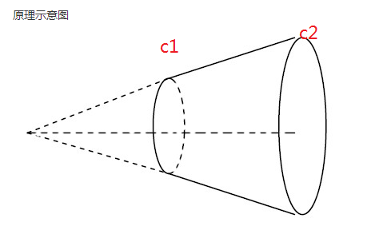

# canvas

canvas 是 h5 新增的东西，用于绘制图像，长久以来在web上运行的动画和图像都是以 flash 的形式出现的，但是 flash 不但使用要求高（需要安装adobe flash player），开发成本也高（需要使用 actionscript），漏洞多，卡顿，不流畅等等问题。

canvas 是一种轻量级的画布，使用 canvas 进行 JavaScript 的编程，不需要增加额外的插件，性能也很好，不卡顿，在手机中也很流畅，并且后续会支持 3D 场景（experimental-webgl）的开发。并且使用 canvas 也非常简单，因为 h5 中 canvas 只是一个标签`<canvas>` 而且属性要只有` width height`这两个主要属性和一些`id class style`等通用属性而已，但是 canvas 有个缺点就是在画布中的元素是不支持使用 DOM 操作的。


## 基本使用

要使用 canvas 首先就是要创建 canvas 标签，然后获取到 canvas 画布环境，所有的图像绘制都是通过 ctx 设置的，和canvas 没有太大关系。

```html
<canvas id="can" width="200" height="300">
    （IE6/7/8）浏览器暂不支持 canvas 功能</canvas>
<script>
	let can = document.querySelector("#can");
	let ctx = can.getContext("2d",{alpha:true});//alpha 画布背景是否透明，默认是透明的
    ctx.rect
</script>
```

**注意**：canvas 的 width 和 height 不要用 css 来设置，因为通过css设置的是指**canvas元素**的宽高，而 `<canvas id="can" width="200" height="300">` 中的宽高指的是**画布场景**的宽高，如果使用了，就会导致画布被缩放或者变形。

## canvas 特点

**像素化**：使用 canvas 绘制一个图形，一点绘制成功，canvas 就像素化了他们。所以我们是不能从画布上再次得到这个图形，也就是我们不能再操作它了。这个就是 canvas 比较轻量的原因。

因此如果我们需要让这个canvas 图形做动画效果，必须使用`清屏->更新->渲染`的步骤进行编程，总而言之就是需要重新再画一次。

```js
let can = document.querySelector("#can");
let ctx = can.getContext("2d");
let left = 0;
ctx.fillStyle = "blue";
let timeId = setInterval(()=>{
	ctx.clearRect(0,0,700,700);
	left++;
	if(left>=100){
		clearInterval(timeId);
	}
    ctx.fillRect(left,150,20,20);
},10);
```


## 绘制图形API

### **绘制矩形**

+ `ctx.fillRect(x,y,w,h)`绘制填充的一个矩形
+ `ctx.fillStyle = "red"`设置填充图形的颜色值，可以接受 颜色名，16位颜色值，rgb，rgba等颜色值
+ `ctx.strokeRect(x,y,w,h)`绘制一个矩形边框
+ `ctx.clearRect(x,y,w,h)`清除指定矩形区域，让清除部分完全透明
+ `ctx.rect(x,y,w,h)`绘制一个矩形，但是如果不用`ctx.fill()`填充颜色或者`ctx.stroke()`描边是看不到的。
	+ `ctx.fill()`有两种模式可以选择 ，**"evenodd"**不填充相交的部分，**nonzero**全填充（默认）

> 清屏的方式除了使用 `ctx.clearRect(x,y,w,h)`之外还可以使用`canvas.width = val`重新设置canvas 的宽来清除屏幕上的东西。

### **绘制路径**

+ `ctx.beginPath()`用于创建一个路径，并把之前的路径关闭
+ `ctx.moveTo(x,y)`移动路径起点到x,y
+ `ctx.lineTo(x,y)`从上一个路径点移动到 x, y
+ `ctx.closePath()`关闭路径绘制，如果画的路径是没有闭合的是用这个方法会将起点和终点连线闭合
+ `ctx.stroke()`描边
+ `ctx.strokeStyle="red"`设置描边颜色

画好**路径**后还需要使用`ctx.stroke()`描边之后路径才会显示出来。也可以同是使用`ctx.fill()`来填充不规则图形。

### **绘制圆弧**

+ `ctx.arc(x,y,r,startRadian,endRadian,isInverse)`绘制一个**圆弧路径**，`ctx.arc(200,200,50,0,1,false)`在**圆心**为(200,200)处，在**弧度**0开始到1顺时针画一个**半径**为 50的圆弧。`0 <= startRadian|endRadian <= 2π`，需要注意：半径必须 大于 0

> **弧度=(Math.PI/180)\*角度。**

## 透明度

+ `ctx.globalAlpha = 1`设置绘画的透明度也可以通过设置颜色的`rgba`来设置透明度。

## 线型

+ `ctx.lineWidth = 10`设置线的宽度
+ `ctx.lineCap = "butt"|"round"|"square"`设置线端点样式，分别为矩形（默认），圆角，矩形（但是会在两端增加一个矩形区域）。
+ `ctx.lineJoin = "bevel"|"round"|"square"`设置线与线之间连接点的样式，平角，圆角，矩形（默认）；
+ `ctx.setLineDash([线长,间隔....])`设置描边线为虚线，并且设置可以设置单个虚线的长度与间隔，可以设置多个，每两个为一组。
+ `ctx.lineDashOffset = 10`设置虚线便宜量，> 0 时表示的是想左便宜， < 0 时表示的向右偏移
+ `ctx.isPointInPath(x,y)`判断点是否在路径上
+ `ctx.isPointInStroke(x,y)`判断点是否在图像的描边上。

## 绘制文本

+ `ctx.fillText(txt,x,y)`将文本txt，在 x,y 处绘制出来
+ `ctx.strokeText(txt,x,y)`将文本txt，在 x,y 处绘制出来，是描边文本
+ `ctx.font = "10px sans-serif"`设置文本字体样式，可以用来设置字体大小
+ `ctx.textAlign = "start"|"left"|"right"|"center"|"end"`设置文本的对其方式，默认是 start，需要注意的是 这个的对其是相对 x 而言的，也就是说 如果是 center 那个文本将会向左便宜50%，使 x 位于中间。
+ `ctx.textBaseline ="top"|"hanging"|"middle"|"alphabetic"|"ideographic"|"bottom"` 基线对齐选项
+ `ctx.direction ="ltr"|"rtl"|"inherit"`文本方向
+ `ctx.measureText('foo')`将返回一个 TextMetrics 对象的宽度、所在像素，这些体现文本特性的属性

## 渐变

+ `ctx.createLinearGradient(x1,y1,x2,y2)`由点（x1，y1） 到点（x2，y2）创建一个具有方向的线性渐变区域，只有在这个区域上的图才应用到。返回 Gradients 对象。这个对象可以用做 fillStyle 和 strokeStyle 的值。
+ `ctx.createRadialGradient(x1,y1,r1,x2,y2,r2)`前三个定义一个以 (x1,y1) 为原点，半径为 r1 的圆，后三个参数则定义另一个以 (x2,y2) 为原点，半径为 r2 的圆。这个可以在三维空间上理解。
+ `Gradients.addColorStop(persent,color)`，定义渐变的颜色占比，persent 取值范围为 0~1 ，表示在渐变方向上的百分之几由color 颜色开始渐变。



> 填充还可以使用图片进行。`ctx.createPattern()`可以创建一个贴图器，同样返回的值也可以给 `ctx.fillStyle`使用
>
> ```js
> function draw() {
>   var ctx = document.getElementById('canvas').getContext('2d');
>   // 创建新 image 对象，用作图案
>   var img = new Image();
>   img.src = 'https://mdn.mozillademos.org/files/222/Canvas_createpattern.png';
>   img.onload = function() {
>     // 创建图案
>     var ptrn = ctx.createPattern(img, 'repeat');
>     ctx.fillStyle = ptrn;
>     ctx.fillRect(0, 0, 150, 150);
>   }
> }
> ```


## 阴影

+ `ctx.shadowOffsetX = 10`设阴影x轴的偏移量
+ `ctx.shadowOffsetY = 10`设阴影y轴的偏移量
+ `ctx.shadowBlur = 10`设阴影的模糊度
+ `ctx.shadowColor = "red"`设阴影的颜色


## 使用图片

`ctx.drawImage()`方法会根据不同的参数数量起到不同的作用。这个方法也经常配合`canvas.toDataURL("image/jpeg", 质量(0~1));`被用于**前端图片压缩**。

+ `ctx.drawImage(imgObj,x,y)`将图片加载在 x，y 处。
+ `ctx.drawImage(imgObj,x,y,w,h)`将图片加载在 x，y 处，并设置宽高，会缩放。`ctx.imageSmoothingEnabled = false;`可以使用这个控制是否开启平滑缩放
+ `ctx.drawImage(imgObj,x,y,w,h,clipX,clipY,clipW,clipH)`前4个是定义图像源的切片位置和大小，后4个则是定义切片的目标显示位置和大小。将图片进行切片。

**imgObj** 可以是 `Image`对象`new Image()`（但是在获取数据的时候可能会出现跨域的问题，这时候可以为img添加`img.crossOrigin = 'anonymous';`属性解决跨域问题），也可以是`HTMLImageElement`(``)，`HTMLVideoElement`(`<video>`)，`<canvas>`对象。

> `ImageBitmap`是一个高性能的位图，可以低延迟地绘制，它可以从上述的所有源以及其它几种源中生成。
>
> ```js
> const imageBitmapPromise = createImageBitmap(image[, options]);
> const imageBitmapPromise = createImageBitmap(image, sx, sy, sw, sh[, options]);
> ```
>
> `image`： 一个图像源, 可以是一个``, `SVG `，`<image>`，`<video> `，`<canvas>`，`HTMLImageElement`，`HTMLVideoElement`，`HTMLCanvasElement`，`Blob`，`ImageData`，`ImageBitmap`，`OffetscreenCanvas`对象
>
> sx：裁剪点x坐标.
>
> sy：裁剪点y坐标.
>
> sw：裁剪宽度,值可为负数.
>
> sh：裁剪高度,值可为负数.


## 状态保存和恢复

- `ctx.sava()`可以将当前的环境状态保存下来，保存的方式是栈，也就是说恢复的时候是出栈的方式恢复的。
  - 可保存的状态有：应用的变形，strokeStyle，fillStyle，globalAlpha，lineWidth，lineCap，lineJoin，miterLimit，lineDashOffset，shadowOffsetX，shadowOffsetY，shadowBlur，shadowColor，globalCompositeOperation，font，textAlign，textBaseline，direction，imageSmoothingEnabled，当前的裁切路径（clipping path）
- `txt.restore()`恢复上一次保存的状态，将状态栈做出栈操作。


## 变形

- `ctx.translate(x,y)`移动的是整个 canvas 的坐标系到一个不同的位置。需要注意的是如果你是在一个循环中做位移但没有保存和恢复 canvas 的状态，很可能到最后会发现怎么有些东西不见了，那是因为它很可能已经超出 canvas 范围以外了。
- `ctx.rotate(弧度)`将整个 canvas 的坐标系按原点旋转。
- `ctx.scale(sx,sy)`方法可以缩放画布的水平和垂直的单位。
- `ctx.transform(a, b, c, d, e, f)`这个是上面的几个机集合，传入的是一个变换矩阵。在条件允许的时候可以尽量使用这个方法进行变形，因为这个方式可以**开启GPU加速**
	- a：水平缩放。
	- b：垂直倾斜。
	- c：水平倾斜。
	- d：垂直缩放。
	- e：水平移动。
	- f：垂直移动。


## 合成

+ `ctx.globalCompositeOperation = type`这个方法可以设置图像之间的合成模式，类似于PS的图层合并方式。[在这里查看类型和效果](https://developer.mozilla.org/zh-CN/docs/Web/API/Canvas_API/Tutorial/Compositing)。利用这个强大的特性可以用来做ps的图层合并效果等等。比如使用`destination-out`就可以轻松实现刮刮卡效果。


## 裁剪与遮罩

+ `ctx.clip()`这个方法的作用和`ctx.fill() ctx.stroke()`很像，都是对图像的一种填充方式，`fill()`是填充整个图像，`stroke()`是对图像进行描边，而`cilp()`则是裁剪图像，准确来说应该是创建一个遮罩，只用在遮罩内的内容才会被看见。


## 图像操作

+ `ctx.createImageData(w,h)`创建一个宽度为 w 高度为 h 的 ImageData 对象，也可以直接通过 ImageData 对象克隆一个新的 ImageData 对象 ctx.createImageData(imageData)
+ `ctx.getImageData(x,y,w,h)`获取画布上某一区域上的 ImageData 对象
+ `ctx.putImageData(imagedata, dx, dy[, dirtyX, dirtyY, dirtyWidth, dirtyHeight])`将 ImageData 源图像中点（dirtyX, dirtyY）宽高为（dirtyWidth, dirtyHeight）的区域在画布的（dx, dy）绘制出来。

> ImageData ：这个对象中有三个属性 {width，height，data}，其中data就是该图像的像素描述（数字数组，每四个为一组分别表示为 r，g，b，a），是可以被遍历修改的，通过修改这个数组中的数据可达到控制像素的效果。最后可以通过 putImageData 方法将图像输出到屏幕上。


## Canvas动画

因为Canvas 像素话的特点，图像在被绘制到画布上之后就不能被操作了，所以想要实现Canvas的动画的话，就需要按照`清屏->更新->渲染`的步骤重复改变画布上的内容才行。这样的话就可以选择使用循环、setTimeout，setInterval、equestAnimationFrame(fn) （fn接收一个参数，是执行的时间）方法实现重复渲染更新了。

> #### requestAnimationFrame(fn) 比起 setTimeout、setInterval的优势主要有两点：
>
> 1. requestAnimationFrame 会把每一帧中的所有DOM操作集中起来，在一次重绘或回流中就完成，并且重绘或回流的时间间隔紧紧跟随浏览器的刷新频率，一般来说，这个频率为每秒60帧。
> 2. 在隐藏或不可见的元素中，requestAnimationFrame将不会进行重绘或回流，这当然就意味着更少的的cpu，gpu和内存使用量。

同时在做比较复杂的动画的时候可以考虑将动画进行分层，然后采用多个 canvas 画布来进行重叠起来形成一个完整的动画效果，这样不仅能大大减低开发难度，而且也提升了性能。


## canvas，file，blob，DataURL 之间的转换

+ `canvas.toDataURL("image/jpeg",quality)`可以将 canvas 装换为 DataURL 对象，这个对象表示的是一张 jpeg 格式的图片，quality 表示转换品质（0-1）；
+ `canvas.toBlob(callback, type, encoderOptions);`可以将 canvas 装换为 Blob 对象。type 指定图片格式，默认格式为`image/png`。encoderOptions 值在0与1之间，当请求图片格式为`image/jpeg`或者`image/webp`时用来指定图片展示质量。

**canvas 转 DataURL** :`canvas.toDataURL("image/jpeg",quality)`

**canvas 转 Blob**：`canvas.toBlob(callback, type, encoderOptions)`

**file / Blob 转 DataURL**：file对象其实也是blob对象，所以两者转换为dataURL的方法一样：

```js
let reader = new FileReader();
reader.onload = (e) => {
    console.log(e.target.result);
}
reader.readAsDataURL(blob|file);
```

**DataURL 转 Blob / File**：由于 DataURL 的格式是`data:text/plain;base64,YWFhYWFhYQ==`这样的，前面的`data:text/plain;base64`表示的数据的类型，后面的则是数据的编码内容，可以通过`new Blob([u8arr], {type:mime});`来创建 Blob 的数据

> **Uint8Array** 数组类型表示一个8位无符号整型数组，创建时内容被初始化为0。创建完后，可以以对象的方式或使用数组下标索引的方式引用数组中的元素。

```js
function dataURLtoBlob(dataurl) {
    let arr = dataurl.split(',');
    let mime = arr[0].match(/:(.*?);/)[1];
    let bstr = atob(arr[1]);
    let n = bstr.length; 
    let u8arr = new Uint8Array(n);
    while(n--){
        u8arr[n] = bstr.charCodeAt(n);
    }
    return new Blob([u8arr], {type:mime});
}

function dataURLtoFile(dataurl, filename) {
    let arr = dataurl.split(',');
    let mime = arr[0].match(/:(.*?);/)[1];
    let bstr = atob(arr[1])
    let n = bstr.length;
    let u8arr = new Uint8Array(n);
    while(n--){
        u8arr[n] = bstr.charCodeAt(n);
    }
    return new File([u8arr], filename, {type:mime});
}
```

**DataURL，file，Blob 图片转 canvas**：可统一将 file | Blob 转化为 DataUrl 之后再通过 `ctx.drawImage(img)`进行转化

```js
let img = new Image();
img.onload = function(){
    ctx.drawImage(img,0,0);
}
img.src = DataURL;
```


## **解析 Blob**

可以通过 `URL.createObjectURL(File|Blob|MediaSource)`解析为`DOMString`，但是**要记得**使用`URL.revokeObjectURL()`释放资源。

> [JS中的Blob对象](https://www.jianshu.com/p/b322c2d5d778)
>
> [理解DOMString、Document、FormData、Blob、File、ArrayBuffer数据类型](https://blog.csdn.net/hefeng6500/article/details/99481636)


在实际个开发过程中其实是很少会自己写原生的 canvas 来实现效果，除了前端压缩已以及做简单水印可以自己写之外一般都会使用 canvas 的库来实现，web前端使用到 canvas 地方一般都是图表，而做图表的库可以使用`echarts.js`，如果要使用 canvas 做图像开发的话可以选择`Knova`或者[Fabric.js](http://jspang.com/detailed?id=20)


## 例子以及应用

### **刮刮卡**

### **时钟**

### **发射小球**

### **小球连线**

### **弹幕**

### **画板**

### **物理小球**

### **小球跟随**

### **图片压缩**

### **图片裁剪**

### **图片加水印**

```js
let canvas = document.getElementById("canvas");
canvas.width = window.innerWidth;
canvas.height = window.innerHeight;

let ctx = canvas.getContext("2d");

// let img = new Image();
// img.crossOrigin = 'anonymous';
// img.onload = function (){
// 	ctx.drawImage(img,0,0);
// 	let imageData = ctx.getImageData(0,0,300,200);
// 	let imageU8CArr = imageData.data;
// 	//分隔成5x5份;[[1行数据],[2行数据]]
// 	let tempData = [];
// 	// let xy = [];
// 	let baseW = 400/5;
// 	let baseH = 400/5;
// 	for(let i=0;i<5;i++){
// 		tempData[i] = [];
// 		// xy[i]=[];
// 		for(let j=0;j<5;j++){ 
// 			// xy[i][j] = {x:j*baseW,y:i*baseH};
// 			tempData[i][j] = ctx.getImageData(j*baseW,i*baseH,baseW,baseH);
// 			ctx.putImageData(tempData[i][j],j*baseW + 400,i*baseH);
// 		}
// 	}
// 	// console.log(xy);
// 	setInterval(()=>{
// 	// 	ctx.clearRect(0,0,canvas.width,canvas.height);
// 	// 	for(let row of tempData){
// 	// 	for(let col of row){
// 	// 		let randomX = Math.random()*canvas.width;
// 	// 		let randomY = Math.random()*canvas.height;
// 	// 		ctx.putImageData(col,randomX,randomY);
// 	// 	}
// 	// }
// 	},16)
// }
img.src = "https://picsum.photos/id/1022/400/400";

class CanvasParticle{
	constructor(ctx,width,height){
		this.ctx = ctx;
		this.width = width;
		this.height =height;
		this.imageDataArr = [];
		this.paticles = [];
	}
	loadImage(src){
		let promise = new Promise((resolve,reject)=>{
			let img = new Image();
			img.crossOrigin = 'anonymous';
			img.onload = function(){
				resolve(img);
			}
			img.src = src;
		})
		return promise;
	}
	async initImageArr(src,width = 200,height = 200,row = 5,col = 5){
		let img = await this.loadImage(src);
		this.ctx.drawImage(img,0,0);
		this.imageDataArr = [];
		this.paticles = [];
		let baseW = width / row;
		let baseH = height / col;
		this.clear();
		
		let minX = 0;
		let maxX = Util.getRandomRange(0,this.width);
		let minY = 0;
		let maxY = Util.getRandomRange(0,this.height);
		let moveRange = new MoveRange(minX,maxX,minY,maxY);
		
		for(let r = 0;r<row;r++){
			this.imageDataArr[r] = [];
			this.paticles = [];
			for(let c= 0;c<col;c++){
				this.imageDataArr[r][i] = this.ctx.getImageData(c*baseW,r*baseH,baseW,baseH);
				this.ctx.putImageData(this.imageDataArr[r][i],c*baseW,r*baseH);
				this.paticles.push(new Particle(this.imageDataArr[r][i],c*baseW,r*baseH,moveRange));
			}
		}
	}
	clear(){
		this.ctx.clearRect(0,0,this.width,this.height);
	}
	startAnimate(){
		requestAnimationFrame(()=>{
			this.startAnimate();
		})
		this.clear();
		for(let paticle of this.paticles){
			paticle.update();
			paticle.draw(this.ctx);
		}
	}
}

class MoveRange{
	constructor(minX,maxX,minY,maxY){
		this.minX = minX;
		this.maxX = maxX;
		this.minY = minY;
		this.maxY = maxY;
	}
}
class Particle{
	constructor(imageBitMap,x,y,moveRange){
		this.data = imageBitMap;
		this.width = imageBitMap.width;
		this.height = imageBitMap.height;
		this.originX = x;
		this.originY = y;
		this.x = x;
		this.y = y;
		this.dx = Util.getRandomDv(0.5);
		this.dy = Util.getRandomDv(0.5);
		this.moveRange = moveRange;
	}
	get xIsOverflow(){
		return this.x + this.width + this.dx > this.moveRange.maxX || this.x  + this.dx < this.moveRange.minX;
	}
	get yIsOverflow(){
		return this.y + this.height + this.dy > this.moveRange.maxY || this.y  + this.dy < this.moveRange.minY;
	}
	draw(ctx){
		ctx.putImageData(this.data,this.x,this.y);
	}
	update(){
		if(this.xIsOverflow){
			this.dx = -this.dx;
		}
		if(this.yIsOverflow){
			this.dy = -this.dy;
		}
		this.x += this.dx;
		this.y += this.dy;
	}
}

class Util{
	static getRandomRange(min,max){
		return Math.random()*(max - min) + min;
	}
	static getRandowColor(){
		let r = Math.random()*255;
		let g = Math.random()*255;
		let b = Math.random()*255;
		let a = Math.random()*255;
		let color = `rgba(${r},${g},${b},${a})`;
		return color;
	}
	static getDiscount(x1,y1,x2,y2){
		return Math.sqrt(Math.pow(x1 - x2,2) + Math.pow(y1 - y2,2));
	}
	static getRandomDv(v){
		return this.getRandomRange(-1,1) * v;
	}
}
```

