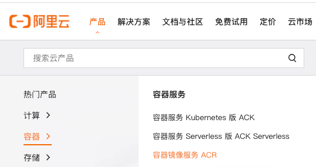
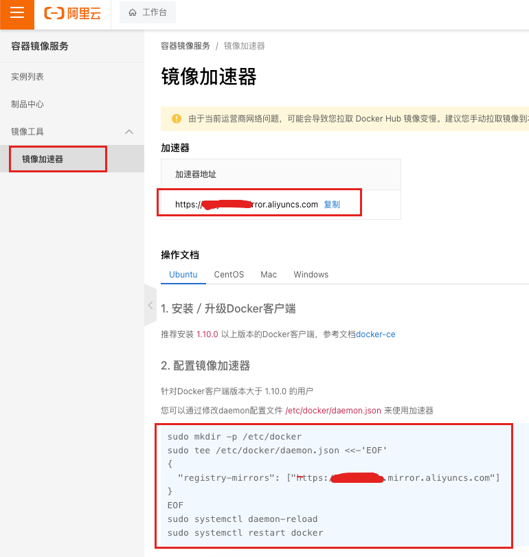
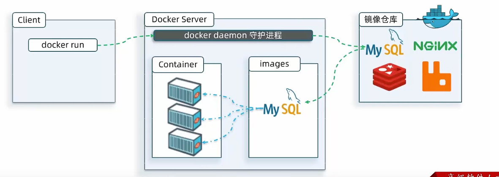
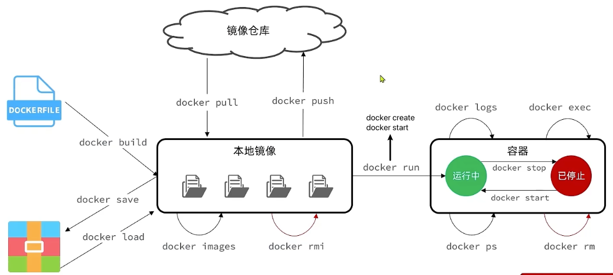
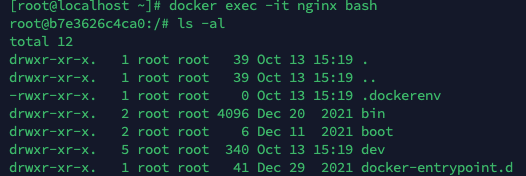
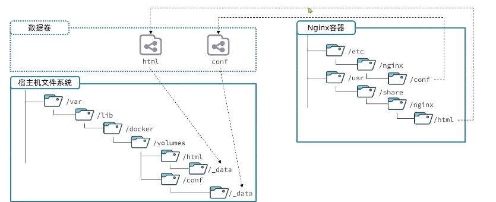
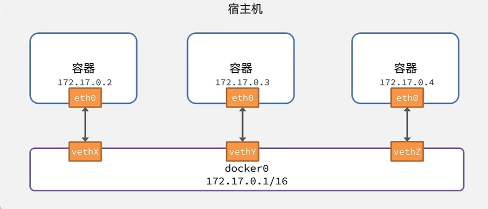

## 安装

可以直接参考[官网](https://docs.docker.com/engine/install/centos/)的安装方式

安装完成之后记得要启动 `docker` 服务

## 配置镜像加速

可以选择使用华为云、阿里云或者腾讯云都可以

1. 登陆阿里云，然后选择 `产品>容器>容器镜像服务ACR`



2. 然后进入到控制台，将命令复制并执行即可



## 安装MySQL

只需要运行一行命令就可以安装MySQL

```shell
docker run -d --name mysql -p 3306:3306  -e TZ=Asia/Shanghai -e MYSQL_ROOT_PASSWORD=123 mysql
```

等待运行完成之后就可以使用 `navicat`等工具连接数据库了。

## 镜像和容器

当我们使用Docker安装应用时，Docker会自动搜索并下载应用**镜像（image）**，镜像不仅包含应用本身，还包含应用运行所需的**环境、配置、系统函数库**。Docker会在运行镜像时创建一个隔离环境，称为**容器（Container）**，这个容器可以理解为一个单独的系统，里面有自己的**文件系统，网络空间，内存空间**等，也就有自己的ip等

镜像仓库：存储和管理镜像的平台，DOcker 官方维护了一个公共仓库：[Docker Hub](https://hub.docker.com)




上面的命令中的含义

+ `docker run` 创建并运行一个容器，`-d`(deamon，进程守护)是让容器在后台运行
+ `--name mysql` 给容器起个名字，必须唯一
+ `-p 3306:3306`（宿主端口:容器端口） 设置端口映射，由于每个容器都是一个独立的空间，外部时不能直接访问到里面的服务的，需要通过设置端口映射来访问，这里的意思就是当前访问虚拟机的3306端口时就映射到mysql容器的3306端口服务
+ `-e KEY=VALUE` 设置环境变量，具体设置哪些环节变量由镜像的制作着决定
+ `mysql` 指定运行的镜像名字，可以在 Docker Hub 上找，实际上这个是可以指定版本的`镜像名字:版本号`，如果不写版本号默认就是`latest`


## docker常用命令

docker最常用的命令就是操作镜像和容器的命令



+ `docker pull` 拉取 docker hub 上的镜像文件
+ `docker images` 查看本地的镜像
+ `docker rmi` 删除本地镜像文件
+ `docker build` 根据 DockerFile 生成镜像文件
+ `docker save` 将镜像文件打包生成压缩包
+ `docker load` 加载镜像文件压缩包
+ `docker push`  将本地镜像文件提交到 docker hub 服务器上，可以是私服的也可以是官方docker hub上
+ `docker create` 创建一个容器
+ `docker start` 启动一个容器服务
+ `docker stop` 停止一个容器服务
+ `docker run` 创建并运行一个容器服务，注意：这个命令每次都会创建一个新的容器，如果已经创建过了容器，而只想要启动容器服务，就使用`docker start`
+ `docker ps` 查看当前运行的容器服务
+ `docker logs` 查看容器运行日志
+ `docker exec` 进入到容器中，需要制定一些参数`docker exec -it 容器名 要使用终端`，`-it`指使用可交互的终端，比如进入 mysql 的容器并使用 bash 终端`docker exec -it mysql bash`
+ `docker rm` 删除容器
+ `docker inspect` 查看容器详情
+ `docker build`通过`Dockerfile`创建镜像

使用上述命令来尝试创建nginx容器，搭建 nginx 服务。首先在 Docker Hub 上查找并拉取nginx镜像

```shell
docker pull nginx
```

然后查看镜像是否下载成功

```shell
docker images
```

如果需要将下载的包给别人可以通过`docker save -o nginx.tar nginx`到处镜像包，然后给别人，之后就可以通过`docker load nginx.tar`加载，而不用重新下载

之后创建并运行 nginx 容器

```shell
docker run -d --name nginx -p 80:80 nginx
```

通过`dcoker ps`命令查看 nginx 容器服务是否开启成功，然后使用`docker logs nginx -f`持续监控 nginx 输出的日志

最后就可以在浏览器上输入虚拟机的 ip 来访问 nginx 服务了。


## 数据卷（volume）

使用`docker exec -it nginx bash`可以进入到 nginx 容器当中，因为每个容器都相当于一个 Linux 系统，所以我们在里面也可以使用 Linux 命令，比如`ls -al`命令查看当前目录。



但是当想使用`vi`编辑器编辑文件的时候就会尴尬的发现`vi`命令是不支持的。虽然通过镜像文件创建的容器有**系统函数库**，但是着仅包含有当前镜像容器所使用到系统函数而已，其他没有使用到的函数库是不会有的。

要解决编辑文件不方便的问题就需要使用**数据卷（volume）**了。

数据卷（volume）是一个虚拟目录，是容器内目录与宿主机目录之间的映射桥梁。可以通过 docker 命令创建***宿主机目录*到*容器内目录*的*双向关联映射***，所谓的`双向关联映射`也就是当前 宿主机目录及文件 发生变化的时候会同步到容器内目录及文件上，同样的当 宿主机内目录及文件 发送变化时也会同步到 宿主机目录及文件上。



### 常用命令

+ `docker volume create`  创建数据卷，会在`/var/lib/docker/volumes`下 创建相关的目录，创建完数据卷之后需要在执行 `docker run`的时候通过使用`-v 数据卷:容器内目录`加载数据卷并关联容器。当创建容器时，如果挂载了数据卷且数据卷不存在，会自动创建数据卷
+ `docker volume ls` 查看所有数据卷
+ `docker volume rm` 删除指定数据卷
+ `docker volume inspect` 查看某个数据卷的详情
+ `docker volume prune` 清楚数据卷

一般情况下创建数据卷都是需要通过`docker run`的时候进行创建并关联。有些容器也会自动创建数据卷，比如说MySQL，在创建容器的时候即使不创建卷，它也会自己创建一个数据卷用来存储数据库数据，之所以不用容器自身的空间来存储是考虑到之后的数据迁移问题。

比如说要进行数据库版本的升级，这样就需要将之前版本的MySQL容器删除掉，之后创建新版本的MySQL容器，不过删除容器，在宿主机的数据卷是不会被删除的，里面的数据还是在的，这一样就很方便做数据的迁移了。只需要再创建新版本MySQL容器的时候指定需要挂载的数据卷就好

不过需要注意的是，生成的数据卷名是随机的，没有规律，所以可以在一开始创建容器的时候就指定数据卷。具体要映射到容器内哪个目录下就需要再 Docker Hub 上查看镜像文件的文档了

比如将MySQL容器的数据目录、配置文件、初始话脚本挂载到指定宿主机目录下，而不是`/var/lib/docker/volumes`下

+ 数据目录：挂载`/root/mysql/data`到容器内的`/var/lib/mysql`目录
+ 初始化脚本：挂载`/root/mysql/init`到容器内的`/docker-enterypoint-initdb.d`目录
+ 配置文件：挂载`/root/mysql/conf`到容器内的`/etc/mysql/conf.d`目录

> 本地目录必须以`/`或者`./`开发，如果直接以名称开头，会被识别成数据卷而非本地目录

那么创建容器的命令就变成了

```shell
docker run -d \
	--name mysql
	-p 3306:3306 \
  -e TZ=Asia/Shanghai \
  -e MYSQL_ROOT_PASSWORD=123 \
  -v /root/mysql/data:/var/lib/mysql
  -v /root/mysql/init:/docker-enterypoint-initdb.d
  -v /root/mysql/conf:/etc/mysql/conf.d
  mysql
```

之后即使要删除MySQL容器创建一个新的容器，只需要运行上面的命令数据也依然还是存在的


## 自定义镜像

镜像就是包含了应用程序、程序运行系统函数库、运行配置等文件的文件包，构建进行的过程其实就是把上述文件打包的过程。

比如要部署一个nodejs web服务应用，那么就需要

1. 准备一个 Linux 服务器
2. 安装 nodejs
3. 拷贝项目到 Linux 服务器上
4. 安装依赖
5. 运行服务

那么构建一个 nodejs 镜像的步骤也就是

1. 准备一个 Linux 运行环境（程序运行系统函数库）
2. 安装 nodejs
3. 拷贝项目到 Linux 服务器上
4. 安装依赖
5. 编写运行脚本

### 镜像结构

镜像的结构其实一种分层的结构，添加安装包、依赖、配置等，每次操作都形成新的一层。其中设置启动脚本这层叫做入口，是镜像运行入口，一般是程序启动的脚和很参数。最底层是基础镜像（BaseImage），包含应用依赖的系统函数库、环境配置、文件等。这种分层结构主要是为了共享相同的镜像，比如基础镜像就是可以进行共享的，构建nodejs服务时需要使用 程序运行系统函数库、nodejs、配置环境遍历等操作，这些操作别人很可能已经做过并打包成了镜像，那么在构建自己的nodejs服务的时候完成可以基于别人的镜像来构建自己的镜像。

### Dockerfile

Dockerfile 就是一个文本文件，其中包含一个个的指令，用指令来说明要执行什么操作来构建镜像。将来Docker可以根据 Dockerfile 帮我们构建镜像。常见的指令如下

| 指令       | 说明                                                         | 示例                     |
| ---------- | ------------------------------------------------------------ | ------------------------ |
| FROM       | 指定基础镜像                                                 | `FROM centos:6`          |
| ENV        | 设置环境变量，可以在后面指令中使用                           | `ENV key=value`          |
| WORKDIR    | 在容器中创建工作目录                                         | `WORKDIR /app`           |
| COPY       | 拷贝本地文件到镜像的指定目录                                 | `COPY package.json ./`   |
| RUN        | 执行linux的shell命令，一般是安装过程的命令                   | `RUN cnpm install`       |
| EXPOSE     | 指定容器运行时监听的端口，是给镜像使用者看的                 | `EXPOSE 8080`            |
| ENTRYPOINT | 镜像中应用的启动命令，容器运行时调用                         | `ENTRYPOINT node app.js` |
| CMD        | 和 RUN 一样是用来运行 shell 命令的，但是一个dockerfile中只能有一个，主要用途是为执行容器提供默认值 | `CMD ['node','app.js']`  |

详细配置与语法在[官网](https://docs.docker.com/engine/reference/builder/#syntax)

假如需要创建一个 nodejs 服务的镜像，那么首先需要一个 nodejs 服务的项目。现在创建一个 nodejs web服务器项目

```shell
mkdir webServer && cd webServer
npm init -y
npm install express
```

```js
// webServer/app.js
// 引入Express模块
const express = require('express');

const PORT = 3000;
const HOST = '0.0.0.0';

// 实例化
const app = express();
app.get('/', (req, res) => {
  res.send('Hello World');
});

// 监听
app.listen(PORT, HOST);
console.log(`Running on http://${HOST}:${PORT}`);
```

然后创建`webServer/Dockerfile`

```dockerfile
# from 构建镜像的基础源镜像 该image镜像文件继承官方的node image
FROM node:10.0

# 设置时区
ENV TZ=Asia/Shanghai
RUN ln -snf /usr/share/zoneinfo/$TZ /etc/localtime && echo $TZ > /etc/timezone

# 在容器中创建并定位到一个工作目录，之后的相对路径都相对于这个目录
WORKDIR /usr/src/app

# RUN/COPY是分层的，package.json 提前，只要没修改就不会重新安装包
# 复制当前 webServer/package.json webServer/package-lock.json 到容器工作目录 /usr/src/app 下
COPY package*.json ./
# 设置 npm 的源
RUN npm install -g cnpm --registry=https://registry.npm.taobao.org
# 安装依赖
RUN cnpm install

# 复制 webServer 下的文件到 /usr/src/app 下
COPY . .

# 暴露当前服务端口给容器
EXPOSE 3000
# 运行服务
CMD ["node", "app.js"]
```

编写完`Dockerfile`文件之后就可以使用`docker build -t 镜像名:版本号 从哪个目录下开始运行(Dockerfile所在目录)`命令来创建镜像了

```shell
docker build -t demo:0.1 .
```

运行镜像创建容器

```shell
docker run -d --name demo -p 3000:3000 demo:0.1
```


## 网络

每个容器都有自己独立的网络空间，容器直接的网络是可以互相访问的，因为默认情况下，所有容器都是以 bridge 方式连接到 Docker 的一个虚拟网桥上的。（Docker 服务在开启的时候也会创建一个虚拟网卡）



比如 mysql 容器的 ip 是`172.17.0.1`，nginx 容器的IP是 `172.17.0.2`，通过 `docker inspect mysql`可以查看容器内的相关信息就可以查看网卡信息了，那么进入其中一个容器通过 ping 命令是可以 ping 通的。但是每次创建容器 ip 都有可能改变。这样之后的访问就不那么方便了。

加入自定义网络的容器后就可以通过容器名互相访问，就不用担心 ip 变化的问题，Docker 的常用网络操作命令如下

| 命令                        | 说明                     |
| --------------------------- | ------------------------ |
| `docker network create`     | 创建一个网络             |
| `docker network ls`         | 查看所有网络             |
| `docker network rm`         | 删除指定网络             |
| `docker network prune`      | 清除未使用的网络         |
| `docker network connect`    | 使指定容器连接加入某网络 |
| `docker network disconnect` | 使指定容器连接离开某网络 |
| `docker network inspect`    | 查看网络详细信息         |

除了上面这些方式创建还可以在运行 容器的时候通过`--network xxx`指定，这样容器就不会创建默认的网卡，不过需要注意的是之后容器间访问服务就需要使用 网络名 来访问了，比如 MySQL 容器的网络命名为 ms，那么在 demo 容器下要访问 MySQL 服务就是`ms:3306`


## docker-compose

如果要部署一个 web商城项目 可以需要依次创建多个容器，比如 数据库容器`mysql`、服务器容器`nodejs`、反向代理容器`nginx`（前端、后台），因为容器能直接访问，那么还需要创建网络空间，这一系列步骤都太过繁琐，而 docker-compose 就能帮我们将这一系列动作自动完成，而且还方便管理

Docker Compose 通过一个单独的 `docker-compose.yml`模板文件（YAML 格式）来定义一组相关联的应用容器，实现多个互相关联的 Docker 容器的快速部署。

````yaml
# 使用的YAML语法的版本
version: "3.8"
# 对于 docker-compose 来说每个 容器都是一个服务
services:
	mysql: # 服务名
		image: mysql # 使用的镜像
		container_name: mysql # 容器名字
		ports: # 端口映射
			- "3306:3306"
		environment: # 环境变量 
			TZ: Asia/Shanghai
			MYSQL_ROOT_PASSWORD: 123
		volumes: # 数据卷映射
      - "./mysql/data:/var/lib/mysql"
      - "./mysql/init:/docker-enterypoint-initdb.d"
      - "./mysql/conf:/etc/mysql/conf.d"
     networks: # 加入到 my-net 网络
     	- my-net
	nodeServer: 
		build: # 根据当前目录下的 Dockerfile 文件构建镜像并使用
			context: .
			dockerfile: Dockerfile
		container_name: webServer
		ports:
			- "3000:3000"
		networks:
			- my-net
		depends_on: # 该服务依赖于 mysql 服务，当 mysql 服务创建完毕之后才会运行当前服务
			- mysql
	nginx: 
		image: nginx
		container_name: nginx
		ports:
			- "8080:8080"
			- "8081:8081"
		volumes:
			- "./nginx/nginx.conf:/etc/nginx/nginx.conf"
			- "./nginx/html:/usr/share/nginx/html"
		networks:
		 - my-net
		depends_on:
			- nodeServer
networks: # 开始的时候先创建 网络空间
	my-net:
		name: ms
````

其实 `services` 下面的每个容器的参数都是和`docker run`后面接的参数一一对应的，[在这](https://docs.docker.com/compose/)可以查看详细配置

之后就可以通过`docker compose [OPTIONS] [COMMAND]` 命令来启动了

`[OPTIONS]`

+ `-f` 指定 compose 文件的路径和名称
+ `-p` 指定 project 的名称

`[COMMAND]`

+ `up` 创建并启动所有 service 容器
+ `down` 停止并移除所有容器、网络
+ `ps` 列出所有启动的容器
+ `logs` 查看指定容器的日志
+ `stop` 停止容器
+ `start`启动容器
+ `restart`重启容器
+ `top`查看运行的进程
+ `exec` 在指定的运行中容器中执行命令

```shell
docker compose up -d
```