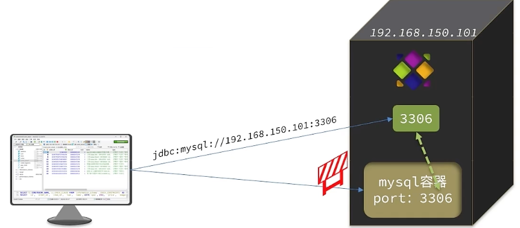

## 安装

可以直接参考[官网](https://docs.docker.com/engine/install/centos/)的安装方式

安装完成之后记得要启动 `docker` 服务

## 配置镜像加速

可以选择使用华为云、阿里云或者腾讯云都可以

1. 登陆阿里云，然后选择 `产品>容器>容器镜像服务ACR`


2. 然后进入到控制台，将命令复制并执行即可


## 安装MySQL

只需要运行一行命令就可以安装MySQL

```shell
docker run -d --name mysql -p 3306:3306  -e TZ=Asia/Shanghai -e MYSQL_ROOT_PASSWORD=123 mysql
```

等待运行完成之后就可以使用 `navicat`等工具连接数据库了。

## 镜像和容器

当我们使用Docker安装应用时，Docker会自动搜索并下载应用**镜像（image）**，镜像不仅包含应用本身，还包含应用运行所需的**环境、配置、系统函数库**。Docker会在运行镜像时创建一个隔离环境，称为**容器（Container）**，这个容器可以理解为一个单独的系统，里面有自己的文件系统，网络空间，内存空间等，也就有自己的ip等

镜像仓库：存储和管理镜像的平台，DOcker 官方维护了一个公共仓库：[Docker Hub](https://hub.docker.com)


上面的命令中的含义

+ `docker run` 创建并运行一个容器，`-d`(deamon，进程守护)是让容器在后台运行
+ `--name mysql` 给容器起个名字，必须唯一
+ `-p 3306:3306`（宿主端口:容器端口） 设置端口映射，由于每个容器都是一个独立的空间，外部时不能直接访问到里面的服务的，需要通过设置端口映射来访问，这里的意思就是当前访问虚拟机的3306端口时就映射到mysql容器的3306端口服务
+ `-e KEY=VALUE` 设置环境变量，具体设置哪些环节变量由镜像的制作着决定
+ `mysql` 指定运行的镜像名字，可以在 Docker Hub 上找，实际上这个是可以指定版本的`镜像名字:版本号`，如果不写版本号默认就是`latest`




## docker常用命令

docker最常用的命令就是操作镜像和容器的命令


+ `docker pull` 拉取 docker hub 上的镜像文件
+ `docker images` 查看本地的镜像
+ `docker rmi` 删除本地镜像文件
+ `docker build` 根据 DockerFile 生成镜像文件
+ `docker save` 将镜像文件打包生成压缩包
+ `docker load` 加载镜像文件压缩包
+ `docker push`  将本地镜像文件提交到 docker hub 服务器上，可以是私服的也可以是官方docker hub上
+ `docker create` 创建一个容器
+ `docker start` 启动一个容器服务
+ `docker stop` 停止一个容器服务
+ `docker run` 创建并运行一个容器服务，注意：这个命令每次都会创建一个新的容器，如果已经创建过了容器，而只想要启动容器服务，就使用`docker start`
+ `docker ps` 查看当前运行的容器服务
+ `docker logs` 查看容器运行日志
+ `docker exec` 进入到容器中，需要制定一些参数`docker exec -it 容器名 要使用终端`，`-it`指使用可交互的终端，比如进入 mysql 的容器并使用 bash 终端`docker exec -it mysql bash`
+ `docker rm` 删除容器

使用上述命令来尝试创建nginx容器，搭建 nginx 服务。首先在 Docker Hub 上查找并拉取nginx镜像

```shell
docker pull nginx
```

然后查看镜像是否下载成功

```shell
docker images
```

如果需要将下载的包给别人可以通过`docker save -o nginx.tar nginx`到处镜像包，然后给别人，之后就可以通过`docker load nginx.tar`加载，而不用重新下载

之后创建并运行 nginx 容器

```shell
docker run -d --name nginx -p 80:80 nginx
```

通过`dcoker ps`命令查看 nginx 容器服务是否开启成功，然后使用`docker logs nginx -f`持续监控 nginx 输出的日志

最后就可以在浏览器上输入虚拟机的 ip 来访问 nginx 服务了。


## 数据卷（volume）

使用`docker exec -it nginx bash`可以进入到 nginx 容器当中，因为每个容器都相当于一个 Linux 系统，所以我们在里面也可以使用 Linux 命令，比如`ls -al`命令查看当前目录。


但是当想使用`vi`编辑器编辑文件的时候就会尴尬的发现`vi`命令是不支持的。虽然通过镜像文件创建的容器有**系统函数库**，但是着仅包含有当前镜像容器所使用到系统函数而已，其他没有使用到的函数库是不会有的。

要解决编辑文件不方便的问题就需要使用**数据卷（volume）**了。

数据卷（volume）是一个虚拟目录，是容器内目录与宿主机目录之间的映射桥梁。可以通过 docker 命令创建***宿主机目录*到*容器内目录*的*双向关联映射***，所谓的`双向关联映射`也就是当前 宿主机目录及文件 发生变化的时候会同步到容器内目录及文件上，同样的当 宿主机内目录及文件 发送变化时也会同步到 宿主机目录及文件上。


### 常用命令

+ `docker volume create`  创建数据卷，会在`/var/lib/docker/volumes`下 创建相关的目录，创建完数据卷之后需要在执行 `docker run`的时候通过使用`-v 数据卷:容器内目录`加载数据卷并关联容器。当创建容器时，如果挂载了数据卷且数据卷不存在，会自动创建数据卷
+ `docker volume ls` 查看所有数据卷
+ `docker volume rm` 删除指定数据卷
+ `docker volume inspect` 查看某个数据卷的详情
+ `docker volume prune` 清楚数据卷
