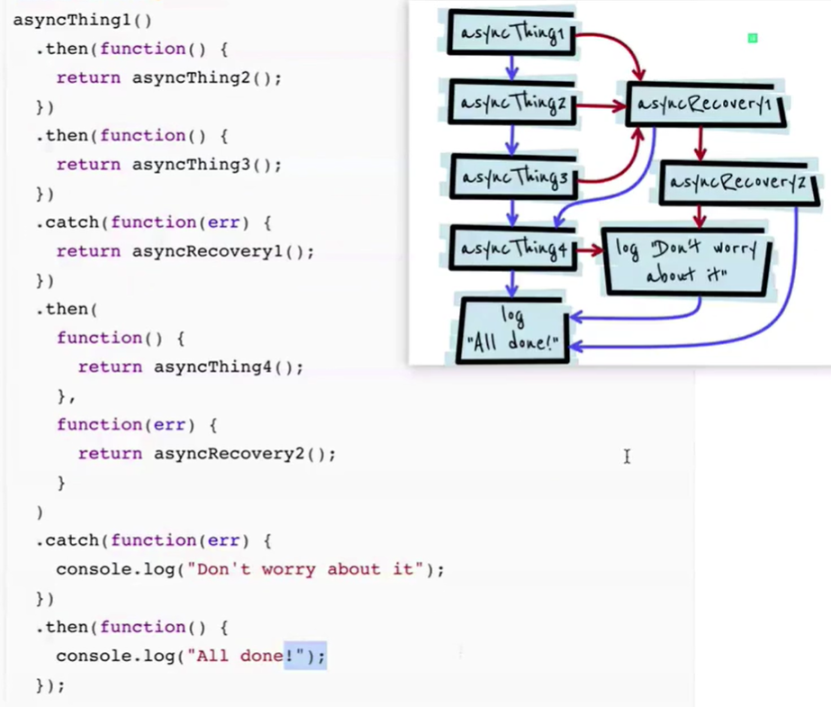

## **es6/es2016/ecmascript**

## **let和const的特点**

> (1)存在块级作用域
>
> ```javascript
> {
>   let i=0;
>   console.log(i)
>   {
>       let i=1;
>       console.log(i)
>   }
> }
> 
> 在es6之前想要使用块级作用域常用IIFE实现
> (function(){
> //TODO...
> })()
> ```
>
> (2)没有预解析、变量提升
>
> ```javascript
> console.log(a);//undefined
> var a=1;
> 
> console.log(b);//报错，这里存在一个TDZ（暂时性死区）行1-4
> let b=1;//暂时性死区解除
> ```
>
> (3)不能重复定义变量(同一作用域中)，const（常量）不能修改值（栈中值的内存地址），也就是栈存储的变量不能修改，但是栈堆存储的变量是可以修改的，并且定义常量的时候就需要赋值，不能后赋值。如果想要栈堆存储的变量也不能修改可以使用es6的Object.freeze()
>
> ```javascript
> const a=6;
> a=3;
> console.log(a);//报错
> 
> const b={name:"jack",age:12};
> b={name:"jack",age:33};//报错
> b.age=33;//成功
> 
> const c=Object.freeze({name:"jack",age:12});
> c={name:"jack",age:33};//报错
> c.age=33;//报错
> ```
>
> (4)for循环，for循环里（）是父级作用域，里面的{}是子级作用域
>
> 所以在下面代码中输出的会使3个abc
>
> ```javascript
> for(let i=0,i<3;i++){
> let i='abc';
> console.log(i)
> }
> ```
>
> (5)使用var定义的全局变量是属于window的，但是let和const定义的不是


## **解构赋值**

> (1)对象解构
>
> ```javascript
> let json={
>   name:'jack',
>   age:12
> }
> 
> let {name,age,v,m}=json;
> console.log(name,age,v);//jack 12 undefined
> //给age起一个别名，m不存在时设置默认值
> let {name,age:k,m='默认'}=json
> console.log(name,k,m);//jack 12 默认
> ```
>
> 结构赋值修改变量名
>
> ```js
> let {name,age:k,m='默认'}=json
> console.log(name,k,m);//jack 12 默认
> ```
>
> 连续解构赋值
>
> ```js
> let obj={
>   a:{
>     b:{
>       c:1
>     }
>   }
> }
> 
> let {a:{b:{c}}}=obj
> console.log(c)//1
> //并且可以联合改名使用
> let {a:{b:{c:data}}}=obj
> console.log(data)//1   但是需要注意的使用只能使用data了，其他的变量都不能使用
> ```
>
> **注意**
>
> ```js
> //在对象解构中，先定义变量然后再解构需要使用（），不然可能会被当成是块
> let name,age,v;
> ({name,age,v}=json)
> ```
>
> 
>
> (2)数组解构
>
> ```javascript
> let arr=['app','com','kk'];
> let [a,c,k,b=3]=arr;//当b没有赋值为undefined时设置默认值
> console.log(a,c,k,b);//app com kk 3
> 
> //在数组解构中，先定义变量然后再解构可以直接进行
> let a,c,k,b;
> [a,c,k,b=3]=arr;
> ```

**应用：**

```javascript
//交换数值
let a=1,b=2;
[a,b]=[b,a];

//函数设置默认值;
//{a='默认1',b='默认'2}={}并不是解构而是函数参数设置默认值
function show({a='默认1',b='默认'2}={}){
  console.log(a,b);
}
let a={a=1};
let b={a=1,b=2};
let c={};

show(a);//1 默认2
show(b);//1 2
show(c);//默认1 默认2
```


## **字符串模板**

使用 `` 包裹内容，允许换行，插值时使用${a} 就行了

  ```javascript
let a=36;
let str=`a=${a}`
console.log(str);//a=36
  ```

​	es6中新增的字符串方法

```javascript
//判断字符串是否包含某个字符
let str='aaa kkk ccc';
console.log(str.includes('kkk'));//true，不存在返回false
console.log(str.indexOf('kkk'));//es5中，4，不存在返回-1

//判断是否已xxx开头；一般用来检测地址
let str1='http://www.baidu.com';
let str2='xxx.png';
console.log(str1.startsWith('http'));//true
console.log(str2.startsWith('http'));//false
//判断是否已xxx结尾；一般用来检测后缀
console.log(str1.endsWith('png'));//false
console.log(str2.endtsWith('png'));//true

//重复字符串
let str4='-'
str4.repeat(3);//---

//填充字符串
str.padStart(长度，内容);//往前填充，这里的长度代表的是填充完成之后的总长度
str.padEnd(长度，内容);//往后填充，这里的长度代表的是填充完成之后的总长度
```


## **函数的变化**

> （1）设置参数的默认值
>
> ```javascript
> //传统的设置默认值的
> function show1(a=0,b=0){
> console.log(a,b)
> }
> show1();//0 0
> show1(2);//2 0
> show(2,2);//2 2
> 
> //解构赋值的方式设置默认值
> function show1({a=0,b=0}={}){
> console.log(a,b)
> }
> show1();//0 0
> show1({a:2});//2 0
> show({a:2,b:2});//2 2
> ```
>
> （2）扩展运算符/剩余运算符‘…’
>
> ```javascript
> //适用于数组,同样适用于对象
> var a={b:1,c:5};
> var b={...a};
> //接收函数参数
> function show(...res){
> console.log(res);
> }
> show(1,3,2);//[1,3,2]
> 
> function show1(a,b,...res){
> console.log(a,b,res)
> }
> show1(1,2,3,4);//1 2 [3,4]
> 
> function show2(res){
> console.log(...res);
> }
> show2([1,2,3,4]);//1,2,3,4
> 
> //复制数组
> let arr=[1,2,3];
> let arr2=[...arr];
> ```
>
> 将伪数组转化成数组可以使用扩展运算符或者`Array.from(arr)`，又或者是`[].slice.call(arr)`,对于Array.from(arr)，只要arr中用length属性就可以转化成数组，如字符串，对象{a:1,b:2,length:2}.

> （3）箭头函数
>
> a. 箭头函数的this是继承于父作用域中的this（定意思函数所在的对象，不是运行时的所在对象）
>
> b. 箭头函数中没有arguments，可以用…res来接收参数
>
> c. 箭头函数不能作为构造函数
>
> ```js
> let x = 11;
> let a = {
>     x:22,
>     say:function(){
>         console.log(this.x);
>     }
> }
> let fun1 = a.say;
> fun1();//输出的是11，对于普通的函数可以理解为fun1.call(window);
> a.say();//输出的是22，对于普通的函数可以理解为a.say.call(a);
> 
> let y = 33;
> let b = {
>     y:44,
>     say:()=>{
>         console.log(this.y);
>     }
> }
> let fun2 = b.say;
> fun2();//输出的是33
> b.say();//输出的是33
> ```
>
> 对于普通的函数，this是在函数执行的时候再确定的；而对于箭头函数，this是在定义的时候就确定了，因为箭头函数没有自己的this，所以会往上一层去找this，在上面的代码中b.y和b.say是平级的关系，而不是父子关系，所以在b.say中的this应该指向window。


## **数组新增方法**

（1）arr.forEach()

>
   > ```javascript
   > //循环遍历数组，接收两个参数第一个回调函数，第二个是this指向（可以使用bind修改）,当回调函数是箭头函数的时候第二个参数会失效
   > arr.forEach(function(item,index,arr){
   >   console.log(item)
   > },window)
   > ```

   > （2）arr.map()
>
   > ```javascript
   > //在不使用return返回的时候是和forEach一样的，这个函数会返回一个新的数组并且不用return返回的是undefined
   > let arr=[1,2,3]
   > let arr2=arr.map(function(item,index,arr){
   >   return item++;
   > },window)
   > console.log(arr2);//[2,3,4]
   > ```

   > （3）arr.filter()
   >
   > ```javascript
   > //筛选出符合条件的数据，返回一个新数组，当回调函数返回的是true就留下
   > let arr=[1,2,3]
   > let arr2=arr.map(function(item,index,arr){
   > return item>1;
   > },window)
   > console.log(arr2);//[2,3]
   > ```
   >
   > （4）arr.some()
   >
   > ```javascript
   > //在数组中找到满足条件的第一个值，找到了就返回true，并停止循环，其实与arr.includes(元素)差不多
   > let arr=[1,2,3]
   > let arr2=arr.some(function(item,index,arr){
   > return item>1;
   > },window)
   > console.log(arr2);//true
   > ```
   >
   > （5）arr.every()
   >
   > ```javascript
   > //当数组中的元素全部满足条件时返回true，否则返回false
   > let arr=[1,2,3]
   > let arr2=arr.every(function(item,index,arr){
   > return item>1;
   > },window)
   > console.log(arr2);//false
   > ```
   >
   > （6）arr.find():找到并返回第一个符合条件的元素，没有就返回undefined
   >
   > （7）arr.findIndex():找到并返回第一个符合条件的元素的索引，没有就返回-1
   >
   > （8）arr.reduce()
   >
   > ```javascript
   > //从左往右计算,同样接收两个参数，回调和初始值，但是回调的参数有四个
   > //prev：上一个计算结果，默认为第一个元素
   > //cur：当前的元素
   > //index：元素索引
   > //arr：元数组
   > let arr=[2,2,3];
   > let k=arr.reduce(function(prev,cur,index,arr){
   > return prev+cur;
   > })
   > console.log(k);//6
   > ```
   >
   > （9）arr.reduceRight()
   >
   > ```javascript
   > //从右往左计算
   > let arr=[2,2,3];
   > let k=arr.reduce(function(prev,cur,index,arr){
   > return prev+cur;
   > })
   > console.log(k);//6
   > ```
   >
   > （10）for…of
   >
   > ```javascript
   > //用于遍历带有接口（）的可遍历对象，一般为数组
   > let a=[1,2,3];
   > for(let k of a){
   > console.log(k);//1 2 3
   > }
   > for(let k of a.keys()){
   > console.log(k);//0 1 2
   > }
   > for(let k of a.values()){
   > console.log(k);//1 2 3
   > }
   > for(let k of a.entries()){
   > console.log(k);//[0,1] [1,2] [2,3]
   > }
   > for(let [k,v] of a.entries()){
   > console.log(k);//[0,1] [1,2] [2,3]
   > }
   > ```
   >
   > （11）arr.flat(n);
   >
   > ```javascript
   > //将多维数组拉平,n为要怕平的层数，n为infinity是拉平全部
   > let arr=[1,[2,3],[4,[5,[6]]]];
   > console.log(arr.flat())//[1, 2, 3, 4, [5,[6]]]
   > console.log(arr.flat(2))//[1, 2, 3, 4, 5, [6]]
   > console.log(arr.flat(Infinity))//[1, 2, 3, 4, 5, 6]
   > ```
   >
   > (13) flatMap
   >
   > ```js
   > //和map方法相似，但是如果返回的是数组就会进行自动拉平操作
   > let arr = ["hello world","jack and rocy"];
   > let res = arr.flatMap((item)=>{
   >   return item.split(" ");
   > })
   > console.log(res);//["hello","world","jack","and","rocy"]
   > ```
   >
   > （12）arr.fill();
   >
   > ```javascript
   > //对数组进行填充arr.fill(内容，开始位置，接收位置);
   > let arr=Array(10);
   > console.log(arr.fill('k',3,5))//[empty × 3, "k", "k", empty × 5]
   > ```
   >
   > 

## **对象简洁语法**

（1）当对象的键和值名相同是可以省略值变量名

```javascript
let name='jack',age=12,
let json={
  name,
  age,
  show(){  //等同于show:function(){};在json数据中不要使用箭头函数，因为他会指向到window
    console.log(this.name);
  }
}
```

（2）Object.is(val1,val2)，判断两个值是够相等，可以是数字、字符串、数组、NaN、对象

```javascript
console.log(Object.is(NaN,NaN));//true
console.log(Object.is({a:1},{a:1}));//false
console.log(Object.is([1],[1]));//false
console.log(Object.is(+0,-0));//false

console.log(NaN==NaN);//false
console.log({a:1}=={a:1});//false
console.log([1]==[1]);//false
console.log(+0==-0);//true
```

（3）Object.assign(目标，内容)，合并对象

```javascript
//主要的应用是合并参数和复制对象
//合并参数
function fn(options){
  let default={
  	name:'jack',
    age:12,
      .....
	}
  let json=Object.assign({},default,options);//如果default和options有相同的属性，后面的会将前面的覆盖
}

//复制对象,也可以使用扩展运算符实现
let obj1={a:1,b:2};
let obj2={b:3,c:4};
let obj=Object.assign({},obj1,obj2)
console.log(obj)//{a: 1, b: 3, c: 4}
```

（4）Object.keys()	Object.values()	Object.entries()

```javascript
let {keys,values,entries,fromEntries}=Object;
for(let k of entries({a:1,b:2})){
  console.log(k)//[['a',1],['b',2]]
}
console.log(fromEntries([['a',1],['b',2]]));//{a:1,b:2}
```


> **其他的一些方法**
>
> + `Object.getPrototypeOf(obj)`：获取对象的原形对象，效果同 `Object.prototype` 和 `obj.__proto__`;
> + `Object.setPrototypeOf(obj,{a:1})`：设置对象的原形对象，效果同 `Object.prototype={a:1}` 和 `obj.__proto__={a:1}`;
> + `Object.isExtensible(obj)`：判断对象是否可扩展
> + `Object.freeze(obj)`：冻结对象，不可修改，删除，添加，可访问遍历
> + `Object.seal(obj)`：封闭对象，不可删除，添加，可修改，访问遍历
> + `Object.getOwnPropertyNames(obj)`：获取对象自己的属性，不包含原形链上的
> + `Object.preventExtensions(obj)`：禁止对象扩展
> + `Object.defineProperty(obj)`：拦截对象自身属性操作
> + `obj.hasOwnProperty("a")`：判断自身属性上有没有 a
> + `'a' in obj`：判断有没有属性 a，包含原形上的。

## **Promise**

1.promise的主要作用是为了解决回调地狱的，定义的promise宏任务，但是他的then，catch是微任务

```js
//resolve是成功的状态通过then的第一个参数（回调）或取结果，reject是失败的状态，通过then的二个参数获取返回结果，或者可以通过catch。要注意的是promise的状态一但改变了就不会再次更改业绩就是resolve和reject只会执行一个。
let a=5
let p1=new Promise((resolve,reject)=>{
if(a>=5){
  resolve('success');
}else{
 reject('error');
}
console.log('end')//end
})

p1.then(res=>{
  console.log(res);//success
},err=>{
  console.log(err)
})
a=3
p1.then(res=>{
  console.log(res);//success,这里a=3<5为什么不是error？因为p1的promise对象在a=5时状态就已经改变为resolve了之后就不会改变了。
}).catch(err=>{
  console.log(err);
})

let p2=new Promise((resolve,reject)=>{
  if(a>=5){
    resolve('success');
  }else{
    reject('error');
  }
})
p2.then(res=>{
  console.log(res)
}).catch(err=>{
  console.log(err);//error
})

//将现有的东西快速转化成promise对象
Promise.resolve('success');
//等价于
new Promise(resolve=>resolve('success'))

Promise.reject('error');
//等价于
new Promise((resolve,reject)=>{reject('success')})
```

promise打包，批量处理promise

```js
//可以使用Promise.all(promise数组)，Promise.race(promise数组)
//Promise.all(promise数组):这种形式的必须确保所有的promise对象都是resolve状态（成功）
//Promise.race(promise数组):只要有一个成功就返回
let p1=Promise.resolve('p1');
let p2=Promise.resolve('p2');
let p3=Promise.reject('p3');

Promise.all([p1,p2]).then(res=>{console.log(res)}).catch(err=>{console.log(err)});//["p1", "p2"]
Promise.race([p1,p2,p3]).then(res=>{console.log(res)}).catch(err=>{console.log(err)});//p1
```

**需要注意的是 `then(resh,rejh)`的 第二个函数处理（错误处理）， 和 catch 的区别。`rejh`只对当前 promise 负责，即只会捕获当前promise 的错误，catch 会捕获之前链路上所有 promise 的错误。**




## **模块化**

在es6之前，也有模块化规范
规范|实现或应用
:---:|:---:
CommonJS|NodeJS、webpack(主要应用于服务器端)
AMD|requireJS，curlJs(主要应用于浏览器端)
CMD|SeaJS(主要应用于浏览器端)

**使用**

实现|模块定义|加载模块
:---:|:---:|:---:
NodeJS|module.exports={}/exports.属性名=…|var  m=require('./myModel.js');
requireJS|define(id?, dependencies?, factory);|require([dependencies], function(){});
SeaJS|define(function(require, exports, module){})|seajs.use(['myModule.js'],function(my){});

1. id：可选参数，用来定义模块的标识，如果没有提供该参数，脚本文件名（去掉拓展名）
2. dependencies：是一个当前模块依赖的模块名称数组
3. factory：工厂方法，模块初始化要执行的函数或对象。如果为函数，它应该只被执行一次。如果是对象，此对象应该为模块的输出值

function参数意义

1. require 是一个方法，接受 模块标识 作为唯一参数，用来获取其他模块提供的接口：require(id)
2. exports 是一个对象，用来向外提供模块接口
3. module 是一个对象，上面存储了与当前模块相关联的一些属性和方法


**区别**

1. commonjs是同步的，AMD和CMD是异步的

2. AMD推崇依赖前置，在定义模块的时候就要声明其依赖的模块

3. CMD推崇就近依赖，只有在用到某个模块的时候再去require

   AMD和CMD最大的区别是对依赖模块的执行时机处理不同，注意不是加载的时机或者方式不同

   同样都是异步加载模块，AMD在加载模块完成后就会执行改模块，所有模块都加载执行完后会进入require的回调函数，执行主逻辑，这样的效果就是依赖模块的执行顺序和书写顺序不一定一致，看网络速度，哪个先下载下来，哪个先执行，但是主逻辑一定在所有依赖加载完成后才执行

   CMD加载完某个依赖模块后并不执行，只是下载而已，在所有依赖模块加载完成后进入主逻辑，遇到require语句的时候才执行对应的模块，这样模块的执行顺序和书写顺序是完全一致的

   这也是很多人说AMD用户体验好，因为没有延迟，依赖模块提前执行了，CMD性能好，因为只有用户需要的时候才执行的原因

   

在ES6之后提供了模块化的功能，但是模块化的这个功能需要在服务器环境中使用(可以使用`npx serve`在当前文件夹中开启一个临时的服务器来做测试)

要使用模块化功能需要定义script标签的type=“module”

**定义模块**

```javascript
//m.js
//export 内容
//export {
//	内容 as 别名
//}
//当使用别名的时候导入也要按别名导入
const a=12;
const b=13;
//export const a=12;
//export a;	导入：import {a} form './m.js';

export { 
	a as aaa,
  b as bbb
}
//导入：import {aaa,bbb} form './m.js';
//导入也可以起别名如 import * as all form './m.js';
//								import {aaa as a,bbb} form './m.js';

export default 12;//这种形式的在js文件中只能使用一次导入时就不用使用{}直接就是：import k form './m.js';其实也就是导出的时候将12 赋值给了defalut 然后import的时候默认的就是将default赋值给k。

//当既有export也有export defalut时导入
//import k,{aaa as a,bbb} form './m.js';
```

**导入模块**

```html
<script type='module'>
	import './m.js';//这样是导入整个文件
	import k,{aaa as a,bbb} form './m.js';
  
 	//也可以导入在线文件
  import 'https://code.jquery.com/jquery-3.3.1.js';
  //也可以使用import()函数按需要导入
  if(k){
    import('./a');
  }
</script>
```

在一个js文件中要导入其他js问价中的变量之后导出可以使用合并句子

```js
export {a,b} from "./m.js";
//import {a,b} from "./m.js";
//export {a,b}
```


**特点**

a). import 可以是相对路径，也可以是绝对路径
			import 'https://code.jquery.com/jquery-3.3.1.js';
b). import模块只会导入一次，无论你引入多少次
c). import './m.js';  如果这么用，相当于引入文件
d). 有提升效果，import会自动提升到顶部，首先执行
e). 导出去模块内容，如果里面有定时器更改，外面也会改动，不想Common规范缓存


import()  类似node里面require， 可以动态引入, 默认import语法不能写到if之类里面
返回值，是个promise对象

```javascript
import('./m.js').then(res=>{
	console.log(res.aaa+res.bbb);//25
  console.log(res.default);//12
});
```

**优点**:

1. 按需加载

2. 可以写if中

3. 路径也可以是动态的


## 类和继承

在es5中有一些原生的构造函数，这些构造函数在es5中是不能继承的，但是在es6中是可以继承的

```js
//原生构造函数
Boolean
Number
String
Array
Date
Function
RegExp
Error
Object

class myArray extends Array{
  constructor(){
    super();
  }
}
```


在es6的类和继承没有出来之前是使用构造函数和原形链来实现的

   定义类

   ```javascript
   function Person(name,age){
     this.name=name;
     this.age=age;
   }
   
   Person.prototype.showName=function(){
     console.log(this.name);
   }
   //这个也可以使用Object.assign();来实现
   Object.assign(Person.prototype,{
     showName(){
       console.log(this.name);
     },
     ...
   })
   
   ```

   类主要包括属性和方法，继承主要针对的也是这两个东西进行

   ```javascript
   //一般使用组合继承的方式实现组合继承
   //组合继承：指的是将原型链和借用构造函数的技术组合到一起。思路是使用原型链实现对原型方法的继承，而通过借用构造函数来实现对实例属性的继承。这样，既通过在原型上定义方法实现了函数的复用，又能够保证每个实例都有它自己的属性。
   function Person(){
     function SuperType(name){
         this.name=name;
         this.colors=["red", "blue", "green"];
   }
   SuperType.prototype.sayName=function(){
         alert(this.name);
   };
   function SubType(name, age){
         //继承属性    使用借用构造函数实现对实例属性的继承
         SuperType.call(this,name);
         this.age=age;
   }
   //继承方法     使用原型链实现
   SubType.prototype=new SuperType();//继承父类中的属性和方法，但是会覆盖原有的prototype，使其失去constructor
   SubType.prototype.constructor=SubType;//重新添加constructor；
   subType.prototype.sayAge=function(){
         alert(this.age);
   };
   var instance1=new SubType("mary", 22);
   instance1.colors.push("black");
   alert(instance1.colors);   //red,blue,green,black
   instance1.sayName();  //mary
   instance1.sayAge();  //22
   
   var instance2=new SubType("greg", 25);
   alert(instance2.colors);   //red,blue,green
   instance2.sayName();  //greg
   instance2.sayAge();  //25
   }
   ```

   在es6总就不需要那个麻烦了，可使用extend实现继承

   定义类：这种形式是没有提升(预解析)的，需要先定义后使用

   ```javascript
   //const Person=class{...}，声明形式
   const method='method';
   class Person{
     //构造方法，调用new时自动执行
     constructor(name,age){
       this.name=name;
       this.age=age;
       
       this.showName=this.showName.bind(this);//保证被解构出去使用的时候this还是指向实例对象
     }
     showName(){
       return `名字是${this.name}`;
     }
     showAge(){
       return `名字是${this.age}`;
     }
     [method](){
       return `这是method`;
     }
     //静态方法，只能被Person访问	Person.showMe()
     static showMe(){
       return `静态方法showMe`;
     }
     // set用于设置对象中的数据,通过-实例对象.sex='ssss',设置变量
   	set Sex(value){
   		this.sex=value;
   	}
    // get用于获取对象中的数据,通过-实例对象.sex,返回变量
   	get Sex(){ 
   		return this.sex;
   	}
   }
   ```

   实现继承

   ```javascript
   //子类
   //extends 继承
   class Student extends Person{
     //这里相当于es5的Person.call(this,name,age);
     //constructor(args){//args是子类中传入的全部参数
     //   super(args);//将全部参数分发到父类中，super其实可以看成是Person
     // }
     constructor(name,skill){
       super(name);
       this.skill=skill;
     }
     //使用和父类相同的方法名
     showName(){
       super.showName();//父类中的方法执行
       console.log('子类中的showName')
     }
     showSkill(){
       return `我的技能是${this.skill}`
     }
   }
   ```

在es6中也提供了一个`new.target`属性，这个属性会在实例化类的时候被赋值，值为所实例的类，如果在父类中输出`new.target`，但是实例化的是其子类的话，那么值还是子类.

**super**：在继承的子类的构造函数中必须调用一次，当**作为函数调用**的时候就是相当于调用了父类的够着函数并且将父类中的this指向到子类中，当**作为对象使用**的时候有两种情况一种是在普通方法中使用的时候super就是父类的原形对象；在静态方法中使用的时候super就是指父类。

```javascript
class Point{
  constructor(){
    console.log(new.target);
  }
}
let p=new Point();//class Point(){....}

function Point(){
	  console.log(new.target);
}
let p=Point();//undefined
let p2=new Point();//function Point(){...}

class A{
  constructor(){
    console.log(new.target);
  }
}
class B extends A{
  constructor(){
    super()
  }
}
let b=new B();//class A{...}
```


**new操作中发生了什么？**

在new一个对象的时候会最一下三个步骤

**创建一个空对象，将它的引用赋给 this，继承函数的原型**
**通过 this 将属性和方法添加至这个对象 **
**最后返回 this 指向的新对象，也就是实例（如果没有手动返回其他的对象）**

```js
// ES5构造函数
let Parent = function (name, age) {
    //1.创建一个新对象，赋予this，这一步是隐性的，
    // let this = {};
    //2.给this指向的对象赋予构造属性
    this.name = name;
    this.age = age;
    //3.如果没有手动返回对象，则默认返回this指向的这个对象，也是隐性的
    // return this;
};
const child = new Parent();
```

自定义一个new方法

```js
//自己定义的new方法
let newMethod = function (Parent, ...rest) {
    // 1.以构造器的prototype属性为原型，创建新对象；
    let child = Object.create(Parent.prototype);
    // 2.将this和调用参数传给构造器执行
    Parent.apply(child, rest);
    // 3.返回第一步的对象
    return child;
};
```


## **symbol**

**Symbol**

在es6之前有6中基本数据类型为：undefined，number，string，boolean，null，object

在es6之后增加一个数据类型为symbol：

symbol有以下的几个特点：

  1.  使用:`let syml=Symbol('aaa')`;
  2.  Symbol不能new
 3.  Symbol返回一个唯一的值

作用是作为一个对象的key，定义一些唯一或者私有的一些东西

> 如果要定义私有属性，除了使用 `Symbol`外还可以使用`#`，比如
>
> ```js
> class A{
>   #age = 12;
>   #haha(){
>     console.log("haha");
>   }
>   sayAge(){
>     this.#haha();
>     console.log(this.#age);
>   }
> }
> ```

```javascript
let syml1=Symbol('aaa');
let syml2=Symbol('aaa');
let json={
name:'jack',
[syml1]:'syml1',
[syml2]:'syml2',
}
console.log(json[syml1],json[syml2]);//syml1 syml2
//Symbol(n) 即使n的值是一样的但是他们的值也是不一样的是唯一的
console.log(syml1.description);//aaa
console.log(Symbol.keyFor(syml1));//aaa

let syml3=Symbol.for("bbb");
let syml4=Symbol.for("bbb");
console.log(syml3==syml4);//true;
//Symbol.for(name);方法会先检查symbol中是否已经定义个过name这个属性了，如果有的话就直接引用所以syml4相当于 syml4=syml3;如果没有的话就会进行创建。Symbol.keyFor(syml3)可以获取到syml3中的所有键名

//由于symbol的唯一性，因此也可以利用它来做类的私有属性或者私有方法

```

4. symbol是一种单独的数据类型，`typeof syml1`的值就是symbol

5. 如果symbol作为key，用for in是循环不出来的，因为他是私有的，也不能被使用`Object.getOwnPropertyNames(obj)`方法找到，但是可以使用`Object.getOwnPropertySymbols(obj)`和`Reflect.ownKeys(obj)`来获取。

6. 在某些时候如果需要创建出来的Key是一样的，就可以使用`Symbol.for(key)`来创建，这个创建方式会去找之前是否被创建过，如果创建过就直接使用，如果没有就是新建

**常用内置 symbol**

- `Symbol.hasInstance`方法，会被`instanceof`运算符调用。构造器对象用来识别一个对象是否是其实例。
- `Symbol.isConcatSpreadable`布尔值，表示当在一个对象上调用`Array.prototype.concat`时，这个对象的数组元素是否可展开。

- `Symbol.iterator`方法，被`for-of`语句调用。返回对象的默认迭代器。

- `Symbol.match`方法，被`String.prototype.match`调用。正则表达式用来匹配字符串。

- `Symbol.replace`方法，被`String.prototype.replace`调用。正则表达式用来替换字符串中匹配的子串。

- `Symbol.search`方法，被`String.prototype.search`调用。正则表达式返回被匹配部分在字符串中的索引。

- `Symbol.species`函数值，为一个构造函数。用来创建派生对象。

- `Symbol.split`方法，被`String.prototype.split`调用。正则表达式来用分割字符串。

- `Symbol.toPrimitive`方法，被`ToPrimitive`抽象操作调用。把对象转换为相应的原始值。

- `Symbol.toStringTag`方法，被内置方法`Object.prototype.toString`调用。返回创建对象时默认的字符串描述。
- `Symbol.unscopables`对象，它自己拥有的属性会被`with`作用域排除在外。

在js中定义一些内置的 Symbol 值已经被实现部分功能，我们可以自己通过重写来重写定义或者自己定义一些方法，比如重新定义一些方法

```js
class Array1 {
  static [Symbol.hasInstance](instance) {
    return Array.isArray(instance);
  }
}

console.log([] instanceof Array1);//true
```

  ​    

## **generator（生成器）**

为了解决异步深度嵌套的问题，一般会配合Promise使用

```javascript
//定义function * generator(){yield 内容}，yield相当于return
function * gen(){
  yield 'welcome';
  yield 'to';
  return 'this'
}
let g=gen();
console.log(g);//这里输出的是generator函数，可以使用next去执行yield定义的语句
console.log(g.next());//{value: 'welcome', done: false}
console.log(g.next());//{value: 'to', done: false}
console.log(g.next());//{value: 'this', done: true}
//继续执行next将会返回{value: undefined, done: true}，而且之后的next都会返回这个，因为g中的语句已经全部被执行完毕了状态不再改变

//以下可以将g看做是数组，元素就是yield后面的内容
//也可以使用for of去遍历，但是return的不会出现
for(let val of g){
    console.log(val)//'welcome' 'to'
}
//也可以使用解构赋值或者扩展运算符获取
let [a,b]=g;
console.log(a,b);//'welcome' 'to'
console.log(...g)//'welcome' 'to'
console.log(Array.from(g))//['welcome','to']
```

配合axios发送请求

```javascript
function * get(){
  let val=yield 'api';
  yield axios.get(`http://xxx.com/${val}`);
}
let g1=gen();
let username=g1.next().value;
g1.next(username).value;
```

其实 generator 可以理解成是一个返回 遍历器对象（interator） 的函数，任何数据结构只要部署了Iterator接口，就可以完成遍历操作

**iterator的结构：** 它有**next**方法，该方法返回一个包含**value**和**done**两个属性的对象（我们假设叫result）。**value**是迭代的值，后者是表明迭代是否完成的标志。true表示迭代完成，false表示没有。iterator内部有指向迭代位置的指针，每次调用**next**，自动移动指针并返回相应的result。

原生具备iterator接口的数据结构如下：

- Array
- Map
- Set
- String
- TypedArray
- 函数里的arguments对象
- NodeList对象

使用Symbol.iterator接口生成iterator迭代器来遍历数组的过程为

```js
let arr = ['a','b','c'];

let iter = arr[Symbol.iterator]();

iter.next() // { value: 'a', done: false }
iter.next() // { value: 'b', done: false }
iter.next() // { value: 'c', done: false }
iter.next() // { value: undefined, done: true }
```

**for ... of的循环内部实现机制其实就是iterator，它首先调用被遍历集合对象的 Symbol.iterator 方法，该方法返回一个迭代器对象，迭代器对象是可以拥有.next()方法的任何对象，然后，在 for ... of 的每次循环中，都将调用该迭代器对象上的 .next 方法。然后使用for i of打印出来的i也就是调用.next方法后得到的对象上的value属性。**

对于原生不具备iterator接口的数据结构，比如Object，我们可以采用自定义的方式来创建一个遍历器。

比如，我们可以自定义一个iterator来遍历对象：

```javascript
let obj = {a: "hello", b: "world"};
// 自定义迭代器
function createIterator(items) {
    let keyArr = Object.keys(items);
    let i = 0;
    return {
        next: function () {
            let done = (i >= keyArr.length);
            let value = !done ? items[keyArr[i++]] : undefined;
            return {
                value: value,
                done: done,
            };
        }
    };
}

let iterator = createIterator(obj);
console.log(iterator.next()); // "{ value: 'hello', done: false }"
console.log(iterator.next());  // "{ value: 'world', done: false }"
console.log(iterator.next());  // "{ value: undefined, done: true }"
```

> 关于异步，解决方案有
>
>  	1. 回调函数
>  	2. 事件监听
>  	3. 发布/订阅
>  	4. Promise
>  	5. generator
>  	6. Async/await
>
> [链接1](https://www.cnblogs.com/chengxs/p/6497575.html)	[链接2](https://www.cnblogs.com/chris-oil/p/8733249.html)	[链接3](https://www.cnblogs.com/libo0125ok/p/8038073.html)    [链接4](https://juejin.cn/post/7082753409060716574)

## **async    await**

async await其实是generator的语法糖，大幅度得简化了generator的步骤

编写读取文件的程序

```javascript
var fs=require('fs')
function readFile(path){
  return new Promise((resolve,reject)=>{
    fs.readFile(path,function(err,data){
      if(err){
        reject(err);
        return;
      }
      resolve(data.toString());
    })
  })
}
```

按顺序读取a.txt  b.txt  c.txt的内容

```javascript
//使用promise
readFile('./a.txt').then(res=>{
  console.log(res);
  return readFile('./b.txt');
}).then(res=>{
  console.log(res);
  return readFile('./c.txt');
}).then(res=>{
  console.log(res);
})

//使用generator
function * gen(){
  yield readFile('./a.txt');
  yield readFile('./b.txt');
  yield readFile('./c.txt');
}
let g=gen();
g.next().value.then(res=>{
  console.log(res);
  return g.next().value;
}).then(res=>{
  console.log(res);
  return g.next().value;
}).then(res=>{
  console.log(res);
})

//使用async	await
async function getData(){
  let a=await readFile('./a.txt');
  console.log(a)
  let b=await readFile('./b.txt');
  console.log(b)
  let c=await readFile('./c.txt');
  console.log(c)
}
getData();

//如果这些异步之间没有必然的联系的话可以使用promise.all;
async function getData(){
  let [a,b,c]=await Promise.all([
    readFile('./a.txt'),
    readFile('./b.txt'),
    readFile('./c.txt')
  ])
  console.log(a,b,c)
}
getData();
```

async的特点：

（1）await只能放到async函数中

（2）相比于generator语义更强

（3）await后面可以使promise对象，也可以是数字、字符串、布尔等

（4）async函数返回的是一个promise对象

```javascript
async function asy(){
  return 'hhhh';
}

asy().then(res=>{
  console.log(res);//hhhh
})
```

（5）只要await语句后面的promise状态变为reject，那么整个async函数都会中断执行

**如何解决async函数中抛出错误的问题**

1.使用`try{}catch(err){}finally{}`，在抛出错误后依然能继续执行下面的语句

   ```javascript
   //try{}catch(err){}finally{} 当没有执行catch时finally不会触发故try...catch比较常见
   async function getData(){
     try{
       let a=await readFile('./a.txt');
       await Promise.reject('出错了')
       let b=await readFile('./b.txt');
       let c=await readFile('./c.txt');
     }catch(err){
       throw new Error(err)}
       console.log(a)
       console.log(b)
       console.log(c)
   }
   getData();//a 出错了 b c
   ```

   一般的错误有一下几种：

   ​	Error：()的使用与定义不一致

   ​	RangeError：数值越界
   ​	ReferenceError：非法或不能识别的引用数值
   ​	SyntaxError：发生语法解析错误
   ​	TypeError：操作数类型错误
   ​	URIError：URI处理函数使用不当

   

2.使用promise本身的catch

   ```javascript
   async function getData(){
     let a=await readFile('./a.txt').catch(err=>{console.log(err)});
     await Promise.reject('出错了').catch(err=>{console.log(err)});
     let b=await readFile('./b.txt').catch(err=>{console.log(err)});
     let c=await readFile('./c.txt').catch(err=>{console.log(err)});
     console.log(a)
     console.log(b)
     console.log(c)
   }
   getData();//a 出错了 b c
   ```


**注意**：

​		async函数中的代码相等于是Promise的构造函数`new Promise()`因此async里面的代码是同步执行的。await 表达式会暂停当前 [`async function`](https://developer.mozilla.org/zh-CN/docs/Web/JavaScript/Reference/Statements/async_function) 的执行，等待 Promise 处理完成。若 Promise 正常处理(fulfilled)，其回调的resolve函数参数作为 await 表达式的值，继续执行 [`async function`](https://developer.mozilla.org/zh-CN/docs/Web/JavaScript/Reference/Statements/async_function)。若 Promise 处理异常(rejected)，await 表达式会把 Promise 的异常原因抛出。另外，如果 await 操作符后的表达式的值是一个 Promise，则返回该值本身。如果该值不是一个 Promise，await 会把该值转换为已正常处理的Promise，然后等待其处理结果。

同 Generator 函数一样，async 函数返回一个 Promise 对象，可以使用 then 方法添加回调函数。当函数执行的时候，一旦遇到 await 就会先返回，等到触发的异步操作完成，再接着执行函数体内后面的语句。

​		也就是说await后面的表达式是一个promise对象，并且是一个未完成、等待处理的promise，也就是这个promise是异步的且是个微任务（promise.then()）。在事件循环中await后面的结果会被放入到微任务队队列中，并且会阻塞后面的代码，当这个微任务被处理完成后才会继续执行后续的代码。

```javascript
async function a1(){
  console.log('a1 start')
  await a2();
  console.log('a1 end')
}
async function a2(){
  console.log('a2')
}
a1();
console.log('end');//a1 start a2 end a1 end
```

调用a1()的时候先是输出了 `a1 start` ，然后调用a2()输出a2返回了一个`promise.then()`作为await的值，这个值会被放入到微任务队列中，并且阻塞了后续代码执行。之后执行输出了end，主代码块执行完毕，检查微任务队列，执行里面的微任务`promise.then()`执行完成没有操作，接着执行a1()里`await a2();`后续的代码输出`a1 end.`

上面a1的代码也可以理解为

```javascript
function a1(){
  console.log('a1 start')
  return new Promise((res,rej)=>{
    var result=a2();
    res(result);
  }).then(res=>{
    console.log('a1 end')
  })
}
```

**参考**

[async 函数的含义和用法](http://www.ruanyifeng.com/blog/2015/05/async.html)


## **Set和weakSet**

es6中新增的数据结构

set数据结构：类似于数组，但是里面的值不能重复，所以可以用来做数组去重，在官方推荐中`new Set([])`最好用来存储数组，但是可以用add方法添加对象或者json数据

**用法：**

```javascript
//定义
let setArr=new Set(['a','b','a']);//接收的参数是一个数组，也可以不填；
console.log(setArr);//{a,b}

//set的方法
//添加元素
setArr.add('c');setArr.add('a');
console.log(setArr);//{a,b,c}
//删除元素
setArr.delete('a');
console.log(setArr);//{b,c}
//检查是否某一值
console.log(setArr.has('a'));//false
//查看个数
console.log(setArr.size);//2
//清空
setArr.clear();
console.log(setArr);//{}

//遍历
let setArr2=new Set();
setArr2.add('a').add('b');
//	1
for(let val of setArr2){//默认是values(),也可以使用keys(),entrise();
  console.log(val)//a b
}
//	2
setArr2.forEach(item=>{
  console.log(val)//a b
})
```

set和数组之间的转化

```javascript
let setArr=new Set([1,2,3])
//可以使用扩展运算符或者Array.from();
console.log([...setArr])//[1,2,3]
console.log(Array.from(setArr))//[1,2,3]
```

Set的实际用处：利用set可以方便的进行交集和并集、去重

```javascript
var intersect = (set1, set2) => {
    return new Set([...set1].filter(x => set2.has(x)));
}
console.log(intersect(new Set([1,2,3,4]), new Set([2,3,4,5]))); //输出：Set {2,3,4}
```

**Set和weakSet区别**

weakSet和Set非常相似，方法都一样，但是weakSet没有size属性和clear方法，并且Set可以用来保存对象或者基本类型.

+ WeakSet只能存对象类型的元素
+ WeakSet对元素的引用时弱引用，如果没有其他引用对某个对象进行引用，那么GC可以对该对象进行回收

```js
const weakSet = new WeakSet();
let obj1 = {name:"jack"};
let obj2 = {name:"rocy"};
weakSet.add(obj1);
weakSet.add(obj2);
obj1 = null;
```

之后在GC将会把 weakSet 中的 obj1 回收掉

**weakSet应用**：可以用来保存DOM节点， 当节点被删除， **weakSet**里面的该节点如果不存在别的引用的话， 一段时间内会被内存回收；

**弱引用**：如果其他对象都不再引用该对象，那么垃圾回收机制会自动回收该对象所占用的内存，不考虑该对象是否还在该弱引用的结构中。

**注意： 弱引用的对象不可遍历！**


## **Map和weakMap**

Map数据结构类似于josn，但是json的键只能是字符串而Map的可以是任意数据类型，并且设置一个key设置两次不用的值后面的值会覆盖前面的，当key是对象类型数据的时候key存储的是对象的地址，所以`map.get([123])!==map.get([123])`为true，同理`map.set([123],1);console.log(map.get([123]))`输出的是undefined

**使用**

```javascript
//定义
let map=new Map([['a',1],['b',2]]);
console.log(map);//{a=>1,b=>2}
//map的方法
//添加
map.set({name:'jace'},13)
map.set('c',3);
//获取
console.log(map.get({name:'jace'}))
//删除
map.delete('a');
//长度
console.log(map.size)
//判断是否有某一个
console.log(map.has('b'))
//清空
map.clear();

//遍历
for(let [key,val] of map){}//和set一样
```

**map和数组之间转化**：可以使用扩展运算符或者Array.from()

**map和WeakMap的区别**

Map的key可以是任意的数据类型，weakMap的key只能是对象，weakMap没有size属性和clear方法。

**应用**

```javascript
//WeakMap应用的典型场合就是Dom节点作为键名。
let myElement = document.getElementsByTagName('div')[0];
let myWeakMap = new WeakMap();
myWeakMap.set(myElement,{timesClicked: 0});
myElement.addEventListener('click',function(){
    let logoData = myWeakMap.get(myElement);
    console.log(logoData.timesClicked ++);
},false)
//上面代码中，myElement是一个 DOM 节点，每当发生click事件，就更新一下状态。我们将这个状态作为键值放在 WeakMap 里，
//对应的键名就是myElement。一旦这个 DOM 节点删除，该状态就会自动消失，不存在内存泄漏风险。
```


## 数字和Math的变化

在es6中可以直接定义二进制，八进制，十六进制的数字，并且会自动转化成十进制。

```javascript
let g=10;//十进制 转其他进制可以使用toString(n),如转八进制g.toString(8)
let a=0b01101;//二进制
let b=0o666;//八进制
let c=0xccc;//十六进制
console.log(a,b,c)//13 438 3276
```

Number的方法

```javascript
Number.isNaN(n);//判断是不是NaN
Number.isNumber(n);//判断是不是数字
Number.isInteger(n);//判断是不是整数
Number.isSafeInteger(n);//判断是不是安全整数
Number.MAX_SAFE_INTEGER;//最大安全整数
Number.MIN_SAFE_INTEGER;//最小安全整数
//安全整数：数值在[-(2^53-1)，(2^53-1)]的整数
```

Math的新方法

```javascript
Math.trunc(5.66);//直接截取整数位，输出5
Math.sign(-5);//判断是整数（1），负数（-1），0（0），其他值是NaN
Math.cbrt(27);//计算立方根 输出3e
```


1.ES6(2018)新增的东西

   正则表达式中

   1.命名捕获(?<名>)：使用match进行匹配在结果中将会用groups存储json结果

   ```javascript
   let date='今天是2020-04-13';
   let reg=/(?<year>\d{4})-(?<month>\d{2})-(?<day>\d{2})/
   console.log(date.match(reg).groups);//{year: "2020", month: "04", day: "13"}
   ```

   2.反向引用：\1	\2

   ```javascript
   let str='welcome-welcome';
   let reg=/(welcome)-\1/;//等价于/(welcome)-(welcome)/
   console.log(reg.test(str))//true
   ```

   3.反向引用命名捕获：\k<名>	也可以结合反向引用使用

   ```javascript
   let str='welcome-welcome-welcome';
   let reg=/(?<w>welcome)-\k<w>-\1/;
   console.log(reg.test(str))//true
   ```

   4.替换

   ```javascript
   let date='今天是2020-04-13';
   let reg=/(?<year>\d{4})-(?<month>\d{2})-(?<day>\d{2})/;
   let str=date.replace(reg,'$<year>/$<month>/$<day>');
   //let str=date.replace(reg,'$1/$2/$3');
   console.log(str)
   ```

   5.添加了一个dotAll模式	s

      以前的`.`定义的是可以匹配所有字符，但是不可以匹配到\n
    
      在正则表达式中`/\d/gmis`，其中g：全局匹配模式，m：多行匹配模式，i：忽略大小写模式，s：dotAll模式


   ## **Proxy    代理**

   在对象中也可以使用get和set来做代理

   ```javascript
   let obj = {
     _age: 18,
     get age ()  {
       return `I'm ${this._age} years old`
     },
     set age (val) {
       this._age = Number(val)
     }
   }
   console.log(obj.age) // I'm 18 years old
   obj.age = 19
   console.log(obj.age) // I'm 19 years old
   ```

   但是这么做有几个缺点：

   1.针对每一个要代理的属性都要编写对应的`getter`、`setter`。
   2.必须还要存在一个存储真实值的`key`*（如果我们直接在getter里边调用this.age则会出现堆栈溢出的情况，因为无论何时调用this.age进行取值都会触发getter）*。

   

   Proxy是ES6中提供的新的API，可以用来定义对象各种基本操作的自定义行为 （在文档中被称为traps，我觉得可以理解为一个针对对象各种行为的钩子），拿它可以做很多有意思的事情，在我们需要对一些对象的行为进行控制时将变得非常有效。proxy也是一种设计模式，是代理模式。

   ```javascript
   //语法
   let target={name:'jack'};
   let proxy=new Proxy(target,{
     //target	代理对象
     //prop		访问的属性
     //value		设置的值
     get(target,prop){
     	console.log(`属性${prop}被访问`);
   	},
     set(target,prop,value){
     	console.log(`${prop in target?'':'添加了'}属性${prop}设置了值:${value}`);
   		target[prop]=value
   	},
   })
   proxy.name;//属性name被访问
   proxy.name='javaScript';//属性name设置了值:javaScript
   proxy.age=12;//添加了属性age设置了值:12
   ```

   handle中可以设置的方法

| traps                    | description                                                  |
| :----------------------- | :----------------------------------------------------------- |
| get                      | 获取某个`key`值                                              |
| set                      | 设置某个`key`值                                              |
| has                      | 使用`in`操作符判断某个`key`是否存在（in不仅可以判断对象上的属性，而且还可以判断原形链上的属性） |
| apply                    | 函数调用，仅在代理对象为`function`时有效                     |
| ownKeys                  | 获取目标对象所有的`key`                                      |
| construct                | 函数通过实例化调用，仅在代理对象为`function`时有效           |
| isExtensible             | 判断对象是否可扩展，`Object.isExtensible`的代理              |
| deleteProperty           | 删除一个`property`                                           |
| defineProperty           | 定义一个新的`property`                                       |
| getPrototypeOf           | 获取原型对象                                                 |
| setPrototypeOf           | 设置原型对象                                                 |
| preventExtensions        | 设置对象为不可扩展                                           |
| getOwnPropertyDescriptor | 获取一个自有属性 *（不会去原型链查找）* 的属性描述           |

   使用proxy的get实现快速创建页面的元素

   ```javascript
   let Dom=new Proxy({},{
     get(target,props){
       return function(attr,...child){
         let el=document.createElement(props);
         for(let key in attr){
           el.setAttribute(key,attr[key]);
         }
         for(let item of child){
           if(typeof item=='string'){
             item=document.createTextNode(item);
           }
           el.appendChild(item);
         }
         return el;
       }
     }
   })
   			
   let d=Dom.div({id:'div1',class:'myclass'},
     '内容',
      Dom.a({href:'https://www.baidu.com'},'去百度一下'))
   console.log(d)
   window.onload=function(){
     document.body.appendChild(d)
   }
   ```

实现一个简单的 Proxy

```js
function MyProxy(target,handler){
    let _target = deepClone(target);
    
    Object.keys(_target).forEach(key => {
        Object.defineProperty(_target,key,{
            get(){
              return handler.get && handler.get(target,key);  
            },
            set(newVal){
                handler.set && handler.set(target,key,newVal);
            }
        })
    })
    
    return _target;
    
    function deepClone(org,tar){
        var tar = tar || {},
            toStr = Object.prototype.toString(),
            arrType = '[Object Array]';
        for(var key in org){
            if(org.hasOwnProperty(key)){
                if(typeof(org[key])==='object' && org[key] !== null){
                    tar[key] = toStr.call(org[key]) === arrType ? [] : {};
                    deepClone(org[key],tar[key])
                }else{
                    tar[key] = org[key]
                }
            }
        }
        return tar;
    }
}
```


## **Reflect	反射**

在对函数进行代理的时候会发现，proxy会拦截掉函数的执行，如果代理出错或者不做处理的话，那么函数就会执行不下去，因此也就需要使用Reflect来解决了。一般proxy和Reflect都是配合一起使用的。通过Reflect可以直接拿到语言本身的一些东西。

```javascript
function re(a,b){
  return a**b;
}

let proxyFun=new Proxy(re,{
  apply(target,context,args){
    console.log('被拦截了')
  }
})
proxyFun(2,3);//被拦截了

let proxyFun2=new Proxy(re,{
  apply(target,context,args){
    console.log('被拦截了')
    return Reflect.apply(...arguments)
  }
})
proxyFun2(2,3);//被拦截了 8
```

**为什么要设计Reflect？**

1. 将Object对象的属于语言内部的方法放到Reflect对象上，即从Reflect对象上拿Object对象内部方法。
2. 将用 老Object方法 报错的情况，改为返回false
3. 让Object操作变成函数行为
4. Reflect与Proxy是相辅相成的，在Proxy上有的方法，在Reflect就一定有

简单来说就是原来的一些方法放在 Object  上，但是这些方法却又不是Object独有的方法，比如 toString() 方法，很多除 Object 类型数据外的其他方法也是可以用，这就导致方法的放置位置的不同和可能让我们认为这个方法只能被这类对象使用。Reflect 就相当于是一个函数方法的集合（utils），让我们能够更好的使用一些通用的方法，而不是去借用其他对象的方法。

**确保对象的属性能正确赋值，广义上讲，即确保对象的原生行为能够正常进行，这就是Reflect的作用**


## 新增运算符

+ `**` 指数运算符 `2**3 -> 8`
+ `??`
+ `?.`


