## 跨平台解决方案

在以往移动端的开发往往需要支持安卓和IOS平台，而这两个平台支持的语言和环境都是不一样的，这就意味着做一个App就需要开发两套代码，后台出现了跨平台解决方案，webView（坑多，效率低），React Native（性能还行，入门简单，但是开发不友好）。之后就出现了flutter。

flutter —— native —— react native 的区别

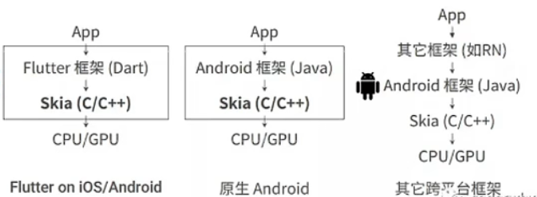

可以看出 他们之间的区别，flutter 和 Native 的流程几乎一样，flutter可以利用 Skia 绘画引擎直接通过 CPU、GPU进行绘制。而 react  native 就需要先将 js、jsx等其他的js代码通过 javaScript 虚拟机编译转化成对应的 原生组件之后才能通过 桥接 来和原生组件进行数据传输。

## flutter 的绘制原理

我们知道一秒播放16中图片的时候，会觉得这是一个流畅的动画效果，一秒中内可以播放多少中图片也叫做**帧率（fps）**，一般电影的帧率在24或者30。

要在显示设备上显示图像的话就需要频繁的刷新页面，保证图像时刻都是新的，这样就会用动画效果，这种每秒刷新的次数叫做**刷新率**，一般IPhone的是 60Hz，iPad 是120Hz。

**帧率和刷新率的关系**

CPU/GPU 向 Buffer 中生成图像，屏幕从 Buffer 中取 图像、刷新后显示。 这是一个典型的生产者——消费者模型。 理想的情况是帧率和刷新频率相等，每绘制一帧，屏幕显示一帧。 但是实际往往它们的大小是不同的。 如果没有锁来控制同步，很容易出现问题。 例如，当帧率大于刷新频率，当屏幕还没有刷新第 n-1 帧的时候，GPU 已经在生成第 n 帧了 从上往下开始覆盖第 n-1 帧的数据，当屏幕开始刷新第 n-1 帧的时候，Buffer 中的数据上半部分是第 n 帧数据， 而下半部分是第 n-1 帧的数据 显示出来的图像就会出现上半部分和下半部分明显偏差 的现象，我们称之为 “tearing”（撕裂）。

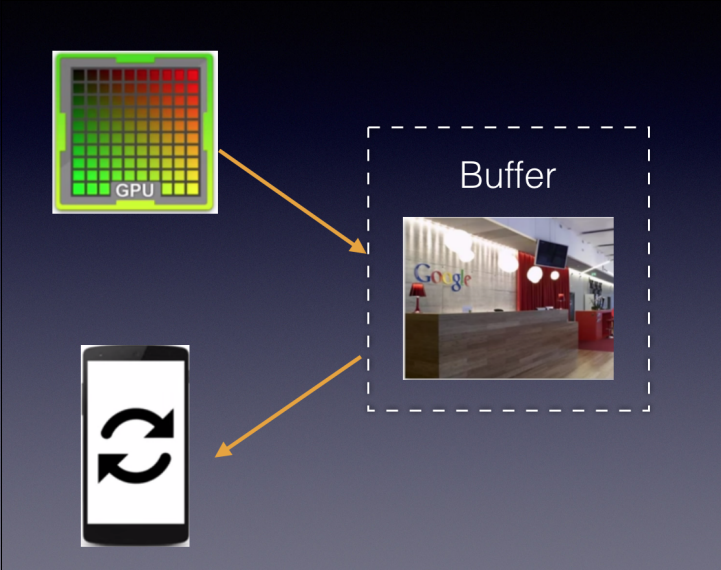

**双重缓存解决 tearing**

为了解决单缓存的“tearing”问题，就出现了 双重缓存和 VSync ； 两个缓存区分别为 Back Buffer 和 Frame Buffer。 GPU 向 Back Buffer 中写数据，屏幕从 Frame Buffer 中读数据。 VSync 信号负责调度从 Back Buffer 到 Frame Buffer 的复制操作 ，当然底层不是通过复制，而是通过交换内存地址方式，所以可以瞬 间完成，效率是非常高的； 

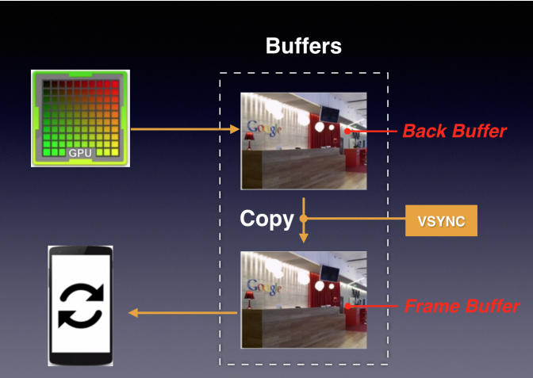

**工程流程**： 

+ 在某个时间点，一个屏幕刷新周期完成，VSync 信号产生，先完成 复制操作，然后通知 CPU/GPU 绘制下一帧图像。 
+ 复制操作完成后屏幕开始下一个刷新周期，即将刚复制到 Frame  Buffer 的数据显示到屏幕上。 
+ 在这种模型下，只有当 VSync 信号产生时，CPU/GPU 才会开始绘制。

所以 flutter 的绘制原理如下

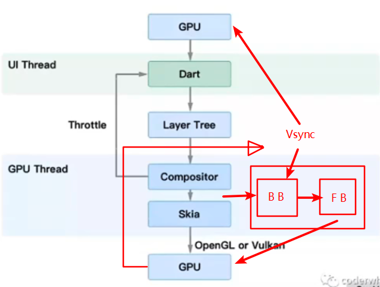

1. GPU 将信号同步到UI线程
2. UI线程同Dart来构建图层树
3. 图层树在GPU线程进行合成
4. 合成后的视图数据提供给Skia引擎
5. Skia 引擎通过OpenGL或者Vulkan将显示内容提供给GPU
6. GPU 将图像绘制完成后 发出 Vsync 信号通过Back Buffer 进入到 Frame Buffer，GPU继续渲染 Frame Buffer 中的图像，并且 Vsync 通知另一个GPU继续绘制下一个图像。

## 安装

可以直接在官网下载安装程序或者压缩包就可以安装了，安装完成之后再配置环境变量，flutter 中的课执行文件是在`/bin`目录下的，所以需要在环境变量下配置.

```
安装目录/flutter/bin
```

因为flutter 还是依赖 Dart 所以还需要下载安装并配置 Dart

```
安装目录/dart-sdk/bin
```

之后就需要可以运行`flutter --version`检查是否安装成功了。

## 检查开发环境，以及一些坑

安装成功之后哦就可以通过`flutter doctor`命令来检查当前开发环境还缺少的东西了。做移动端开发肯定还需要用到手机模拟器的，一般在windows下可以使用 Android Studio 的模拟器也可以使用其他的模拟起，可以选择使用 **夜神模拟器** ，在MAC下可以使用Xcode中提供的模拟器。

下面是一些可能回遇到的坑和解决方法，也可以去[中文社区](https://flutter-io.cn/)看看

https://segmentfault.com/a/1190000041554528#:~:text=%E5%A6%82%E6%9E%9C%E5%87%BA%E7%8E%B0%E6%8A%A5%E9%94%99%20Android%20sdkmanager%20not%20found.%20Update%20to%20the,-%3E%20%E5%8B%BE%E9%80%89Android%20SDK%20Command-line%20Tools%20%28latest%29%20-%3E%20OK

https://blog.csdn.net/MarkeyMark/article/details/111031751

https://blog.csdn.net/adorable_/article/details/116590749

## 常用key命令

在运行项目`flutter run`之后。我们可以在控制台输入一些key来让项目做出对应的处理，比如输入`r`热更新，

+ `r`热更新，主要执行组件的`build`方法
+ `R`重载项目
+ `o`切换平台（Android，Mac）
+ `p`切换构造线的显示
+ `i`切换小部件检查器
+ `v`打开devtool，如果需要输入连接url的话，可以输入运行项目后提示的第二个地址，如下。第一个是控制台的网页地址
+ `c`清除屏幕
+ `q`退出项目

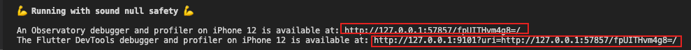

## 安装编辑器插件

安装vscode 的插件，有助于提高开发效率，开发flutter 常用的插件有

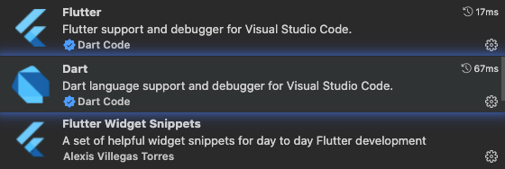

[vscode中Flutter开发中常用的快捷键](https://juejin.cn/post/6998726767074623496/)


## 创建项目

创建 flutter 项目可以使用`flutter create 项目名`直接创建。

在安装了`flutter`插件之后，如果有手机或者虚拟机连接上的话，在右下角有个`no devices`，点击它就可以选择要连接的设备了，在连接上之后，就可以运行`flutter run`命令启动程序了。

## 程序入口

在dart 中程序的入口是一个`main`函数，在flutter 中入口是`runApp(根组件)`

```dart
void main(){
  runApp(Container(
    child:Center(
    	child:Text(
        'hello',
        fontSize:40
      )
    )
  ));
}
```

框架会强制让根 widget 铺满整个屏幕，并且 `runApp(根组件)`中根组件必须指明排版顺序。

## 组件

在 flutter 中几乎所有的组件都是 **Widget** （控件、部件、插件），可以理解为容器，几乎每个容器都会有一个 child 属性用来放置子节点，从而表现页面布局中的嵌套关系，在组件上还有一些其他的属性，比如`color,width,height`等都是对当前组件样式表现描述。

其实 flutter 中的组件和 html 中内联了样式的元素非常相似，比如下面的一个html

```html
<div style="background:yellow;width:100px;height:100px;">
	<div style="background:red;width:50px;height:50px;color:white;">
    hello world
  </div>
</div>
```

用flutter的组件表示就是

```dart
void main(){
  runApp(
  	Container(
      width:100,height:100,color:Color.yellow,
    	child:Container(
        width:50,height:50,color:Color.red,
        child:Text('hello world',color:Color.white,
        )
      )
    )
  );
}
```

其中`Container`基于相当于是一个`div`容器，而`Text`就相当于是第二个`div`中的文本节点（Text属于比较低级的组件，他的字节点就是文本内容，所以没有child）

**自定义组件**

一般来说，程序都不会那么简单，只用几个组件就能写好，所以上面的直接在`runApp`中写页面是不太现实的，所以一般都是自定一个组件来书写页面，自定组件首先需要继承一个容器组件，然后重写一下 build 方法（相当于react 中类式组件的 render 方法），这个方法返回的一个 widget。

```dart
void main(){
  runApp(MyApp());
}
class MyApp extends StatelessWidget {
  const MyApp({ Key? key }) : super(key: key);

  @override
  Widget build(BuildContext context) {
    return Container(
      width:100,height:100,color:Color.yellow,
    	child:Container(
        width:50,height:50,color:Color.red,
        child:Text('hello world',color:Color.white)
      )
    );
  }
}
```

## 有状态组件和无状态组件

在自定义组件的时候我们需要继承一个 widget 的容器组件，常用有两个`StateLessWidget`和`StatefulWidget`，这两个的区别是前者是**无状态组件**后者是**有状态组件**

无状态组件表示在第一个次编译之后视图就固定下来了，之后即使修改了里面的状态数据页面也不会更新，所以在写无状态组件的时候通常都会使用`const`和`final`来定义变量和子节点组件。

有状态组件则相反，在修改状态数据之后页面也会更新，比较适合做交互组件。

> 其实在 flutter 中所有的 widget 都是不能改变的，因为几乎所有的 widget 都继承于 Widget 类，而 Widget 类是被 `@immutable`装饰，表示不可变，所以无论是在`StatelessWidget`中还是`StatefulWidget`中都是不能直接定义可修改的状态的，而且其中的变量都应该使用 final 或者 const 来进行定义，如果要定义状态需要在`StatefulWidget`中的 `createStatus`方法返回的 继承于`State`的组件中定义。
>
> 在 StatefulWidget 中是没有 build 方法的，StatefulWidget 组件的 build 方法是放在 State 组件中的，这是因为：
>
> 1. build 出来的 widget 是需要依赖 State 中的变量；
> 2. 在 Flutter 的运行过程中，widget 是不断的销毁和创建的，当我们自己的状态发送改变时并不希望创建一个新的 State


## 生命周期

### 组件生命周期

生命周期函数可以让我们在合适的时机做正确的事，比如在初始化的时候获取数据，初始化数据，进行组件事件监听等，在 flutter 中无状态组件 StatelessWidget 的生命周期之后构造函数和build方法。

```dart
class Test extends StatelessWidget{
	Text(){
    print('实例化完成');
  }
  @override
  Widget build(BuildContext context){
    print('调用build方法');
    return Text("hello");
  }
}
```

有状态组件 StatefulWidget 的生命周期函数如下：

- 在下图中，灰色部分的内容是Flutter内部操作的，我们并不需要手动去设置它们；
- 白色部分表示我们可以去监听到或者可以手动调用的方法；

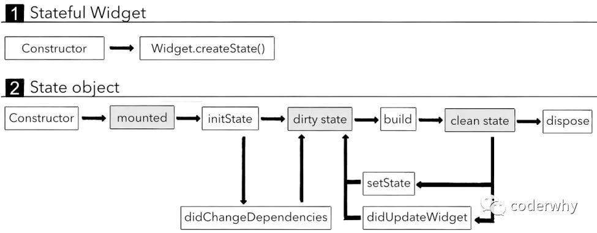

首先，执行**StatefulWidget**中相关的方法：

1. 执行StatefulWidget的构造函数（Constructor）来创建出StatefulWidget；
2. 执行StatefulWidget的createState方法，来创建一个维护StatefulWidget的State对象；

其次，调用createState创建State对象时，执行State类的相关方法：

1. 执行State类的构造方法（Constructor）来创建State对象；
2. 执行initState，我们通常会在这个方法中执行一些数据初始化的操作，或者也可能会发送网络请求；


- - 注意：这个方法是重写父类的方法，必须调用super，因为父类中会进行一些其他操作；
  - 并且如果你阅读源码，你会发现这里有一个注解（annotation）：@mustCallSuper

3. 执行didChangeDependencies方法，这个方法在两种情况下会调用

- - 情况一：调用initState会调用；
  - 情况二：从其他对象中依赖一些数据发生改变时，比如 InheritedWidget

4. Flutter执行build方法，来看一下我们当前的Widget需要渲染哪些Widget；
5. `deactivate`在组件被移除时调用，在dispose之前
6. 当前的Widget不再使用时，会调用dispose进行销毁；
7. 手动调用setState方法，会根据最新的状态（数据）来重新调用build方法，构建对应的Widgets；
8. 执行`didUpdateWidget`方法是在当父Widget触发**重建**（rebuild）时，系统会调用`didUpdateWidget`方法；

https://juejin.cn/post/7056646298073563166

### App应用的生命周期

```dart
import 'package:flutter/material.dart';
 
class AppLife extends StatefulWidget {
  @override
  _AppLifeState createState() => _AppLifeState();
}
 
class _AppLifeState extends State<AppLife> with WidgetsBindingObserver {
 
  @override
  void initState() {
    super.initState();
    WidgetsBinding.instance.addObserver(this); //添加观察者
  }
 
  ///生命周期变化时回调
//  resumed:应用可见并可响应用户操作,app进入前台
//  inactive:用户可见，但不可响应用户操作，比如来了个电话,前后台切换的过渡状态
//  paused:已经暂停了，用户不可见、不可操作，app进入后台
//  suspending：应用被挂起，此状态IOS永远不会回调
  @override
  void didChangeAppLifecycleState(AppLifecycleState state) {
    super.didChangeAppLifecycleState(state);
    print("didChangeAppLifecycleState: $state");
  }
 
  ///当前系统改变了一些访问性活动的回调
  @override
  void didChangeAccessibilityFeatures() {
    super.didChangeAccessibilityFeatures();
    print("didChangeAccessibilityFeatures");
  }
 
  ///低内存回调
  @override
  void didHaveMemoryPressure() {
    super.didHaveMemoryPressure();
    print("didHaveMemoryPressure");
  }
 
  ///用户本地设置变化时调用，如系统语言改变
  @override
  void didChangeLocales(List<Locale> locale) {
    super.didChangeLocales(locale);
    print("didChangeLocales");
  }
 
  ///应用尺寸改变时回调，例如旋转
  @override
  void didChangeMetrics() {
    super.didChangeMetrics();
    Size size = WidgetsBinding.instance.window.physicalSize;
    print("didChangeMetrics  ：宽：${size.width} 高：${size.height}");
  }
 
  /// {@macro on_platform_brightness_change}
  @override
  void didChangePlatformBrightness() {
    super.didChangePlatformBrightness();
    print("didChangePlatformBrightness");
  }
 
  ///文字系数变化
  @override
  void didChangeTextScaleFactor() {
    super.didChangeTextScaleFactor();
    print(
        "didChangeTextScaleFactor  ：${WidgetsBinding.instance.window.textScaleFactor}");
  }
 
  @override
  Widget build(BuildContext context) {
    return Scaffold(
      appBar: AppBar(title: Text("App生命周期"),),
      body: Column(children: <Widget>[],),
    );
  }
 
  @override
  void dispose() {
    super.dispose();
    WidgetsBinding.instance.removeObserver(this); //销毁观察者
  }
}
```

[flutter 页面 生命周期，APP应用的生命周期](https://blog.csdn.net/litter_lj/article/details/99690614)


## 常用组件

### **容器类**

**单子节点容器**

+ `Text`文本组件，相当于就是一个普通`span`，（最终渲染的并不是 Text ，而是一个`RichText`）
+ `Text.rich`富文本组件，第一个参数可以放`TextSpan`，这是一个多节点容器，里面可以放多个文本组件，比如文本容器`TextSpan`(空间不够将会换行显示，单前提是宽度明确)，组件容器`WidgetSpan`（主要用来包裹非TextSpan 的组件，并且可以定义垂直方向的对齐方式，但只有全部兄弟节点都是`WidgetSpan`时才有效）。
+ `Center`上下左右居中容器组件，相当于一个设置了`display:flex;just-content:center;align-items:center;`的 `div`
+ `Positioned`绝对定义的容器，相当于设置了`position:absolute;`的`div`
+ `Align`设置位置的容器，可以通过设置`aligment`属性操作元素在容器中的位置，通过`widthFactory，heightFactory`设置容器宽高是子容器的大小的倍数。（其实在一些组件中设置的布局排序属性`alignment`，本质上也是使用`Align`再给子元素包裹一层的）
+ `Container`普通的单子节点容器组件，用来创建一个可见的矩形元素，可以通过设置`decoration`来设置背景色（color），背景图（image），边框（border），阴影（boxShader）等盒子类型效果。还可以设置`margin 外边距,padding 内边距`等。
	+ 需要注意，当一个`Container`直接包裹一个`Container`的时候，子的`Container`的宽高将会失效，而且会以父`Container`的宽高来进行填充；可以通过设置一个中间容器来隔断`Container`与`Container`的直接子元素关系来解决，父组件设置`alignment`也可以解决（其实就是给子元素包裹一层`Align`）
+ `AspectRatio`可以设置相对宽高比的容器，通过`aspectRatio:宽/高`可以设置当前容器宽和高的比
+ `Icon`图标容器，方便快捷得生成图标，是一种矢量图。
+ `Card`卡片容器组件
+ `ClipOval`裁剪容器，可以将容器裁剪成其他的形状，默认是处理成圆形/椭圆型，一般会配合`Image`使用
+ `ClipRRect`圆角边框容器
+ `ClipRect`矩形裁剪区域容器，可以自定义裁剪的区域，通过`clipper`来指定（可能需要自己通过继承`CustomClipper`来定义裁剪区域）
+ `SizeBox`空白的容器组件，通常用来做占位空间。
+ `Padding`内间距容器，相当于设置了`padding:xx`的`div`
+ `Flexible`弹性盒子容器，可以通过设置`flex`来按比例分配空间，设置`fit`来确定剩余空间的分配使用，如果设置了`fit:FlexFit.loose`（默认），表示是分配了但是不使用，`fit:FlexFit.tight`就是使用。
+ `Expanded`弹性盒子容器，继承于`Flexible`，相当于是设置了`display:flex`的`div`，可以设置`flex`比例，不能设置`fit`，默认是`tight`
+ `Divider`分割线
+ `Theme`主题容器，可以快速为子容器设置主题，比如颜色风格
+ `SafeArea`安全区域容器，不会遮挡状态栏和底部菜单
+ `FittedBox`自动缩放容器，当子组件的宽或者高比当前容器的宽高大的时候就会将子节点进行整体的缩放来适应容器
+ `Opacity`设置透明度
+ `Transform`可以定义子节点进行，旋转、平移、缩放等效果，最重要的是可以通过`alignment`设置变换中心
+ `FadeTransition`淡入过渡动画容器

**多子节点容器**

+ `Row`多子节点容器组件，其中有`children`属性可以设置多个字节点的列表，子节点是横向排列，且默认占满一行，可以通过`mainAxisSize`来设置占据空间的大小；相当于一个设置了`display:flex;flex-direction:row`的 `div`
	+ 如果希望所有的子节点的高度都一样可以在外层包裹一个`IntrinsicHeight`
+ `Column`多子节点容器组件，其中有`children`属性可以设置多个字节点的列表，子节点是纵向排列，相当于一个设置了`display:flex;flex-direction:column`的 `div`
+ `SingleChildScrollView`单子节点容器，但是子节点容器可滚动，可以将Column，Row等不可滚动的容器包装成可滚动的。
+ `Flex`弹性盒子布局容器，就是相当于一个`display:flex`的`div`，可以设置 flex 的相关属性，比如排列方向`direction`，当设置`direction:Axis.vertical`时就相当于是一个 `Column`，当设置`direction:Axis.horizontal`时就相当于是一个 `Row`。
+ `PageView`页面滚动容器组件，效果类似于抖音等视频的单页面视频滚动效果，每个子元素都相当于是一个页面。
+ `Wrap`子节点在一行/列放不下时会自动换行，通过`direction`属性定义接单排序方向，可以用来做瀑布流布局
+ `Stack`多子节点容器组件，其中有`children`属性可以设置多个字节点的列表，子节点之间是重在一起的，相当于给每个子组件都设置了绝对定位。可以使用`Positioned`或者`Align`来控制位置，也可以使用`alignment`属性定义内容的位置。通过`fit`可以设置子元素的填充模式
+ `ListView`多节点容器组件，一般用做列表显示，可以通过`scrollDirection`定义列表的方向。不过需要注意子节点的宽度（垂直列表）/高度（水平列表）会被强制铺满适应父容器的宽度/高度，如果要设置列表的宽度，就需要设置其父容器的宽度，或者通过设置padding属性将它进行挤压，还有就是默认情况下`ListView|Column`下不能在使用`ListView|Column`，如果要使用需要设置子节点的`ListView`的`shrinkWrap`属性为`true`，`Column`的`mainAxisSize`为`MainAxisSize.min`;
  + **为什么`ListView|Column`下不能在使用`ListView`？**这是因为父容器在布局的时候他的大小是通过他的子节点来确定的，也就是说父容器在布局的时候需要子节点告知父容器高度。但是`ListView`在布局的时候会尽可能多的占据空间，到那时此时他是询问父容器自己最多能够占据多少空间，此时就出现矛盾了，比如`Column`下再使用`ListView`的情况，Column 需要 ListView 告诉 Column 自己的高低，ListView又问Column自己能占多少高度，而Column此时的高度还是不确定的，所以就报错了。**解决方法1**：给 ListView 包裹一层 Container 并设置一个明确的高度；**解决方法2**：ListView 设置 `shrinkWrap`为 true ，告诉 ListView 高度取决于子节点的内容高度。
  + `ListTile`文章列表组件，可以定义标题和子标题，通常配`ListView`使用，也可以通过`leading`定义列表项前图标，`trailing`在列表项后定义图标
  + `ListView.builder`这个构造函数是用来创建动态列表的，会进行循环创建，通过`itemCount`定义循环的次数，通过`itemBuilder`来定义渲染函数，**当节点显示时才会被创建**。
  + `ListView.separated`这个构造函数是用来创建带分割组件的动态列表的
  + `ListView(children:List.generate(count,genFn))`，`List.generate(count,genFn)`可以生成一个固定长度的widget列表，但是这种方式会比较消耗性能，因为**无论节点是否显示都会被创建**。
+ `GridView`网格容器列表，相当定义了`display:grid`的`div`，可以用`gridDelegate:SliverGridDelegateWithFixedCrossAxisCount()`定义设置`crossAxisSpacing`水平间距，`mainAxisSpacing`垂直间距等，和`ListView`一样拥有`GridView.builder`构造方法进行动态列表的生成（`flutter_staggered_grid_view`库可以实现瀑布流布局）
  + `GridView.builder`创建动态列表
  + `GridView.count`默认设置了`gridDelegate:SliverGridDelegateWithFixedCrossAxisCount()`的`GridView`
  + `GridView.Extent`默认设置了`gridDelegate:SliverGridDelegateWithFixedCrossAxisExtent()`的`GridView`

其实`ListView/GridView/PageView`等可滚动的视图都是由各种`sliver`组件包装而来，不过这些都是flutter 帮我们定义好了的滚动列表，如果要实现一些比较复杂或者自定义的可滚动列表的话就需要使用`CustomScrollView`来进行设计，比如说我要在一个`ListView`中嵌套`ListView、GridView、PageView`等其他的列表的话就不容易实现了，因为一个不确定大小的容器是不能在嵌套一个不确定大小的容器的（虽然可以定义`shrinkWrap`让列表大小等于内容大小，但是会比较消耗性能）。

[Flutter - 循序渐进 Sliver](https://juejin.cn/post/6844904155195129864)       [Flutter-Sliver](https://www.jianshu.com/p/c892587fed97)

+ `CustomScrollView`自定义的可滚动容器，不过这个容器的子元素不再是`Text`等简单的容器了，而应该是`sliver`。常用的Sliver容器
  + `SliverSafeArea`安全区域，滚动时滚出容器区域的内容不会被隐藏，如果是`SafeArea`就会隐藏
  + `SliverGrid`类似于`GridView`也是创建一个网格布局的列表
  + `SliverList`类似于`ListView`也是创建一个列表
  + `SliverChildBuilderDelegate`是创建`Sliver`节点的方法，和`ListView.builder`类似都是循环创建，当节点显示时才会被创建，通过`delegate`参数创建
  + `SliverChildListDelegate`是创建`Sliver`节点的方法，和`ListView(children:List.generate(count,genFn))`一致，通过`delegate`参数创建
  + `SliverAppBar`页面顶部的导航
  + `SliverPadding`设置内边距，滚动出区域的容器不会隐藏

> 单子节点`Sliver`容器的子节点参数应该是`sliver`，多子节点`Sliver`容器的子节点参数一般是`slivers`，而且`Sliver`系列组件需要在`CustomScrollView`中使用

```dart
class SliverDemo extends StatelessWidget {
  const SliverDemo({Key? key}) : super(key: key);

  @override
  Widget build(BuildContext context) {
    return MaterialApp(
      home: Scaffold(
        body: CustomScrollView(
          slivers: [
            SliverAppBar(
              pinned: true,
              expandedHeight: 300,
              flexibleSpace:FlexibleSpaceBar(
                title: Text('hello'),
                background: Image.network("https://picsum.photos/300/300",fit: BoxFit.cover,),
              ),
            ),
            SliverSafeArea(
              sliver: SliverPadding(
              padding: EdgeInsets.all(10),
              sliver: SliverGrid(
                  delegate: SliverChildBuilderDelegate(
                    (context, index) {
                      return Container(
                        color: Color.fromARGB(255, Random().nextInt(256),
                            Random().nextInt(256), Random().nextInt(256)),
                      );
                    },
                    childCount: 20,
                  ),
                  gridDelegate: SliverGridDelegateWithFixedCrossAxisCount(
                    crossAxisCount: 3,
                    childAspectRatio: 1,
                    mainAxisSpacing: 8,
                    crossAxisSpacing: 8,
                  )),
            )),
            SliverList(delegate: SliverChildListDelegate(
              List.generate(10, (index) => Text("list $index",textScaleFactor: 4,))
            ))
          ],
        ),
      ),
    );
  }
}

```


### 媒体类

+ `image`相当于`img`标签，可以用来加载网络图片（Image.network）、应用资源图片（Image.asset）、文件图片（Image.file）。并且可以通过`colorBlendMode`设置混合模式，一般都是作为其他容器的子容器使用，以便于设置其他样式，如圆角等.

  + 需要注意的是，在使用`Image.asset`、`AssetImage`加载资源图片时需要在根目录下新建`images`目录，并且还要新建`images/2.0x. images/3.0x images/4.0x`文件夹，并且在`images`下放入默认图片，`images/2.0x. images/3.0x images/4.0x`下放入对应分辨率的同名图片，这样flutter就能根据设备的分辨率加载不同的图片。最后还需要在`pubspec.yaml`下配置

    ```yaml
     assets:
     	- images/a.jpeg
     	- images/2.0x/a.jpeg
     	- images/  #加载全部
    ```

+ `NetworkImage,FileImage,AssetImage`加载图片资源

+ `FadeInImage`占位图容器，可以用来设置在加载真正要显示的图片之前显示另外一张图片，等图片加载完成之后再淡入显示。

> flutter 会默认进行图片缓存（限制是 1000 张，100MB），如果flutter 发现要加载的图片的地址和缩放和之前加载过的图片是一样的话就会使用缓存中的图片不会重复加载。

### 控制器

+ `ScrollController`滚动列表的监控控件，可以通过滚动列表的controller参数进行绑定
  + `ins.addListener()`添加滚动事件回调函数，`ins.offset`可以获取滚动的距离
  + `ins.animationTo()`动态跳转到指定位置
+ `NotificationListener`监听子节点事件的组件，可以通过`onNotification`来定义事件回调，如监听滚动事件`onNotification:(ScrollNotification noti){}`

### **工具类**

+ `Color`用来定义颜色，主要使用的方法是`Color.fromARGB(a, r, g, b)`和`Color.fromRGBO( r, g, b,o)`,还可以`Color(0xFFFFFFFF)`（前面两位是透明度）来定义颜色
+ `Colors`也是用来定义颜色的，不过可以直接使用定义好的静态属性`Colors.red`
+ `Icons`定义了很多图标的 IconData
+ `TextDirection`用来描述`Text`组件的文字的文字排列方向
+ `BoxDecoration`用来给盒子类型的容器设置阴影，圆角，边框等盒子容器的属性
+ `TextStyle`为`Text`组件的文字设置样式、大小、加粗等
+ `EdgeInsets`可以为盒子容器的`margin padding`提供值
+ `Transform`设置平移，旋转，缩放等transform过度效果
+ `Alignment`相对于父容器进行位置设置，如果是`Alignment(x,y)`，x和y的值取值范围是`[-1,1]`，如果比这个范围大就会跑出容器范围，`Alignment(0,0)`表示居中

### **MaterialApp UI库类**

+ `MaterialApp`应用程序容器，可以理解成一个应用程序的盒子，可以这个这个盒子上设置路由来管理多个页面，设置全局数据，应用主题等等。总之就相当于是一个应用实例，功能类似于Vue中的`new Vue({})`，为App确定一个设计的风格，应用的排序方向。
	+ `title`参数可以设置应用在手机最近使用的应用栈中显示的名称，不过在IOS端是无效的
+ `Scaffold`应用页面级模版容器，可以设置页面的标题栏，选项卡等。
+ `AppBar`应用页面顶部选项卡容器。
+ `DefaultTabController`在`AppBar`下方的导航标签的容器，可以定义多个标签，并且可以通过`TabBarView`容器定义标签对应的页面。
+ `TabBar`标签容器，通过`tabs`定义多个标签，一般定义在`AppBar`的`bottom`或者`title`上
+ `TabBarView`定义`TabBar`中标签对应的内容。
+ `TabController` 可以定义自定义或者监听标签的行为，不过需要注意的是使用这个组件必须要使用动态组件，并且混入`SingleTickerProviderStateMixin`，而且在`TabBar TabBarView`中的`controller`都定义赋值给同一个`TabController`,之后就可以通过`TabController.addLisener`进行变化的监听了
+ `Drawer`抽屉式侧边栏，可以通过`MaterialApp`的`drawer endDrawer`分别定义左右两边的侧边栏。可以通过`Scaffold.of(context).openDrawer()`来手动打开
+ `DrawerHeader`抽屉式侧边栏顶部容器，可以通过调用 `Navigator.pop` 关闭打开的抽屉。
+ `UserAccountDrawerHeader`抽屉式侧边栏顶部容器，提供和很多可选项，可以快速实现用户侧边栏布局。

### **表单类**

+ `TextFiled`文本输入框，类型`input`标签，可以通过`controller: TextEditingController实例`来设置初始输入以及之后获取输入框组件的数据，通过`onChanged`来监听输入改变的事件
+ `CheckBox`多选盒子，需要通过定义`onChanged`事件之后才能改变。
+ `CheckboxListTitle`可定义大小标题的可选中的列表项，类似于`ListTile`但是在右侧多一个`CheckBox`
+ `Radio`单选按钮，可以通过`groupValue`来指定同一变量来为多个单选按钮规划到一个组上
+ `RadioListTitle`和`CheckboxListTitle`相似
+ `Switch`开关

**模态弹窗**

+ `showDialog`不是一个组件，而是一个用来显示模态弹窗的方法，通过`builder`定义弹窗的内容，这个方法返回一个 `Future`对象，可以使用 then 来订阅模态弹窗的操作返回
+ `AlertDialog`普通提示模态弹窗，通过 `actions`定义操作按钮
+ `SimpleDialog`可以自定义多个子节点内容的模态弹窗
+ `showModalBottomSheet`不是一个组件，而是一个用来显示底部的模态弹窗的方法，和`showDialog`类似
+ `toast`是第三方的包

可以通过`Navigation.pop()`来手动关闭，这也说明了显示显示一个 Dialog 其实是打开一个新的页面，只不过这个页面是一个半透明的状态。

**自定义`Dialog`**

自定义dialog其实是自定义一个新的页面，首先需要继承Dialog，然后实现里面的build方法，这个方法其实是一个半透明的`Material`页面，然后在调用`showDialog`方法将dialog内容显示出来。

```dart
class MyDialog extends Dialog {
  String title = "";
  String msg = "";
  MyDialog({this.title = "", this.msg = "", Key? key}) : super(key: key);
  @override
  Widget build(BuildContext context) {
    return Material(
      type: MaterialType.transparency,//设置页面背景为半透明色
      child: Column(
        mainAxisAlignment: MainAxisAlignment.center,//主轴居中
        crossAxisAlignment: CrossAxisAlignment.center,//侧轴居中
        children: [
          Container(
            width: 200,
            height: 200,
            color: Colors.white,
            child: Column(
              children: [
                Padding(
                    padding: EdgeInsets.fromLTRB(10, 4, 10, 4),
                    child: Stack(
                      children: [
                        Align(
                          alignment: Alignment.topCenter,
                          child: Text(
                            "$title",
                            style: TextStyle(fontSize: 16),
                          ),
                        ),
                        Align(
                          alignment: Alignment.topRight,
                          child:
                              InkWell(child: Icon(Icons.close), onTap: () {
                                Navigator.pop(context);//关闭页面，相当于放回上一个页面
                              }),
                        )
                      ],
                    )),
                Divider(
                  height: 10,
                ),
                Container(
                  width: double.infinity,
                  padding: EdgeInsets.all(10),
                  child: Text("$msg"),
                )
              ],
            ),
          )
        ],
      ),
    );
  }
}
```


### **按钮**

交互就意味着页面会做动态改变，所以要在flutter 中进行交互的话首先组件必须要是有状态的组件，所以在自定义页面组件的时候就需要基础`StatefulWidget`组件，并且实现其中的创建状态的方法，其次真正的子组件其实是继承于`State`类的，这个类中有`setState`方法能管理页面的状态，动态更新页面

```dart
class Test extends StatefulWidget{
  Test({Key:key}):super(key:key);
  _TestState createState() => _TestState();
}
class _TestState extends State<Test>{
  int count = 0;
  @override
  Widget build(BuildContext context){
    return Container(
    	child:Column(
      	children:[
         	Text('数字是：${count}'),
          ElevatedButton(
          	child:Text('+++'),
            onPressed(){
              this.setState((){
                this.count++;
              });
            }
          )
        ]
      )
    )
  }
}
```

在调用`setState`来改变数据的时候，其实是 `build`方法再执行一遍。

flutter 中有多种已经定义好了样式的按钮，比如说上面用到的`ElevatedButton`表示的是一个 凸起的按钮，除此之外还有

+ `ElevatedButton` 凸起的按钮
+ `TextButton`文本按钮
+ `OutlinedButton`线框按钮
+ `IconButton`图表按钮
+ `ButtonBar`按钮组
+ `FloatingActionButton`浮动按钮
+ `InkWell`无样式按钮，通过`onTab`来绑定事件

这些按钮都用自己的默认宽高，如果要设置大小的话需要设置父容器的大小来实现，也可以在外层包裹一个`ButtonTheme`组来设置最小宽高，并且可以通过`style`来设置按钮的相关样式，默认情况想 Button 上下有一定的间距，可以通过设置`materialTapTargetSize`来取消

### 组件使用技巧

flutter中的组件很多，并不需要去记，只需要知道有哪些常用的组件就好，不过官网的组件例子写得不太好，还都是英文的不好看，所以推荐去看**(老孟的 300 多个组件例子)[http://laomengit.com/]**，在平时给组件设置属性的时候需要我们传递固定类型的数据比如设置`Container`组件的`decoration`需要使用`Decoration`类。

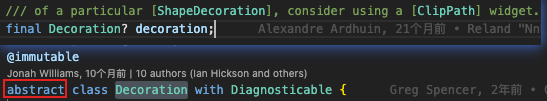

但是发现`Decoration`是一个抽象类，也没有工厂构造函数（可以令抽象类也可以被实例化），所以我们需要去找实现或者继承了`Decoration`的类。此时可以点击`ctrl+F12`就可以看到实现的类了，再结合文档就可以知道应该如何使用

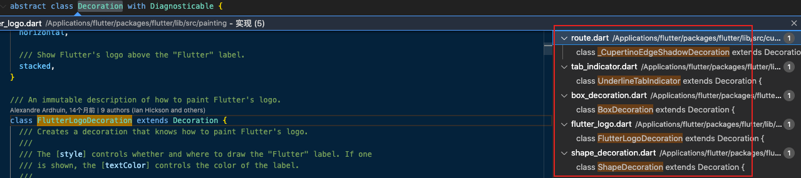


## 事件监听

在Flutter中，手势有两个不同的层次：

- 第一层：原始指针事件（Pointer Events）：描述了屏幕上由触摸板、鼠标、指示笔等触发的指针的位置和移动。

- 第二层：手势识别（Gesture Detector）：这个是在原始事件上的一种封装。

- - 比如我们要监听用户长按，如果自己封装原始事件我们需要监听从用户按下到抬起的时间来判断是否是一次长按事件；
	- 比如我们需要监听用户双击事件，我们需要自己封装监听用户两次按下抬起的时间间隔；
	- 幸运的是各个平台几乎都对它们进行了封装，而Flutter中的手势识别就是对原始指针事件的封装；
	- 包括哪些手势呢？比如点击、双击、长按、拖动等

### 指针事件Pointer

Pointer 代表的是人机界面交互的原始数据。一共有四种指针事件：

- `PointerDownEvent` 指针在特定位置与屏幕接触
- `PointerMoveEvent` 指针从屏幕的一个位置移动到另外一个位置
- `PointerUpEvent` 指针与屏幕停止接触
- `PointerCancelEvent` 指针因为一些特殊情况被取消

Pointer的原理是什么呢？

- 在指针落下时，框架做了一个 hit test 的操作，确定与屏幕发生接触的位置上有哪些Widget以及分发给最内部的组件去响应；
- 事件会沿着最内部的组件向组件树的根冒泡分发；
- 并且不存在用于取消或者停止指针事件进一步分发的机制；

原始指针事件使用Listener来监听：

```dart
class HomeContent extends StatelessWidget {
  @override
  Widget build(BuildContext context) {
    return Center(
      child: Listener(
        child: Container(
          width: 200,
          height: 200,
          color: Colors.red,
        ),
        onPointerDown: (event) => print("手指按下:$event"),
        onPointerMove: (event) => print("手指移动:$event"),
        onPointerUp: (event) => print("手指抬起:$event"),
      ),
    );
  }
}
```

### 手势识别Gesture

Gesture是对一系列Pointer的封装，官方建议开发中尽可能使用Gesture，而不是Pointer

**Gesture分层非常多的种类：**

**点击**：

- onTapDown：用户发生手指按下的操作
- onTapUp：用户发生手指抬起的操作
- onTap：用户点击事件完成
- onTapCancel：事件按下过程中被取消

**双击：**

- onDoubleTap：快速点击了两次

**长按：**

- onLongPress：在屏幕上保持了一段时间

**纵向拖拽：**

- onVerticalDragStart：指针和屏幕产生接触并可能开始纵向移动；
- onVerticalDragUpdate：指针和屏幕产生接触，在纵向上发生移动并保持移动；
- onVerticalDragEnd：指针和屏幕产生接触结束；

**横线拖拽：**

- onHorizontalDragStart：指针和屏幕产生接触并可能开始横向移动；
- onHorizontalDragUpdate：指针和屏幕产生接触，在横向上发生移动并保持移动；
- onHorizontalDragEnd：指针和屏幕产生接触结束；

**移动：**

- onPanStart：指针和屏幕产生接触并可能开始横向移动或者纵向移动。如果设置了 `onHorizontalDragStart` 或者 `onVerticalDragStart`，该回调方法会引发崩溃；
- onPanUpdate：指针和屏幕产生接触，在横向或者纵向上发生移动并保持移动。如果设置了 `onHorizontalDragUpdate` 或者 `onVerticalDragUpdate`，该回调方法会引发崩溃。
- onPanEnd：指针先前和屏幕产生了接触，并且以特定速度移动，此后不再在屏幕接触上发生移动。如果设置了 `onHorizontalDragEnd` 或者 `onVerticalDragEnd`，该回调方法会引发崩溃。

从Widget的层面来监听手势，我们需要使用：GestureDetector

- 当然，我们也可以使用RaisedButton、FlatButton、InkWell等来监听手势
- globalPosition用于获取相对于屏幕的位置信息
- localPosition用于获取相对于当前Widget的位置信息

```dart
class HomePage extends StatelessWidget {
  @override
  Widget build(BuildContext context) {
    return Scaffold(
      appBar: AppBar(
        title: Text("手势测试"),
      ),
      body: GestureDetector(
        child: Container(
          width: 200,
          height: 200,
          color: Colors.red,
        ),
        onTap: () {},
        onTapDown: (detail) {
          print(detail.globalPosition);
          print(detail.localPosition);
        },
        onTapUp: (detail) {
          print(detail.globalPosition);
          print(detail.localPosition);
        }
      ),
    );
  }
}
```

### 关于阻止冒泡

有两个嵌套的`Container`都绑定了点击事件 ，在连续点击内层的节点的时候可能会触发外层的事件

```dart
GestureDetector(
  onTabDown:()=>print('outer tap'),
	child:Container(
    width:100,
    height:100,
    color:Colors.bue,
    alignment:Alignment.center,
    child:GestureDetector(
      onTabDown:()=>print('inner tap'),
    	child:Container(
        width:100,
        height:100,
        color:Colors.red
      )
    )
  )
)

```

解决方法是，将这两个组件修改成不是嵌套的形式，比如说使用绝对定位`Stack`

```dart
Stack(
  alignment:Alignment.center,
	children:[
    GestureDetector(
      onTabDown:()=>print('outer tap'),
    	child:Container(
        width:200,
        height:200,
        color:Colors.blue
      )
    ),
    GestureDetector(
      onTabDown:()=>print('inner tap'),
    	child:Container(
        width:100,
        height:100,
        color:Colors.red
      )
    )
  ]
)
```

这样就可以解决这个问题了

如果我们不希望某个组件响应事件了，可以使用`IgnorePointer`组件包裹一下不需要进行事件响应的组件，比如

```dart
Stack(
  alignment:Alignment.center,
	children:[
    GestureDetector(
      onTabDown:()=>print('outer tap'),
    	child:Container(
        width:200,
        height:200,
        color:Colors.blue
      )
    ),
    IgnorePointer(
    	child:GestureDetector(
        onTabDown:()=>print('inner tap'),
        child:Container(
          width:100,
          height:100,
          color:Colors.red
        )
      )
    )
  ]
)
```

这样即使点击了内层的`Container`也只会响应`outer tap`。


### EventBus

**事件总线**可以实现较为复杂层级结构组件之间的通信，不需要依赖于父组件也可以实现通信，其原理是采用发布订阅模式实现。

1.下载`event_bus`库

2.在全局环境下创建一个EventBus实例

```dart
final eventBus = EventBus();
```

3.定义一个事件对象，这个事件对象可以理解成事件的名字，之后会根据这个对象来派发任务，多个不同的时间可以用继承来定义

```dart
class UserInfo{
  String name;
  int level;
  UserInfo(this.name, this.level);
}
```

4.使用`eventBus.on<UserInfo>().listen(cb)`监听事件，一般是在`initState`中进行监听

```dart
eventBus.on<UserInfo>().listen((data) {
  setState(() {
    message = "${data.name}-${data.level}";
  });
});
```

5.使用`eventBus.fire(UserInfo('jack',19))`派发事件


## 网络请求

flutter 中的异步处理是采用事件循环和非阻塞IO的模式的（其实就JavaScript的模式）。

flutter 中的网络请求方法是由`dart:io`库提供的，前端发请求需要使用其中的`HttpClient`类。而且这个类支持多种请求方式，比如`get post head put patch delete`。

### 发送`get`请求

```dart
let client = HttpClient();
//发起请求
HttpClientRequest request = await client.get('localhost',80,'/file.txt');
//请求完毕后关闭请求获得数据
HttpClientResponse response = await request.close();
//得到数据后还需要解析成真实数据
final stringData = await response.transform(utf8.decoder).join();
```

在拿到数据之后，这些数据一般是json格式的数据，如果直接存储的话，在之后的使用中可能不是很方便，因为不会有类型检查以及代码提示，此时我们可以将这些数据转换成一个数据类，通过[`JSON to Dart`](https://jsontodart.com/)或[quicktype](https://app.quicktype.io/)可以快速生成这个类。

### json数据转换

将`Map List`转换成JSON 字符串，使用`dart:convert`的`json.encode(d)`或者`jsonEncode(d)`进行转化，

```dart
Map m = {"key1": "val1"};
List l = [1, 2, 3, 4];
print(json.encode(m));
print(jsonEncode(l));
```

如果要将JSON字符串转化成Map、List，就可以是使用`json.decode(s)`或者`jsonDecode(s)`

```dart
String s = '{"key1": "val1"}';
String al = '[1,2,3,4]';
print(json.decode(s));
print(jsonDecode(al)[1]);
```

### 处理Uri

通过`Uri`类可以对url进行处理，比如将一个url 处理成一个对象，或者说将一个对象处理成Url

```dart
httpsUri = Uri(
    scheme: 'https',
    host: 'example.com',
    path: '/page/',
    queryParameters: {'search': 'blue', 'limit': '10'});
print(httpsUri); // https://example.com/page/?search=blue&limit=10

final uri = Uri.parse(
    'https://dart.dev/guides/libraries/library-tour#utility-classes');
print(uri); // https://dart.dev
print(uri.isScheme('https')); // true
```

### Dio

dio 是一个类似于 axios 的强大的网络请求库

使用前首先需要在`pubspec.yaml`中安装dio库，或者直接运行`pub get dio`

简单使用

```dart
final dio = Dio();
dio.get("http://httpbin.org/get",queryParameters:{id:1}).then(res => print(res));
dio.post("http://httpbin.org/post",data:{id:1}).then(res => print(res));
```

其中请求可以需要传递的参数是

+ **path：** 请求的url链接
+ **data：** 请求数据，例如上传用到的FromData，一般是在`post put`等请求上才用得到，可以理解为请求体
+ **queryParameters：** 查询参数
+ **options：** 请求选项，一些请求的配置都是在这个对象中进行配置的，比如请求头；在`dio.options`中可以设置全局的配置
+ **cancelToken：** 用来取消发送请求的token
+ **onSendProgress：** 网络请求发送的进度
+ **onReceiveProgress：** 网络请求接收的进度

[dio 文档](https://github.com/flutterchina/dio/blob/master/README-ZH.md)

为了方便维护，一般都不会直接去使用第三方库，而是对他做一层封装

```dart
//基础配置类
class HttpConfig{
  static const String baseURL = "http://httpbin.org";
  static const int timeout = 5000;
}
//封装类
class HttpRequest{
  //基础配置数据
  static final BaseOptions baseOptions = BaseOptions(baseUrl:HttpConfig.baseURL,connectTimeout:HttpConfig.timeout);
  static final Dio dio = Dio(baseOptions);
  
  //公共请求方法
  static Future<T> request<T>(String url,{
    String method = "get",
    Map<String,dynamic> params,
    Interceptor inters,
  }) async {
    //创建单独配置
    final option = Options(method:method);
    
    //创建默认的全局拦截器
    Interceptor DInter = InterceptorsWrapper(
    	onRequest:options=>options,
      onResponse:response => response,
      onError:err => err;
    )
    List<Interceptor> inters = [dInter];
    if(inter != null){
      inters.add(inter)
    }
    
    //发送请求
    try{
      Response response = await dio.request(url,queryParamters:params,options:options);
      return response.data;
    }on DioError catch(e){
      return Future.error(e);
    }
  }
}
```

上面这个库并不是很好，可以有更多具体的封装，[Flutter Dio源码分析(四)--封装](https://www.liujunmin.com/flutter/dio_encapsulation.html#%E5%89%8D%E8%A8%80)

### FutureBuilder

flutter开发中对于有依赖于网络数据的组件都是`StatefulWidget`，因为需要在`initState`中获取到数据之后调用`setState`来刷新组件，比如

```dart
class HomeContent extends StatefulWidget {
  const HomeContent({ Key? key }) : super(key: key);
  @override
  State<HomeContent> createState() => _HomeContentState();
}

class _HomeContentState extends State<HomeContent> {
  List list = [];
  @override
  void initState() {
    super.initState();
    //加载数据
    JsonParse.getCategoryData().then((value){
      setState(() {
        list = value;
      });
    });
  }

  @override
  Widget build(BuildContext context) {
    return ListView.builder(
      itemCount:list.length
    	builder:(ctx,index){
        ListTile("data:${list[index]}")
      }
    );
  }
}
```

但是这样是比较麻烦的，其实在`flutter`中提供了一个`FutureBuilder`，可以让我们能够在获取到请求之后再构建组件

```dart
class HomeContentState extends StatelessWidget {
  @override
  Widget build(BuildContext context) {
    return FutureBuilder(
    	future:JsonParse.getCategoryData(),
      builder:(ctx,snap){
        //如果还没有数据就显示加载中组件
        if(!snap.hasData) return Center(child:CircularProgressIndicator());
        List list = snap.data;
        return ListView.builder(
          itemCount:list.length
          builder:(ctx,index){
            ListTile("data:${list[index]}")
          }
        )
      }
    );
  }
}
```

不过这种方式也是有局限性的，因为每次`build`都会重新构建，这样就每次`build`的时候就会重新请求数据，所以在要频繁`build`的组件中是不合适使用的，第二种情况就是请求依赖于一个变化的参数的时候也是不合适使用的，比如上拉加载更多，此时没次上来加载更多时当前页这个参数是会改变的，所以也不合适。

### StreamBuilder

StreamBuilder与FutureBuilder类似，也是一个Widget控件，不一样的是FutureBuilder依靠Future来做异步数据获取，而StreamBuilder则是依赖Stream来做异步数据获取。可以做到持续的部分更新功能，比如说做一个时钟的功能

```dart
class _TestABPageState extends State {
  ///测试数据
  String _message = "--";
  ///使用单订阅流即可
  StreamController<String> _streamController = StreamController();
  ///计时器
  Timer _timer;

  @override
  void initState() {
    super.initState();


    ///间隔1秒执行时间
    _timer= Timer.periodic(Duration(milliseconds: 1000), (timer) {
      ///获取当前的时间
      DateTime dateTime= DateTime.now();
      ///格式化时间
      String formatTime = DateFormat("HH:mm:ss").format(dateTime);
      _message=formatTime;
      ///流数据更新
      _streamController.add("$formatTime");
    });
  }
  
  @override
  Widget build(BuildContext context){
    return StreamBuilder<String>(
     ///绑定stream
     stream: _streamController.stream,
     ///默认的数据
     initialData: "00:00:00",
     ///构建绑定数据的UI
     builder: (BuildContext context, AsyncSnapshot<String> snapshot) {
      ///snapshot.data 就是传递的数据对象
       return Text(
         '当前时间  ${snapshot.data} ',
         style: TextStyle(fontSize: 22, color: Colors.blue),
       );
     },
   );
  }


  @override
  void dispose() {
    super.dispose();
    ///关闭
    _streamController.close();
    ///取消计时器
    _timer.cancel();
  }
}
```


## Flutter的三棵树渲染机制和原理

在flutter中是通过声明式的编程方式来通过 `widget`编写页面的，但是我们知道当某个组件通过`setState`进行状态更新的时候就会调用 `build`方法来更新组件，这时候它的子节点也会被重新创建，这样显然会是一个非常消耗性能的方法，没当一个组件状态更新的时候当前组件和所有的子节点组件都可以被销毁后并重新创建。不过 flutter 中并不是直接将 `widget` 渲染成页面的。

flutter 的渲染页面主要通过以下几个步骤完成

```
-> 通过编写的 Widget 生成 Widget Tree
-> 并且通过调用 Widget 的 createElement 方法生成 Element Tree
-> 通过 Element 的 createRenderObject 方法生成 RenderObject Tree
```

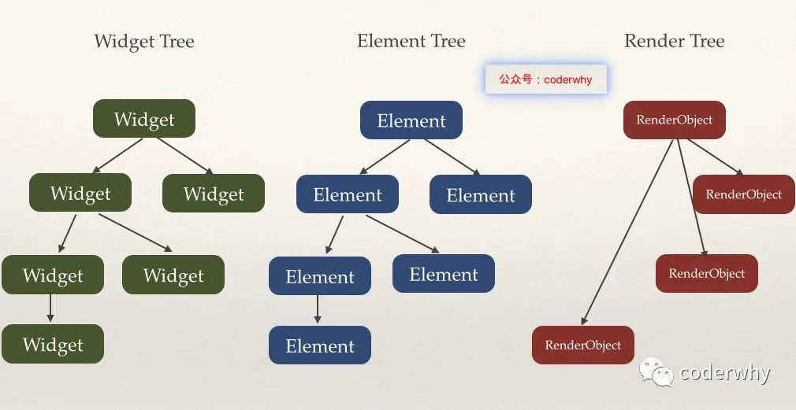

上面就是他们之间的关系，这里的Render Tree并不是和Element Tree、Widget Tree 一一对应的，这是因为并不是所有的Widget/Element都会被渲染只有继续于`RenderObjectWidget`的组件才会被最终渲染出来，其他的Widget都可以理解为是对`RenderObjectWidget`的修饰，所以虽然我们编写页面的时候Widget会嵌套很多层，但是真正渲染出来的时候层数并不会很深。

### Widget 树

#### Widget是什么？

- Widget就是一个个描述文件，这些描述文件在我们进行状态改变时会不断的build。（其实就相当于是vue 中的 template）
- 但是对于渲染对象来说，只会使用最小的开销来更新渲染界面。

#### Widget 分类

*组件Widget*：不会生成 RenderObject，如 Container，Text

*渲染 Widget*：会生成 RenderObject，如 Padding

可以通过他们的父类来确定他们是那种类型的组件，比如

```
Container -> StatelessWidget -> Widget
Padding -> SingleChildRenderObjectWidget -> RenderObjectWidget -> Widget
```

可以看到 Padding 是有继承于`RenderObjectWidget`的，所以 Padding 是一个 渲染的 Widget。

### Element 树

#### Element是什么？

- Element是一个Widget的实例，在树中详细的位置。（其实就相当于vue/react中的虚拟dom）
- Widget描述和配置子树的样子，而Element实际去配置在Element树中特定的位置。

#### Element 怎么被创建？

在`Widget`中有一个`createElement`的抽象方法需要实现，在flutter 中每个组件都是一个`Widget`所以无论是 组件Widget 还是 渲染 Widget 都会用`createElement`方法，这个方法就是用来创建`Element`的，不过每个组件的Element都不同，如组件Widget是`ComponentElement`，渲染Widget为`RenderObjectElement`。

> Element 只有在 Widget 重新构建并且key或者Widget的类发生改变的时候才会重新构建

#### 在 `Element`保存着什么？

+ `_renderObject`是渲染Widget创建出来的`RenderObjectElement`调用`createRenderObject`方法创建出来的`RenderObject`的引用。
+ `_widget`保存创建出当前`Element`的 Widget 的引用
+ `_state`是`StatefulWidget`里面生成的`StatefulElement`中调用`widget.createState()`方法返回的`State`实例，并且找个`StatefulElement`中还做了一个`_state.widget = _widget`的操作，所以我们能在`State`中访问`StatefulWidget`

### RenderObject 树

#### RenderObject是什么？

- 渲染树上的一个对象（其实就相当于html 中的真实dom）
- RenderObject层是渲染库的核心。

#### RenderObject 怎么被创建？

继承于`RenderObjectWidget`的子类都必须要实现一个`createRenderObject`的抽象方法，这个方法就是用来创建`RenderObject`的，这个方法是会在`RenderObjectElement`的`mount`方法中被调用，在调用`Element`的`mount`方法的时候还会调用widget的build方法。

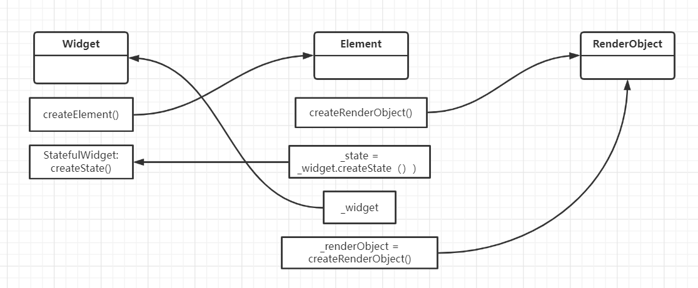

### BuildContext context 是什么 

在`Element`中调用`mount`方法的时候是会调用`Widget`的`build`方法的，并且在此时会传入一个参数`this`（如果是普通Widget就是`_widget.build(this)`，如果是状态Widget就是`state.build(this)`），所以`BuildContext context`其实就是一个`Element`实例

> ```dart
> class  Home extends StatelessWidget {
>   static const routeName = "/home";
>   const  Home({ Key? key }) : super(key: key);
> 
>   @override
>   Widget build(BuildContext context) {
>     return Scaffold(
>       appBar: AppBar(
>         title: Text("美食广场"),
>         leading: Builder(
>           //其实就是等当前的widget构建完成生成Element 之后在进行构建，这样才能拿到当前设置了drawer 的Scaffold的Element
>           builder: (ctx){
>             return IconButton(
>               onPressed: (){
>                 Scaffold.of(ctx).openDrawer();
>               }, 
>               icon: Icon(Icons.list)
>             );
>           },
>         ),
>       ),
>       body: HomeContent(),
>       drawer: Drawer(),
>     );
>   }
> }
> ```

### key 的作用

有这样一个页面

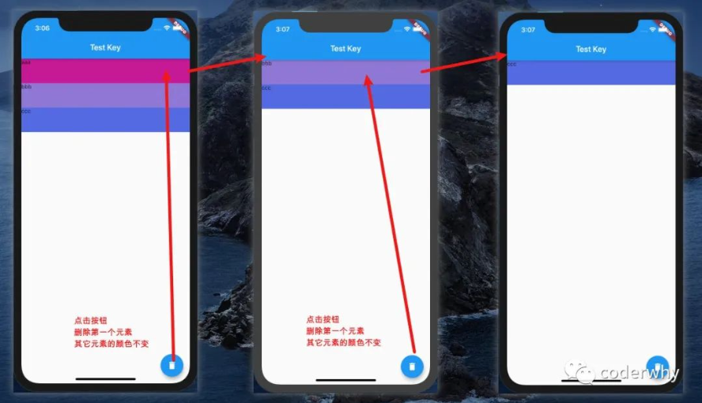

```dart
class _HYHomePageState extends State<HYHomePage> {
  List<String> names = ["aaa", "bbb", "ccc"];

  @override
  Widget build(BuildContext context) {
    return Scaffold(
      appBar: AppBar(
        title: Text("Test Key"),
      ),
      body: ListView(
        children: names.map((name) {
          return ListItemLess(name);
        }).toList(),
      ),

      floatingActionButton: FloatingActionButton(
        child: Icon(Icons.delete),
        onPressed: () {
          setState(() {
            names.removeAt(0);
          });
        }
      ),
    );
  }
}
```

**StatelessWidget的实现**

当使用`StatelessWidget`来定义`ListItemLess`时

```dart
class ListItemLess extends StatelessWidget {
  finalString name;
  final Color randomColor = Color.fromARGB(255, Random().nextInt(256), Random().nextInt(256), Random().nextInt(256));

  ListItemLess(this.name);

  @override
  Widget build(BuildContext context) {
    return Container(
      height: 60,
      child: Text(name),
      color: randomColor,
    );
  }
}
```

实现效果是每删除一个，所有的颜色都会发现一次变化，这是因为删除之后调用setState，会重新build，重新build出来的新的StatelessWidget会重新生成一个新的随机颜色

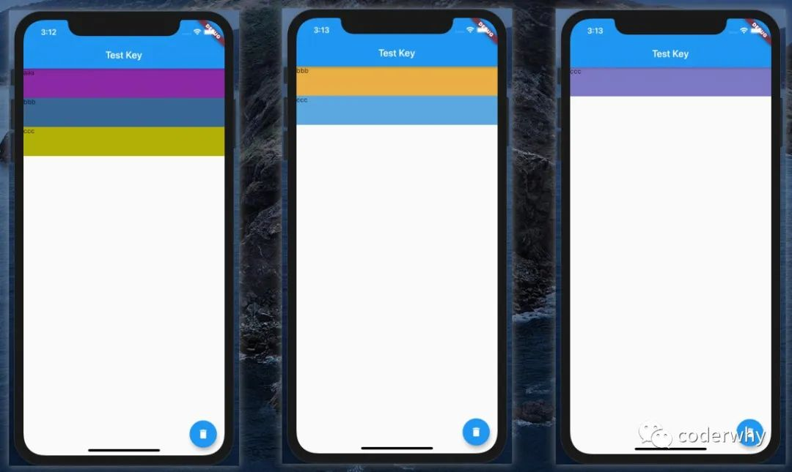

**StatefulWidget的实现（没有key）**

使用`StatefulWidget`来实现 `ListItemFul`

```dart
class ListItemFul extends StatefulWidget {
  finalString name;
  ListItemFul(this.name): super();
  @override
  _ListItemFulState createState() => _ListItemFulState();
}

class _ListItemFulState extends State<ListItemFul> {
  final Color randomColor = Color.fromARGB(255, Random().nextInt(256), Random().nextInt(256), Random().nextInt(256));

  @override
  Widget build(BuildContext context) {
    return Container(
      height: 60,
      child: Text(widget.name),
      color: randomColor,
    );
  }
}
```

我们发现一个很奇怪的现象，颜色不变化，但是数据向上移动了

- 这是因为在删除第一条数据的时候，Widget对应的Element并没有改变；
- 而Element中对应的State引用也没有发生改变；
- 在更新Widget的时候，Widget使用了没有改变的Element中的State；

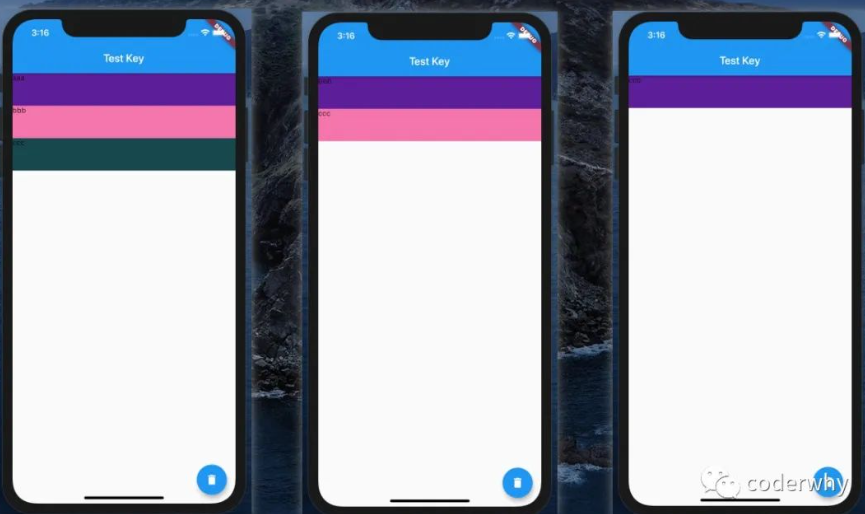

**StatefulWidget的实现（随机key）**

我们使用一个随机的key

ListItemFul的修改如下：

```dart
class ListItemFul extends StatefulWidget {  finalString name;  ListItemFul(this.name, {Key key}): super(key: key);  @override  _ListItemFulState createState() => _ListItemFulState();}
```

home界面代码修改如下：

```dart
body: ListView(  children: names.map((name) {    return ListItemFul(name, key: ValueKey(Random().nextInt(10000)),);  }).toList(),),
```

这一次我们发现，每次删除都会出现随机颜色的现象：

- 这是因为修改了key之后，Element会强制刷新，那么对应的State也会重新创建

```dart
// Widget类中的代码
staticbool canUpdate(Widget oldWidget, Widget newWidget) {  return oldWidget.runtimeType == newWidget.runtimeType    && oldWidget.key == newWidget.key;}
```

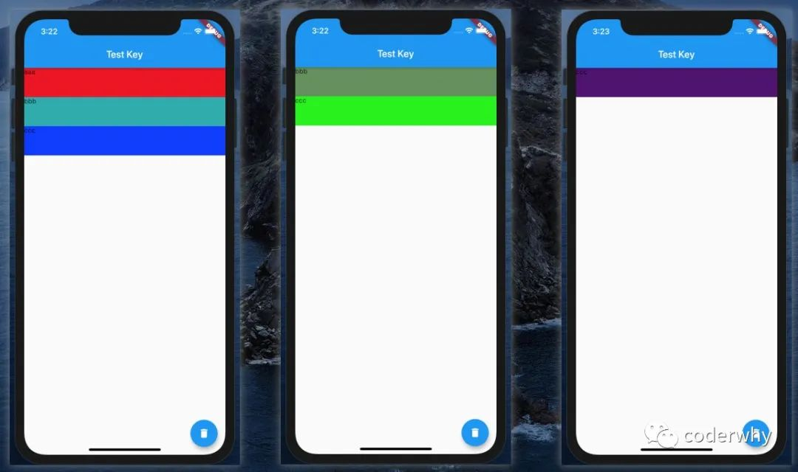

**StatefulWidget的实现（name为key）**

这次，我们将name作为key来看一下结果：

```dart
body: ListView(  children: names.map((name) {    return ListItemFul(name, key: ValueKey(name));  }).toList(),),
```

我们理想中的效果：

- 因为这是在更新widget的过程中根据key进行了diff算法
- 在前后进行对比时，发现bbb对应的Element和ccc对应的Element会继续使用，那么就会删除之前aaa对应的Element，而不是直接删除最后一个Element

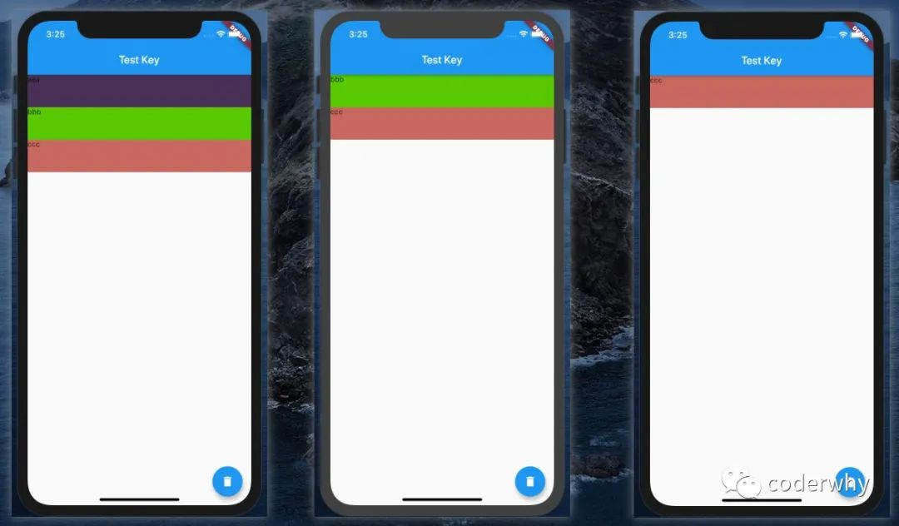

###  Key的分类

Key本身是一个抽象，不过它也有一个工厂构造器，创建出来一个ValueKey

直接子类主要有：LocalKey和GlobalKey

- LocalKey，它应用于具有相同父Element的Widget进行比较，也是diff算法的核心所在；
- GlobalKey，通常我们会使用GlobalKey某个Widget对应的Widget或State或Element

#### LocalKey

**LocalKey有三个子类**

ValueKey：

- ValueKey是当我们以特定的值作为key时使用，比如一个字符串、数字等等

ObjectKey：

- 如果两个学生，他们的名字一样，使用name作为他们的key就不合适了
- 我们可以创建出一个学生对象，使用对象来作为key

UniqueKey

- 如果我们要确保key的唯一性，可以使用UniqueKey；
- 比如我们之前使用随机数来保证key的不同，这里我们就可以换成UniqueKey；

#### GlobalKey

GlobalKey可以帮助我们访问某个Widget的信息，包括Widget或State或Element等对象

我们来看下面的例子：我希望可以在HYHomePage中直接访问HYHomeContent中的内容

```dart
class HYHomePage extends StatelessWidget {
  final GlobalKey<_HYHomeContentState> homeKey = GlobalKey();

  @override
  Widget build(BuildContext context) {
    return Scaffold(
      appBar: AppBar(
        title: Text("列表测试"),
      ),
      body: HYHomeContent(key: homeKey),
      floatingActionButton: FloatingActionButton(
        child: Icon(Icons.data_usage),
        onPressed: () {
          print("${homeKey.currentState.value}");
          print("${homeKey.currentState.widget.name}");
          print("${homeKey.currentContext}");
        },
      ),
    );
  }
}

class HYHomeContent extends StatefulWidget {
  finalString name = "123";

  HYHomeContent({Key key}): super(key: key);

  @override
  _HYHomeContentState createState() => _HYHomeContentState();
}

class _HYHomeContentState extends State<HYHomeContent> {
  finalString value = "abc";

  @override
  Widget build(BuildContext context) {
    return Container();
  }
}
```

[Flutter的三棵树渲染机制和原理](https://juejin.cn/post/6916113193207070734)


## 状态管理

在 flutter 中有两种状态概念，一种是**短时状态**，尽在自己的 widget 内使用的状态，这种状态主要使用`setState`进行管理；一种是**应用状态**，多个widget或者页面共用的状态，这种方式主要使用`InheritedWidget`或者`Provider`。

### 父子组件通信

父子组件之间的传值主要是通过 组件的构造函数参数进行传递，如果是父组件传递给子组件，那么就可以直接将数据传递过去；如果是子组件传给父组件就可以通过父组件传递过来的方法来将数据传递出去

**通过构造函数参数传递数据**

父组件

```dart
class A extends StatefulWidget {
  A({Key? key}) : super(key: key);
  @override
  State<A> createState() => _AState();
}

class _AState extends State<A> {
  String parentData = "parent";
  String childData = '';
  //父组件接收子组件传递过来的数据
  void getChildData(data) {
    setState(() {
      childData = data;
    });
  }

  @override
  Widget build(BuildContext context) {
    return Scaffold(
      body: ListView(
        children: [
          Text('child data:$childData'),
          Divider(),
          B(
            data: parentData,//父组件传递数据给子组件
            cb: (val) => {getChildData(val)},
          )
        ],
      ),
    );
  }
}
```

子组件

```dart
class B extends StatefulWidget {
  late String data;
  late Function cb;
  B({required String data, required Function cb, Key? key}) : super(key: key) {
    this.data = data;
    this.cb = cb;
  }
  String childData = "child";
  @override
  State<B> createState() => _BState();
}

class _BState extends State<B> {
  int count = 0;
  @override
  Widget build(BuildContext context) {
    return Column(
      children: [
        Text('parent data:${widget.data}'),
        ElevatedButton(
            onPressed: () {
              //传递数据给父组件
              count++;
              this.widget.cb("${widget.childData}${count}");
            },
            child: Text('send data to parent'))
      ],
    );
  }
}
```

显然这种方式是非常麻烦的，当层级高了之后如果比层级差距比较高的两个组件想要进行通信的话，就需要中间的每个组件都传递一些不需要的数据，而且当状态更新时不相关的组件也会更新。


### **通过`InheritedWidget`实现数据共享**

在高层级的组件树中通过 构造函数进行数据传递的方法是非常麻烦且耗费性能的，这是可以通过`inheritedWidget`组件创建一个状态数据中心提供给其他的子组件，然后在需要使用的组件中通过`context.dependOnInheritedWidgetOfExactType<A>().xxxx`来获取数据中心的数据

例如，有`Home -> A -> B -> C`，其中A作为数据中心

```dart
class InherHome extends StatefulWidget {
  int counter = 0;
  InherHome({Key? key }) : super(key: key);
  @override
  State<InherHome> createState() => _InherHomeState();
}

class _InherHomeState extends State<InherHome> {
  @override
  Widget build(BuildContext context) {
    return Scaffold(
      appBar: AppBar(
        title: Text("data share"),
      ),
      body:A(
        counter: this.widget.counter,
        child: B(
          child: C(),
        ),
      ),
      floatingActionButton: FloatingActionButton(
        onPressed: ()=>{
          this.setState(() {
            this.widget.counter ++;
          })
        },
      )
    );
  }
}
//###########################################
class A extends InheritedWidget{
  int counter = 0;//需要共享的数据
  A({required Widget child,required this.counter}):super(child: child);
  // 为了方便获取A的数据，在这里定一个静态方法来返回
  static A? of(BuildContext context){
    //`dependOnInheritedWidgetOfExactType`的作用是沿着`Element`树找到最近的 A，从Element树中取出Widget对象。
    return context.dependOnInheritedWidgetOfExactType<A>();
  }
  // 如果返回 true：执行依赖当前的 InheritedWidget 的 State中的didChangeDependencies
  @override
  bool updateShouldNotify(covariant A oldWidget) {
    return oldWidget.counter != this.counter;
  }
}
//###########################################
class B extends StatefulWidget {
  final Widget child;
  const B({required this.child, Key? key }) : super(key: key);

  @override
  State<B> createState() => _BState();
}
class _BState extends State<B> {
  @override
  Widget build(BuildContext context) {
    print("B Build");
    return Container(
      child: this.widget.child,
    );
  }
}
//###########################################
class C extends StatefulWidget {
  const C({ Key? key }) : super(key: key);

  @override
  State<C> createState() => _CState();
}
class _CState extends State<C> {
  //当共享数据更新（updateShouldNotify 返回true）时执行 
  @override
  void didChangeDependencies() {
    super.didChangeDependencies();
    print("C didChangeDependencies");
  }
  @override
  Widget build(BuildContext context) {
    print("C Build");
    return Container(
      child: Text('从 Home-> 获取到的值是：${A.of(context)?.counter}'),
    );
  }
}
```

这样就把A作为了一个数据中心，当`counter`发送改变的时候，页面就会更新。也可以在A中定义修改状态的方法，方便修改状态时调用.

> 这种方式其实并不是完整的数据中心，因为其中还确实了更新状态的方法，在`inheritedWidget`中是没有`setState`方法的，所以如果要实现一个真中的数据中心的话就需要在外层在包裹一层`StatefulWidget`组件，为数据中心提供一个初始状态数据和修改状态的方法。

但是当更新状态的时候会发现控制台中会输出

```
B Build
C didChangeDependencies
C Build
```

也就是说 不相关的B组件也执行了`build`重建了组件，这就导致了性能损耗，可以通过`ValueNotifier`来解决

```dart
class A extends InheritedWidget {
  // int counter = 0; //需要共享的数据
  late ValueNotifier<int> _valueNotifier;
  A({required Widget child, required int counter}) : super(child: child) {
    this._valueNotifier = new ValueNotifier(counter);
  }
  ValueNotifier<int> get valueNotifier => this._valueNotifier;
  // 为了方便获取A的数据，在这里定一个静态方法来返回
  static A of(BuildContext context) {
    // return context.dependOnInheritedWidgetOfExactType<A>();
    return context.getElementForInheritedWidgetOfExactType<A>()?.widget as A;
  }

  add(int step) {
    _valueNotifier.value += step;
  }

  //控制状态改变时是否更新页面
  @override
  bool updateShouldNotify(covariant A oldWidget) {
    return false;
  }
}
//#################################
class C extends StatefulWidget {
  const C({Key? key}) : super(key: key);

  @override
  State<C> createState() => _CState();
}

class _CState extends State<C> {
  //当共享数据更新时执行
  @override
  void didChangeDependencies() {
    super.didChangeDependencies();
    print("C didChangeDependencies");
  }

  @override
  Widget build(BuildContext context) {
    print("C Build");
    return ValueListenableBuilder(
      valueListenable: A.of(context).valueNotifier,
      builder: (BuildContext context, int value, Widget? child) {
        return Container(
          child: Column(
            children: [
              Text('从 Home-> 获取到的值是：${value}'),
              ElevatedButton(
                  onPressed: () => {A.of(context).add(2)}, child: Text('添加2'))
            ],
          ),
        );
      },
    );
  }
}
```


### Provider

`Provider`是官方推荐的一个状态管理库，`InheritedWidget`实现的是对子组件的数据共享，而且如果想要修改状态还是比较麻烦的。

#### **Provider 基本使用**

1.创建自己需要共享的数据

```dart
//ChangeNotifier 有可以通知所有使用当前状态的组件进行更新的方法
class CounterViewModel extends ChangeNotifier{
  int? _counter;
  int get counter => counter;
  set counter(int val){
    _counter = val;
    //通知所有使用了 counter 的组件进行更新
    notifyListeners();
  }
}
```

2.在应用程序的顶层包裹一个 `ChangeNotifierProvider`

```dart
void main(){
  runApp(
  	changeNotifierProvider(
    	create:(context)=>CounterViewModel,
    	child:MyApp(),
    )
  )
}
```

3.在其他文件使用共享数据

```dart
//在 build 中通过 Provider.of() 获取数据实例
class Home extends StatelessWidget {
  const Home({ Key? key }) : super(key: key);
  @override
  Widget build(BuildContext context) {
    int counter = Provider.of<CounterViewModel>(context).counter;
    return Text("counter:$counter");
  }
}
```

这种方式是用几个弊端的，

1. 就是依赖于build中的`context`，在没有`context`的场景下是无法使用的，比如说`floatingActionButton`按钮来修改状态就无法获取到状态了，
2. 当状态改变的时候，通过`Provider.of`引用的状态的组件的build方法会被重新执行，也就意味着整个组件都被重新构建了

#### **通过`Consumer`解决**

```dart
class Home extends StatelessWidget {
  const Home({ Key? key }) : super(key: key);
  @override
  Widget build(BuildContext context) {
    return Consumer<CounterViewModel>(
      builder: (ctx, counterPro, child) {
        return Text("counter:$counter");
      },
    );
  }
}

floatingActionButton:Consumer<CounterViewModel>(
  builder: (ctx, counterPro, child) {
    return FloatingActionButton(
      child: child,
      onPressed: () {
        counterPro.counter += 1;
      },
    );
  },
  child:Icon(Icons.add),
)
```

> Consumer的builder方法解析：
>
> - 参数一：context，每个build方法都会有上下文，目的是知道当前树的位置
> - 参数二：ChangeNotifier对应的实例，也是我们在builder函数中主要使用的对象
> - 参数三：child，目的是进行优化，如果builder下面有一颗庞大的子树，当模型发生改变的时候，我们并不希望重新build这颗子树，那么就可以将这颗子树放到Consumer的child中，在这里直接引入即可（注意我案例中的Icon所放的位置）

使用`Consumer`就不需要依赖`context`了，而且当状态发生改变的时候就会调用`Consumer`的`builder`方法而不会将整个组件进行重建了。

不过还有个问题是`FloatingActionButton`只是要修改状态并不依赖状态的，但是当状态改变的时候还是会被重新构建

#### **可以使用`Selector`解决**

```dart
floatingActionButton: Selector<CounterProvider, CounterProvider>(
  selector: (ctx, provider) => provider,
  shouldRebuild: (pre, next) => false,
  builder: (ctx, counterPro, child) {
    print("floatingActionButton展示的位置builder被调用");
    return FloatingActionButton(
      child: child,
      onPressed: () {
        counterPro.counter += 1;
      },
    );
  },
  child: Icon(Icons.add),
),
```

Selector和Consumer对比，不同之处主要是三个关键点：

- 关键点1：泛型参数是两个

- - 泛型参数一：我们这次要使用的Provider
  - 泛型参数二：转换之后的数据类型，比如我这里转换之后依然是使用CounterProvider，那么他们两个就是一样的类型

- 关键点2：selector回调函数

- - 转换的回调函数，你希望如何进行转换
  - S Function(BuildContext, A) selector
  - 我这里没有进行转换，所以直接将A实例返回即可

- 关键点3：是否希望重新rebuild

- - 这里也是一个回调函数，我们可以拿到转换前后的两个实例；
  - bool Function(T previous, T next);
  - 因为这里我不希望它重新rebuild，无论数据如何变化，所以这里我直接return false；

#### **多数据`MultiProvider`**

上面的几种方法都是针对于**单个对象数据**的操作的，但是在开发中，我们需要共享的数据肯定不止一个，并且数据之间我们需要组织到一起，所以一个Provider必然是不够的。

我们在增加一个新的`ChangeNotifier`

```dart
class UserInfo {
  String nickname;
  int level;

  UserInfo(this.nickname, this.level);
}

class UserProvider extends ChangeNotifier {
  UserInfo _userInfo = UserInfo("why", 18);

  set userInfo(UserInfo info) {
    _userInfo = info;
    notifyListeners();
  }

  get userInfo {
    return _userInfo;
  }
}
```

如果在开发中我们有多个Provider需要提供应该怎么做呢？

方式一：多个Provider之间嵌套

- 这样做有很大的弊端，如果嵌套层级过多不方便维护，扩展性也比较差

```dart
  runApp(ChangeNotifierProvider(
    create: (context) => CounterProvider(),
    child: ChangeNotifierProvider(
      create: (context) => UserProvider(),
      child: MyApp()
    ),
  ));
```

方式二：使用`MultiProvider`

```dart
runApp(MultiProvider(
  providers: [
    ChangeNotifierProvider(create: (ctx) => CounterProvider()),
    ChangeNotifierProvider(create: (ctx) => UserProvider()),
  ],
  child: MyApp(),
));
```

#### **状态依赖**

如果一个状态A依赖于另一个状态B的时候，在A状态就导入B的状态，但是并不能简单的通过`import`进行导入，而需要通过`ChangeNotifierProxyProvider`进行依赖

```dart
runApp(MultiProvider(
  providers: [
    ChangeNotifierProvider(create: (ctx) => B()),
    ChangeNotifierProxyProvider<B,A>(
      create: (ctx) => A(),
      update:(ctx,bVM,aVM){
        //调用 A 中的方法将 B 的实例保存下来
        aVM.updateBVM(bvm);
        return aVM
      }
    ),
  ],
  child: MyApp(),
));
```


### GetX

GetX 是一个多功能的集合，提供了许多实用的功能和组件，比如方便调用的弹窗，路由，状态管理，依赖注入等功能，目前大多数情况使用的都是他的状态管理功能，比`Provider`、`InheritedWidget`要简单得多

> 插件
>
> + **getx_template**：一键生成每个页面必需的文件夹、文件、模板代码等等
> + **GetX Snippets**：输入少量字母，自动提示选择后，可生成常用的模板代码

如果需要使用其中的路由、snackbar、国际化、bottomSheet、对话框以及与路由相关的高级apis和没有上下文（context）的情况下时就需要使用`GetMaterialApp`替换原来的`MaterialApp`组件，通过`GetMaterialApp`就能够提供相应的功能（GetMaterialApp并不是修改后的MaterialApp，它只是一个预先配置的Widget，它的子组件是默认的MaterialApp）。

```dart
void main => runApp(GetMaterialApp(home:CounterPage()));
```

```dart
class CounterPage extends StatelessWidget {
  const CounterPage({ Key? key }) : super(key: key);
  @override
  Widget build(BuildContext context) {
    return Scaffold(
      appBar: AppBar(
        title: Text('GetX'),
      ),
      body: Text("hello"),
    );
  }
}
```


#### 状态管理

首先需要创建一个状态类

```dart
class Controller extends GetxController{
  var count = 0.obs;
  increment() => count++;
}
```

其中`.obs`表示这个数据需要进行监听

> `.obs`本质上是使用GetX 中的`RxInt(0)`或者`Rx<Int>(0)`来实现的，所以被`.obs`修饰的状态，不再是dart中的基础类型而是`RxInt`这种类型。这也就意味着创建响应式数据的时候并不需要通过继承`GetxController`实现。而是可以直接使用上面的方法在任意位置创建（不过为了方便管理和维护最好还是统一创建为好）。
>
> 在访问的时候其本质上是访问`.value`属性，如`count.value`在使用`final`进行数据定义的时候，如果后续需要修改状态就可以通过`count.value`来修改
>
> ```dart
> class Controller extends GetxController{
>   final count = RxInt(0);
>   increment() => count.value++;
> }
> ```
>
> 不过需要注意的是对于类的修饰，访问和更新数据的方式是不一样的
>
> ```dart
> class User{
>     User({this.name = '', this.age = 0});
>     String name;
>     int age;
> }
> // controller
> final user = User().obs;
> //当你需要更新user变量时。
> user.update( (user) { // 这个参数是你要更新的类本身。
>     user.name = 'Jonny';
>     user.age = 18;
> });
> // 更新user变量的另一种方式。
> user(User(name: 'João', age: 35));
> 
> // view
> Obx(()=> Text("Name ${user.value.name}: Age: ${user.value.age}"));
> // 你也可以不使用.value来访问模型值。
> user().name; // 注意是user变量，而不是类变量（首字母是小写的）。
> ```
>
> 

然后在需要使用到状态的地方通过使用`Get.put()`实例化你的类，使其对当下的所有子路由可用，并且通过`Obx()`来包裹依赖状态的组件即可（也就是说只有`Obx`包裹的部分是依赖状态，其他的都不会是动态的所以以后可以尽量使用`StatelessWidget`）。

```dart
class CounterPage extends StatelessWidget {
  const CounterPage({Key? key}) : super(key: key);
  @override
  Widget build(BuildContext context) {
    final Controller c = Get.put(Controller());
    return Scaffold(
      appBar: AppBar(
        title: Text('GetX'),
      ),
      body: Obx(()=>Text("hello count:${c.count}")),
      floatingActionButton: FloatingActionButton(
        child: Icon(Icons.add),
        onPressed:  c.increment,
      ),
    );
  }
}
```

需要注意的是是`Get.put(Controller(),tag:名字)`，是先将`Controller()`进行实例化之后放到`GetX`进行统一管理，之后再返回实例的，所以之后要进行管理的状态类都需要通过`Get.put`放到管理中心，之后需要再次使用的时候可以使用`Get.find(tag:名字)`或者`Get.find<类型>()`来获取

```dart
class Controller extends GetxController{
  var count = 0.obs;
  increment() => count++;
  static Controller get to => Get.find();
}
//使用
FloatingActionButton(
  onPressed: () {
    Controller.to.increment(),
  } // 是不是贼简单！
  child: Text("${Controller.to.count}"),
),
```

> 有多种方法向依赖管理器中添加控制器
>
> ```dart
> Get.put<SomeClass>(SomeClass());
> //可以懒加载一个依赖，这样它只有在使用时才会被实例化
> Get.lazyPut<ApiMock>(() => ApiMock());
> //当初始化需要远程的数据的时候会有用。
> Get.putAsync<SharedPreferences>(() async {
>   final prefs = await SharedPreferences.getInstance();
>   await prefs.setInt('counter', 12345);
>   return prefs;
> });
> ```

**GetX**

除了使用`Obx`来监听状态改变外，还可以使用`GetX`来监听，他们的区别在于`Obx`需要先通过`Get.put()	`或者`Get.find()`获取到控制器，而`GetX`就不需要。

```dart
GetX<Controller>(
  builder: (controller) {
    print("count 2 rebuild");
    return Text('${controller.count2}');
  },
),
```

**Wokers**

`GetxController`中有个`onInit()`方法是用来初始化状态的，在其中可以使用相关的woker来对状态进行监听

```dart
class Controller extends GetxController{
  var count = 0.obs;
  increment() => count++;
 	@override
  void onInit(){
    //初始化状态
    ///每次`count1`变化时调用。
    ever(count, (_) => print("$_ has been changed"));
    ///只有在变量$_第一次被改变时才会被调用。
    once(count, (_) => print("$_ was changed once"));
    ///防DDos - 每当用户停止输入1秒时调用，例如。
    debounce(count, (_) => print("debouce$_"), time: Duration(seconds: 1));
    ///忽略1秒内的所有变化。
    interval(count, (_) => print("interval $_"), time: Duration(seconds: 1));
  }
}
```

所有worker都会返回一个`Worker`实例，你可以用它来取消（通过`dispose()`）worker。一般可以在`GetxController`的`onClose()`中今天取消。

**GetBuilder**

如果不想使用响应式的状态的话，也可以使用简单模式来实现类似`Provider`的效果

```dart
// 创建控制器类并扩展GetxController。
class Controller extends GetxController {
  int counter = 0;//不创建响应式的状态
  void increment() {
    counter++;
    update(); // 当调用增量时，使用update()来更新用户界面上的计数器变量。
  }
}
// 在你的Stateless/Stateful类中，当调用increment时，使用GetBuilder来更新Text。
GetBuilder<Controller>(
  init: Controller(), // 首次启动
  builder: (_) => Text(
    '${_.counter}',
  ),
)
```

`update([ids])`可以传入一个id数组，可以指定哪些定义了id的`GetBuilder`更新，并且第二个参数还可以传入条件

```dart
update(['count1']);//只有第一个 GetBuilder 会更新
update(['count2'], counter > 2);//当 counter 大于2的时候才更新第二个 GetBuilder
//-----------------------
GetBuilder<Controller>(
  id:'count1',// 指定id
  init: Controller(),
  builder: (_) => Text(
    'value1:${_.counter}',
  ),
),
GetBuilder<Controller>(
  id:'count2', // 指定id
  init: Controller(),
  builder: (_) => Text(
    'value2:${_.counter}',
  ),
)
```

**GetView**

它是一个对已注册的`Controller`有一个名为`controller`的getter的`const Stateless`的Widget，在里面可以直接通过`controller`访问到对应的控制器

```dart
class AwesomeController extends GetxController {
  final String title = 'My Awesome View';
}
// 一定要记住传递你用来注册控制器的`Type`!
class AwesomeView extends GetView<AwesomeController> {
  @override
  Widget build(BuildContext context) {
    return Container(
      padding: EdgeInsets.all(20),
      child: Text( controller.title ), // 只需调用 "controller.something"。
    );
  }
}
```

**Binding**

上面说了可以通过`Get.find()`来获取控制器，但是前提条件是控制器已经通过`Get.put`添加到依赖中了，一般来说都会尽早的添加进去，比如在首页的`build`方法中或者在`main`中，如果想要在进入页面器添加就可以使用`Bindings`来进行绑定

```dart
class AwesomeBinding extends Bindings {
  @override
  void dependencies() {
    Get.lazyPut(() => AwesomeController());
  }
}
```

当然还需要在路由处进行绑定

```dart
//普通路由
Get.to(AwesomeView(), binding: AwesomeBinding());
Get.off(AwesomeView(), binding: AwesomeBinding());
//命名路由
GetPage(name: "/awesome", page: () => AwesomeView(), binding: AwesomeBinding());
```

还有个`bindings`可以同时绑定多个


#### 弹窗调用

使用 flutter 中原生的弹窗是非常麻烦的，比如调用`SnackBar`吐司弹窗需要`ScaffoldMessenger.of(context).showSnackBar(SnackBar(),),`这样来调用，而在GetX中可以直接使用`Get.snackBar()`就可以调用起来了，还用模态弹窗也是`Get.defaultDialog()`就可以

#### 路由功能

导航到新页面

```dart
Get.to(NextScreen());
Get.to(NextScreen(),arguments:{name:'jack'});
```

接收参数只需要通过`Get.arguments`就能获取到了，而且通过`transion`直接定义跳转动画。`Get.to()`返回的也是一个Future，用来接收`Get.back()`返回时传递的参数

要关闭`snackbars, dialogs, bottomsheets`或任何你通常会用`Navigator.pop(context)`关闭的东西。

```dart
Get.back();
Get.back(result:'success');
```

进入下一个页面，但没有返回上一个页面的选项（用于闪屏页，登录页面等）。

```dart
Get.off(NextScreen());
```

进入下一个页面并取消之前的所有路由（在购物车、投票和测试中很有用）。

```dart
Get.offAll(NextScreen());
```

**命名路由**

定义路由列表

```dart
GetMaterialApp(
  initialRoute: '/',
  getPages: [
    GetPage(name: '/', page: () => MyHomePage()),
    GetPage(name: '/details', page: () => Details()),
    GetPage(
      name: '/third',
      page: () => Third(),
      transition: Transition.zoom  
    ),
  ],
  unknownRoute: GetPage(name: '/notfound', page: () => UnknownRoutePage()),
)
```

```dart
Get.toNamed('/details');
Get.offNamed("/NextScreen");
Get.offAllNamed("/NextScreen");
```

**路由传参**

路由的传参可以再路由跳转的方法中通过`arguments`进行传递，然后在相应的页面通过`Get.arguments`就能获取到了

```dart
Get.to(NextScreen(),arguments:{name:'jack'});
Get.toNamed('/details',arguments:{name:'jack'});
```

不过在命名路由中还可以通过配置动态路由或者路由名参数来实现另一种参数传递方式，比如配置动态路由

```dart
getPages: [
  GetPage(name: '/users', page: () => Details()),
  GetPage(name: '/details/:id', page: () => Details()),
],
```

传递参数

```dart
Get.toNamed('/user?name=jack');
Get.toNamed('/details/123?name=rocy');
```

获取参数

```dart
//user
Get.parameters['name'];
//details
Get.parameters['id'];
Get.parameters['name'];
```


#### 中间件

可以通过`routingCallback`来定义路由中间件，这个中间件将会在路由跳转前执行，所以可以在这里做路由拦截的操作

```dart
GetMaterialApp(
  routingCallback: (routing) {
    if(routing.current == '/second'){
      openAds();
    }
  }
)
```

有些页面需要登录验证，有些不需要，这时候可以不使用 `routingCallback`，单独写一个验证的`GetMiddleware`：

```dart
class AuthMiddleware extends GetMiddleware {
  @override
  int? priority = 2;//这个是权重，越小越先执行

  bool isAuthenticated = false;

  @override
  RouteSettings? redirect(String? route) {
    debugPrint('=======AuthMiddleware.redirect:$route');
    if (!isAuthenticated) {
      return RouteSettings(name: Routes.LOGIN);
    }
    return super.redirect(route);
  }

  @override
  GetPage? onPageCalled(GetPage? page) {
    debugPrint('=======AuthMiddleware.onPageCalled:$page');
    return super.onPageCalled(page);
  }
}
```

然后在 GetPage里使用：

```dart
GetPage(
  name: Routes.MIDDLEWARE_PAGE,
  page: () => MiddlewarePagePage(),
  binding: MiddlewarePageBinding(),
  middlewares: [AuthMiddleware()],
),
```

```dart
//当被调用路由的页面被搜索时，这个函数将被调用
RouteSettings redirect(String route){}
//在调用页面时，创建任何东西之前，这个函数会先被调用
GetPage onPageCalled(GetPage page){}
//这个函数将在绑定初始化之前被调用
List<Bindings> onBindingsStart(List<Bindings> bindings){}
//这个函数将在绑定初始化之后被调用
GetPageBuilder onPageBuildStart(GetPageBuilder page){}
//这个函数将在GetPage.page调用后被调用，并给出函数的结果，并获取将要显示的widget。
onPageBuilt(){}
//这个函数将在处理完页面的所有相关对象(Controllers, views, ...)之后被调用
onPageDispose(){}
```


如果想要快速创建一个GetX风格的项目架构可以在`pub.dev`中安装`get_cli`来创建。

[GetX文档](https://github.com/jonataslaw/getx/blob/master/README.zh-cn.md#%E4%BE%9D%E8%B5%96%E7%AE%A1%E7%90%86)


## 路由

在`Scaffold`组件中可以通过`bottomNavigationBar`属性可以定义底部的导航选项卡，这个属性的值容器是`BottomNavigationBar`，通过`items`选项定义选项卡列表项，`currentIndex`定义选中当前选中的项的索引，`onTab`定义点击选项卡的回调函数所以可以通过`BottomNavigationBar`来控制`Scaffold`组件的`body`显示的组件来实现路由的效果。需要注意的是，如果`items`超过3项就需要设置`type: BottomNavigationBarType.fixed`选项卡才会显示。

还有需要显示的页面可以通过`body`来定义，在 flutter 中有个组件可以根据输入的index来显示对应索引的页面 `IndexedStack`，当也可以使用一个`List`来存储所有的页面，然后通过修改索引来显示页面的。

```dart
class Tab extends StatefulWidget {
  const Tab({Key? key}) : super(key: key);

  @override
  State<Tab> createState() => _TabState();
}

class _TabState extends State<Tab> {
  int currentIndex = 0;
  //List<Widget> pageList = [Page1(), Page2(), Page3()];
  Widget pages = IndexedStack(index:this.currentIndex,children:[Page1(), Page2(), Page3()]);
  @override
  Widget build(BuildContext context) {
    return Scaffold(
      appBar: AppBar(
        title: Text('hello world'),
      ),
      //body: this.pageList[this.currentIndex],
      body: pages,
      bottomNavigationBar: BottomNavigationBar(
        currentIndex: currentIndex,
        type: BottomNavigationBarType.fixed,//如果items超过3项就需要设置
        items: [
          BottomNavigationBarItem(icon: Icon(Icons.home_outlined), label: '首页'),
          BottomNavigationBarItem(
              icon: Icon(Icons.ac_unit_rounded), label: '血'),
          BottomNavigationBarItem(
              icon: Icon(Icons.access_alarm_sharp), label: '时间'),
        ],
        onTap: (index) {
          this.setState(() {
            this.currentIndex = index;
          });
        },
      ),
    );
  }
}
class Page1 extends StatelessWidget {
  const Page1({Key? key}) : super(key: key);
  @override
  Widget build(BuildContext context) {
    return Container(
      child: Center(
        child: Text("Page1"),
      ),
    );
  }
}
class Page2 extends StatefulWidget {
  const Page2({Key? key}) : super(key: key);
  @override
  State<Page2> createState() => _Page2State();
}
class _Page2State extends State<Page2> {
  @override
  Widget build(BuildContext context) {
    return Container(
      child: Center(
        child: Text("Page2"),
      ),
    );
  }
}
class Page3 extends StatelessWidget {
  const Page3({Key? key}) : super(key: key);
  @override
  Widget build(BuildContext context) {
    return Container(
      child: Center(
        child: Text("Page3"),
      ),
    );
  }
}
```

通过`BottomNavigationBar`可以实现简单的路由效果，但是这个并不是真正的路由，因为这种方式搞多依赖于UI

在Flutter中，路由管理主要有两个类：**Route**和**Navigator**

### Route

Route：一个页面要想被路由统一管理，必须包装为一个Route，但是Route是一个抽象类，所以它是不能实例化的，所以可以使用他的子类，常用的是`MaterialPageRoute`。

```dart
MaterialPageRoute(
  builder:(BuildContext context) => Page(),
  fullScreenDialog:true,//以全屏弹窗的形似显示，这样的话页面会从底部弹出
)
```

如果需要自定义页面切换的过度动画可以使用`PageRouteBuilder`

```dart
//页面淡入
PageRouteBuilder(
	transitionDuration:Duration(seconds:2),
  pageBuilder:(ctx,ani1,ani2){
    return FadeTransition(
    	opacity:ani1,
      child:Page(),
    )
  }
)
```


### Navigator

在 flutter 中几乎都是组件，所以flutter 的路由跳转实际上就是将当前的页面替换成其他的页面组件

flutter 中有两种路由模式，一种是普通路由通过`Navigator`实现，一种是命名路由，通过`MaterialApp`的`routers`属性实现。

**常用的方法**

+ `Navigator.of(context).push()`普通跳转
+ `Navigator.of(context).pop()`跳转到栈定的页面，相当于返回，
+ 返回时还可以传递传递参数`pop('xxx')`，之后可以在进入当前页面的那个路由中通过then接收，比如要返回的A页面`Navigator.of(context).push(MaterialPageRoute(builder:(context)=>A())).then(res=>print(res))`
  
+ 如果点击左上角的返回键进行返回的时候也需要传参数的话，有两种方法可以解决，一种是通过`AppBar`的`leading`自定义返回按钮，一种是通过`WillPopScope`将当前的`Scaffold`页面包裹，然后`onWillPop`定义返回的事件监听，这个函数要求有一个Future的返回值：
  
+ - true：那么系统会自动帮我们执行pop操作
    - false：系统不再执行pop操作，需要我们自己来执行
+ `Navigator.of(context).pushReplacementNamed()`跳转到另外一个页面，并替换当前记录
+ `Navigator.of(context).pushAndRemoveUntil()`跳转到另外一个页面，对以往的历史记录做移除操作，比如跳转到`Page1`并移除跳转记录`Navigator.of(context).pushAndRemoveUntil(MaterialPageRoute(builder:(context)=>Page1())),(route)=>route == null`

> 其实也可以使用`navigator`，一般情况下就是`Navigator.of(context)`，所以可以`navigator.push()`

### **普通路由**

将上面的 `Page1`改成

```dart
class Page1 extends StatefulWidget {
  const Page1({Key? key}) : super(key: key);
  @override
  State<Page1> createState() => _Page1State();
}
class _Page1State extends State<Page1>{
 	@override
  Widget build(BuildContext context){
    return Container(
      child: ElevatedButton(
        child:Text('点我跳转'),
      	onPressed(){
          // 路由跳转，of方法可以定义执行上下文，如果不使用of的话,可以在push的第二个参数传入 Navigator.push(context,...)
         	Navigator.of(context).push(
          	MaterialPageRoute(
            	builder:(BuildContext context) => Page2(),
            )
          )
        }
      )
    );
  }
}
```

**路由传参**

上面就通过`Navigator.of().push`实现了一个简单的路由跳转，一般路由跳转都会携带参数的，在 flutter 中传递参数一般都是通过给构造函数传递参数实现的，路由和父子组件之间通信也是如此

那么在`Page1` 向`page2`传递参数就是这样

```dart
Navigator.of(context).push(
  MaterialPageRoute(
    builder:(BuildContext context) => Page2('这是一个参数'),
  )
)
```

同时`Page2`也需要做一下修改

```dart
class Page2 extends StatefulWidget {
  String? params;
  Page2(this.params,{ Key? key }) : super(key: key);

  @override
  State<Page2> createState() => _Page2State();
}

class _Page2State extends State<Page2> {
  @override
  Widget build(BuildContext context) {
    return Scaffold(
      appBar: AppBar(
        title: Text('page2'),
      ),
      body: Container(
        child: Text('Page2 get params:${widget.params}'),
      ),
    );
  }
}
```

需要注意的是，如果是无状态组件的话可以直接使用传过来的构造参数，但是如果是有状态组件的话就需要通过`widget`来访问，因为 有状态组件的实体内容（状态类`_Page2State`）和构造类(`Page2`)是分开的，`widget`默认存在于状态类中，表示的就是`Page2`实例。

### **命名路由**

flutter 中的命名路由需要在`MaterialApp`的`routes`属性中配置路由映射，之后就可以使用`Navigator.of(context).pushNamed(context,'路由名')`方法就能跳转到对应的页面

```dart
class MyApp extends StatelessWidget {
  const MyApp({Key? key}) : super(key: key);

  @override
  Widget build(BuildContext context) {
    return MaterialApp(
      title: 'hello',
      home: MyTab(),
      routes:{
        '/page1':(context)=>Page1(),
        '/page2':(context)=>Page2(),
      }
    );
  }
}
```

之后在需要跳转的时候调用`Navigator.of(context).pushNamed(context,'/page1')`就能跳转到`Page1`了

不过一般在开发中路由的名字不会直接写成字符串，而是在每个页面中定义个静态的常量来记录路由名字

```dart
class Page1 extends StatelessWidget{
  static const String routeName = '/page1';
}

routes:{
  Page1.routeName:(context)=>Page1(),
  Page2.routeName:(context)=>Page2(),
}

Navigator.of(context).pushNamed(context,Page1.routeName)
```

**路由传参**

命名路由的传参方式有两种，一种是直接通过`Navigator.pushNamed()`的第三个参数`argumentss`来传递，然后在页面中通过`final args = ModalRoute.of(context)!.settings.arguments;`就可以获取到了(**需要注意**的是有可能是获取不到的，可以使用Timer来延迟获取)。

### `onGenerateRoute`

还有一种方式是通过`MaterialApp`的`onGenerateRoute`来进行统一的路由管理，也可以用来做路由拦截的功能。在调用`Navigator.pushNamed()`会先执行`onGenerateRoute`回调，如果没有匹配返回路由就会继续去`routes`中匹配，这个回调接收一个`settings`的参数（包含要跳转的url和要传递的参数），在这里我们可以通过返回一个`MaterialPageRoute`对象来决定要跳转到的页面

```dart
MaterialApp(
  //初始路由，开始的时候会加载 Home();
  initialRoute:'/',
  routes:{
    Home.routeName:(context)=>Home(),
    Page1.routeName:(context)=>Page1(),
  },
  onGenerateRoute: (settings) {
    //settings.name 路由名，settings.arguments路由参数
    if(settings.name == Page2.routeName){
      return MaterialPageRoute(
        builder: (context) {
          //Page2 需要在构造函数中接收参数
          return Page2(arguments:settings.arguments);
        },
      );
    }
    return null;
  },
)
```

`onUnknowRoute`

当匹配不到相应的路由的时候就会触发这个方法，可以在这个方法中放返回一个 404 的页面

```dart
MaterialApp(
	onUnknowRoute:(settinggs){
    return MaterialPageRoute(
    	builder:(context) => Page404()
    )
  }
)
```


## 动画

动画其实是我们通过某些方式（比如对象，Animation对象）给Flutter引擎提供不同的值，而Flutter可以根据我们提供的值，给对应的Widget添加顺滑的动画效果。

在Flutter中，实现动画的核心类是Animation，Widget可以直接将这些动画合并到自己的build方法中来读取它们的当前值或者监听它们的状态变化

### Animation

`Animation`是一个抽象类，里面有些比较重要的方法

+ `addListener`

  - 每当动画的状态值发生变化时，动画都会通知所有通过 `addListener` 添加的监听器。

  - 通常，一个正在监听动画的`state`对象会调用自身的`setState`方法，将自身传入这些监听器的回调函数来通知 widget 系统需要根据新状态值进行重新构建。

+ `addStatusListener`

  - 当动画的状态发生变化时，会通知所有通过 `addStatusListener` 添加的监听器。

  - 通常情况下，动画会从 `dismissed` 状态开始，表示它处于变化区间的开始点。

  - 举例来说，从 0.0 到 1.0 的动画在 `dismissed` 状态时的值应该是 0.0。

  - 动画进行的下一状态可能是 `forward`（比如从 0.0 到 1.0）或者 `reverse`（比如从 1.0 到 0.0）。

  - 最终，如果动画到达其区间的结束点（比如 1.0），则动画会变成 `completed` 状态。

Animation是一个抽象类，并不能用来直接创建对象实现动画的使用，开发中使用的是他的实现类。其中比较常用的有`AnimationController`，`CurvedAnimation`，`Tween`。


### AnimationController

AnimationController 是 Animation 的一个子类，实现动画通常我们需要创建 AnimationController 对象。

- AnimationController 会生成一系列的值，默认情况下值是0.0到1.0区间的值，可以通过`lowerBound upperBound`来设置这个区间；

除了上面的监听，获取动画的状态、值之外，AnimationController 还提供了对动画的控制：

- `forward()`：向前执行动画
- `reverse()`：方向播放动画
- `stop()`：停止动画
- `inAnimating`：是否在运动中
- `status`：当前运动的状态

> AnimationController 有一个必传的参数vsync，它是什么呢？
>
> - Flutter每次渲染一帧画面之前都需要等待一个vsync信号。
> - 这里也是为了监听vsync信号，当Flutter开发的应用程序不再接受同步信号时（比如锁屏或退到后台），那么继续执行动画会消耗性能。
> - 这个时候我们设置了Ticker，就不会再出发动画了。
> - 开发中比较常见的是将SingleTickerProviderStateMixin混入到State的定义中。


### CurvedAnimation

CurvedAnimation也是Animation的一个实现类，它的目的是为了给AnimationController增加动画曲线：

- CurvedAnimation可以将AnimationController和Curve结合起来，生成一个新的Animation对象

Curve类型的对象的有一些常量Curves（和Color类型有一些Colors是一样的），可以供我们直接使用：

- 对应值的效果，可以直接查看官网（有对应的gif效果，一目了然）
- https://api.flutter.dev/flutter/animation/Curves-class.html

官方也给出了自己定义Curse的一个示例

```dart
import'dart:math';

class ShakeCurve extends Curve {
  @override
  double transform(double t) => sin(t * pi * 2);
}
```

```dart
final controller = AnimationController(duration: Duration(seconds: 2), vsync:this);
final animation = CurvedAnimation(parent:controller,curve:Curves.elasticInOut);
```


### Tween

默认情况下，AnimationController动画生成的值所在区间是0.0到1.0

- 如果希望使用这个以外的值，或者其他的数据类型，就需要使用Tween

Tween也有一些子类，比如 ColorTween 、BorderTween 可以针对颜色或者边框来设置动画的值。

**Tween.animate**

要使用Tween对象，需要调用Tween的animate()方法，传入一个Animation对象。

```dart
final controller = AnimationController(duration: Duration(seconds: 2), vsync:this,lowerBound:50,upperBound:150);
final animation = CurvedAnimation(parent:controller,curve:Curves.elasticInOut);
final valueAnimation = Tween(begin:100,end:200).animate(animation);
```

需要注意的时候，并不是所有的值都支持用`CurvedAnimation`来进行变化的，一般来说没有明确的数值的Tween是不支持使用`CurvedAnimation`的，比如`ColorTween`，这使用就只能使用Controller了`ColorTween(begin:Colors.red,end:Colors.blue).animate(controller)`

### 实例

```dart
class HomeContent extends StatefulWidget {
  const HomeContent({Key? key}) : super(key: key);
  @override
  State<HomeContent> createState() => _HomeContentState();
}

class _HomeContentState extends State<HomeContent> with SingleTickerProviderStateMixin {
  List<MovieItem> movies = [];
  AnimationController controller;
  Animation animation;
  Animation valueAnimation;
  @override
  void initState(){
    //要使用CurvedAnimation就不能定义值返回超过 [0,1]
    //final controller = AnimationController(vsync:this,lowerBound:50,upperBound:150);

    controller = AnimationController(duration: Duration(seconds: 2), vsync:this);
    animation = CurvedAnimation(parent:controller,curve:Curves.elasticInOut);
    valueAnimation = Tween(begin:100,end:200).animate(animation);
    controller.addListener((){this.setState((){})});
    
  }
    
  @override
  Widget build(BuildContext context) {
    return Column(
    	children:[
        //Icon(Icons.like,color:Colors.red,size:controller.value),
        Icon(Icons.favorite,color:Colors.red,size:valueAnimation.value),
        ElevetedButton(
        	child:Text('forward'),
          onPressed:(){
            controller.forward();
          }
        )
      ]
    );
  }
  
  @override
  void dispose(){
    controller.dispose();
    super.dispose();
  }
}
```

需要注意的是，当调用`controller.forward()`时`controller.value`就已经开始不断变化了，不过如果没有调用`setState`页面是不会发生改变的，所以当每次值发生改变的时候都要在`addListener`的回调中调用`setState`。

如果要做循环播放的动画就需要使用到`addStatusListener`

```dart
controller.addStatusListener((status){
  if(status == AnimationStatus.completed){
    controller.reverse();
  }else(status == AnimationStatus.dismissed){
    controller.forward();
  }
});
```


**问题**

在上面的代码中，我们必须监听动画值的改变，并且改变后需要调用setState，这会带来两个问题：

- 1.执行动画必须包含这部分代码，代码比较冗余
- 2.调用setState意味着整个State类中的build方法就会被重新build

如何可以优化上面的操作呢？

**AnimatedWidget**

创建一个Widget继承自AnimatedWidget：

```dart
class IconAnimation extends AnimatedWidget {
  IconAnimation(Animation animation): super(listenable: animation);

  @override
  Widget build(BuildContext context) {
    Animation animation = listenable;
    return Icon(Icons.favorite, color: Colors.red, size: animation.value,);
  }
}
```

修改`Icon(Icons.like,color:Colors.red,size:valueAnimation.value)`为`IconAnimation(valueAnimation)`

但是还是有问题的

- 1.我们每次都要新建一个类来继承自AnimatedWidget
- 2.如果我们的动画Widget有子Widget，那么意味着它的子Widget也会重新build

**AnimatedBuilder**

```dart
AnimatedBuilder(
  animation: valueAnimation,
  builder: (ctx, child) {
    return Icon(Icons.favorite, color: Colors.red, size: valueAnimation.value,);
  },
  //child:这个是不希望重建的子节点，和Consumer的child一样
)
```


### Hero动画

移动端开发会经常遇到类似这样的需求：

- 点击一个头像，显示头像的大图，并且从原来图像的Rect到大图的Rect
- 点击一个商品的图片，可以展示商品的大图，并且从原来图像的Rect到大图的Rect

这种跨页面共享的动画被称之为享元动画（Shared Element Transition）

在Flutter中，有一个专门的Widget可以来实现这种动画效果：Hero

实现Hero动画，需要如下步骤：

- 1.在第一个Page1中，定义一个起始的Hero Widget，被称之为source hero，并且绑定一个tag；
- 2.在第二个Page2中，定义一个终点的Hero Widget，被称之为 destination hero，并且绑定相同的tag；
- 3.可以通过Navigator来实现第一个页面Page1到第二个页面Page2的跳转过程；

Flutter会设置Tween来界定Hero从起点到终端的大小和位置，并且在图层上执行动画效果。

```dart
class MyApp extends StatelessWidget {
  // This widget is the root of your application.
  @override
  Widget build(BuildContext context) {
    return MaterialApp(
      title: 'Flutter Demo',
      theme: ThemeData(
          primarySwatch: Colors.blue, splashColor: Colors.transparent),
      home: HomePage(),
    );
  }
}

class HomePage extends StatelessWidget {
  @override
  Widget build(BuildContext context) {
    return Scaffold(
      appBar: AppBar(
        title: Text("Hero动画"),
      ),
      body: HomeContent(),
    );
  }
}

class HomeContent extends StatelessWidget {
  @override
  Widget build(BuildContext context) {
    return GridView(
      gridDelegate: SliverGridDelegateWithFixedCrossAxisCount(
        crossAxisCount: 2,
        crossAxisSpacing: 8,
        mainAxisSpacing: 8,
        childAspectRatio: 2
      ),
      children: List.generate(20, (index) {
        String imageURL = "https://picsum.photos/id/$index/400/200";
        return GestureDetector(
          onTap: () {
            Navigator.of(context).push(PageRouteBuilder(
              pageBuilder: (ctx, animation, animation2) {
                return FadeTransition(
                  opacity: animation,
                  child: ImageDetail(imageURL),
                );
              }
            ));
          },
          child: Hero(
            tag: imageURL,//这个标记是用来记录比那话的目标
            child: Image.network(imageURL)
          ),
        );
      }),
    );
  }
}

class ImageDetail extends StatelessWidget {
  finalString imageURL;

  ImageDetail(this.imageURL);

  @override
  Widget build(BuildContext context) {
    return Scaffold(
      backgroundColor: Colors.black,
      body: Center(
        child: GestureDetector(
          onTap: () {
            Navigator.of(context).pop();
          },
          child: Hero(
            tag: imageURL,//这个标记是用来记录比那话的目标
            child: Image.network(
              this.imageURL,
              width: double.infinity,
              fit: BoxFit.cover,
            ),
          )),
      ),
    );
  }
}
```


## 主题

Theme分为：全局Theme和局部Theme

主题有两个作用：

- 设置了主题之后，某些Widget会自动使用主题的样式（比如AppBar的颜色）
- 将某些样式放到主题中统一管理，在应用程序的其它地方直接引用

### 全局Theme

全局Theme会影响整个app的颜色和字体样式。

使用起来非常简单，只需要向MaterialApp构造器传入 `ThemeData` 即可。

- 如果没有设置Theme，Flutter将会使用预设的样式。
- 当然，我们可以对它进行定制。

```dart
MaterialApp(
  title: 'Flutter Demo',
  theme: ThemeData(
    // 1.亮度: light-dark
    brightness: Brightness.light,
    // 2.primarySwatch: primaryColor/accentColor的结合体
    primarySwatch: Colors.red,
    // 3.主要颜色: 导航/底部TabBar
    primaryColor: Colors.pink,
    // 4.次要颜色: FloatingActionButton/按钮颜色
    accentColor: Colors.orange,
    // 5.卡片主题
    cardTheme: CardTheme(
      color: Colors.greenAccent,
      elevation: 10,
      shape: Border.all(width: 3, color: Colors.red),
      margin: EdgeInsets.all(10)
    ),
    // 6.按钮主题
    buttonTheme: ButtonThemeData(
      minWidth: 0,
      height: 25
    ),
    // 7.文本主题
    textTheme: TextTheme(
      title: TextStyle(fontSize: 30, color: Colors.blue),
      display1: TextStyle(fontSize: 10),
    )
  )
```

### 局部Theme

如果某个具体的Widget不希望直接使用全局的Theme，而希望自己来定义，应该如何做呢？

- 非常简单，只需要在Widget的父节点包裹一下Theme即可
- 在新的页面的Scaffold外，包裹了一个Theme，并且设置data为一个新的ThemeData

```dart
class SecondPage extends StatelessWidget {
  @override
  Widget build(BuildContext context) {
    return Theme(
      data: ThemeData(),
      child: Scaffold(),
    );
  }
}
```

但是，我们很多时候并不是想完全使用一个新的主题，而且在之前的主题基础之上进行修改：

```dart
class SecondPage extends StatelessWidget {
  @override
  Widget build(BuildContext context) {
    return Theme(
      // Theme.of(context).copyWith 就是复制一份MaterialApp中设置的ThemeData
      data: Theme.of(context).copyWith(
        primaryColor: Colors.greenAccent
      ),
      child: Scaffold(
        //Theme.of(context) 其实就是获取到MaterialApp中设置的ThemeData
     		body:Text('hello',style:Theme.of(context).textTheme.display1),
      ),
    );
  }
}
```

但是需要注意的是，在修改`floatingActionButton`的按钮主题颜色的时候并不是使用`Theme.of(context).copyWith(accentColor: Colors.greenAccent)`的而是使用`Theme.of(context).copyWith(colorScheme:Theme.of(context).colorScheme.copyWith(secondary: Colors.greenAccent))`

```dart
class SecondPage extends StatelessWidget {
  @override
  Widget build(BuildContext context) {
    return Scaffold(
    	floatingActionButton:Theme(
      	data:Theme.of(context).copyWith(
          colorScheme:Theme.of(context).colorScheme.copyWith(
            secondary: Colors.greenAccent
          )
        )
      )
    );
  }
}
```


### 暗黑模式的适配

现在很多手机都是可以开启暗黑模式的，如果要在flutter 中适配暗黑模式的主题可以在`Scaffold`中进行适配，为了方便维护可以将所有的主题抽离出来。

```dart
class AppTheme{
  static const ThemeData normalTheme = ThemeData(
  	primarySwatch:Colors.red,
  );
  
  static const ThemeData darkTheme = ThemeData(
  	primarySwatch:Colors.black,
  );
}
class SecondPage extends StatelessWidget {
  @override
  Widget build(BuildContext context) {
    return Scaffold(
      // 不是暗黑模式时使用的主题数据
    	theme:AppTheme.normalTheme,
      // 是暗黑模式时使用的主题数据
      darkTheme:AppTheme.darkTheme
    );
  }
}
```


## 屏幕适配方案

### Flutter中的单位

在进行Flutter开发时，我们通常不需要传入尺寸的单位，那么Flutter使用的是什么单位呢？

- Flutter使用的是类似于iOS中的点pt，也就是point。
- 所以我们经常说iPhone6的尺寸是375x667，但是它的分辨率其实是750x1334。
- 因为iPhone6的dpr（devicePixelRatio）是2.0，iPhone6plus的dpr是3.0

在Flutter开发中，我们使用的是对应的逻辑分辨率

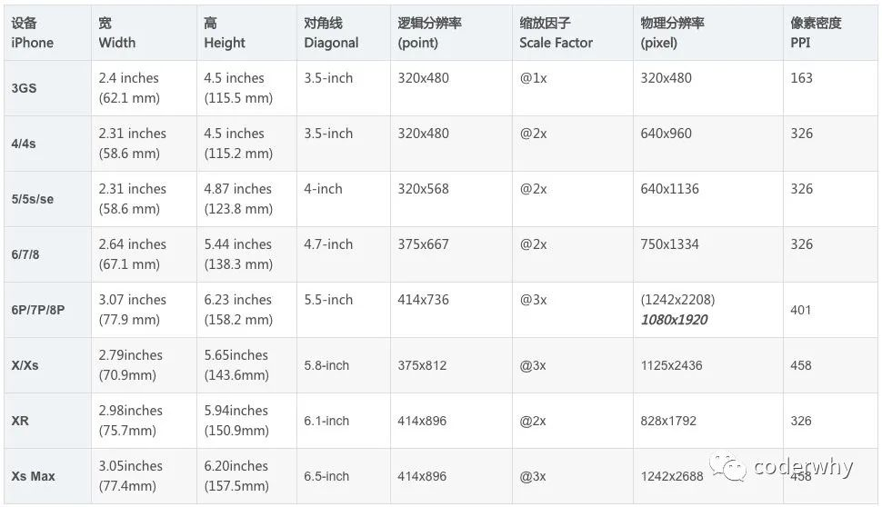

### Flutter设备信息

可以通过 `window`对象获取设备的信息，比如手机的物理分辨率

```dart
final physicalWidth = window.physicalSize.width;
final physicalHeight = window.physicalSize.height;
print('物理分辨率：$physicalWidth * $physicalHeight');
```

获取屏幕上的一些信息，可以通过MediaQuery：媒体查询

```dart
// 1.媒体查询信息
final mediaQueryData = MediaQuery.of(context);

// 2.获取宽度和高度
final screenWidth = mediaQueryData.size.width;
final screenHeight = mediaQueryData.size.height;
final physicalWidth = window.physicalSize.width;
final physicalHeight = window.physicalSize.height;
final dpr = window.devicePixelRatio;

// 3.状态栏的高度
// 有刘海的屏幕:44 没有刘海的屏幕为20
final statusBarHeight = mediaQueryData.padding.top;

// 4.底部操作条
// 有刘海的屏幕:34 没有刘海的屏幕0
final bottomHeight = mediaQueryData.padding.bottom;
```

不过需要注意的是，不要根组件的`Widget`的`build`方法中获取，因为此时`MediaQuery`还没有初始化完成，其实`MediaQuery`中获取到的数据都是通过`window`中的数据计算出来的，所以如果确实需要在根组件中使用`MediaQuery`中的数据的时候可以自己去`MediaQueryData.formWindow`方法中看是如何通过`window`计算出对应的值的。

```dart
// 获取宽度和高度
final physicalWidth = window.physicalSize.width;
final physicalHeight = window.physicalSize.height;
final dpr = window.devicePixelRatio;
final screenWidth = physicalWidth / dpr;
final screenHeight = physicalHeight / dpr;

// 状态栏的高度
// 有刘海的屏幕:44 没有刘海的屏幕为20
final statusBarHeight = window.padding.top / dpr;

// 底部操作条
// 有刘海的屏幕:34 没有刘海的屏幕0
final bottomHeight = window.padding.bottom / dpr;
```

或者可以直接使用`MediaQueryData.fromWindow(window)`创建，不过需要注意的是`window`是`dart:ui`上的，不是`dart:html`上的

获取一些设备相关的信息，可以使用官方提供的一个库：`device_info`

### 屏幕适配

由于移动设备有很多种，每种设备的屏幕是不用的，如果用一个固定的尺寸去创建组件的话，在一些设备上可能会过大或者过小，从而影响布局，所以一般在开发中都会从新使用一写相对的尺寸

在前端开发中，针对不同的屏幕常见的适配方案有下面几种：

- rem：

- - rem是给根标签（HTML标签）设置一个字体大小；
  - 但是不同的屏幕要动画设置不同的字体大小（可以通过媒体查询，也可以通过js动态计算）；
  - 其它所有的单位都使用rem单位（相对于根标签）；

- vw、wh：

- - vw和vh是将屏幕（视口）分成100等份，一个1vw相当于是1%的大小；
  - 其它所有的单位都使用vw或wh单位；

- rpx：

- - rpx是小程序中的适配方案，它将750px作为设计稿，1rpx=屏幕宽度/750；
  - 其它所有的单位都使用rpx单位

```dart
class SizeFit{
  static double physicalWidth;
  static double physicalHeight;
  static double dpr;
  static double screenWidth;
  static double screenHeight;
  
  static double rpx;
  static double px;
  
  static double rem;
  
  static void initialize({double standardSize = 750,double standardRem = 16}){
    physicalWidth = window.physicalSize.width;
    physicalHeight = window.physicalSize.height;
    dpr = window.devicePixelRatio;
    screenWidth = physicalWidth / dpr;
    screenHeight = physicalHeight / dpr;
    
    rpx = screenWidth / standardSize;
    px = screenWidth / standardSize * 2;
    
    rem = standardRem;
  }
  
  static double setRpx(double size){
    return rpx * size;
  }
  static double setPx(double size){
    return px * size;
  }
  
  static double vw(double percent){
    return percent / 100 * screenWidth;
  }
  static double vh(double percent){
    return percent / 100 * screenHeight;
  }
  
  static double setRem(double size){
    return size * rem;
  }
}
```

之后就可以使用了

```dart
Container(
	width:SizeFit.setRpx(200),
  height:SizeFit.setPx(200),
);
```

但是这样使用的时候还是比较麻烦的，我们还可以使用`extension`来为`double`和`int`扩展一下方法

```dart
extension DoubleFit on double{
  double get rpx {
    return SizeFit.setRpx(this);
  }
  double get px {
    return SizeFit.setPx(this);
  }
}
extension IntFit on int{
  double get rpx {
    return SizeFit.setRpx(this.toDouble());
  }
  double get px {
    return SizeFit.setPx(this.toDouble());
  }
}
```

之后在需要使用的地方引入`DoubleFix IntFit`就可以直接使用了

```dart
Container(
	width:200.0.rpx,
  height:200.px,
);
```


## Flutter应用信息

真正开发一个完成的跨平台App需要针对不同的平台设置不同的应用信息，比如应用标识，应用名称，应用图标，应用启动图等。

### 应用标识

#### Android应用标识

Android应用标识在对应的Android目录下：Android/app/build.gradle

- applicationId：是打包时的应用标识

```
 defaultConfig {
        // TODO: Specify your own unique Application ID (https://developer.android.com/studio/build/application-id.html).
        applicationId "com.coderwhy.catefavor"
        minSdkVersion 16
        targetSdkVersion 28
        versionCode flutterVersionCode.toInteger()
        versionName flutterVersionName
        testInstrumentationRunner "androidx.test.runner.AndroidJUnitRunner"
    }
```

#### iOS应用标识

iOS应用标识在对应的iOS目录下：ios/Runner/Info.plist（可以通过Xcode打开来进行修改）

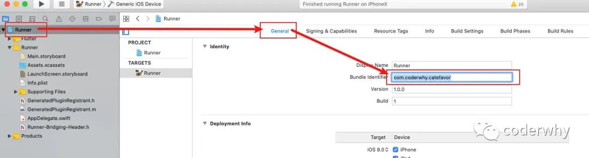

### 应用名称

#### Android应用名称

Android应用名称在对应的Android目录下：android/app/src/main/AndroidMainifest.xml

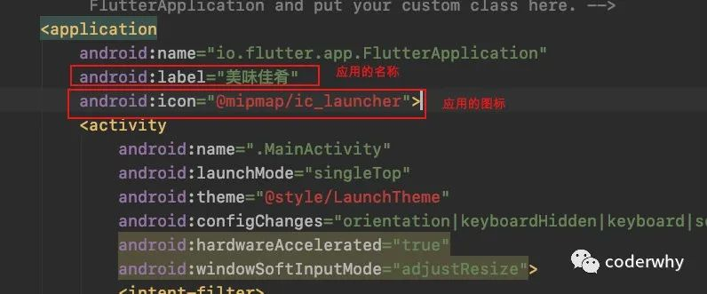

####  iOS应用名称

iOS应用名称在对应的iOS目录下：ios/Runner/Info.plist（可以通过Xcode打开来进行修改）

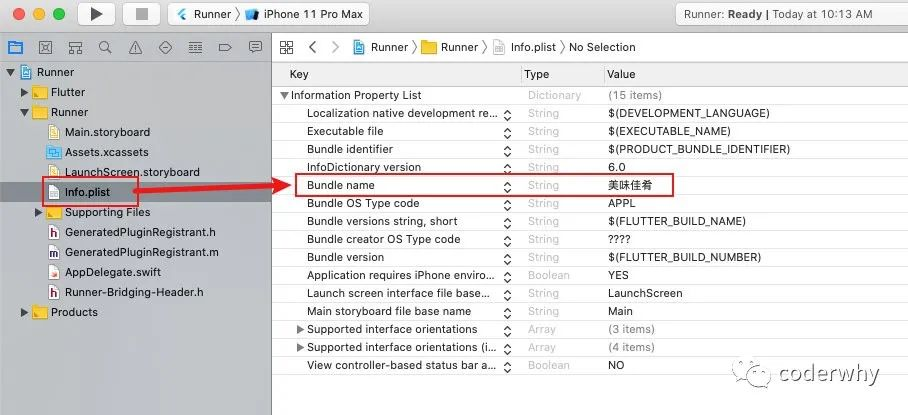

### 应用图标

#### Android应用图标

官方建议将图标（icon）根据不同的dpi放置在res/mipmap文件夹下。

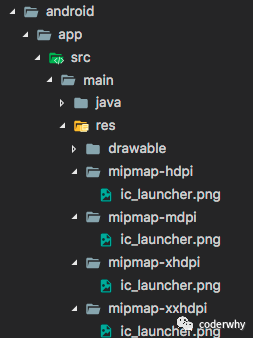

####  iOS应用图标

iOS的应用图标在ios/Runner/Assets.xcassets/AppIcon.appiconset中管理（可以直接打开Xcode将对应的图标拖入）

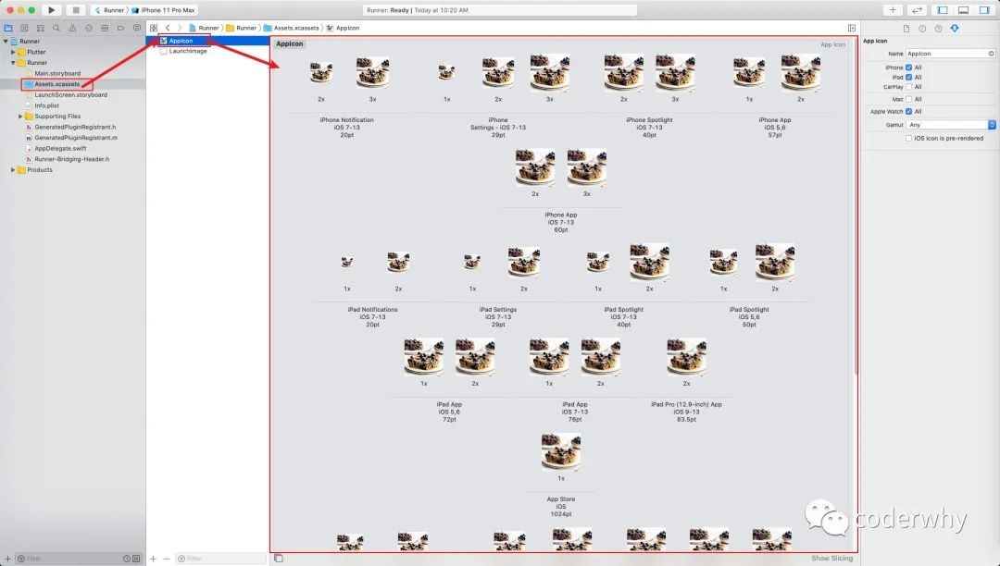

### 应用启动图

#### Android应用启动图

Android中默认的启动图是一片空白的，这是Flutter的默认设置效果。

- 在哪里设置呢？android/app/src/main/res/drawable/launch_background.xml

第一步：将对应的启动图片，添加到对应的minimap文件夹中

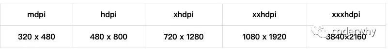启动图

第二步：修改android/app/src/main/res/drawable/launch_background.xml文件如下：

- 注意：我这里启动图命名为launcher_image，需要修改为你的名称

```
<?xml version="1.0" encoding="utf-8"?><!-- Modify this file to customize your launch splash screen --><layer-list xmlns:android="http://schemas.android.com/apk/res/android"><!--    <item android:drawable="@android:color/white" />-->    <!-- You can insert your own image assets here -->    <item>        <bitmap            android:gravity="center"            android:src="@mipmap/launcher_image"/>    </item></layer-list>
```

####  iOS应用启动图

**iOS需要两步来完成：**

第一步：将启动图片添加到资源依赖中

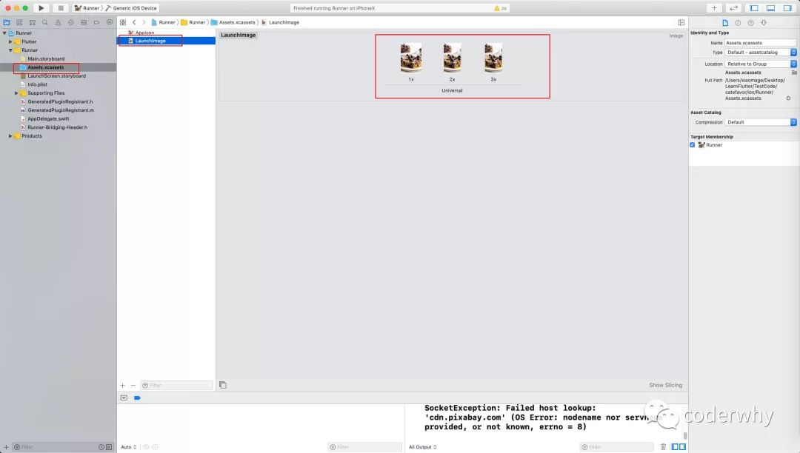添加依赖的启动图

第二步：在LaunchScreen.storyboard中，添加一个ImageView，并且添加约束

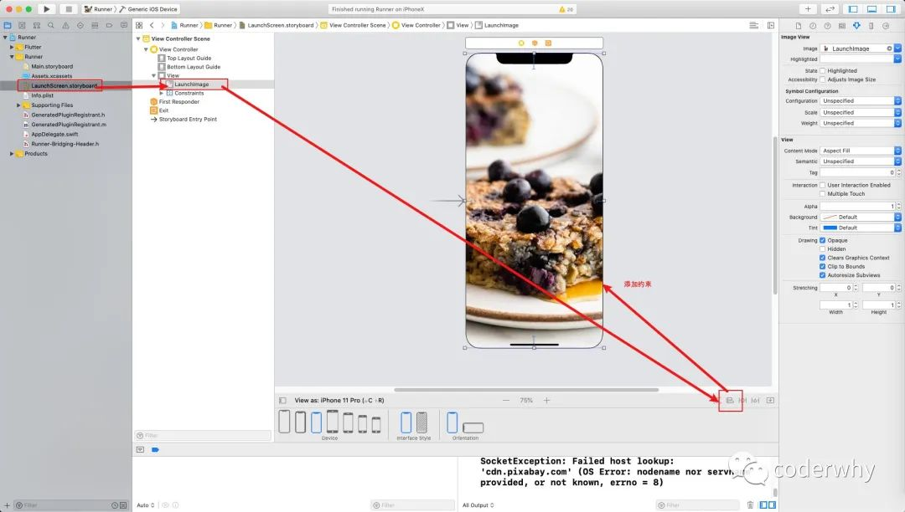


## bug

### 黄色警告空间

### hasSize错误

### 底部导航栏切换闪烁问题

在首次加载应用之后，如果底部导航栏的图片项`BottomNavigationBarItem `是由图片来制作的，在首次切换的时候可能会有一个闪烁的问题，这是因为在首次切换的时候是先将当前状态的图标删除掉之后再加载新状态的图标的，所以在等待图片加载的时候就有一个空白时间导致闪烁问题

解决方法是在`BottomNavigationBarItem`的图片组件添加一个`gaplessPlayback:true`

```dart
BottomNavigationBarItem(
  label: "xxx",
  icon: Image.asset('xxx',gaplessPlayback:true),
  activeIcon: Image.asset('xxx',gaplessPlayback:true),
)
```


## 编译模式与开发环境区分

### 编译模式

flutter 有三种编译模式，一种是`debug `模式，一种是`profile`模式还有一种`release`模式

+ `debug`模式中dart开启的是 jit 模式，就是边运行边编译，提供热更新等开发所需的功能，所以该模式下性能是比较低的
+ `release`模式中dart开启的是 AOT 模式，就是预编译，移除了许多开发中使用的扩展，性能会比`debug`模式高
+ `profile`模式是接近于`release`模式的打包模式，不过相比于`release`模式保留了性能分析相关的扩展，可以用来做线上版本的性能分析

命令开启

```shell
# debug
flutter run
# profile
flutter run --profile
# release
flutter run --release
```

### 开发环境区分

在开发中，我们可能要对`debug`模式和`release`模式进行区分，根据不同的模式进行不同的设置，比如网络请求的url。

flutter 中区分的方法用两种

+ 使用`assert`断言，因为 `release` 模式下断言是无效的
+ 通过`kReleaseMode`常量进行区分

```dart
String baseURL = "release.com";
assert((){
  baseURL = "dev.com";
}());
```

```dart
String baseURL = kRealseMode ? "release.com" : "dev.com";
```


## 混合开发

当flutter中需要嗲用一些原生的能力，如相机，相册，位置信息，地图等时就需要使用原生中提供的功能，也可以在pub.dev 中查找相应的库，如果没有就需要自己调用原生中的接口来实现了。

flutter 是通过 `MethodChannel`来调用原生的方法，使用原生的功能的

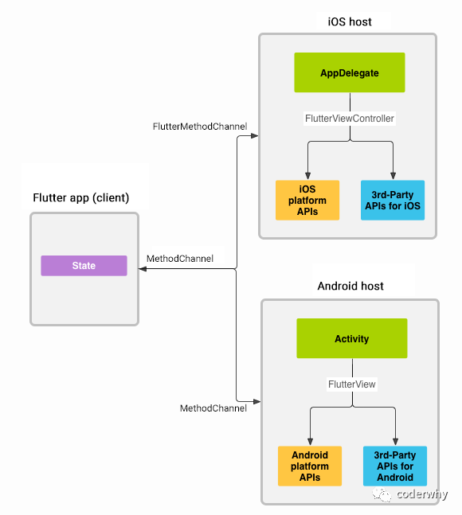

调用过程大致如下：

- 1.客户端（Flutter端）发送与方法调用相对应的消息

- 2.平台端（iOS、Android端）接收方法，并返回结果；

- - iOS端通过`FlutterMethodChannel`做出响应；
	- Android端通过`MethodChannel`做出响应；

```dart
static const platform = const MethodChannel("coderwhy.com/battery");
final int result = await platform.invokeMethod("getBatteryInfo");
```

当我们通过 `platform.invokeMethod` 调用对应平台方法时，需要在对应的平台实现其操作：

- iOS中可以通过Objective-C或Swift来实现
- Android中可以通过Java或者Kotlin来实现

> 我们通过`flutter create proj`的时候默认ios是使用swift，android 是使用 kotlin 实现的，如果要指定ios 使用 Objective-C 或者 android 使用 java 可以使用 `flutter create -i objc -a java proj`指定


## 参考

[codewhy 老师的flutter系列文章](https://mp.weixin.qq.com/mp/appmsgalbum?__biz=Mzg5MDAzNzkwNA==&action=getalbum&album_id=1566028536430247937&scene=173&from_msgid=2247483705&from_itemidx=1&count=3&nolastread=1#wechat_redirect)

[老孟的 300 多个组件例子](http://laomengit.com/)

[`JSON to Dart`](https://jsontodart.com/)

[quicktype](https://app.quicktype.io/)

[flutter 页面 生命周期，APP应用的生命周期](https://blog.csdn.net/litter_lj/article/details/99690614)

**组件目录**

https://flutter.cn/docs/development/ui/widgets

https://flutter.cn/docs/reference/widgets

https://api.flutter-io.cn/flutter/widgets/widgets-library.html#classes


