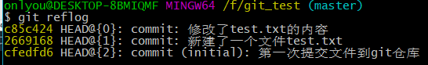
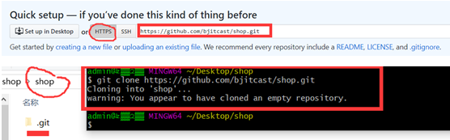
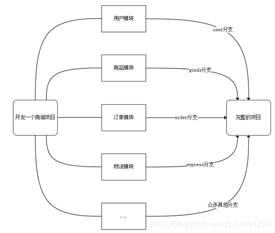
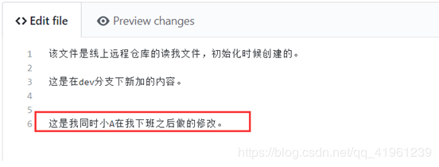
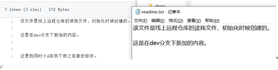
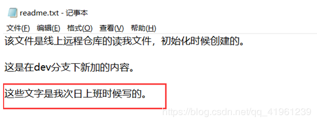
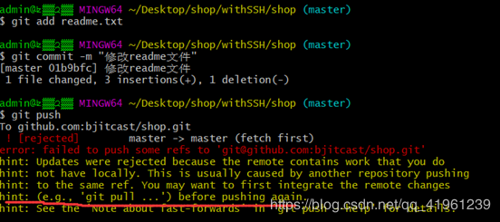

# git基本使用

​		git是一个分布式版本控制系统，简单来说就是一个软件，用来记录一个或者若干个文件的内容变化，以便将来查阅特定版本修订情况的软件

​		[github](https://www.github.com) 是一个为用户提供git服务的网站，简单来说就是一个存放东西的创库，这个网站是目前全球最大的代码共享网站，因为服务器位于国外因此使用的速度较慢。国内也有同类型的网站如[码云](https://gitee.com/)等。

为了使用git将代码保存到github上，所以需要先注册一个github账号


## git安装

1. 可以直接在git官网下载安装程序，然后直接点击下一步直至安装完成
2. 使用`git --version`检查是否安装成功。


## git使用

### git工作流程


**工作区**：在这个区块中进行添加、编辑、修改文件的动作

**暂存区**：暂存已经修改的文件，最后统一提交到git仓库中

**Git仓库**：最终确定的文件保存到仓库，成为一个新的版本，并且对他人可见

使用`git status`可以查看暂存区状态


### 操作前准备

在安装完git之后还需要进行全局配置，设置对git仓库进行操作的人的相关信息

```shell
#这里一般是用github或者码云的账号的用户名和邮箱
git config --global user.name "用户名" 
git config --global user.email "邮箱地址"
```

可以用`git config --global user.name`和`git config --global user.email "邮箱地址"`分别查看已经配置的用户名和邮箱

### git本地创库的使用

​		git能将代码保存到本地创库中这样可以方便管理自己的代码，并且自己的代码别人无法看见，但是一旦自己的本地仓库损坏就无法恢复了。

#### 创建仓库

​		在需要使用git管理的文件目录下使用git Bash Here用`git init`创建仓库，创建成功之后文件夹下面会有个隐藏的.git文件夹

#### 提交文件到暂存区

可以使用下面几种方式提交

```shell
git add 文件 #可以添加一个文件
git add 文件1 文件2 文件3#可以添加多个文件
git add .#可以添加该目录下的全部文件
```

#### 将暂存区文件提交到git仓库

```shell
git commit -m '描述'
```

> 编写文件时用utf8编码避免乱码的情况。
>
> 千万不要使用Windows自带的**记事本**编辑任何文本文件。原因是Microsoft开发记事本的团队使用了一个非常弱智的行为来保存UTF-8编码的文件，他们自作聪明地在每个文件开头添加了0xefbbbf（十六进制）的字符，你会遇到很多不可思议的问题，比如，网页第一行可能会显示一个“?”，明明正确的程序一编译就报语法错误，等等，都是由记事本的弱智行为带来的。
>
> 可将 Notepad++ 的默认编码设置为UTF-8 without BOM即可

#### 版本回退

有两个步骤

1. 查看版本，确定需要回退的版本

   ```shell
   git log #有详细的信息
   git log --pretty=oneline #简介的信息，方便查看编号
   ```

2. 进行回退操作

   ```shell
   git reset --hard 提交编号（commitid）
   ```

   **注意**：版本回退完之后，查看版本只能看到当前和当前版本之前的记录，要想再回到后面的版本就需要使用指令`git reflog`查看历史操作，获取前面的提交编号`c85c424`使用`git reset --hard 提交编号（commitid）`就可以回到想要回到的版本了。

   

**总结：**

回到过去：`git log --pretty=oneline #简介的信息，方便查看编号`+`git reset --hard 提交编号（commitid）`

回到未来：`git reflog`+`git reset --hard 提交编号（commitid）`


### git远程仓库

1. 登录github获取码云创建创库（仓库在线上已经初始化了）

2. 将线上仓库克隆到本地

   方法有两种，一种是使用http/https协议传输，一种是使用ssh

   **使用http/https协议**

   

   使用命名克隆仓库

   ```shell
   #克隆整个项目
   git clone 线上仓库地址 克隆到哪里
   
   #克隆摸个分支的内容
   git clone --branch [tags标签] [git地址] 或者 git clone --b [tags标签] [git地址] 克隆到哪里
   ```

   **使用ssh**

   生成公私玥对指令（需先自行安装OpenSSH）：ssh-keygen -t rsa -C “注册邮箱”

   1. 生成客户端公私玥文件

      ```shell
      ssh-keygen -t rsa -C “注册邮箱”
      ```

   2. 将公钥上传到Github

   3. 上传公钥文件内容（id_rsa.pub）

      

   一般密钥文件在 `C:\Users\administor`

   

3. 在克隆到的仓库中继续进行进行操作（提交暂存区、提交本地仓库、提交线上仓库、拉取线上仓库）

   **提交线上仓库**

   ```shell
   git add .
   git commit -m '提交到线上仓库'
   git push
   ```

   在首次提交线上仓库时，如果报出访问错误403，是因为没有进行权限配置，也就是没有登录

   **解决**

   修改.git/config文件

   ```text
   将
   [remote "origin"]
   	url = https://github.com/用户名/仓库名.git
   	fetch = +refs/heads/*:refs/remotes/origin/*
   
   改为
   [remote "origin"]
   	url = https://用户名:密码@github.com/用户名/仓库名.git
   	fetch = +refs/heads/*:refs/remotes/origin/*
   ```

   修改完成后保存再次使用`git push`提交

   

   如果出现以下问题

   ```shell
   fatal: No configured push destination.
   Either specify the URL from the command-line or configure a remote repository using
    
       git remote add <name> <url>
    
   and then push using the remote name
    
       git push <name>
   ```

   可以尝试

   ```shell
   这个时候第一次push需要网址：
    
   $ git add --all
   $ git commit -m "提交信息"
   $ git remote add origin '远程仓库url'
   $ git push -u origin 对应远程分支名
    
    
   然后下一次就不用那么麻烦了，直接：
    
   $ git add --all
   $ git commit -m "信息"
   $ git push
   ```

   

   **拉取线上仓库**

   当有其他人向你的仓库中提交了新的文件，然后你需要把别人新提交的文件下载下来时就可以使用。

   ```shell
   #拉去整个项目
   git pull
   
   #把某个分支上的内容都拉取到本地
   git pull origin dev(远程分支名称)
   
   #把远程分支拉到本地
   git fetch origin dev（dev为远程仓库的分支名）
   ```

在拉取、克隆、提交时可能需要先与远程仓库建立连接

```shell
git remote add origin git@github.com:XXXX/nothing2.git
```


**在每天工作的第一件事就是先git pull拉取线上最新的版本；每天下班前要做的是git push，将本地代码提交到线上仓库。**


### 分支管理



在实际的开发过程中，一个项目可能需要每个人负责不同的模块，最后再将这些模块进行合并之后就可以形成一个完整的项目了。


​		每次提交后都会有记录，Git把它们串成时间线，形成类似于时间轴的东西，这个时间轴就是一个分支，我们称之为master分支。
在开发的时候往往是团队协作，多人进行开发，因此光有一个分支是无法满足多人同时开发的需求的，并且在分支上工作并不影响其他分支的正常使用，会更加安全，Git鼓励开发者使用分支去完成一些开发任务。

```tex
分支相关指令：
查看分支：git branch
创建分支：git branch 分支名
切换分支：git checkout 分支名 
创建并切换分支：git checkout -b 分支名 
删除分支：git branch -d 分支名
合并分支：git merge 被合并的分支名

在本地创建分支dev并切换到该分支
git checkout -b dev(本地分支名称) origin/dev(远程分支名称)
```

分支是互不影响的，如在分支dev中对readme.md文件的修改是不会改变master分支下readme.md文件的内容的。

注意：**在删除分支的时候，一定要先退出要删除的分支，然后才能删除。**

合并所有分支之后，需要将master分支提交线上远程仓库中。

将分支提交到github

1. 上传一个独立的分支（比如代码是从工程中直接DOWNLOAD ZIP文件如BowlingScore-test.zip，该文件与原MASTER分支是独立的）

   ```shell
   git branch test	#（创建分支）
   git checkout test #（切换分支）
   git remote add origin https://github.com/yangxiaoyan20/BowlingScore.git #与远程分支相关联
   git push origin test #（将分支上传）
   ```

   

2. 上传一个与MASTER相关的分支（该分支是从MASTER中git clone 得到，相关信息在 .git 文件中）

   ```shell
   git branch test #（创建分支）
   git checkout test  #（切换分支）
   git push origin test:test #
   ```


### 冲突的产生和解决

#### **产生**

案例：模拟产生冲突。
①同事在下班之后修改了线上仓库的代码



注意：此时我本地仓库的内容与线上不一致的。



②第二天上班的时候，我没有做`git pull`操作，而是直接修改了本地的对应文件的内容



③需要在下班的时候将代码修改提交到线上仓库（`git push`）



提示我们要在再次push之前先git pull操作

#### 解决

1. 先`git pull`
2. 打开冲突文件，解决冲突
3. 重新提交


### 忽略文件

场景：在项目目录下有很多万年不变的文件目录，例如css、js、images等，或者还有一些目录即便有改动，我们也不想让其提交到远程仓库的文档，此时我们可以使用“忽略文件”机制来实现需求。

忽略文件需要新建一个名为.gitignore的文件，该文件用于声明忽略文件或不忽略文件的规则，规则对当前目录及其子目录生效。
注意：该文件因为没有文件名，没办法直接在windows目录下直接创建，可以通过命令行Git Bash来touch创建。

常见规则写法有如下几种：

```tex
/mtk/               过滤整个文件夹
*.zip                过滤所有.zip文件
/mtk/do.c           过滤某个具体文件
!index.php			   不过滤具体某个文件
```


## 常用命令

### 配置

**查看配置**

```shell
git config user.name
git config user.email
```

**设置**

```shell
git config --global user.name "zhanghs"
git config --global user.email "zhang@163.com"
```

**删除配置**

```shell
git config —global —unset user.name
```


### 本地仓库管理

```shell
#提交到暂存区
git add test.txt
#提交到本地仓库
git commit -m “提交测试”
#查看是否有文件未提交
git status
#对比
git diff test.txt 
#查看提交记录
git log 
#格式话查看
git log —pretty=oneline 
#查看历史提交
git reflog 
```

### 版本回退

```shell
#返回到上个版本
git reset —hard HEAD^ 
#返回到上上个版本
git reset —hard HEAD^^ 
#返回到100个版本之前
git reset —hard HEAD100 
```

### 分支管理

```shell
#查看分支
git branch 
#创建分支
git branch dev 
#切换分支
git checkout dev 
git switch dev 
#创建并切换分支
git switch -c dev 
#创建并切换分支
git checkout -b dev 
#删除分支
git branch -d dev 
#合并分支,把dev合并到 master ，要先切换到master
git switch master
git merge dev
```

### 合并指定提交记录

```shell
#单个
git cherry-pick log1

#多个
git cherry-pick log1 log2
```


### 暂存修改

将当前修改的内容暂时存起来，这个不会存到add的暂存区，只是保存修改，之后可以切换分支

```shell
暂存所有
git stash

暂存所有并命名sta1

git stash save ”sta1”

查看现有stash

git stash list
```

重新应用缓存的stash

使用栈定

```shell
#会删除记录
git stash pop  
#不会删除记录
git stash apply
```

使用指定index的储藏

```shell
git stash apply stash@{index}
```

移除stash

```shell
git stash drop stash@{index}
```


### 打标签

tag相当于是版本（commit）的快照

```shell
#创建标签
git tag v0.1 
#为指定commit创建标签
git tag v0.9 commitid 
#指定标签信息
git tag -a v1.0 -m “blabla” 
#查看标签
git tag 
#可以推送一个本地标签；
git push origin <tagname>
#可以推送全部未推送过的本地标签；
git push origin --tags
#可以删除一个本地标签；
git tag -d <tagname>
#可以删除一个远程标签。
git push origin :refs/tags/<tagname>
```

### 

### 远程仓库管理

啦取远程仓库的信息，可以获取到分支索引等信息，可以用来刷新本地库中的远程仓库信息

```shel
git fetch
```

添加远程仓库，并起别名为origin

```shell
git remote add origin git@github.com:master/zhang.git
```

推送本地仓库到远程仓库

```shell
git push <远程主机名> <本地分支名>:<远程分支名>
git push origin master:master
```

查看远程所有分支

```shell
git branch -a
```

新建分支并切换到指定分支

```shell
git checkout -b 本地分支名 origin/远程分支名
git checkout -b 3.9.0 origin/3.9.0
```

删除远程分支

```shel
git push origin --delete [branchname]
```

在删除远程分支时，同名的本地分支并不会被删除，所以还需要单独删除本地同名分支（如果删除本地分支是报错`git checkout xxxxx-fixbug` ，切换到当前分支上， 然后再 进行` git push --delete origin origin/xxxxx-fixbug`此时将不会再发生错误 。）


创建远程分支

```shell
git push —set-upstream origin dev
```

将本地分支与远程分支关联

```shell
git branch --set-upstream-to=远程分支 本地分支
git branch --set-upstream-to=origin/feature feature
```

拉取远程分支

```shell
git pull <远程主机名> <远程分支名>:<本地分支名>
git pull origin dev:dev
```

删除远程库文件,但本地保留该文件

```shell
git rm --cached xxx
git commit -m "remove file from remote"
git push -u origin master
```

删除远程库文件夹,但本地保留该文件夹

```shell
git rm --cached -r xxx
git commit -m "remove file from remote"
git push -u origin master
```

**git rm与git rm --cached 的区别**

`git rm` 是删除暂存区或分支上的文件, 同时也删除工作区中这个文件。

`git rm --cached`是删除暂存区或分支上的文件,但本地还保留这个文件， 是不希望这个文件被版本控制。


**git 指定目录 拉取文件**

https://www.jianshu.com/p/b67318c3433d

