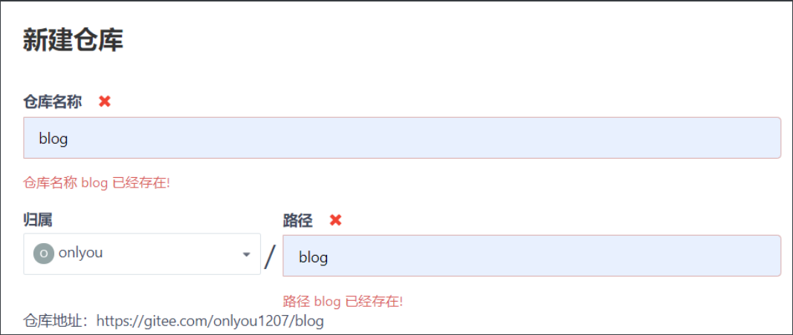
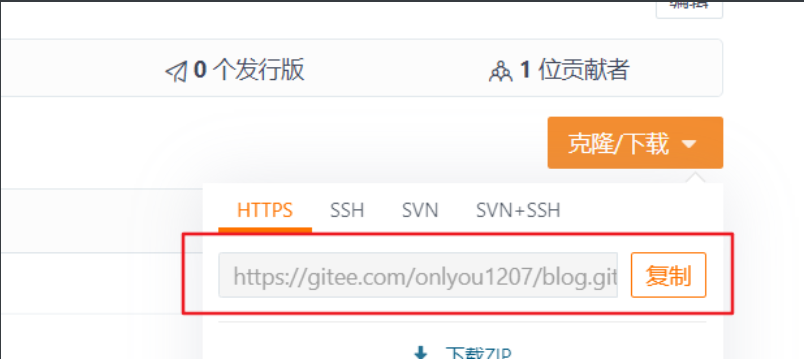
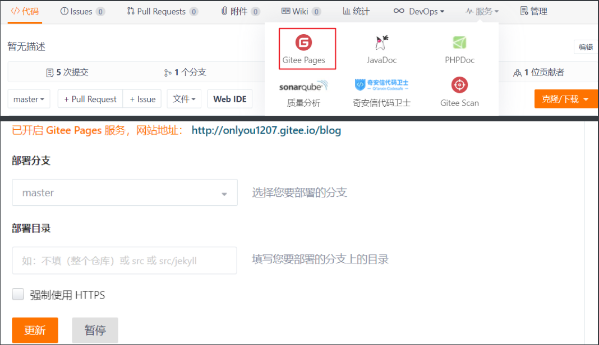
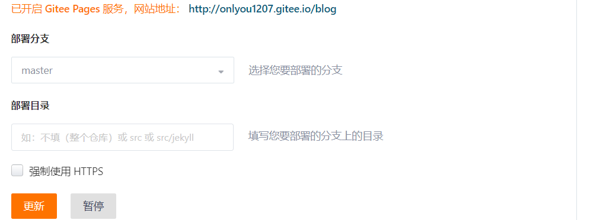
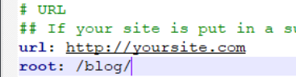
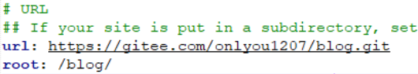

# [Hexo](https://hexo.io/zh-cn/)

## 安装

安装nodejs

安装cnpm：

```shell
#使用淘宝镜像源
npm i cnpm --registry=https://registry.npm.taobao.org
```

安装hexo-cli：

```shell
npm i hexo-cli -g
```

使用`hexo -v`检查是否安装成功。

## 使用

### 创建项目

1. 创建一个新文件夹`blog`用于存放博客项目

   ```shell
   mkdir blog
   cd ./blog
   ```

2. 在blog目录下，打开shell命令面板

   1. 使用管理员权限，初始化目录

      ```shell
      #在Linux下
      sudo hexo init
      #在windows下
      hexo init 
      ```

   2. 查看博客目下是否有node_modules，没有就先安装依赖，有就直接下一步

      ```shell
      npm i
      ```

   3. 启动项目

      ```shell
      #Linux下用
      hexo s
      #windows下用
      hexo server
      ```

### 发布文章

1. 新建文章

   使用命令的方式

   ```shell
   #Linux下用
   hexo n "文件名"
   #windows下用
   hexo new "文件名"
   ```

   也可以直接`.../blog/source/_posts`目录下新建md文件

2. 编辑内容，Linux下可以使用vim编辑，使用pwd命令当前所做目录

3. 生成页面

   ```shell
   #Linux下用
   hexo g
   #windows下用
   hexo build
   ```

4. 启动项目


### 自定义主题

1. 将hexo主题下载到`blog/themes`，推荐[yilia](https://github.com/litten/hexo-theme-yilia.git themes/yilia)

   ```shell
   git clone https://github.com/litten/hexo-theme-yilia.git themes/yilia ./themes/yilia
   ```

2. 修改`_config.yml`，注意每个：后一定要加个` `空格

   ```tex
   theme: yilia   下载的主题文件夹
   ```

3. 清理缓存

   ```shell
   hexo clean
   ```

4. 重新生成页面

   ```shell
   hexo g
   ```

5. 启动项目


### 显示markdown中的图片

1. 安装`hexo-asset-image`插件

   ```shell
   npm install hexo-asset-image --save
   ```

   修改`/node_modules/hexo-asset-image/index.js`

   ```js
   'use strict';
   var cheerio = require('cheerio');
   
   // http://stackoverflow.com/questions/14480345/how-to-get-the-nth-occurrence-in-a-string
   function getPosition(str, m, i) {
     return str.split(m, i).join(m).length;
   }
   
   var version = String(hexo.version).split('.');
   hexo.extend.filter.register('after_post_render', function(data){
     var config = hexo.config;
     if(config.post_asset_folder){
       	var link = data.permalink;
   	if(version.length > 0 && Number(version[0]) == 3)
   	   var beginPos = getPosition(link, '/', 1) + 1;
   	else
   	   var beginPos = getPosition(link, '/', 3) + 1;
   	// In hexo 3.1.1, the permalink of "about" page is like ".../about/index.html".
   	var endPos = link.lastIndexOf('/') + 1;
       link = link.substring(beginPos, endPos);
   
       var toprocess = ['excerpt', 'more', 'content'];
       for(var i = 0; i < toprocess.length; i++){
         var key = toprocess[i];
    
         var $ = cheerio.load(data[key], {
           ignoreWhitespace: false,
           xmlMode: false,
           lowerCaseTags: false,
           decodeEntities: false
         });
   
         $('img').each(function(){
   		if ($(this).attr('src')){
   			// For windows style path, we replace '\' to '/'.
   			var src = $(this).attr('src').replace('\\', '/');
   			if(!/http[s]*.*|\/\/.*/.test(src) &&
   			   !/^\s*\//.test(src)) {
   			  // For "about" page, the first part of "src" can't be removed.
   			  // In addition, to support multi-level local directory.
   			  var linkArray = link.split('/').filter(function(elem){
   				return elem != '';
   			  });
   			  var srcArray = src.split('/').filter(function(elem){
   				return elem != '' && elem != '.';
   			  });
   			  if(srcArray.length > 1)
   				srcArray.shift();
   			  src = srcArray.join('/');
   			  $(this).attr('src', config.root + link + src);
   			  console.info&&console.info("update link as:-->"+config.root + link + src);
   			}
   		}else{
   			console.info&&console.info("no src attr, skipped...");
   			console.info&&console.info($(this));
   		}
         });
         data[key] = $.html();
       }
     }
   });
   ```

2. 修改`_config.yml`

   ```yml
   post_asset_folder: true
   ```

3. 此时使用`hexo new “文件名”`，在`source/_post/`下会有一个同名的文件夹（文件名最好不要是中文），要在md中引用图片就先将图片方法对应的文件夹中。

4. 清除缓存，从新编译，提交文件


## 将博客部署到github

1. 在github上新建一个仓库，仓库名必须符合特定的要求

   ```txt
   github用户名.github.io
   ```

2. 安装部署插件`hexo-deployer-git`

   ```shell
   npm i hexo-deployer-git --save
   ```

3. 配置`_config.yml`，注意每个：后一定要加个` `空格

   ```tex
   deploy:
     type: 'git'
     repo: '仓库地址'
     branch: '分支地址'		默认是master
   ```

4. 开始部署

   ```shell
   hexo d
   ```

## 将博客部署到码云

1. 同样在码云上新建仓库`blog`

   

2. 修改`_config.yml`文件

   

   ```shell
   deploy:
     type: 'git'
     repo: '码云仓库地址'
   ```

3. 保存修改后先清除缓存后再重新编译、提交

   ```shell
   hexo clean
   hexo g -d
   ```

4. 提交完成后去到blog仓库开启`gitee page`服务

   

   

5. 注意的是每次提交修改后都要更新服务

   

## **坑**

### 样式文件无法加载

如果最后发现可以访问页面但是不能加载css文件就要修改`_config.yml`的`root`为仓库名



如果还是不行的话可以将url也修改成自己github或者码云的仓库路径




## 参考

[hexo部署在码云中 无样式问题](https://www.cnblogs.com/lenghaha/p/12462697.html)

[hexo引用本地图片无法显示](https://blog.csdn.net/xjm850552586/article/details/84101345)

[使用Hexo搭建个人博客并部署到GitHub或码云上全过程](https://blog.csdn.net/qq_38225558/article/details/95026111)

[Hexo博客部署到码云和Coding](https://blog.csdn.net/victoryxa/article/details/104286462)

[【啰里啰嗦】一步步搭建 VuePress 及优化](https://www.bilibili.com/video/BV1vb411m7NY?from=search&seid=553869578389013186)