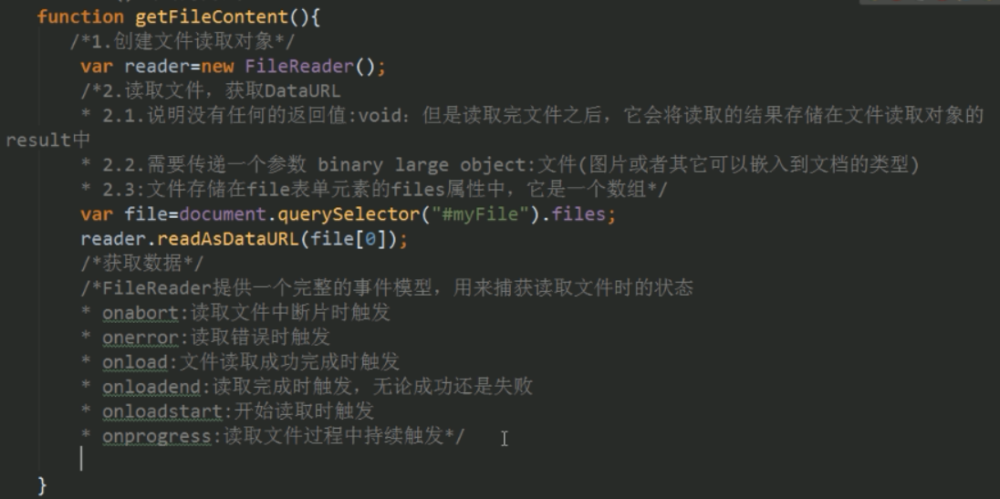

# 图片

## **页面图片**

对于img标签的图片，只设置width或者height中的一个，图片将会按照比例为另一个属性赋值

## **图片格式**

### jpeg（jpg）

​		-支持颜色较多，且可以压缩，但是不支持透明

### gif

​		-支持颜色不多，可以支持简单的透明（直线透明），支持动态图

### png

​		-png支持颜色多，支持复杂的透明

**使用原则：**效果不一致，使用效果好的，效果一致，使用小的。


**meta标签重定向**

```html
<meta http-equiv="refesh" content="2（秒数）;url">
```


**line-height设置行高**

```css
line-height:100px/1/100%; 
为px时就是直接设置当前行的行高 
为数值/百分数时就是相对于文本的高的倍数 
```


**文本样式**

 ```css
text-transform：uppercase/lowercase/capitalize;		设置字母的大小写 
text-decoration:none/underline/overline/line-through;		文本划线 
letter-spacing:10px;		设置字符之间的间隔 
word-spacing:10px;		设置字母之间的间隔，实际上是只要是空格都会设置 
text-aling:left/right/center/justify;		jusitify是两端对齐，会将字符之间的间隔进行调整使文字到达两端（要有空白的支付，如"，"）
 ```

vertical-align: 

| baseline    | 默认。元素放置在父元素的基线上。         |
| ----------- | ---------------------------------------- |
| sub         | 垂直对齐文本的下标。                     |
| super       | 垂直对齐文本的上标                       |
| top         | 把元素的顶端与行中最高元素的顶端对齐     |
| text-top    | 把元素的顶端与父元素字体的顶端对齐       |
| middle      | 把此元素放置在父元素的中部。             |
| bottom      | 把元素的顶端与行中最低的元素的顶端对齐。 |
| text-bottom | 把元素的底端与父元素字体的底端对齐。     |

用于行内元素


**盒子模型**


```css
box-sizing:content-box; 
```

根据 W3C 的规范，元素内容占据的空间是由 width 属性设置的，而内容周围的 padding 和 border 值是另外计算的；即在标准模式下的盒模型，盒子实际内容（content）的width/height=我们设置的width/height;盒子总宽度/高度=width/height+padding+border+margin。


```css
box-sizing:border-box 
```

在该模式下，浏览器的 width 属性不是内容的宽度，而是内容、内边距和边框的宽度的总和；即在怪异模式下的盒模型，盒子的（content）宽度+内边距padding+边框border宽度=我们设置的width(height也是如此)，盒子总宽度/高度=width/height + margin = 内容区宽度/高度 + padding + border + margin。


**注意:**

1.当外边距margin-right和margin-bottom设置负值的话，那么并不是a块移入b块，而是b块移入a块


2.如果margin-left/margin-right设置为auto则距离为该方向上的最大值

3.外边距重叠问题

- 在网页中垂直方向的相邻外边距会发生重叠

- 两个相邻的兄弟元素在垂直方向上的外边距不会取和而是取其中的最大值

- 解决方法：隔断相邻外间距

  - 在两个相邻的兄弟元素的相邻外边距之间添加一个元素

  - 在父子元素块中也会出现外边距重叠情况

  - 因为ab是的外边距是相邻的当为a设置margin-top时将会传递给b将b的margin-top也设置，导致ab整块都往下移动

- 解决方法：隔断相邻外间距

  - 设置b的border-top

  - 设置b的padding-top为1px

  - 放弃设置a的margin-top，设置b的padding-top来实现效果，并把b的height减少相应值

  - 用box-sizing:border-box;

    


**元素的显示和隐藏实现**

| 属性         | 显示    | 隐藏   | 说明                                 |
| ------------ | ------- | ------ | ------------------------------------ |
| width/height | npx     | 0px    | 继续占有空间                         |
| display      | block   | none   | 不再占据空间                         |
| opacity      | 1       | 0      | 继续占有空间                         |
| visibility   | visible | hidden | 继续占有空间，相当于移除元素保留空间 |

**还有其他的方式是：**

+ 设置元素的position与left，top，bottom，right等，将元素移出至屏幕外
+ 设置元素的position与z-index，将z-index设置成尽量小的负数


**文档流**

**元素在文档流中的特点是**

- 块元素

  - 块元素在文档流中会独占一行，块元素会自上向下排列
  - 块元素在在文档流中默认宽度是父元素的100%
  - 块元素在在文档流中的高度默认被内容撑开

- 内联元素

  - 内联元素在文档流中只会占自身的大小，会默认从左向右排列，一行不够则换行
  - 在文档流中，内联元素的宽高都会被内容撑开

    - width和height 可以看成物理属性，对内联元素没有影响。  能够影响它宽高的为其本身的内容。
    - margin-top:10px;margin-bottom: 10px;无效果
    - margin-left和margin-right;起作用。
    - padding属性就比较特别了。
    - padding-left;padding-right同样有效果,与块元素效果相同。
    - padding-top和padding-bottom不会影响它的高度，但是会影响他的背景高度。不会影响夜页面的布局
    - 可以设置border，但是设置垂直方向上的边框不影响页面的布局
    - 单个inline元素样式（隐藏了上方的div）

  

**脱离文档流**

- float：left/right

  - 元素会立即脱离文档流,元素脱离文档流以后,它下边的元素会立即向上移动
  - 元素浮动以后,会尽量向页面的左上或这是右上漂浮,  直到遇到父元素的边框或者其他的浮动元素
  - 如果浮动元素上边是一个没有浮动的块元素,则浮动元素不会超过块元素
  - 浮动的元素不会超过他上边的兄弟元素,最多最多一边齐
  - 浮动的元素不会盖住文字，文字会自动环绕在浮动元素周围
  - 浮动的元素的宽高会被内容撑开
  - 浮动的内联元素会变成块元素


**高度塌陷问题**

父元素包裹着子元素，父元素的高度被子元素撑开，当子元素设置浮动时，父元素的高度就会变成0，出现高度塌陷的问题，导致后面的元素向上移动——页面布局混乱。

- 解决方法：开启BFC（ Block Formatting Context）块级格式化环境

  - 1.父元素的垂直外边距不会和子元素重叠
  - 2.开启BFC的元素不会被浮动元素所覆盖
  - 3.开启BFC的元素可以包含浮动的子元素

- 如何开启元素的BFC

  - 1.设置元素浮动
  - 2.设置元素绝对定位

    - 使用这种方式开启,虽然可以撑开父元素,但是会导致父元素的宽度丢失， 而且使用这种方式也会导致下边的元素上移,不能解决问题

  - 3.设置元素为 inline-block

    - 可以解决问题,但是会导致宽度丢失,不推荐使用这种方式

  - 4.将元素的overflow设置为一个非visible的值

    - 推荐方式:将 overflow：hidden设置为是副作用最小的开启BFC的方式

  - 5.使用clear：both/left/right;清除受浮动对其他元素的影响

  - 6.直接在高度塌陷的父元素的最后,添加一个空白的div,并且设置clear：both

  - 7.通过after伪类，在父元素中添加一个元素，并且设置display:block;clear:both;zoom:1;

- 在IE6中虽然没有BFC,但是具有另一个隐含的属性叫做 hasLayout,  该属性的作用和BFC类似,所在工E6浏览器可以通过开 has Layout来解决该问题

  - 使用zoom:1
  - zm表示放大的意思,后边跟着一个数值,写几就将元素放大几倍  zoom:1表示不放大元素,但是通过该样式可以开启 hasLayout  z0om这个样式,只在工E中支持,其他浏览器都不支持

```css
//即可解决高度塌陷又可以解决垂直方向上外边距重叠问题 
.clearfix:before, .clearfix:after{     
  content:"";     
  display:table;     
  clear:both; 
} 
```


**布局**

**position**

- **relative**
  - 1.当开启了元素的相对定位以后,而不设置偏移量时,元素不会发生任何变化  
  - 2.相对定位是相对于元素在文档流中原来的位置进行定位  
  - 3.相对定位的元素不会脱离文档流  
  - 4.相对定位会使元素提升一个层级
  - 5.元素性质不变，块还是块，内联还是内联
- **absolute**
  - 1.开启绝对定位,会使元素脱离文档流  
  - 2.开启绝对定位以后,如果不设置偏移量,则元素的位置不会发生变化  

  - 3.绝对定位是相对于离他最近的开启了定位的祖先元素进行定位

    - 如果所有的祖先元素都没有开启定位,则会相对于浏览器窗口进行定位

  - 4.相对定位会使元素提升一个层级

  - 5.绝对定位会改变元素的性质

    - 内联元素变成块元素,  块元素的宽度和高度默认被内容撑开
- **sticky**
  - 固定定位也是一种绝对定位，它的大部分特点都和绝对定位一样不同的是：
    - 固定定位永远都会相对于浏览器窗口进行定位
    - 固定定位会固定在浏览器窗口某个位置，不会随滚动条滚动
- z-index:只有开启定位的元素才可以使用


**多列布局**

常用属性：

- column-count: 属性设置列的具体个数

- column-width: 属性控制列的宽度

- column-gap: 两列之间的缝隙间隔

- column-rule: 规定列之间的宽度、样式和颜色

- column-span: 规定元素应横跨多少列(n:指定跨n列  all:跨所有列)

- 列高度的平衡：

  - 如果设定列的最大高度，这个时候，文本内容会从第一列开始填充，然后第二列，第三列
  - 


**display：flex伸缩布局**

- display:flex:如果一个容器设置了这个属性，那么这个盒子里面的所有直接子元素都会自动的变成伸缩项(flex item)

- justify-content: 设置或检索弹性盒子元素在主轴（横轴）方向上的对齐方式,语法：justify-content：flex-start | flex-end | center | space-between | space-around

  - flex-start：弹性盒子元素将向行起始位置对齐。该行的第一个子元素的主起始位置的边界将与该行的主起始位置的边界对齐，同时所有后续的伸缩盒项目与其前一个项目对齐。
  - flex-end：弹性盒子元素将向行结束位置对齐。该行的第一个子元素的主结束位置的边界将与该行的主结束位置的边界对齐，同时所有后续的伸缩盒项目与其前一个项目对齐。
  - center：弹性盒子元素将向行中间位置对齐。该行的子元素将相互对齐并在行中居中对齐，同时第一个元素与行的主起始位置的边距等同与最后一个元素与行的主结束位置的边距（如果剩余空间是负数，则保持两端相等长度的溢出）。
  - space-between：弹性盒子元素会平均地分布在行里。如果最左边的剩余空间是负数，或该行只有一个子元素，则该值等效于'flex-start'。在其它情况下，第一个元素的边界与行的主起始位置的边界对齐，同时最后一个元素的边界与行的主结束位置的边距对齐，而剩余的伸缩盒项目则平均分布，并确保两两之间的空白空间相等。
  - space-around：弹性盒子元素会平均地分布在行里，两端保留子元素与子元素之间间距大小的一半。如果最左边的剩余空间是负数，或该行只有一个伸缩盒项目，则该值等效于'center'。在其它情况下，伸缩盒项目则平均分布，并确保两两之间的空白空间相等，同时第一个元素前的空间以及最后一个元素后的空间为其他空白空间的一半。

- flex-flow: flex-flow属性是flex-direction属性和flex-wrap属性的简写形式，默认值为row nowrap。它用来设置或检索弹性盒模型对象的子元素排列方式,它的两种取值：flex-direction：定义弹性盒子元素的排列方向。flex-wrap：控制flex容器是单行或者多行。

  - flex-direction：  **flex-direction**：row | row-reverse | column | column-reverse
  - row：主轴与行内轴方向作为默认的书写模式。即横向从左到右排列（左对齐）。
  - row-reverse：对齐方式与row相反。
  - column：主轴与块轴方向作为默认的书写模式。即纵向从上往下排列（顶对齐）。
  - column-reverse：对齐方式与column相反。
  - flex-wrap：  flex-wrap：nowrap | wrap | wrap-reverse
  - nowrap：flex容器为单行。该情况下flex子项可能会溢出容器
  - wrap：flex容器为多行。该情况下flex子项溢出的部分会被放置到新行，子项内部会发生断行
  - wrap-reverse：反转 wrap 排列。

- flex属性：flex属性是flex-grow, flex-shrink 和 flex-basis的简写，默认值为0 1 auto。后两个属性可选

  - flex-grow：可以来扩展子元素的宽度设置当前元素应该占据剩余空间的比例值  比例值计算:当前空间的flex-grow/有兄弟元素的flex-grow的和。flex-grow的默认是0，不会占据空间
  - fex-shrink-:定义收缩比例,通过设置的值来计算收缩空间。默认值为1。 比例值计算:当前空间的flex-shrink-/所有兄弟元素的flex-shrink-的和
  - 语法：flex: [flex-grow] [flex-shrink] [flex-basis]：大多数情况下没必要使用这种语法，当使用flex缩写时，大多数情况下没必要使用这种语法
  - flex: [number]：这个语法指定了一个数字，代表了这个伸缩项目该占用的剩余空间比例
  - flex: auto：属性值被设为auto的伸缩项目，会根据主轴自动伸缩以占用所有剩余空间

**display：grid栅格布局**


**CSS hack分类**

- 属性前缀法(即类内部Hack)：例如 IE6能识别下划线"_"和星号" * "，IE7能识别星号" * "，但不能识别下划线"_"，IE6~IE10都认识"\9"，但firefox前述三个都不能认识。

- 属性值后缀：color:red\0，color:red\9\0

  - “\9″ IE6/IE7/IE8/IE9/IE10都生效
  - “\0″ IE8/IE9/IE10都生效，是IE8/9/10的hack
  - “\9\0″ 只对IE9/IE10生效，是IE9/10的hack

- 选择器前缀法(即选择器Hack)：例如 IE6能识别*html .class{}，IE7能识别*+html .class{}或者*:first-child+html .class{}。

- IE条件注释法(即HTML条件注释Hack)：针对所有IE(注：IE10+已经不再支持条件注释)：` <!--[if IE]>IE浏览器显示的内容 <![endif]-->`，针对IE6及以下版本： `<!--[if lt IE 6]>只在IE6-显示的内容 <![endif]-->`。这类Hack不仅对CSS生效，对写在判断语句里面的所有代码都会生效。


**css hack：条件判断语句（仅ie10以下可以用）**

有一些情况,有一些特殊的代码我们只需要在某些特殊的浏览器中执行,    CSS Hack实际上指的是一个特殊的代码,这段代码只在某些浏览器中可以识别,而在其他的浏览器中不需要执行,这时就可以使用 CSS Hack来解决该问题    而其他浏览器不能识别,通过这种方式,来为一些浏览器设置特殊的代码

**条件hack**

```js
<!--[if IE 8]>     //可以用在页面中的任意地方     
  background-color:red;  
<![endif]-->  
<!--[if lt IE 9]>     
  <link href="a.css" rel="stylesheet" type="text/css" >  
<![endif]--> 
```

- 是否:指定是否或某个版本。关键字:空    
- 大于:选择大于指定版本的IE版本。关键字:gt( greater than)    
- 大于或等于:选择大于或等于指定版本的I版本。关键字:gte( greater than or equal)    
- 小于:选择小于指定版本的IE版本。关键字:lt( less than)    
- 小于或等于:选择小于或等于指定版本的I版本。关键字:lte( less than or equal)    
- 非指定版本:选择除指定版本外的所有E版本。关键字:!


**类样式选择器**

可以通过className/classList修改/获取类样式

**className**

```html
<span class="span1">sssssssssss</span>
<script>
//获取
let classname=document.querySelector('.span1').className;
console.log(classname);//span1

//设置
document.querySelector('.span1').className="span2";//用这种方法的或是会吧之前的样式覆盖掉的,但是可以同时设置多个样式
</script>
```


**classList**：返回的是一个该元素的类样式表

```html
<span class="span1">sssssssssss</span>
<script>
//获取
let classname=document.querySelector('.span1').classList;
classname.item(0);//返回第1个类样式的名称
classname.add("span2");//添加.span2样式，是在后面追加，不会覆盖之前的，但是每次只能添加一个
classname.remove('span1');//移除
classnaem.toggle('span3');//切换
console.log(classname);//span1

//设置
document.querySelector('.span1').className="span2";//用这种方法的或是会吧之前的样式覆盖掉的,但是可以同时设置多个样式
</script>
```


**自定义属性**

1.data-开头  

2.data-后必须至少有一个字符,多个单词使用-连接

  建议  

- 1.名称应该都使用小写-不要包含任何的大写字符  
- 2.名称中不要有任何的特殊符号  
- 3.名称不要副作用纯数字

获取

```html
<span class="span1" data-goods-id>sssssssssss</span>
<script>
//获取
let goodsId=document.querySelector('.span1').dataset['goodsId'];
</script>
```


**html接口**

**网络接口：**

```js
window.addEventListener('online',function(){});//网络连通 
window.addEventListener('offline',function(){});//网络断开 
```


**全屏接口：**

- 1.requestFullScreen():开启全屏显示  
  -   不同浏览器需要添加不同的前缀
  -    chrome:webkit firefox:moz  ie:ms  opera:o
- 2.cancelFullScreen():退出全屏显示 
- 也要添加前缀，且需要用document来调用
- 3.fullScreenElement:是否是全屏状态
  - 也要添加前缀，且需要用document来调用


```html
<script type="text/javascript">
    let div=document.getElementById("div");
    if(div.requestFullScreen){
        div.requestFullScreen()
    }else if(div.webkitRequestFullScreen){
        div.webkitRequestFullScreen()
    }else if(div.mozRequestFullScreen){
        div.mozRequestFullScreen()
    }else if(div.msRequestFullScreen){
        div.msRequestFullScreen()
    }
</script>
```


**文件读取：FileReader**

​    1.readAsText()：读取文本文件（可以使用Txt打开的文件），返回文本字符串，默认编码是UTF-8

​    2.readAsBinarystring()：读取任意类型的文件。返回二进制字符串。这个方法不是用来读取文件展示给用户看，而是存储文件。例如：读取文件的内容，获取二进制数据，传递给后台，后台接收了数据之后，再将数据存在服务器上

​    3.readAsDataURL():读取文件获取一段以data开头的字符串，这段字符串的本质就是DataURL。DataURL是一种将文件(这个文件一般就是指图像或者能够嵌入到文档的文件格式）嵌入到文档的方案。DataURL是将资源转换为base64编码的字符串形式，并且将这些内容直接存储在ur1中>>优化网站的加载速度和执行效率。

​    4.abort()  中断读取

用于即时预览

```js
reader.onload=function(){
    documnet.querySelector("img").src=reader.result;
}
```


**拖拽接口**

**被拖拽元素**

- ondrag           应用于拖拽元素，整个拖拽过程都会调用--持续
- ondragstart    应用于拖拽元素，当拖拽开始时调用
- ondragleave   应用于拖拽元素，当鼠标离开拖拽元素时调用
- ondragend      应用于拖拽元素，当拖拽结束时调用

**目标元素**

- ondragenter 	应用于目标元素，当拖拽元素进入时调用

- ondragover	应用于目标元素，当停留在目标元素上时调用

  - 默认情况下，一个元素不能拖拽到另外一个元素内，如果想允许拖拽，我们必须阻止默认的事件冒泡

- ondrop	应用于目标元素，当在目标元素上松开鼠标时调用

  - 浏览默认阻止ondrop事件，需要在drogover事件中阻止默认行为

- ondragleave	应用于目标元素，当鼠标离开目标元素时调用

```html
<!--标记是否可以拖动，true表示可以拖动-->
<div class="div1">
    <p draggable="true" id="pe">试着把我拖过去</p>
</div>
<div class="div2"></div>
```

```js
    /*这几次拖拽的事件源都是当前被拖拽的元素*/
    /*开始拖拽*/
    document.addEventListener("dragstart",function(e){
        //设置当前目标元素的透明度，产生拖拽效果
        e.target.style.opacity=0.4;
        //将当前的被拖拽元素的id号存储到事件源对象中
        e.dataTransfer.setData("Text", e.target.id);
    });
  /*拖拽进行中*/
    document.addEventListener("drag",function(e){
        e.target.parentNode.style.borderColor="green";
    });
    /*拖拽结束*/
    document.addEventListener("dragend",function(e){
        e.target.style.opacity=1;
        e.target.parentNode.style.borderColor="red";
    });

    /*下面几个方法的事件源是目标元素，而不是被拖拽的元素*/
    /*当将当前元素拖拽到另外一个元素上时触发*/
    document.addEventListener("dragenter",function(e){
        if(e.target.className=="div2"){
            e.target.style.borderColor="pink";
        }
        else if(e.target.className=="div1"){
            e.target.style.borderColor="red";
        }
    });

    /*拖拽元素在目标元素上移动时触发*/
    document.addEventListener("dragover",function(e){
        /*默认情况下，一个元素不能拖拽到另外一个元素内，如果想允许拖拽，我们必须阻止默认的事件冒泡*/
        e.preventDefault();
    });
    /*当拖拽元素离开目标元素时触发*/
    document.addEventListener("dragleave",function(e){
        if(e.target.className=="div2"){
            e.target.style.borderColor="blue";
        }
    });
    /*当拖拽元素在目标元素上松开的时候触发*/
    document.addEventListener("drop",function(e){
        //1.阻止事件冒泡
        e.preventDefault();
        if(e.target.className=="div2" || e.target.className=="div1"){
            //2.还原目标元素的默认样式
            e.target.style.borderColor="blue";
            //3.获取被拖拽元素的id
            var id= e.dataTransfer.getData("Text");
            //4.追加被拖拽元素到目标元素
            e.target.appendChild(document.getElementById(id));
        }
    });
```


**多媒体接口**

- 1.常用方法：load() 加载、  play() 播放、  pause() 暂停

  - Jq没有提供对视频播放控件的方式，也就意味着如果要操作视频播放，必须使用原生的js方法—dom元素	

- 2.常用属性：

  - a) currentTime 视频播放的当前进度、
  - b) duration:视频的总时间  100000/60
  - c) paused:视频播放的状态.

- 3.常用事件：

  - a) oncanplay: 事件在用户可以开始播放视频/音频（audio/video）时触发。	
  - b) ontimeupdate:通过该事件来报告当前的播放进度.
  - onended:播放完时触发—重置

自定义播放器


```html
<h3 class="playerTitle">视频播放器</h3>
<div class="player">
    <video src="../mp3/test.mp4"></video>
    <div class="controls">
        <a href="javascript:;" class="switch fa fa-pause"></a>
        <a href="javascript:;" class="expand fa fa-expand"></a>
        <div class="progress">
            <div class="bar"></div>
            <div class="loaded"></div>
            <div class="elapse"></div>
        </div>
        <div class="time">
            <span class="currentTime">00:00:00</span>
            \
            <span class="totalTime">00:00:00</span>
        </div>
    </div>
</div>
```

```html
<script src="../js/jquery.min.js"></script>
<script>
    /*获取到播放器*/
    var video=$("video")[0];
    /*暂停-播放切换*/
    $(".switch").click(function(){
        //1.切换样式，从暂停切换到播放，或者从播放切换到暂停
        $(this).toggleClass("fa-pause fa-play");
        //2.修改播放器的状态
        if(video.paused){
            video.play();
        }
        else{
            video.pause();
        }
    });
    /*全屏*/
    $(".expand").click(function(){
        video.webkitRequestFullScreen();
    });
    /*当可以进行播放的时候触发oncanplay*/
    video.oncanplay=function(){
        setTimeout(function(){
            video.style.display="block";
            //1.获取视频的总时长,结果以秒作为单位
            var duration=video.duration;
            /*console.log(duration);*/  //256.278
            //2.计算 时  分  秒
            var hour= Math.floor(duration/3600);
            var menite= Math.floor(duration%3600/60);
            var second=Math.floor(duration%60);
            //3.将时分秒信息填充到总时长span中
            //3.1 设置时分秒的格式
            hour=hour<10?"0"+hour:hour;
            menite=menite<10?"0"+menite:menite;
            second=second<10?"0"+second:second;
            //3.2填充
            $(".totalTime").html(hour+":"+menite+":"+second);
        },2000);
    }
    /*当视频在播放的时候，会触发下下面的方法ontimeupdate*/
    video.ontimeupdate=function(){
        //1.获取当前已经播放过了时间
        var elapseTime=video.currentTime;
        //2.获取已过时间的时分秒
        var hour= Math.floor(elapseTime/3600);
        var menite= Math.floor(elapseTime%3600/60);
        var second=Math.floor(elapseTime%60);
        //3.将时分秒信息填充到当前时长span中
        //3.1 设置时分秒的格式
        hour=hour<10?"0"+hour:hour;
        menite=menite<10?"0"+menite:menite;
        second=second<10?"0"+second:second;
        //3.2填充
        $(".currentTime").html(hour+":"+menite+":"+second);
        //4.设置当前<div class="elapse"></div>的宽度
        var valuePercent=0;
        if(elapseTime>0){
            valuePercent=elapseTime/video.duration*100;
            $(".elapse").css("width",valuePercent+"%");
        }
    }
</script>
```


**地理位置接口**

HTML5 Geolocation（地理定位）用于定位用户的位置。

```js
window.navigator.geolocation {
    getCurrentPosition:  fn  用于获取当前的位置数据
    watchPosition: fn  监视用户位置的改变
    clearWatch: fn  清除定位监视
}
```


一般fn中有三个参数，fn(成功回调，失败回调，参数)。在成功回调中可以访问到位置的相关信息。

```js
navigator.geolocation.getCurrentPosition(
    function(pos){
　　　　console.log('用户定位数据获取成功')
　　　　//console.log(arguments);
　　　　console.log('定位时间：',pos.timestamp)
　　　　console.log('经度：',pos.coords.longitude)
　　　　console.log('纬度：',pos.coords.latitude)
　　　　console.log('海拔：',pos.coords.altitude)
　　　　console.log('速度：',pos.coords.speed)
},    //定位成功的回调
function(err){ 
　　　　console.log('用户定位数据获取失败')
　　　　//console.log(arguments);
}        //定位失败的回调
,
{
    enableHighAccuracy:true/false,  //是否使用高精度
    timeout:5000,   //超时时间
    maximumAge:1000,   //重新获取的时间间隔
}
)
```

