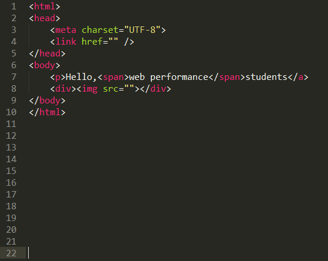
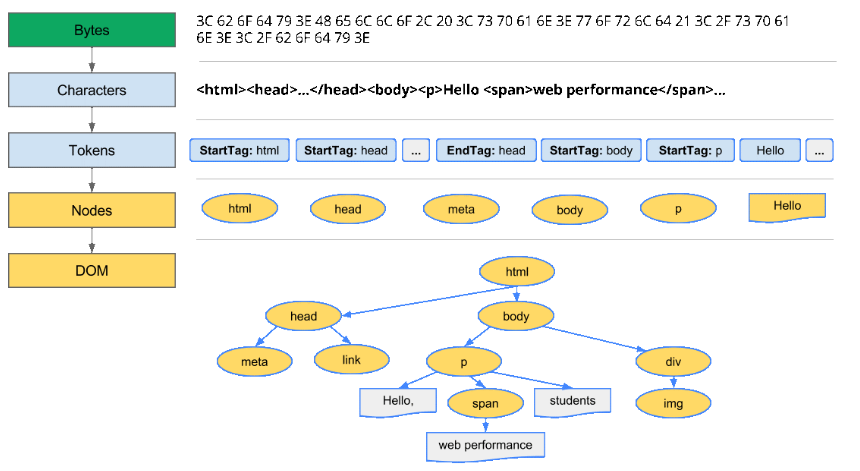
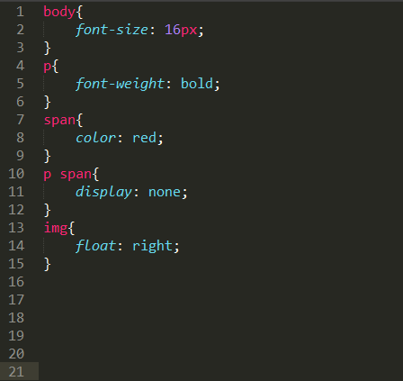
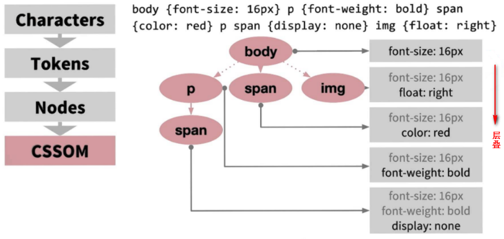
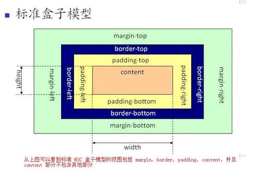
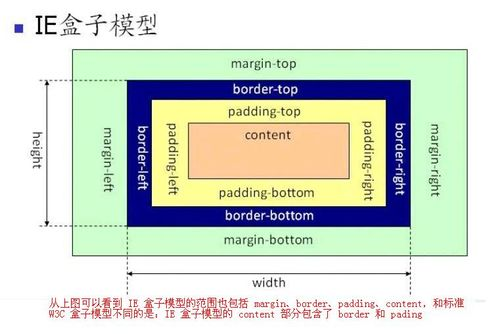

# 浏览器渲染的过程

**浏览器渲染页面的原理及流程**

浏览器将域名通过网络通信从服务器拿到html文件后，如何渲染页面呢？


1. 根据html文件构建DOM树和CSSOM树。构建DOM树期间，如果遇到JS，阻塞DOM树及CSSOM树的构建，优先加载JS文件，加载完毕，再继续构建DOM树及CSSOM树。

2. 构建渲染树（Render Tree）。

3. 页面的重绘（repaint）与重排（reflow，也有称回流）。页面渲染完成后，若JS操作了DOM节点，根据JS对DOM操作动作的大小，浏览器对页面进行重绘或是重排。

**一、构建DOM树及CSSOM树**

**1.1构建DOM树**

HTML 文档中的所有内容皆是节点，各节点之间拥有层级关系，如父子关系、兄弟关系等，彼此相连，构成DOM树。最常见的几种节点有：**文档节点、元素节点、文本节点、属性节点、注释节点**。

DOM节点树中节点与HTML文档中内容一一对应，DOM树构建过程：**读取html文档，将字节转换成字符，确定tokens（标签），再将tokens转换成节点，以节点构建 DOM 树**。如下图所示：

​           



 **1.2构建CSSOM树**

 CSS文档中，所有元素皆是节点，与HTML文件中的标签节点一一对应。CSS中各节点之间同样拥有层级关系，如父子关系、兄弟关系等，彼此相连，构成CSSOM树。

在构建DOM树的过程中，在 HTML 文档的 head 标签中遇到 link 标签，该标签引用了一个外部CSS样式表。由于预见到需要利用该CSS资源来渲染页面，浏览器会立即发出对该CSS资源的请求，并进行CSSDOM树的构建。

CSSOM树构建过程与DOM树构建流程一致：**读取CSS文档，将字节转换成字符，确定tokens（标签），再将tokens转换成节点，以节点构建 CSSOM 树**。如下图所示：

​                                              

.CSS文件，又名层叠样式表。当CSSOM树生成节点时，每一个节点首先会继承其父节点的所有样式，层叠覆盖，然后再以"向下级联"的规则，为该节点应用更具体的样式，递归生成CSSOM树。譬如，上右图中第二层的p节点，有父节点body，因此该p将继承body节点的样式："font-size: 16px;"。然后再应用该p节点自身的样式："font-weight: bold;"。所以最终该p节点的样式为："font-size: 16px;font-weight: bold;"。

**1.3加载JS**

若在构建DOM树的过程中，当 HTML 解析器遇到一个 script 标记时，即遇到了js，将立即阻塞DOM树的构建，将控制权移交给 JavaScript 引擎，等到 JavaScript 引擎运行完毕，浏览器才会从中断的地方恢复DOM树的构建。
其根本原因在于，**JS会对DOM节点进行操作，浏览器无法预测未来的DOM节点的具体内容，为了防止无效操作，节省资源，只能阻塞DOM树的构建**。譬如，若不阻塞DOM树的构建，若JS删除了某个DOM节点A，那么浏览器为构建此节点A花费的资源就是无效的。

若在HTML头部加载JS文件，由于JS阻塞，会推迟页面的首绘。为了加快页面渲染，一般将JS文件放到HTML底部进行加载，或是对JS文件执行async或defer加载。

**二.构建渲染树**

渲染树（Render Tree）由DOM树、CSSOM树合并而成，但并不是必须等DOM树及CSSOM树加载完成后才开始合并构建渲染树。三者的构建并无先后条件，亦非完全独立，而是会有交叉，并行构建。因此会形成一边加载，一边解析，一边渲染的工作现象。

构建渲染树，根据渲染树计算每个可见元素的布局，并输出到绘制流程，将像素渲染到屏幕上。

**三.页面的重绘（repaint）与重排（reflow）**

 **3.1重绘（repaint）**：屏幕的一部分要重绘。渲染树节点发生改变，但不影响该节点在页面当中的空间位置及大小。譬如某个div标签节点的背景颜色、字体颜色等等发生改变，但是该div标签节点的宽、高、内外边距并不发生变化，此时触发浏览器重绘（repaint）。

 **3.2重排（reflow）**：也有称回流，当渲染树节点发生改变，影响了节点的几何属性（如宽、高、内边距、外边距、或是float、position、display：none;等等），导致节点位置发生变化，此时触发浏览器重排（reflow），需要重新生成渲染树。譬如JS为某个p标签节点添加新的样式："display:none;"。导致该p标签被隐藏起来，该p标签之后的所有节点位置都会发生改变。此时浏览器需要重新生成渲染树，重新布局，即重排（reflow）。

注意：**重排必将引起重绘，而重绘不一定会引起重排。**

何时回引起重排？

当页面布局和几何属性改变时就需要重排。下述情况会发生浏览器重排：

1. 添加或者删除可见的DOM元素；

2. 元素位置改变——display、float、position、overflow等等；

3. 元素尺寸改变——边距、填充、边框、宽度和高度

4. 内容改变——比如文本改变或者图片大小改变而引起的计算值宽度和高度改变；

5. 页面渲染初始化；

6. 浏览器窗口尺寸改变——resize事件发生时；

**3.3如何减少和避免重排**

**Reflow 的成本比 Repaint 的成本高得多的多。**一个节点的 Reflow 很有可能导致子节点，甚至父节点以及兄弟节点的 Reflow 。在一些高性能的电脑上也许还没什么，但是如果 Reflow 发生在手机上，那么这个过程是延慢加载和耗电的。----浏览器的渲染原理简介

1. 直接改变className，如果动态改变样式，则使用cssText（考虑没有优化的浏览器）；

2. 让要操作的元素进行”离线处理”，处理完后一起更新；

a) 使用DocumentFragment进行缓存操作,引发一次回流和重绘；
b) 使用display:none技术，只引发两次回流和重绘；
c) 使用cloneNode(true or false) 和 replaceChild 技术，引发一次回流和重绘；

3. 不要经常访问会引起浏览器flush队列的属性，如果你确实要访问，利用缓存；

4. 让元素脱离动画流，减少回流的Render Tree的规模；

[浏览器渲染页面的原理及流程](https://www.cnblogs.com/chenyoumei/p/9156849.html)

# HTML5新特性

[HTML5的十大新特性](https://www.cnblogs.com/vicky1018/p/7705223.html)

# css选择器

1. 元素选择器

2. id选择器

3. 类选择器

4. 属性选择器

5. 交集选择器

   ```css
   .class1.class2{...}
   ```

6. 并集选择器 

   ```css
   .class1,.class2{...}
   ```

7. 伪元素选择器

8. 伪类选择器

9. 通配选择器

   ```css
   *{...}
   ```


**选择器优先级**

> 内联 > ID选择器 > 类选择器（类，属性，伪类） > 标签选择器。

最为优先的`!important`

**计算总的优先级**

使用选择器出现数量来确定优先级

（内联，id，类，标签）：分别表示选择器出现的数量，**从左往右依次进行比较 ，较大者胜出，如果相等，则继续往右移动一位进行比较 。如果4位全部相等，则后面的会覆盖前面的**

```html
<body>
	<nav id="nav">
  	<div class="selected">
      <a href="#">ddd</a>
    </div>
  </nav>
</body>
```

```css
#nav .selected > a:hover{color:red}             /* (0, 1, 2, 1) */
html body #nav .selected > a:hover{color:blue}  /* (0, 1, 2, 3) */
```

对比可以知道当鼠标移动到a上的时候显示的是蓝色字体


| 选择器                                                       | 例子                  | 例子描述                                            | CSS  |
| :----------------------------------------------------------- | :-------------------- | :-------------------------------------------------- | :--- |
| [.*class*](https://www.w3school.com.cn/cssref/selector_class.asp) | .intro                | 选择 class="intro" 的所有元素。                     | 1    |
| [#*id*](https://www.w3school.com.cn/cssref/selector_id.asp)  | #firstname            | 选择 id="firstname" 的所有元素。                    | 1    |
| [*](https://www.w3school.com.cn/cssref/selector_all.asp)     | *                     | 选择所有元素。                                      | 2    |
| [*element*](https://www.w3school.com.cn/cssref/selector_element.asp) | p                     | 选择所有 <p> 元素。                                 | 1    |
| [*element*,*element*](https://www.w3school.com.cn/cssref/selector_element_comma.asp) | div,p                 | 选择所有 <div> 元素和所有 <p> 元素。                | 1    |
| [*element* *element*](https://www.w3school.com.cn/cssref/selector_element_element.asp) | div p                 | 选择 <div> 元素内部的所有 <p> 元素。                | 1    |
| [*element*>*element*](https://www.w3school.com.cn/cssref/selector_element_gt.asp) | div>p                 | 选择父元素为 <div> 元素的所有 <p> 元素。            | 2    |
| [*element*+*element*](https://www.w3school.com.cn/cssref/selector_element_plus.asp) | div+p                 | 选择紧接在 <div> 元素之后的所有 <p> 元素。          | 2    |
| [[*attribute*\]](https://www.w3school.com.cn/cssref/selector_attribute.asp) | [target]              | 选择带有 target 属性所有元素。                      | 2    |
| [[*attribute*=*value*\]](https://www.w3school.com.cn/cssref/selector_attribute_value.asp) | [target=_blank]       | 选择 target="_blank" 的所有元素。                   | 2    |
| [[*attribute*~=*value*\]](https://www.w3school.com.cn/cssref/selector_attribute_value_contain.asp) | [title~=flower]       | 选择 title 属性包含单词 "flower" 的所有元素。       | 2    |
| [[*attribute*\|=*value*\]](https://www.w3school.com.cn/cssref/selector_attribute_value_start.asp) | [lang\|=en]           | 选择 lang 属性值以 "en" 开头的所有元素。            | 2    |
| [:link](https://www.w3school.com.cn/cssref/selector_link.asp) | a:link                | 选择所有未被访问的链接。                            | 1    |
| [:visited](https://www.w3school.com.cn/cssref/selector_visited.asp) | a:visited             | 选择所有已被访问的链接。                            | 1    |
| [:active](https://www.w3school.com.cn/cssref/selector_active.asp) | a:active              | 选择活动链接。                                      | 1    |
| [:hover](https://www.w3school.com.cn/cssref/selector_hover.asp) | a:hover               | 选择鼠标指针位于其上的链接。                        | 1    |
| [:focus](https://www.w3school.com.cn/cssref/selector_focus.asp) | input:focus           | 选择获得焦点的 input 元素。                         | 2    |
| [:first-letter](https://www.w3school.com.cn/cssref/selector_first-letter.asp) | p:first-letter        | 选择每个 <p> 元素的首字母。                         | 1    |
| [:first-line](https://www.w3school.com.cn/cssref/selector_first-line.asp) | p:first-line          | 选择每个 <p> 元素的首行。                           | 1    |
| [:first-child](https://www.w3school.com.cn/cssref/selector_first-child.asp) | p:first-child         | 选择属于父元素的第一个子元素的每个 <p> 元素。       | 2    |
| [:before](https://www.w3school.com.cn/cssref/selector_before.asp) | p:before              | 在每个 <p> 元素的内容之前插入内容。                 | 2    |
| [:after](https://www.w3school.com.cn/cssref/selector_after.asp) | p:after               | 在每个 <p> 元素的内容之后插入内容。                 | 2    |
| [:lang(*language*)](https://www.w3school.com.cn/cssref/selector_lang.asp) | p:lang(it)            | 选择带有以 "it" 开头的 lang 属性值的每个 <p> 元素。 | 2    |
| [*element1*~*element2*](https://www.w3school.com.cn/cssref/selector_gen_sibling.asp) | p~ul                  | 选择前面有 <p> 元素的每个 <ul> 元素。               | 3    |
| [[*attribute*^=*value*\]](https://www.w3school.com.cn/cssref/selector_attr_begin.asp) | a[src^="https"]       | 选择其 src 属性值以 "https" 开头的每个 <a> 元素。   | 3    |
| [[*attribute*$=*value*\]](https://www.w3school.com.cn/cssref/selector_attr_end.asp) | a[src$=".pdf"]        | 选择其 src 属性以 ".pdf" 结尾的所有 <a> 元素。      | 3    |
| [[*attribute*=*value*\]](https://www.w3school.com.cn/cssref/selector_attr_contain.asp) | a[src*="abc"]         | 选择其 src 属性中包含 "abc" 子串的每个 <a> 元素。   | 3    |
| [:first-of-type](https://www.w3school.com.cn/cssref/selector_first-of-type.asp) | p:first-of-type       | 选择属于其父元素的首个 <p> 元素的每个 <p> 元素。    | 3    |
| [:last-of-type](https://www.w3school.com.cn/cssref/selector_last-of-type.asp) | p:last-of-type        | 选择属于其父元素的最后 <p> 元素的每个 <p> 元素。    | 3    |
| [:only-of-type](https://www.w3school.com.cn/cssref/selector_only-of-type.asp) | p:only-of-type        | 选择属于其父元素唯一的 <p> 元素的每个 <p> 元素。    | 3    |
| [:only-child](https://www.w3school.com.cn/cssref/selector_only-child.asp) | p:only-child          | 选择属于其父元素的唯一子元素的每个 <p> 元素。       | 3    |
| [:nth-child(*n*)](https://www.w3school.com.cn/cssref/selector_nth-child.asp) | p:nth-child(2)        | 选择属于其父元素的第二个子元素的每个 <p> 元素。     | 3    |
| [:nth-last-child(*n*)](https://www.w3school.com.cn/cssref/selector_nth-last-child.asp) | p:nth-last-child(2)   | 同上，从最后一个子元素开始计数。                    | 3    |
| [:nth-of-type(*n*)](https://www.w3school.com.cn/cssref/selector_nth-of-type.asp) | p:nth-of-type(2)      | 选择属于其父元素第二个 <p> 元素的每个 <p> 元素。    | 3    |
| [:nth-last-of-type(*n*)](https://www.w3school.com.cn/cssref/selector_nth-last-of-type.asp) | p:nth-last-of-type(2) | 同上，但是从最后一个子元素开始计数。                | 3    |
| [:last-child](https://www.w3school.com.cn/cssref/selector_last-child.asp) | p:last-child          | 选择属于其父元素最后一个子元素每个 <p> 元素。       | 3    |
| [:root](https://www.w3school.com.cn/cssref/selector_root.asp) | :root                 | 选择文档的根元素。                                  | 3    |
| [:empty](https://www.w3school.com.cn/cssref/selector_empty.asp) | p:empty               | 选择没有子元素的每个 <p> 元素（包括文本节点）。     | 3    |
| [:target](https://www.w3school.com.cn/cssref/selector_target.asp) | #news:target          | 选择当前活动的 #news 元素。                         | 3    |
| [:enabled](https://www.w3school.com.cn/cssref/selector_enabled.asp) | input:enabled         | 选择每个启用的 <input> 元素。                       | 3    |
| [:disabled](https://www.w3school.com.cn/cssref/selector_disabled.asp) | input:disabled        | 选择每个禁用的 <input> 元素                         | 3    |
| [:checked](https://www.w3school.com.cn/cssref/selector_checked.asp) | input:checked         | 选择每个被选中的 <input> 元素。                     | 3    |
| [:not(*selector*)](https://www.w3school.com.cn/cssref/selector_not.asp) | :not(p)               | 选择非 <p> 元素的每个元素。                         | 3    |
| [::selection](https://www.w3school.com.cn/cssref/selector_selection.asp) | ::selection           | 选择被用户选取的元素部分。                          | 3    |

# 盒子模型

## w3c标准盒子模型



设置

```css
box-sizing:content-box;		默认
```

​		根据 W3C 的规范，元素内容占据的空间是由 width 属性设置的，而内容周围的 padding 和 border 值是另外计算的；即在标准模式下的盒模型，盒子实际内容（content）的width/height=我们设置的width/height;盒子总宽度/高度=width/height+padding+border+margin。

## ie盒子模型



设置

```css
box-sizing:border-box;
```

在该模式下，浏览器的 width 属性不是内容的宽度，而是内容、内边距和边框的宽度的总和；即在怪异模式下的盒模型，盒子的（content）宽度+内边距padding+边框border宽度=我们设置的width(height也是如此)，盒子总宽度/高度=width/height + margin = 内容区宽度/高度 + padding + border + margin。

# 布局模型

[布局模型](https://www.cnblogs.com/21-forever/p/10849768.html)

# 垂直外边距重叠问题

```html
<div class="div3">
<div class="div4"></div>
</div>
<div class="div1"></div>
<div class="div2"></div>
```

```css
.div1{
  width:100px;
  height:100px;
  background-color:red;
  margin-bottom:100px;
}
.div2{
  width:100px;
  height:100px;
  background-color:blue;
  margin-top:200px;
}

.div3{
  width:200px;
  height:200px;
  background-color:yellow;
}
.div4{
  width:100px;
  height:100px;
  background-color:green;
  margin-top:100px;
}
```

此时div1和div2的垂直方向上的外边距是200px而不是300px，div4也不是相对于div3外边距是100px,而是div3相对于页面有100px的外边距。这是因为在网页中**两个相邻**的元素**垂直方向**上的外边距会重叠，兄弟元素会区最大值，父子元素设置时，子元素的外边距会传递给父元素并且取最大值。

想要解决这个情况只需要将两个条件（相邻，垂直）破坏其中一个就可以了

方法

1. 设置border-top/border-bottom或者padding-top/padding-bottom;

   ​		这种方法会添加额外的像素

2. 设置:before/:after伪元素。

# 高度坍塌问题

父元素包裹着子元素，父元素的高度被子元素撑开，当子元素设置浮动时（脱离文档流），父元素的高度就会变成0，出现高度塌陷的问题，导致后面的元素向上移动——页面布局混乱。

父元素包裹着子元素，父元素的高度被子元素撑开，当子元素设置浮动时，父元素的高度就会变成0，出现高度塌陷的问题，导致后面的元素向上移动——页面布局混乱。

- 解决方法：开启BFC（ Block Formatting Context）块级格式化环境

  - 1.父元素的垂直外边距不会和子元素重叠
  - 2.开启BFC的元素不会被浮动元素所覆盖
  - 3.开启BFC的元素可以包含浮动的子元素

- 如何开启元素的BFC：对象是出现高度塌陷得到元素

  - 1.设置元素浮动
  	- 使用这种方式开启,虽然可以撑开父元素,但是会导致父元素的宽度丢失， 而且使用这种方式也会导致下边的元素上移,不能解决问题

  - 2.设置元素绝对定位

  - 3.设置元素为 inline-block
- 可以解决问题,但是会导致宽度丢失,不推荐使用这种方式
  
- 4.将元素的overflow设置为一个非visible的值
  - 推荐方式:将 overflow：hidden设置为是副作用最小的开启BFC的方式
  
  - 5.使用clear：both/left/right;清除受浮动对其他元素的影响

  - 6.直接在高度塌陷的父元素的最后,添加一个空白的div,并且设置clear：both

  - 7.通过after伪类，在父元素中添加一个元素，并且设置display:block;clear:both;zoom:1;

- 在IE6中虽然没有BFC,但是具有另一个隐含的属性叫做 hasLayout,  该属性的作用和BFC类似,所在工E6浏览器可以通过开 has Layout来解决该问题

- 使用zoom:1

  - zoom表示放大的意思,后边跟着一个数值,写几就将元素放大几倍  zoom:1表示不放大元素,但是通过该样式可以开启 hasLayout  z0om这个样式,只在工E中支持,其他浏览器都不支持

```css
/*即可解决高度塌陷又可以解决垂直方向上外边距重叠问题 */
.clearfix:before, 
.clearfix:after{     
  content:"";    
  display:block;     
  clear:both; 
}
```


# 前端的一些常见问题

## 第一题：哪些方法可以使元素隐藏？

（1）使用 display:none;隐藏元素，渲染树不会包含该渲染对象，因此该元素不会在页面中占据位置，也不会响应绑定的监听事件。

（2）使用 visibility:hidden;隐藏元素。元素在页面中仍占据空间，但是不会响应绑定的监听事件。

（3）使用 opacity:0;将元素的透明度设置为 0，以此来实现元素的隐藏。元素在页面中仍然占据空间，并且能够响应元素绑定的监听事件。

（4）通过使用绝对定位将元素移除可视区域内，以此来实现元素的隐藏。

（5）通过 z-index 负值，来使其他元素遮盖住该元素，以此来实现隐藏。

（6）通过 transform:scale(0,0)来将元素缩放为 0，以此来实现元素的隐藏。这种方法下，元素仍在页面中占据位置，但是不会响应绑定的监听事件。

## 第二题：如何实现两栏布局，一栏固定一栏自适应？

以左边宽度固定为 200px 为例

（1）利用浮动，将左边元素宽度设置为 200px，并且设置向左浮动。将右边元素的margin-left 设置为 200px，宽度设置为 auto（默认为 auto，撑满整个父元素）。

（2）第二种是利用 flex 布局，将左边元素的放大和缩小比例设置为 0，基础大小设置为 200px。将右边的元素的放大比例设置为 1，缩小比例设置为 1，基础大小设置为auto。

（3）第三种是利用绝对定位布局的方式，将父级元素设置相对定位。左边元素设置为 absolute 定位，并且宽度设置为 200px。将右边元素的 margin-left 的值设置为200px。

（4）第四种还是利用绝对定位的方式，将父级元素设置为相对定位。左边元素宽度设置为 200px，右边元素设置为绝对定位，左边定位为 200px，其余方向定位为 0。

## 第三题：什么是 CSS 预处理器/后处理器？

CSS预处理器定义了一种新的语言，其基本思想是，用一种专门的编程语言，为CSS增加了一些编程的特性，将CSS作为目标生成文件，然后开发者就只要使用这种语言进行编码工作。通俗的说，CSS预处理器用一种专门的编程语言，进行Web页面样式设计，然后再编译成正常的CSS文件。预处理器例如：LESS、Sass，用来预编译Sass或less，增强了css代码的复用性，还有层级、变量、循环、函数等，具有很方便的UI组件模块化开发能力，极大的提高工作效率。

CSS后处理器是对CSS进行处理，并最终生成CSS的预处理器，它属于广义上的CSS预处理器。我们很久以前就在用CSS后处理器了，最典型的例子是CSS压缩工具（如clean-css），只不过以前没单独拿出来说过。

后处理器例如：PostCSS，通常被视为在完成的样式表中根据CSS规范处理CSS，让其更有效；目前最常做的是给CSS属性添加浏览器私有前缀，实现跨浏览器兼容性的问题。

## 第四题：移动端的布局用过媒体查询吗？

假设你现在正用一台显示设备来阅读 这篇文章，同时 你也想  把它投影到屏幕上，或者打印 出来，  而显示设备、屏幕投影和打印 等这些媒介都 有自 己的特 点，CSS就是为文档提供在不同媒介上展示的适配方法，当媒体查询为真时 ，相 关的样式表或样式规则会按照 正常的级联规则被应用。

当媒体查询返回假，标签上带有媒体查询的样式表仍将被下载（只不过不会被应用）。包含了一个媒体类型和 至少 一个使用宽度、高度和颜色 等媒体属性来限制 样式表范围的表 达式。CSS3加入的媒体查询使得无需修改内容便可以使样式应用于某些特定的设备范围。

## 第五题：了解BFC吗？

块格式化上下文是Web页面的可视化CSS渲染的一部分 ，是布局过程中生成块级盒子的区域，也是浮动元素与其他元素的交互限定区域。通俗来讲，BFC是一个独立的布局环境，可以理解为一个容器，在这个容器中按照 一定规则进行物品摆放，并且不会影响其它环境中的物品。如果一个元素符合触发BFC的条件，则BFC中的元素布局不受外部影响。

一般来说根元素是一个BFC区域，浮动和绝对定位的元素也会形成BFC，display属性的值为inline-block、flex这些属性时也会 创建BFC。还有就是元素的overflow的值不为visible时都会创建BFC。

## 第六题：margin 重叠问题的理解

margin重叠指的是在垂直方向上，两个相邻元素的margin发生重叠的情况。一般来说可以分为四种情形：

第一种是相邻兄弟  元素的marin-bottom和margin-top的值发生重叠 。这种  情况 下我们可以通过设置其中一个元素为BFC来解决。

第二种是父元素的margin-top和子元素的margin-top发生 重叠 。它们发生重叠 是因为它们是相邻的， 所以我们可以通过这一点来解决 这个问题。我们可以为父元素设置border-top、padding-top值来分隔它们，当然我们也可以将父元素设置为BFC来解决。

第三种是高度为auto的父元素的margin-bottom和子元素的margin-bottom发生重叠 。它们发生重叠 一个是因为它们相邻，一个是因为父元素的高度不固定。因此我们可以为父元素设置border-bottom、padding-bottom来分隔 它们，也可以为父元素设置一个高度，max-height和min-height也能 解决 这个问题。当然将父元素设置为BFC是最简单的方法。

第四种  情况 ，是没有内容的元素，自身的margin-top和margin-bottom发生的  重叠。我们可以通过为其设置border、padding或者高度来解决这个问题。

