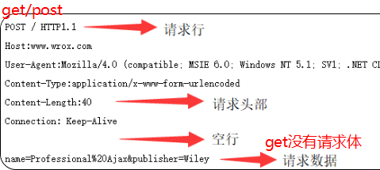

# http和https

http和https是一种网络协议。

## http的特点：

1. 无状态
2. 无连接
3. 基于请求和响应
4. 简单快速、灵活
5. 通信使用明文，也不会对通信方进行身份验证

## https特点：

1. 内容加密：采用混合加密技术，中间这无法直接查看明文内容
2. 验证身份：通过证书认证客户端访问的是自己的服务器
3. 保护数据完整性：防止传输的内容被中间人冒充或者篡改

## http工作流程

1. 首先客户机与服务器需要建立连接。只要单击某个超级链接，HTTP的工作开始。

2. 建立连接后，客户机发送一个请求给服务器，请求方式的格式为：统一资源标识符（URL）、协议版本号，后边是MIME信息包括请求修饰符、客户机信息和可能的内容。

3. 服务器接到请求后，给予相应的响应信息，其格式为一个状态行，包括信息的协议版本号、一个成功或错误的代码，后边是MIME信息包括服务器信息、实体信息和可能的内容。

4. 客户端接收服务器所返回的信息通过浏览器显示在用户的显示屏上，然后客户机与服务器断开连接。

   ​		如果在以上过程中的某一步出现错误，那么产生错误的信息将返回到客户端，有显示屏输出。对于用户来说，这些过程是由HTTP自己完成的，用户只要用鼠标点击，等待信息显示就可以了。

**请求报文**



**响应报文**


### TCP 三次握手

- seq 序号，用来标识从TCP 源端向目的端发送的字节流，发送数据时对此进行标记
- ack 确认序号，只有 ACK标志位为1时，确认序号字段才有效，ack=seq+1
- 标志位
	- ACK：确认序号有效
	- RST：重置连接
	- SYN：发起一个新连接
	- FIN：释放一个链接
	- …..


### TCP四次挥手

客户端和服务器建立连接通道后，客户端把数据传递给服务器，然后开始发送释放 TCP 的操作；服务器返回给客户端信息，会先将回馈返回（避免应答不及时导致客户端多次发送数据），然后才会准备数据，在给客户端发送数据。


### http版本区别：

- http 0.9 负责传输 html 最早的时候没有请求头和响应头
- http 1.0 提供了http 的 header 可以改根据 header 的不同来处理不同的资源（TCP 连接通道用完就会被关闭）
- http 1.1 默认开启 keep-alive 链接复用；管线化——服务器处理多个请求（队头阻塞问题）
	- **队头阻塞问题**：若干个请求排队串行化单线程处理，后面的请求等待前面请求的返回才会获得执行机会，一旦有某个请求超时，后续请求只能被阻塞，这就是队头阻塞
- http 2.0 用同一个 tcp 链接来发送数据 一个域名一个tcp（多路复用）头部压缩 服务器可以推送数据给客户端

```
//通过在应用生成 HTTP 响应头信息中设置Link 命令
Link:</styles.css>; rel=preload; as=style, </example.png>; rel=preload; as=image
```

- http 3.0 解决了tcp的队头阻塞问题 QUIC 协议 采用了 udp


[【HTTP协议】---HTTP协议详解](https://www.cnblogs.com/qdhxhz/p/8468913.html)