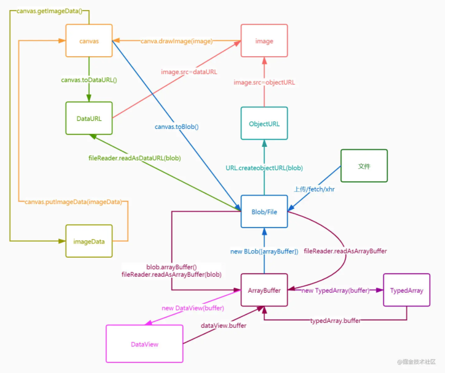
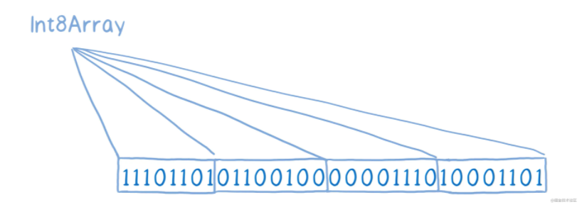
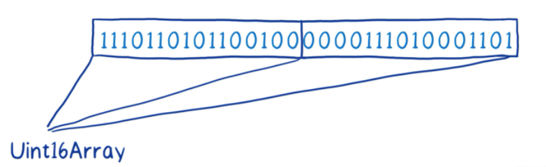
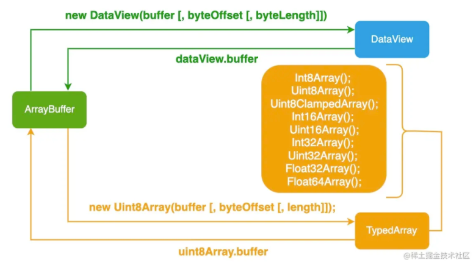

## 前端二进制数据

前端开发中我们一般都不会使用的二进制数据，但是有时候一些需求也需要我们懂得一些处理二进制的方法才能完成。比如大文件上传，接收后端传递的二进制流数据等。

前端关于二进制相关的数据对象有，ArrayBuffer（顺便提一下 nodejs 里面一般都是 Buffer）、TypedArray、DataView、Blob、File、Base64（DataURL）、fileReader。

其中他们的大致关系及转化方式如下




## Blob

**概念解释**

全称是`binary large object`,二进制大文件对象，非Javascript特有，计算机通用对象，MDN上解释是，一个Blob对象就是一个包含有只读原始数据的类文件对象，通俗讲就是不可修改的二进制文件

```js
var ablob = new Blob(['hello','world'],{type:'text/plain'});
//array:一堆数据构成的数组
// options：配置选项，其中比较常用的是 type 属性,表示数据的MIME类型
```

Blob 实例常用的属性和方法有

```js
ablob.size;//数据的大小 readonly
ablob.type;//数据的mime类型
ablob.slice(start,end,contentType);//分割数据，分割的方式是复杂一份新的数据，contentType表分割的数据的新的数据类型，常用来做大文件上传的需求
ablob.arrayBuffer() //返回一个以二进制形式展现的 promise
ablob.stream() //返回一个ReadableStream对象
ablob.text() //返回一个文本形式的 promise
```

文件传输，上传和下载都是 Blob格式


## File

**概念解释**

File就是文件，继承自Blob，也是二进制对象，也有自己特有的属性和方法，通常用在`<input type="file">`选择的`FileList`对象，或者是使用拖拽操作产生的的`DataTransfer`对象。

```js
var myFile = new File(['hello','world'],'text.txt',{type:'text/plain'});
// array：一堆数据构成的数组 
// name:文件名
// options：设置一些属性，type属性、lastModified
```

File 实例的属性和方法有

```js
myFile.name：文件名
myFile.size：文件大小
myFile.lastModified ：最后修改时间（时间戳）
myFile.lastModifiedDate:最后修改时间Data对象
myFile.type：MIME类型
```

File 拥有和 Blob 一样的方法。


## ArrayBuffer

**概念解释**

`ArrayBuffer`是内存上一段二进制数据，我们可以借助工具TypeArray、DataView对它进行读写

**Blob与ArrayBuffer的关系**

- `ArrayBuffer`是底层二进制数据，可以借助工具进行读写，而`Blob`是对底层二进制数据的封装，我们拿到的就是一个整体，能够读取他的大小，类型，但是不能看到细节
- Blob可以接受一个`ArrayBuffer`作为参数生成一个`Blob`对象，此行为就相当于对`ArrayBuffer`数据做一个封装，之后就是以整体的形式展现了

-`Blob`作为一个整体文件，适合用于传输；而只有需要关注细节（比如要修改某一段数据时），才需要用到`ArrayBuffer`

```js
//创建
let buffer = new ArrayBuffer(2);
```

这里的意思申请一个 2 个字节的连续的空间。(如果要使用TypedArray 、DataView字节数需要是2的倍数)

> 1 字节（byte）= 8 位（bit）


## TypedArray

TypedArray是一组构造函数，一共包含九种类型，每一种都是一个构造函数。

TypedArray的构造函数接受三个参数，第一个ArrayBuffer（其实还可以是数组、视图这里不细说）对象，第二个视图开始的字节号（默认0），第三个视图结束的字节号（默认直到本段内存区域结束）。

| 名称              | 占用字节 | 描述                                   |
| ----------------- | -------- | -------------------------------------- |
| Int8Array         | 1        | 8位有符号整数                          |
| Uint8Array        | 1        | 8位无符号整数                          |
| Uint8ClampedArray | 1        | 8位无符号整型固定数组(数值在0~255之间) |
| Int16Array        | 2        | 16位有符号整数                         |
| Uint16Array       | 2        | 16位无符号整数                         |
| Int32Array        | 4        | 32 位有符号整数                        |
| Uint32Array       | 4        | 32 位无符号整数                        |
| Float32Array      | 4        | 32 位 IEEE 浮点数                      |
| Float64Array      | 8        | 64 位 IEEE 浮点数                      |

视图针对的是内存地址，所以一个试图对buffer进行操作，其他试图获取的的数据也会变化。不同视图其实就是同一数据的不同表现形式而已。

```js
let v = new TypedArray(buffer [, byteOffset [, length]]);
//buffer:buffer或者尺寸number
//byteOffset:偏移字节量
//length:数据长度
```

数据的读取和设置和数组的数组方式是一样的，如设置是`v[0] = 2`，读取是`v[0]`

```js
let ab = new ArrayBuffer(2);
let v = new Uint8Array(ab);
v[0] = 2;
console.log(v[0]);
```

需要注意的是 byteOffset 必须是 `8视图位数 / 8byte = 1`的倍数，而且偏移后获取到的总子节长度要为 视图位数的整数倍。

```js
let ab = new ArrayBuffer(6);
let v1 = new Uint8Array(ab,1);//可以
let v2 = new Uint16Array(ab,1);//错误 byteOffet 必须为 16 / 8 = 2 的倍数
let v3 = new Uint16Array(ab,2);//可以
let v4 = new Uint16Array(ab,5);//错误 偏移5个子节后，剩余 只有 1 byte = 8 bit < 16
```

还有就是 byteOffset 是相对于原始数据量而言的，而且并不是指视图数据列表索引，比如：

```js
let ab = new ArrayBuffer(8);
let vi = new Uint32Array(ab,4);
```

上面以 32 位视图观察 ab得到的数据的数组长度是2，然后 byteOffset 为 4，并没有超出数组长度，因为 4 是相对于 ab 而言的，ab有8个字节，上面的意思就是取出以32位视图从第4字节开始观察ab的数据。所以得到vi的长度会是1.

TypedArray视图的属性

```js
buffer: buffer数据源
byteLength: 视图字节长度 与设置的buffer字节数一致
byteOffset: 视图字节偏移量
length: 数据长度 = buffer字节数 * 8 / 视图位数
```

常用方法

`set`方法用于复制数组（普通数组或 TypedArray 数组），也就是将一段内容完全复制到另一段内存。

```js
const a = new Uint16Array(8);
const b = new Uint16Array(8);
const c = new Uint16Array(10);
b.set(a);
c.set(a, 2);//c数组比a数组多两个成员，所以从c[2]开始复制。
```

`slice`方法，可以返回一个指定位置的新的`TypedArray`实例。

```js
let ui8 = Uint8Array.of(0, 1, 2);
ui8.slice(1);//从1子节处开发截取
```


## ArrayBuffer 和 TypedArray 的关系

比如这是一个 ArrayBuffer


那个 Uint8Array 就是这样的映射



Uint16Array 就是这样的




## DataView

`DataView` 就是一种更灵活的视图，DataView视图支持除Uint8ClampedArray以外的八种类型。DataView比使用TypedArray更方便，只需要简单的创建一次就能进行各种转换。

```js
//读取
getInt8：读取 1 个字节，返回一个 8 位整数。
getUint8：读取 1 个字节，返回一个无符号的 8 位整数。
getInt16：读取 2 个字节，返回一个 16 位整数。
getUint16：读取 2 个字节，返回一个无符号的 16 位整数。
getInt32：读取 4 个字节，返回一个 32 位整数。
getUint32：读取 4 个字节，返回一个无符号的 32 位整数。
getFloat32：读取 4 个字节，返回一个 32 位浮点数。
getFloat64：读取 8 个字节，返回一个 64 位浮点数
//写入
setInt8：写入 1 个字节的 8 位整数。
setUint8：写入 1 个字节的 8 位无符号整数。
setInt16：写入 2 个字节的 16 位整数。
setUint16：写入 2 个字节的 16 位无符号整数。
setInt32：写入 4 个字节的 32 位整数。
setUint32：写入 4 个字节的 32 位无符号整数。
setFloat32：写入 4 个字节的 32 位浮点数。
setFloat64：写入 8 个字节的 64 位浮点数。
```

例子

```js
const buffer = new ArrayBuffer(24);
const dv = new DataView(buffer);

// 从第1个字节读取一个8位无符号整数
const v1 = dv.getUint8(0);

// 从第2个字节读取一个16位无符号整数
const v2 = dv.getUint16(1);

// 从第4个字节读取一个16位无符号整数
const v3 = dv.getUint16(3);
```

到这里你可能认为，如果通过不同类型的 TypeArray，指定起始字节和长度，也能达到一样的效果，嗯现在看是的，但是 DataView 还有另外一个特性：设置字节序

### 字节序

#### 什么是字节序

首先说一下什么是字节序，字节序是数值在内存中的存储方式。分为小端字节序（little-endian）和大端字节序（big-endian）两种

所有的英特尔处理器都使用小端字节序，我们个人电脑基本都是小端字节序，小端字节序会把最不重要的放在最前，可类比欧洲通用的日期书写方式（例如，31 December 2050。年份是最重要的，月份其次，日期最后）

大端字节序则是相反的顺序，可类比 ISO 日期格式（例如 2050-12-31）。big-endian 通常被称作"网络字节顺序"（"network byte order"）, 因为互联网标准通常要求数据使用 big-endian 存储，从标准 Unix 套接字（socket）层开始，一直到标准化网络的二进制数据结构。

#### 字节序和 TypedArray、DataView 的关系

TypedArray 中，字节序会跟随系统的字节序，于是基本都是小端字节序，是不支持自己设置的，于是就会带来一个问题：如果从网络请求来的数据是大端字节序，会导致数据无法解析。

相比之下，DataView 可以支持设置字节序，举个例子：

```js
const buffer = new ArrayBuffer(24);
const dv = new DataView(buffer);

// 小端字节序
const v1 = dv.getUint16(1, true);

// 大端字节序
const v2 = dv.getUint16(3, false);

// 大端字节序
const v3 = dv.getUint16(3);
```

DataView 实例方法的第二个参数，可以用来设置字节序，默认是大端字节序

如果不确定计算机上的字节序，可以通过这个方法来判断：

```js
const littleEndian = (function() {
  const buffer = new ArrayBuffer(2);
  new DataView(buffer).setInt16(0, 256, true);
  return new Int16Array(buffer)[0] === 256;
})();
复制代码
```

如果返回`true`，就是小端字节序；如果返回`false`，就是大端字节序。


## ArrayBuffer、TypedArray、DataView之间的关系




## 数据间相互转换

### ArrayBuffer <==> 字符串

```js
//ArrayBuffer => 字符串
let ab = new ArrayBuffer(2)
let encoding = 'utf8';
let decoder = new TextDecoder(encoding);//encoding 是字符编码方式
decoder.decode(ab);//ab 可以是 ArrayBuffer、TypedArray，返回的是一个字符串

//字符串 => ArrayBuffer
let str = "hello world";
let encoding = 'utf8';
let encoder = new TextEncoder(encoding);//encoding 是字符编码方式
let view = encoder.encode(str);//返回的是 TypedArray，里面的 buffer 就是 ArrayBuffer
console.log(view.buffer)
```


### 字符 <==> base64

```js
// 字符 => base64 
let rs =  btoa('xxx')// rs 是一个base64字符串

// base64 => 字符
let s = atob(rs)// atob 把base64转成字符串 s==='xxx'
```

对于 atob 和 btoa 这两个方法来说，其中的 a 代表 ASCII，而 b 代表 Blob，即二进制。因此 atob 表示 ASCII 到二进制，对应的是解码操作。而 btoa 表示二进制到 ASCII，对应的是编码操作


### FileReader 处理 Blob/File 成 ArrayBuffer/ DataURL / Text

FileReader函数, 读取Blob,他有3个读取的方式,分别生成ArrayBuffer,base64字符串,文本

+ readAsArrayBuffer生成的是 ArrayBuffer
+ readAsDataURL生成的是 base64字符串
+ readAsText生成的是 生成的是一个文本

所以可以实现 **Blob/File => DataURL / ArrayBuffer / Text**

```js
function readBlob(blob,type){
  return new Promise((resolve)=>{
    let reader = new FileReader()
    reader.onload = function(event){
      resolve(event.target.result)
    }
    switch(type){
      case 'ArrayBuffer':
      // readAsArrayBuffer生成的是 ArrayBuffer
        reader.readAsArrayBuffer(blob);
        break;
      case 'DataURL':
      // 二进制数据转换成可读的字符串 base64字符串
        reader.readAsDataURL(blob);
        break;
      case 'Text':
      // 生成的是一个文本
        reader.readAsText(blob,'utf-8');
        break;
      default:
        break;
    }
  })
}
readBlob(blob,'ArrayBuffer').then(rs=>{
  console.log('ArrayBuffer',rs)
})
readBlob(blob,'DataURL').then(rs=>{
  console.log('DataURL',rs)
})
readBlob(blob,'Text').then(rs=>{
  console.log('Text',rs)
})
```


### ArrayBuffer 转 Blob / File

```js
var array = new Uint8Array([0x01, 0x02, 0x03, 0x04]);
var blob = new Blob([array]);
var file = new File([array],'test.txt',{type:'text/plain'});
```


### base64 => ArrayBuffer => blob,下载图片

DateURL(base64) 其实是一种编码格式，类型是字符串，格式是

```js
data:[<mediatype>][;base64],<data>

"data:text/plain;base64,aGVsbG9yYW5keQ=="
```

其中`<mediatype>`表示 MIME 类型，`<data>`才是数据内容如`aGVsbG9yYW5keQ=`

我们可以将数据内容通过 atob 转化成字符后 存储到 ArrayBuffer 才能将数据转化成 Blob ，但是要操作 ArrayBuffer 需要使用到 TypedArray，而 TypedArray 只能存储 Number 类型的数据，所以我们还需要将 DataURL 中的每个字符通过`s.charCodeAt(index)`来转化成 ASCII 码。之后再通过 URL.createObjectURL(blob) 生成下载url即可

```js
function download(data){
  let bytes = new ArrayBuffer(data.length)
  let arr = new Uint8Array(bytes)
  for(let i=0;i<data.length;i++){
    arr[i] = data.charCodeAt(i)
  }
  let blob = new Blob([arr],{type:'image/png'})
  let a = document.createElement('a')
  a.download = 'user.png'//下载名
  a.rel = 'noopener'
  a.href = URL.createObjectURL(blob)
  a.dispatchEvent(new MouseEvent('click'));
  URL.revokeObjectURL(blob);//销毁objectURL 也会销毁Blob
}
function handleChange(e){
  let file = null;
  file = e.target.files[0];
  let fileReader = new FileReader()
  fileReader.onload = e =>{
    // atob 是一个全局方法
    // base64 必须要转换成 字符数 
    let bytes = atob(e.target.result.split(',')[1])
    download(bytes)
  }
  fileReader.readAsDataURL(file)
}
```


### File <==> Blob

```js
//Blob => File
var file = new File([blob], "foo.png", {
  type: "image/png",
});

//File => Blob
let blob = new Blob([file],{
    type:'image/png'
})
```


### ObjectURL

可以获取当前文件的一个内存URL，可以利用 DOMString 生成一个blob 文件下载成json

```js
function download(){
  let data = {name:'jack',age:16};
  let dataStr = JSON.stringify(data);
  let blob = new Blob([dataStr],{type:'application/json'})
  let a = document.createElement('a');
  a.download = 'user.json';
  a.rel = 'noopener';//
  a.href = URL.createObjectURL(blob);
  a.dispatchEvent(new MouseEvent('click'));//手动触发鼠标点击事件
  URL.revokeObjectURL(blob);//销毁 ObjectURL 也会销毁blob
}
```

[自定义事件的触发dispatchEvent](https://www.jianshu.com/p/5f9027722204)


### 读取网络图片数据

```js
const image = document.querySelector("#previewContainer");
fetch("https://picsum.photos/200/200")
  .then((response) => response.blob())
  .then((blob) => {
  const objectURL = URL.createObjectURL(blob);
  image.src = objectURL;
});
```

我们通过 fetch API 从 网上 下载阿宝哥的头像，当请求成功后，把响应对象（Response）转换为 Blob 对象，然后使用 `URL.createObjectURL` 方法，创建 Object URL 并把它赋给 `img` 元素的 `src` 属性，从而实现图片的显示。

这些操作的当时一般都比较难使用，所以一般都是使用现成的包，如[`blob-util `](https://www.npmjs.com/package/blob-util)


## 应用

### 图片压缩与上传

图片的压缩工作一般都是后端完成的，但是有时候图片太过大的时候还是需要前端来进行压缩处理之后再上传的，以此来提高传输速度。前端图片压缩一般都是通过canvas的 `canvasElm.toDataURL(mimeType,quality)`来实现的，其中quality表示压缩后的质量分数，取值范围是（0-1）;

```jsx


let imgElm = document.querySelector('img');
let canvas = document.createElement('canvas');
let ctx = canvas.getContext('2d');
ctx.width = imgElm.naturalWidth;
ctx.height = imgElm.naturalHeight;
ctx.drawImage(imgElm,0,0,imgElm.naturalWidth,imgElm.naturalHeight)
let dataUrl = canvas.toDataURL('image/png',0.8);
```

之后久可以将 dataUrl 发送给后端了，后端接收

```js
const app = require('express')();
app.post('/upload', function(req, res){
    let imgData = req.body.imgData; // 获取POST请求中的base64图片数据
    let base64Data = imgData.replace(/^data:image\/\w+;base64,/, "");
    let dataBuffer = Buffer.from(base64Data, 'base64');
    fs.writeFile("abao.png", dataBuffer, function(err) {
        if(err){
          res.send(err);
        }else{
          res.send("图片上传成功！");
        }
    });
});
```

也可以将数据转化成 Blob / File 后上传

不过需要注意的是后端在接收 Blob 应该直接接收或者使用流来接收

```js
app.post("/file",(req,res) => {
    var ws = fs.createWriteStream("./index.png", { encoding: "binary" });
    req.pipe(ws);
    res.status(200).send(1);
});
```

如果 使用 FIie 通过 FormData 来进行传输的时候需要设置请求头`content-type:multipart/form-data`，不过一般都可以使用插件来处理如`multer`、`formidable`


### 大文件分片上传

File 对象是特殊类型的 Blob，且可以用在任意的 Blob 类型的上下文中。所以针对大文件传输的场景，我们可以使用 slice 方法对大文件进行切割，然后分片进行上传，具体示例如下：

```js
const file = new File(["a".repeat(1000000)], "test.txt");

const chunkSize = 40000;
const url = "https://httpbin.org/post";

async function chunkedUpload() {
  for (let start = 0; start < file.size; start += chunkSize) {
    //slice(start,end)截取的是不包含end位置的 所以需要 + 1
    const chunk = file.slice(start, start + chunkSize + 1);
    const fd = new FormData();
    fd.append("data", chunk);
    await fetch(url, { method: "post", body: fd }).then((res) =>{
      res.text()
    };
  }
}
```

**断点续传**

断点续传是基于分片上传的，在对数据进行分片传输的时候我们可以添加上一个数据的id`fd.append('id',Date.now())`，然后后端先不要将数据合并写入，而是为每一段数据单独写成一个缓存文件放到缓存目录中，当全部数据传输完成之后再将数据全部合并形成一个完整的文件。关键的是断了链接（刷新页面）之后剩余的数据应该怎么存储才能方便下一次继续上传？

一般的解决方案有：

1. 将当前上传的切片的**偏移位置**和**文件名**、**上传标识id（可以使用spark-md5对分片内容进行md5加密生成标识）**等信息存储到storage中，刷新完成之后提示用户需要重新选择文件上传，根据 storage 中的信息继续切片上传剩余的内容。
2. 将剩余的分片内容存储到 IndexDB 中，然后在刷新或者重新打开网页的时候在继续上传。
3. 使用 serviceWorker 刷新页面呢上下文也不会丢失的特点来做文件分片以及上传的工作。
4. 对于electron 或者native 的话，可以直接将读取文件内容，所以不需要使用上面这些花里胡哨的方法。

+ 方案一只适合在刷新的情况下使用，并且还需要用户从新选择文件，我们还需要对重新选择的文件做一个验证，验证是否是上次上传的文件
+ 方案二适合刷新和关闭面的情况下使用，并且再次打开页面后并不需要用户再次选择文件，不过这个方式比较耗内存，而且需要考虑兼容性问题
+ 方案三也只适合在刷新的情况下使用，并且这种实现方式我目前还没有看到有人实现过，只不过是理论上可行而已。

[NodeJs 全栈创建多文件断点续传](https://juejin.cn/post/7015935144007729189)

[前端大文件上传如何做到刷新续传？](https://www.zhihu.com/question/383701827)


## 参考：

[前端二进制ArrayBuffer、TypedArray、DataView、Blob、File、Base64、FileReader一次性搞清楚](https://juejin.cn/post/7046313942938812424)

[Blob、ArrayBuffer、File、FileReader和FormData的区别](https://juejin.cn/post/6915795898609975309)

[https://es6.ruanyifeng.com/#docs/arraybuffer](https://es6.ruanyifeng.com/#docs/arraybuffer)

[搞懂 ArrayBuffer、TypedArray、DataView 的对比和使用](https://juejin.cn/post/7005810137491308580)

[[1.3万字] 玩转前端二进制](https://juejin.cn/post/6846687590783909902#heading-28)

