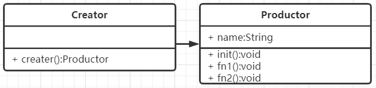
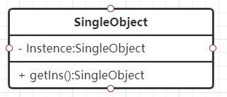
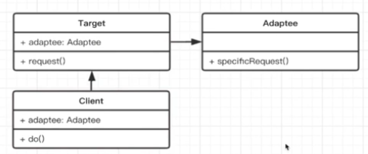
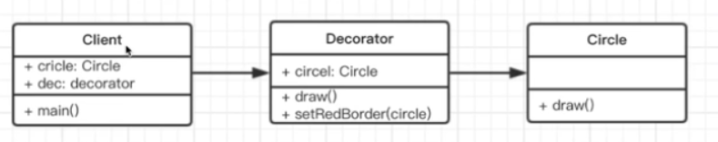
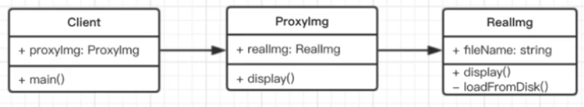
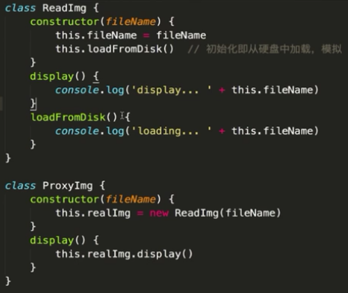

## JS设计模式

**程序执行**：一般来程序都是由顺序执行，判断和循环这几个基础的特点组成（结构化），不仅难以维护而且效率也比较低。

**面向对象**：将数据结构化，也就是将每个相关的数据和结构化包装起来形成一个对象，这种编程方式更加符合人类的思考方式，而且更加利于维护，扩展。

其实编程就是应该 **简单** + **抽象**，将各种问题抽象设计好规则，将复杂问题拆分成各种小的简单的问题；面向对象正式解决了这个问题。

## UML类图：统一建模语言

**类图**：


**关系**：

泛化：表示继承，关联：表示引用

例如有这样的关系


那么类图关系图就是


## 设计模式的设计原则

设计即按照某种思路或者标准来实现功能，功能相同可以有不同的设计方案来实现。

**设计准则**

1. 小即是美：尽量让自己的程序体积做到最小
2. 让每个程序只做好一件事：区分并明确功能，不要掺杂其他的功能，降低耦合度
3. 快速建立模型：不要一开始就是追求完美，而是应该一个一个版本慢慢完善，早点做出一个基础的模型先投入使用，然后根据使用返回继续完善。
4. 舍弃高效率而取可移植性：在高效和可移植性中优先选可移植性，增加可复用率降低开发工作量
5. 采用存文本存储数据：方便别的人能看懂你的代码，养成良好的编程习惯，增强代码可读性
6. 充分利用软件/程序的复用：减小小代码体积，降低耦合度
7. 避免强制性的用户界面
8. 让每个程序都称为过滤器：就是在程序中还可以调用其他的程序去处理数据

**小准则**

1. 允许用户定制环境：环境 / 变量 可配置
2. 尽量使核心的功能小而轻量化，按功能/作用进行拆分
3. 使用小写字母并尽量简短
4. 程序的输入可以是任意的，但是输出最好是与目标或者输入的类型一致；比如一个处理数字的程序输入的是a（string），那么输出可以是空，null，0，-1，但最好不要是"这不是一个数字"这种字符串
5. 寻求90%的解决方案，不一定需要满足所有人的需求。


**SOLID五大设计原则**

+ **S**-单一职责原则
  1. 一个程序只做好一件事
  2. 如果功能过于复杂就拆分开，每个部分保持独立
+ **O**-开放封闭原则
  1. 对扩展开放，对修改封闭
  2. 增加需求时，扩展新代码，而非修改原有代码
  3. 软件设计的终极目标
+ **L**-李氏置换原则
  1. 子类能覆盖父类
  2. 父类能出现的地方子类就能出现
+ **I**-接口独立原则
  1. 保持接口的单一独立，避免出现"胖接口"——一个接口包含所有
  2. 类似于单一职责原则，但是更关注接口
+ **D**-依赖倒致原则
  1. 面向接口编程，依赖于抽象而不依赖于具体
  2. 使用方只关注接口而不关注具体类的实现


## 设计模式的模式

设计模式分为三大类型，分别为创建型，结构型，行为型。

**创建型**

### **工厂模式**

   - 将new操作单独封装
   - 遇到new时，就要考虑是否使用工厂模式

**UML类图**：



```js
class Productor{
  constructor(name){
    this.name=name;
  }
  init(){
    console.log("init");
  }
  fn1(){
    console.log("fn1");
  }
  fn2(){
    console.log("fn2");
  }
}
```

**应用**

+ jQuery的`$("div1")`;
+ react的React.createElement()函数
+ vue的 Vue.component()的异步组件

工厂模式就是提供一个方法可以定制化地生成和返回自己想要的对象

**符合的设计原则**

+ 构造函数和创建者分离
+ 符合开发封闭原则

### **单例模式**

- 系统被唯一使用
- 一个类只有一个实例

**UML：**



```typescript
//ts方式
class SingleObject{
  private Instence:SingleObject
  constructor(){}
  public static getIns():SingleObject{
    if(!this.Instence){
      this.Instence=new SingleObject();
    }
    return this.Instence;
  }
}

//js方式
class SingleObject{
  login(){
    console.log("login...");
  }
}
SingleObject.prototype=(function(){
  let instence;
  return function(){
   if(!instence){
     instence=new SingleObject();
   }
    return instence;
  }
})()

//其实还可以使用es的Symbol或者使用随机数加上计算属性符的形式完成设置
```

如果一个类或者数据只需要被实例化一次，那么可以设计成全局只使用一个实例的单例模式，保证实例数据的唯一性和集中性

### **原型模式**

- clone自己，生成一个新对象
- 重新再创建一个新的对象开销太大，选择克隆一个会更好

```js
//一个原型对象
const prototype={
   	getName(){
        return this.first+"/"+this.last;
    },
    say(){
        alert("hello");
    }
}

//基于原型创建 x
let x=Object.create(prototype);
x.first="A";
x.last="B";
console.log(x.getName());
x.say();

//基于原型创建 y
let y=Object.create(prototype); 
y.first="C";
y.last="D";
console.log(x.getName());
y.say();
```


**结构型**

### **适配器模式**

- 旧接口格式和使用者不兼容
- 中间加一个适配转换接口

**UML**：



```js
class OldInterface(){
  oldFn(){
    return "old function"
  }
}

class newInterface(){
  constructor(){
    this.oldInter=new OldInterface();
  }
  newFn(){
    let info=this.oldInter.oldFn();
    return `${info}---> new function`
  }
}
```

就是将旧的接口中的方法或者数据拿到新的类中做转化后再输出，保证基本数据结构不变，所以是一种比较好的维护方法。但是这种方式也可以使用类的继承和方法重写特性实现。

### **装饰器模式**

- 为对象添加新功能
- 不改变其原有的结构和功能

UML类图：



```js
class Circle{
  draw(){
    console.log('画图')
  }
}
class Decorator{
  constructor(circle){
    this.circle=circle;
  }
  draw(){
    this.circle.draw();
    this.setBorderColor();
  }
  setBorderColor(){
    console.log("添加了红色边框")
  }
}
```

将一个对象的操作权限交给另外一个自己定义的类去操作，简单来说就是数据劫持。在es7中新增了装饰器，并且和ts的装饰器规范一样，当然也可以使用已有的js装饰器`core-decorators`

### **代理模式**

- 使用者无权访问目标对象
- 中间加代理，通过代理做授权和控制





将一个对象的操作权限交给另外一个自己定义的类去操作，简单来说就是数据劫持。

### **适配器模式、代理模式的区别**

+ 适配器模式：提供一个不同的的接口
+ 代理模式：提供一模一样的接口，权限不一样

### **代理模式、装饰器模式的区别**

+ 装饰器模式：扩展功能，原有功能不变且可直接使用
+ 代理模式：显示原有功能，但是经过限制或者阉割之后的

### **外观模式**

### **桥接模式**

- 用于把抽象和实现化解耦
- 使得二者可以独立变化


这里可以使用是直白点，有多少个图形直接就写多少个绘画方法


但是最好还是将抽象分离，画图和上色，


### 组合模式

- 生产树形结构，表示"整体-部分"关系
- 让整体和部分拥有同样的操作方式，相同的数据结构

例子：文档结构树，虚拟dom的vnode。


### 享元模式

- 共享内存（主要考虑内存，而非效率）
- 相同的数据，共享使用

无限下拉列表，将事件代理到高层节点上


**行为型-1**

### 策略模式

- 不同策略分开处理
- 避免出现太多的if...else 或者 switch...case


### 模板方法模式


### 观察者模式

- 发布+订阅
- 一对一、一对多


```js
//订阅者
class Observer{
    constructor(name,subject){
       this.name=name;
       this.subject=subject;
       this.subject.attach(this);
    }
    update(){
        cosole.log(`${this.name} update,state:${this.subject.getState()}`)
    }
}

//主题，保存状态，状态变化之后触发所有的观察者对象
class Subject{
    constructor(){
        this.state=0;
        this.observers=[];
    }
    getState(){
        return this.state;
    }
    setState(state){
        this.state=state;
        this.notifyAllObservers()
    }
    notifyAllObservers(){
     	this.observers.forEach(item=>{
            item.update();
        })   
    }
    attach(observer){
        this.observers.push(observer);
    }
}

let s=new Subject();
let o1=new Observer('o1',s);
let o2=new Observer('o2',s);
s.setState(1);
```

应用场景

1. 网页事件绑定
2. Promise
3. jq的回调函数
4. nodejs自定义事件
5. nodejs处理http请求；多进程通信
6. vue和react组件生命周期触发
7. vue watch
8. 迭代器模式
   - 顺序访问一个集合
   - 使用者无需知道集合的内部结构（封装）


```js
class Iterator{
    constructor(container){
        this.list=container.list;
        this.index=0;
    }
    next(){
        if(this.hasNext()){
            return this.list[this.index++];
        }
        return null
    }
    hasNext(){
        if(this.index>=this.list.length){
            return false;
        }
        return true;
    }
}
class Container{
    constructor(list){
    	this.list=list;
    }
    getIterator(){
        return new Iterator(this);
    }
}
let arr=[1,2,2];
let contianer=new Container(arr);
let interator=contianer.getIterator();
while(interator.hasNext()){
    console.log(interator.next())
}
```

有点像队列的数据结构，在es6中也已经有定义的iterator的迭代器，可以通过`[Symbol.iterator]`获取到迭代器方法，执行他将获得迭代器，但是这个迭代器只存在于有序的数据结构中，如array，map，set，nodelist等。并且也可以使用`for of`便利，其中的原理就是使用了迭代器iterator。

```js
function each(data){
    let iterator=data[Symbol.iterator]();
    let item={done:false}
    while(!item.done){
        item=iterator.next();
        if(!item.done){
            console.log(itme.value);
        }
    }
}
```


### 职责连模式

- 一步操作可能分为多个职责角色来完成
- 把这些角色都分开，然后用一个链穿起来


### 命令模式

- 发布命令的时候将发布者和执行者分开
- 发送者--（发出命令调用命令对象）-->命令对象--（接收命令）-->接收者

```js
class Receiver{
    exec(){
        console.log("执行");
    }
}
class Command{
    constructor(receiver){
        this.receiver=receiver;
    }
    cmd(){
        console.log("触发命令");
        this.receiver.exec();
    }
}
class Invoker{
   	constructor(command){
        this.command=command;
    }
    invoker(){
        console.log("触发命令");
        this.command.cmd();
    }
}

let slodier=new Receiver();//士兵
let trump=new Command(slodier);//鼓手
let general=new Invoker(trump);//将军
general.invoker();//发布命令
```


**行为型-2**

### 备忘录模式

- 随时记录一个对象的状态变化
- 随时可以恢复之前的某个状态（如撤销功能）

```js
//备忘录
class Memento{
    constructor(content){
        this.content=content
    }
    getContent(){
        return this.content;
    }
}
//备忘列表
class CareTaker{
    constructor(){
        this.list=[];
    }
    add(memento){
        this.list.push(memento);
    }
    get(index){
        return this.list[index];
    }
}
//编辑器
class Editor{
    constructor{
        this.content=null;
    }
	setContent(content){
        this.content=content;
    }
	getContent(content){
        return this.content;
    }
	saveContentToMemento(){
        return new Memento(this.content);
    }
	getContentFromMemento(memento){
        this.content=memento.getContent();
    }
}
let editor=new Editor();
let careTaker=new CareTaker();
editor.setContent("111");
careTaker.add(edito.saveContentToMemento());//备份
editor.setContent("222");
careTaker.add(edito.saveContentToMemento());//备份
editor.getContentFromMemento(careTaker.get(0));//撤销
console.log(editor.getContent());
```


### 状态模式

- 一个对象有状态变化
- 每次状态变化都会出发一个逻辑
- 不能总是用`if...else`来控制

模拟红绿灯


```js
class State{
    constructor(color){
        this.color=color;
    }
    handle(context){
        console.log(`turn to ${this.color} light`);
        context.setState(this)
    }
}
class Context{
    constructor(){
        this.state=null;
    }
    getState(){
        return this.state;
    }
    setState(state){
        this.state=state;
    }
}
let ctx=new Context();
let green=new State("green");
let red=new State("red");
green.handle(ctx);
console.log(ctx.getState())
red.handle(ctx);
console.log(ctx.getState())
```

使用的场景

1. 有限状态机，可以使用`javascript-state-machine`库
2. 简易Promise

```js
//有限状态机，收藏--取消收藏----javascript-state-machine
//安装 npm i javascript-state-machine -S

//状态机模型
var fsm=new StateMachine({
    init:'收藏',//初始化状态，待收藏，
    transitions:[
        {
            name:'doStore',//要触发的方法名
            form:'收藏',
            to:'取消收藏'
        },
        {
            name:'deleteStore',
            form:'取消收藏',
            to:'收藏'
        }//可以有多种状态变更，只要状态是对立的即可
    ],
    methods:{
        onDoStore(){//名字要 on+上面的name
            console.log("收藏成功");
            //发送请求更改后台数据;
            //更新文本
            updateTxt();
        },
        onDeleteStore(){//名字要 on+上面的name
            console.log("取消收藏成功");
            //发送请求更改后台数据;
            //更新文本
            updateTxt();
        }
    }
});

let btn=$("#btn");
btn.click(function(){
    if(fsm.is("收藏")){
        fsm.doStore();//触发doStore时，onDoStore也会触发
    }else{
        fsm.deleteStore();
    }
})

function updateTxt(){
    btn.text(fsm.state);
}

//简易Promise
//promise三种状态：pending fullfilled rejected
//pending->fullfilled/pending->rejected
//状态不可逆

//状态机模型
var fsm=new StateMachine({
    init:'pending',//初始化状态，准备状态，
    transitions:[
        {
            name:'resolve',//要触发的方法名
            form:'pending',
            to:'fullfilled'
        },
        {
            name:'reject',
            form:'pending',
            to:'rejected'
        }//可以有多种状态变更，只要状态是对立的即可
    ],
    methods:{
        //state当前状态机的实例，data-fsm.resolve(xxx) 传递的参数
        onResolve(state,data){
            data.successList.forEach(fn=>fn());
        },
        onReject(state,data){
            data.failList.forEach(fn=>fn())
        }
    }
});

class MyPromise(){
    constructor(fn){
        this.successList=[];
        this.failList=[];
        fn(function(){
            //resolve 函数
            fsm.resolve(this);
        },function(){
            //reject 函数
            fsm.reject(this);
        })
    }
    then(successFn,failFn){
        this.successList.push(successFn);
        this.failList.push(failFn);
    }
}
```

 

### 访问者模式

- 将数据操作和数据结构进行分离
- 使用场景不多

### 中介模式

- 将数据做统一化处理，类似于mvc的模式


```js
class Mediator{
    constructor(a,b){
        this.a=a;
        this.b=b;
    }
    setA(){
        let number=this.b.number;
        this.a.setNumber(number*100);
    }
    setB(){
        let number=this.a.number
        this.b.setNumber(number/100);
    }
}
class A{
    constructor(){
        this.number=0;
    }
    setNumber(num,m){
        this.number=num;
        if(m){
            m.setB()
        }
    }
}
class B{
    constructor(){
        this.number=0;
    }
    setNumber(num,m){
        this.number=num;
        if(m){
            m.setA()
        }
    }
}
let a=new A();
let b=new B();
let m=new Mediator(a,b);
a.setNumber(100,m);
console.log(a.number,b.number);
b.setNumber(100,m);
console.log(a.number,b.number);
```


1. 解释器模式
   - 描述语言语法如何定义，如何解释和编译
   - 用于专业场景

## 面试题一


画出UML图，用es6实现上面的UML类设计


```js
class Car{
    constructor(name,number){
        this.name=name;
        this.number=number;
    }
}

class KuaiChe{
    constructor(){
        this.price=1;
    }
}

class ZhuanChe{
    constructor(){
        this.price=2
    }
}

class Trip{
    constructor(car){
        this.car=car;
    }
    start(){
       	console.log(`行程开始,车名：${this.car.name},车牌号：${this.car.number}`);
    }
    end(){
        console.log(`行程结束,价钱：${this.car.price*5};`);
    }
}

let zc=new Zhuanche("桑塔纳","ST001");
let trip=new Trip(zc);
trip.start();
trip.end();
```

## **面试真题二**


```js
class Carme{
    constructor(){}
    shot(car){
        return {number:car.number,inTime:Date.now()}
    }
}
class Screen{
    constructor(){}
    show(car,inTime){
        console.log( `车牌号：${car.number},停车时长：${Date.now()-inTime}`);
    }
}
class Car{
    constructor(number){
        this.number=number;
    }
}
class Part{
    constructor(floors){
        this.floors=floors||[];
       	this.carme=new Carme();
        this.screen=new Screen();
        this.carList={};//存储摄像头拍摄到返回的车辆信息
    }
    in(car){
        //通过摄像头获取信息
        const info=this.carme.shot(car);
        //停到某个车位
        const i=parseInt(Math.random()*100%100);
        const palce=this.floors[0].places[i];
        place.in();
        info.place=place;
        //记录信息
        this.carList[car.number]=info
    }
    out(car){
        //获取信息
        const info=this.carList[car.number];
        //将停车位清空
        const place=info.place;
        place.out();
        //显示时间
        this.screen.show(car,info.inTime);
        // 清空记录
        delete this.carList[car.num];
    }
    emptyNum(){
        return this.floors.map(item=>{
            return `${item.index} 层还有${item.emptyPlaceNum()}个空位`
        }).join("\n");
    }
}
class Floor{
    constructor(index,places){
        this.index=index;
        this.places=places;
    }
    emptyPlaceNum(){
        let num=0;
        this.places.forEach(p=>{
            if(p.empty){
                num+=1;
            }
        })
        return num;
    }
}
class Place{
    constructor(){
        this.empty=true;
    }
    in(){
        this.empty=false;
    }
    out(){
        this.empty=true;
    }
}
```


## **综合应用**

使用 jquery 做一个模拟购物车的实例，将会使用到工厂模式，单例模式，装饰器模式，观察者模式，状态模式，模板方法模式，代理模式。


该购物车的实例将会有五个对象

1. App：整个程序是一个对象
2. List：商品列表是一个对象
3. Item：列表中的每个商品也是一个对象
4. Cart：购物车对象（内存中虚拟的）
5. ShoppingCart：购物车的操作对象


1. 工厂模式：$('xxx')，创建商品
2. 单例模式：购物车
3. 装饰器模式：日志
4. 观察者模式：网页事件click，Promise
5. 状态模式：添加购物车和从购物车中删除
6. 模板方法模式：init方法
7. 代理模式：打折商品的处理

