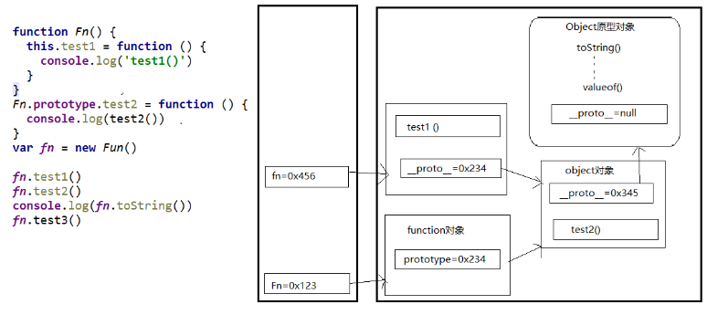
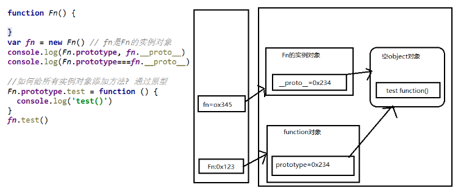
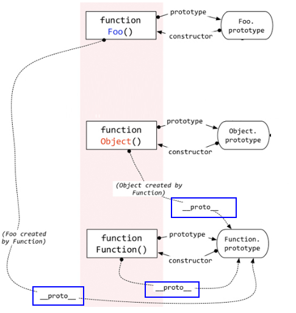
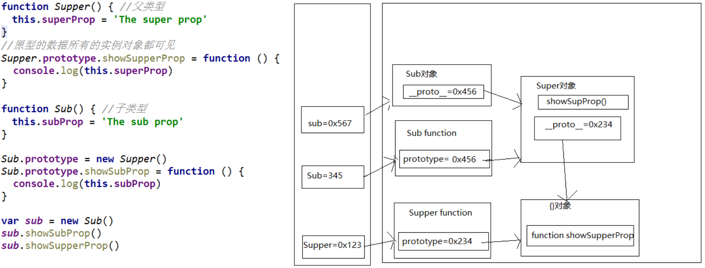
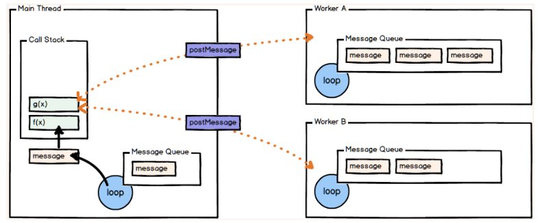

## **01_基础总结深入**

### **数据类型的分类和判断**

- 基本(值)类型

- - Number ----- 任意数值 -------- typeof
  - String ----- 任意字符串 ------ typeof
  - Boolean ---- true/false ----- typeof
  - undefined --- undefined ----- typeof/===
  - null -------- null ---------- ===

- 对象(引用)类型

- - Object ----- typeof/instanceof
  - Array ------ instanceof
  - Function ---- typeof

### **数据,变量, 内存的理解**

- 什么是数据?

- - 在内存中可读的, 可传递的保存了特定信息的'东东'
  - 一切皆数据, 函数也是数据
  - 在内存中的所有操作的目标: 数据

- 什么是变量?

- - 在程序运行过程中它的值是允许改变的量
  - 一个变量对应一块小内存, 它的值保存在此内存中  

- 什么是内存?

- - 内存条通电后产生的存储空间(临时的)
  - 一块内存包含2个方面的数据

- - - 内部存储的数据
    - 地址值数据

- - 内存空间的分类

- - - 栈空间: 全局变量和局部变量
    - 堆空间: 对象 

- 内存,数据, 变量三者之间的关系

- - 内存是容器, 用来存储不同数据
  - 变量是内存的标识, 通过变量我们可以操作(读/写)内存中的数据  

### **对象的理解和使用**

- 什么是对象?

- - 多个数据(属性)的集合
  - 用来保存多个数据(属性)的容器

- 属性组成:

- - 属性名 : 字符串(标识)
  - 属性值 : 任意类型

- 属性的分类:

- - 一般 : 属性值不是function  描述对象的状态
  - 方法 : 属性值为function的属性  描述对象的行为

- 特别的对象

- - 数组: 属性名是0,1,2,3之类的索引
  - 函数: 可以执行的

- 如何操作内部属性(方法)

- - .属性名
  - [**'属性名'**]    属性名有特殊字符/属性名是一个变量 

### **函数的理解和使用**

- 什么是函数?

- - 用来实现特定功能的, n条语句的封装体
  - 只有函数类型的数据是可以执行的, 其它的都不可以

- 为什么要用函数?

- - 提高复用性
  - 便于阅读交流

- 函数也是对象

- - instanceof Object===true
  - 函数有属性: prototype
  - 函数有方法: call()/apply()
  - 可以添加新的属性/方法

- 函数的3种不同角色

- - 一般函数 : 直接调用
  - 构造函数 : 通过new调用
  - 对象 : 通过.调用内部的属性/方法

- 函数中的this

- - 显式指定谁: obj.xxx()
  - 通过call/apply指定谁调用: xxx.call(obj)
  - 不指定谁调用: xxx()  : window
  - 回调函数: 看背后是通过谁来调用的: window/其它

- 匿名函数自调用:

(function(w, obj){

//实现代码

})(window, obj)

- - 专业术语为: IIFE (Immediately Invoked Function Expression) 立即调用函数表达式						  

- 回调函数的理解

- - 什么函数才是回调函数?

- - - 你定义的
    - 你没有调用
    - 但它最终执行了(在一定条件下或某个时刻)

- - 常用的回调函数

- - - dom事件回调函数
    - 定时器回调函数
    - ajax请求回调函数(后面讲解)
    - 生命周期回调函数(后面讲解)


## **02_函数高级**

### **原型与原型链**

- 所有函数都有一个特别的属性:

- - prototype : 显式原型属性

- 所有实例对象都有一个特别的属性:

- - __proto__ : 隐式原型属性

- 显式原型与隐式原型的关系

- - 函数的prototype: 定义函数时被自动赋值, 值默认为{}, 即用为原型对象
  - 实例对象的**proto**: 在创建实例对象时被自动添加, 并赋值为构造函数的prototype值
  - 原型对象即为当前实例对象的父对象

- 原型链

- - 所有的实例对象都有**proto**属性, 它指向的就是原型对象
  - 这样通过**proto**属性就形成了一个链的结构---->原型链
  - 当查找对象内部的属性/方法时, js引擎自动沿着这个原型链查找
  - 当给对象属性赋值时不会使用原型链, 而只是在当前对象中进行操作







### **执行上下文与执行上下文栈**

- 变量提升与函数提升

- - 变量提升: 在变量定义语句之前, 就可以访问到这个变量(undefined)
  - 函数提升: 在函数定义语句之前, 就执行该函数
  - 先有变量提升, 再有函数提升

- 理解

- - 执行上下文: 由js引擎自动创建的对象, 包含对应作用域中的所有变量属性
  - 执行上下文栈: 用来管理产生的多个执行上下文

- 分类:

- - 全局: window
  - 函数: 对程序员来说是透明的

- 生命周期

- - 全局 : 准备执行全局代码前产生, 当页面刷新/关闭页面时死亡
  - 函数 : 调用函数时产生, 函数执行完时死亡

- 包含哪些属性:

- - 全局 : 

- - - 用var定义的全局变量  ==>undefined
    - 使用function声明的函数   ===>function
    - this   ===>window

- - 函数

- - - 用var定义的局部变量  ==>undefined
    - 使用function声明的函数   ===>function
    - this   ===> 调用函数的对象, 如果没有指定就是window 
    - 形参变量   ===>对应实参值
    - arguments ===>实参列表的伪数组

- 执行上下文创建和初始化的过程

- - 全局:

- - - 在全局代码执行前最先创建一个全局执行上下文(window)
    - 收集一些全局变量, 并初始化
    - 将这些变量设置为window的属性

- - 函数:

- - - 在调用函数时, 在执行函数体之前先创建一个函数执行上下文
    - 收集一些局部变量, 并初始化
    - 将这些变量设置为执行上下文的属性

### **作用域与作用域链**

- 理解:

- - 作用域: 一块代码区域, 在编码时就确定了, 不会再变化
  - 作用域链: 多个嵌套的作用域形成的由内向外的结构, 用于查找变量

- 分类:

- - 全局
  - 函数
  - js没有块作用域(在ES6之前)

- 作用

- - 作用域: 隔离变量, 可以在不同作用域定义同名的变量不冲突
  - 作用域链: 查找变量

- 区别作用域与执行上下文

- - 作用域: 静态的, 编码时就确定了(不是在运行时), 一旦确定就不会变化了
  - 执行上下文: 动态的, 执行代码时动态创建, 当执行结束消失
  - 联系: 执行上下文环境是在对应的作用域中的

### **闭包** 

- 理解:

- - 当嵌套的内部函数引用了外部函数的变量时就产生了闭包
  - 通过chrome工具得知: 闭包本质是内部函数中的一个对象, 这个对象中包含引用的变量属性

- 作用:

- - 延长局部变量的生命周期
  - 让函数外部能操作内部的局部变量

- 写一个闭包程序

```js
function fn1() {
var a = 2;
function fn2() {
  a++;
  console.log(a);
}
return fn2;
}
var f = fn1();
f();
f();
```


- 闭包应用:

- - 模块化: 封装一些数据以及操作数据的函数, 向外暴露一些行为
  - 循环遍历加监听
  - JS框架(jQuery)大量使用了闭包

- 缺点:

- - 变量占用内存的时间可能会过长
  - 可能导致内存泄露
  - 解决:

- - - 及时释放 : f = null; //让内部函数对象成为垃圾对象

### **内存溢出与内存泄露**

1. 内存溢出

- - 一种程序运行出现的错误
  - 当程序运行需要的内存超过了剩余的内存时, 就出抛出内存溢出的错误

1. 内存泄露

- - 占用的内存没有及时释放
  - 内存泄露积累多了就容易导致内存溢出
  - 常见的内存泄露:

- - - 意外的全局变量
    - 没有及时清理的计时器或回调函数
    - 闭包


## **03_对象高级**

### **对象的创建模式**

- Object构造函数模式

```js
var obj = {};
obj.name = 'Tom'
obj.setName = function(name){this.name=name}
```


- 对象字面量模式

```js
var obj = {
name : 'Tom',
setName : function(name){this.name = name}
}
```


- 构造函数模式

```js
function Person(name, age) {
this.name = name;
this.age = age;
this.setName = function(name){this.name=name;};
}
new Person('tom', 12);
```


- 构造函数+原型的组合模式

```js
function Person(name, age) {
this.name = name;
this.age = age;
}
Person.prototype.setName = function(name){this.name=name;};
new Person('tom', 12);
```


### **继承模式**

- 原型链继承 : 得到方法



```js
function Parent(){}
Parent.prototype.test = function(){};
function Child(){}
Child.prototype = new Parent(); // 子类型的原型指向父类型实例
Child.prototype.constructor = Child
var child = new Child(); //有test()
```


- 借用构造函数 : 得到属性

```js
function Parent(xxx){this.xxx = xxx}
Parent.prototype.test = function(){};
function Child(xxx,yyy){
  Parent.call(this, xxx);//借用构造函数   this.Parent(xxx)
}
var child = new Child('a', 'b'); //child.xxx为'a', 但child没有test()
```


- 组合

```js
function Parent(xxx){this.xxx = xxx}
Parent.prototype.test = function(){};
function Child(xxx,yyy){
  Parent.call(this, xxx);//借用构造函数   this.Parent(xxx)
}
Child.prototype = new Parent(); //得到test()
var child = new Child(); //child.xxx为'a', 也有test()
```


- **new一个对象背后做了些什么?**

- - 创建一个空对象
  - 给对象设置**proto**, 值为构造函数对象的prototype属性值   this.**proto** = Fn.prototype
  - 执行构造函数体(给对象添加属性/方法)

```js
var obj=new Base();
//==============>
var obj={};
obj.__proto__=Base.prototype;
Base.call(obj);
```


## **04_线程机制与事件机制**

### **线程与进程**

- 进程:

- - 程序的一次执行, 它占有一片独有的内存空间
  - 可以通过windows任务管理器查看进程

- 线程:

- - 是进程内的一个独立执行单元
  - 是程序执行的一个完整流程
  - 是CPU的最小的调度单元

- 关系

- - 一个进程至少有一个线程(主)
  - 程序是在某个进程中的某个线程执行的

### **浏览器内核模块组成**

- 主线程

- - js引擎模块 : 负责js程序的编译与运行
  - html,css文档解析模块 : 负责页面文本的解析
  - DOM/CSS模块 : 负责dom/css在内存中的相关处理 
  - 布局和渲染模块 : 负责页面的布局和效果的绘制(内存中的对象)

- 分线程

- - 定时器模块 : 负责定时器的管理
  - DOM事件模块 : 负责事件的管理
  - 网络请求模块 : 负责Ajax请求

### **js线程**

- js是单线程执行的(回调函数也是在主线程)
- H5提出了实现多线程的方案: Web Workers
- 只能是主线程更新界面

### **定时器问题:**

- 定时器并不真正完全定时
- 如果在主线程执行了一个长时间的操作, 可能导致延时才处理

### **事件处理机制(图)**

- 代码分类

- - 初始化执行代码: 包含绑定dom事件监听, 设置定时器, 发送ajax请求的代码
  - 回调执行代码: 处理回调逻辑

- js引擎执行代码的基本流程: 

- - 初始化代码===>回调代码

- 模型的2个重要组成部分:

- - 事件管理模块
  - 回调队列

- 模型的运转流程

- - 执行初始化代码, 将事件回调函数交给对应模块管理
  - 当事件发生时, 管理模块会将回调函数及其数据添加到回调列队中
  - 只有当初始化代码执行完后(可能要一定时间), 才会遍历读取回调队列中的回调函数执行


### **H5 Web Workers**

- 可以让js在分线程执行
- Worker

```js
var worker = new Worker('worker.js');
worker.onMessage = function(event){event.data} : 用来接收另一个线程发送过来的数据的回调
worker.postMessage(data1) : 向另一个线程发送数据
```


- 问题:

- - worker内代码不能操作DOM更新UI
  - 不是每个浏览器都支持这个新特性
  - 不能跨域加载JS

- svn版本控制
- svn server




