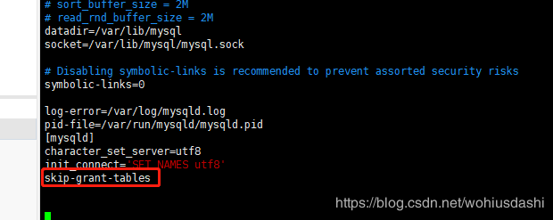
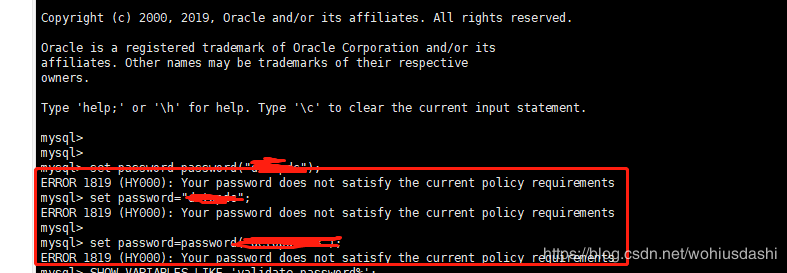
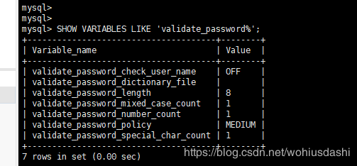

# centos系统安装图形化界面

1. 开启系统，以root身份进入

2. 安装X(X Window System)

   ```shell
   yum groupinstall "X Window System"
   ```

3. 安装GNOME(GNOME Desktop)

   ```shell
   yum groupinstall "GNOME Desktop"
   ```

4. 进入图形化界面

   ```shell
   startx
   ```


## 开机启动图形化界面

1. 首先使用ctrl+alt+f2切换到命令行模式，如果本身就是命令行模式就直接看下面的步骤

2. 查看当前开机启动模式

   ```shell
   systemctl get-default
   
   #graphical.target代表开机时启动图形化界面
   #multi-user.target代表开机时启动dos界面
   ```

3. 最后输入如下命令设置开机启动图形界面

   ```shell
   #开机启动图形界面
   systemctl set-default graphical.target 
   
   #如果想开机启动dos界面
   systemctl set-default multi-user.target 
   ```


## dos界面与图形化界面切换快捷键

图形到dos：ctrl+alt+f2
dos到图形：输入startx
或者
在命令上输入 init 3 命令 切换到dos界面
输入 init 5命令 切换到图形界面


# 安装nodejs

1. 安装wget文件下载工具

   ```shell
   yum install -y wget
   ```

2. 在下载页面https://nodejs.org/en/download/中找到下载地址，下载nodejs最新的bin包

   ```shell
   wget https://npm.taobao.org/mirrors/node/v11.0.0/node-v11.0.0.tar.gz
   ```

   也可以在其他系统上下载好之后上传到服务器

   

3. 解压包

   ```shell
   xz -d node-v9.3.0-linux-x64.tar.xz
   tar -xf node-v9.3.0-linux-x64.tar
   ```

4. 让npm和node命令全局生效

   方式一：环境变量方式（这种方式似乎只对登录用户有效？）

   　　1）、加入环境变量，在 /etc/profile 文件末尾增加配置

   ```
   vi /ect/profileexport PATH=$PATH:/usr/local/nodejs/bin
   ```

   　　2）、执行命令使配置文件生效

   ```
   source /etc/profile
   ```

   　　方式二：软链接方式（推荐）

   ```
   ln -s /usr/local/nodejs/bin/npm /usr/local/bin/
   ln -s /usr/local/nodejs/bin/node /usr/local/bin/
   ```


# 安装mysql

### **一、安装YUM Repo**

**1、由于CentOS 的yum源中没有mysql，需要到mysql的官网下载yum repo配置文件。**
**下载命令：**

```shell
wget https://dev.mysql.com/get/mysql57-community-release-el7-9.noarch.rpm
```


**2、然后进行repo的安装：**

```shell
rpm -ivh mysql57-community-release-el7-9.noarch.rpm
```

执行完成后会在/etc/yum.repos.d/目录下生成两个repo文件mysql-community.repo mysql-community-source.repo

### 二、使用yum命令即可完成安装

***注意：必须进入到 /etc/yum.repos.d/目录后再执行以下脚本***

**1、安装命令：**
`yum install mysql-server`

**2、启动msyql：**
`systemctl start mysqld #启动MySQL`

**3、获取安装时的临时密码（在第一次登录时就是用这个密码）：**
`grep 'temporary password' /var/log/mysqld.log`

**4、倘若没有获取临时密码，则**
**4.1、删除原来安装过的mysql残留的数据**

`rm -rf /var/lib/mysql`

**4.2.再启动mysql**

`systemctl start mysqld #启动MySQL`

### 三、登录：

**1、方式一（已验证）：**
`mysql -u root -p`

然后输入密码（刚刚获取的临时密码）

**2、方式二（未验证）：**
进入mysql数据库

```shell
mysql -uroot -proot   <uroot是用户名，proot是密码>
如：
root@test:/home# mysql -root -XXXX
```

**3、若登录不了，则进行以下配置，跳过登录验证**
**3.1、重置密码的第一步就是跳过MySQL的密码认证过程，方法如下：**

**3.2、vim /etc/my.cnf(注：windows下修改的是my.ini)**

在文档内搜索mysqld定位到[mysqld]文本段：

/mysqld(在vim编辑状态下直接输入该命令可搜索文本内容)

在[mysqld]后面任意一行添加“skip-grant-tables”用来跳过密码验证的过程，如下图所示：



**3.3、保存文档并退出：**

```shell
:wq
```

**3.4、接下来我们需要重启MySQL：**

### 四、登录成功后修改密码

**1、注意：这里会进行密码强度校验（密码设置时必须包含大小写字母、特殊符号、数字，并且长度大于8位）**
**2、如不满足以上条件则会报错，如下图：**



密码策略问题异常信息：

ERROR 1819 (HY000): Your password does not satisfy the current policy requirements

 

**3、解决办法：**
**3.1、查看 mysql 初始的密码策略，**

输入语句`SHOW VARIABLES LIKE 'validate_password%';`进行查看，

如下图：



**3.2、首先需要设置密码的验证强度等级，设置 validate_password_policy 的全局参数为 LOW 即可，**

输入设值语句 ` set global validate_password_policy=LOW;`进行设值，

**3.3、当前密码长度为 8 ，如果不介意的话就不用修改了，按照通用的来讲，设置为 6 位的密码，设置 validate_password_length 的全局参数为 6 即可，**

输入设值语句 “ set global validate_password_length=6; ” 进行设值，

**3.4、现在可以为 mysql 设置简单密码了，只要满足六位的长度即可，**

输入修改语句 `ALTER USER 'root'@'localhost' IDENTIFIED BY '123456';` 可以看到修改成功，表示密码策略修改成功了！！！

**3.5、注：在默认密码的长度最小值为 4 ，由 大/小写字母各一个 + 阿拉伯数字一个 + 特殊字符一个，**

只要设置密码的长度小于 3 ，都将自动设值为 4 ，

**3.6、关于 mysql 密码策略相关参数；**

1）、validate_password_length  固定密码的总长度；

2）、validate_password_dictionary_file 指定密码验证的文件路径；

3）、validate_password_mixed_case_count  整个密码中至少要包含大/小写字母的总个数；

4）、validate_password_number_count  整个密码中至少要包含阿拉伯数字的个数；

5）、validate_password_policy 指定密码的强度验证等级，默认为 MEDIUM；

关于 validate_password_policy 的取值：

LOW：只验证长度；

1/MEDIUM：验证长度、数字、大小写、特殊字符；

2/STRONG：验证长度、数字、大小写、特殊字符、字典文件；

6）、validate_password_special_char_count 整个密码中至少要包含特殊字符的个数；

 

### 五、修改密码

**1、方式一（已验证）：**
`ALTER USER 'root'@'localhost' IDENTIFIED BY '@abcd123456'; `

**2、方式二（未验证）**
`set password=password("yourpassword"); `

### 六、开启远程控制

MySQL默认是没有开启远程控制的，必须添加远程访问的用户，即默认是只能自己访问，别的机器是访问不了的。

**1、方式一（已验证）：**
　   **1.1、连接服务器: `mysql -u root -p`**

　　**1.2、看当前所有数据库：`show databases`;**

　　**1.3、进入mysql数据库：`use mysql`;**

　　**1.4、查看mysql数据库中所有的表：`show tables`;**

　　**1.5、查看user表中的数据：`select Host, User,Password from user;`**

　　**1.6、修改user表中的Host:  ` update user set Host='%' where User='root';`**  

                说明： % 代表任意的客户端,可替换成具体IP地址。

　　**1.7、最后刷新一下：`flush privileges;`**

       1.8、注意：一定要记得在写sql的时候要在语句完成后加上" ; "

**2、方式二（未验证）：**
**1、使用 grant 命令**
`grant all privileges on 数据库名.表名 to 创建的用户名(root)@"%" identified by "密码";`

**2、格式说明：**
数据库名.表名 如果写成*.*代表授权所有的数据库 flush privileges; #刷新刚才的内容

如：

`grant all privileges on *.* to root@"113.123.123.1" identified by "123456789";`

@ 后面是访问mysql的客户端IP地址（或是 主机名） % 代表任意的客户端，如果填写 localhost 为本地访问（那此用户就不能远程访问该mysql数据库了）

###  七、其他配置

1、设置安全选项：
`mysql_secure_installation`

2、关闭MySQL
`systemctl stop mysqld `

3、重启MySQL
`systemctl restart mysqld `

4、查看MySQL运行状态
`systemctl status mysqld `

5、设置开机启动
`systemctl enable mysqld `

6、关闭开机启动
`systemctl disable mysqld `

7、配置默认编码为utf8：
vi /etc/my.cnf #添加 [mysqld] character_set_server=utf8 init_connect='SET NAMES utf8'

其他默认配置文件路径： 

配置文件：/etc/my.cnf 日志文件：/var/log//var/log/mysqld.log 服务启动脚本：/usr/lib/systemd/system/mysqld.service socket文件：/var/run/mysqld/mysqld.pid

8、查看版本
`select version();`


转载自：[CentOS7下安装mysql5.7](https://blog.csdn.net/wohiusdashi/article/details/89358071)

# 安装git

1. 安装git：`yum install git `

2. 查看yum源仓库Git信息：`yum info git`

3. 安装依赖库：

   ```shell
   yum install curl-devel expat-devel gettext-devel openssl-devel zlib-devel
   yum install gcc-c++ perl-ExtUtils-MakeMaker
   ```

4. 查看git版本`git  --version`，如果默认安装的版本过低，移除默认安装的git:`yum remove git`

   

   

**查看端口使用情况**

```shell
netstat -nap #会列出所有正在使用的端口及关联的进程/应用
netstat -lnp|grep 5000 #查看指定端口

kill -9 28533 #28533是进程编号 ，-9是强制关闭，不写是普通关闭
```


# 修改终端下的语言

[Ubuntu修改终端下的语言（中文或英文）](https://blog.csdn.net/BobYuan888/article/details/88662779)


# linux命令手册

https://www.linuxcool.com/

# 常用的linux命令

## 关机/重启/注销

| 常用命令          | 作用                     |
| ----------------- | ------------------------ |
| shutdown -h now   | 即刻关机                 |
| shutdown -h 10    | 10分钟后关机             |
| shutdown -h 11:00 | 11：00关机               |
| shutdown -h +10   | 预定时间关机（10分钟后） |
| shutdown -c       | 取消指定时间关机         |
| shutdown -r now   | 重启                     |
| shutdown -r 10    | 10分钟之后重启           |
| shutdown -r 11:00 | 定时重启                 |
| reboot            | 重启                     |
| init 6            | 重启                     |
| init 0            | ⽴刻关机                 |
| telinit 0         | 关机                     |
| poweroff          | ⽴刻关机                 |
| halt              | 关机                     |
| sync              | buff数据同步到磁盘       |
| logout            | 退出登录Shell            |

## 系统信息和性能查看

| 常用命令                    | 作用                               |
| --------------------------- | ---------------------------------- |
| uname -a                    | 查看内核/OS/CPU信息                |
| uname -r                    | 查看内核版本                       |
| uname -m                    | 查看处理器架构                     |
| arch                        | 查看处理器架构                     |
| hostname                    | 查看计算机名                       |
| who                         | 显示当前登录系统的⽤户             |
| who am i                    | 显示登录时的⽤户名                 |
| whoami                      | 显示当前⽤户名                     |
| cat /proc/version           | 查看linux版本信息                  |
| cat /proc/cpuinfo           | 查看CPU信息                        |
| cat /proc/interrupts        | 查看中断                           |
| cat /proc/loadavg           | 查看系统负载                       |
| uptime                      | 查看系统运⾏时间、⽤户数、负载     |
| env                         | 查看系统的环境变量                 |
| lsusb -tv                   | 查看系统USB设备信息                |
| lspci -tv                   | 查看系统PCI设备信息                |
| lsmod                       | 查看已加载的系统模块               |
| grep MemTotal /proc/meminfo | 查看内存总量                       |
| grep MemFree /proc/meminfo  | 查看空闲内存量                     |
| free -m                     | 查看内存⽤量和交换区⽤量           |
| date                        | 显示系统⽇期时间                   |
| cal 2021                    | 显示2021⽇历表                     |
| top                         | 动态显示cpu/内存/进程等情况        |
| vmstat 1 20                 | 每1秒采⼀次系统状态，采20次        |
| iostat                      | 查看io读写/cpu使⽤情况             |
| 查看io读写/cpu使⽤情况      | 查询cpu使⽤情况（1秒⼀次，共10次） |
| sar -d 1 10                 | 查询磁盘性能                       |

## 磁盘和分区

| 常用命令                            | 作用                           |
| ----------------------------------- | ------------------------------ |
| fdisk -l                            | 查看所有磁盘分区               |
| swapon -s                           | 查看所有交换分区               |
| df -h                               | 查看磁盘使⽤情况及挂载点       |
| df -hl                              | 同上                           |
| du -sh /dir                         | 查看指定某个⽬录的⼤⼩         |
| du -sk * \| sort -rn                | 从⾼到低依次显示⽂件和⽬录⼤⼩ |
| mount /dev/hda2 /mnt/hda2           | 挂载hda2盘                     |
| mount -t ntfs /dev/sdc1 /mnt/usbhd1 | 指定⽂件系统类型挂载（如ntfs） |
| mount -o loop xxx.iso /mnt/cdrom    | 挂 载 iso ⽂ 件                |
| umount -v /dev/sda1                 | 通过设备名卸载                 |
| umount -v /mnt/mymnt                | 通过挂载点卸载                 |
| fuser -km /mnt/hda1                 | 强制卸载(慎⽤)                 |

## ⽤户和⽤户组

| 常用命令                                              | 作用                                           |
| ----------------------------------------------------- | ---------------------------------------------- |
| useradd codesheep                                     | 创建⽤户                                       |
| userdel -r codesheep                                  | 删除⽤户                                       |
| usermod -g group_name user_name                       | 修改⽤户的组                                   |
| usermod -aG group_name user_name                      | 将⽤户添加到组                                 |
| usermod -s /bin/ksh -d /home/codepig –g dev codesheep | 修改⽤户codesheep的登录Shell、主⽬录以及⽤户组 |
| groups test                                           | 查看test⽤户所在的组                           |
| groupadd group_name                                   | 创建⽤户组                                     |
| groupdel group_name                                   | 删除⽤户组                                     |
| groupmod -n new_name old_name                         | 重命名⽤户组                                   |
| su - user_name                                        | su - user_name                                 |
| passwd                                                | 修改⼝令                                       |
| passwd codesheep                                      | 修改某⽤户的⼝令                               |
| w                                                     | 查看活动⽤户                                   |
| id codesheep                                          | 查看指定⽤户codesheep信息                      |
| last                                                  | 查看⽤户登录⽇志                               |
| crontab -l                                            | 查看当前⽤户的计划任务                         |
| cut -d: -f1 /etc/passwd                               | 查看系统所有⽤户                               |
| cut -d: -f1 /etc/group                                | 查看系统所有组                                 |

## 防火墙设置

| 常用命令                                                     | 作用                 |
| ------------------------------------------------------------ | -------------------- |
| firewall-cmd --state  或者  systemctl [status](https://so.csdn.net/so/search?q=status&spm=1001.2101.3001.7020) firewalld | 查看防火墙状态       |
| systemctl start firewalld  或者：systemctl start firewalld.service | 打开防火墙           |
| systemctl stop firewalld 或者：systemctl stop firewalld.service | 关闭防火墙           |
| systemctl enable firewalld.service                           | 开机启动             |
| systemctl disable firewalld.service                          | 禁止防火墙开机启动   |
| service iptables restart                                     | 重启防火墙           |
| firewall-cmd --zone=public --list-ports 或者 firewall-cmd --list-all | 查看防火墙开放的端口 |
| firewall-cmd --zone=public --add-port=22122/tcp --permanent  | 开放 22122 端口      |      

## ⽹络和进程管理

| 常用命令                                                     | 作用                                 |
| ------------------------------------------------------------ | ------------------------------------ |
| ifconfig                                                     | 查看⽹络接⼝属性                     |
| ifconfig eth0                                                | 查看某⽹卡的配置                     |
| route -n                                                     | 查看路由表                           |
| netstat -lntp                                                | 查看所有监听端⼝                     |
| netstat -antp                                                | 查看已经建⽴的TCP连接                |
| netstat -lutp                                                | 查看TCP/UDP的状态信息                |
| ifup eth0                                                    | 启⽤eth0⽹络设备                     |
| ifdown eth0                                                  | 禁⽤eth0⽹络设备                     |
| iptables -L                                                  | 查看iptables规则                     |
| ifconfig eth0 192.168.1.1 netmask 255.255.255.0              | 配置ip地址                           |
| dhclient eth0                                                | 以dhcp模式启⽤eth0                   |
| route add -net 0/0 gw Gateway_IP                             | 配置默认⽹关                         |
| route add -net 192.168.0.0 netmask 255.255.0.0 gw 192.168.1.1 | 配置静态路由到达⽹络'192.168.0.0/16' |
| route del 0/0 gw Gateway_IP                                  | 删除静态路由                         |
| hostname                                                     | 查看主机名                           |
| host [www.baidu.com](http://www.baidu.com)                   | 解析主机名                           |
| nslookup [www.baidu.com](http://www.baidu.com)               | 查询DNS记录，查看域名解析是否正常    |
| ps -ef                                                       | 查看所有进程                         |
| ps -ef \| grep codesheep                                     | 过滤出你需要的进程                   |
| kill -s name                                                 | kill指定名称的进程                   |
| kill -s pid                                                  | kill指定pid的进程                    |
| top                                                          | 实时显示进程状态                     |
| vmstat 1 20                                                  | 每1秒采⼀次系统状态，采20次          |
| iostat                                                       | iostat                               |
| sar -u 1 10                                                  | 查询cpu使⽤情况（1秒⼀次，共10次）   |
| sar -d 1 10                                                  | 查询磁盘性能                         |

## 常⻅系统服务命令

| 常用命令                   | 作用         |
| -------------------------- | ------------ |
| chkconfig --list           | 列出系统服务 |
| service <服务名> status    | 查看某个服务 |
| service <服务名> start     | 启动某个服务 |
| service <服务名> stop      | 终⽌某个服务 |
| service <服务名> restart   | 重启某个服务 |
| systemctl status <服务名>  | 查看某个服务 |
| systemctl start <服务名>   | 启动某个服务 |
| systemctl stop <服务名>    | 终⽌某个服务 |
| systemctl restart <服务名> | 重启某个服务 |
| systemctl enable <服务名>  | 关闭⾃启动   |
| systemctl disable <服务名> | 关闭⾃启动   |

## ⽂件和⽬录操作

| 常用命令                 | 作用                                                         |
| ------------------------ | ------------------------------------------------------------ |
| cd <⽬录名>              | 进⼊某个⽬录                                                 |
| cd ..                    | 回上级⽬录                                                   |
| cd ../..                 | 回上两级⽬录                                                 |
| cd                       | 进个⼈主⽬录                                                 |
| cd -                     | 回上⼀步所在⽬录                                             |
| pwd                      | 显示当前路径                                                 |
| ls                       | 查看⽂件⽬录列表                                             |
| ls -F                    | 查看⽬录中内容（显示是⽂件还是⽬录）                         |
| ls -l                    | 查看⽂件和⽬录的详情列表                                     |
| ls -a                    | 查看隐藏⽂件                                                 |
| ls -lh                   | 查看⽂件和⽬录的详情列表（增强⽂件⼤⼩易读性）               |
| ls -lSr                  | 查看⽂件和⽬录列表（以⽂件⼤⼩升序查看）                     |
| tree                     | 查看⽂件和⽬录的树形结构                                     |
| mkdir <⽬录名>           | 创建⽬录                                                     |
| mkdir dir1 dir2          | 同时创建两个⽬录                                             |
| mkdir -p /tmp/dir1/dir2  | 创建⽬录树                                                   |
| rm -f file1              | 删除'file1'⽂件                                              |
| rmdir dir1               | 删除'dir1'⽬录                                               |
| rm -rf dir1              | 删除'dir1'⽬录和其内容                                       |
| rm -rf dir1 dir2         | 同时删除两个⽬录及其内容                                     |
| mv old_dir new_dir       | 重命名/移动⽬录                                              |
| cp file1 file2           | 复制⽂件                                                     |
| cp dir/* .               | 复制某⽬录下的所有⽂件⾄当前⽬录                             |
| cp -a dir1 dir2          | 复制⽬录                                                     |
| cp -a /tmp/dir1 .        | 复制⼀个⽬录⾄当前⽬录                                       |
| ln -s file1 link1        | 创建指向⽂件/⽬录的软链接                                    |
| ln file1 lnk1            | 创建指向⽂件/⽬录的物理链接                                  |
| find / -name file1       | 从跟⽬录开始搜索⽂件/⽬录                                    |
| find / -user user1       | 搜索⽤户user1的⽂件/⽬录                                     |
| find /dir -name *.bin    | 在⽬录/dir中搜带有.bin后缀的⽂件                             |
| locate <关键词>          | 快速定位⽂件                                                 |
| locate *.mp4             | 寻找.mp4结尾的⽂件                                           |
| whereis <关键词>         | 显示某⼆进制⽂件/可执⾏⽂件的路径                            |
| which <关键词>           | 查找系统⽬录下某的⼆进制⽂件                                 |
| chmod ugo+rwx dir1       | 设置⽬录所有者(u)、群组(g)及其他⼈(o)的读（r）写(w)执⾏(x)权限 |
| chmod go-rwx dir1        | 移除群组(g)与其他⼈(o)对⽬录的读写执⾏权限                   |
| chown user1 file1        | 改变⽂件的所有者属性                                         |
| chown -R user1 dir1      | 改变⽬录的所有者属性                                         |
| chgrp group1 file1       | 改变⽂件群组                                                 |
| chown user1:group1 file1 | 改变⽂件的所有⼈和群组                                       |

## ⽂件查看和处理

| 常用命令                      | 作用                                    |
| ----------------------------- | --------------------------------------- |
| cat file1                     | 查看⽂件内容                            |
| cat -n file1                  | 查看内容并标示⾏数                      |
| tac file1                     | 从最后⼀⾏开始反看⽂件内容              |
| more file1                    | more file1                              |
| less file1                    | 类似more命令，但允许反向操作            |
| head -2 file1                 | 查看⽂件前两⾏                          |
| tail -2 file1                 | 查看⽂件后两⾏                          |
| tail -f /log/msg              | 实时查看添加到⽂件中的内容              |
| grep codesheep hello.txt      | 在⽂件hello.txt中查找关键词codesheep    |
| grep ^sheep hello.txt         | 在⽂件hello.txt中查找以sheep开头的内容  |
| grep [0-9] hello.txt          | 选择hello.txt⽂件中所有包含数字的⾏     |
| sed 's/s1/s2/g' hello.txt     | 将hello.txt⽂件中的s1替换成s2           |
| sed '/^$/d' hello.txt         | 从hello.txt⽂件中删除所有空⽩⾏         |
| sed '/ *#/d; /^$/d' hello.txt | 从hello.txt⽂件中删除所有注释和空⽩⾏   |
| sed -e '1d' hello.txt         | 从⽂件hello.txt 中排除第⼀⾏            |
| sed -n '/s1/p' hello.txt      | 查看只包含关键词"s1"的⾏                |
| sed -e 's/ *$//' hello.txt    | 删除每⼀⾏最后的空⽩字符                |
| sed -e 's/s1//g' hello.txt    | 从⽂档中只删除词汇s1并保留剩余全部      |
| sed -n '1,5p;5q' hello.txt    | 查看从第⼀⾏到第5⾏内容                 |
| sed -n '5p;5q' hello.txt      | 查看第5⾏                               |
| paste file1 file2             | 合并两个⽂件或两栏的内容                |
| paste -d '+' file1 file2      | 合并两个⽂件或两栏的内容，中间⽤"+"区分 |
| sort file1 file2              | 排序两个⽂件的内容                      |
| comm -1 file1 file2           | ⽐较两个⽂件的内容(去除'file1'所含内容) |
| comm -2 file1 file2           | ⽐较两个⽂件的内容(去除'file2'所含内容  |
| comm -3 file1 file2           | ⽐较两个⽂件的内容(去除两⽂件共有部分)  |

## 打包和解压

| 常用命令                          | 作用                     |
| --------------------------------- | ------------------------ |
| zip xxx.zip file                  | 压缩⾄zip包              |
| zip -r xxx.zip file1 file2 dir1   | 将多个⽂件+⽬录压成zip包 |
| unzip xxx.zip                     | 解压zip包                |
| tar -cvf xxx.tar file             | 创建⾮压缩tar包          |
| tar -cvf xxx.tar file1 file2 dir1 | 将多个⽂件+⽬录打tar包   |
| tar -tf xxx.tar                   | 查看tar包的内容          |
| tar -xvf xxx.tar                  | 解压tar包                |
| tar -xvf xxx.tar -C /dir          | 将tar包解压⾄指定⽬录    |
| tar -cvfj xxx.tar.bz2 dir         | 创建bz2压缩包            |
| tar -jxvf xxx.tar.bz2             | 解压bz2压缩包            |
| tar -cvfz xxx.tar.gz dir          | 创建gzip压缩包           |
| tar -zxvf xxx.tar.gz              | 解压gzip压缩包           |
| bunzip2 xxx.bz2                   | 解压bz2压缩包            |
| bzip2 filename                    | 压缩⽂件                 |
| gunzip xxx.gz                     | 解压gzip压缩包           |
| gzip filename                     | 压缩⽂件                 |
| gzip -9 filename                  | 最⼤程度压缩             |

## RPM包管理命令

| 常用命令                  | 作用                          |
| ------------------------- | ----------------------------- |
| rpm -qa                   | 查看已安装的rpm包             |
| rpm -q pkg_name           | 查询某个rpm包                 |
| rpm -q --whatprovides xxx | 显示xxx功能是由哪个包提供的   |
| rpm -q --whatrequires xxx | 显示xxx功能被哪个程序包依赖的 |
| rpm -q --changelog xxx    | 显示xxx包的更改记录           |
| rpm -qi pkg_name          | 查看⼀个包的详细信息          |
| rpm -qd pkg_name          | 查询⼀个包所提供的⽂档        |
| rpm -qc pkg_name          | 查看已安装rpm包提供的配置⽂件 |
| rpm -ql pkg_name          | 查看⼀个包安装了哪些⽂件      |
| rpm -qf filename          | 查看某个⽂件属于哪个包        |
| rpm -qR pkg_name          | 查询包的依赖关系              |
| rpm -ivh xxx.rpm          | 安装rpm包                     |
| rpm -ivh --test xxx.rpm   | 测试安装rpm包                 |
| rpm -ivh --nodeps xxx.rpm | 安装rpm包时忽略依赖关系       |
| rpm -e xxx                | 卸载程序包                    |
| rpm -Fvh pkg_name         | 升级确定已安装的rpm包         |
| rpm -Uvh pkg_name         | 升级rpm包(若未安装则会安装)   |
| rpm -V pkg_name           | RPM包详细信息校验             |

## YUM包管理命令

| 常用命令                            | 作用                 |
| ----------------------------------- | -------------------- |
| yum repolist enabled                | 显示可⽤的源仓库     |
| yum search pkg_name                 | 搜索软件包           |
| yum install pkg_name                | 下载并安装软件包     |
| yum install --downloadonly pkg_name | 只 下 载 不 安 装    |
| yum list                            | 显示所有程序包       |
| yum list installed                  | 查看当前系统已安装包 |
| yum list updates                    | 查看可以更新的包列表 |
| yum check-update                    | 查看可升级的软件包   |
| yum update                          | 更新所有软件包       |
| yum update pkg_name                 | 升级指定软件包       |
| yum deplist pkg_name                | 列出软件包依赖关系   |
| yum remove pkg_name                 | 删除软件包           |
| yum clean all                       | 清除缓存             |
| yum clean packages                  | 清除缓存的软件包     |
| yum clean headers                   | 清除缓存的header     |

## DPKG包管理命令

| 常用命令             | 作用                  |
| -------------------- | --------------------- |
| dpkg -c xxx.deb      | 列出deb包的内容       |
| dpkg -i xxx.deb      | 安装/更新deb包        |
| dpkg -r pkg_name     | 移除deb包             |
| dpkg -P pkg_name     | 移除deb包(不保留配置) |
| dpkg -l              | 查看系统中已安装deb包 |
| dpkg -l pkg_name     | 显示包的⼤致信息      |
| dpkg -L pkg_name     | 查看deb包安装的⽂件   |
| dpkg -s pkg_name     | 查看包的详细信息      |
| dpkg –unpack xxx.deb | 解开deb包的内容       |

## APT软件⼯具

| 常用命令                  | 作用                   |
| ------------------------- | ---------------------- |
| apt-cache search pkg_name | 搜索程序包             |
| apt-cache show pkg_name   | 获取包的概览信息       |
| apt-get install pkg_name  | 安装/升级软件包        |
| apt-get purge pkg_name    | 卸载软件（包括配置）   |
| apt-get remove pkg_name   | 卸载软件（不包括配置） |
| apt-get update            | 更新包索引信息         |
| apt-get upgrade           | 更新已安装软件包       |
| apt-get clean             | 清理缓存               |


来源于[codeSheep](https://www.bilibili.com/video/BV14A411378a?from=search&seid=12265500814265802144)