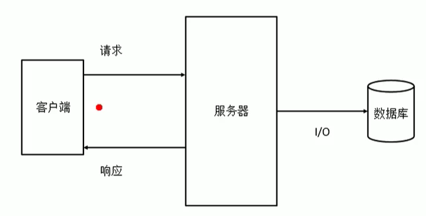

# Nodejs

> Node.js 是一个开源与跨平台的 JavaScript 运行时环境。 它是一个可用于几乎任何项目的流行工具！
>
> Node.js 在浏览器外运行 V8 JavaScript 引擎（Google Chrome 的内核）。 这使 Node.js 表现得非常出色。
>
> Node.js 应用程序运行于单个进程中，无需为每个请求创建新的线程。 Node.js 在其标准库中提供了一组异步的 I/O 原生功能（用以防止 JavaScript 代码被阻塞），并且 Node.js 中的库通常是使用非阻塞的范式编写的（从而使阻塞行为成为例外而不是规范）。
>
> 当 Node.js 执行 I/O 操作时（例如从网络读取、访问数据库或文件系统），Node.js 会在响应返回时恢复操作，而不是阻塞线程并浪费 CPU 循环等待。
>
> nodejs 特点
>
> + 事件驱动
> + 非阻塞 I/O
> + 轻量且高效
>
> **非阻塞 I / O**
>
> 在传统的服务器中，每当有一个请求过来的时候服务器就会开启一个新的线程用于处理这个请求，当有一百个请求过来的时候就会开启一百个线程，这一百个请求都是等待 I / O 处理完成之后才会被关闭，这样线程满后就和容易因为 I / O 处理慢导致请求阻塞，从而浪费聚到的计算资源，这样传统的服务器对硬件的要求比较高的原因。而 nodejs 由于单线程以及异步处理方法的优势，从而使得整个进程都会只使用一个线程，每有一个新请求过来的时候就使用异步方式处理（I / O线程池），当 I/O 处理完成后异步返回，这样就不会阻塞掉其他的请求。
>
> 

## Nodejs应用

nodejs 运行于 V8 的 JavaScript  引擎中，javaScript 由此成为了一门全栈式语言，既可以用来开发前端应用程序，也可以用于开发后端服务器。虽然 javaScript 很强大，但是一般在 nodejs 并不会用于开大大型项目的服务器，具体原因可能是因为效率问题，以及单线程无法处理过多的请求，和 java 等解释型语言对比，效率还是比较低的，而且java 的生态更加齐全，可以轻松实现微服务和分布式系统。目前在 nodejs 更多是用于开发一些工具如，webpack 、scss、less等。

在一些比较大型的项目中nodejs一般作为后端的中间层使用，我们通常说前端是负责用户界面的，后端负责提供数据和业务接口，现在可以使用nodejs 在前后端之间加一个中间层用来处理请求的分配以及视图的生成。


客户端直接请求到中间层的 node 服务，node 服务分析请求是需要哪个页面，再去请求对应数据，拿到数据后和模板结合成用户看到的页面，再返回给客户端。

使用中间层的优点：

1. 减轻客户端内存，项目用户体验好，不会像mvvm模式的项目把页面渲染和数据请求都交给客户端，而是在服务端完成
2. SEO 性好，不想mvvm模式页面由js 生成，而是在服务端渲染好html字节，有利于网页被搜索到
3. 保持了前后端分离的特点
4. 前端可以操控的范围增多，甚至可以做服务器、数据层面的优化，比如中间层常常用 nginx，redis来优化项目应对高并发。

javascript 是一门单线程的语言，即使是 nodejs 也是如此，因为 javascript 本来就是被设计成这样的（webworker 可以开启多线程，但是在 worker 中不能使用 UI 相关数据如DOM，但是可能会在nodejs中发挥巨大作用）


## 进程、线程

### 进程

+ 进程负责为程序的运行提供必备的环境
+ 进程就相当于工厂中的车间

> 在node 中可以使用`process.exit()`退出进程

### 线程

+ 线程，计算机中的最小计算单位，线程负责执行进程中的程序
+ 线程就相当于工厂中的工人


## nodejs中的事件循环


nodejs 中是事件循环如上图所示，大致可以分为 五个阶段 ：`timer 定时器阶段`、`I/O 回调阶段`、`poll获取新I/O事件 `、`check 阶段`、`close 关闭会话回调阶段`。

需要注意的是在每个阶段中的队列被清空之后会先检查`nextTick`队列和微任务队列，然后再继续下一个阶段。

**参考**：

[setTimeout和setImmediate到底谁先执行，本文让你彻底理解Event Loop](https://blog.csdn.net/dennis_jiang/article/details/105044361)

[详解nodejs中的事件循环机制](https://m.php.cn/article/475232.html)


## Nodejs使用的模块规范

nodejs 采用的模块规范是 CommonJS 规范，使用`module.exports=mod`进行模块的导出，使用`require("mod")`进行导入。

在 Node 中，一个js 文件就是一个模块，每一个js 文件中的 js 代码都是独立运行在一个函数中而不是全局作用域，所以一个模块中的变量和函数在其他模块中是无法访问的。

```js
// a.js
console.log("this is module a");
module.exports = {
    x:1
}

//b.js
let ma = require("./a.js");
let ma1 = require("./a.js");//多次引入不会被多次执行，而是只在第一次引入的时候执行
console.log(ma.x);
```

在 Node 中有一个 全局对象 global ，它的作用和网页中的 window 类似，在全局中创建的变量都会作为 global 的属性保存，在全局中创建的函数都会作为 global 的方法保存

```js
//a.js
a = 1;
b = function(){
    console.log(2)
}

//b.js
require("./a.js");
console.log(global.a);//1
global.b();
```

当 Node 在执行模块中的代码时，他会首先在代码的最顶部添加函数定义代码

```js
function(exports,require,module,__filename,__dirname){}
```

由于`exports = module.exports`，并且commonJS 规范默认导出的是`module.exports`，所以通过exports 只能使用`.`的方式进行导出`exports.a = 1;`,如果使用的是 `module.exports`就可以使用`module.exports = {}`或者`module.exports.a = 1`两种方式导出。

上面这个可以通过`console.log(arguments.calllee)`获得，同时也可以通过函数中的特有

​	变量`arguments`证明每一个js 文件中的 js 代码都是独立运行在一个函数中而不是全局作用域。

+ `__filename`：当前文件所在文件夹的完整路径
+ `__direname`：当前文件的完整路径

> **对于导出**
>
> commonsJS的加载机制，输入的是被输出值的拷贝。也就是说，一旦输出一个值，模块内部的变化就影响不到这个值了。对于简单数据类型导出的是值，对于引用类型数据导出的引用的地址。
>
> ```js
> //a.js
> let a = 1;
> let addCount = function(){
> 	a++;
> }
> 
> let obj = {a:1}
> let addObjCount = function(){
> 	obj.a++;
> }
> 
> module.exports = {
> 	count:a,
> 	addCount,
> 	obj,
> 	objCount:obj.a,
> 	addObjCount
> }
> ```
>
> ```js
> //b.js
> let {count} = require("./a.js");
> let {obj} = require("./a.js");
> let {objCount} = require("./a.js");
> let {addCount} = require("./a.js");
> let {addObjCount} = require("./a.js");
> 
> console.log(count);//1
> console.log(obj);//{a:1}
> console.log(objCount);//1
> addCount();
> addObjCount();
> console.log(count);//1
> console.log(obj);//{a:2}
> console.log(objCount);//1
> ```
>
> **对于导入**
>
> + `require("a")`导入a模块
> + `require.resolve("a")`获取模块的绝对地址
> + `require.cache`获取模块缓存
> + `delete require.cache[k]`删除模块缓存（k：模块名或者模块的绝对路径）
> + `require.ensure([],(require)=>{require("a")}})`webpack中独有的方法，在回调函数中使用`require`导入的模块将被独立打包，用于异步导入模块（也就是当使用模块的时候才会在head中插入script标签请求对应的模块文件）

## package.json

在node中可以通过`npm init`初始化一个package.json文件，CommonJS 的包规范允许我们将一组相关的模块组合在一起，形成一组完整的工机具，CommonJS 的包规范由包结构（用于组织包中的各种文件）和包描述文件（描述包的相关信息以供外部读取分析，[package.json](http://nodejs.cn/learn/the-package-json-guide)）两部分组成。

在node环境中如果想访问某个package.json中的字段数据的话可以在`process.env.npm_package_字段名`中访问到(如果值是对象就要在最后加`_`)，比如访问的是`main`字段就可以是`process.env.npm_package_main`，如果是scripts就是`process.env.npm_package_scripts_`，如果是scripts下的dev就可以是`process.env.npm_package_scripts_dev`

如果要在package.json中访问其中的字段的话可以使用`%npm_package_main%`来访问（如果是mac的话使用`$npm_package_main`）


## NPM 基础

`npm` 是 Node.js 标准的软件包管理器。详情看[这里](http://nodejs.cn/learn/an-introduction-to-the-npm-package-manager)

**常用命令**

```shell
npm -V #查看版本
npm #查看帮助
npm search 包名  #搜索包
npm remove 包名  #删除包
npm install 包名 #安装下载包
npm uninstall 包名 #卸载包
npm config set registry # 设置镜像源
```

**修改镜像源**

可以使用 npm 命令安装一个 cnpm 并设置其镜像源为 淘宝的源，之后就可以使用 `cnpm i 包名`进行安装

```shell
npm install -g cnpm --registry=http://registry.npm.taobao.org
```

或者使用 镜像源管理器（nrm） 直接修改

```shell
nrm use taobao
```

需要注意的是，node 搜索包的顺序，在引入模块的时候，如果使用的是 模块名 引入模块时会 首先在当前目录的 node_modules 中寻找是否含有该模块（根据模块中的package.json的main导入，如果没有就没有导入的是index.js），如果有则直接使用，如果没有则会去上一级的 node_modules 中寻找，如果有则直接使用，如果没有则会再去上一级目录中的  node_modules 中寻找，直到找到为止，如果找到磁盘的根目录里还是没有就会报错。


**npm 安装git 上的包**

```shell
## https 协议安装
npm i git+https://git@github.com:test.git
## ssh 协议安装
npm i git+ssh://git@github.com:test.git
```


## Buffer 缓冲区

+ Buffer 的结构和数组很像，操作的方法也和数组类式
+ 数组中不能存储二进制文件，而 buffer 就是专门用来存储二进制数据的
+ 使用 buffer 不需要引入模块
+ 在 buffer 中存储的都是二进制数据，但是在显示的时候是以16进制的形式显示的
+ buffer 中每个元素的范围都是 `00-ff`，也就是`0-255`（超过之后，前面的位数将会被舍弃），而将 ff 转成二进制是就是`11111111`，也就是八个位（bit）（8bit = 1byte-字节），一个英文占1个字节，一个中文占3个字节

创建有数据的 buffer 

```js
let str = "hello world";
let buf = Buffer.from(str);
console.log(buf);
```

创建一个十字节的 buffer

```js
let buf = Buffer.alloc(10);
buf[0] = 88;
buf[1] = 255;
buf[2] = 0xaa;
buf[10] = 10;
console.log(buf);
console.log(buf[0]);//88
console.log(buf.toString());//将缓冲区数据转换成字符串
```

`Buffer.alloc(10)` ：申请一个连续的 10 字节的内存，并将这块内存的数据先清空，在申请之后大小不能再修改。

`Buffer.allocUnsafe(10)`：同样是申请一个连续的 10 字节的内存，但是 buffer 中可能会有这块内存之前被使用的残留数据

只要数字是在控制台或者页面输出的一定是10进制的。

**Buffer 的一些常用属性和方法**

+ `buffer.length`：数据的长度
+ `buffer.write("hello")`：向 buffer 中写入数据
+ `buffer1.copy(buffer2)`：将 buffer1 的数据复制给 buffer2 
+ `buffer.slice(start,len)`：对 buffer 进行切片，切出来的东西并不是一个副本而是指向同源的。


## fs 文件系统模块

在 node 中，与文件系统的交互是非常重要的，因为服务器的本质就是将本地的文件发送给远程客户端。node 通过 fs 模块可以和文件进行交互，对文件进行 写入，读取等操作。

fs 文件模块的方法都有 同步和异步 两个版本，带 sync 的为同步的方法，需要注意的是 同步的API会阻塞代码的执行。

一般的文件操作都是，1. 打开文件，2. 增删改文件内容，3. 保存文件并退出

### **同步方式写入**

```js
let fs = require("fs");
//打开文件
let file = fs.openSync("a.txt","w");
//写入内容
fs.writeSync(file,"hello world",0,"utf-8");
//关闭文件
fs.closeSync(file);
```

+ `fs.openSync(path,flag,mode)`：打开文件，并返回一个文件描述符，可以通过这个文件描述符来对文件进行对应flag 的操作。
	+ path：文件路径
	+ flag ：文件操作类型
		+ w：可写的，如果文件不存在会自动创建，覆盖之前的
		+ r：只读
		+ r+：读写
		+ a：在末尾追加内容
	+ mode ：操作权限
+ `fs.openSync(文件标识符,内容,开始写入位置,编码方式)`；向文件写入内容，并且会自动保存
+ `fs.closeSync(文件标识符)`：关闭文件，用完文件记得关闭，不然会浪费内存和资源

### **异步文件写入**

异步文件写入的 API 和 同步文件写入的 API 基本一样，但是异步文件的 API 在最后的参数会多一个回调函数。并且异步 API 没有返回值，但是结果会传递给回调函数第二个参数，因为nodejs的回调函数是错误优先的，第一个参数为错误对象。

```js
let fs = require("fs");
fs.open("./a.txt","w",function(err,data){
    if(err){
        console.log(err);
        return err;
    }
    console.log("打开成功")
    fs.write(data,"这是回调函数",function(err){
        if(err){
            console.log(err);
            return err;
        }
        console.log("写入成功");
        
        fs.close(data,function(err){
            if(err){
                console.log(err);
                return err;
            }
            console.log("关闭成功");
        })
    })
})
```

使用 异步API 不会阻塞代码执行，并且性能会比较好，但是很容易出现回调地狱的情况，不过这个可以使用 promise 来解决。在 nodejs 中因为历史原因，nodejs 中的很多 api 都是采用回调的形式处理异步的，后面 nodejs 提供了一个 `util.promisify()` 方法将原本回调函数是错误优先的函数（(err,data)=>{},错误结果为第一参数）进行 promise 转化。如

```js
const fs = require("fs");
const uitl = require("util")
const myReadFile = util.promisify(fs.readFile);

myReadFile('./data.txt').then(res=>{
  console.log(res.toString());
}).catch(err=>{
  console.log(err);
})
```

### **简单文件写入**

上面的文件操作都比较麻烦。因为步骤比较多，除了上面的方法之外，node 还提供了比较简单的文件写入方式`fs.writeFile(路径,内容,回调)`

### 流式文件写入

上面的这些写入方式都是一次性的将内容写入到文件中，如果内容比较小还好，但是如果内容比较大的话，写入的耗时会比较长，而且可能会占用大量的资源，并且容易导致内存溢出（因为写之前还需要把内容全部准备好才行）。这时候就可以使用 流式文件 的方式进行文件的读写，将内容分多次读取和写入。

```js
let fs = require("fs");
// 创建可写流
let ws = fs.createWriteStream("./a.txt");
// 监听流的打开和关闭
ws.once("open",function(){
    console.llog("open");
})
ws.once("close",function(){
    console.log("close")
})
// 通过 ws 向文件中写入内容
ws.write("这是通过流失文件写入方式写入的内容1");
ws.write("这是通过流失文件写入方式写入的内容2");
// 关闭流 ws.close() 关闭的是写入目标，通过这个关闭很可能会导致数据未写入完成就关闭，ws.end()关闭的是当前数据，会在数据全部写入完成后关闭。
ws.end();
```


### 同步文件读取

同步文件读取的方式和步骤与同步文件写入的是一样的，都是 打开文件，对文件内容进行读取，保存并关闭文件。与 同步文件写入不同的是文件读取使用的API 是`fs.readSync(文件标识符,buffer,偏移数,长度,开始读取的位置)`。读取到的数据是会被写入到buffer中，可以通过`buffer.toString(编码)`来查看内容

### 异步文件读取

与异步文件写入一样，不过使用的API 是`fs.read(文件标识符,buffer,偏移数,长度,开始读取的位置,回调函数)`，回调有三个参数 `(err, bytesRead, buffer)`。

### 简单文件读取

简单文件读取使用的API 是`fs.readFile(路径,选项,回调)`

```js
let fs = require("fs");
fs.readFile("./a.jpg",function(err,data){
    if(err){
        console.log(err);
        return;
    }
    console.log(data.toString());
    fs.writeFile("a1.jpg",data,function(){
        console.log("复制成功")；
    })
})
```

`fs.readFile` 返回的数据是一个 buffer ，并不是文件的普通内容。

### 流式文件读取

使用 `fs.createReadStream("./a.txt")`创建可读流读取文件内容，并且每次读取的内容大小为 64kb

```js
let fs = require("fs");
// 创建可读流
let rs = fs.createReadStream("./a.txt");
// 创建一个可写流
let ws = fs.createWriteStream("./b.txt");
// 监听流的打开和关闭
rs.once("open",function(){
    console.llog("open");
})
rs.once("close",function(){
    ws.end();
    console.log("close")
})
// 如果要读取一个可读流中的数据，必须绑定一个 data 事件，data事件绑定后会自动开始读取文件内容，读取完毕后会自动关闭流
rs.on("data",function(data){
    console.log(data);
    //将读取到的内容写入到写流中
    ws.write(data);
})
```

流式文件读写有一个简单方法`rs.pipe(ws)`，可以直接将可读流的内容写入到可写流中。

```js
let fs = require("fs");
let rs = fs.createReadStream("./a.txt");
let ws = fs.createWriteStream("./b.txt");
rs.pipe(ws);
```

> zlib ：gzip 压缩文件
>
> ```js
> const fs = require('fs');
> const zlib = require('zlib');
> const gzip = zlib.createGzip();
> 
> const readStream = fs.createReadStream('./note.txt');
> const writeStream = fs.createWriteSteam('./node.gzip');
> 
> readStream.pipe(gzip).pipe(writeStream);
> ```


### 其他一些文件操作API

+ `fs.existsSync(path)`：判断文件是否存在
+ `fs.stat(path,callback) / fs.statSync(path)`：查看文件属性
+ `fs.unlink(path) / fs.unlinkSync`：删除文件
+ `fs.readDir(path,option,callback)`：读取目录相当于`dir`命令
+ `fs.truncate(path,len,callback)`：截断文件，长度为len
+ `fs.mkdir(path,mode,callback)`：创建文件夹
+ `fs.rmkdir(path)`：删除一个文件夹
+ `fs.rename(oldPath,newPath,callback)`：重命名文件，可以用来移动文件或者文件夹，但是需要是同一磁盘下的位置
+ `fs.watchFile(filename,options,callback)`：监听文件，文件改动后的n秒后执行回调。
+ `fs.appendFile(filename,content,"utf8",callback)`：向文件中添加数据


## path 路径模块

路径模块可以很方便的获取到当前文件的路径，并且可以实现路径的快速拼接，不必担心路径符的问题，也不用担心拼接出来的路径会出错。

```js
let url = "/test/some.txt";

let path = require("path");
console.log(path.basename(url));// some.txt
console.log(path.dirname(url));// /test
console.log(path.extname(url));// .txt
console.log(path.isAbsolute(url));// true
console.log(path.join("./test2/","test3","/hello.txt"));
console.log(path.normalize("/users/joe/..//test.txt")); 
console.log(path.parse(url)); 
console.log(path.relative('/Users/joe', '/Users/joe/test.txt')); 
console.log(path.resolve('joe.txt')); 
```

+ `path.basename(url)`：返回路径的最后一部分。 第二个参数可以过滤掉文件的扩展名
+ `path.dirname(url)`：返回路径的目录部分
+ `path.extname(url)`：返回路径的扩展名部分
+ `path.isAbsolute(url)`：判断是否是绝对路径
+ `path.join(url1,url2)`：将多个路径合并
+ `path.normalize("/users/joe/..//test.txt")`：当包含类似 `.`、`..` 或双斜杠等相对的说明符时，则尝试计算实际的路径，**需要注意**的是当路径不存在时会自动创建该路径
+ `path.parse(url)`：解析对象的路径为组成其的片段
+ `path.relative('/Users/joe', '/Users/joe/test.txt')`：接受 2 个路径作为参数。 基于当前工作目录，返回从第一个路径到第二个路径的相对路径。
+ `path.resolve('joe.txt')`：获得相对路径的绝对路径计算，如果有两个参数会使用第一个参数作为第二个参数的基准


## events 事件模块

nodejs 的一大特点就是事件驱动，很多的操作都可以通过事件来完成，比如监听流的打开，关闭，写入和输入等。而node 中的事件模块使用的发布订阅的模式实现的，**原理大概**如下

```js
let sub = {
    events:{
        default:[]  
    },
    on:function(type,fn){
        console.log(this)
        if(!this.events[type]) this.events[type] = [];
        this.events[type].push(fn);
    },
    emit:function(type){
        this.events[type].forEach(fn=>{
            fn();
        })
    },
}
```

在node 中可以直接使用事件模块`events`做事件的管理

```js
const EventEmitter = require('events')
const door = new EventEmitter();
door.on("event1",function(){console.log("event1")});
door.emit("event1");
```

node 的事件模块处理提供了绑定事件的`on`方法和触发事件的`emit`外还提供了许多有用的API

**获取事件属性类**

+ `door.eventNames()`：返回字符串（表示在当前 `EventEmitter` 对象上注册的事件）数组
+ `door.getMaxListeners()`：获取可以添加到 `EventEmitter` 对象的监听器的最大数量（默认为 10，但可以使用 `setMaxListeners()` 进行增加或减少）
+ `door.listenerCount('open')`：获取作为参数传入的事件监听器的计数
+ `door.listeners('open')`：获取作为参数传入的事件监听器的数组
+ `door.setMaxListeners(50)`：设置可以添加到 `EventEmitter` 对象的监听器的最大数量

**添加监听器类**

+ `door.addListener()`：`emitter.on()` 的别名。
+ `door.on(type,fn)`：添加当事件被触发时调用的回调函数。
+ `door.once(type,fn)`：添加当事件在注册之后首次被触发时调用的回调函数。 该回调只会被调用一次，不会再被调用。
+ `door.prependListener(type,fn)`：在其他监听器之前添加并调用，也就是将方法放到队列的头部
+ `door.prependOnceListener(type,fn)`：和`prependListener`效果一样，但是只会执行一次

### 移除监听器类

+ `door.off(type,fn)`：`emitter.removeListener()` 的别名，新增于 Node.js 10。
+ `door.removeListener(type,fn)`：移除 `EventEmitter` 对象的所有监听特定事件的监听器
+ `door.removeAllListeners(type)`：移除 `EventEmitter` 对象的所有监听特定事件的监听器

### 触发事件

+ `door.emit(type)`：触发事件。 按照事件被注册的顺序同步地调用每个事件监听器


## readline 输入输出模块

`readline`可以用来接收程序运行中，从命令行输入的内容

```js
let rl = require("readline");
let rlf = rl.createInterface({
    output:process.stdout,
    input:process.stdin,
})
rlf.question("你的问题是？",content=>{
    console.log("你输入了：",content);
    console.log("开始逐行输入");
})
rlf.on('line', (input) => {
  console.log(`接收到：${input}`);
});
rlf.on("close",()=>{
    console.log("输入关闭")
})
```

readline 程序一旦被执行就会关闭，直到`readline.interface`关闭为止，在readline需要通过`createInterface`指定要监听的输入流和输出流。`question`会先执行，并且只会生效一次，之后的输入就不会再被执行，而`rlf.on("line")`事件会在`input` 流接收到行尾输入（`\n`、 `\r` 或 `\r\n`）时就会触发。


## URL 网络路径处理模块

在nodejs中以往常用的url处理方法是直接使用`url`模块的`url.parse`方法直接将 url 字符串解析成对象使用，而这个方法在后来已经被废弃掉了，现在一般是使用`new URL()`生成`url`实例使用。


## http 网路请求模块

nodejs 既然可以用于开饭服务器就必然会有网路模块，nodejs 中的网络请求模块是 `http` 模块，当然也有 `https` 模块，这两个模块都是比较简单易用的的，有一个比较底层的是 `net` 模块，但是一般不是专门做网络开发的话其实没有必要去使用`net`模块。

### 在nodejs中使用使用 http 发送请求。

**发送 get 请求**

```js
var http = require('http');
var querystring = require('querystring');
var data = {
  a: 123,
  time: new Date().getTime()
};//这是需要提交的数据
var content = querystring.stringify(data);
var options = {
  hostname: '127.0.0.1',
  port: 3000,
  path: '/pay/pay_callback?' + content,
  method: 'GET'
};
var req = http.request(options, function (res) {
  console.log('STATUS: ' + res.statusCode);
  console.log('HEADERS: ' + JSON.stringify(res.headers));
  res.setEncoding('utf8');
  res.on('data', function (chunk) {
    console.log('BODY: ' + chunk);
  });
});
req.on('error', function (e) {
  console.log('problem with request: ' + e.message);
});
req.end();
```

**发送 post 请求**

```js
var http = require('http');
var querystring = require('querystring');
var post_data = {
  a: 123,
  time: new Date().getTime()
};//这是需要提交的数据
var content = querystring.stringify(post_data);
var options = {
  hostname: '127.0.0.1',
  port: 3000,
  path: '/pay/pay_callback',
  method: 'POST',
  headers: {
    'Content-Type': 'application/x-www-form-urlencoded; charset=UTF-8'
  }
};
var req = http.request(options, function (res) {
  console.log('STATUS: ' + res.statusCode);
  console.log('HEADERS: ' + JSON.stringify(res.headers));
  res.setEncoding('utf8');
  //接收到数据后，使用可读流读取数据
  res.on('data', function (chunk) {
    console.log('BODY: ' + chunk);
  //JSON.parse(chunk)
  });
});
req.on('error', function (e) {
  console.log('problem with request: ' + e.message);
});
// 以写入流的形式写人得到的数据
req.write(content);
req.end();
```

除了使用`http.request()`进行发送请求之外，还可以使用`http.get(url,fn)`来发送请求。`querystring`可以用来解析请求中的查询参数，使用 http 模块来发送请求的方式是比较复杂的，这里建议使用`request`或者`axios`库进行请求的发送。既然可以个发送请求了，那么就可以配合 **无头浏览器（puppeteer）**或者`cheerio`库（可以像jq操作dom那样操作html文本） 来进行爬虫开发。

[js - 爬虫的实现](https://blog.csdn.net/qq_43612151/article/details/107861017)