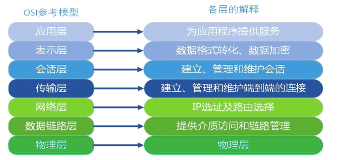
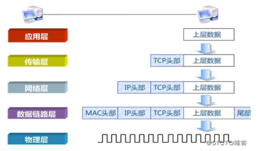
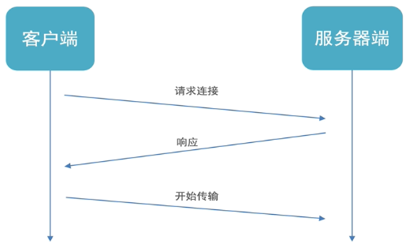
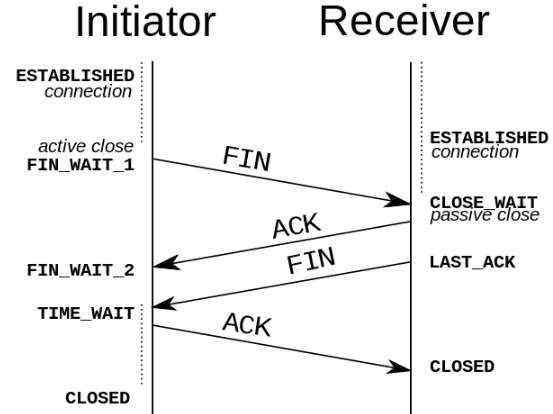
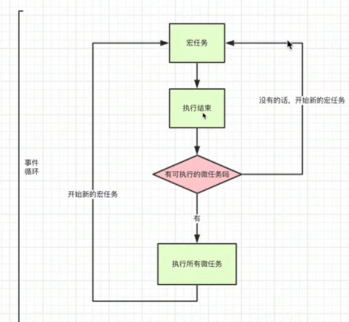
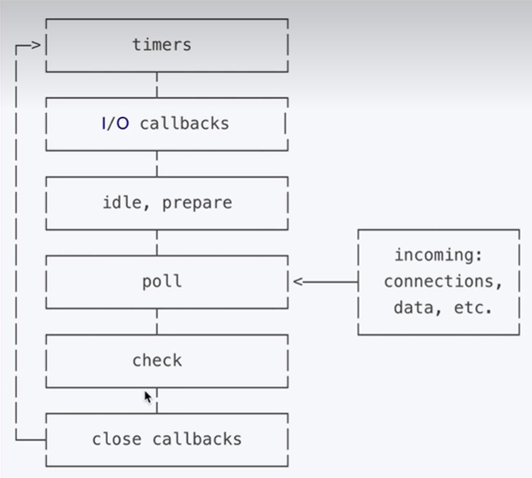
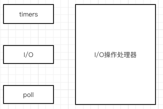
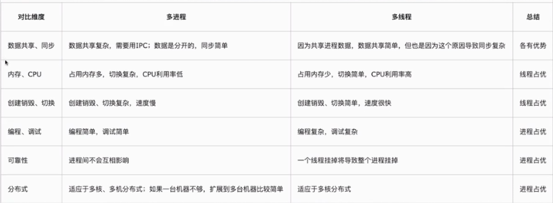
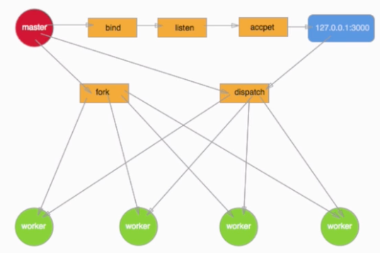
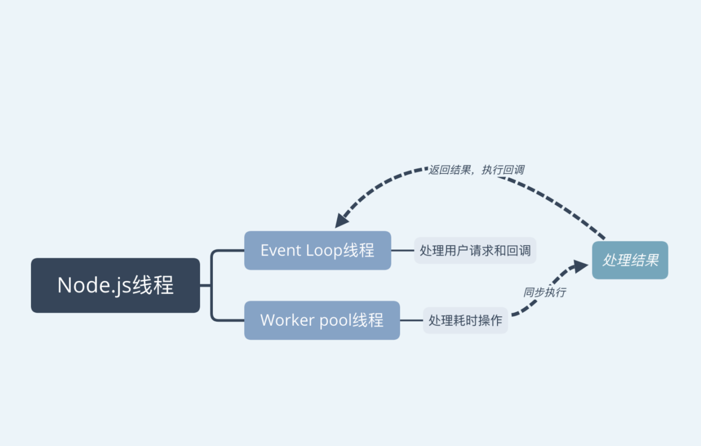

## 网络传输模型

### 7层模型




- **物理层**：

解决两个硬件之间怎么通信的问题，常见的物理媒介有光纤、电缆、中继器等。它主要定义物理设备标准，如网线的接口类型、光纤的接口类型、各种传输介质的传输速率等。

它的主要作用是传输比特流（就是由1、0转化为电流强弱来进行传输，到达目的地后在转化为1、0，也就是我们常说的数模转换与模数转换）。这一层的数据叫做比特。

- **数据链路层：***（负责封装和解封装IP报文，发送和接受ARP/RARP报文等）

在计算机网络中由于各种干扰的存在，物理链路是不可靠的。该层的主要功能就是：通过各种控制协议，将有差错的物理信道变为无差错的、能可靠传输数据帧的数据链路。

它的具体工作是接收来自物理层的位流形式的数据，并封装成帧，传送到上一层；同样，也将来自上层的数据帧，拆装为位流形式的数据转发到物理层。这一层的数据叫做帧。

- **网络层：**(负责路由以及把分组报文发送给目标网络或主机)

计算机网络中如果有多台计算机，怎么找到要发的那台？如果中间有多个节点，怎么选择路径？这就是路由要做的事。

该层的主要任务就是：通过路由选择算法，为报文（该层的数据单位，由上一层数据打包而来）通过通信子网选择最适当的路径。这一层定义的是IP地址，通过IP地址寻址，所以产生了IP协议。

- **传输层：**（负责对报文进行分组和重组，并以TCP或UDP协议格式封装报文）

当发送大量数据时，很可能会出现丢包的情况，另一台电脑要告诉是否完整接收到全部的包。如果缺了，就告诉丢了哪些包，然后再发一次，直至全部接收为止。

简单来说，传输层的主要功能就是：监控数据传输服务的质量，保证报文的正确传输。

- **会话层：**

虽然已经可以实现给正确的计算机，发送正确的封装过后的信息了。但我们总不可能每次都要调用传输层协议去打包，然后再调用IP协议去找路由，所以我们要建立一个自动收发包，自动寻址的功能。于是会话层出现了：它的作用就是建立和管理应用程序之间的通信。

- **表示层：**

表示层负责数据格式的转换，将应用处理的信息转换为适合网络传输的格式，或者将来自下一层的数据转换为上层能处理的格式。

- **应用层：**（负责向用户提供应用程序，比如HTTP、FTP、Telnet、DNS、SMTP等）

应用层是计算机用户，以及各种应用程序和网络之间的接口，其功能是直接向用户提供服务，完成用户希望在网络上完成的各种工作。


### 5层模型



### 简单理解

自上而下

> 应用层 人做好信息，往下发
> 表示层 翻译一下
> 会话层 打包
> 传输层 把包发给下层
> 网络层 报文：给包贴个ip地址的标签
> 数据链路层 帧：查表ip转mac，然后转成电信号
>
> 物理层 定义好各种信号的意思，线路和插口的格式，发送吧

自下而上

> 应用层 看信息信息
> 表示层 翻译一下
> 会话层 看看包送全了没，没全就叫送缺的那个
> 传输层 把包发给下层
> 网络层 报文——整合成包，看看送对了没
> 数据链路层 帧——整理成帧，看看全不全，送上去
>
> 物理层 位——收到信号，送上去


## 构建TCP服务

当一台计算机想要与另一台计算机通讯时，两台计算机之间的通信需要畅通且可靠，这样才能保证正确收发数据。例如，当你想查看网页或查看电子邮件时，希望完整且按顺序查看网页，而不丢失任何内容。当你下载文件时，希望获得的是完整的文件，而不仅仅是文件的一部分，因为如果数据丢失或乱序，都不是你希望得到的结果，于是就用到了TCP。

TCP协议全称是传输控制协议是一种面向连接的、可靠的、基于字节流的传输层通信协议，由 IETF 的RFC 793定义。TCP 是面向连接的、可靠的流协议。流就是指不间断的数据结构，你可以把它想象成排水管中的水流。



### 连接的三次握手

**第一次握手**

客户端向服务端发送连接请求报文段。该报文段中包含自身的数据通讯初始序号。请求发送后，客户端便进入 SYN-SENT 状态。

**第二次握手**

服务端收到连接请求报文段后，如果同意连接，则会发送一个应答，该应答中也会包含自身的数据通讯初始序号，发送完成后便进入 SYN-RECEIVED 状态。

**第三次握手**

当客户端收到连接同意的应答后，还要向服务端发送一个确认报文。客户端发完这个报文段后便进入 ESTABLISHED 状态，服务端收到这个应答后也进入 ESTABLISHED 状态，此时连接建立成功。

### 断开的四次挥手



**第一次握手**

若客户端 A 认为数据发送完成，则它需要向服务端 B 发送连接释放请求。

**第二次握手**

B 收到连接释放请求后，会告诉应用层要释放 TCP 链接。然后会发送 ACK 包，并进入 CLOSE_WAIT 状态，此时表明 A 到 B 的连接已经释放，不再接收 A 发的数据了。但是因为 TCP 连接是双向的，所以 B 仍旧可以发送数据给 A。

**第三次握手**

B 如果此时还有没发完的数据会继续发送，完毕后会向 A 发送连接释放请求，然后 B 便进入 LAST-ACK 状态。

**第四次握手**

A 收到释放请求后，向 B 发送确认应答，此时 A 进入 TIME-WAIT 状态。该状态会持续 2MSL（最大段生存期，指报文段在网络中生存的时间，超时会被抛弃） 时间，若该时间段内没有 B 的重发请求的话，就进入 CLOSED 状态。当 B 收到确认应答后，也便进入 CLOSED 状态。

### 特点

- 面向连接

  面向连接，是指发送数据之前必须在两端建立连接。建立连接的方法是“三次握手”，这样能建立可靠的连接。建立连接，是为数据的可靠传输打下了基础。

- 仅支持单播传输

每条TCP传输连接只能有两个端点，只能进行点对点的数据传输，不支持多播和广播传输方式。

- 面向字节流

TCP不像UDP一样那样一个个报文独立地传输，而是在不保留报文边界的情况下以字节流方式进行传输。

- 可靠传输

  对于可靠传输，判断丢包，误码靠的是TCP的段编号以及确认号。TCP为了保证报文传输的可靠，就给每个包一个序号，同时序号也保证了传送到接收端实体的包的按序接收。然后接收端实体对已成功收到的字节发回一个相应的确认(ACK)；如果发送端实体在合理的往返时延(RTT)内未收到确认，那么对应的数据（假设丢失了）将会被重传。

- 提供拥塞控制

当网络出现拥塞的时候，TCP能够减小向网络注入数据的速率和数量，缓解拥塞

- TCP提供全双工通信

### node创建TCP服务

在node中可以使用`net`模块来创建TCP服务

```js
// server.js
let net = require("net");
const server = net.createServer();

server.on("connection",socket=>{
  console.log("建立连接成功",socket.id);
  socket.write("hello");
  
  socket.on("data",data=>{
    console.log("来自客户端的信息",data.toString())
  })
  socket.on("end",()=>{
    console.log("用户断开连接")
  })
})

server.listen(4000,()=>{
  console.log("tcp servet run in: localhost:4000");
})
```

也可以使用`net.Server()`来创建服务，不过这样比较麻烦一点。可以通过server.getConnections()方法获取连接这个TCP服务器的客户端数量。除此之外，也可以通过maxConnections属性来设置这个服务器的最大连接数量，当连接数量超过最大值时，服务器将拒绝新的连接。

```js
// client.js
let net = require("net");
const client = net.createConnection({
  host:"localhost",
  port:4000,
})

client.on("connect",()=>{
  console.log("与 localhost:4000 建立连接成功")
  
  client.write("world");
})

client.on("data",data=>{
 	console.log("来自服务端的信息",data.toString());
})
```

也可以使用`net.Socket()`来创建客户端


## 创建UDP服务

UDP协议全称是用户数据报协议，在网络中它与TCP协议一样用于处理数据包，是一种无连接的协议。在OSI模型中，在第四层——传输层，处于IP协议的上一层。UDP有不提供数据包分组、组装和不能对数据包进行排序的缺点，也就是说，当报文发送之后，是无法得知其是否安全完整到达的。

### 特点

#### 1. 面向无连接

首先 UDP 是不需要和 TCP一样在发送数据前进行三次握手建立连接的，想发数据就可以开始发送了。并且也只是数据报文的搬运工，不会对数据报文进行任何拆分和拼接操作。

具体来说就是：

- 在发送端，应用层将数据传递给传输层的 UDP 协议，UDP 只会给数据增加一个 UDP 头标识下是 UDP 协议，然后就传递给网络层了
- 在接收端，网络层将数据传递给传输层，UDP 只去除 IP 报文头就传递给应用层，不会任何拼接操作

#### 2. 有单播，多播，广播的功能

UDP 不止支持一对一的传输方式，同样支持一对多，多对多，多对一的方式，也就是说 UDP 提供了**单播，多播，广播**的功能。

#### 3. UDP是面向报文的

发送方的UDP对应用程序交下来的报文，在添加首部后就向下交付IP层。UDP对应用层交下来的报文，既不合并，也不拆分，而是保留这些报文的边界。因此，应用程序必须选择合适大小的报文

#### 4. 不可靠性

首先不可靠性体现在无连接上，通信都不需要建立连接，想发就发，这样的情况肯定不可靠。

并且收到什么数据就传递什么数据，并且也不会备份数据，发送数据也不会关心对方是否已经正确接收到数据了。

再者网络环境时好时坏，但是 UDP 因为没有拥塞控制，一直会以恒定的速度发送数据。即使网络条件不好，也不会对发送速率进行调整。这样实现的弊端就是在网络条件不好的情况下可能会导致丢包，但是优点也很明显，在某些实时性要求高的场景（比如电话会议）就需要使用 UDP 而不是 TCP。

### node创建UDP服务

在node中可以使用`dgram`来构建 UDP 服务，在这个包中有几个常用的方法和事件

+ `bind()`绑定端口和主机
+ `address()`返回 Socket 地址对象
+ `close()`关闭 Socket 并停止监听
+ `send()`发送消息
+ `addMembership()` 添加组播成员
+ `dropMembership()` 删除组播成员
+ `setBroadcast()` 设置是否开启广播
+ `setTTL()`设置数据报生存时间
+ `setMulticastTTL()`设置组播数据报生存时间

事件

+ `listening` 监听成功时触发，仅触发一次
+ `message`收到消息时触发
+ `error`发送错误时触发
+ `close`关闭 socket 时触发

```js
const dgram = require("dgram");
const socket = dgram.createSocket("udp4");

socket.on("listening",()=>{
 	const address = client.address()
  console.log(`socket running ${address.address}:${address.port}`);
})

client.on("message",(msg,remoteInfo)=>{
  console.log('来自发送方的数据',msg);
  console.log('发送方的信息',remoteInfo.address,remoteInof.port);
})

client.on('error',err=>{
  console.log("error",err);
});

client.bind(6000);
```

端口绑定可以不写,之后系统会自动分配一个，不过需要注意的是，如果绑定了端口调用`send()`方法发送信息就必须在`listening`信息中发送，如果不绑定端口就不用。

> 其实在UDP 中并不区分服务端和客户端，因为仅进行数据的发送和接收，无论是谁都可以进行这两个操作，而且并不需要知道有没有人接收。所以在UDP中两个端的代码其实是一样的。

### 实现单播

单播指的就是给一个特定的用户端发送数据，这个需要知道目标的主机地址和端口号。比如要发送信息给上面端口号为 6000 的服务

```js
let dgram = require("dgram");
let client = dgram.createSocket("udp4");

//因为我们没有绑定端口，所以不用再 listening 事件中发送数据
client.send("hellow",6000,"localhost");
```

之后在 6000 端口的机器中的`message`事件中就可以拿来数据来源的信息，并且可以通过`remoteInfo`来给它回信息

```js
socket.on("message",(msg,remoteInfo)=>{
  console.log('来自发送方的数据',msg);
  //回信息
  socket.send('how are you?',remoteInfo.port,remoteInfo.address)
})
```

### 实现广播

广播可以给同一局域网内的所有机器发送消息，其中的地址分为 **直接地址** 和 **受限地址**

> **直接广播地址**包含一个有效的网络号和一个全“1”的主机号，如你说的202.163.30.255，255就是一个主机号，202则是C类的IP地址，C类IP地址就是我们常接触到的。 受限广播地址是32位全1的IP地址（255.255.255.255）
>
> **受限的广播地址**是255.255.255.255。该地址用于主机配置过程中IP数据报的目的地址，此时，主机可能还不知道它所在网络的网络掩码，甚至连它的IP地址也不知道。在任何情况下，路由器都不转发目的地址为受限的广播地址的数据报，这样的数据报仅出现在本地网络中。
>
> **受限广播**可以用在计算机不知道自己IP地址的时候，比如向DHCP服务器索要地址时、PPPOE拨号时等.
>
> **直接广播**可用于本地网络，也可以跨网段广播，比如主机192.168.1.1/30可以发送广播包到192.168.1.7，使主机192.168.1.5/30也可以接收到该数据包，前提是之间的路由器要开启定向广播功能.

```js
socket.on("listening",()=>{
 	const address = client.address()
  console.log(`socket running ${address.address}:${address.port}`);
  
  socket.setBroadcast(true);
  setInterval(function(){
    socket.send('hello',4000,'255.255.255.255');
    //socket.send('hello',4000,'192.168.10.132');
  },2000)
})
```

这样局域网内服务端口是4000的机器都会受到消息

### 实现组播

组播并不像单播，有一个明确的目的主机和IP地址，也不像广播，局域网内的所有主机都是目的主机，广播IP地址也明确（主机标识全部置为1）。组播不同，它并不知道要把信息发给谁，因为谁都可能随时加入组播组，谁都可能随时离开，不可能用某一个主机的IP地址作为组播地址

组播不可能以某一个主机的IP作为自己的目的IP，但是以太网报文在封装时必须要填入目的IP，怎么办？

组播IP不能以某个主机的IP作为自己的目的IP，换句话说，组播IP不需要考虑主机标识，哪个类型的IP地址没有主机标识，D类


由于224.0.0.0/24用于本地链路，239.0.0.0/8为私有组播地址，所以实际可用的组播地址为225.0.0.0/8 - 238.0.0.0/8

> + 224.0.0.0～224.0.0.255为预留的组播地址（永久组地址），地址224.0.0.0保留不做分配，其它地址供路由协议使用
> + 224.0.1.0～224.0.1.255是公用组播地址，可以用于Internet
> + 224.0.2.0～238.255.255.255为用户可用的组播地址（临时组地址），全网范围内有效
> + 239.0.0.0～239.255.255.255为本地管理组播地址，仅在特定的本地范围内有效

```js
socket.on("listening",()=>{
 	const address = client.address()
  console.log(`socket running ${address.address}:${address.port}`);
  
  socket.setBroadcast(true);
  setInterval(function(){
    //组播组地址 224.0.1.100
    socket.send('hello',4000,'224.0.1.100');
  },2000)
})
```

客户端需要加入组播组才能接收到数据

```js
client.on("listening",()=>{
  client.addMembership('224.0.1.100');
})
```


## http、https、http2

TCP 和 UDP 都是网络传输层的协议，仅负责数据的发送和接收，并不关系传递的是什么，但是如果要构建高效的网络应用，就应该从传输层着手，但是对应经典的B/S模型使用TCP和UDP进行通信显然是很麻烦的。

所以对于经典的 B/S 模型，推出了 http、https、http2 协议。

### **http**

Node.js 的 HTTP API 都是非常底层的。 它仅进行流处理和消息解析。 它将消息解析为消息头和消息主体，但不会解析具体的消息头或消息主体，而且默认使用的是`http 1.1`版本。

实例事件和方法

+ `close`服务关闭时触发
+ `request`收到请求信息时触发
+ `server.close()`关闭服务
+ `server.listening`获取服务状态

请求对象

+ `req.method` 请求方法
+ `req.url` 请求地址
+ `req.headers` 请求头
+ `req.httpVersion` 协议版本

响应对象

+ `res.end()` 结束响应
+ `req.setHeader(name,val)` 设置响应头
+ `req.removeHeader(name,val)` 移除响应头
+ `req.statusCode` 设置响应状态吗
+ `req.statusMessage` 设置响应状态码短语
+ `req.write()` 写入响应数据
+ `req.writeHead()` 写入响应头

```js
var http = require('http');

http.createServer(function (req, res) {
  let url = req.url
  res.writeHead(200, {'Content-Type': 'text/html'});
  if(url == "/"){
    res.end("hello world");
  }else if(url == "/a"){
    res.end("you get a");
  }else{
    res.statusCode = 404
    res.end("not found");
  }
  res.end(txt);
}).listen(8080);
```


### **https**

`HTTP` 协议中没有加密机制,但可以通 过和 `SSL`(Secure Socket Layer, **安全套接层** )或 `TLS`(Transport Layer Security, **安全层传输协议**)的组合使用,加密 `HTTP` 的通信内容。属于通信加密，即在整个通信线路中加密。

```
HTTP + 加密 + 认证 + 完整性保护 = HTTPS（HTTP Secure ）
```

```js
const https = require('https');
const fs = require('fs');

const options = {
  key: fs.readFileSync('test/fixtures/keys/agent2-key.pem'),
  cert: fs.readFileSync('test/fixtures/keys/agent2-cert.pem')
};

https.createServer(options, (req, res) => {
  res.writeHead(200);
  res.end('你好，世界\n');
}).listen(8000);
```

`HTTPS` 采用**共享密钥加密**（对称）和**公开密钥加密**（非对称）两者并用的**混合**加密机制。若密钥能够实现安全交换,那么有可能会考虑仅使用公开密钥加密来通信。但是公开密钥加密与共享密钥加密相比,其处理速度要慢。

> 所以应充分利用两者各自的优势, 将多种方法组合起来用于通信。 在**交换密钥**阶段使用**公开密钥加密**方式,之后的建立通信**交换报文**阶段 则使用**共享密钥加密**方式。


`HTTPS`握手过程的简单描述如下：


1. 浏览器将自己支持的一套加密规则发送给网站。
	`服务器获得浏览器公钥`
2. 网站从中选出一组加密算法与HASH算法，并将自己的身份信息以证书的形式发回给浏览器。证书里面包含了网站地址，加密公钥，以及证书的颁发机构等信息。 `浏览器获得服务器公钥`
3. 获得网站证书之后浏览器要做以下工作：
	(a). 验证证书的合法性（颁发证书的机构是否合法，证书中包含的网站地址是否与正在访问的地址一致等），如果证书受信任，则浏览器栏里面会显示一个小锁头，否则会给出证书不受信的提示。
	(b). 如果证书受信任，或者是用户接受了不受信的证书，浏览器会生成一串随机数的密码（接下来通信的密钥），并用证书中提供的公钥加密（共享密钥加密）。
	(c) 使用约定好的HASH计算握手消息，并使用生成的随机数对消息进行加密，最后将之前生成的所有信息发送给网站。 `浏览器验证 -> 随机密码 服务器的公钥加密 -> 通信的密钥 通信的密钥 -> 服务器`
4. 网站接收浏览器发来的数据之后要做以下的操作：
	(a). 使用自己的私钥将信息解密取出密码，使用密码解密浏览器发来的握手消息，并验证HASH是否与浏览器发来的一致。
	(b). 使用密码加密一段握手消息，发送给浏览器。
	`服务器用自己的私钥解出随机密码 -> 用密码解密握手消息（共享密钥通信）-> 验证HASH与浏览器是否一致（验证浏览器）`
	HTTPS的不足
5. 加密解密过程复杂，导致访问速度慢
6. 加密需要认向证机构付费
7. 整个页面的请求都要使用HTTPS

### **http2**

http2 核心 API 提供了专门针对支持 HTTP/2 协议的特性而设计的底层接口。可以以 http 为基底也可以以 https 为基底，一般默认情况下都是以 https 为基底（增加ssl数据加密验证），http2 采用**二进制格式传输数据**，而非 HTTP 1.x 的文本格式，二进制协议解析起来更高效，并且使用**头部压缩**（客户端为服务端都维护一份映射表，之后仅发送数据字段标识符即可）减小请求头体积。采用**多路复用**，代替原来的序列和阻塞机制。所有就是请求的都是通过一个 TCP连接并发完成（解决http的队头阻塞问题）。同时支持**服务器推送**

```js
const http2 = require('http2');
const fs = require('fs');

const server = http2.createSecureServer({
  key: fs.readFileSync('密钥.pem'),
  cert: fs.readFileSync('证书.pem')
});
server.on('error', (err) => console.error(err));

server.on('stream', (stream, headers) => {
  // 流是一个双工流。
  stream.respond({
    'content-type': 'text/html; charset=utf-8',
    ':status': 200
  });
  stream.end('<h1>你好世界</h1>');
});

server.listen(8443);
```

生成此示例的证书和密钥，可以运行：

```shell
openssl req -x509 -newkey rsa:2048 -nodes -sha256 -subj '/CN=localhost' \
  -keyout 密钥.pem -out 证书.pem
```


## 事件循环和多进程

### 事件循环

#### 浏览器中的事件循环

js 是单线程的，单线程就意味着所有任务需要排队，如果因为任务Cpu计算量大还好，但是/O操作Cpu是闲着的。所以为s就设计成了一门异步的语言，不会做无畏的等待。任务可以分成两种，一种是同步任务另一种是异步任务

> **任务队列**
>
> 1. 所有同步任务都在主线程上执行，形成一个执行栈（execution context stack) 。
> 2. 主线程之外，还存在一个"任务队列”(task queue)。只要异步任务有了运行结果，就在”任务队列“之
> 	中放置一个事件。
> 3. 一旦“执行栈"中的所有同步任务执行完毕，系统就会读取"任务队列"，看看里面有哪些事件。那些对应的异步任务，于是结束等待状态，进入执行栈，开始执行。
> 4. 主线程不断重复上面的第三步。

主线程不断从任务队列中读取事件，这个过程是循环不断的，所以整个的这种运行机制又称为**事件循环**

任务又分为宏任务和微任务

**宏任务**：script（整体代码），setTimeout，setInterval，setImmediate，I/O，UI rendering

**微任务**：process.nextTick，Promise，Object.observe，mutationObserver

他们的执行顺序是

1. 宏任务进入主线程，执行过程中会收集微任务加入微任务队列。
2. 宏任务执行完成之后，立马执行微任务中的任务。微任务执行过程中将再次收集宏任务，并加入宏任务队
    列。
3. 反复执行1，2步骤




#### nodejs中的时间循环



上面的6个阶段为一个事件循环

+ **timers(定时器)**：此阶段执行那些由 setTimeout(） 和 setInterval(）调度的回调函数。
+ **I/O callbacks(I/O回调)**：此阶段会执行几乎所有的回调函数,除了 **close callbacks**(关闭回调) 和 那些由**timers** 与 setImmediate(）调度的回调.
	+ setimmediate约等于 setTimeout(cb,0)
+ idle(空转),prepare：此阶段只在内部使用
+ **poll(轮询)**：检索新的I/O事件;在恰当的时候Node会阻塞在这个阶段
+ check(检查)：setImmediate(）设置的回调会在此阶段被调用
+ close callbacks(关闭事件的回调):诸如 socket.on('close'，…）此类的回调在此阶段被调用

在事件循环的每次运行之间,Node.js会检查它是否在等待异步I/O或定时器,如果没有的话就会自动关闭.

> 如果event loop进入了poll阶段，且没有到期的定时器回调时，将会发生下面情况：
>
> + 如果poll queue不为空，event loop将同步的执行queue里的callback,直至queue为空，或执行的callback到达系统上限;
> + 如果poll queue为空，将会发生下面情况：
> 	+ 如果代码已经被setImmediate()设定了callback,event loop将结束poll阶段进入check阶段，并执行check阶段的queue (check阶段的queue是setimmediate设定的)
> 	+ 如果代码没有设定setImmediate(callback),event loop将**阻塞在该阶段**等待callbacks加入poll queue,一旦到达就立即执行
> 
> 如果event loop进入了poll阶段，且有到期的定时器回调时
> 
> + 如果poll queue进入空状态时(即poll 阶段为空闲状态)， event loop将检查timers,如果有1个或多个timer时间已经到达，event loop将按循环顺序进入timers 阶段，并执行timer queue.

```js
var fs = require("fs");
var path = require("path");

function someAsyncOperation(callback){
	//假设要执行2ms
  fs.readFile(path.resolve(__dirname,'/some.txt'),callback);
}

var timeoutShceduled = Date.now();
var fileReadtime = 0;

setTimeout(function(){
  var delay = Date.now() - timeoutScheduled;
  console.log('setTimeout:'+ delay + 'ms have passed since I was scheduled');
  console.log('fileReaderTime',fileReadtime-timeoutScheduled);
},10)

someAsyncOperation(function(){
  fileReadtime = Date.now();
  //卡 20 ms
  while(Date.now() - fileReadtime < 20){}
})
```



>  在事件循环中有个 **I/O操作的处理器** 用来处理所有的异步操作，比如 setTimeout、readFile、setImmediate 等。会在合适的时机（定时器到时间了）调用事件。相当于是一个事件委托器。

在 0ms 时，先将 setTimeout 放入到 *I/O操作的处理器* 中等待执行，然后继续执行 someAsyncOperation 将 fs.readFile 也放入到 *I/O操作的处理器* 中等待执行。此时主代码执行完成，timers、I/O、poll 的执行队列都是空的，而且没有定时器达到执行时间，也没有设置 setImmediate ，所以**事件循环阻塞在 poll 阶段**，等待callbacks加入poll queue,一旦到达就立即执行

在 2ms 时，fs.readFile处理完成 *I/O操作的处理器* 将它放入到poll queue中执行，因为在callback 中卡了 20ms，所以在第 10ms 的时候 setTimeout 已经到达了执行时间也不会被执行，而是继续等待 fs.readFile 执行完毕。

在 22ms 时，fs.readFile 执行完成，此时**poll queue为空**，依然在阻塞着，**事件循环检查是否有定时器到达**，此时setTimeout 已经达到执行时间了，就直接跳到 timers 阶段开始一轮新的事件循环并执行 timers queue

#### setTimeout 和 setImmediate

```js
setImmediate(function(){
  console.log("setImmediate");
})

setTimeout(function(){
  console.log("setTimeout");
},0)
```

> setTimeout 在浏览器中最小的时间是 4ms，在node中是 1ms
>
> 事件循环启动也是需要时间的。

在 0ms 时，setImmediate 和 setTimeout 都被放入到 *I/O操作的处理器* 中等待执行。

如果事件循环到达 poll 阶段的时间是 0.8ms，那么 poll queue 为空，并且没有到期的定时器（setTimeout 1ms 的时候到达），设置了 setImmediate ，所以进入 check 阶段执行 setImmediate，执行完成之后进入下一阶段，timers 阶段执行 setTimeout（如果setTimeout还没有到期还是回继续往下进入下一个阶段）

如果事件循环到达 poll 阶段的时间大于 1ms，那么 poll queue 为空，并且setTimeout到期，进入到 timers 阶段执行 setTimeout，之后到达 poll 阶段， poll queue 为空，并且没有到期的定时器，设置了 setImmediate ，所以进入 check 阶段执行setImmediate

```js
// 执行了 2ms
fs.readFile(path.resolve(__dirname,'/some.txt'),()=>{
  setImmediate(function(){
    console.log("setImmediate");
  })

  setTimeout(function(){
    console.log("setTimeout");
  },0)
})
```

在 0ms 时，fs.readFile被放入到 *I/O操作的处理器* 中等待执行。

在 2ms 时，到达poll queue 阶段，此时正在阻塞，没有定时器到期，fs.readFile放入poll queue中执行，回调函数中又将 setImmediate 和 setTimeout 都被放入到 *I/O操作的处理器* 中等待执行。fs.readFile 执行完成，poll queue为空，因为设置了 setImmediate 所以直接进入 check 阶段执行，之后到达 timers 阶段执行 setTimeout。

#### process.nextTick

process.nextTick 也是一个异步的函数，它不会在任何阶段执行，只会**在阶段切换的中间执行**

```js
// 执行了 2ms
fs.readFile(path.resolve(__dirname,'/some.txt'),()=>{
  setTimeout(function(){
    console.log("setTimeout");
  },0)
  setImmediate(function(){
    console.log("setImmediate");
    process.nextTick(function(){
      console.log("nextTick1");
    })
  })
  process.nextTick(function(){
    console.log("nextTick2");
  })
  process.nextTick(function(){
    console.log("nextTick3");
  })
})
```

在 0ms 时，fs.readFile被放入到 *I/O操作的处理器* 中等待执行。

在 2ms 时，到达poll queue 阶段，此时正在阻塞，没有定时器到期，fs.readFile放入poll queue中执行，回调函数中又将 setImmediate 、 setTimeout、process.nextTick 都被放入到 *I/O操作的处理器* 中等待执行。

在 fs.readFile 执行完成之后，poll queue为空，因为设置了 setImmediate 所以要进入 check 阶段执行，但是在阶段切换时会先执行 process.nextTick ，输出 nextTick2、nextTick3，然后到达 check 阶段执行 setImmediate，输入 setImmediate，将 process.nextTick 都被放入到 *I/O操作的处理器* 中等待执行。

setImmediate 执行完成，将于进入 timers 阶段，在这之前执行 process.nextTick 输出 nextTick1，然后到达 timers 阶段执行 setTimeout。

**应用场景**

1.在多个事件里交叉执行CPU运算密集型的任务。

```js
function compute(){
  //递归计算，仅在事件循环空闲的时候执行
  process.nextTick(compute);
}
http.createServer((req,res)=>{
  //在接受请求的时候还能抽空进行一些计算任务
  res.end("hello");
}).listen(3000)
compute();
```

2.保持回调函数的异步执行原则

```js
var client = net.connect(3000,function(){
  client.write("world");
})
```

net.connect 可能在某些情况下会变成同步的，那么回调里面的 client 就永远都是 undefined，可以这样写

```js
var client = net.connect(3000,function(){
  process.nextTick(()=>{
    client.write("world");
  })
})
```

3.用在事件触发过程中

EventEmitter 中的 on 和 emit 都是同步的，有可能会在还没订阅消息的时候就发布了消息，这样要订阅消息的回调就不会被执行

```js
function StreamLib(){
  this.emit("start");
}
StreamLib.prototype.__prote__ = EventEmitter.prototype;

var stream = new StreamLib();
//接收不到事件
stream.on("start",()=>{console.log('xx')})
```

可以改成这样

```js
function StreamLib(){
  process.nextTick(()=>{
    this.emit("start");
  })
}
```


### 多进程

**什么是多进程？**

进程是程序在计算机上的一次执行活动，即正在运行中的应用程序，通常称为进程。当你运行一个程序，你就启动了一个进程。每个进程都有自己独立的地址空间(内存空间)，每当用户启动一个进程时，操作系统就会为该进程分配一个独立的内存空间，让应用程序在这个独立的内存空间中运行。

在同一个时间里，同一个计算机系统中如果允许两个或两个以上的进程处于运行状态，这便是多进程，也称多任务。现代的操作系统几乎都是多任务操作系统，能够同时管理多个进程的运行。

多任务带来的好处是明显的，比如你可以边听mp3边上网，与此同时甚至可以将下载的文档打印出来，而这些任务之间丝毫不会相互干扰。

**什么是多线程？**

线程是一个轻量级的子进程，是最小的处理单元；是一个单独的执行路径。可以说：线程是进程的子集（部分），一个进程可能由多个线程组成。

线程是独立的。如果在一个线程中发生异常，则不会影响其他线程。它使用共享内存区域。

多线程是一种执行模型，它允许多个线程存在于进程的上下文中，以便它们独立执行但共享其进程资源。



**需要频繁创建销毁的优先用线程**

这种原则最常见的应用就是Wb服务器了，来一个连接建立一个线程，断了就销毁线程，要是用进程，创建和销吸的代价是很难承受的

**需要进行大量计算的优先使用线程**

所谓大量计算，当然就是要耗费很多CPU,切换频繁了，这种情况下线程是最合适的。
这种原则最常见的是图像处理、算法处理

**强相关的处理用线程，弱相关的处理用进程**

什么叫强相关、弱相关？理论上很难定义，给个简单的例子就明白了。

一般的Server需要完成如下任务：消息收发、消息处理。"消息收发"和"消息处理"就是弱相关的任务，而消息处理里面可能又分为"消息解码"、"业务处理"，这两个任务相对来说相关性就要强多了。因此"消息收发"和“消息处理可以分进程设计，“消息解码”、“业务处理“可以分线程设计。

**可能要扩展到多机分布的用进程，多核分布的用线程**

**都满足需求的情况下，用你最熟悉、最拿手的方式**


### node创建进程

node中没个 http 、tcp、udp等都是一个进程，在node中可以通过`process、child_process、cluster`来创建进程，其中 cluster 是基于 child_process 的 fork 方法来封装的

#### process

process对象是Node的一个全局对象，提供当前Node进程的信息，他可以在脚本的任意位置使用，不必通过require命令加载

**属性**

1. process.argv属性，返回一个数组，包含了启动node进程时的命令行参
2. process.env返回包含用户环境信息的对象，可以在脚本中对这个对象进行增删改查的操作
3. process.pid返回当前进程的进程号
4. process.platform返回当前的操作系统
5. process.version返回当前node版本

**方法**

1. process.cwd() 返回node.js进程当前工作目录
2. process.chdir() 变更node.js进程的工作目录
3. process.nextTick(fn) 将任务放到当前事件循环的尾部，添加到next tick队列，一旦当前事件轮询队列的任务全部完成，在next tick队列中的所有callback会被依次调用
4. process.exit() 退出当前进程，很多时候是不需要的
5. 5.process.kill(pid[signal)) 给指定进程发送信号，包括但不限于结束进程

**事件**

1. beforeExit事件，在Node清空了EventLoop之后，再没有任何待处理任务时触发，可以在这里再部署一些任务，使得Node进程不退出，显示的终止程序时(process.exit()),不会触发
2. exit事件，当前进程退出时触发，回调函数中只允许同步操作，因为执行完回调后，进程金辉退出
3. **uncaughtException**事件，当前进程抛出一个没有捕获的错误时触发，可以用它在进程结束前进行一些已分配资源的同步清理操作，尝试用它来恢复应用的正常运行的操作是不安全的（这个事件可以用来**捕获同步错误，但是进程会结束**，也可以**捕获异步错误，进程不会结束**）
4. warning事件，任何Node.js发出的进程警告，都会触发此事件

#### child_process

cluster 就是基于 child_process 进行封装的。

1. child_process.spawn()会异步的衍生子进程
2. child_process.spwanSync()会异步的衍生子进程，但会阻塞事件循环
3. child_process.exec()和child_process.execSync()衍生出一个shell,然后在shell中执行命令，且缓冲任何产生的输出，运行结束后调用回调函数
4. child_process.execFile()、 child_process.execFileSync()类似child_process.exec()函数，除了不衍生-个shell,而是指定的可执行的file被直接衍生为一个新的进程，更加高效
5. child_process.fork() 用于直接创建一个子进程会返回一个 childProcess 对象，与spawn方法不同，fork 会在父子间建立一个通信管道，用于进程之间的通信

**exec和execFile**

```js
let exec = require("child_process").exec;
let execFile = require("child_process").execFile;

let ls = exec('ls -c',(err,stdout,stderr)=>{
  if(err){
    console.log(err.stack);
    console.log('error code'+err.code);
    return;
  }
  console.log("child process stdout",stdout);
})

let ls2 = execFile('ls',["-c"],(err,stdout,stderr)=>{
  //....
})
//-------------------------------

let child = exec("ls")
child.stdout.on("data",data=>{
  console.log("data",data);
})
child.stderr.on("data",err=>{
  console.log("err",err);
})
```

**spawn**

```js
let spawn = require("child_process").spawn;
// 只支持监听事件的方式
let child = spawn("node",['./child.js']);
child.stdout.on("data",data=>{
  // 接收的是buffer数据
  console.log("data",data.toString('utf8'));
})
child.stderr.on("data",err=>{
  console.log("err",err);
})
```

**fork**

fork 方法直接创建一个子进程，执行node脚本，`fork('./child.js')`相当于`spawn('node',['./child.js'])`，与 spawn 方法不同的是，fork会在父子进程间建立一个通信管道 pipe，用于进程间的通信，也是IPC通信的基础

```js
let child_process = require("child_process");
let path = require("path");

let child = child_process.fork(path.resolve(__dirname,'./child.js'));
child.on("message",function(m){
  console.log("主进程接收到信息：",m);
})
child.send({hello:'world'});
```

```js
//child.js
process.on("message",m=>{
  console.log("接收到来自主进程的信息：",m);
})
process.send({foo:'bar'});
```

#### **cluster**

```js
//main.js
let cluster = require("cluster");
let http = require("http");
let cpuNum = require("os").cpus().length;//cpu数

// cluster 本质上是主进程通过 fork 来管理子进程

if(cluster.isMaster){ //当前是否是主进程
  for(let i = 0;i < cpuNum;i++){
    cluster.fork();
  }
  //其他代码
  cluster.on("fork",()=>{
    conosle.log("开启了一个worker进程")
  })
 	
  cluster.workers.forEach(worker=>{
    worker.on("message",(data)=>{
      conosle.log(data)
    })
  })
}else{
  console.log("子进程走这里");
  process.send({msg:"发给主进程的信息",pid:process.pid})
}
```

上面的执行流程是，当主进程执行的时候通过 for 循环来创建与cpu相同数量的子进程，当运行`cluster.fork()`时会创建子进程同时再次运行 main.js ，此时`cluster.isMaster`为false ，所以我们可以在 else 中写我们的子进程逻辑，而不用为每个进程创建一个单独的文件 child.js

**属性和方法**

+ isMaster 属性，返回该进程是不是主进程

+ isWorker 属性，返回该进程是不是工作进程

+ workers 属性，返回全部管理的worker子进程

+ fork 方法，只能通过主进程调用，衍生出一个新的worker进程，返回一个worker对象。和child_process的区别，不用创建一个新的child.js

+ setupMaster([settings])方法，用于修改 fork 默认行为，一旦调用，将会按照cluster.settings进行设置

+ settings属性，用于配置，
  + exec:worker文件路径；
  + args:传递给worker的参数；
  + execArgv:传递给Node.js可执行文件的参数列表


**事件**

+ fork事件，当新的工作进程被fork时触发，可以用来记录工作进程活动
+ listening事件，当一个工作进程调用listen()后触发（比如http的listen() ），事件处理器两个参数worker，工作进程对象
+ message事件，当集群主进程从任何工作进程接收到消息时触发，接收三个参数，worker，message，handle
+ online事件，复制好一个工作进程后，工作进程主动发送一条online消息给主进程，主进程收到消息后触发，回调参数worker对象
+ disconnect事件，主进程和工作进程之间IPC通道断开后触发
+ exit事件，有工作进程退出时触发，回调参数worker对象、code退出码、signal进程被ki训时的信号
+ setup事件，cluster.setupMaster执行后触发


#### 负载均衡（[惊群](https://www.cnblogs.com/joyco773/p/11552473.html)）

我们可以看到可以启动多个worker来处理请求客户端请求。但是这种多进程的模型有个明显的问题

- 多个进程之间会竞争accept一个连接，产生惊群现象，效率比较低。
- 由于无法控制一个新的连接有哪个进程来出来，必然导致各worker进程之间的负载非常不均衡。

这就是所谓的**`惊群`现象**

简单的来说,多线程/多进程等待同一个socket事件，当这个事件发生时，这些线程/进程被同时唤醒,就是`惊群`。可以想而知，效率很低，很多进程被内核重新调度唤醒，同时去响应这个事件，当然只有一个进程能够处理成功，其他进程再处理改事件之后重新休眠。这种性能浪费现象就是惊群。

多进程运行还涉及父子进程通信，子进程管理，以及负载均衡等，cluster已经封装实现了。

**cluster多进程调度模型**

每个worker 进程通过使用child_process.fork() 函数，基于IPC(Inter-Process Communication,进程间通信)，实现与master进程间通信

cluster是由master监听请求，再通过`round-robin`算法分发给各个worker,避免了惊群现象的发生。

> round-robin (轮询调度算法) 的原理是每一次把来自用户的请求轮流分配给内部中的服务器



简易实现 cluster 的负载均衡

```js
//master.js
const net = require('net');
const fork = require('child_process').fork;

var workers = [];
for(var i=0;i<4;i++) {
  workers.push(fork('./worker'))
}

var handle = net._createServerHandle('0.0.0.0', 3000);
handle.listen();
handle.onconnection = function(err,handle){
  var worker = workers.pop();
  worker.send({},handle);
  workers.unshift(worker);
}
```

```js
//worker.js
const net = require('net');
process.on('message', function (m, handle) {
 start(handle);
});

var buf = 'hello Node.js';
var res = ['HTTP/1.1 200 OK','content-length:'+buf.length].join('\r\n')+'\r\n\r\n'+buf;

function start(handle) {
  console.log('got a connection on worker, pid = %d', process.pid);
  var socket = new net.Socket({
    handle: handle
  });
  socket.readable = socket.writable = true;
  socket.end(res);
}
```


#### 进程守护

master进程除了负责接收新的连接，分发给各worker进程处理之外，还得像天使一样默默地守护着这些worker进程，保障整个应用的稳定性。一旦某个wokr进程异常退出就fok一个新的子进程顶替上去。

这一切cluster模块都已经好处理了，当某个worker进程发生异常退出或者与master进程失去联系(disconnected)时，master进程都会收到相应的事件通知

```js
if(cluster.isMaster){ //当前是否是主进程
  for(let i = 0;i < cpuNum;i++){
    cluster.fork();
  }
  
  cluster.on("exit",()=>{
    cluster.fork();
  })
  cluster.on("disconnect",()=>{
    cluster.fork();
  })
}else{
  //出错后使用 disconnect 或者 exit 退出
  process.disconnect()
}
```


#### 兄弟进程通信

上面说的进程间的通信都是所父子进程之间的通信，如果兄弟进程之间需要进行通信就需要父进程作为桥梁来转发消息。

```js
if(cluster.isMaster){ //当前是否是主进程
 	let workers = [];
  for(let i = 0;i < cpuNum;i++){
    workers.push(cluster.fork());
  }
  cluster.on("message",(fromWorker,msg) =>{
    if(msg.type === "trans"){
			let worker = workers.find(f => f.process.pid == msg.target);
      if(worker){
        worker.send({from:fromWorker.process.pid,msg:msg.data})
      }
    }
  })
}else{
  process.send({target:19834,data:{},type:"trans"});
}
```


### 多线程

有人可能会说，Node.js虽然是单线程的，但是可以利用循环事件（Event Loop)l来实现并发执行任务。追究其本质，NodeJs实际上使用了两种不同的线程，一个是用于处理循环事件的主线程一个是工作池（Worker pool）里面的一些辅助线程。关于这两种线程主要功能和关系如图1所示



所以从本质上来讲，NodeJs并不是真正的原生多线程，而是利用循环事件来实现高效并发执行任务。要做到真正的多线程，需要依赖其他模块或者第三方库

#### Worker_threads

是Node.js官方推荐的实现真正多线程的模块，有官方技术团队进行长期维护。Worker_threads不需要单独安装，它位于Node.js源码中

worker_threads模块允许使用并行执行JavaScript的线程，使用也非常方便，只需要引入该模块即可

```js
const worker = require('worker_threads');
```

与child_process或cluster不同，worker_threads可以共享内存。它们通过传输ArrayBuffer实例或共享SharedArrayBuffer实例来实现

```js
const {
  Worker, isMainThread, parentPort, workerData,setEnvironmentData,getEnvironmentData,
} = require('worker_threads');

if (isMainThread) {
  setEnvironmentData('Hi', 'Node.js!');
  const worker = new Worker(__filename);
  worker.on('message', message => console.log(message));
  worker.on('exit', (code) => {
    if (code !== 0){
      console.log(`Worker stopped with exit code ${code}`)
    }
  });
} else {
  console.log(getEnvironmentData('Hi'));
  parentPort.postMessage("hello world");
}
```

常用方法和属性

+ `Worker` 该类代表一个独立的js执行线程。
+ `isMainThead` 一个布尔值，当前代码是否运行在Worker线程中。
+ `parentPort、MessagePort `对象，如果当前线程是个生成的Worker线程，则允许和父线程通信。
+ `workerData` 一个可以传递给线程构造函数的任何js数据的的复制数据。
+ `worker.getEnvironmentData(key)` 可以获取环境变量，先使用`setEnvironmentData`来设置环境变量，然后再使用`getEnvironmentData`来获取
+ `MessageChannel` 是worker_threads提供的一个双向异步的消息通信信道

```js
const {MessageChannel}  = require('worker_threads');

const {port1, port2} = new MessageChannel();

// port1给port2发送信息
port1.postMessage({carName: 'BYD'});

port2.on('message', (message) => {
    console.log("I receive message is ", message);
})

// port2给port1发送信息
port2.postMessage({personality: "Brave"});
port1.on('message', (message) => {
    console.log("I receive message is ", message);
});
```

port.on(‘message’)方法是利用被动等待的方式接收事件，如果想手动接收信息可以使用receiveMessageOnPort方法，指定从某个port接收消息，如下所示。

```js
const { MessageChannel, receiveMessageOnPort } = require('worker_threads');
const {port1, port2} = new MessageChannel();
port1.postMessage({Name: "freePHP"});

let result = receiveMessageOnPort(port2);
console.log(result);
let result2 = receiveMessageOnPort(port2);
console.log(result2);
```

从结果可以看出，receiveMessageOnPort可以指定从另一个MessagePort对象获取消息，是一次消耗消息。
实际工作中，我们不可能只使用单个线程来完成任务，所以需要创建线程池来维护和管理worker thread对象。为了简化线程池的实现，假设只会传递一个woker脚本作为参数，具体实现如下所示。需要单独安装async_hooks模块，它用于异步加载资源

```js
const { AsyncResource } = require('async_hooks'); // 用于异步加载资源
const { EventEmitter } = require('events');
const path = require('path');
const { Worker } = require('worker_threads');

const kTaskInfo = Symbol('kTaskInfo');
const kWorkerFreedEvent = Symbol('kWorkerFreedEvent');

class WorkerPoolTaskInfo extends AsyncResource {
    constructor(callback) {
        super('WorkerPoolTaskInfo');
        this.callback = callback;
    }

    done(err, result) {
        this.runInAsyncScope(this.callback, null, err, result);
        this.emitDestroy();  // 只会被执行一次
    }
}

class WorkerPool extends EventEmitter {
    constructor(numThreads) {
        super();
        this.numThreads = numThreads;
        this.workers = [];
        this.freeWorkers = [];

        for (let i = 0; i < numThreads; i++)
            this.addNewWorker();
    }

    /**
     * 添加新的线程
     */
    addNewWorker() {
        const worker = new Worker(path.resolve(__dirname, 'task2.js'));
        worker.on('message', (result) => {
            // 如果成功状态，则将回调传给runTask方法，然后worker移除TaskInfo标记。
            worker[kTaskInfo].done(null, result);
            worker[kTaskInfo] = null;
            //
            this.freeWorkers.push(worker);
            this.emit(kWorkerFreedEvent);
        });
        worker.on('error', (err) => {
            // 报错后调用回调
            if (worker[kTaskInfo])
                worker[kTaskInfo].done(err, null);
            else
                this.emit('error', err);
            // 移除一个worker，然后启动一个新的worker来代替当前的worker
            this.workers.splice(this.workers.indexOf(worker), 1);
            this.addNewWorker();
        });
        this.workers.push(worker);
        this.freeWorkers.push(worker);
        this.emit(kWorkerFreedEvent);
    }

    /**
     * 执行任务
     * @param task
     * @param callback
     */
    runTask(task, callback) {
        if (this.freeWorkers.length === 0) {
            this.once(kWorkerFreedEvent, () => this.runTask(task, callback));
            return;
        }

        const worker = this.freeWorkers.pop();
        worker[kTaskInfo] = new WorkerPoolTaskInfo(callback);
        worker.postMessage(task);
    }

    /**
     * 关闭线程
     */
    close() {
        for (const worker of this.workers) {
            worker.terminate();
        }
    }
}

module.exports = WorkerPool;
```

其中task2.js是定义好的一个计算两个数字相加的脚本，内容如下。

```js
const { parentPort } = require('worker_threads');
parentPort.on('message', (task) => {
  parentPort.postMessage(task.a + task.b);
});
```

调用这个线程池

```js
const WorkerPool = require('./worker_pool.js');
const os = require('os');

const pool = new WorkerPool(os.cpus().length);

let finished = 0;
for (let i = 0; i < 10; i++) {
  pool.runTask({ a: 42, b: 100 }, (err, result) => {
    console.log(i, err, result);
    if (++finished === 10)
      pool.close();
  });
}
```


## 文档

[node中文文档](https://www.apiref.com/nodejs-zh/index.html)

[API Reference Document](https://www.apiref.com/)