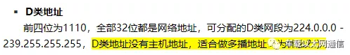

## 网络传输模型

### 7层模型


- **物理层**：

解决两个硬件之间怎么通信的问题，常见的物理媒介有光纤、电缆、中继器等。它主要定义物理设备标准，如网线的接口类型、光纤的接口类型、各种传输介质的传输速率等。

它的主要作用是传输比特流（就是由1、0转化为电流强弱来进行传输，到达目的地后在转化为1、0，也就是我们常说的数模转换与模数转换）。这一层的数据叫做比特。

- **数据链路层：***（负责封装和解封装IP报文，发送和接受ARP/RARP报文等）

在计算机网络中由于各种干扰的存在，物理链路是不可靠的。该层的主要功能就是：通过各种控制协议，将有差错的物理信道变为无差错的、能可靠传输数据帧的数据链路。

它的具体工作是接收来自物理层的位流形式的数据，并封装成帧，传送到上一层；同样，也将来自上层的数据帧，拆装为位流形式的数据转发到物理层。这一层的数据叫做帧。

- **网络层：**(负责路由以及把分组报文发送给目标网络或主机)

计算机网络中如果有多台计算机，怎么找到要发的那台？如果中间有多个节点，怎么选择路径？这就是路由要做的事。

该层的主要任务就是：通过路由选择算法，为报文（该层的数据单位，由上一层数据打包而来）通过通信子网选择最适当的路径。这一层定义的是IP地址，通过IP地址寻址，所以产生了IP协议。

- **传输层：**（负责对报文进行分组和重组，并以TCP或UDP协议格式封装报文）

当发送大量数据时，很可能会出现丢包的情况，另一台电脑要告诉是否完整接收到全部的包。如果缺了，就告诉丢了哪些包，然后再发一次，直至全部接收为止。

简单来说，传输层的主要功能就是：监控数据传输服务的质量，保证报文的正确传输。

- **会话层：**

虽然已经可以实现给正确的计算机，发送正确的封装过后的信息了。但我们总不可能每次都要调用传输层协议去打包，然后再调用IP协议去找路由，所以我们要建立一个自动收发包，自动寻址的功能。于是会话层出现了：它的作用就是建立和管理应用程序之间的通信。

- **表示层：**

表示层负责数据格式的转换，将应用处理的信息转换为适合网络传输的格式，或者将来自下一层的数据转换为上层能处理的格式。

- **应用层：**（负责向用户提供应用程序，比如HTTP、FTP、Telnet、DNS、SMTP等）

应用层是计算机用户，以及各种应用程序和网络之间的接口，其功能是直接向用户提供服务，完成用户希望在网络上完成的各种工作。


### 5层模型


### 简单理解

自上而下

> 应用层 人做好信息，往下发
> 表示层 翻译一下
> 会话层 打包
> 传输层 把包发给下层
> 网络层 报文：给包贴个ip地址的标签
> 数据链路层 帧：查表ip转mac，然后转成电信号
>
> 物理层 定义好各种信号的意思，线路和插口的格式，发送吧

自下而上

> 应用层 看信息信息
> 表示层 翻译一下
> 会话层 看看包送全了没，没全就叫送缺的那个
> 传输层 把包发给下层
> 网络层 报文——整合成包，看看送对了没
> 数据链路层 帧——整理成帧，看看全不全，送上去
>
> 物理层 位——收到信号，送上去


## 构建TCP服务

当一台计算机想要与另一台计算机通讯时，两台计算机之间的通信需要畅通且可靠，这样才能保证正确收发数据。例如，当你想查看网页或查看电子邮件时，希望完整且按顺序查看网页，而不丢失任何内容。当你下载文件时，希望获得的是完整的文件，而不仅仅是文件的一部分，因为如果数据丢失或乱序，都不是你希望得到的结果，于是就用到了TCP。

TCP协议全称是传输控制协议是一种面向连接的、可靠的、基于字节流的传输层通信协议，由 IETF 的RFC 793定义。TCP 是面向连接的、可靠的流协议。流就是指不间断的数据结构，你可以把它想象成排水管中的水流。


### 连接的三次握手

**第一次握手**

客户端向服务端发送连接请求报文段。该报文段中包含自身的数据通讯初始序号。请求发送后，客户端便进入 SYN-SENT 状态。

**第二次握手**

服务端收到连接请求报文段后，如果同意连接，则会发送一个应答，该应答中也会包含自身的数据通讯初始序号，发送完成后便进入 SYN-RECEIVED 状态。

**第三次握手**

当客户端收到连接同意的应答后，还要向服务端发送一个确认报文。客户端发完这个报文段后便进入 ESTABLISHED 状态，服务端收到这个应答后也进入 ESTABLISHED 状态，此时连接建立成功。

### 断开的四次挥手


**第一次握手**

若客户端 A 认为数据发送完成，则它需要向服务端 B 发送连接释放请求。

**第二次握手**

B 收到连接释放请求后，会告诉应用层要释放 TCP 链接。然后会发送 ACK 包，并进入 CLOSE_WAIT 状态，此时表明 A 到 B 的连接已经释放，不再接收 A 发的数据了。但是因为 TCP 连接是双向的，所以 B 仍旧可以发送数据给 A。

**第三次握手**

B 如果此时还有没发完的数据会继续发送，完毕后会向 A 发送连接释放请求，然后 B 便进入 LAST-ACK 状态。

**第四次握手**

A 收到释放请求后，向 B 发送确认应答，此时 A 进入 TIME-WAIT 状态。该状态会持续 2MSL（最大段生存期，指报文段在网络中生存的时间，超时会被抛弃） 时间，若该时间段内没有 B 的重发请求的话，就进入 CLOSED 状态。当 B 收到确认应答后，也便进入 CLOSED 状态。

### 特点

- 面向连接

  面向连接，是指发送数据之前必须在两端建立连接。建立连接的方法是“三次握手”，这样能建立可靠的连接。建立连接，是为数据的可靠传输打下了基础。

- 仅支持单播传输

每条TCP传输连接只能有两个端点，只能进行点对点的数据传输，不支持多播和广播传输方式。

- 面向字节流

TCP不像UDP一样那样一个个报文独立地传输，而是在不保留报文边界的情况下以字节流方式进行传输。

- 可靠传输

  对于可靠传输，判断丢包，误码靠的是TCP的段编号以及确认号。TCP为了保证报文传输的可靠，就给每个包一个序号，同时序号也保证了传送到接收端实体的包的按序接收。然后接收端实体对已成功收到的字节发回一个相应的确认(ACK)；如果发送端实体在合理的往返时延(RTT)内未收到确认，那么对应的数据（假设丢失了）将会被重传。

- 提供拥塞控制

当网络出现拥塞的时候，TCP能够减小向网络注入数据的速率和数量，缓解拥塞

- TCP提供全双工通信

### node创建TCP服务

在node中可以使用`net`模块来创建TCP服务

```js
// server.js
let net = require("net");
const server = net.createServer();

server.on("connection",socket=>{
  console.log("建立连接成功",socket.id);
  socket.write("hello");
  
  socket.on("data",data=>{
    console.log("来自客户端的信息",data.toString())
  })
  socket.on("end",()=>{
    console.log("用户断开连接")
  })
})

server.listen(4000,()=>{
  console.log("tcp servet run in: localhost:4000");
})
```

也可以使用`net.Server()`来创建服务，不过这样比较麻烦一点。可以通过server.getConnections()方法获取连接这个TCP服务器的客户端数量。除此之外，也可以通过maxConnections属性来设置这个服务器的最大连接数量，当连接数量超过最大值时，服务器将拒绝新的连接。

```js
// client.js
let net = require("net");
const client = net.createConnection({
  host:"localhost",
  port:4000,
})

client.on("connect",()=>{
  console.log("与 localhost:4000 建立连接成功")
  
  client.write("world");
})

client.on("data",data=>{
 	console.log("来自服务端的信息",data.toString());
})
```

也可以使用`net.Socket()`来创建客户端


## 创建UDP服务

UDP协议全称是用户数据报协议，在网络中它与TCP协议一样用于处理数据包，是一种无连接的协议。在OSI模型中，在第四层——传输层，处于IP协议的上一层。UDP有不提供数据包分组、组装和不能对数据包进行排序的缺点，也就是说，当报文发送之后，是无法得知其是否安全完整到达的。

### 特点

#### 1. 面向无连接

首先 UDP 是不需要和 TCP一样在发送数据前进行三次握手建立连接的，想发数据就可以开始发送了。并且也只是数据报文的搬运工，不会对数据报文进行任何拆分和拼接操作。

具体来说就是：

- 在发送端，应用层将数据传递给传输层的 UDP 协议，UDP 只会给数据增加一个 UDP 头标识下是 UDP 协议，然后就传递给网络层了
- 在接收端，网络层将数据传递给传输层，UDP 只去除 IP 报文头就传递给应用层，不会任何拼接操作

#### 2. 有单播，多播，广播的功能

UDP 不止支持一对一的传输方式，同样支持一对多，多对多，多对一的方式，也就是说 UDP 提供了**单播，多播，广播**的功能。

#### 3. UDP是面向报文的

发送方的UDP对应用程序交下来的报文，在添加首部后就向下交付IP层。UDP对应用层交下来的报文，既不合并，也不拆分，而是保留这些报文的边界。因此，应用程序必须选择合适大小的报文

#### 4. 不可靠性

首先不可靠性体现在无连接上，通信都不需要建立连接，想发就发，这样的情况肯定不可靠。

并且收到什么数据就传递什么数据，并且也不会备份数据，发送数据也不会关心对方是否已经正确接收到数据了。

再者网络环境时好时坏，但是 UDP 因为没有拥塞控制，一直会以恒定的速度发送数据。即使网络条件不好，也不会对发送速率进行调整。这样实现的弊端就是在网络条件不好的情况下可能会导致丢包，但是优点也很明显，在某些实时性要求高的场景（比如电话会议）就需要使用 UDP 而不是 TCP。

### node创建UDP服务

在node中可以使用`dgram`来构建 UDP 服务，在这个包中有几个常用的方法和事件

+ `bind()`绑定端口和主机
+ `address()`返回 Socket 地址对象
+ `close()`关闭 Socket 并停止监听
+ `send()`发送消息
+ `addMembership()` 添加组播成员
+ `dropMembership()` 删除组播成员
+ `setBroadcast()` 设置是否开启广播
+ `setTTL()`设置数据报生存时间
+ `setMulticastTTL()`设置组播数据报生存时间

事件

+ `listening` 监听成功时触发，仅触发一次
+ `message`收到消息时触发
+ `error`发送错误时触发
+ `close`关闭 socket 时触发

```js
const dgram = require("dgram");
const socket = dgram.createSocket("udp4");

socket.on("listening",()=>{
 	const address = client.address()
  console.log(`socket running ${address.address}:${address.port}`);
})

client.on("message",(msg,remoteInfo)=>{
  console.log('来自发送方的数据',msg);
  console.log('发送方的信息',remoteInfo.address,remoteInof.port);
})

client.on('error',err=>{
  console.log("error",err);
});

client.bind(6000);
```

端口绑定可以不写,之后系统会自动分配一个，不过需要注意的是，如果绑定了端口调用`send()`方法发送信息就必须在`listening`信息中发送，如果不绑定端口就不用。

> 其实在UDP 中并不区分服务端和客户端，因为仅进行数据的发送和接收，无论是谁都可以进行这两个操作，而且并不需要知道有没有人接收。所以在UDP中两个端的代码其实是一样的。

### 实现单播

单播指的就是给一个特定的用户端发送数据，这个需要知道目标的主机地址和端口号。比如要发送信息给上面端口号为 6000 的服务

```js
let dgram = require("dgram");
let client = dgram.createSocket("udp4");

//因为我们没有绑定端口，所以不用再 listening 事件中发送数据
client.send("hellow",6000,"localhost");
```

之后在 6000 端口的机器中的`message`事件中就可以拿来数据来源的信息，并且可以通过`remoteInfo`来给它回信息

```js
socket.on("message",(msg,remoteInfo)=>{
  console.log('来自发送方的数据',msg);
  //回信息
  socket.send('how are you?',remoteInfo.port,remoteInfo.address)
})
```

### 实现广播

广播可以给同一局域网内的所有机器发送消息，其中的地址分为 **直接地址** 和 **受限地址**

> **直接广播地址**包含一个有效的网络号和一个全“1”的主机号，如你说的202.163.30.255，255就是一个主机号，202则是C类的IP地址，C类IP地址就是我们常接触到的。 受限广播地址是32位全1的IP地址（255.255.255.255）
>
> **受限的广播地址**是255.255.255.255。该地址用于主机配置过程中IP数据报的目的地址，此时，主机可能还不知道它所在网络的网络掩码，甚至连它的IP地址也不知道。在任何情况下，路由器都不转发目的地址为受限的广播地址的数据报，这样的数据报仅出现在本地网络中。
>
> **受限广播**可以用在计算机不知道自己IP地址的时候，比如向DHCP服务器索要地址时、PPPOE拨号时等.
>
> **直接广播**可用于本地网络，也可以跨网段广播，比如主机192.168.1.1/30可以发送广播包到192.168.1.7，使主机192.168.1.5/30也可以接收到该数据包，前提是之间的路由器要开启定向广播功能.

```js
socket.on("listening",()=>{
 	const address = client.address()
  console.log(`socket running ${address.address}:${address.port}`);
  
  socket.setBroadcast(true);
  setInterval(function(){
    socket.send('hello',4000,'255.255.255.255');
    //socket.send('hello',4000,'192.168.10.132');
  },2000)
})
```

这样局域网内服务端口是4000的机器都会受到消息

### 实现组播

组播并不像单播，有一个明确的目的主机和IP地址，也不像广播，局域网内的所有主机都是目的主机，广播IP地址也明确（主机标识全部置为1）。组播不同，它并不知道要把信息发给谁，因为谁都可能随时加入组播组，谁都可能随时离开，不可能用某一个主机的IP地址作为组播地址

组播不可能以某一个主机的IP作为自己的目的IP，但是以太网报文在封装时必须要填入目的IP，怎么办？

组播IP不能以某个主机的IP作为自己的目的IP，换句话说，组播IP不需要考虑主机标识，哪个类型的IP地址没有主机标识，D类



由于224.0.0.0/24用于本地链路，239.0.0.0/8为私有组播地址，所以实际可用的组播地址为225.0.0.0/8 - 238.0.0.0/8

> + 224.0.0.0～224.0.0.255为预留的组播地址（永久组地址），地址224.0.0.0保留不做分配，其它地址供路由协议使用
> + 224.0.1.0～224.0.1.255是公用组播地址，可以用于Internet
> + 224.0.2.0～238.255.255.255为用户可用的组播地址（临时组地址），全网范围内有效
> + 239.0.0.0～239.255.255.255为本地管理组播地址，仅在特定的本地范围内有效

```js
socket.on("listening",()=>{
 	const address = client.address()
  console.log(`socket running ${address.address}:${address.port}`);
  
  socket.setBroadcast(true);
  setInterval(function(){
    //组播组地址 224.0.1.100
    socket.send('hello',4000,'224.0.1.100');
  },2000)
})
```

客户端需要加入组播组才能接收到数据

```js
client.on("listening",()=>{
  client.addMembership('224.0.1.100');
})
```


## http、https、http2

TCP 和 UDP 都是网络传输层的协议，仅负责数据的发送和接收，并不关系传递的是什么，但是如果要构建高效的网络应用，就应该从传输层着手，但是对应经典的B/S模型使用TCP和UDP进行通信显然是很麻烦的。

所以对于经典的 B/S 模型，推出了 http、https、http2 协议。

### **http**

Node.js 的 HTTP API 都是非常底层的。 它仅进行流处理和消息解析。 它将消息解析为消息头和消息主体，但不会解析具体的消息头或消息主体，而且默认使用的是`http 1.1`版本。

实例事件和方法

+ `close`服务关闭时触发
+ `request`收到请求信息时触发
+ `server.close()`关闭服务
+ `server.listening`获取服务状态

请求对象

+ `req.method` 请求方法
+ `req.url` 请求地址
+ `req.headers` 请求头
+ `req.httpVersion` 协议版本

响应对象

+ `res.end()` 结束响应
+ `req.setHeader(name,val)` 设置响应头
+ `req.removeHeader(name,val)` 移除响应头
+ `req.statusCode` 设置响应状态吗
+ `req.statusMessage` 设置响应状态码短语
+ `req.write()` 写入响应数据
+ `req.writeHead()` 写入响应头

```js
var http = require('http');

http.createServer(function (req, res) {
  let url = req.url
  res.writeHead(200, {'Content-Type': 'text/html'});
  if(url == "/"){
    res.end("hello world");
  }else if(url == "/a"){
    res.end("you get a");
  }else{
    res.statusCode = 404
    res.end("not found");
  }
  res.end(txt);
}).listen(8080);
```


### **https**

`HTTP` 协议中没有加密机制,但可以通 过和 `SSL`(Secure Socket Layer, **安全套接层** )或 `TLS`(Transport Layer Security, **安全层传输协议**)的组合使用,加密 `HTTP` 的通信内容。属于通信加密，即在整个通信线路中加密。

```
HTTP + 加密 + 认证 + 完整性保护 = HTTPS（HTTP Secure ）
```

```js
const https = require('https');
const fs = require('fs');

const options = {
  key: fs.readFileSync('test/fixtures/keys/agent2-key.pem'),
  cert: fs.readFileSync('test/fixtures/keys/agent2-cert.pem')
};

https.createServer(options, (req, res) => {
  res.writeHead(200);
  res.end('你好，世界\n');
}).listen(8000);
```

`HTTPS` 采用**共享密钥加密**（对称）和**公开密钥加密**（非对称）两者并用的**混合**加密机制。若密钥能够实现安全交换,那么有可能会考虑仅使用公开密钥加密来通信。但是公开密钥加密与共享密钥加密相比,其处理速度要慢。

> 所以应充分利用两者各自的优势, 将多种方法组合起来用于通信。 在**交换密钥**阶段使用**公开密钥加密**方式,之后的建立通信**交换报文**阶段 则使用**共享密钥加密**方式。


`HTTPS`握手过程的简单描述如下：


1. 浏览器将自己支持的一套加密规则发送给网站。
	`服务器获得浏览器公钥`
2. 网站从中选出一组加密算法与HASH算法，并将自己的身份信息以证书的形式发回给浏览器。证书里面包含了网站地址，加密公钥，以及证书的颁发机构等信息。 `浏览器获得服务器公钥`
3. 获得网站证书之后浏览器要做以下工作：
	(a). 验证证书的合法性（颁发证书的机构是否合法，证书中包含的网站地址是否与正在访问的地址一致等），如果证书受信任，则浏览器栏里面会显示一个小锁头，否则会给出证书不受信的提示。
	(b). 如果证书受信任，或者是用户接受了不受信的证书，浏览器会生成一串随机数的密码（接下来通信的密钥），并用证书中提供的公钥加密（共享密钥加密）。
	(c) 使用约定好的HASH计算握手消息，并使用生成的随机数对消息进行加密，最后将之前生成的所有信息发送给网站。 `浏览器验证 -> 随机密码 服务器的公钥加密 -> 通信的密钥 通信的密钥 -> 服务器`
4. 网站接收浏览器发来的数据之后要做以下的操作：
	(a). 使用自己的私钥将信息解密取出密码，使用密码解密浏览器发来的握手消息，并验证HASH是否与浏览器发来的一致。
	(b). 使用密码加密一段握手消息，发送给浏览器。
	`服务器用自己的私钥解出随机密码 -> 用密码解密握手消息（共享密钥通信）-> 验证HASH与浏览器是否一致（验证浏览器）`
	HTTPS的不足
5. 加密解密过程复杂，导致访问速度慢
6. 加密需要认向证机构付费
7. 整个页面的请求都要使用HTTPS

### **http2**

http2 核心 API 提供了专门针对支持 HTTP/2 协议的特性而设计的底层接口。可以以 http 为基底也可以以 https 为基底，一般默认情况下都是以 https 为基底（增加ssl数据加密验证），http2 采用**二进制格式传输数据**，而非 HTTP 1.x 的文本格式，二进制协议解析起来更高效，并且使用**头部压缩**（客户端为服务端都维护一份映射表，之后仅发送数据字段标识符即可）减小请求头体积。采用**多路复用**，代替原来的序列和阻塞机制。所有就是请求的都是通过一个 TCP连接并发完成（解决http的队头阻塞问题）。同时支持**服务器推送**

```js
const http2 = require('http2');
const fs = require('fs');

const server = http2.createSecureServer({
  key: fs.readFileSync('密钥.pem'),
  cert: fs.readFileSync('证书.pem')
});
server.on('error', (err) => console.error(err));

server.on('stream', (stream, headers) => {
  // 流是一个双工流。
  stream.respond({
    'content-type': 'text/html; charset=utf-8',
    ':status': 200
  });
  stream.end('<h1>你好世界</h1>');
});

server.listen(8443);
```

生成此示例的证书和密钥，可以运行：

```shell
openssl req -x509 -newkey rsa:2048 -nodes -sha256 -subj '/CN=localhost' \
  -keyout 密钥.pem -out 证书.pem
```


## 事件循环和多线程

### 事件循环

#### 浏览器中的事件循环

js 是单线程的，单线程就意味着所有任务需要排队，如果因为任务Cpu计算量大还好，但是/O操作Cpu是闲着的。所以为s就设计成了一门异步的语言，不会做无畏的等待。任务可以分成两种，一种是同步任务另一种是异步任务

> **任务队列**
>
> 1. 所有同步任务都在主线程上执行，形成一个执行栈（execution context stack) 。
> 2. 主线程之外，还存在一个"任务队列”(task queue)。只要异步任务有了运行结果，就在”任务队列“之
> 	中放置一个事件。
> 3. 一旦“执行栈"中的所有同步任务执行完毕，系统就会读取"任务队列"，看看里面有哪些事件。那些对应的异步任务，于是结束等待状态，进入执行栈，开始执行。
> 4. 主线程不断重复上面的第三步。

主线程不断从任务队列中读取事件，这个过程是循环不断的，所以整个的这种运行机制又称为**事件循环**

任务又分为宏任务和微任务

**宏任务**：script（整体代码），setTimeout，setInterval，setImmediate，I/O，UI rendering

**微任务**：process.nextTick，Promise，Object.observe，mutationObserver

他们的执行顺序是

1. 宏任务进入主线程，执行过程中会收集微任务加入微任务队列。
2. 宏任务执行完成之后，立马执行微任务中的任务。微任务执行过程中将再次收集宏任务，并加入宏任务队
  列。
3. 反复执行1，2步骤


#### nodejs中的时间循环


上面的6个阶段为一个事件循环

+ **timers(定时器)**：此阶段执行那些由 setTimeout(） 和 setInterval(）调度的回调函数。
+ **I/O callbacks(I/O回调)**：此阶段会执行几乎所有的回调函数,除了 **close callbacks**(关闭回调) 和 那些由
	**timers** 与 setImmediate(）调度的回调.
	+ setimmediate约等于 setTimeout(cb,0)
+ idle(空转),prepare：此阶段只在内部使用
+ **poll(轮询)**：检索新的I/O事件;在恰当的时候Node会阻塞在这个阶段
+ check(检查)：setImmediate(）设置的回调会在此阶段被调用
+ close callbacks(关闭事件的回调):诸如 socket.on('close'，…）此类的回调在此阶段被调用

在事件循环的每次运行之间,Node.js会检查它是否在等待异步1/O或定时器,如果没有的话就会自动关闭.

> 如果event loop进入了poll阶段，且没有到期的定时器回调时，将会发生下面情况：
>
> + 如果poll queue不为空，event loop将同步的执行queue里的callback,直至queue为空，或执行的
> 	callback到达系统上限;
> + 如果poll queue为空，将会发生下面情况：
> 	+ 如果代码已经被setImmediate()设定了callback,event loop将结束poll阶段进入check阶段，并执行
> 		check阶段的queue (check阶段的queue是setimmediate设定的)
> 	+ 如果代码没有设定setimmediate(callback),event loop将阻塞在该阶段等待callbacks加入poll
> 		queue,一旦到达就立即执行
> 
> 如果event loop进入了poll阶段，且有到期的定时器回调时
> 
> + 如果poll queue进入空状态时(即poll 阶段为空闲状态)， event loop将检查timers,如果有1个或多个timers时间时间已经到达，event loop将按循环顺序进入timers 阶段，并执行timer queue.

## 文档

[node中文文档](https://www.apiref.com/nodejs-zh/index.html)

[API Reference Document](https://www.apiref.com/)