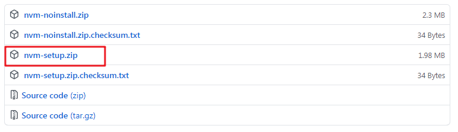
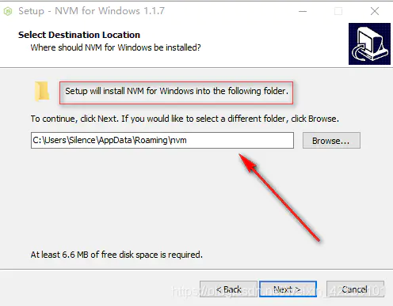
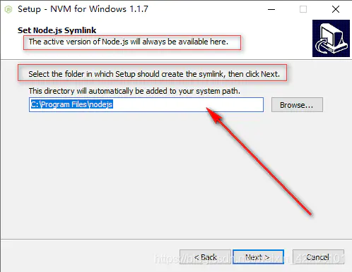
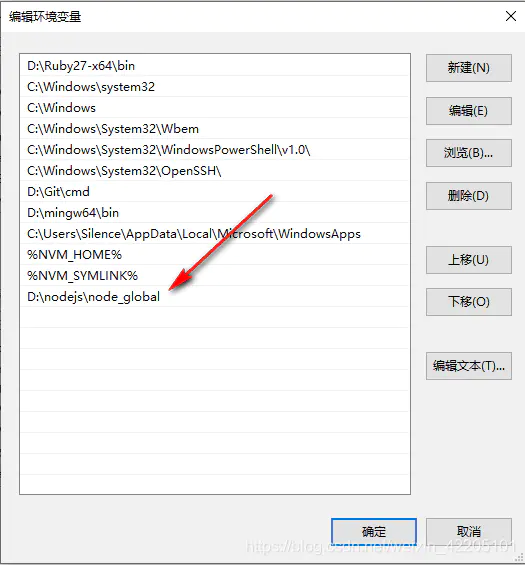

# nvm

> 我们一般安装的是最新版本的`node`,但是有时候，我们又需要使用低版本的`node`,在不借助第三方工具的情况下，我们只能卸载现有版本,安装需要的版本，这样显然很麻烦，今天就来介绍一个`windows`系统使用的`node`多版本管理工具`nvm`，全称是`node.js version management`,可以在多个`node`版本之间自由切换

## 下载

[下载地址](https://github.com/coreybutler/nvm-windows/releases)



## 安装nvm

**注意：安装之前必须完全卸载已安装的node**

解压`.zip`压缩包，双击`nvm-setup.exe`开始安装，下面两个步骤需要注意：

- 这里是设置`nvm`的安装路径

	

- 这里是设置使用`nvm`安装`node`时，`node`的安装路径

	

安装完成后，在`CMD`命令窗口输入`nvm -v`，检查是否安装成功。

## 修改nvm配置文件（可选）

`nvm`安装完成后，打开`nvm`安装目录下的`settings.txt`文件:

```txt
root: D:\nvm
path: D:\nodejs 
arch: 64 
proxy: none
node_mirror: http://npm.taobao.org/mirrors/node/
npm_mirror: https://npm.taobao.org/mirrors/npm/
```

`root`和`path`分别是`nvm`和`node`的安装路径，这两个不要动，这是之前安装时根据你选择的路径自动生成的，这个配置文件默认也只有这两项。因为我没改配置文件，所以后面的4项我都没有，只是后来搜到了，就说一下，`arch`表示安装的`node`是多少位，`proxy`是设置代理，`node_mirror`是更改`nvm`下载`node`时的镜像，这里是设置为淘宝镜像，`npm_mirror`是更改`npm`下载依赖包的镜像，也是修改为了淘宝镜像。

## 安装node

+ 使用`nvm list available`：查看`nvm`支持安装的`node`版本
+ 使用`nvm install 版本号`安装指定版本`node`
+ 分别使用`node -v`和`npm -v`，检测`node`和`npm`是否安装成功

## 切换node版本

初次使用`nvm`安装`node`之后，必须先使用`nvm use 版本号`切换到已安装版本的`node`才可以

## 配置node

### 修改全局依赖包下载路径

我上面将`node`安装在`D`盘，但是如果使用`node`安装全局依赖包的话，它还是会把依赖包下载到`C`盘下，所以我这里修改一下，分别执行以下两条`CMD`指令，修改使用`npm`下载全局依赖包的下载目录和缓存目录

```shell
npm  config set prefix "D:\nodejs\node_global"
```

```shell
npm  config set cache "D:\nodejs\node_cache"
```

执行完成会在我的`D:\nodejs`下创建`node_global`目录，`node_cache`目录是缓存目录，在使用`npm`下载依赖包后会生成

### 查看修改结果

因为我修改了全局依赖包的下载目录，所以要把该目录添加到环境变量，否则，使用全局指令是就会报错。如果你没修改全局依赖包的下载目录，这一步可以跳过。



## 多版本node切换

可以使用`nvm list`查看当前安装和使用的nodejs的版本。

使用`nvm use 版本号`可以切换不同的node版本

## nvm常用指令

```txt
* nvm list 是查找本电脑上所有的node版本
* nvm list 查看已经安装的版本
* nvm list installed 查看已经安装的版本
* nvm list available 查看网络可以安装的版本
* nvm install 安装最新版本nvm
* nvm use <version> ## 切换使用指定的版本node
* nvm ls 列出所有版本
* nvm current显示当前版本
* nvm alias <name> <version> ## 给不同的版本号添加别名
* nvm unalias <name> ## 删除已定义的别名
* nvm reinstall-packages <version> ## 在当前版本node环境下，重新全局安装指定版本号的npm包
* nvm on 打开nodejs控制
* nvm off 关闭nodejs控制
* nvm proxy 查看设置与代理
* nvm node_mirror [url] 设置或者查看setting.txt中的node_mirror，如果不设置的默认是 https://nodejs.org/dist/
* nvm npm_mirror [url] 设置或者查看setting.txt中的npm_mirror,如果不设置的话默认的是： https://github.com/npm/npm/archive/.
* nvm uninstall <version> 卸载制定的版本
* nvm use [version] [arch] 切换制定的node版本和位数
* nvm root [path] 设置和查看root路径
* nvm version 查看当前的版本
```


参考：[使用nvm实现多版本node自由切换](https://www.jianshu.com/p/a3882e9916e3)


## Windows平台下卸载nodejs

1. 在【卸载程序】中卸载程序和功能

在桌面左下角单击【开始】按钮，然后选择【控制面板】，在控制面板窗口中找到【卸载程序】，单击打开。打开后可以看到所有已经安装的程序，找到node.js，然后单击右键选择【卸载】等待一会后系统就会提示卸载完成。

2. 重新启动（或者您可能会从任务管理器中杀死所有与节点相关的进程）。

3. 寻找这些文件夹并删除它们（及其内容）（如果还有）。根据您安装的版本，UAC设置和CPU架构，这些可能或可能不存在：

```txt
C:\Program Files (x86)\Nodejs
C:\Program Files\Nodejs
C:\Users{User}\AppData\Roaming\npm（或%appdata%\npm）
C:\Users{User}\AppData\Roaming\npm-cache（或%appdata%\npm-cache）
```

4. 检查您的%PATH%环境变量以确保没有引用Nodejs或npm存在。

5. 如果仍然没有卸载，请在命令提示符下键入`where node`，您将看到它所在的位置 - 删除（也可能是父目录）。

6. 重新启动


## 可能出现的坑

### 1.坑一

安装前一定要彻底卸载原来的node。

### 2.坑二

如果出现乱码现象可能是因为 nvm 和 node 没有安装在 C盘的原因

### 3.坑三

如果在使用`npm i `下载安装包的时候下载不了，可以尝试更改一下 nvm 安装目录下的`settins.txt`配置文件，加上下载源

```txt
node_mirror: https://npm.taobao.org/mirrors/node/
npm_mirror: https://npm.taobao.org/mirrors/npm/
```