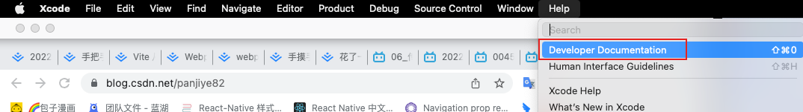
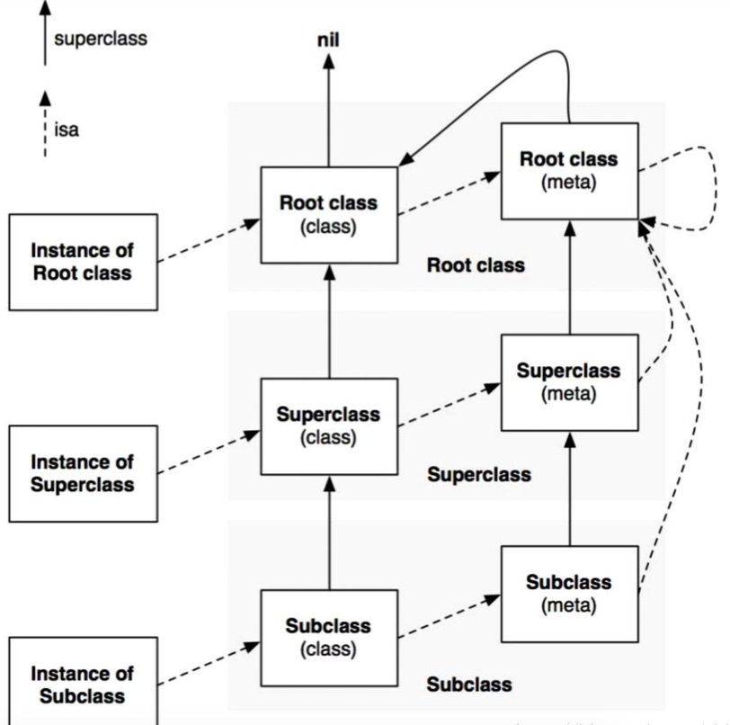
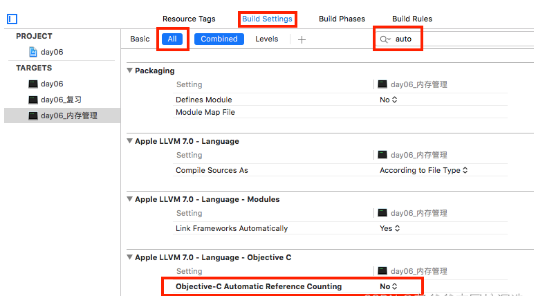
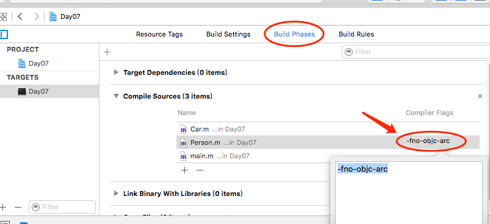
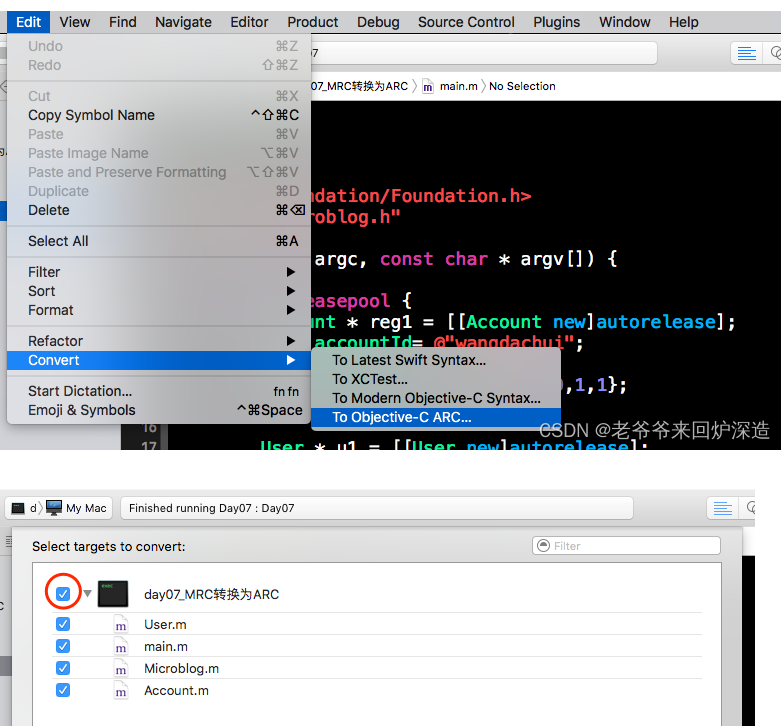
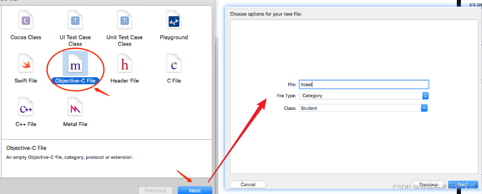
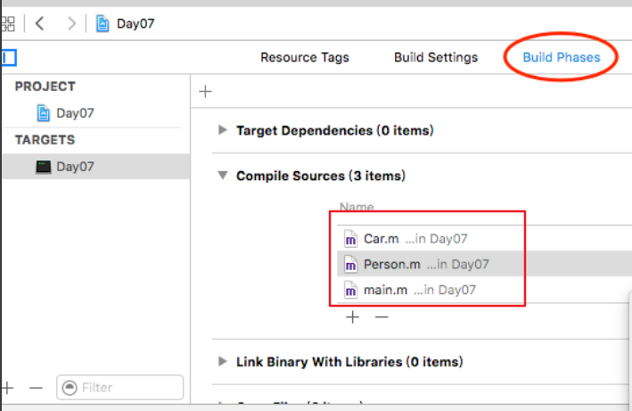

## objective-c 基本概念

objective-c 简称 oc ，是在C的基础上新增了1小部分面向对戏那个的语法，将C的复杂、繁琐的语法封装的更为简单，而且OC是完全兼容 C
+ `#import` 指令：同1个文件无论#import多少次. 最终都只会包含1次 不会出现重复包含的情况.
+ NSLog函数：自动换行，会输出一些其他的调试信息.

## 数据类型
oc 中的数据类型有是完全兼容 c 中的类型的，在oc 中也有很多自己的数据类型
+ BOOL : YES ｜ NO
+ Boolean : true | false
+ class : 类
+ id : 万能指针
+ nil : 空指针
+ SEL : 选择器
+ block : 块

## 类和对象

### 定义类

类的声明
```objc
@interface 类名 : NSObject
{
  //属性默认是私有的
  //使用@public 之后的变量都是public的
  类型 属性;
}
- (方法返回值类型)方法名;
- (方法返回值类型)方法名:(参数类型)参数名1 :(参数类型)参数名2;
- (方法返回值类型)方法名:(参数类型)参数名1 and:(参数类型)参数名2;
@end
```
类的实现
```objc
@implementation 类名
- (方法返回值类型)方法名{
  //todo...
}
- (方法返回值类型)方法名:(参数类型)参数名1 :(参数类型)参数名2{
  //todo...
}
- (方法返回值类型)方法名:(参数类型)参数名1 and:(参数类型)参数名2{
  //todo...
}
@end
```
使用
```objc
#import <Foundation/Foundation.h>

@interface Person : NSObject
{
  //属性默认是私有的
  //使用@public 之后的变量都是public的
  @public
  NSString *_name;
  int _age;
  float _height;
  BOOL _sex;
}
- (void)say;
- (void)saySomething:(NSString *)something;
- (void)eatSomething:(int)count :(NSString *)something;
- (void)eatWith:(NSString *)food1 and:(NSString *)food2;
@end

@implementation Person
- (void)say
{
  // 在方法中可以直接访问 属性
  // 谁调用了这个方法，那么访问到的变量就是谁的
  // 可以通过 self->_name 访问也可以通过 _name 直接访问
  NSLog(@"Person say 'my name is %@'",_name);
}
/*
方法名叫 saySomething:
参数 (NSString *)something
*/
- (void)saySomething:(NSString *)something
{
  NSLog(@"Person say %@",something);
}
/*
方法名叫 eatSomething: :
参数 (int)count (NSString *)something
*/
- (void)eatSomething:(int)count :(NSString *)something
{
  NSLog(@"Person eat %d %@",count,something);
}
/*
方法名叫 eatWith: and:
参数 (NSString *)food1 and:(NSString *)food2
*/
- (void)eatWith:(NSString *)food1 and:(NSString *)food2
{
  NSLog(@"Person eat %@ and %@",food1,food2);
}
@end


int main(int args,char *argv[]){
  //实例化就是调用 new方法的过程
  Person *p = [Person new];
  p->_name = @"jack";
  p->_age = 1;
  (*p)._height = 180.f;

  NSLog(@"Person _name:%@",p->_name);
  NSLog(@"Person _age:%d",p->_age);
  NSLog(@"Person _age:%f",p->_height);

  [p say];
  [p saySomething:@"爱你"];
  [p eatSomething:3 :@"fish"];
  [p eatWith:@"coffe" and:@"fish"];

  return 0;
}
```
**总结**
+ 访问属性 可以使用 `对象->属性名` 或者 指针的`.`进行访问` (*对象).属性名`
+ 访问属性需要用 `[对象 方法名:参数1 :参数2]`

+ 对于属性的名方法和规范
  + `类型 _变量名`;

+ 对于方法的命名方法和规范
  + `- (返回类型)方法名:(参数类型)参数名 :(参数类型)参数名`
  + 方法名的命名规范：`动作With:(参数类型)参数名 and:(参数类型)参数名`
+ 在类中可以使用 `self`来访问自己的方法，`self`是一个指针，指向类的实例对象

## 对象在内存中的存储

### 内存中的五大区域
+ 栈：存储局部变量.
+ 堆：程序员手动申请的字节空间 malloc calloc realloc函数.
+ BSS段：存储未被初始化的全局变量 静态变量.
+ 数据段(常量区)：存储已被初始化的全局 静态变量 常量数据.
+ 代码段：存储代码. 存储程序的代码.

### 类加载
+ 在创建对象的时候 肯定是需要访问类的
+ 在创建对象的时候 肯定是需要访问类的

在程序运行期间 当某个类第1次被访问到的时候. 会将这个类存储到内存中的代码段区域.这个过程叫做类加载.只有类在第1次被访问的时候,才会做类加载. 一旦类被加载到代码段以后. 直到程序结束的时候才会被释放.

### 对象在内存中究竟是如何存储的
```objc
Person *p1 = [Person new];
```
+ Person *p1; 会在栈内存中申请1块空间. 在栈内存中声明1个Person类型的指针变量p1。p1是1个指针变量.  那么只能存储地址.
+ `[Person new]` 真正在内存中创建对象的其实是这句代码.

**new做的事情**
+ 在堆内存中申请1块合适大小的空间.
+ 在这个空间中根据类的模板创建对象 
  + 类模板中定义了什么属性.就把这些属性依次的声明在对象之中.对象中还有另外1个属性 叫做isa 是1个指针. 指向对象所属的类在代码段中的地址
+ 初始化对象的属性
  + 如果属性的类型是基本数据类型 那么就赋值为0
  + 如果属性的类型是C语言的指针类型 那么就赋值为NULL
  + 如果属性的类型是OC的类指针类型9 那么就赋值为nil
+ 返回对象的地址

### 为什么不把方法存储在对象之中?
因为每1个对象的方法的代码实现都是一模一样的  没有必要为每1个对象都保存1个方法 这样的话就太浪费空间了.既然都一样 那么就只保持1份.

### nil与NULL
+ NULL：只能作为指针变量的值. 如果1个指针变量的值是NULL值代表. 代表这个指针不指向内存中的任何1块空间，NULL其实等价于0  NULL其实是1个宏. 就是0
+ nil：只能作为指针变量的值. 代表这个指针变量不指向内存中的任何空间. nil其实也等价于0 也是1个宏. 就是0. 所以, NULL和nil其实是一样的 。
+ 使用建议：虽然使用NULL的地方可以是nil 使用 nil的地方可以使用NULL 但是不建议大家去随便使用.

**C指针用NULL**
```objc
int *p1 = NULL; //p1指针不指向内存中的任何1块空间.
```
**OC的类指针用nil**
```objc
Person *p1 = nil; //p1指针不指向任何对象.
```

**注意**

+ 对象中只有属性,而没有方法. 自己类的属性外加1个isa指针指向代码段中的类.
+ 如何访问对象的属性，
  + 指针名->属性名; 根据指针 找到指针指向的对象 再找到对象中的属性来访问
+ 如何调用方法
  + `[指针名 方法名];`先根据指针名找到对象,对象发现要调用方法 再根据对象的isa指针找到类.然后调用类里的方法.


## 分组导航标记

分组导航标记:

+ `#pragma mark 分组名`就会在导航条对应的位置显示1个标题.
+ `#pragma mark -` 就会在导航条对应的位置显示1条水平分隔线.
+ `#pragma mark - 分组名`  就会在导航条对应的位置先产生1条水平分割线.再显示标题.


## 方法与函数

我们之前在C中学习的函数,就叫做函数，在OC类中写的方法.就叫做方法

### 相同点

都是用来封装1段代码的. 将1段代码封装在其中, 表示1个相对独立的功能， 函数或者方法只要被调用.那么封装在其中的代码就会被自动执行.

### 不同点

+ 语法不同.
+ 定义的位置不一样，OC方法的声明只能写在@interface的大括号的外面,实现只能写在@implementation之中，函数除了在函数的内部和@interface的大括号之中 其他的地方都是可以写，就算把函数写在类中 这个函数仍然不属于类 所以创建的对象中也没有这个函数，注意; 函数不要写到类中.虽然这样是可以的 但是你千万不要这么做 因为这么做是极度的不规范的.
+ 调用的方式也不一样，函数可以直接调用，但是 方法必须要先创建对象 通过对象来调用.
+ 方法数是属于类的

### 注意点

+ `@interface`是类的声明. `@implementation`是类的实现 他们之间不能相互嵌套
+ 类必须要先声明然后再实现
+ 类的声明和实现必须都要有 就算没有方法 类的实现也不必不可少的
+ 类的声明必须要放在使用类的前面  实现可以放在使用类的后面
+ 声明类的时候 类的声明和实现必须要同时存在，特殊情况下可以只有实现 没有声明（虽然可以这样,但是我们平时在写类的时候千万不要这么写 因为这么写是极度不规范的）
+ 属性名一定要以下划线开头 这是规范. 否则后面的知识点你就对不上号， 类名 每1个单词的首字母大写
+ 属性不允许声明的时候初始化 在为类写1个属性的时候 不允许在声明属性的时候为属性赋值.
+ OC方法必须要创建对象通过对象名来调用
+ 方法只有声明 没有实现
	+ 如果方法只有声明 没有实现  编译器会给1个警告  不会报错.
	+ 如果指针指向的对象 有方法的声明 而没有方法的实现 那么这个时候通过指针来调用这个方法，在运行的时候  就会报错（`unrecognized selector sent to instance 0x100420510` 只要你看到了这个错误.说明要么对象中根本就没有这个方法. 要么只有方法的声明而没有方法的实现）

### 多参数和省类参数

在定义方法和函数的时候，一般也需要指定有多少个参数，并且定义了的参数必须要传递。比如

```objc
void testLog(NSString format,NSObject data){
  NSString *log = [NSString stringWithFormat:format,data];
  NSLog(log);
}
```

在Objective-C中，我们会遇到很多像NSLog这样的函数，其中参数的个数不确定，由程序员自由控制，在初始化数组，字典等方面应用广泛，要自定这种函数需要先了解几个概念

+ `va_list`,C语言中定义的一个指针，用于指向当前的参数。
+ `va_start(ap,param)` 这个宏是初始化参数列表，其中第一个参数是va_list对象，第二个参数是参数列表的第一个参数
+ `va_arg(ap, type)` 一个用于取出参数的宏，这个宏的第一个参数是va_list对象，第二个参数是要取出的参数类型。
+ `va_end(ap)` 这个宏用于关闭取参列表

**多参函数的取参原理**

在编写我们自己的多参函数之前，明白函数的取参原理是十分重要的，首先，函数的参数是被放入我们内存的栈段的，而且放入的顺序是从后往前放入，比如如果一个函数参数如下

```objc
void func(int a,int b,int c,int d)
```

那么传递参数的时候参数d先入栈，接着是c、b、a。如此这样，在取参的时候，根据堆栈的取值原则，则取值顺序为a、b、c、d。所以在原理上，只要我们知道第一个参数的地址和每个参数的类型，我们就可以将参数都取出来。而上面介绍的几个宏，就是帮助我们做这些的

**声明与实现省略参数的多参函数**

```objc
//省略参数的写法
//"..."这个符号就是我们用来实现省略参数函数的符号
- (void)myLog:(NSString *)str,...{
  
  //创建一个列表指针对象
  va_list list;
  
	////进行列表的初始化，str为省略前的第一个参数，及...之前的那个参数
  va_start(list, str);

  NSString * temStr = str;

	//如果不是nil，则继续取值
  while (temStr!=nil) {

    NSLog(@"%@",temStr);

		//返回取到的值，并且让指针指向下一个参数的地址
    temStr = va_arg(list, NSString*);
  }
	//关闭列表指针
  va_end(list);
}
```

注意，调用时，我们必须在参数的最后加上nil这个判断结束的条件

```objc
[self myLog:@"312",@"321",nil];
```

这里的nil是我们在调用函数时手动加上的，可是系统的许多函数在我们调用时，系统直接帮我们加上了参数结尾的那个nil

```objc
- (void)myLog:(NSString *)str,... NS_REQUIRES_NIL_TERMINATION{
  //....
}
```


## 多文件开发

把1个类写在1个模块之中. 而1个模块至少包含两个文件.

` .h 头文件`

写的类声明 因为要用到Foundation框架中的类 NSObject 所以在这个头文件中要引入Foundation框架的头文件 然后将类的声明的部分写在.h文件中

` .m 实现文件`

先引入模块的头文件 这样才会有类的声明,再写上类的实现。如果要用到类. **只需要引入这个了模块的头文件就可以直接使用了**

> **添加类模块的更简洁的方式**
>
>  `NewFile->Cocoa Class` 自动生成模块文件  .h  .m 。自动的将类的声明和实现写好


### 枚举或者结构体定义在什么地方

如果只是1个类要用。那么就定义在这个类的头文件中。 如果多个类要用，那么就定义在单的头文中，谁要用谁就去引用。


## 异常处理

### 什么是异常

程序可以编译 链接 执行，当程序在执行的时候 处于某种特定条件下 程序的执行就会终止.

**异常的后果**: 程序会立即崩溃.程序立即终止运行.并且后面的代码不会执行了

### 如何处理异常

为了让程序在执行的时候如果发生了异常而不崩溃 而是继续往下执行

```objc
@try
{
	//可能出错的代码
}
@catch(NSException *ex)
{
	//当出现错误时执行,之后程序不回崩溃，会继续往下执行
}
@finally
{
  //无论是否出错都会执行
}
```


## 类方法

**在1个Target中无法访问另外1个Target中的类**

### OC中的方法分为两种

#### **对象方法/实例方法**

如果想要调用对象方法就必须要先创建对象 通过对象名来调用.

**类方法**

类方法的调用不依赖于对象.如果要调用类方法 不需要去创建对象.而是直接通过类名来调用

### 声明

对象方法的声明

```objc
// - (返回值类型)方法名
- (void)sayHi;
```

类方法的声明

```objc
// + (返回值类型)方法名;
+ (void)sayHi;
```

### 调用

+ 对象方法: 先创建对象 再通过对象名来调用.
+ 类方法: 不需要通过对象名来调用 所以如果要调用类方法不需要创建对象,而是直接使用类名来调用`[类名 类方法名];`

### 类方法的特点

 1). 节约空间: 因为调用类方法不需要创建对象. 这样就节约了空间.

 2). 提高效率: 因为调用类方法不需要拐弯 直接找到类 直接执行类中的类方法.

**在类方法中不能直接访问属性**

+ 属性是在对象创建的时候.跟随着对象一起创建在对象之中.

+ 类第1次被访问的时候,会做类加载. 是把类的代码存储在代码段

因为属性只有在对象创建的时候才会创建在对象之中，而类方法在执行的时候.有可能还没有对象. 对象都没有 你访问个毛的属性，虽然不能直接访问属性. 但是我们可以在类方法中创建1个对象 访问这个对象的属性.

> 什么时候我们可以将方法定义为类方法呢?
>
> 如果方法**不需要直接访问属性 也不需要直接调用其他的对象方法**，那么我们就可以将这个方法定义为类方法，这样就 节约空间 提高效率.

### 关于类方法的规范

如果我们写1个类,那么就要求为**这个类提供1个和类名同名的类方法**

```objc
@interface Person : NSObject
{
  NSString *_name;
}
// + (Person *)person;
+ (instancetype)person;
@end
@implementation Person : NSObject
{
  NSString *_name;
}
+ (instancetype)person{
  Person *p = [Person new];
  return p;
}
@end
```

**如果方法的返回值是当前类的对象,那么方法的返回值就写*instancetype***

***如果你希望创建爱的对象的属性的值由调用者指定 那么就为这个类方法带参数***：`类名WithXXX: ......`


## 属性的封装

### **封装**

类就是更高级别的封装.类将数据和行为封装为了1个整体.

+ 屏蔽内部的实现.外界不需要知道内部是如何实现的 只需要知道这个对象有什么用.
+ 方便操作
+ 后期的维护十分的便利

### 如何实现封装

+ 将属性的@public去掉.因为一旦写上@public就意味着外界可以直接访问对象的这个属性.
+ 为类提供1个方法,这个方法专门为这个属性赋值.这个方法我们叫做**setter**
+ 为类提供1个方法,这个方法专门获取属性值.这个方法我们叫做**getter**

```objc
@interface Student : NSObject
{
    NSString *_name;
    int _age;
}
-(void)setName:(NSString*)name;
-(NSString*)name;
-(void)setAge:(int)age;
-(int)age;
```


## Xcode文档

苹果提供了很多很多的框架.框架中有很多类 很多的函数 提供了一些数据类型，可以在xcode 的`help->developer Documentation`中查看文档说明




## static关键字

+ static不能修饰属性 也不能修饰方法.
+ static可以修饰方法中的局部变量。如果方法中的局部变量被static修饰,那么这个变量就会被变成静态变量，存储在常量区 当方法执行完毕之后 不会回收 下次再执行这个方法的时候 直接使用 而不会再声明了

## self关键字

**self用在对象方法中**指向当前对象，**slef用在类方法中**（在类方法中 self也是1个指针.执行当前这个类在代码段中的地址）指向当前这个类

> **取到类在代码段中的地址的方式**
>
> + 调试查看对象的isa指针的值.
> + 在类方法中查看self的值
> + 调用对象的对象方法class 就会返回这个对象所属的类在代码段中的地址
> + 调用类的类方法class 就会返回这个类在代码段中的地址.

## 继承

儿子类想拥有父亲类中的所有的成员.但是不想自己去定义,而是想凭空拥有.

```objc
@interface 类名 : 父亲类的名称

@end
```

子类一旦从父类继承 就意味着子类拥有了父类的所有的成员 而不用自己去定义，如果有1个成员不是所有的子类都拥有的.那么这个成员就不应该定义在父类之中

**什么时候应该使用继承?**

如果发现另外1个类中的成员我也想有 那么这个时候就可以使用继承，千万不要为了继承而去继承. 不要为了仅仅是得到某个类的成员你就不顾伦理去乱继承.

凡是满足is a关系的类 就可以拥有继承的关系，比如`Student is a Person`

### 继承的特点

1. 单根性，**1个类只能有1个父类** 不能有多个父类.
1. 传递性，A类从B类继承,B类从C类继承. 那么A类就同时拥有B、C类的成员.
1. NSObject类是Foundation框架中的类.在这个类中有1个类方法new**这个方法是用来创建对象的.**方法的返回值是创建的这个对象的指针，也就是说,如果要创建类的对象,就必须要调用这个new方法

### 关于子类和父类同名属性

1. **子类中不能存在和父类同名的属性**.

     因为子类从父类继承,就意味着子类拥有了父类的所有的成员 包括属性和方法.

     也就相当于子类中其实已经定义了.

     如果子类再定义1个同名的属性 很明显就冲突了.

  2. **super关键字.**
     1). 可以用在类方法和对象方法之中.

     2). 在对象方法中可以使用super关键字调用当前对象从父类继承过来的对象方法.

     3). 在类方法中 super关键字可以调用当前类从父类继承过来的类方法.

     ​	a. 类方法也能被子类继承. 父类中的类方法可以使用父类名来调用 也可以使用子类名调用.

     ​	b. 在子类的类方法中 可以使用super关键字调用父类的类方法.

     4). super只能用来调用父类的对象方法或者类方法  不能用来访问属性.

  3. **子类从父类继承.**
     1). 相当于子类模板中拥有了父类模板中的所有的成员.

     2). 创建1个子类对象,仍然是根据子类模板来创建对象.

     ​	只不过子类模板中拥有父类模板中的成员.

     ​	所以,子类对象中既有子类的成员也有父类的成员.

     3). super特指这个方法是从父类继承过来的.

     ​	 super是指当前类或者对象的这个方法是从父类继承过来的.

### 访问修饰符

+ `@private`: 私有 被`@private`修饰的属性只能在本类的内部访问.只能在本类的方法实现中访问
+ `@protected`: 受保护的. 被`@protected`修饰的属性只能在本类和本类的子类中访问
+ `@package`: 被`@package`修饰的属性 可以在当前框架中访问
+ `@public`: 公共的.被`@public`修饰的属性 可以在任意的地方访问

如果不为属性指定访问修饰符 那么默认的就是`@protected`，**访问修饰符只能用来修饰属性 不能用来修饰方法**

**子类仍然可以继承父类的私有属性**

只不过,在子类中无法去直接访问从父类继承过来的私有属性，但是如果父类中有1个方法再为属性赋值或者取值，那么子类可以调用这个方法间接的访问父类的私有属性.

### 私有方法

方法不写声明,只写实现. 那么这个方法就是1个私有方法，只能在本类的其他方法中调用 不能再外界调用.

### **里氏替换原则--- LSP**

**当1个父类指针指向1个子类对象的时候,这里就有里氏替换原则.**

子类可以替换父类的位置.并且程序的功能不受影响，因为父类中拥有的成员 子类都有. 所以不会影响程序的功能

比如`Student`继承了`Person`

```objc
Person *p = [Student new];
```

访问特点：

+ 只能访问`Person`类中有定义的方法和属性，而`Student`类中定义的独有的属性和方法无法访问（也就是说**只能访问具有共性的东西**）
+ 如果`Student`类中重写`Person`类的方法，那么访问的就是重新之后的方法

### 方法重写

子类继承了父类的方法,就意味着子类拥有了这个功能，有的时候: 虽然子类也拥有父类的这个行为. 但是这个行为的具体的实现和父类不同（多态）

如何重写：***直接在类的实现中将这个方法重新实现一遍就可以了***

### description

```objc
Student *stu = [Student new];
// %p 打印的是指针变量的值
NSLog("%p",stu);
// %@ 打印的是指针指向的对象.
NSLog("%@",stu);
```

`NSLog("%@",p);`原理：

+ 调用传入的对象的 description方法.
+ 拿到这个方法的返回值 这个返回值是1个字符串
+ 将这个字符串输出.

description方法是定义在NSObject类之中的，所以我们可以通过重写来自定义输出

```objc
@implementation Student
- (NSString *)description{
  return [NSString stringWithFormat:@"name %@",_name];
}
@end
```


### 继承的本质

子类对象中有自己的属性和所有父类的属性，代码段中的每1个类都有1个叫做**isa的指针**,这个**指针指向它的父类一直指到NSObject**

```OBJC
 [p1 sayHi];  //假设p1是Person对象.
```

先根据p1指针找到p1指向的对象,然后根据对象的isa指针找到Person类，搜索Person类中是否有这个sayHi方法 如果有执行，如果没有 就根据类的isa指针找父类NSObject 中如果没有就报错


## 类的本质

### 类什么时候加载到代码段?

类第1次被访问的时候,类就会被加载到代码段存储 类加载

### 类是以什么样的形式存储在代码段的?

 在代码段中存储类的步骤

1. 先在代码段中创建1个Class对象, Class是Foundation框架中的1个类，这个Class对象就是用来存储类信息的
2. 将类的信息存储在这个Class对象之中，这个Class对象.至少有3个属性
	1. 类名: 存储的这个类的名称.
	2. 属性s: 存储的这个类具有哪些属性
	3. 方法s: 存储的这个类具有哪些方法.

所以.**类是以Class对象的形式存储在代码段的**

存储类的这个Class对象 我们也叫做类对象. 用来存储类的1个对象

所以,存储类的类对象也有1个叫做isa指针的属性 这个指针指向存储父类的类对象


### 如何拿到存储在代码段中的类对象

1. 调用类的类方法 class 就可以得到存储类的类对象的地址
2.  调用对象的对象方法 class 就可以得到存储这个对象所属的类的Class对象的地址.
3. 对象中的isa指针的值其实就是代码段中存储类的类对象的地址.

注意：声明Class指针的时候 不需要加* 因为在typedef的时候已经加了*了.

### 如何使用类对象

```objc
Class c1 = [Person class];
[c1 sayHi];
```

c1对象就是Person类,所以在使用Person的地方完全可以使用c1代替,完全可以使用c1来调用. 因为c1就是Person

**可以使用类对象来调用new方法 创建存储在类对象中的类的对象**

```objc
Person *p1 = [Person new];
//----------等价于-----------------
Class c1 = [Person class];
Person *p2 = [c1 new];
```

## SEL

SEL 全称叫做 **selector** 选择器，

SEL 是1个数据类型. 所以要在内存中申请空间存储数据

SEL其实是1个类. SEL对象是用来存储1个方法的

### 类是以Class对象的形式存储在代码段之中

类名:存储的这个类的类名. NSString，还要将方法存储在类对象之中.如何将方法存储在类对象之中.

1. 先创建1个SEL对象.
2. 将方法的信息存储在这个SEL对象之中.
3. 再将这个SEL对象作为类对象的属性.

### 拿到存储 方法的SEL对象

因为SEL是1个typedef类型的 在自定义的时候已经加`*`了，所以 我们在声明SEL指针的时候 不需要加`*`

**取到存储方法的SEL对象**`SEL s1 = @selector(方法名);`

**用字符串来找方法** `SEL　变量名　=　NSSelectorFromString(方法名字的字符串);`

**用SEL变量反向查出方法名字字符串** `NSString　*变量名　=　NSStringFromSelector(SEL参数);`


###  调用方法的本质

` [p1 sayHi];`

 内部的原理:

1. 先拿到存储sayHi方法的SEL对象，也就是拿到存储sayHi方法的SEL数据. SEL消息
2. 将这个SEL消息发送给p1对象
3. 这个时候,p1对象接收到这个SEL消息以后 就知道要调用方法
4. 根据对象的isa指针找到存储类的类对象
5. 找到这个类对象以后 在这个类对象中去搜寻是否有和传入的SEL数据相匹配的，如果有 就执行  如果没有再找父类 直到NSObject

OC最重要的1个机制:**消息机制**，调用方法的本质其实就是为对象发送SEL消息，`[p1 sayHi]; `为p1对象发送1条sayHi消息

### 手动的为对象发送SEL消息

+ 先得到方法的SEL数
+ 将这个SEL消息发送给p1对象.

 调用对象的方法 将SEL数据发送给对象

```objc
- (id)performSelector:(SEL)aSelector;
```

```objc
Person *p1 = [Person new];
SEL s1 = @selector(sayHi);
[p1 performSelector:s1]; //与 [p1 sayHi]效果是完全一样的.
```

**注意事项**

 如果方法有参数 那么方法名是带了冒号的

```objc
// 一个参数
- (id)performSelector:(SEL)aSelector withObject:(id)object;
// 两个参数，如果有超过两个参数的可以将参数封装在一起再传递
- (id)performSelector:(SEL)aSelector withObject:(id)object1 withObject:(id)object2;
```

### 查找和调用流程

根据对象的isA指针去**该对象的类方法**中查找，如果找到了就执行，如果没有找到，就去该类的**父类类对象**中查找，如果没有找到就**一直往上找**，**直到根类（NSObject）**，如果都没有找到就报错（还有三次挽救的机会）




## 点语法

### 使用点语法来访问对象的属性

```objc
// 对象名.去掉下划线的属性名;
p1.name = @"jack";
NSString *name = p1.name;
```

### 点语法的原理

```objc
p1.age = 18;
```

 这句话的本质并不是把18直接赋值给p1对象的_age属性，点语法在编译器编译的时候.其实会将点语法转换为**调用setter、getter的代码**

当使用点语法赋值的时候. 这个时候编译器会将点语法转换为调用setter方法的代码

```objc
p1.age = 10;
// 转化为 --------------------------
[p1 setAge:10];
```

当使用点语法取值的时候.这个时候编译器会将点语法转换为调用getter方法的代码.

```objc
int age = p1.age;
// 转化为 --------------------------
int age = [p1 age];
```

### 注意

+ 不要在 `getter setter`中使用 点语法 因为会造成无限递归 而程序崩溃
+ 点语法在编译器编译的时候 会转换为调用setter getter方法的代码，所以要使用点语法必须要按规范实现属性的 `getter setter`方法。

## `@property`

以往按规范我们写1个类，基本有以下几个步骤

+ 要先为类写属性.
+ 在声明属性的getter setter
+ 再实现getter setter

这样非常麻烦，每定义一个属性都要手动是实现他的 getter 和setter 方法

而 `@property`可以**自动生成getter、setter方法的声明**，因为是生成方法的声明,所以应该写在`@interface`类的声明之中.(大括号之后)

```objc
@interface Pro : NSObject{
    NSString *_name;
    int _age;
    float _height;
}
// @property 数据类型 名称;
@property NSString *name;
@property int age;
@property float height;
@end
```

### 原理

编译器在编译的时候.会根据@property生成getter和setter方法的实现

```objc
@property int age;
// 转化为 --------------------------
- (void)setAge:(int)age;
- (int)age;
```

### 使用`@property`注意

+ `@property`的类型和属性的类型一致
+ `@property`的名称决定了生成的getter和setter方法的名称
+ @property只是生成getter和setter方法的声明. 实现还要自己来. 属性还要自己定义.


## `@synthesize`

`@property` 只能生成getter和setter的声明，实现还要我们自己来

`@synthesize`可以**自动生成getter、setter方法的实现.**

```objc
@interface Person : NSObject
{
    int _age;
}
@property int age;
@end
  
@implmentation Person
@synthesize age;
@end
```

### **`@synthesize`做的事情**

```objc
@implmentation Person
@synthesize age;
@end
// 转换为 ---------------------
@implementaion Person
{
    int age;
}
- (void)setAge:(int)age
{
    self->age = age;
}
- (int)age
{
    return age;
}
@end
```

+ 生成1个**真私有的属性**（在interface中定义的 `_age`属性在Person访问属性的时候是会有`_age `提示出来，上面的 age 属性就是真私有的属性，在访问Person属性的时候age不会给出提示，不能直接访问必须通过类内部的方法来间接访问）.属性的类型和`@synthesize`对应的`@property`类型一致，属性的名字和@synthesize对应的`@property`名字一致.
+ 自动生成setter方法的实现，实现的方式: 将参数直接赋值给自动生成的那个私有属性.并且没有做任何的逻辑验证
+ 自动生成getter方法的实现，实现的方式: 将生成的私有属性的值返回.

### 希望@synthesize不要去自动生成私有属性了

 getter setter的实现中操作我们已经写好的属性就可以了，不会再去生成私有属性，直接生成setter getter的实现

```objc
// @synthesize @property名称 = 已经存在的属性名;
@synthesize age = _age;
```

### 批量声明

如果多个`@property @synthesize`的类型一致. 可以批量声明

```objc
@property float height,weight;
@synthesize name = _name,age = _age,weight = _weight,height = _height;
```

## `@property`增强

Xcode4.4之前，`@property`只是生成getter  setter 的声明。`@synthesize`是生成getter  setter 的实现

从Xcode4.4以后只需要写1个@property 编译器就会自动***生成私有属性***，***生成getter setter的声明.***，***生成getter setter的实现***

```objc
@property NSString *name;
```

可以**重写setter来自定义验证逻辑**.如果重写了setter 还会自动生成getter， 如果重写了getter 还会自动生成setter，**如果同时重写getter setter 那么就不会自动生成私有属性了.**，所以要自己私有属性。


### 继承

父类的`@property`一样可以被子类继承，`@property`生成的属性是私有的 在子类的内部无法直接访问生成的私有属性。但是*可以通过setter getter来访问*。


## 动态类型和静态类型

### OC是1门弱语言

编译器在编译的时候.语法检查的时候没有那么严格，不管你怎么写都是可以的`int num = 12.12;`

### 静态类型

指的是1个指针指向的对象是1个本类对象

### 动态类型

指的是1个指针指向的对象不是本类对象.

### 编译检查

 编译器在编译的时候,能不能通过1个指针去调用指针指向的对象的方法.

 **判断原则**: 看指针所属的类型之中是有这个方法,如果有就认为可以调用 编译通过，如果这个类中没有 那么编译报错，这个叫做**编译检查**. 在编译的时候 能不能调用对象的方法主要是看指针的类型， 我们可以将指针的类型做转换,来达到骗过编译器的目的

### 运行检查

编译检查只是骗过了编译器. 但是这个方法究竟能不能执行， 所以在运行的时候.运行时会去检查对象中是否真的有这个方法.如果有就执行 如果没有就报错误.

### 编译看左边，运行看右边

`Person *p = [Student new];`，调用方法时，编译检查是通过 = 左边的 `Person *p`类型指针来判断这个类型里面有没有相关的方法，而运行检查是通过 `[Student new]`实例对象来检测对象中是否有相关的方法的。

### LSP

父类指针指向子类对象， 实际上任意的指针可以执行任意的对象.编译器是不会报错的，当1个子类指针执行1个父类对象的时候,编译器运行通过子类指针去调用子类独有的方法。但是在运行的时候是会出问题的.因为父类对象中根本没有子类成员.

### id类型

**NSObject**

***是OC中所有类的基类***.根据LSP ***NSObject指针就可以指向任意的OC对象.*** ，***所以.NSObject指针是1个万能指针.可以执行任意的OC对象.***

缺点: *如果要调用指向的子类对象的**独有的方法**.就必须要做**类型转换.***

**id指针**

是1个**万能指针**,可以指向任意的OC对象，

+ id是1个typedef自定义类型 在定义的时候已经加了`*`。所以,声明id指针的时候不需要再加`*`了.
+ id指针是1个万能指针,任意的OC对象都可以指.

缺点：不能通过`->` 访问属性

### NSObject和id的异同

相同点: 万能指针 都可以执行任意的OC对象.

不同点: 通过NSObject指针去调用对象的方法的时候.编译器会做编译检查.

通过id类型的指针去调用对象的方法的时候,编译器直接通过.无论你调用什么方法.

注意: id指针只能调用对象的方法  不能使用点语法.如果使用点语法就会直接报编译错误 。

如果我们要声明1个万能指针 千万不要使用NSObject 而是使用id


### **instancetype**

```objc
@implementation Person
+ (id)person{
  return [Person new];
}
@end
```

1. 如果返回值写为父类类型的.那么子类来调用这个方法得到的就是父类指针
	解决的方式: 把返回值改为id类型的
2. 方法的内部创建的对象的是 不要写死. 因为写死创建的对象就固定了，我们希望那1个类来调用这个方法就创建那1个类的对象
3. 方法的返回值是id类型的.问题就是任意指针都可以接收这个方法的返回值，编译器连个警告都没有

如果方法的返回值是instancetype，代表方法的返回值是当前这个类的对象

```objc
@implementation Person
+ (instancetype)person{
  return [self new];
}
@end
```

###  id和instancetype的区别

+ instancetype只能作为方法的返回值.不能在别的地方使用，id既可以声明指针变量 也可以作为参数 也可以作为返回值.
+ instancetype 是1个有类型的 代表当前类的对象， id是1个无类型的指针 仅仅是1个地址.没有类型的指针.

### 动态类型检测

1. 编译检查. 编译器在编译的时候. 判断1个指针是否可以调用指向的对象的方法.判断的准则就是指针的类型.我们可以很轻松的把编译器给骗过.`Person *p = [Student new]`
  
 2. 就算骗过了编译器,程序在运行的时候还会做运行检查，我们写的程序就算编译通过了.不意味着可以完美的执行

我们就希望.我们可以写代码来先判断1下.对象中是否有这个方法.如果有再去执行,如果没有就别去执行.

**判断对象中是否有这个方法可以执行**

```objc
// - (BOOL)respondsToSelector:(SEL)aSelector;
Student *s1 = [Student person];
BOOL b1 = [s1 respondsToSelector:@selector(lenth)];
if (b1 == YES) {
  [s1 setName:@"王铁锤" andAge:30];
}
else{
  NSLog(@"没有方法");
}

//判断类中是否有指定的类方法
//+ (BOOL)instancesRespondToSelector:(SEL)aSelector;
Student *s1 = [Student person];
[s1 setName:@"王铁锤" andAge:30];

BOOL b1 = [Student instancesRespondToSelector:@selector(setName:andAge:)];
if (b1 == YES) {
  NSLog(@"name:%@  age:%d",s1.name,s1.age);
}
else{
  NSLog(@"不是Student类");
}
```

**判断指定的对象是否为 指定类的对象或者子类对象**

```objc
// - (BOOL)isKindOfClass:(Class)aClass;
Student *s1 = [Student person];
[s1 setName:@"王铁锤" andAge:30];

BOOL b1 = [s1 isKindOfClass:[Person class]];
if (b1 == YES) {
  NSLog(@"name:%@  age:%d",s1.name,s1.age);
}
else{
  NSLog(@"不是Person类");
}
```

**判断对象是否为指定类的对象 不包括子类**

```objc
// - (BOOL)isMemberOfClass:(Class)aClass;
Student *s1 = [Student person];
[s1 setName:@"王铁锤" andAge:30];

BOOL b1 = [s1 isMemberOfClass:[Student class]];
if (b1 == YES) {
  NSLog(@"name:%@  age:%d",s1.name,s1.age);
}
else{
  NSLog(@"不是Student类");
}
```

**判断类是否为另外1个类的子类**

```objc
// + (BOOL)isSubclassOfClass:(Class)aClass;
Student *s1 = [Student person];
[s1 setName:@"王铁锤" andAge:30];

BOOL b1 = [Student isSubclassOfClass:[Person class]];
if (b1 == YES) {
  NSLog(@"name:%@  age:%d",s1.name,s1.age);
}
else{
  NSLog(@"不是Student类");
}
```


## 构造方法

创建对象,我们之前说`类名 *指针名 =  [类名  new];`

new实际上是1个类方法.

**new方法的作用:**

+ 创建对象
+ 初始化对象
+ 把对象的地址返回

new方法的内部,其实是先调用的alloc方法. 再调用的init方法

alloc方法是1个类方法,作用: 那1个类调用这个方法 就创建那个类的对象,并把对象返回.

 init方法 是1个对象方法,作用: 初始化对象.

**创建对象的完整步骤:**

 应该是先使用alloc创建1个对象,然后再使用init初始化这个对象 才可以使用这个对象.

 虽然没有初始化的对象 有的时候 也可以使用. 但是千万不要这么做.

 使用1个未经初始化的对象是极其危险的.

```objc
Person *p1 = [Person new];
// 完全等价于
Person *p1 = [[Person alloc] init];
```


### init方法

作用: *初始化对象,为对象的属性赋初始值 这个init方法我们叫做***构造方法**

我们想要让创建的对象的属性的默认值不是` nil NULL 0`，而是我们自定义的那么这个时候,我们就可以重写init方法. 在这个方法中按照我们自己的想法为对象的属性赋值

 **重写init方法的规范**

1.  必须要先调用父类的init方法.然后将方法的返回值赋值给self
2. 调用init方法初始化对象有可能会失败,如果初始化失败.返回的就是nil
3. 判断父类是否初始化成功. 判断self的值是否为nil 如果不为nil说明初始化成功.
4. 如果初始化成功 就初始化当前对象的属性
5. 最后 返回self的值

### 为什么要调用父类的init方法

因为父类的init方法 会初始化父类的属性. 所以必须保证当前对象中的父类属性也同时被初始化

### 为什么要赋值给self

因为.调用父类的init方法 会返回初始化成功的对象，实际上返回的就是当前对象。**但是我们要判断是否初始化成功.**

```objc
- (instancetype)init
{
    if(self = [super init])
    {
     //初始化当前类的属性的代码;
    }
    retrun self;
}
// 只有可以直接调用 [Person new] 或者 [[Person alloc] init] 来进行实例化
```

### initWith先构造函数传递参数

1.  自定义构造方法的返回值必须是instancetype
2. 自定义构造方法的名称必须**以initWith开头**.
3. 方法的实现和init的要求一样

```objc
- (instancetype)initWithName:(NSString *)name andAge:(int)age
{
    if(self = [super init])
    {
     //初始化当前类的属性的代码;
    }
    retrun self;
}

// 实例化 [[Person alloc] initWithName:@"jack" andAge:15];
```


## 内存管理

### 内存中的五大区域

+ 栈: 局部变量. 当局部变量的作用域被执行完毕之后,这个局部变量就会被系统立即回收.
+ 堆: OC对象.使用C函数申请的空间.
+ BSS段: 未初始化的全局变量、静态变量. 一旦初始化就回收 并转存到数据段之中.
+ 数据段: 已经初始化的全局变量、静态变量. 直到程序结束的时候才会被回收.
+ 代码段: 代码. 程序结束的时候,系统会自动回收存储在代码段中的数据.

栈、BSS段、数据段、代码段存储在它们中的数据的回收,是由系统自动完成的.不需要我们干预.

分配在堆区中的OC对象,是肯定需要被回收的

 **iPhone 内存机制.**

+ 40M 警告
+ 45M 警告
+ 120M 闪退.

​     ***存储在堆中的OC对象,系统不会自动回收. 直到程序结束的时候才会被回收***

### 内存管理的范围

只需要管理存储在堆中的OC对象的回收.其他区域中的数据的回收是系统自动管理的.

### 引用计数器

+  每1个对象都有1个属性.叫做retainCount.叫做引用计数器. 类型是unsigned long 占据8个字节，
	+ 引用计数器的作用: 用来记录当前这个对象有多少个人在使用它，
	+ 默认情况下,创建1个对象出来 这个对象的引用计数器的默认值是1
+ 当多1个人使用这个对象的时候.应该先让这个对象的引用计数器的值+1 代表这个对象多1个人使用.
+ 当这个对象少1个人使用的时候.应该先让这个对象的引用计数器的值-1 代表这个对象少1个人使用.
+ 当这个对象的引用计数器变为0的时候.代表这个对象无人使用. 这个时候系统就会自动回收这个对象.

### 如何操作引用计数器

+ 为对象发送1条**retain**消息. 对象的引用计数器就会加1. 当多1个人使用对象的时候才发.
+ 为对象发送1条**release**消息.对象的引用计数器就会减1. 当少1个人使用对象的时候才发.
+ 为对象发送1条**retainCount**消息. 就可以去到对象的引用计数器的值.

### 内存管理的分类

**MRC**: Manual Reference Counting 手动引用计数.**手动内存管理**

**ARC**: Automatic Reference Counting  自动引用计数.**自动内存管理**

## 手动内存管理

### MRC程序

 iOS5开始. Xcode4.2开始就支持ARC，Xcode7 默认支持ARC开发，默认使用的开发方式就是ARC的模式

**关闭ARC开启MRC**



### 系统会自动回收对象

 在系统回收对象的时候.会自动的调用对象的dealloc方法.

 **重写dealloc方法的规范**:

 必须要调用父类的dealloc方法. 并且要放在最后一句代码

```objc
-(void)dealloc
{
    NSLog(@"名字叫做%@的人挂了",_name);
    [super dealloc];
};
```

### 引用计数器

新创建1个对象,这个对象的引用计数器的值默认是1，当对象的引用计数器变为0的时候.对象就会被系统立即回收 并自动调用**dealloc**方法

```objc
Person *p = [Person new];
p.name = @"jack";
NSUInteger count = [p1 retainCount];
NSLog(@"引用计数器是%d",count);
[p1 release];

//---------------------------------
输出: 1
      名字叫做jack的人挂了
```

### 内存管理的原则

**内存管理的重点**

+ 当多1个人使用这个对象的时候,应该先为这个对象发送retain消息
+ 当少1个人使用这个对象的时候.应该为这个对象发送1条release消息.

**注意：**在ARC机制下,retain release dealloc这些方法方法无法调用

**内存管理的原则**

1. 有对象的创建,就要匹配1个release
2. retain的次数和release的次数要匹配
3. 谁用谁retain. 谁不用谁release，谁负责retain 谁就负责relase
4. 只有在多1个人用的时候才retain 少1个人使用的时候才release

有始有终,有加就有减. 有retain就应该匹配1个release 一定要平衡.


### 野指针与僵尸对象

**野指针**

*C语言中的野指针*: 定义1个指针变量.没有初始化.这个指针变量的值是1个垃圾值,指向1块随机的空间.这个指针就叫做野指针.

*OC中的野指针*: 指针指向的对象已经被回收了.这样的指针就叫做野指针.


**对象回收的本质**

申请1个变量,实际上就是向系统申请指定字节数的空间.这些空间系统就不会再分配给别人了，当变量被回收的时候,代表变量占用的字节空间从此以后系统可以分配给别人使用了，但是字节空间中存储的数据还在

**回收对象**

所谓的对象的回收,指的是对象占用的空间可以分配给别人，当这个对象占用的空间没有分配给别人之前 其实对象数据还在


**僵尸对象**

 **1个已经被释放的对象,但是这个对象所占的空间还没有分配给别人.这样的对象叫做僵尸对象.**

我们通过野指针去访问僵尸对象的时候.有可能没问题 也有可能有问题.

当僵尸对象占用的空间还没有分配给别人的时候.这是可以的.

当僵尸对象占用的空间分配给了别人使用的时候 就不可以.

**只要对象称为了僵尸对象,无论如何 都不允许访问了**


### 避免僵尸对象错误

使用野指针访问僵尸对象会报错，如何避免僵尸对象错误？

**当1个指针称为野指针以后.将这个指针的值设置nil**，当1个指针的值为nil 通过**这个指针去调用对象的方法(包括使用点语法)的时候.不会报错**. 只是没有任何反应，但是如果通过**直接访问属性 -> 就会报错**.

***无法复活1个僵尸对象***


### 单个对象的内存管理

**如何保证单个对象可以被回收？**

1. 有对象的创建 就必须要匹配1个relase
2. retain次数和release次数一定要匹配
3. 只有在指针称为野指针的时候才赋值为nil
4. 在方法中不要随意的为传入的对象retain.

```objc
Person *p = [Person new];
//todo
[p release];
p = nil;
```


### 多个对象的内存管理

当属性是1个OC对象的时候. setter方法的写法

```objc
- (void)setCar:(Car *)car
{
    if(_car != car)
    {
       [_car release];//_car属性原本指向的对象少1个人使用．
      //将传入的车对象赋值给当前对象的＿car属性。
      //代表：传入的对象多了1个人使用。
      //那么就应该先为这个对象发送1条retain消息
      
       _car = [car retain];//为传进来的对象发送1条retain消息，代表多1个人使用
      //为传进来的对象发送1条retain消息，让他的引用计数器的值＋1 代表多1个人使用。
      //再将传入的对象赋值给当前对象的_car属性。
      //当我们将传入的Car对象赋值给_car属性的时候。
      //代表1:_car属性原本指向的对象少1个人使用．
      //代表2:传入的对象多1个使用．
    }
}
 
- (void)dealloc
{
    [_car releae];
    [super dealloc];
}
```

当发现新旧对象是同1个对象的时候.什么都不用做，只有当新旧对象不是同1个对象的时候 才release旧的 retain新的


### `@property`参数

`@property`可以带参数的 `@property(参数1,参数2,参数3......)数据类型 名称;`

+  与多线程相关的两个参数

	+ **atomic**: 默认值. 如果写atomic,这个时候生成的setter方法的代码就会被加上一把**线程安全锁.**，特点: ***安全、效率低下***
	+ **nonatomic**: 如果写nonatomic 这个时候生成的setter方法的代码就不会加线程安全锁，特点: ***不安全,但是效率高*****.**

+ 与生成的setter方法的实现相关的参数

	+ **assign**: 默认值 生成的setter方法的实现就是直接赋值

	+ **retain**: 生成的setter方法的实现就是标准的MRC内存管理代码

		+ 当属性的类型是OC对象类型的时候,那么就使用retain，当属性的类型是非OC对象的时候,使用assign

		+ 注意:只是生成标准的setter方法为标准的MRC内存管理代码 不会自动的再dealloc中生成relase的代码.

			所以, 我们还要***自己手动的在dealloc中release***

+ 与生成只读、读写的封装

	+ **getter = getter方法名字** 用来指定@property生成的getter方法的名字
	+ **setter = setter方法名字**.用来指定@property生成的setter方法的名字. 注意.setter方法是带参数的 所以要**加1个冒号**
	+ 在***使用点语法的时候***.编译器会转换为调用修改后的名字的代码


### `@class`

1. 当两个类相互包含的时候. 当Person.h中包含Book.h 而Book.h中又包含Person.h

     这个时候,就会出现循环引用的问题. 就会造成无限递归的问题,而导致无法编译通过.

  2. 解决方案: 

     其中一边不要使用#import引入对方的头文件.

     而是使用@class 类名; 来标注这是1个类.这样子就可以在不引入对方头文件的情况下,告诉编译器这是1个类.

`@class Car;`
     在.m文件中再#import对方的头文件.就可以使用了.

  3. @class与#import的区别

     1). #import是将指定的文件的内容拷贝到写指令的地方.

     2). @class 并不会拷贝任何内容. 只是告诉编译器,这是1个类,这样编译器在编译的时候才可以知道这是1个类.

### 循环retain

  1. 当两个对象相互引用的时候.

     A对象的属性是B对象  B对象的属性是A对象.

     这个时候 如果两边都使用retain 那么就会发生内存泄露.

  2. 解决方案: 1端使用retain 另外1端使用assign 使用assign的那1端在dealloc中不再需要release了


### 自动释放池

**自动释放池的原理**

存入到自动释放池中的对象,在自动释放池被销毁的时候.会自动调用存储在该自动释放池中的所有对象的release方法

将创建的对象,存入到自动释放池之中. 就不再需要手动的relase这个对象了，因为池子销毁的时候 就会自动的调用池中所有的对象的relase。

自动释放池的好处: **将创建的对象存储到自动释放池中,不需要再写release**

**如何创建自动释放池**

```objc
@autoreleasepool
{
//这对大括弧代表这个自动释放池的范围.
}
```

**如何将对象存储到自动释放池之中**

在自动释放池之中调用对象的autorelease方法.就会将这个对象存入到当前自动释放池之中

这个autorealse方法返回的是对象本身. 所以,我们可以这么写

```objc
@autoreleasepool
{
    Person *p1 = [[[Person alloc] init] autorelease];
}
```

这个时候,当这个自动释放池执行完毕之后,就会立即为这个自动释放池中的对象发送1条release消息

**注意**

+ 只有在自动释放池中调用了对象的autorelease方法,这个对象才会被存储到这个自动释放池之中, 如果只是将对象的创建代码写在自动释放之中,而没有调用对象的autorelease方法.是不会将这个对象存储到这个自动释放池之中的.
+ 对象的创建可以在自动释放池的外面,在自动释放池之中,调用对象的autorelease方法,就可以将这个对象存储到这个自动释放池之中
+ 当自动释放池结束的时候.仅仅是对存储在自动释放池中的对象发送1条release消息 而*不是销毁对象*.
+ 如果在自动释放池中,调用同1个对象的autorelease方法多次.就会将对象存储多次到自动释放池之中，在自动释放池结束的时候.会为对象发送多条release消息.那么这个是就会出现僵尸对象错误
+ 如果在自动释放池中,调用了存储到自动释放中的对象的release方法，在自动释放池结束的时候,还会再调用对象的release方法.，这个时候就有有可能会造成野指针操作
+ 将对象存储到自动释放池,并不会使对象的引用计数器+1
+ 自动释放池可以嵌套

### autorelease的规范

创建对象,将对象存储到自动释放池之中. 就不需要再去手动的realse

类方法的第1个规范:一般情况下,要求提供与自定义构造方法相同功能的类方法.这样可以快速的创建1个对象.

我们一般情况下,写1个类. 会为我们的类写1个同名的类方法,用来让外界调用类方法来快速的得到1个对象，使用类方法创建的对象,要求这个对象在方法中就已经被autorelease过了，这样,我们只要在自动释放池中, 调用类方法来创建对象, 那么创建的对象就会被自动的加入到自动释放中，提供1个类方法来快速的得到1个对象

**规范**

a. 这个类方法以类名开头. 如果没有参数就直接是类名 如果有参数就是 类名WithXX:

b. 使用类方法得到的对象,要求这个对象就已经被autorelease过了

```objc
+ (instancetype)person
{
    return [[[self alloc] init] autorelease];
}
```

```objc
@autoreleasepool
{
  Person *p1 = [Person person];
  //这个p1对象已经被autorelase过了.不需要再调用autorelase
  //这个p1对象就被存储到当前自动释放池之中.
  //当自动释放池结束.就会为存储在其中的p1对象发送release消息.
}
```


### MRC微博案例练习

微博类 (Microblog)

```objc
//
//  Microblog.h
//
 #import <Foundation/Foundation.h>
#import "User.h"
 
@interface Microblog : NSObject
 
@property (nonatomic,retain)NSString * content;
@property (nonatomic,retain)NSString * picURL;
@property (nonatomic,assign)CZdata  postTime;
@property (nonatomic,retain)User * user;
@property (nonatomic,retain)Microblog * microblog;
@property (nonatomic,assign)int review;
@property (nonatomic,assign)int forward;
@property (nonatomic,assign)int like;
 
@end
```

```objc
//
//  Microblog.m
//
 
#import "Microblog.h"
 
@implementation Microblog
-(void)dealloc{
    NSLog(@"微博被删除了");
    [_content release];
    [_picURL release];
    [_user release];
    [_microblog release];
    [super dealloc];
}
@end
```

作者类 (User)

```objc
//
//  User.h
//
 
#import <Foundation/Foundation.h>
#import "Account.h"
@interface User : NSObject
 
@property (nonatomic,retain)NSString * nickname;
@property (nonatomic,assign)CZdata birthday;
@property (nonatomic,retain)Account * account;
 
@end
```

```objc
//
//  User.m
//
 
#import "User.h"
 
@implementation User
 
-(void)dealloc{
    NSLog(@"用户被注销了~");
    [_nickname release];
    [_account release];
    [super dealloc];
}
@end
```

账号类 (Account)

```objc
//
//  Account.h
//
 
#import <Foundation/Foundation.h>
typedef struct{
    int year;
    int month;
    int day;
}CZdata;
 
@interface Account : NSObject
 
@property (nonatomic,retain) NSString * accountId;
@property (nonatomic,retain) NSString * password;
@property (nonatomic,assign) CZdata regTime;
 
@end
```

```objc
//
//  Account.m
//
 
#import "Account.h"
 
@implementation Account
 
-(void)dealloc{
    NSLog(@"账户被封禁了~");
    [_accountId release];
    [_password release];
    [super dealloc];
}
 
-(void)setAccountId:(NSString *)accountId andPassword:(NSString *)password andRegTime:(CZdata)regTime{
    
    _accountId = accountId;
    _password = password;
    _regTime = regTime;
    NSLog(@"恭喜！【%@】注册成功！",_accountId);
}
 
@end
```

main

```objc
//
//  main.m
//
 
#import <Foundation/Foundation.h>
#import "Microblog.h"
 
int main(int argc, const char * argv[]) {
 
    @autoreleasepool {
        Account * reg1 = [[Account new]autorelease];
        reg1.accountId= @"wangdachui";
        reg1.password = @"123456+";
        reg1.regTime = (CZdata){2010,1,1};
        
        
        User * u1 = [[User new]autorelease];
        u1.nickname = @"王大锤";
        u1.birthday = (CZdata){1980,12,12};
        u1.account = reg1;
        
        
        Microblog * m1 = [[Microblog new]autorelease];
        
        m1.content =@"今天心情不错";
        m1.picURL = @"goodDay.png";
        m1.postTime =(CZdata){2010,8,8};
        m1.user = u1;
        m1.review = 100;
        m1.forward = 290;
        m1.like = 2000;
        
        Account * reg2 = [[Account new]autorelease];
        reg2.accountId= @"baike";
        reg2.password = @"123456";
        reg2.regTime = (CZdata){2010,1,1};
         
        
        User * u2 = [[User new]autorelease];
        u2.nickname = @"白客";
        u2.birthday = (CZdata){1980,12,12};
        u2.account = reg2;
        
        
        Microblog * m2 = [[Microblog new]autorelease];
        
        m2.content =@"今天心情确实不错";
        m2.picURL = @"goodDay.png";
        m2.postTime =(CZdata){2010,8,8};
        m2.microblog= m1;
        m2.user = u2;
        m2.review = 100;
        m2.forward = 290;
        m2.like = 2000;
 
    }
 
    return 0;
}
```


## 自动内存管理

### ARC机制概述

**什么是ARC**

顾名思义:系统自动的帮助我们去计算对象的引用计数器的值,

### ARC机制下,对象何时被释放

本质: ***对象的引用计数器为0的时候,自动释放.***

表象: ***只要没有****强指针****指向这个对象,这个对象就会立即回收****.***

###  强指针与弱指针

**强指针**: 默认情况下,我们声明1个指针 这个指针就是1个强指针，我们也可以使用__strong来显示的声明这是1个强指针

```objc
Person *p1;// 这是1个强指针. 指针默认情况下都是1个强指针
__strong Person *p2;//这也是1个强指针.使用__strong来显示的声明强指针
```

**弱指针**: 使用**__weak**标识的指针就叫做弱指针

***如果1个对象没有任何强类型的指针指向这个对象的时候,对象就会被立即自动释放***


### 确认程序是否开启ARC机制

+ 默认情况下,Xcode开启ARC机制.
+ ARC机制下,不允许调用retain、relase、retainCount、autorelease方法.
+ 在dealloc中 不允许`[super dealloc]`;


### 第一个ARC程序

ARC下的单个对象的内存管理, 在ARC的机制下: **当1个对象没有任何的强指针指向它的时候 这个对象就会被立即回收.**

```objc
int main(int argc, const char * argv[])
{
    @autoreleasepool
    {
        Person *p1 = [Person new];//p1是1个强指针.
        Person *p2 = p1;//p2也是个强指针.p1和p2都指向Person对象.
        //因为我们说过,每1个指针变量默认情况下都是1个强指针变量.
        NSLog(@"------");
    }//当执行到这里的时候.p1指针被回收,p2指针也被回收.那么Person对象就没有任何
     //强指针指向它了. 对象就在这被回收.
    return 0;
}
```

将所有指向对象的强指针赋值为nil的时候.对象就会被立即回收.

```objc
int main(int argc, const char * argv[])
{
    @autoreleasepool
    {
        Person *p1 = [Person new];//p1是1个强指针.
        //因为我们说过,每1个指针变量默认情况下都是1个强指针变量.
        p1 = nil;//当执行到这句话的时候.p1赋值为nil.
        //p1指针不再执行Person对象.
        //Person对象没有被任何的指针所指向,所以.Person对象在这里被释放.
        NSLog(@"------");
    }
    return 0;
}
```

这两种情况就叫做没有任何强指针指向对象，指向对象的所有强指针被回收掉，指向对象的所有的强指针赋值为nil

**最重要的1点**:不能创建对象用1个弱指针存储这个对象的指针，这样的话,刚创建出来的对象,就没有任何强指针指向,创建出来就会被回收.

```objc
int main(int argc, const char * argv[])
{
    @autoreleasepool
    {
        //创建1个对象,将这个对象的地址赋值给1个弱指针
        //后果就是创建出来的这个对象没有被任何强指针指向.
        //刚创建出来就会被释放.
        __weak Person *p1 = [[Person alloc] init];
    }
    return 0;
}
```

**在ARC机制下. 当对象被回收的时候. 原来指向这个对象的弱指针会被自动设置为nil**

### ARC机制下的多个对象的内存管理

**在ARC的机制下,*****@property参数不能使用retain***，因为retain代表生成的setter方法是MRC的标准的内存管理代码.而我们在ARC的机制下 不需要这些代码

当1个类的属性是1个OC对象的时候.**应该声明为1个强类型的**，如何控制@property生成的私有属性,是1个强类型的还是1个弱类型的呢?

使用`@property`参数

```objc
@property(nonatomic,strong)Car *car;
@property(nonatomic,weak)Car *car;
```

如果不写,默认是strong.

做的事情:

+ 生成私有属性.并且这个私有属性是strong
+ 生成getter setter方法的声明 和 实现

**在ARC机制下.如果属性的类型是OC对象类型的.绝大多数场景下使用strong**

**在ARC机制下.如果属性的类型不是OC对象类型的.使用assign**


### ARC机制下的循环引用

在ARC机制下.***当两个对象相互引用的时候.如果两边都使用strong 那么就会先内存泄露.***，所以同样的可以为任意1端使用strong，1端使用 weak；


### MRC与ARC的兼容

程序使用的是ARC机制开发的,但是其中的某些类使用的是MRC

使用`-fno-objc-arc`命令来忽略arc编译




### MRC转换为ARC

**最好不要使用**




## 分类

将1个类分为多个模块，将类似的功能都放到一个模块中，之后方便管理维护，如果将一个类分为多个模块？



```objc
@interface 本类名 (分类名)
@end

@implementation 本类名 (分类名)
@end
```

会生成1个`本类名+分类名.h` 和1个`本类名+分类名.m`的模块，这个和类的声明实现规则几乎一样，只是模块**只能声明和实现方法**，而无法声明属性

在分类之中可以写@property 但是不会自动生成私有属性. 也不会自动生成getter setter的实现.只会生成getter setter的声明。所以,你就需要自己写getter 和 setter的声明. 也需要自己定义属性 这个属性就必须在本类中

分类的方法实现中**不可以直接访问本类的真私有属性(定义在本类的@implementation之中)**，***但是可以调用本类的getter setter来访问属性.***

 当分类中有和本类中同名的方法的时候,**优先调用分类的方法**.**哪怕没有引入分类的头文件.**，如果多个分类中有相同的方法,**优先调用最后编译的分类**



编译顺序指的是这里的顺序，可以通过拖动来进行修改


### 非正式协议

 ***为系统自带的类写分类*** 这个就叫做**非正式协议**，这种方式其实就是分类的另外一个作用：**为已知类扩展额外的方法**

比如为 `NSString`添加一个统计字符串有多少个数字的方法

```objc
//NSString+numCount.h
#import <Foundation/Foundation.h>
@interface NSString (numCount)
-(int)calcNumCount;
@end

//NSString+numCount.m
@implementation NSString (numCount)
-(int)calcNumCount{
  int num = 0;
  for(int i = 0;i < self.length;i++){
    unichar ch = [self characterAtIndex:i];
    if(ch >= '0' && ch <= '9'){
      num++;
    }
  }
  return num;
}
@end
```

```objc
NSString *str = @"fdafa12g54dsf21fd";
NSLog(@"有多少个数字？%d",[str calcNumCount]);
```


## 延展

延展: Extension，是1个特殊的分类. 所以延展也是类的一部分

特殊之处：

+ 延展这个特殊的分类没有名字.
+ 只有声明没有实现.和本类共享1个实现.

### 延展的语法

```objc
@interface 本类名 ()
@end
// 没有实现. 和本类共享1个实现.
```

### 延展的基本使用

延展的本质是1个分类. 作为本类的一部分，只不过是1个特殊的分类，没有名字

 延展只有声明,没有单独的实现. 和本类共享一个实现

### 延展和分类的区别

1. 分类有名字.延展没有名字 是1个匿名的分类.
2. 每1个分类都有单独的声明和实现. 而延展只有声明 没有单独的实现 和本类共享1个实现
3. 分类中只能新增方法. 而延展中任意的成员都可以写
4. 分类中可以写@property 但是只会生成getter setter的声明，延展中写@property 会自动生成私有属性 也会生成getter setter的声明和实现

### 延展的应用场景

**1. 要为类写1个私有的@property.**

生成getter、setter方法只能在类的内部访问 不能在外部访问.

其实,我们可以想: @property生成私有属性、生成getter setter的实现,不要声明

**2. 延展100%的情况下不会独占1个文件. 都是将延展直接写在本类的实现文件中**

这个时候,写在延展中的成员,就相当于是这个类的私有成员.只能在本类的实现中访问，外部不能访问.

**3.什么时候使用延展?**

如果想要为类写1个真私有属性,虽然我们可以定义在@implementation之中.但是不要这么写 这样很不规范

当我们想要为类定义私有成员的时候,就可以使用延展. 将延展定义在这个类的实现文件中

**4.延展天生就是来私有化类的成员的**.

 如果类的成员只希望在类的内部访问,那么就将其定义在延展中，如果类的成员允许被外界访问 定义在本类的@interface中

## block

### block是1个数据类型

 既然是1个数据类型,那么就可以声明这个数据类型的变量. 所以我们完全也可以声明1个block类型的变量，不同类型的变量中可以存储不同类型的数据.

那么block类型的变量中可以存储什么样的数据呢?

1. block是1个数据类型 所以我们可以声明1个block类型的变量
2. block类型的变量中专门存储1段代码. 这段代码可以有参数 可以有返回值.**

### block变量的声明

虽然block变量中是用来存储1段代码的.但是1个block变量中并不是任意的1段代码都可以存进去的而是有限定的

也就是说.在声明block变量的时候.必须要指定这个block变量存储的代码段是否有参数.是否有返回值，一旦指定以后,这个block变量中就只能存储这样的代码了

声明了1个block变量.返回值是void 参数是1个int类型的，这个时候. 这个block变量中就只能存储无返回值并且有1个int参数的代码段

**声明block变量的语法格式**

```objc
// 返回值类型 (^block变量的名称)(参数列表);
void (^myBlock1)();//表示声明了1个block类型的变量叫做myBlock1 这个变量中只能存储没有返回值没有参数的代码段.
int (^myBlock2)();
int (^myBlock3)(int num1,int num2);
```

声明block变量的时候要指定这个block变量可以存储的代码段的返回值和参数描述，一旦指定.这个block变量中就只能存储这样的代码段了. 其他格式的代码段无法存储

### 初始化block变量

**原理**: 写1个符合block要求的代码段.存储到block变量中就可以了.

代码段的书写格式

```objc
 ^返回值类型(参数列表){
   代码段;
 };
```

**无参数无返回值的代码段**

```objc
^void(){
    NSLog(@"我爱你");
    NSLog(@"我恨你");
};
```

 这个时候,我们就可以将这段代码使用赋值符号存储到 无返回值无参数要求的block变量中

```objc
void (^myBlock1)();
myBlock1 =  ^void(){
    NSLog(@"我爱你");
    NSLog(@"我恨你");
};
```

当然也可以在声明block变量的同时使用符合要求的代码段初始化

```objc
void (^myBlock1)() =  ^void(){
    NSLog(@"我爱你");
    NSLog(@"我恨你");
};
```

**有返回值的代码段.**

```objc
^int(){
    int num1 = 10 + 20;
    return num1;
};
```

我们就可以将这段代码赋值给符合要求的block变量

```objc
int (^myBlock2)() =  ^int(){
    int num1 = 10 + 20;
    return num1;
};
```

**既有参数既有返回值的代码段**

```objc
^int(int num1,int num2){
    int num3= num1 + num2;
    return num3;
};    
```

所以 我们可以将这个代码赋值给符合要求的block变量

```objc
int (^myBlock3)(int num1,int num2) =  ^int(int num1,int num2){\
    int num3= num1 + num2;
    return num3;
};
```


### 关于block的简写.

如果我们写的代码段没有返回值.那么代码段的void可以省略.

```objc
//注意,我说的是代码段的返回值如果是void可以省略,声明block变量的返回值无论是什么不可以省略
void (^myBlock1)() =  ^(){
    NSLog(@"我爱你");
    NSLog(@"我恨你");
};
```

如果我们写的代码段没有参数,那么代码段的小括弧写可以省略

```objc
int (^myBlock2)() =  ^int{
    int num1 = 10 + 20;
    return num1;
};
```

当1个代码段既没有参数,也没有返回值的适合,就只写`^`

```objc
void (^myBlock1)() =  ^{
    NSLog(@"我爱你");
    NSLog(@"我恨你");
};
```

声明block变量的时候.如果有指定参数.可以只写参数的类型而不写参数的名称;

```objc
// 注意: 这个地方我们说的是声明block变量的时候 再写代码段的时候 类型和名称都要写.
int (^myBlock3)(int,int) =  ^int(int num1,int num2){
    int num3= num1 + num2;
    return num3;
};
```

无论代码段是否有返回值.在写代码的时候.可以**不写返回值类型** 省略，但是**不推荐这样做**


### 如何执行存储在block变量中的代码段

```objc
block变量();
```


### 简化block变量的复杂定义

```objc
// typedef 返回值类型 (^新类型)(参数列表);
typedef void (^NewType)();
NewType myBlock = ^{
  NSLog(@"我爱你");
}
```


### 关于block块

访问外部变量的问题

1. 在block代码块的内部可以取定义在外部的变量的值, 定义在外部的局部变量和全局变量.
2. 在block代码块的内部可以修改全局变量的值.但是不能修改定义在外部的局部变量的值.
3. 如果你希望我们定义的局部变量可以允许在block代码的内部去修改,那么就为这个局部变量加1个`__block`的修饰符

```objc
int a = 1;
int main(int argv,const char * argv[]){
  int b = 1;
  __block int c = 1
  void (^log)(int) = ^{
    int d = 1;
    a++;
    b++;//错误
    c++;//可以
    d++;
   	NSLog(@"a = %d,b = %d,c = %d,d = %d",a,b,c,d);
  }
}
```


### block的使用

作为函数的参数

```objc
typedef void (^callback)(int,int);
void test(void (^callback)(int,int)){
  NSLog(@"--------");
  cb(1,2)
  NSLog(@"--------");
}

callback cb = ^(int a,int b){
  NSlog(@"cb:%d",a+b);
}

test(cb);
```

block也可以作为函数的返回值

```objc
typedef int (^addCount)(int);
addCount createAddCount(int initData){
  __block int init = initData;
  return ^int(int count){
   	return init + count;
  }
}

addCount counter = createCount(0);
NSLog(@"count:%d",counter(1));
NSLog(@"count:%d",counter(2));
```

### block与函数

相同点: 都是封装1段代码.

不同点:

1. block是1个数据类型.函数是1个函数.
2. 我们可以声明block类型的变量  函数就只是函数. 
3.  block可以作为函数的参数. 而函数不能直接作为函数的参数


## 协议

协议:protocol，作用

1. 专门用来声明一大堆方法. (不能声明属性,也不能实现方法,只能用来**写方法的声明**).
2. 只要某个类遵守了这个协议.就相当于拥有这个协议中的所有的方法声明.而不用自己去定义.

### 协议的声明

```objc
@protocol 协议名称 <NSObject>
  方法的声明;
@end
```

新建1个协议的方式.  **NewFile OC-File - protocol**，协议的文件名: .h 并且只有1个.h文件.

### 类遵守协议

协议就是用来写方法声明的,就是用来被类遵守的.

如果想要让1个类,拥有协议中定义的所有的方法声明.那么就让这个类遵守这个协议.

**类只要遵守1个协议,那么这个类就拥有了这些协议中定义的所有的方法的声明了.**

```objc
@interface 类名 : 父类名 <协议名称>
@end
// : 表示继承.
// <> 表示遵守的协议.
```

当1个类,遵守了1个协议,那么就相当于这个类拥有了协议中定义的所有的方法的声明

 这个类只是拥有了这个协议中的方法的声明而已. 没有实现.所以 这个类,就应该实现协议中的方法，如果类不实现协议中的方法,其实也不会报错.编译器只是会报警告.，但是当创建对象,来调用这个没有实现的协议中的方法的时候,就会报错

### 协议可以多遵守.

1个类只能有1个父类， 但是1个类**可以同时遵守多个个协议**

```objc
 @interface 类名 : 父类名  <协议名称1,协议名称2......>
 @end
```

### `@required 与 @optional`

**`@required 与 @optional`这两个修饰符是专门用来修饰协议中的方法的**

在协议中,如果方法的声明被@required修饰,那么遵守这个协议的类必须要实现这个方法,否则编译器会发出警告

 在协议中,如果方法的声明被@required修饰,那么遵守这个协议的类必须要实现这个方法,否则编译器会发出警告.

 在协议中,如果方法的声明被@optional修饰,那么遵守这个协议的类如果不实现这个方法.编译器也不会报警告.

 其实,无论是@required还是@optional你都可以不实现. 编译器是不会报错的. 仍然可以编译 运行.

 唯一的区别就是: 当遵守协议的类不实现协议中的方法的时候,@required会给1个警告. @optional警告都木有.

 这两个关键字的主要作用:在于程序员沟通,告诉遵守协议的类 哪些方法是必须要实现的

 因为这些方法我会调用.默认的是@required


### 协议可以从另外1个协议继承,并且可以多继承

协议可以继承另外1个协议.  A 协议 继承了 B协议. 那么A协议中不仅有自己的方法的声明,还有B协议中的方法的声明，如果有1个类遵守了A协议，那么这个类就拥有了, A、B协议中的所有的方法的声明

```objc
@protocol A协议名称 <B协议名称>
@end
```

代表A协议继承自B协议, A协议中既有自己的方法声明,也有B协议中的方法声明

**NSOBject: 这是1个类. 是所有的OC类的基类. 这个类是苹果早就定义好得.**

**NSOBject: 这也是1个协议. 也是苹果早就定义好得. 这个协议被NSObject类遵守**

**协议的名称可以和类的名称相同**


### `@protocol`类型限制

要求某个指针保存的是遵守指定协议的对象

```objc
NSObject<myProtocol> *obj;
id<myProtocol> obj;
```


## Foundation框架常用类

### NSString

NSString是1个数据类型.保存OC字符串的

```objc
NSString *str1 = [NSString new];
NSString *str2 = [[NSString alloc] init];
NSString *str3 = [NSString string];
```

```objc
NSString *str1 = @"rose";
```

#### NSString的恒定性

1.当我们使用简要的创建字符串对象的时候.也就是使用1个OC字符串常量来初始化字符串指针的时候，这个字符串对象是存储在 **常量区(数据段)** 的

```objc
NSString *str = @"jack";
```

当我们调用NSString的类方法来创建对象的时候，创建的字符串对象是**存储在堆区**

```objc
NSString *str =  [NSString stringWithFormar:@"jack"];
NSString *str1 = [NSString new];
```

2.当在内存中创建1个字符串对象以后.这个字符串对象的内容就无法更改，*当我们重新为字符串指针初始化值的时候.**并不是修改原来的字符串对象，而是重新的创建1个字符串对象 将这个字符串对象的地址重新复制给字符串指针变量***，

3.当系统准备要在内存中创建字符串对象的时候.会**先检查内存中是否有相同内容的字符串对象**，**如果有,直接指向. 如果没有才会重新创建**

4.存储在常量区的数据不会被回收. 所以存储在常量区的字符串对象也不会被回收

#### NSString常用成员

```objc
//使用拼接的方式创建1个NSString对象
+ (instancetype)stringWithFormat:(NSString *)format, ... 
//得到字符串的长度
@property (readonly) NSUInteger length;
//得到字符串中指定下标的字符
- (unichar)characterAtIndex:(NSUInteger)index;
//将C语言的字符串转换为OC字符串对象
+ (nullable instancetype)stringWithUTF8String:(const char *)nullTerminatedCString;
//将OC字符串对象转换为C语言的字符串
@property (nullable, readonly) __strong const char *UTF8String NS_RETURNS_INNER_POINTER;	

//字符串比较
- (NSComparisonResult)compare:(NSString *)string;
- (NSComparisonResult)compare:(NSString *)string options:(NSStringCompareOptions)mask;
NSComparisonResult res =  [str1 compare:str2 options:NSCaseInsensitiveSearch];//忽略大小写

//判断字符串是否以指定的字符串开头
- (BOOL)hasPrefix:(NSString *)str;
//判断字符串是否以指定的字符串结尾
- (BOOL)hasSuffix:(NSString *)str;

//在主串中搜索子串.从前往后
- (NSRange)rangeOfString:(NSString *)searchString;
// 在主串中搜索子串.从后往前.
- (NSRange)rangeOfString:(NSString *)searchString options:(NSStringCompareOptions)mask;
NSRange range  = [str rangeOfString:@"刘铁柱" options:NSBackwardsSearch];

//字符串的截取
//从指定的下标出一直截取到最后
- (NSString *)substringFromIndex:(NSUInteger)from;
//从第0个开始截取指定的个数
- (NSString *)substringToIndex:(NSUInteger)to; 
//截取指定的1段范围.
- (NSString *)substringWithRange:(NSRange)range; 

//字符串的替换
- (NSString *)stringByReplacingOccurrencesOfString:(NSString *)target withString:(NSString *)replacement NS_AVAILABLE(10_5, 2_0);

//去掉字符串前后的空格/大/小写字母/去掉指定字符串等
- (NSString *)stringByTrimmingCharactersInSet:(NSCharacterSet *)set;
//去掉字符串前后的小写字母
[str stringByTrimmingCharactersInSet:[NSCharacterSet lowercaseLetterCharacterSet]];
//去掉字符串前后的大写字母
[str stringByTrimmingCharactersInSet:[NSCharacterSet uppercaseLetterCharacterSet]];
//去掉字符串前后指定的字符串
[str stringByTrimmingCharactersInSet:[NSCharacterSet characterSetWithCharactersInString:@"@／：()；（）¥「」＂、[]{}#%-*+=_\\|~＜＞$€^•'@#$%^&*()_+'\""]];

//将字符串转换为大写/小写字符串
@property (readonly, copy) NSString *uppercaseString;
@property (readonly, copy) NSString *lowercaseString;

//将字符串以指定的分隔符分成1个数组. 每1部分就是数组的1个元素.[参数]separator = 分隔符
NSString * str = @"王大锤-刘铁柱-Tom-Jerry";
NSArray * arr =  [str componentsSeparatedByString:@"-"];
```

> NSRange类型的结构体变量.
>
> ```objc
> typedef struct _NSRange {
>   NSUInteger location; //代表子串在主串出现的下标.
>   NSUInteger length; //代表子串在主串中匹配的长度.
> } NSRange;
> // -------------------------
> NSRange range;
> range.location = 3;
> range.length = 4;
> //--------------------------
> NSRange range = {3, 7};
> //--------------------------
> NSRange range = {.location = 3,.length = 7};
> //---------------------------
> NSRange range =  NSMakeRange(10, 20);
> //-----------------------
> //将1个NSRange结构体变量转换为NSString
> NSStringFromRange(range)
> ```
>
>  如果没有找到，location 为NSUInteger的最大值, 也就是NSNotFound，length 的值为0

判断两个字符串的内容是否相同

两个OC字符串的内容是否相同.不能使用 == 去比较， 因为 **== 比较的是字符串指针变量的值**，而我们要比的是两个字符串指针指向的字符串对象的内容是否相同

```objc
- (BOOL)isEqualToString:(NSString *)aString;
```

#### NSString类的常用方法

**将字符串写入到指定的文件中**，返回值 BOOL.代表是否写入成功

```objc
- (BOOL)writeToFile:(NSString *)path atomically:(BOOL)useAuxiliaryFile encoding:(NSStringEncoding)enc error:(NSError **)error;
```

```objc
NSString * str = @"号外号外：刘铁柱暴打王大锤！";
NSError *err;
BOOL res =[str writeToFile:@"/Users/babylon/Desktop/code/day9_oc/day09/day09/haowai.txt" atomically:NO encoding:NSUTF8StringEncoding error:&err];
```

> + path: 路径. 要将字符串写入到那 1 个文件之中. 
> + atomically: 保证原子性
> 	+ 如果为YES则会先创建 1 个临时文件,将内容写到这个临时文件中.如果成功再将临时文件拷贝到指 定的目录. 这样做的好处是安全,不易出错.但是效率较低. 如果为 NO,直接将字符串写到指定的文件之中.这样写不 安全 但是效率高. 建议使用 NO.
> + encoding：以哪种字符编码将字符串数据写入到文件,这里传入:NSUTF8StringEncoding
> + error：二级指针.传入1个 NSError 的1个二级指针
> 	+ 如果方法执行成功.则方法执行完毕之后. 这个 NSError 的指针的值为 nil 如果方法执行失败.则方法执行完毕之后 这个 NSErro 指针会指向 1 个错误对象. 可以打印这个错误对象得到发生错误的详细信息
> 	+ 调用 NSError 对象的 localizedDescription 方法 可以拿到发生错误的简要发生原因
> 	+ 判断是否写入成功就可以判断这个 NSError 指针是否为 nil 如果为 nil 说明写入成功,如果不为 nil 就说明写入失败

#### **将文件中的内容读取到字符串中**

```objc
+ (nullable instancetype)stringWithContentsOfFile:(NSString *)path encoding:(NSStringEncoding)enc error:(NSError **)error;
```

nullable 代表返回的对象有可能是nil

#### 字符串数据转换为其他的类型

```objc
@property (readonly) double doubleValue; 
@property (readonly) float floatValue;
@property (readonly) int intValue;
@property (readonly) NSInteger integerValue
@property (readonly) long long longLongValue
@property (readonly) BOOL boolValue
```


### NSMutableString

是Foundation框架中的1个类.从NSString继承，所以,NSMutableString对象是用来存储字符串数据的，

NSMutbaleString在父类NSString的基础之上的做扩展，存储在NSSMutableString对象中的字符串数据可以更改.具备可变性，直接可以改存储在NSMutableStirng对象中的字符串数据,不会新创建对象.

```objc
NSMutableString *str = [NSMutableString string];
```

往可变字符串对象中追加字符串

```objc
- (void)appendString:(NSString *)aString;  //直接追加内容.
```

以拼接的方式往可变字符串对象中追加内容

```objc
- (void)appendFormat:(NSString *)format, ... 
// --------------------------------------------------
NSMutableString * str = [NSMutableString string];
int age = 10;
[str appendFormat:@"我叫%@,我今年%d岁",@"jack",age];
NSLog(@"%@",str);
```

**注意**：

不能这样创建NSMutableString：`NSMutableString *str = @"jack";`，因为 `@"jack";`创建的是一个NSString

**使用NSMutableString来做大批量的字符串拼接**

```objc
NSLog(@"~~~~~~~~~~~~");
NSString *str = @"";
for(int i = 0; i < 100000; i++)
{
  str = [NSString stringWithFormat:@"%@%d",i];
}
NSLog(@"~~~~~~~~~~~~");
```

这样是非常消耗性能的因为，每都会去创建一个新的NSString对象，而且之前的对象是不会被回收的

```objc
NSLog(@"~~~~~~~~~~~~");
NSMutableString *str = [NSMutableString string];
for(int i = 0; i < 100000; i++)
{
  [str appendFormat:@"%d",i];
}
NSLog(@"~~~~~~~~~~~~");
```

**使用建议：**

我们平时使用的时候,还是使用NSString. 因为效率高.

NSMutbaleString: 只在做大批量的字符串拼接的时候才使用


### 使用NSURL读写资源

NSURL对象. 专门用来保存资源地址的. 资源地址: 本地磁盘路径(***file://***)、网页地址(***http://***)、ftp文件地址(***ftp://***)

如何将资源地址存储到NSURL对象中

```objc
NSURL *url1 = [NSURL URLWithString:@"https://www.baidu.com/"];
NSURL *url2 = [NSURL URLWithString:@"ftp://server.itcast.cn/ccc.txt"];
NSURL *url3 = [NSURL URLWithString:@"file:///Users/Apple/Desktop/abc.txt"];
```

读取 NSURL 对象中保持的路径的文件数据.(类方法)

```objc
+(nullable instancetype)stringWithContentsOfURL:(NSURL *)url encoding:(NSStringEncoding)enc error:(NSError **)error;
```

```objc
NSError *err;
NSURL * u1 = [NSURL URLWithString:@"https://blog.csdn.net/panjiye82/"];
NSString * htmlcode = [NSString stringWithContentsOfURL:u1 encoding:NSUTF8StringEncoding error:&err]; 
NSLog(@"%@",htmlcode);
```

向 NSURL 对象保持的地址写入字符串数据

```objc
- (BOOL)writeToURL:(NSURL *)url atomically:(BOOL)useAuxiliaryFile encoding:(NSStringEncoding)enc error:(NSError **)error;
```

```objc
NSError *err;
NSURL * u1 = [NSURL URLWithString:@"file:///Users/babylon/Desktop/code/day9_oc/day09/day09/haowai.txt"];
NSString * str = @"最新消息，最新消息：刘铁柱暴打王大锤不成，王大锤反杀刘铁柱！！";
BOOL res = [str writeToURL:u1 atomically:NO encoding:NSUTF8StringEncoding error:&err];
```


### NSArray

是Foundation框架中的一个类.这个类的对象是来存储多个数据的,具备数组的功能，所以,**NSArray是OC中的数组.**

**特点**

+  **只能存储OC对象**.任意的OC对象 (无法存储非OC对象的数据)
+ 长度固定. 一旦NSArray数组创建完毕之后,元素的长度固定,无法新增 无法删除元素(**无法修改**)
+ 每1个元素都是紧密相连的. 每1个元素仍然有自己的下标
+ 元素的类型是id类型的

**创建**

```objc
NSArray *arr1 = [NSArray new];
NSArray *arr2 = [[NSArray alloc] init];
NSArray *arr3 = [NSArray array];
```

```objc
// + (instancetype)arrayWithObjects:(ObjectType)firstObj, ...
NSArray * arr = [NSArray arrayWithObjects:@"王大锤",@"刘铁柱",@"Tom",@"Jerry",nil];
```

建议创建

```objc
NSArray * arr = @[@"王大锤",@"刘铁柱",@"Tom",@"Jerry"];
```

常用方法

```objc
//可以使用下标取出对应的元素的值
NSArray *arr = @[@"jack",@"rose",@"lili"];        
NSLog(@"%@",arr[0]);

//调用数组对象的对象方法来取出指定下标的元素的值
[arr objectAtIndex:1];

//得到NSArray数组中的元素的个数
arr.count;

//判断NSArray数组中是否包含指定的元素
[arr containsObject:@"Tom"];

//取到NSArray数组中的第1个元素
arr.firstObject;
//取到NSArray数组中的最后1个元素
arr.lastObject;

//查找指定的元素在NSArray数组中第一次出现的下标
[arr indexOfObject:@"Tom"];

//将数组中的元素连接起来组成1个新的字符串.
[arr componentsJoinedByString:@"-"];
```

遍历

```objc
NSArray * arr = [NSArray arrayWithObjects:@"王大锤",@"刘铁柱",@"Tom",@"Jerry",nil];

for (int i = 0; i < arr.count; i++) {
  NSLog(@"[ %d ]= %@ ",i,[arr objectAtIndex:i]);
}
//-----------------------------------------
for(NSString * str in arr)
{
    NSLog(@"%@",str);
}
//-------------------------------------------
[arr enumerateObjectsUsingBlock:^(id  _Nonnull obj, NSUInteger idx, BOOL * _Nonnull stop)
 {
   NSLog(@"%@",obj);
 }];
//-------------------------------------------
//让数组中的每个方法都调用指定的 方法
[arr makeObjectsPerformSelector:@selector(方法名)];
```


### NSMutbaleArray

NSMutableArray仍然是1个数组.具备NSArray数组的特点，**NSMutableArray数组的元素可以动态的新增和删掉.**

```objc
NSMutableArray * arr1 = [NSMutableArray array];
NSMutableArray * arr2 = [[NSMutableArray alloc]init];
NSMutableArray * arr3 = [NSMutableArray new];
NSMutableArray * arr4 = [NSMutableArray arrayWithObject:@"王大锤"];
```

```objc
NSMutableArray * arr5 = [NSMutableArray arrayWithObjects:@"王大锤",@"刘铁柱",nil];
```

注意：不能这样创建`NSMutableArray *arr5 = @[@"jack",@"rose",@"lili"];`，因为`@[]`表示的NSArray

常用方法

```objc
//可变数组中新增元素..
NSMutableArray * arr = [NSMutableArray array];
NSArray * arr1 =@[@"Jack",@"Rose",@"Lili",@"Tom",@"Jerry"];

//  将传入的参数作为数组的元素添加进去
[arr addObject:@"王大锤"];

// 将另外1个数组中的每1个元素添加到可变数组中
[arr addObjectsFromArray:arr1];

// 在可变数组中指定的下标出插入1个元素
[arr insertObject:@"刘铁柱" atIndex:1];
    
// - (void)removeObjectAtIndex:(NSUInteger)index; 删除指定下标的元素
[arr removeObjectAtIndex:2];

// - (void)removeObject:(ObjectType)anObject; 删除所有的指定的元素.
[arr removeObject:@"刘铁蛋"];

//- (void)removeLastObject;    //删除最后一个元素
[arr removeLastObject];

// - (void)replaceObjectAtIndex:(NSUInteger)index withObject:(ObjectType)anObject;替换指定下表元素的值
NSLog(@"--------将【Lili】替换成【Luckey】-------------");
[arr replaceObjectAtIndex:2 withObject:@"Luckey"];

//- (void)removeAllObjects;   删除所有的元素.
[arr removeAllObjects];

//删除指定范围中的所有指定元素.
NSRange range  = NSMakeRange(4,3);
[arr removeObject:@"刘铁柱" inRange:range];
```


### NSNumber

 无论是NSArray还是NSMutbaleArray里面都只能存储OC对象, 基本数据类型是无法存储的.

NSNumber是Foundation框架中定义好的1个类.这个类的对象的作用就是用来包装基本数据类型的.

```objc
NSNumber *number1 = [NSNumber numberWithFloat:10.1f];
NSNumber *number2 = [NSNumber numberWithInt:10];
NSNumber *number3 = [NSNumber numberWithFloat:10.3f];
NSArray *arr = @[number1,number2,number3];
for(NSNumber *num in arr)
{
    NSLog(@"%f",num.floatValue);
}
```

简写方式

```objc
NSNumber *num = @10;
//等价于
NSNumber *num = [NSNumber numberWithInt:10];
```

### NSArray数据持久化.

plist文件：属性列表文件，这个文件可以保存数组. 把数组中的元素保存在这个文件中

将NSArray数据存储到`.plist`文件中

```objc
NSArray * arr = @[@"王大锤",@"Tom",@"刘铁蛋",@"李铁柱"];
BOOL res = [arr writeToFile:@"/Users/babylon/Desktop/code/a.plist" atomically:NO];
NSLog(@"%@",res==YES?@"写入成功":@"写入失败");
```

将plist文件中的数据还原为1个数组

```objc
NSArray * arr = [NSArray arrayWithContentsOfFile:@"/Users/babylon/Desktop/code/a.plist" ];
if (arr != nil) {
  [arr enumerateObjectsUsingBlock:^(id  _Nonnull obj, NSUInteger idx, BOOL * _Nonnull stop) {
    NSLog(@"arr[%lu] =%@",idx,obj);
  }];
}
```

### NSDictionary

**NSDictionary 字典数组**

NSDictionary 与 NSMutableDictionary，它们是数组. 它们就是以**键值对**的形式存储数据的，往这个数组中存储数据的同时.必须要指定这个数据的别名才可以.要找到存储在这个数组中的数据通过别名来找 而不是通过下标. 

```objc
NSDictionary *dict = [NSDictionary dictionaryWithObjectsAndKeys:@"王大锤",@"姓名",@"男" ,@"性别", nil];
NSLog(@"姓名：%@",dict[@"姓名"]);
NSLog(@"性别：%@",dict[@"性别"]);
```

key 是唯一的，如果后面有相同的后面的将不会起效

> 字典数组存储数据的原理 
>
> *存储键值对的时候,会根据键和数组的长度做1个***哈希算法***.算出1个下标.将这个键值对存储在该下标处

简要创建方式

```objc
//NSDictionary *dict = @{键1:值1,键2:值2,键3:值3,........};
NSDictionary *dict = @{@"姓名":@"王大锤",@"性别":@"男"};
NSLog(@"姓名：%@",dict[@"姓名"]);
NSLog(@"性别：%@",dict[@"性别"]);
```

调用字典数组对象的方法也可以取出键对应的值

```objc
NSDictionary *dict = @{@"姓名":@"王大锤",@"性别":@"男"};
NSLog(@"姓名:%@",[dict objectForKey:@"姓名"]);
NSLog(@"性别:%@",[dict objectForKey:@"性别"]);
```

取到字典数组的键值对的个数.

```objc
NSDictionary *dict = @{@"姓名":@"王大锤",@"性别":@"女"};
NSLog(@"count:%lu",dict.count);
```

取字典数组内全部键/值/返回字典中所有值与anObject对应的key

```objc
NSDictionary *dict = @{@"姓名":@"王大锤",@"性别":@"男",@"年龄":@"80",@"体重":@"80"};

//@property (readonly) NSUInteger count;
//取字典树组键值对的个数
NSLog(@"count:%lu",dict.count);

//@property (readonly,description copy) NSArray<KeyType> *allKeys;
//取全部键
[dict.allKeys enumerateObjectsUsingBlock:^(id  _Nonnull obj, NSUInteger idx, BOOL * _Nonnull stop) {
  NSLog(@"allkeys[%lu] = %@",idx,obj);
}];
//- (NSArray<KeyType> *)allKeysForObject:(ObjectType)anObject;
//返回字典中所有值与anObject对应的key。
[[dict allKeysForObject:@"80"] enumerateObjectsUsingBlock:^(id  _Nonnull obj, NSUInteger idx, BOOL * _Nonnull stop) {
  NSLog(@"值为80的KEY[%lu] = %@",idx,obj);
}];


//@property (readonly, copy) NSArray<ObjectType> *allValues;
//取全部值
[dict.allValues enumerateObjectsUsingBlock:^(id  _Nonnull obj, NSUInteger idx, BOOL * _Nonnull stop) {
  NSLog(@"allValues[%lu] = %@",idx,obj);
}];
```

遍历字典数组

```objc
for (id item in dict) {
  NSLog(@"%@ = %@",item,dict[item]);
}

// -------------------------------
[dict enumerateKeysAndObjectsUsingBlock:^(id  _Nonnull key, id  _Nonnull obj, BOOL * _Nonnull stop) {
  NSLog(@"%@ = %@",key,obj);
}];
//-----------------------------------
```

### NSMutableDictionary

NSMutableDictionary在父类基础之上做的扩张，存储在其中的元素可以动态的新增和删除.

```objc
NSMutableDictionary *dict1 = [NSMutableDictionary new];
NSMutableDictionary *dict2 = [[NSMutableDictionary alloc] init];
NSMutableDictionary *dict3 = [NSMutableDictionary dictionary];
```

注意:  `NSMutableDictionary *dict = @{}` 这样是不行的，因为`@{}`会被识别为NSDictionary

新增键值对

```objc
NSMutableDictionary *dict1 = [NSMutableDictionary dictionaryWithObjectsAndKeys:
                              @"王大锤",@"姓名",
                              @"18",@"年龄",
                              nil];
[dict1 setObject:@"男" forKey:@"性别"];
[dict1 setObject:@"20" forKey:@"年龄"]; //如果键重复.后添加的就会替换原有的.
```

删除键值对

```objc
//删除指定的键值对
[dict1 removeObjectForKey:@"性别"];
//删除全部
[dict1 removeAllObjects];
```

持久化

```objc
NSMutableDictionary *dict = [NSMutableDictionary dictionaryWithObjectsAndKeys:
                             @"王大锤",@"姓名",
                             @"20",@"年龄",
                             @"男",@"性别",
                             nil];
BOOL res = [dict writeToFile:@"/Users/babylon/Desktop/code/b.plist" atomically:NO];
NSLog(@"%@",res == YES?@"写入成功":@"写入失败！");
```

从plist文件中还原回字典.

```objc
NSMutableDictionary *dict = [NSMutableDictionary dictionaryWithContentsOfFile:
                             @"/Users/babylon/Desktop/code/b.plist"];
```

### NSFileManager

NSFileManager是1个类，这个类的对象是以**单例模式**创建的

```objc
NSFileManager *fileManager = [NSFileManager defaultManager];
```

常用方法

```objc
//判断指定的文件或者文件夹在磁盘上是否真实的存在
 - (BOOL)fileExistsAtPath:(NSString *)path;
//判断指定的路径是否真实的存储在我们的磁盘之上,并且判断这个路径是1个文件夹路径还是1个文件路径.
- (BOOL)fileExistsAtPath:(NSString *)path isDirectory:(BOOL *)isDirectory;
//判断指定的文件夹或者文件是否可以读取.
- (BOOL)isReadableFileAtPath:(NSString *)path;
//判断指定的文件夹或者文件是否可以写入
- (BOOL)isWritableFileAtPath:(NSString *)path;
//判断指定的文件夹或者文件是否可以删除
- (BOOL)isDeletableFileAtPath:(NSString *)path;
//判断指定的文件夹或者文件是否可以执行.
- (BOOL)isExecutableFileAtPath:(NSString *)path;

//获取指定文件或者文件夹的属性信息
- (NSDictionary *)attributesOfItemAtPath:(NSString *)path error:(NSError **)error;

//获取指定目录下的所有的文件和目录. 是拿到指定目录下的所有的文件和目录 所有的后代目录和文件
 - (NSArray *)subpathsAtPath:(NSString *)path;
//获取指定目录下的所有的子目录和文件 不包括孙子辈.
- (nullable NSArray<NSString *> *)contentsOfDirectoryAtPath:(NSString *)path error:(NSError **)error;

//在指定的目录创建文件
- (BOOL)createFileAtPath:(NSString *)path contents:(NSData *)data attributes:(NSDictionary *)attr;
// contents:这个文件的内容.  要传递这个文件的二进制格式,这个二进制的数据格式 使用NSData对象来封装
// 将字符串转换为NSData二进制的方式.调用字符串对象的
//  - (NSData *)dataUsingEncoding:(NSStringEncoding)encoding
// [str dataUsingEncoding:NSUTF8StringEncoding];

//在指定的目录创建文件夹
- (BOOL)createDirectoryAtPath:(NSString *)path withIntermediateDirectories:(BOOL)createIntermediates attributes:(NSDictionary *)attributes error:(NSError **)error;

//拷贝文件
- (BOOL)copyItemAtPath:(NSString *)srcPath toPath:(NSString *)dstPath error:(NSError **)error;

//移动文件 剪切 文件的重命名. 重名的原理: 将文件移动到原来的目录并改名.
- (BOOL)moveItemAtPath:(NSString *)srcPath toPath:(NSString *)dstPath error:(NSError **)error;

//.删除文件
- (BOOL)removeItemAtPath:(NSString *)path error:(NSError **)error
```

### 常用结构体

#### NSRange

。。。。。

#### **CGPoint**.

这个结构体一般情况下是用来表示坐标的. 用来表示控件在界面上得位置，CGPoint与NSPoint都是同1个结构体,只不过定义两个名字

```objc
CGPoint p1;
p1.x = 20;
p1.y = 30;
// -------------------
CGPoint p1 = {20,30};
//------------------------
CGPoint p1 = {.x = 20, .y = 30};
//-------------------------
CGPoint p1 =  CGPointMake(20, 30);
```

#### CGSize

CGSize结构体一般情况下用来表示控件的大小

```objc
CGSize size;
size.width = 100;
size.height = 30;
// -------------------
CGSize size = {100,30};
//------------------------
CGSize size = {.width = 100, .height = 30};
//-------------------------
CGSize size0 =  CGSizeMake(100, 30);
```

#### CGRect

这个结构体变量一般情况下存储1个控件的位置和大小.

```objc
CGRect rect;
rect.origin.x = 20;
rect.origin.y = 40;
rect.size.width = 100;
rect.size.height = 30;
// -------------------
CGRect rect;
rect.origin = (CGPoint){10,20};
rect.size = (CGSize){100,30};
// 注意：{10,20}表示的是数组，所以前面必须要加类型转换
//------------------------
CGRect rect =  CGRectMake(10, 20, 100, 30);
```

### NSValue

NSRange，CGPoint，CGSize，CGRect 这些都是结构体,它们的变量是无法存储到集合之中，需要先将这写结构体变量存储到OC对象中,再将OC对象存储到集合之中

NSValue 类 的对象就是***用来包装结构体变量***的

```objc
CGPoint point = CGPointMake(30, 20);
CGSize size = CGSizeMake(800, 600);
CGRect rect = CGRectMake(30, 20, 800, 600);

NSValue * valRect = [NSValue valueWithRect:rect];
NSLog(@"%@",NSStringFromRect(valRect.rectValue));

NSValue * valSize = [NSValue valueWithSize:size];
NSLog(@"%@",NSStringFromSize(valSize.sizeValue));

NSValue * valPoint = [NSValue valueWithPoint:point];
NSLog(@"%@",NSStringFromPoint(valPoint.pointValue));

NSArray * arr = @[valRect,valSize,valPoint];
NSLog(@"%@",arr);
```


### NSDate

NSDate 时间处理，可以得到当前时间. 创建1个NSDate对象就可以了,将这个对象输出,就是当前时间，得到的是***当前系统的格林威治时间.*** 0时区的时间. 东8区

```objc
NSDate *date = [NSDate date];
NSLog(@"%@",date);
```

#### 格式化输出日期. 指定日期输出的格式

```objc
//从NSDate转换为字符串
NSDate *date = [NSDate new];
//先要创建1个NSDateFormatter对象,这个对象作用:将1个日期转换成1个指定的格式.
NSDateFormatter *formatter = [[NSDateFormatter alloc] init];
//告诉这个日期格式化器对象 要把日期转换个什么样子的
formatter.dateFormat = @"yyyy年MM月dd日 HH点mm分ss秒";
//使用日期格式化器 将指定的日期转换指定格式的字符串
NSString *str =[formatter stringFromDate:date];
NSLog(@"str = %@",str);

//从字符串转换为NSDate
NSString *str =@"2020年01月24日 00-00-00";
NSDateFormatter * formatter1 = [NSDateFormatter new];
formatter1.dateFormat = @"yyyy年MM月dd日 HH-mm-ss";
NSDate *date1 =[formatter1 dateFromString:str];
NSLog(@"%@",date1);
```

#### 取出时间的各个元素

```objc
NSDate *date = [NSDate new];
NSDateFormatter * formatter = [NSDateFormatter new];

formatter.dateFormat = @"yyyy";
NSString * year = [formatter stringFromDate:date];
NSLog(@"%@年",year);

formatter.dateFormat = @"MM";
NSString * month = [formatter stringFromDate:date];
NSLog(@"%@月",month);

formatter.dateFormat = @"dd";
NSString * day = [formatter stringFromDate:date];
NSLog(@"%@日",day);

formatter.dateFormat = @"HH";
NSString * hours = [formatter stringFromDate:date];
NSLog(@"%@时",hours);

formatter.dateFormat = @"mm";
NSString * mins = [formatter stringFromDate:date];
NSLog(@"%@分",mins);

formatter.dateFormat = @"ss";
NSString * secs = [formatter stringFromDate:date];
NSLog(@"%@秒",secs);
```

> 比较复杂的写法
>
> ```objc
> //取出时间里的各个元素第二种方式
> 
> NSDate *date = [NSDate new];
> //(NSCalendar *)currentCalendar;
> //1.创建1个日历对象. 调用类方法currentCalendar得到1个日历对象.
> NSCalendar *calendar = [NSCalendar currentCalendar];
> //- (NSDateComponents *)components:(NSCalendarUnit)unitFlags fromDate:(NSDate *)date;
> //2.指定日历对象取到日期的对象的那些部分. 是要取那1个时间对象的部分.
> // 返回1个日期组件对象.这个对象中就有指定日期的指定部分.
> NSDateComponents *com = [calendar components:
>                          NSCalendarUnitYear|
>                          NSCalendarUnitMonth|
>                          NSCalendarUnitDay|
>                          NSCalendarUnitHour|
>                          NSCalendarUnitMinute|
>                          NSCalendarUnitSecond|
>                          NSCalendarUnitWeekday|
>                          NSCalendarUnitWeekdayOrdinal|
>                          NSCalendarUnitQuarter|
>                          NSCalendarUnitWeekOfMonth|
>                          NSCalendarUnitWeekOfYear|
>                          NSCalendarUnitYearForWeekOfYear fromDate:date];
> NSLog(@"\n\
>           %ld年%ld月%ld日 %ld时%ld分%ld秒\n\
>           本日为本周第%ld天 \n\
>           weekdayOrdinal：%ld \n\
>           quarter：%ld \n\
>           本月第%ld周\n\
>           本年第%ld周\n\
>           yearForWeekOfYear：%ld",
>       com.year,
>       com.month,
>       com.day,
>       com.hour,
>       com.minute,
>       com.second,
>       com.weekday,
>       com.weekdayOrdinal,
>       com.quarter,
>       com.weekOfMonth,
>       com.weekOfYear,
>       com.yearForWeekOfYear);
> ```
>
> 

#### 计算时间

```objc
+ (instancetype)dateWithTimeIntervalSinceNow:(NSTimeInterval)secs;
```

在当前时间的基础之上,新增指定的时间.得到的1个新的时间，传入1个负数 就是在当前时间的基础之上减指定的秒数.

```objc
//得到东八区的时间
NSDate *date = [NSDate dateWithTimeIntervalSinceNow:8*60*60];
NSLog(@"%@",date);
```

两个时间之差.

```objc
- (NSTimeInterval)timeIntervalSinceDate:(NSDate *)anotherDate;
```

```objc
NSString *str = @"";
NSDate *begintime = [NSDate new];
for (int i = 0 ; i < 50000; i++) {
  str =[NSString stringWithFormat:@"%@%d",str,i];
}
NSDate *endtime = [NSDate new];
// 求两个时间之间的差
double d = [endtime timeIntervalSinceDate:begintime];
NSLog(@"%lf",d);
```


### NSTimer 和 CADisplayLink

这两个都是定时器，用来定时执行一个任务，不同的是 NSTimer 用于时间间隔比较大（大于1s）的定时任务，而 CADisplayLink 用于时间间隔比较小（小于 1s）的定时任务

#### NSTimer 

创建 NSTimer 的两种方式

```objc
// 1 这种方法创建之后需要添加到 消息循环 中或者调用 fire 才能启动
NSTimer *timer = [NSTimer timerWithTimeInterval:1.0 target:self selector:@selector(test1) userInfo:nil repeats:YES];
//添加到 消息循环 中启动
NSRunLoop *runLoop = [NSRunLoop currentRunLoop];
[runLoop addTimer:timer forMode:NSRunLoopCommonModes];
//调用 fire 启动,每调用一次都会执行一次
[timer fire];
[timer fire];

// 2 这种方法会自动启动
[NSTimer scheduledTimerWithTimeInterval:1.0 target:self selector:@selector(test1) userInfo:nil repeats:YES];
```

在使用完之后可以调用将timer释放

```objc
[timer invalidate];
timer = nil;
```

需要注意的是，定时器一旦被释放就不能再使用的了，如果要用只能重新创建一个

#### ADisplayLink

`ADisplayLink`是一个能让我们以和屏幕刷新率相同的频率将内容画到屏幕上的定时器。我们在应用中创建一个新的 `CADisplayLink` 对象，把它添加到一个`runloop`中，并给它提供一个 `target` 和`selector` 在屏幕刷新的时候调用。

`duration`属性提供了每帧之间的时间，也就是屏幕每次刷新之间的的时间。我们可以使用这个时间来计算出下一帧要显示的UI的数值。但是 `duration`只是个大概的时间，如果CPU忙于其它计算，就没法保证以相同的频率执行屏幕的绘制操作，这样会跳过几次调用回调方法的机会。
`frameInterval`属性是可读可写的`NSInteger`型值，标识间隔多少帧调用一次`selector` 方法，默认值是1，即每帧都调用一次。如果每帧都调用一次的话，对于**iOS**设备来说那刷新频率就是60HZ也就是每秒60次，如果将 `frameInterval` 设为2 那么就会两帧调用一次，也就是变成了每秒刷新30次。
我们通过`pause`属性开控制`CADisplayLink`的运行。当我们想结束一个`CADisplayLink`的时候，应该调用`-(void)invalidate`
从`runloop`中删除并删除之前绑定的 `target`跟`selector`
另外`CADisplayLink` 不能被继承。

#### **`CADisplayLink` 与 `NSTimer` 有什么不同**

**iOS**设备的屏幕刷新频率是固定的，`CADisplayLink`在正常情况下会在每次刷新结束都被调用，精确度相当高。
`NSTimer`的精确度就显得低了点，比如`NSTimer`的触发时间到的时候，`runloop`如果在阻塞状态，触发时间就会推迟到下一个`runloop`周期。并且 `NSTimer`新增了`tolerance`属性，让用户可以设置可以容忍的触发的时间的延迟范围。
`CADisplayLink`使用场合相对专一，适合做UI的不停重绘，比如自定义动画引擎或者视频播放的渲染。`NSTimer`的使用范围要广泛的多，各种需要单次或者循环定时处理的任务都可以使用。在UI相关的动画或者显示内容使用 `CADisplayLink`比起用`NSTimer`的好处就是我们不需要在格外关心屏幕的刷新频率了，因为它本身就是跟屏幕刷新同步的。

```objc
self.displayLink = [CADisplayLink displayLinkWithTarget:self selector:@selector(updateTextColor)];
self.displayLink.paused = YES;
[self.displayLink addToRunLoop:[NSRunLoop currentRunLoop] forMode:NSRunLoopCommonModes];
-(void)updateTextColor{}
- (void)startAnimation{
  self.beginTime = CACurrentMediaTime();
  self.displayLink.paused = NO;
}
- (void)stopAnimation{
 self.displayLink.paused = YES;
 [self.displayLink invalidate];
 self.displayLink = nil;
}
```


#### 优先级问题

在OC中默认是使用一个线程去处理UIView 和 计时器的，而且处理UIView 的优先级要比计时器的高，所以当我们在把不断的操作UIView 的时候，计时器其实是处于暂停状态。要解决这个问题需要在 消息循环中 将计时器的优先级设置成和UIView的一样

```objc
NSRunLoop *runLoop = [NSRunLoop currentRunLoop];
[runLoop addTimer:timer forMode:NSRunLoopCommonModes];
```


## copy

**无论在MRC还是ARC下,如果属性的类型是NSString类型的. @property参数使用copy.**，

 **copy是1个方法.定义在NSObject类之中. 作用:拷贝对象.**

```objc
NSString *str = @"Jack";
NSLog(@"[%p]%@",str,str);

NSString *str1 = [str copy];
NSLog(@"[%p]%@",str1,str1);
// NSString ----> copy ---> 不可变字符串 
```

没有产生新对象,而是直接将对象本身的地址返回. 这种拷贝我们叫做**浅拷贝**

```objc
NSMutableString *str = [NSMutableString stringWithFormat:@"Jack"];
NSLog(@"[%p]%@",str,str);

NSMutableString *str1 = [str copy];
NSLog(@"[%p]%@",str1,str1);
//NSMutableString --> copy --> 是1个不可变的字符串对象 . 
```

有产生1个新对象.这样的拷贝我们叫做**深拷贝**.

**mutableCopy.定义在NSObject类之中. 作用:拷贝对象**

```objc
NSString *str = [NSString stringWithFormat:@"Jack"];
NSLog(@"[%p]%@",str,str);

NSString *str1 = [str mutableCopy];
NSLog(@"[%p]%@",str1,str1);

NSMutableString *str2 = [str mutableCopy];
NSLog(@"[%p]%@",str2,str2);

[str2 appendString:@"王大锤~"];
NSLog(@"[%p]%@",str2,str2);
//NSString  ---> mutableCopy --> 可变字符串对象. 深拷贝.
```

```objc
NSMutableString *str = [NSMutableString stringWithFormat:@"Jack"];
NSLog(@"[%p]%@",str,str);

NSMutableString *str1 = [str mutableCopy];
NSLog(@"[%p]%@",str1,str1);
[str1 appendString:@"王大锤"];
NSLog(@"[%p]%@",str1,str1);
//NSMutableString --> mutableCopy --> 可变字符串对象 深拷贝.
```

#### 字符串对象拷贝的引用计数器的问题

1. 若字符串对象存储在常量区中. 存储在常量区的数据是不允许被回收的，所以存储在常量区的字符串对象的引用计数器是1个超大的数.并且retain和release无效.
2. 若字符串存储在堆区. 这个字符串对象和普通的对象一样的.引用计数器默认是1.
3. 字符串对象如果是浅拷贝. 会将对象的引用计数器+1，字符串对象如果是深拷贝. 原来的对象的引用计数器不变.新拷贝出来的对象的引用计数器为1.

#### 自定义类实现拷贝

**copy方法的确是定义在NSObject类中的1个方法**

copy方法的内部调用了另外1个方法. `copyWithZone:`，这个方法是定义在NSCoping协议之中的，因为我们的类没有遵守NSCoping协议,那么我们的类中就没有` copyWithZone:`这个方法.  所以,当我们自定义的类调用copy方法的时候就会出错

如果我们想要让我们自己的类具备对象拷贝的能力.那么就让我们的类遵守NSCoping协议，并实现copyWithZone:这个方法. 

+ 如果想要实现深拷贝:那么就重新创建1个对象.并将对象的属性的值复制.返回
+ 如果想要实现浅拷贝:那么就直接返回self

```objc
@implementation Person <NSCoping>
- (id)copyWithZone:(NSZone *)zone{
  //深拷贝
  Person *p = [Person new];
  p.name = self.name;
  p.age = self.age;
  return p;
  
  //浅拷贝
  //return self;
}
@end
```


## 单例模式

1个类的对象,无论在何时创建也无论在什么地方创建 也无论创建多少次.创建出来的都是同1个对象.

### 无论如何创建对象,最终都会调用alloc方法来创建对象

+ alloc方法的内部. 其实什么都没有做,只是调用了allocWithZone:方法
+ 实际上真正申请空间 创建对象的事情是allocWithZone:方法在做

### 实现单例模式

```objc
+ (instancetype)allocWithZone:(struct _NSZone *)zone
{
  static id instance = nil;
  if(instance == nil)
  {
    instance = [super allocWithZone:zone];
  }
  return instance;
}
```

### 单例模式的规范

如果类是1个单例模式.要求为类提供1个类方法.来返回这个单例对象

**类方法的名称必须以 shared类名; default类名**


## 文档

[苹果开发文档](https://developer.apple.com/documentation/technologies)

[Objecttive-C 的Foundation文档](https://developer.apple.com/documentation/foundation)

[Foundation基础框架](https://www.yiibai.com/objective_c/objective_c_foundation_framework.html)

[Objective-C 官方文档整理](https://blog.csdn.net/chenzoff/article/details/120457750)


**参考**

https://blog.csdn.net/panjiye82?type=blog&year=2022&month=05

https://www.bilibili.com/video/BV1NJ411T78u?p=10&spm_id_from=pageDriver&vd_source=41ed998ac767425fb616fd9071ce9682