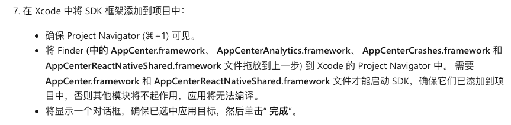
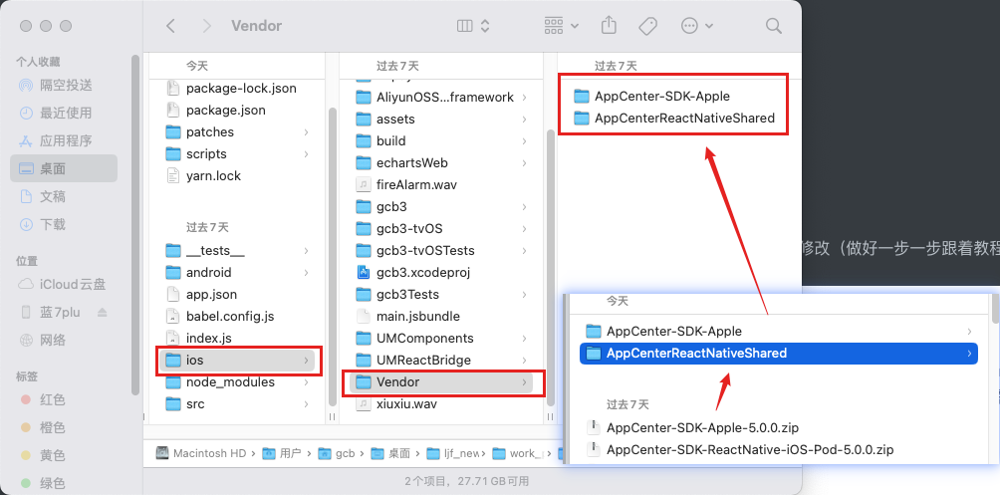
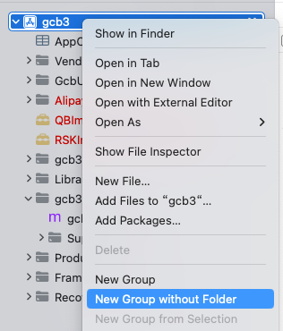
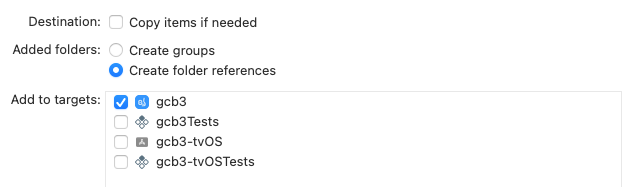

## 项目安装和环境配置

`git clone`项目之后，先安装依赖

```shell
npm install
```

安装完依赖之后给项目打个补丁

```shell
npm run patchpackage
```


## [appcenter-cli](https://learn.microsoft.com/zh-cn/appcenter/distribution/)

### sdk安装和配置

安装：https://learn.microsoft.com/zh-cn/appcenter/sdk/getting-started/react-native

#### 坑

对于`react-native`版本小于 0.60 并且手动进行sdk配置的时候可能在第 7 部配置的时候需要做一下修改（做好一步一步跟着教程做）



如果报错说`<AppCenterCrashes/AppCenterCrashes.h>`等找不到，可以试试下面的操作

首先在`project/ios/`下创建一个目录`Vendor`，然后将解压到SDK的文件目录拖到里面



然后在 Xcode 中创建一个组`Vendor`



之后再从`ios/Vendor`目录下将**AppCenter.framework**、 **AppCenterAnalytics.framework**、 **AppCenterCrashes.framework** 和 **AppCenterReactNativeShared.framework** 拖到`Vendor`组里面，弹窗确认这样选




### 使用

安装 appcenter-cli（安装`2.1.0`版本，最新版本好像有问题，不能上传）

```shell
npm install appcenter-cli@2.1.0 -g
```

登录 appcenter，登录之前需要先在`https://appcenter.ms/`注册并登录

```shell
appcenter login
```

退出登录

```shell
appcenter logout
```

检查是否已登录

```shell
appcenter profile list
```

如果你忘记从不想在 (上保留正在运行的会话的计算机注销，例如，你朋友的笔记本电脑) ，你可以使用以下命令列出和删除任何当前登录会话

```shell
appcenter tokens list
appcenter tokens delete <machineName>
```

通过 App Center 创建应用

```shell
# appcenter apps create -d <appDisplayName> -o <operatingSystem>  -p <platform>
appcenter apps create -d gcb3 -o iOS  -p React-Native
```

创建部署环境 key

```shell
appcenter codepush deployment add -a <ownerName>/<appName> Staging
appcenter codepush deployment add -a <ownerName>/<appName> Production
```

查看部署环境 key

```shell
appcenter codepush deployment list -a <ownerName>/<appName> -k
```

如果你决定不喜欢为应用提供的名称，可以随时使用以下命令重命名它：

```shell
appcenter apps update -n <newName> -a <ownerName>/<appName>
```

如果某个时候不再需要某个应用，可以使用以下命令将其从服务器中删除

```shell
appcenter apps delete -a <ownerName>/<appName>
```

列出已注册到 App Center 服务器的所有应用

```shell
appcenter apps list
```

### 发布本地 bundle 命令参数

```shell
appcenter codepush release -a <ownerName>/<appName> -c <updateContentsPath> -t <targetBinaryVersion> -d <deploymentName>

[-с|--update-contents-path <updateContentsPath>] # 要发布的bundle包的地址
[-t|--target-binary-version <version>] # 指定要部署的版本 生效范围：https://learn.microsoft.com/zh-cn/appcenter/distribution/codepush/cli#target-binary-version-parameter
[--disable-duplicate-release-error] # 指定如果更新与部署上的最新版本相同，CLI 应生成警告而不是错误
[-m|--mandatory] # 强制更新 -m true
[-x|--disabled] # 此参数指定最终用户是否应下载更新。 如果未指定，则不会禁用更新。 相反，用户会在应用调用 sync的那一刻下载它。如果要发布不立即可用的更新，则此参数可能很有用
[--description <description>] # 更改日志
[-d|--deployment-name <deploymentName>] # 部署名称 Production ｜ Staging
[-a|--app <ownerName>/<appName>] # 要更新的应用
```

### 打包并发布当前项目命令参数

```shell
appcenter codepush release-react -a <ownerName>/<appName> -d <deploymentName> -t <targetBinaryVersion>
[-t|--target-binary-version <targetBinaryVersion>] # 如果未指定，则默认以应用的 Info.plist (（适用于 iOS) ）和适用于 Android) 文件的 build.gradle (中指定的确切版本为目标
[-o|--output-dir] # 指定输出路径
[-s|--sourcemap-output] # 指定sourcemap输出路径
[-p|--plist-file] # 指定plist文件
[-g|--gradle-file] # 指定build.gradle文件
[-e|--entry-file] # 编译入口
[--development] # 此参数指定是否生成未优化的开发 JS 捆绑包
[-b|--bundle-name <bundleName>] #此参数指定应用于生成的 JS 捆绑包的文件名
[--disable-duplicate-release-error]
[-m|--mandatory]
[-x|--disabled]
[--description <description>]
[-d|--deployment-name <deploymentName>]
[-a|--app <ownerName>/<appName>]
```

### 修补更新*元数据*

发布更新后，在某些情况下，你可能想要修改它的一个或多个元数据属性 (例如，你忘记将关键 bug 修复标记为必需）

```shell
appcenter codepush patch -a <ownerName>/<appName> <deploymentName> <existing-release-label>

# existing-release-label 指示哪个版本 (例如， v23) 要在指定部署中更新。 如果省略，则请求的更改将应用于指定部署中的最新版本。
[-d|--description <description>]
[-t|--target-binary-version <targetBinaryVersion>]
[-a|--app <ownerName>/<appName>]
```

### 环境部署提升

针对特定部署 (（例如 Staging ) ）测试更新后，并想要将其提升为“下游” (例如 Dev -> Staging -> Production),也就是可以将我们在 Staging 测试的版本直接移动到 Production 中，而不需要重新打包发布

```shell
appcenter codepush promote -a <ownerName>/<appName> -s <sourceDeploymentName> -d <destDeploymentName>
[-s|--source-deployment-name <sourceDeploymentName>] # 要从哪个部署提升
[-d|--destination-deployment-name <destDeploymentName>] # 要提升成为哪个部署
[-t|--target-binary-version <targetBinaryVersion>]
[--description <description>]
[-a|--app <ownerName>/<appName>]
```

### 回滚

部署的发布历史记录是不可变的，因此在发布更新后无法删除更新。 但是，如果发布的更新已损坏或包含意外功能，则可以使用 命令轻松回滚

```shell
appcenter codepush rollback <ownerName>/<appName> <deploymentName>
appcenter codepush rollback -a <ownerName>/MyApp-iOS Production
```

执行此命令会为部署创建一个新版本，其中包含与最新版本之前的版本 **完全相同的代码和元数据** 。 例如，假设你向应用发布了以下更新：

| 发布 | 说明         | 必需 |
| :--- | :----------- | :--- |
| v1   | 初始版本！   | 是   |
| v2   | 添加了新功能 | 否   |
| v3   | Bug 修复     | 是   |

如果在`rollback`该部署上运行命令，则会创建包含发布内容的`v2`新版本 (`v4`) 。

| 发布                 | 说明         | 必需 |
| :------------------- | :----------- | :--- |
| v1                   | 初始版本！   | 是   |
| v2                   | 添加了新功能 | 否   |
| v3                   | Bug 修复     | 是   |
| v4 (从 v3 回滚到 v2) | 添加了新功能 | 否   |

现在，当应用执行更新检查时，已获取 `v3` 的最终用户将“移回”到 `v2` 。 此外，任何仍在运行 `v2`的用户（因此从未获取 `v3`过 ）都不会收到更新，因为他们已在运行最新版本 (这就是更新检查除了使用发布标签) 之外使用包哈希的原因。

如果要将部署回滚到上一个 (以外的版本，例如 `v8` ->`v5`) ，可以指定可选 `--target-release` 参数：

```shell
appcenter codepush rollback -a <ownerName>/MyApp-iOS Production --target-release v5
```

### 查看发布历史记录

可以使用以下命令查看特定应用部署的 50 个最新版本的历史记录

```shell
appcenter codepush deployment history -a <ownerName>/<appName> <deploymentName>
```

### 清除发布历史记录

```shell
appcenter codepush deployment clear -a <ownerName>/<appName> <deploymentName>
```

>如果微软的服务比较慢的话可以尝试自己搭建appcenter服务
>
>+ [【React-native】轻松从零搭建微软Code-Push热更新](https://juejin.cn/post/6995046360080728095)


## [`react-native-code-push`](https://learn.microsoft.com/zh-cn/appcenter/distribution/codepush/rn-overview)使用

### 安装和配置

安装：https://learn.microsoft.com/zh-cn/appcenter/distribution/codepush/rn-get-started

#### 坑

1. 教程里面在 `info.plist` 中配置 `deploymentKey` 的字段是`CodePushDeploymentKey`不是`CodePushPublicKey`


### **进入应用直接更新**

应用*根组件*，默认情况下，CodePush 将在每次应用启动时检查更新。 如果更新可用，则会在下次由最终用户或操作系统) 显式 (重启应用时以无提示方式下载并安装，这可确保最终用户获得最少的侵入性体验。 如果可用更新是必需的，则会立即安装，确保最终用户尽快获得它。

```js
import codePush from "react-native-code-push";

class MyApp extends Component {}

MyApp = codePush(MyApp);
```

### **根据配置进行设置**

```js
let codePushOptions = { checkFrequency: codePush.CheckFrequency.ON_APP_RESUME };

class MyApp extends Component {}

MyApp = codePush(codePushOptions)(MyApp);
```

### **手动进行更新**

如果想要对检查时间进行精细控制， (如按钮按下间隔或计时器间隔) ，可以随时使用 SyncOptions 调用 CodePush.sync() ，并选择性地通过指定手动 checkFrequency 来关闭 CodePush 的自动检查：

```js
let codePushOptions = { checkFrequency: codePush.CheckFrequency.MANUAL };

class MyApp extends Component {
  onButtonPress() {
    codePush.sync({
      updateDialog: true,
      installMode: codePush.InstallMode.IMMEDIATE,
    });
  }

  render() {
    <View>
      <TouchableOpacity onPress={this.onButtonPress}>
        <Text>Check for updates</Text>
      </TouchableOpacity>
    </View>;
  }
}

MyApp = codePush(codePushOptions)(MyApp);
```

### **几种更新方式**

1. 应用上的无提示同步开始 (最简单的默认行为)，你的应用将自动下载可用更新，并在应用下次重启 (（例如 OS 或最终用户将其终止）或设备重启) 时应用这些更新

```js
class MyApp extends Component {}
MyApp = codePush(MyApp);
```

2. 每次应用恢复时，无提示同步。 与 1 相同，但我们检查更新，或者应用更新（如果应用在“后台”后每次返回前台时存在更新）

```js
class MyApp extends Component {}
MyApp = codePush({
  checkFrequency: codePush.CheckFrequency.ON_APP_RESUME,
  installMode: codePush.InstallMode.ON_NEXT_RESUME,
})(MyApp);
```

3. 交互，当更新可用时，在下载更新之前提示最终用户提供权限，然后立即应用更新。 如果使用 标志发布 mandatory 更新，最终用户仍会收到有关更新的通知，但他们无法选择忽略更新

```js
class MyApp extends Component {}
MyApp = codePush({
  updateDialog: true,
  installMode: codePush.InstallMode.IMMEDIATE,
})(MyApp);
```

4. 记录/显示进度

```js
// Make use of the event hooks to keep track of
// the different stages of the sync process.
class MyApp extends Component {
  codePushStatusDidChange(status) {
    switch (status) {
      case codePush.SyncStatus.CHECKING_FOR_UPDATE:
        console.log("Checking for updates.");
        break;
      case codePush.SyncStatus.DOWNLOADING_PACKAGE:
        console.log("Downloading package.");
        break;
      case codePush.SyncStatus.INSTALLING_UPDATE:
        console.log("Installing update.");
        break;
      case codePush.SyncStatus.UP_TO_DATE:
        console.log("Up-to-date.");
        break;
      case codePush.SyncStatus.UPDATE_INSTALLED:
        console.log("Update installed.");
        break;
    }
  }

  codePushDownloadDidProgress(progress) {
    console.log(
      progress.receivedBytes + " of " + progress.totalBytes + " received."
    );
  }
}
MyApp = codePush(MyApp);
```

### **CodePushOptions**

https://learn.microsoft.com/zh-cn/appcenter/distribution/codepush/rn-api-ref#codepushoptions

```js
const CodePushOptions = {
  checkFrequency, //指定要检查更新的时间
  deploymentKey, //指定要查询更新的部署密钥
  installMode, //指定何时要 (未标记为强制) 的可选更新
  mandatoryInstallMode, //指定何时要进行强制更新
  minimumBackgroundDuration, //指定应用在重启应用之前在后台的最小秒数,默认为 0，它会在恢复后立即应用更新，或者除非应用暂停足够长，而不管应用在后台的时间有多长
  updateDialog: {
    //显示确认对话框
    appendReleaseDescription, //指示是否要将可用版本的说明追加到通知消息中，通知消息会显示给最终用户
    descriptionprefix, //指示在向最终用户显示更新通知时，要为发布说明添加前缀（如果有）的字符串
    mandatoryContinueButtonLabel, //最终用户必须按下才能安装强制更新的按钮的文本
    mandatoryUpdateMessage, //将更新指定为必需更新时用作更新通知正文的文本
    optionalIgnoreButtonLabel, //最终用户可以按下以忽略可用可选更新按钮的文本
    optionalInstallButtonLabel, //最终用户可按按钮安装可选更新时要使用的文本
    optionalUpdateMessage, //当更新是可选的时，用作更新通知正文的文本
    title, //用作向最终用户显示的更新通知标头的文本
  },
  rollbackRetryOptions: {
    // 回滚重试机制允许应用程序尝试重新安装以前回滚 (的更新，并遵循选项) 中指定的限制
    delayInHours, //指定应用在尝试重新安装同一回滚包之前在最新回滚后等待的最短时间（以小时为单位）
    maxRetryAttempts, //指定应用在停止尝试之前可以进行的最大重试次数
  },
};
MyApp = codePush(CodePushOptions)(MyApp);
```

### **事件**

- `codePushStatusDidChange`，当同步进程在整个更新过程中从一个阶段移动到另一个阶段时调用
- `codePushDownloadDidProgress`，从 CodePush 服务器下载可用更新时定期调用，回调参数是 {totalBytes,receivedBytes}

### **方法**

- [allowRestart](https://learn.microsoft.com/zh-cn/appcenter/distribution/codepush/rn-api-ref#codepushallowrestart)：如果挂起的更新在不允许重启时尝试重启应用，则会立即重启应用（可选）。 此方法是一种高级 API，仅在应用明确禁止通过 `disallowRestart` 方法重启时才是必需的。
- [checkForUpdate](https://learn.microsoft.com/zh-cn/appcenter/distribution/codepush/rn-api-ref#codepushcheckforupdate)：询问 CodePush 服务配置的应用部署是否有可用的更新。
  - [RemotePackage](https://learn.microsoft.com/zh-cn/appcenter/distribution/codepush/rn-api-ref#remotepackage)
- [disallowRestart](https://learn.microsoft.com/zh-cn/appcenter/distribution/codepush/rn-api-ref#codepushdisallowrestart)：暂时禁止由于安装了 CodePush 更新而发生任何编程重启。 此方法是一种高级 API，当应用内的组件 (例如载入过程) 需要确保在其生存期内不会发生最终用户中断时，此方法非常有用。
- [getUpdateMetadata](https://learn.microsoft.com/zh-cn/appcenter/distribution/codepush/rn-api-ref#codepushgetupdatemetadata)：检索已安装更新的元数据， (如 description、必需) 。
  - [LocalPackage](https://learn.microsoft.com/zh-cn/appcenter/distribution/codepush/rn-api-ref#localpackage)
    -
- [notifyAppReady](https://learn.microsoft.com/zh-cn/appcenter/distribution/codepush/rn-api-ref#codepushnotifyappready)：通知 CodePush 运行时已安装的更新被视为成功。 如果要手动检查并安装更新 (未使用 [sync](https://learn.microsoft.com/zh-cn/appcenter/distribution/codepush/rn-api-ref#codepushsync) 方法来处理所有) ，则必须 **调用此方法;** 否则，CodePush 会将更新视为失败，并在应用下次重启时回滚到以前的版本。
- [restartApp](https://learn.microsoft.com/zh-cn/appcenter/distribution/codepush/rn-api-ref#codepushrestartapp)：立即重启应用。 如果有挂起的更新，它将立即显示给最终用户。 否则，调用此方法的行为与最终用户终止并重启进程的行为相同。
- [sync](https://learn.microsoft.com/zh-cn/appcenter/distribution/codepush/rn-api-ref#codepushsync)：允许通过一次调用来检查更新、下载和安装更新。 除非需要自定义 UI 或行为，否则我们建议大多数开发人员在将 CodePush 集成到其应用中时使用此方法

### **CodePush.sync**

```ts
codePush.sync(
  options: {
    deploymentKey,
    installMode,
    mandatoryInstallMode,
    minimumBackgroundDuration,
    updateDialog,
    rollbackRetryOptions,
  }, //配置对象
  syncStatusChangeCallback: function(syncStatus: Number), //状态变更回调
  downloadProgressCallback: function(progress: DownloadProgress),//下载进度回调
  handleBinaryVersionMismatchCallback: function(update: RemotePackage),//下载中有新的包更新的回调
): Promise<Number>;
```


## 参考

+ [在APPcenter发布APP，并供其他人下载](https://blog.csdn.net/weixin_48576311/article/details/108636912)
+ [react-native-code-push进阶篇](https://juejin.cn/post/6844903491882729485#heading-3)
+ [【React-native】轻松从零搭建微软Code-Push热更新](https://juejin.cn/post/6995046360080728095)
+ [React-Native热更新之微软CodePush](https://juejin.cn/post/7065955188510556167#heading-19)
+ [react-native 热更新实践](https://juejin.cn/post/7194783242279616569?searchId=202308070925095AD1C03BE0B0C0B5E410#heading-5)

