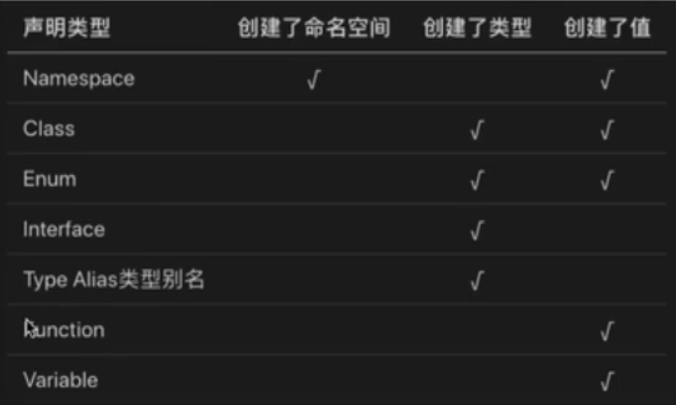

## typescript安装

### 安装和使用

**使用npm安装**

```shell
npm install -g typescripe
```

**检查是否安装成功**

```shell
tsc -V
```

**创建typescript配置文件**

```shell
tsc --init
```

会在目录下创建一个tsconfig.json文件，可以做在这里配置编译的入口和输出位置；

有时候如果在ts中使用了一些es6或者dom对象的方法报错的或可能就是在`tsconfig`中没有配置lib；在合理需要将自己要使用到的库引入才可以；

**创建第一个helloworld.ts脚本**

```typescript
var str:string="你好";
let num:any=20;
console.log(`${str}-${num}`);
```

浏览器和nodejs都不支持运行ts脚本，需要将ts编译成js文件才能正常使用，使用`tsc helloworld.ts`可以将ts文件编译成js文件

### ts中的数据类型

```tex
布尔类型		（boolean）
数字类型		（number）
字符串类型		（string）
数组类型		（array）	
元组类型		（tuple）
枚举类型		（enum）
任意类型		（any）
null和 undefined
void类型
never类型
```

以往在js中定义变量的时候是不需要指定类型的，js内部会自动帮我们进行类型转换，类型的不确定到后来项目的维和和升级在开发可能就会出现以下不必要的错误，如函数参数类型的错误。


## **变量**

```js
var 变量名:类型=值
let 变量名:类型=值
const 变量名:类型=值
```

**定义数组**

```typescript
//第一种方式
let arr:number[]=[1,2,3];
let str:string[]=["h","a","c"];

//第二种方式
let arr:Array<number>=[1,2,3];
```

数组定义需要指定数组中元素的类型，如果不是指定的类型将会报错

**定义元组**（属于数组的一种，元组中的元素类型可以是不一样的）

```typescript
let arr:[string,number,boolean]=['hello',3,true];
```

**定义枚举变量**

一般定义一些固定变量，比如支付状态 0表示未支付，1表示支付，-1表示支付失败等。而且枚举类型变量时只读的。

```typescript
enum Flag={success=1,error=-1,complie}
var f:Flag=Flag.success
var k:Flag=Flag.complie
console.log(f,k);//1 0
//如果不赋值得到话,默认将是前面的值+1,前提是这个值必须是number类型的，如果不是将会报错。
```

枚举变量其实也是一个对象，ts中很巧妙地设置了它的结构使得他既可以通过键访问值`Flag.success-->1`,也可以通过值访问键`Flag[1]-->success`，Flag的结构相当于

```shell
{
success:1,
error:-1,
complie:0,
1:success,
-1:error,
0:complie,
}
```

枚举类型数据支持数字和字符串两种数据类型，也可以是一个返回字符串或者数组的函数，也可以使用其自身的字段。并且也是一个作为一种变量类型来使用

```typescript
function getErr():number{
  return -1;
}
enum Status {
success=1,
error=getErr(),
complie=success,
}

interface Code{
  type:Status
}

let s:Code={
  success:Status=Status.success
}
```


**任意类型数据any**

```js
let a:any=3;
a="str";
a=true;
```

类似于es5的var，可以定义任意类型的变量，一般用于定义DOM节点数据`let obj:any=document.getElementById('a')`，一些操作之后数据类型会改变的变量同样可以。

**定义undefined类型变量**

```typescript
let s:number;
console.log(s);
```

这样子是会报错的，因为 s 是number类型数据，但是最后值是undefined，所以并不可以这样子。如果定义了一个变量又不打算马上使用可以这样定义`let s:number|undefined;`

**定义null类型变量**

一个变量可以是null或者undefined类型变量的情况下可以使用一下方式定义变量

```typescript
let s:number|undefined|null;

//也可以这样定义
type ty=number|undefined|null;
let s:ty;
```

**使用void**

一般用于定义一下没有类型的变量或者表达式，比如没有返回的函数（虽然默认会返回undefined但是不能定义为undefined）

```typescript
function fn(k:number):void{
  console.log(k);
}
fn(2);

function fn(k:number):number{
 return k;
}

//以下这样定义是错误的
function fn2(k):undefined{
  console.log(k);
}

let vo:void;
vo=undefined;
vo=null;//如果报错可以修改tsconfig.json文件的"strictNullChecks"为false；
vo=1;//报错
```

**never类型数据**

never类型表示的是其他类型（包括null和undefined）的子类型，代表从不会出现的值，这就意味着never类型的变量只能被never类型所赋值

```typescript
let ne:never;
ne=()=>{
  throw new Error('error test')
}
```

其实也可以根据意思理解，never（永不），其实就是永远不会返回或者执行，在死循环或程序出错的时候可以用到

```typescript
function ne():never{
  throw new Error("error test");
}

function loop():never{
  while(1){
    
  }
}

//因为never是其他所有类型的子类型,所以;
let num:number;
let nev=(()=>{
  while(true){}
})()
num=nev;
//但是不能将其他类型的赋给never
```


其实在这些类型的存在只是多数据的约束而已，除了上面做的几种外还可以定义这种

```js
let object: { name: string, age: number } = { name: 'jack', age: 3 }
console.log(object)
```

只是这样定义的时候值的key必须要和定义的可以相等。

并且因为typescript是JavaScript的超集，最后编译也是会被编译成JavaScript的，所以你也可以在typescript中用js的语法进行编程，但是最好还是要按照typescript的规范进行编码

**定义对象object类型**

```typescript
function fun(obj:object):void{
  console.log(obj);
}
fun({a:1});
```

**类型断言**

其实就是相当于js中的强制类型装换

类型断言有两种写法

```typescript
let num:number=2;
let str:string=<string>num;
let str2:string=num as string;
```


## **函数**

**函数定义**

```typescript
//声明式
function 函数名(形参名:参数类型):返回值类型{
  ....
}

//匿名函数
var fun=function():number{return 1};
```

**可选参数**

如果函数定义了两个形参的话，在调用的时候就必须要传两个形参，不能多也不能少，如果要按需传的话就需要使用到**可选参数**

```typescript
function getInfo(name:string,age?:number){}

//这样子age就是可传可不穿的可选参数了
```

但是可选参数必须要放到末尾

**默认参数可选参数**

指定默认参数值，可以放到任意位置

```typescript
function getInfo(name:string,age:number=20){}
```

**剩余参数**

使用es6的`...`三点运算符

```typescript
function sum(name:string,...result:number[]){
  var sum:number=0;
  for(let i:number=0;i<result.length;i++){
    sum+=result[i];
  }
  console.log(name,sum);
}
```

**方法重载**

在java中是存在一个方法重载的概念的，如果一个执行上下文中用两个或者以上个相同名字且参数类型不同的方法时，系统会自动根据用户输入的数据的类型来匹配相应的方法，而在javascript中如果函数名相同后面的将会覆盖前面的。

在typescript中实现方法的重载

```typescript
function getInfo(name:string):string;
function getInfo(age:number):number;
function getInfo(str:any):any{
  if(typeof str==='string'){
    return `我叫：${str}`;
  }else{
    return `我${str}岁了`;
  }
}
getInfo('jack');//我叫：jack
getInfo(23);//我23岁了
getInfo(true);//错误，因为并没有定义这个类型的参数
```

在ts中方法的重载其实是将这些可能的函数当成是一个接口来进行编译的

```typescript
interface Fun{
  (name:string):string
	(age:number):number
}
```


## 高级类型

**交叉类型**使用`&`操作符实现，就是将多种类型组合在一起形成一个新的类型，相当于一个类型的集合

```typescript
function getData<T,U>(arg1:T,arg:U):T & U{
  let res={} as (T & U);
  res=Object.assign(arg1,arg2);
  return res;
}

getData({a:'a'},{b:'b'});//{a:'a',b:'b'}
```

**联合类型**一般可以使用`|`或者数组形成比如`number|string`或者`[1,'1',false]`ts会将这个数组进行类型推断变成`number|string|boolean`

**类型保护**有时候需要根据数据的类型调用相应得到方法，根据属性是有该方法的方式在js中是可行的，但是在ts中却会报错，比如

```typescript
let arr=[1,"1"];
function getVal(data:Array<number,string>):number|string{
  let type=Math.ceil(Math.random()*10);
  if(type%2==0){
    return data[0]
  }else{
    return data[1]
  }
}
let item=getVal(arr);
if(item.length){
  console.log(item.length);
}else{
  console.log(item.toFixed());
}
```

上面开始合理，但是在ts中的`if(item.length)`是会报错的，应为item的值不确定是number还是string，只有在string中才有length属性。这时候可以使用类型断言来做强制类型转换，但是这样做就会破坏ts对数据的检测。这是够就可以使用**类型保护**了，就是在不进行强制类型转换的情况下判断出数据的类型

```typescript
//这种比较适合简单的数据的类型保护,这种只会识别string/number/boolean/symbol中的一种，也可以使用instenceof来判断其他的复杂类型数据
if(typeof item==='string'){
  console.log(item.length);
}else{
  console.log(item.toFixed());
}

//也可以使用定义一个方法来实现
function isType<T>(val:any):val is T{
		return typeof val===`${T}`;
}
if(isType<string>(item)){
  ....
}else{
 	....
}
```


## 类

es6和es5中的类和继承

```js
//在es5中可以使用构造函数的方式来进行类的定义；
function Person(name,age){
  this.name=naem;
  this.age=age;
  this.run=function(){
    console.log('hello world',this.name)
  }
}
//定义静态方法
Person.showInfo=function(){
  console.log('name',this.name,'age',this.age);
}
//定义实例方法
Person.prototype.say=function(){
  console.log('hello',this.name);
}
var p=new Person('jack','man')
p.run();
p.say();

//es5继承,使用函数的call方法继承person中的属性和方法，但是这种不能继承原形链上的属性和方法；可以将子类的原形指向到父类的实例中，将子类的构造器constructor指向父类的构造函数，实现继承父类在person构造函数、原形链中的属性和方法，但是这个方法在实例化子类的时候没有办法给父类传参。所以结合两种方式就可以实现完整的继承了
function Zhangsan(name,age){
  Person.call(this,name,age);
}
Zhangsan.prototype=new Person();
zhangsan.prototype.constructor=Person;


//在es6中的类和继承
class Person{
  let _sex;
  constructor(name,age){
    this.name=name;
    this.age=age;
  }
  //sex也是一个属性，所以不可以设置一个同名的sex变量，所以需要设置成别的名字_sex
  set sex(value){
    this._sex=value;
  }
  get sex(){
    return this._sex;
  }
  ....
}
class Zhangsan extends Person{
  constructor(name,age){
    super(name,age);
  }
  ...
}
```


**typeScript中的类和继承**

**类定义**

```ts
class Person{
  name:String;//定义公共属性  省略public
  //构造函数
  constructor(name:string){
    this.name=name;
  }
  
  say(n:string){
    console.log(n);
  }
  
  run():void{
    console.log(this.name+' is running')
  }
}
var person=new Person('jack');
person.say('hello world');
person.run();
```

类中的方法（包括构造函数）是可以不定义放回类型的。

**类的继承**

```typescript
class Person{
  ....
}

class Zhangsan extends Person{
  constructor(name:string){
    super(name);//初始化父类的构造函数
  }
}

let zs=new Zhangsan('zhangsan');
zs.run();
```

当子类的方法和父类的方法一样的时候就会先在子类中找该方法，如果找不到才会去父类中找。

**类中修饰符**

```typescript
//typescript中对属性有三种修饰符
//public:		公有			在类里面、子类、类外面都可以访问
//protected:保护类型	 在类里面、子类、类外面无法访问
//private:	私有			只能在类里面访问
//static:    静态属性
//readonly   只读属性

//不添加修饰符默认为 public

//对方法的修饰符
//static 
//静态方法，只能通过 类名.方法名() 调用，并且在静态方法中不能访问除用static修饰的属性的其他属性,也是就是不能访问public，protected，private修饰的

class Person{
  public name:string;
  protected age:number;
  private sex:boolean;
  constructor(name: string, age: number, sex: boolean){
    this.name=name;
    this.age=age;
    this.sex=sex;
  }
  
  getInfo(){
    console.log(this.name,this.age,this.sex);
  }
}
let p = new Person('jack', 12, true);
p.getInfo();//jack, 12, true
console.log(p.name);//jack
console.log(p.age);//报错
console.log(p.sex);//报错
```

在类中定义变量的时候需要指定初始值或者在构造函数中赋值

**多态**

在父类定义一个方法但是不去实现他，让子类去实现，每一个子类都会有不同的表现，

多态也是一种继承。

```typescript
class Animal{
  name:string;
  constructor(name:string){
    this.name=name;
  }
  eat():void{
    console.log('吃的方法')
  }
}
class Dog extends Animal{
  constructor(name:string){
    super(name);
  }
  eat():void{
    return this.name+'吃狗粮'
  }
}
class Cat extends Animal{
  constructor(name:string){
    super(name);
  }
  eat():void{
    return this.name+'吃锚粮'
  }
}
```


## **抽象类和抽象方法**

用abstract定义抽象类和抽象方法，抽象类中的抽象方法不包含具体实现，但是在必须在派生类中实现，抽象类是不能直接使用的。它只是提供一个标准。

abstract抽象方法只能放在抽象类中

抽象类和抽象方法用来定义标准Animal 这个类，要求它得到子类中必须要包含哪些方法。

```typescript
abstract class Animal{
  public name:string;
  constructor(name){
    this.name=name;
  }
  abstract eat():any;
}
var a=new Animal('jack');//报错

class Dog extends Animal{
  constructor(name:string){
    super(name);
  }
  eat(){
    console.log(this.name+'吃狗粮')
  }
}
```

## **接口**

在面向对象的编程中，接口是一种规范的定义，它定义了行为和动作的规范，在程序设计里面，接口起到一种限制和规范的作用。接口定义了某一批类所需要遵守的规范，接口不关心这些类的内部状态数据，也不关心这些类里方法的实现细节，它只规定这批类里必须提供某些方法，提供这些方法的类就可以满足实际需要。 typescrip中的接口类似于java，同时还增加了更灵活的接口类型，包括属性、函数、可索引和类等！

typescript中提供了四种接口 类型

1. **属性接口**：对传入对象的约束
2. **函数类型接口**：对方法传入的参数以及返回值进行约束
3. **可索引接口**：对数组和对象的约束（不常用）
4. **类类型接口**：对类的约束和抽象类有点相似

### **属性接口**

```typescript
//定义属性接口
interface FullName{
  firstName:string;
  secondName:string;
}
//实现接口
function printName(name:FullName){
  console.log(name.firstName+"-"+name.secondName);
  console.log(name);
}

//参数中必须要包含firstName，secondName，这种参数写法可以动态添加k-v
let obj={
  age:30,
  firstName:'jack',
  secondName:'jonson',
}
printName(obj);

//这种写法会报错，因为接口中并没有定义age
printName({
  age:30,
  firstName:'jack',
  secondName:'jonson',
});

//也可以针对于接口做处理
interface FullName{
  firstName:string;
  secondName:string;
  age?:number;
}//使用可选属性做处理
interface FullName{
  firstName:string;
  secondName:string;
  [prop:string]:any;
}//这种就定义其他任意k-v
```

**可选属性接口**  `?`

```typescript
//定义属性接口
interface FullName{
  firstName:string;
  secondName?:string;//可以不传secondName,可选参数接口必须是在必选参数之后
}
//实现接口
function printName(name:FullName){
  console.log(name.firstName+"-"+name.secondName);
}
printName({
  secondName:'jonson',
});

//当接口的属性全都是可选的时候，如果有同名的变量那么它也应该遵守这个接口的规则
interface NameAge{
  name?:string;
  age?:number;
}
let NameAge={
  sex:0,
}//将报错
```

封装一个ajax接口

```typescript
interface Config{
  type:string;
  url:string;
  data?:string;
  dataType:string;
}

function ajax(config:Config):void{
  let xhr=new XMLHttpRequest();
  xhr.open(config.type,config.url,true);
  xhr.send(config.data);
  xhr.onreadystatechange=function(){
    if(this.readyState==4&&this.status==200){
      console.log('success');
      if(config.dataType=='josn'){
        console.log(JSON.parse(this.responseText));
      }else{
        console.log(this.responseText);
      }
    }
  }
}

ajax({
  type:'get',
  url:'https://www.fastmock.site/mock/cde0a674116b7862039ffe2b9a5957a9/testApi',
  dataType:'josn',
})
```

### **函数类型接口**

```typescript
interface encrypt{
  (key:string,value:string):string;
}
//也可以使用类型别名的形式写
//type encrypt=(key:string,value:string)=>string;
var md5:encrypt=function(key:string,value:string):string{
  return key+value;
}
console.log(md5('a','b'))

//包含属性的函数接口
interface Counter {
    (): void,
    count: number
}
const getCounter = (): Counter=>{
    const c = () => { c.count++ };
    c.count=0;
    return c;
}
let counter: Counter = getCounter();
counter();
```

### **可索引接口**

对数组的约束 

```typescript
interface UserArr{
  //索引问数字，值为字符
  [index:number]:string;
}
var arr:UserArr=['22','33'];
console.log(arr[0]);
```

对对象的约束

```typescript
interface UserArr{
  //索引问数字，值为字符
  [index:string]:number;
}
var arr:UserArr={name:33,age:22};
console.log(arr[0]);
```

### **类类型接口**

```typescript
interface Animal{
  name:string;
  eat(str:string):void;
}
class Dog implements Animal{
  name:string;
  constructor(name:string){
    this.name=name;
  }
  eat(){
    console.log(this.name+'eat something')
  }
}
let d=new Dog('jack');
d.eat();

class Cat implements Animal{
  name:string;
  constructor(name:string){
    this.name=name
  }
  eat(food:string){
    console.log(this.name+' eat '+this.food);
  }
}
let d=new Cat('cat');
d.eat('mouse');
```

在实现类接口的方法的时候只需要使用实现里面的方法就可以了参数和返回值不一定需要按照规范来写

### 接口继承(接口扩展)

```typescript
//接口的扩展
interface Animal{
  eat():void;
}
interface Person extends Animal {
  work():void;
}

//实现接口，必须要实现Person和Animal里面的接口
class web implements Person{
  public name:string;
  constructor(name:string){
    this.name=name;
  }
  eat():void{
    console.log(this.name+"like eat peache"+)
  }
  work():void{
      console.log(this.nmae+"work is duck");
  }
}
```

### 接口合并

当定义一个相同名字，但是结构不同的接口时，接口将会被合并在一起

```ts
interface Point { x: number; }
interface Point { y: number; }
const point: Point = { x: 1, y: 2 };
```


## 类型别名

将其他的一些类型命名成自己喜欢的名字，一般类型别名用来定义元组

```typescript
type myString=string;
type myType=string|number|undefined|null;
let data:myString;
```

也可以对创建一些自己的字面量类型

```typescript
type Name='name';
type Age=18;
type Direction='north'|'east'|'south'|'west';
let n:Name='name';//只能是name
let a:Age=18;//只能是18
let d:Direction="east";//可以是north，east，south，west中的任意一个
```

在类型别命中也是可以使用泛型的

```typescript
type Childs<T>={
  current:T,
  child?:Childs<T>
}
let child:Childs<string>;
//这样子可以创建一个嵌套的类型，但是需要注意的是只能在属性中定义自己本身的类型
```

类型别名和接口很相似，但是他们是不一样的，类型别名不可以使用`extends`和合并的特性 ，但是可以使用 `&` 运算符实现继承。

### 类型别名继承

**接口继承类型**

```ts
type PartialPointX = { x: number; };
interface Point extends PartialPointX { y: number; }
```

**类型继承类型**

```ts
type PartialPointX = { x: number; };
type Point = PartialPointX & { y: number; };
```

**类型继承接口**

```ts
interface PartialPointX { x: number; }
type Point = PartialPointX & { y: number; };
```

### 类型别名实现

类可以实现接口以及类型（TS 2.7+）

```ts
type AnotherPoint = {
    x: number;
    y: number;
};

class SomePoint2 implements AnotherPoint {
    x = 1;
    y = 2;
}
```


## 映射类型

```typescript
interface Prop{
  id:string
  children:string[]
}

type obj1 = {[key:string]:number}
let objIns1:obj1 = {'a':1}
type obj2 = {[key in keyof Prop]:number}
let objIns2:obj2 = {id:0,children:1}

type keysType = keyof Prop;// id | children
type valueType = Prop[keyof Prop];//string | string[]

```


## `Object、object、{}`的区别

+ object 类型是：TypeScript 2.2 引入的新类型，它用于表示非原始类型。

+ 
  Object 类型：它是所有 Object 类的实例的类型。它由以下两个接口来定义：

  它由以下两个接口来定义：

  - Object 接口定义了 Object.prototype 原型对象上的属性；
  - ObjectConstructor 接口定义了 Object 类的属性。

+ {} 类型：它描述了一个没有成员的对象。当你试图访问这样一个对象的任意属性时，TypeScript 会产生一个编译时错误。


## interface 和 type 的区别

interface 和 type 很像，很多场景，两者都能使用。但也有细微的差别：

**不同点：**

- 扩展语法： interface使用extends，type使用‘&’
- 同名合并：interface 支持，type 不支持。
- 描述类型：对象、函数两者都适用，但是 type 可以用于基础类型、联合类型、元祖。
- 计算属性：type 支持计算属性，生成映射类型,；interface 不支持。

**相同点：**

- 两者都可以用来描述对象或函数的类型
- 两者都可以实现继承

总的来说，公共的用 interface 实现，不能用 interface 实现的再用 type 实现。主要是一个项目最好保持一致。


## 泛型

在开发中我们不仅要创建一致的定义良好的api，同时也要考虑可重用性，组件不仅能够支持当前的数据类型，同时也要考虑支持未来的数据类型。一般泛类可以用来做支持多种数据类型的数据，从而开发出搞容错率的可重用组件。也可以实现对方法一些特殊要求，比如要求传入参数的类型和返回的数据类型一致；

就是说泛型就是解决类、接口、方法的复用性、以及对不特定数据类型的支持（类型校验）

使用any实现

```typescript
function getData(value:any):any{
  return value;
}
```

这样子会破坏ts的检查

使用泛型实现

```typescript
function getData<T>(value:T):T{//T只是一个站位符，可以是任意名字
  return value;
}

getData<number>(123);
```

这样子就可以约束，参数和返回值都是同一种类型的数据了，如果只是要对参数有可变要求的话，返回值可以使用any；

**泛型约束也可以有多个**

```typescript
function getData<T,U>(key:T,value:U):[T,U]{
  return [key,value]
}
getData<string,number>('age',123);
getData('age',123);//这样如果不写的话，那么就会自动匹配到第一个使用到的类型，也就是说在这里T就是string，U就是number，getData(123,'age');那么T=>number,U=>string;
```

泛型也是可以继承的，这种继承是一种类型的继承，用来提供**约束功能**

```typescript
interface ValueWithLength{
  length:number;
}

const getArray=<T,T extends ValueWithLength>(arg:T,times):T[]=>{
  return new Array(times).fill(arg);
}
//T必须是传入的类型，且必须实现ValueWithLength接口（有length属性）
getArray([1,2],3);
getArray("123",3);
getArray({
  length:2
},3);

//T必须是传入的类型，且K必须是T中键的一个 K extends [a,b]==>K:a|b;
const getProps=<T,K extends keyOf T>(obj:T,prop:K)=>{
  return obj[prop];
}
const objs={
  a:'a',
  b:'b',
}
getProps(objs,'a')
```


**泛型类**

泛型类和泛型方法类似

```typescript
class MinClass<T>{
  public list:T[]=T;
  add(value:T):void{
    this.list.push(value);
  }
  min():T{
    let min=this.list[0];
    for(let i=0;i<this.list.length;i++){
      if(min>this.list[i]){
        min=this.list[i]
      }
    }
    return min;
  }
}

let m1=new MinClass<number>();
m1.add(2);
m1.add(1);
mi.min();//1

let m2=new MinClass<number>();
m2.add("b");
m2.add("a");
m2.min();//a
```

**泛型接口**

```typescript
//定义泛型接口方式1
interface Config{
  <T>(value:T):T;
}
let fun:Config=function getData<T>(value:T):T{
  return value;
}
fun<number>(12);

//定义泛型接口方式2
interface Config2<T>{
  (value:T):T;
}
function getData<T>(value:T):T{
  return value;
}
let fun:Config2<number>=getData;
getData(12);
```


**使用类作为参数类型的泛型类**

类也可以用于对参数和数据的限定，其作用类似于接口

```typescript
//模拟数据库操作
class user{
  name:string|undefined;
  sex:boolean|undefined=true;
  age:number|undefined;
}
class article{
  title:string|undefined;
  content:stirng|undefined;
  constuctor(params:{
    title:string|undefined,
    content:stirng|undefined,
  }){
    this.title=title;
    this.content=content;
  }
} 
  
class MyDB{
  add(data:user|article):boolean{
    return true;
  }
}

let user=new user();
user.name="jack";
user.age=12;
let art=new article({
  art.title="hello world";
	art.content="this is a good day";
});
let db=new MyDB();
db.add(user);
db.add(art);
```

要将数据库类改成泛型类，就可以很方便地操作数据了，不需要担心add方法的参数是哪种类型的数据

```typescript
class MyDB<T>{
  add(data:T):boolean{
    return true;
  }
}

....
let db=new MyDB<user>();
```

下面是一个接口，泛型的实例

```typescript
interface DBI<T>{
  add(data:T):boolean;
  delete(data:T,id:number):boolean;
  update(id:number):boolean;
  select(id:number):any;
}

//在实现泛类型接口的时候需要该类也是一个泛类型类
class MySQL<T> implements DBI<T>{
  add(data: T): boolean {
    console.log(data);
    return true;
  }
  delete(data: T, id: number): boolean {
    console.log(data,id);
    return true;
  }
  update(id: number): boolean {
    console.log(id);
    return true;
  }
  select(id: number) {
    return [
      {title:"hello"},
      { title: "world" },
    ];
  }
}

class User{
  name:string|undefined;
  age:number|undefined;
  constructor(params:{
    name: string,
    age: number,
  }){
    this.name=params.name;
    this.age = params.age;
  }
}

let u=new User({
  name:'jack', age:13
})

let db=new MySQL<User>();
db.add(u);
db.delete(u,1);
db.update(12);
db.select(13);
```

**泛型工具类型**

泛型有常用是四种工具，分别是`Partial`，`Readonly`，`Pick`，`Record`

```typescript
interface Prop {
  id:string
  children:number[]
  attr?:object
}

//Partial 可以根据提供的接口生成一个属性全部可选的新类型
type PartialProp = Partial<Props>
/**等价于
interface Prop {
  id?:string
  children?:number[]
}
*/

//Readonly 可以根据提供的接口生成一个属性全部仅读的新类型
type ReadonlyProp = Readonly<Props>
let prop:ReadonlyProp = {id:"ss",children:[]}
prop.id = "3";//报错

//Pick 可以根据提供的接口和属性生成一个新类型
type PickProp = Pick<Props,'id'|'children'>


//Record 构建一个对象类型，属性键为Keys，属性类型为Type
type RecordProp = Record<'a'|'b',string[]>
let obj:RecordProp = {a:['1'],b:['ff']}

//Omit是TypeScript3.5新增的一个辅助类型，它的作用主要是：以一个类型为基础支持剔除某些属性，然后返回一个新类型。
type OmitProp = Omit<Props,'children'>
```


## 模块化

在typescript中`内部模块`称为`命名空间`,`外部模块`称为`模块`，对于模块的理解就是：我们可以把一些公共的功能单独抽离成一个文件作为与一个模块，模块里面的变量、函数、类等默认是私有的，如果我们要在外部访问模块里面的数据（变量、函数、类）,我们需要通过export暴露模块的数据，暴露之后可以通过import引入模块，这样就可以使用模块中的和数据了。

**ts中的命名空间**
在typescript中可以使用 `namespace 空间名{}` 进行空间命名，其实在js中就是利用函数局部作用域的原理，在立即执行函数中定义相同名称不同作用的代码。namespace也是可以通过export导出，通过import导入的。

```typescript
//在model.ts中
export namespace A{
  export class Dog{
    private name:string;
    constructor(name:string){
      this.name=name;
    }
    eat():void{
      console.log(this.name+"eat food");
    }
  }
}
  
//在main.ts中
import {A} from "./model";
let a=new A.Dog('jack');
a.eat();
```

**ts中的导入导出方式**

model.ts

```typescript
//导出常量
export const NAME="jack";
//导出函数
export function getData(id:number):any[]{
  return [{
    title:'hello',
  },
  {
    title:'world',
  }]
}
//默认导出
export default var sex:number=1

//也可以一起到导出
//export {
//	NAME,
//  getData,
//  sex,
//}
```

main.ts

```typescript
import sex,{NAME,getData} from "./model";
//import {sex,NAME,getData as get} from "./model";
console.log(sex);
console.log(NAME);
console.log(getData(1));
//console.log(get(1));
```

需要注意的是在浏览区中是暂时不支持es6 model的模块化的，但是可以在node环境中去使用，浏览器中可以使用AMD或者CMD去实现模块化功能。

##  声明合并

声明合并其实和函数的重载差不多，在定义多个相同名字的接口的时候这些接口属性将会被合并。

**接口声明合并**

```typescript
interface InfoInter{
  name:string;
  age:number;
  getRes(val:number):string;
}
interface InfoInter{
  name:string;
  getRes(val:string):number;
}

let inter:InfoInter={
  name:"jack",
  age:18,
  getRes(val:any):any{
    if(typeof val==='string'){
      return val.length;
    }else{
      return String(123);
    }
  }
}

/*
* 对于两相同名字的接口
* 可以有不同名字的属性，如果是属性名相同则类型必须相同
* 如果有相同的名字的函数，则使用的规则是函数的重载
*/
```

**命名空间合并**

```typescript
namespace Valiable{
  export const nameReg=/^[0-9]+/;
  export const chechVal=()=>{};
}
namespace Valiable{
  console.log(nameReg);
  export const chechVal=()=>{};
}
  
// 规则与接口的声明合并一样，但是里面的属性需要使用export导出才能被合并，不然会报错
```

**命名空间与函数、类的合并**

```typescript
//命名空间不仅可以与命名空间合并还可以和函数、枚举、类进行合并,但是需要注意的是类、函数的声明必须在命名空间之前
class Valiable{
  constructor(){}
  public checkVal(){
    
  }
}
namespace Valiable{
  export const nameReg=/^[0-9]+/;
}
consolo.dir(Valiable)//在这里可以看到checkVal方法


function countUp(){
  countUp.count++;
}
namespace countUp{
  export count=0
}
console.log(countUp.count);//0
  countUp();
console.log(countUp.count);//1
  countUp();
console.log(countUp.count);//2
  countUp();
  

enum Colors{
  red=1,
  yellow,
}
namespace Colors{
  export green=3;
}
console.log(Colors);//这里在正常枚举中应该会有 green:3,3:green,但是在命名空间中只添加个green=3，所以在枚举中没有3:green
```




## 装饰器

装饰器是相对于类来说的。装饰器是一种特殊类型的声明，它能够被附加到类声明、方法、属性或者参数上、可以修改类的行为。通俗的讲装饰器就是一个方法，可以注入到类、方法、属性参数上来扩展类、属性、方法、参数的功能。

常见的装饰器有：类装饰器、属性装饰器、方法装饰器、参数装饰器

装饰也有两种写法：普通装饰器（无法传参）,装饰器工厂（可传参）

1.类装饰器：类装饰器在类声明之前被声明（紧靠着声明）。类装饰器应用于类构造函数，可以用来监视，修改或者替换类的东西，传入一个参数。

**普通类装饰器**

```typescript
function logClass(params:any){
  console.log(params);//function HttpClient{}
  // 在普通装饰器中，params就是指向当前类
  params.prototype.apiUrl="xxxx";
  params.prototype.run=function(){
    console.log("I'am a function");
  }
};
//如果在普通装饰器中返回了一个类，这个类将替换原来的类

@logClass
class HttpClient{
  constructor(){
    
  }
  private getData():void{
    
  }
}

var h:any=new HttpClient();
console.log(h.apiUrl);
h.run();


```

**类装饰器工厂**

```typescript
function logClass(params:string){
 	//当前的这个params就是传入的参数
  console.log(params);
  //在类装饰器工厂中需要返回一个函数，这个函数的参数就是当前类。
  return function(target:any){
    console.log(target);
    target.prototype.apiUrl="hello";
  }
}

@logClass("hello")
class HttpClient{
  constructor(){
    
  }
  private getData():void{
    
  }
}

var h:any=new HttpClient();
console.log(h.apiUrl);
h.run();
```

类装置器也可以用来重载构造函数

1. 类装饰器表达式会在运行时当做函数被调用，类的构造函数作为唯一的参数。
2. 如果类装饰器返回一个值，他会使用提供的构造函数来替换类的声明。

类装饰器重载类构造函数

```typescript
function logClass(target:any){
  return class extends target{
    apiUrl:any="out data";
    getData(){
      this.apiUrl=this.apiUrl+'----';
      console.log(this.apiUrl);
    }
  }
}
//注意：在重载类构造函数的时候需要重写除constructor以外的方法，以及属性;

@logClass("hello")
class HttpClient{
  public apiUrl:string | undefined;
  constructor(){
    this.apiUrl="inner data";
  }
  private getData():void{
  }
}
```


**属性装饰器**

有两个参数

1. 对于静态成员来说是类的构造函数，对于实例成员是类的原形对象。
2. 成员(属性)名字

```typescript
function logProperty(params:any){
  return function(target:any,attr:any){
    target[attr]=params;
  }
}

class HttpClient{
  @logProperty("http://xxxx")
  public apiUrl:string | undefined;
  constructor(){
  }
  private getData():void{
  }
}
```

当使用`get`和`set`来设置类的属性时，这时候可以使用方法装饰器来进行修饰


**方法装饰器**

在js中可以使用`Object.defineProperty(对象,属性,配置)`来控制对象的属性的访问与设置

```ts
let obj={};
Object.defineProperty(obj,'name',{
  value:"jack";//属性的值
  writable : true,//是否可编辑，也就会修改值
  enumerable : true,//是否可枚举，就是在for in等循环中该属性是否可被循环遍历出来
  configurable : true,//设定该属性是否可被删除，且除writable外的其他描述符是否可被修改；
  get(){return "hello"},//获取属性值，当使用obj.name访问时将会返回hello
  set(newVal){this.value=newVal},//当设置这个属性的时候就不可以设置value和writable。
});//当属性在对象中不存在时就会添加到对象中，如果已存在就会修改其配置
```

在`descriptor`的六个选项中，有数据描述符和属性描述符，**他们是不可共存的**，可共存的有

- 数据描述符：value，writable；
- 存取描述符：get，set；
- 两者皆可共存：configurable，enumerable；

在方法装饰器中，这个装饰器其实也就相当于是`Object.defineProperty`函数

方法装饰器有三个参数

1. 对于静态成员来说是类的构造函数，对于实例成员是类的原形对象。
2. 方法名字
3. 成员(属性)的属性描述符

```typescript
function get(params:any){
  return function(target:any,methodName:any,desc:any){
    //des.value就是当前的方法;
    //将传入的参数全部变成字符串；
    var oMethod=desc.value;
    desc.value=function(...args:any[]){
      args=args.map(value=>{
        return String(value);
      })
      oMethod.apply(this,args);
    }
  }
}


class HttpClient{
  public apiUrl:string | undefined;
  constructor(){
  }
  @get("http://xxxx")
  public getData(...args:any[]):void{
    console.log(args);
    console.log("inner");
  }
}
```


**方法参数装饰器**

参数装饰器表达式会在方法被调用的时候执行，可以使用参数装饰器为类的原型增加一些元素数据，传入下列3个参数

1. 对于静态成员来说是类的构造函数，对于实例成员是类的原形对象。
2. 方法名字
3. 参数装饰器在函数参数列标中的索引

```typescript
function logParams(params:any){
  return function(target:any,methodName:any,index:any){
   target.apiUrl=params;
  }
}

class HttpClient{
  public apiUrl:string | undefined;
  constructor(){
  }
  public getData(@logParams("xxx") pa:any):void{
    console.log(pa);
  }
}
```


**注意：**

1. 同一类装饰器可以添加多个，它们的执行顺序是
   (1). 对于普通装饰器，越靠近被装饰者的装饰器越早执行也就是先执行后面到在执行前面的
   (2)). 对于装饰器工厂而言（返回的函数就是装饰器），是按顺序从前往后执行装饰器工厂，然后再从后往前执行装饰器的。
2. 不同类的装饰器的执行顺序（执行优先级）

> 属性装饰器 > 方法装饰器 > 方法参数装饰器 > 类装饰器

```typescript
@logClass1
@logClass2
class HttpClient{
  @logAttr
  public apiUrl:string | undefined;
  constructor(){
  }
  @logMethod
  public getData():void{
  }
  setData(@logParams1 pa1:any,@logParams2 pa2:any):void{
  }
}
```

执行的顺序是

> @logAttr
> @logMethod
> @logParams2
> @logParams1
> @logClass2
> @logClass1


## 混入

混入就是将对象或者类的属性或者方法汇聚到一起，方便调用其他对象或者类的方法

1. 对象的混入

   对象的混入可以使用`Object.assign()`方法来进行对象的合并，从而达到一个混入的效果。

   ```ts
   interface ObjA{
     a:string,
   }
   interface ObjB{
     b:string;
   }
   let A:ObjA={a:"a"};
   let B:ObjB={b:"b"};
   let AB:ObjA & ObjB=Object.assign(A,B);
   ```

   

2. 类的混入

   其实也就是利用`Object.getOwnPropertyNames()`方法将一个类的原形链上的属性和方法复制到另外一个类上。

   ```tsx
   class ClassA{
     public isA:boolean;
     public funcA(){};
   }
   class ClassB{
     public isB:boolean;
     public funcB(){};
   }
   class AB implements ClassA,ClassB{
     public isA:boolean;
     public isB:boolean;
     public funcA:()=>void;
     public funcB:()=>void;
     constructor(){}
   }
   function mixins(base:any,from:any[]){
     form.forEach(item=>{
       Object.getOwnPropertyNames(item.prototype).forEach(propName=>{
         base.prototype[propName]=item.prototype[propName];
       })
     })
   }
   ```


## 声明文件

在ts中有种文件是`xxx.d.ts`这使用ts的声明文件一般用来描述的类，方法，属性的作用及用法。ts实际上还是js，所以当我们在ts中想要使用一些js的库的时候就会有一个情况，编译器中没有这个库中的一些语法提示，并且在js中也不存在属性类型的说法，所以需要一些文件来描述这个库的方法及其参数的类型，方法的功能等。现在大部分的js库都有别人写好的一些ts的声明文件，我们直接下载使用就好。

**全局库声明文件**

场景：在`./src/document-title.js`文件中提供了一些全局的方法，

```js
function setTitle(title){
  document && document.title=title;
}
function getTitle(){
  return document?document.title:"";
}
let domTitle=getTitle();
```

并且在index.html中已经通过script标签引入了，当你在ts在入口文件index.js中调用`document-title.js`中的方法时，你会发现他没有任何提示并且可能会报错。这时候你就需要编写一个**全局库声明文件**    `global.d.ts`

```tsx
declare function setTitle(title:string):void;
declare function getTitle():string;
declare let domTitle:string;
```

如果想要在该声明文件中引用其他的声明文件可以使用`///<reference types="moment">`或者使用`import * as moment from "moment" `引入，但是当在全局声明文件中使用时需要注意命名冲突，最好使用命名空间将相关的东西封装到一块，防止命名冲突。

完成之后重新运行，如果还是没有这个规范的话可以在tsconfig.json中先将这些文件设置引入

```json
{
  "compilerOptions":{...}
 	"include":{
		"./src/**/*.ts",
   	"./src/**/*.d.ts",
   }
}
```

除了全局库的声明文件外，还有其他的一些模块库的声明文件，其编写都差不多。

声明文件的编写规范可以参考[https://www.tslang.cn/docs/handbook/declaration-files/introduction.html](https://www.tslang.cn/docs/handbook/declaration-files/introduction.html)

现在大部分的库的声明文件都有人已经写好放到网上了，所以我们只需要下载好相关的声明文件就可以用了

```shell
npm install @types/库的名字 -D
```

可以下载证明有这个库的声明文件，如果没有就可能需要我们自己写了

当这个库还没有声明文件的话并且自己又不想写的时候可以使用快捷创建声明文件的方式，这样虽然一些方法并并没有类型提示，但是至少可以引入使用并且不会报错

创建`typings/模块名/index.d.ts`

```ts
declare module "moment";
```


## tsconfig.json各项注解

```json
{
  "compilerOptions": {
    /* Basic Options */
    "target": "es5",                          /* target用于指定编译之后的版本目标 version: 'ES3' (default), 'ES5', 'ES2015', 'ES2016', 'ES2017','ES2018' or 'ESNEXT'. */
    "module": "commonjs",                     /* 用来指定要使用的模块标准: 'none', 'commonjs', 'amd', 'system', 'umd', 'es2015', or 'ESNext'. */
    "lib": [
      "es6",
      "dom"
    ],                             /* lib用于指定要包含在编译中的库文件，这个我们在前面的课程中讲过一点，如果你要使用一些ES6的新语法，你需要引入ES6这个库，或者也可以写ES2015。 */
    // "allowJs": true,                       /* allowJs设置的值为true或false，用来指定是否允许编译JS文件，默认是false，即不编译JS文件。 */
    // "checkJs": true,                       /* checkJs的值为true或false，用来指定是否检查和报告JS文件中的错误，默认是false。 */
    // "jsx": "preserve",                     /* 指定jsx代码用于的开发环境: 'preserve', 'react-native', or 'react'. */
    // "declaration": true,                   /* declaration的值为true或false，用来指定是否在编译的时候生成相应的".d.ts"声明文件。如果设为true，编译每个ts文件之后会生成一个js文件和一个声明文件。但是declaration和allowJs不能同时设为true。 */
    // "declarationMap": true,                /* 值为true或false，指定是否为声明文件.d.ts生成map文件 */
    // "sourceMap": true,                     /* sourceMap的值为true或false，用来指定编译时是否生成.map文件。 */
    // "outFile": "./",                       /* outFile用于指定将输出文件合并为一个文件，他的值为一个文件路径名，比如设置为"./dist/main.js"，则输出的文件为一个main.js文件。但是要注意，只有设置module的值为amd和system模块时才支持这个配置。 */
    // "outDir": "./",                        /* outDir用来指定输出文件夹，值为一个文件夹路径字符串，输出的文件都将放置在这个文件夹。 */
    // "rootDir": "./",                       /* 用来指定编译文件的根目录，编译器会在根目录查找入口文件，如果编译器发现以rootDir的值作为根目录查找入口文件并不会把所有文件加载进去的话会报错，但是不会停止编译。 */
    // "composite": true,                     /* 是否编译构建引用项目 */
    // "removeComments": true,                /* removeComments值为true或false，用于指定是否将编译后的文件中的注释删掉，设为true的话即删掉注释，默认为false。 */
    // "noEmit": true,                        /* 不生成编译文件，这个一般很少用了。 */
    // "importHelpers": true,                 /* importHelpers的值为true或false，指定是否引入tslib里的辅助工具函数，默认为false。 */
    // "downlevelIteration": true,            /* 当target为“ES5”或“ES3”时，为“for-of”、“spread”和“destructuring”中的迭代器提供完全支持。 */
    // "isolatedModules": true,               /* isolatedModules的值为true或false，指定是否将每个文件作为单独的模块，默认为true，他不可以和declaration同时设定。 */

    /* Strict Type-Checking Options */
    // "strict": true,                           /* strict的值为true或false，用于指定是否启动所有类型检查，如果设为true则会同时开启下面这几个严格类型检查，默认为false。 */
    // "noImplicitAny": true,                 /* noImplicitAny的值为true或false，如果我们没有为一些值设置明确的类型，编译器会默认认为这个值为any类型，如果将noImplicitAny设为true，则如果没有设置明确的类型会报错，默认值为false。 */
    // "strictNullChecks": true,              /* strictNullChecks的值为true或false，这个配置项我们在前面课程讲过了，当设为true时，null和undefined值不能赋值给非这两种类型的值，别的类型的值也不能赋给他们， 除了any类型，还有个例外就是undefined可以赋值给void类型。 */
    // "strictFunctionTypes": true,           /* strictFunctionTypes的值为true或false，用来指定是否使用函数参数双向协变检查。还记得我们讲类型兼容性的时候讲过函数参数双向协变的这个例子： */
    // "strictBindCallApply": true,           /* strictBindCallApply的值为true或false，设为true后会对bind、call和apply绑定的方法的参数的检测是严格检测的 */
    // "strictPropertyInitialization": true,  /* strictPropertyInitialization的值为true或false，设为true后会检查类的非undefined属性是否已经在构造函数里初始化，如果要开启这项，需要同时开启strictNullChecks，默认为false。 */
    // "noImplicitThis": true,                /* 当 this表达式的值为 any类型的时候，生成一个错误。 */
    // "alwaysStrict": true,                  /* alwaysStrict的值为true或false，指定始终以严格模式检查每个模块，并且在编译之后的JS文件中加入"use strict"字符串，用来告诉浏览器该JS为严格模式。 */

    /* Additional Checks */
    // "noUnusedLocals": true,                /* noUnusedLocals的值为true或false，用于检查是否有定义了但是没有使用的变量，对于这一点的检测，使用ESLint可以在你书写代码的时候做提示，你可以配合使用。他的默认值为false */
    // "noUnusedParameters": true,            /* noUnusedParameters的值为true或false，用于检查是否有在函数体中没有使用的参数，这个也可以配合ESLint来做检查，他默认是false。 */
    // "noImplicitReturns": true,             /* noImplicitReturns的值为true或false，用于检查函数是否有返回值，设为true后，如果函数没有返回值则会提示，默认为false。 */
    // "noFallthroughCasesInSwitch": true,    /* noFallthroughCasesInSwitch的值为true或false，用于检查switch中是否有case没有使用break跳出switch，默认为false。 */

    /* Module Resolution Options */
    // "moduleResolution": "node",            /* moduleResolution用于选择模块解析策略，有"node"和"classic"两种类型，我们在讲模块解析的时候已经讲过了。 */
    // "baseUrl": ".",                       /* baseUrl用于设置解析非相对模块名称的基本目录，相对模块不会受baseUrl的影响。 */
    // "paths": {
    //   "*": ["node_modules/@types", "src/typings"]
    // },                           /* paths用于设置模块名到基于baseUrl的路径映射,当在第一个路径中早不到要找的文件时会进入到下一个路径寻找 */
    // "rootDirs": [
    //   "src/module",
    //   "src/core"
    // ],                        /* rootDirs可以指定一个路径列表，在构建时编译器会将这个路径列表中的路径中的内容都放到一个文件夹中. */
    // "typeRoots": [],                       /* typeRoots用来指定声明文件或文件夹的路径列表，如果指定了此项，则只有在这里列出的声明文件才会被加载。 */
    // "types": [],                           /* types用来指定需要包含的模块，只有在这里列出的模块的声明文件才会被加载进来。 */
    // "allowSyntheticDefaultImports": true,  /* allowSyntheticDefaultImports的值为true或false，用来指定允许从没有默认导出的模块中默认导入。 */
    "esModuleInterop": true,                   /* 通过为导入内容创建命名空间，实现CommonJS和ES模块之间的互操作性 */
    // "preserveSymlinks": true,              /* 不把符号链接解析为其真实路径，具体可以了解下webpack和nodejs的symlink相关知识 */

    /* Source Map Options */
    // "sourceRoot": "",                      /* sourceRoot用于指定调试器应该找到TypeScript文件而不是源文件位置，这个值会被写进.map文件里。 */
    // "mapRoot": "",                         /* mapRoot用于指定调试器找到映射文件而非生成文件的位置，指定map文件的根路径，该选项会影响.map文件中的sources属性。 */
    // "inlineSourceMap": true,               /* inlineSourceMap值为true或false，指定是否将map文件的内容和js文件编译在一个同一个js文件中，如果设为true，则map的内容会以//# sourceMappingURL=然后接base64字符串的形式插入在js文件底部。 */
    // "inlineSources": true,                 /* inlineSources的值是true或false，用于指定是否进一步将.ts文件的内容也包含到输出文件中。 */

    /* Experimental Options */
    "experimentalDecorators": true,        /* experimentalDecorators的值是true或false，用于指定是否启用实验性的装饰器特性 */
    // "emitDecoratorMetadata": true,         /* emitDecoratorMetadata的值为true或false，用于指定是否为装饰器提供元数据支持，关于元数据，也是ES6的新标准，可以通过Reflect提供的静态方法获取元数据，如果需要使用Reflect的一些方法，需要引入ES2015.Reflect这个库 */
  },
  // "files": [], // files可以配置一个数组列表，里面包含指定文件的相对或绝对路径，编译器在编译的时候只会编译包含在files中列出的文件。如果不指定，则取决于有没有设置include选项，如果没有include选项，则默认会编译根目录以及所有子目录中的文件。这里列出的路径必须是指定文件，而不是某个文件夹，而且不能使用* ? **/ 等通配符
  // "include": [], // include也可以指定要编译的路径列表，但是和files的区别在于，这里的路径可以是文件夹，也可以是文件，可以使用相对和绝对路径，而且可以使用通配符，比如"./src"即表示要编译src文件夹下的所有文件以及子文件夹的文件。
  // "exclude": [], // exclude表示要排除的、不编译的文件，他也可以指定一个列表，规则和include一样，可以是文件可以是文件夹，可以是相对路径或绝对路径，可以使用通配符。
  // "extends": "", // extends可以通过指定一个其他的tsconfig.json文件路径，来继承这个配置文件里的配置，继承来的文件的配置会覆盖当前文件定义的配置。TS在3.2版本开始，支持继承一个来自Node.js包的tsconfig.json配置文件.
  // "compileOnSave": true // compileOnSave的值是true或false，如果设为true，在我们编辑了项目中文件保存的时候，编辑器会根据tsconfig.json的配置重新生成文件，不过这个要编辑器支持。
  // "references": [] // 一个对象数组，指定要引用的项目
}
```

