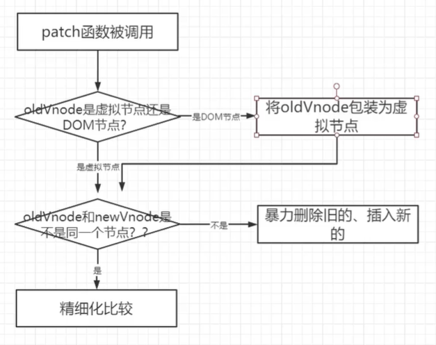
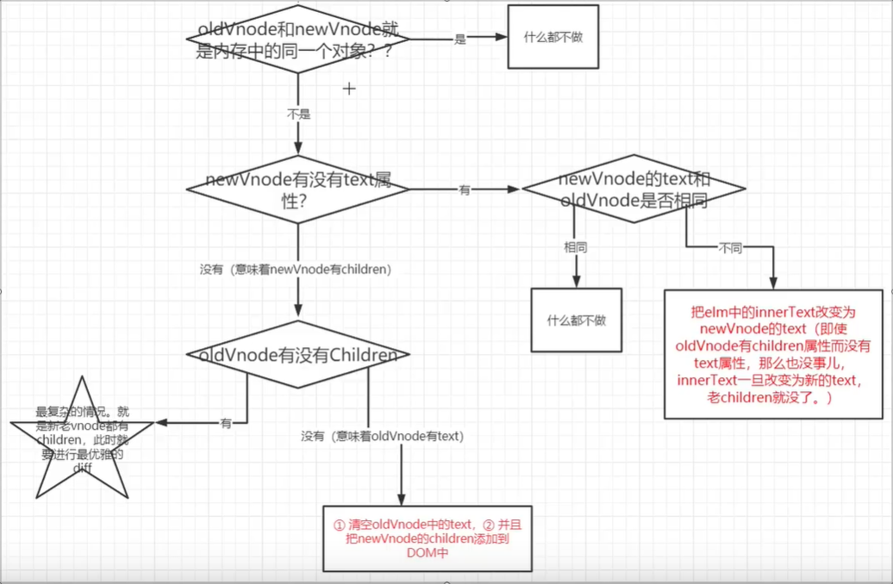
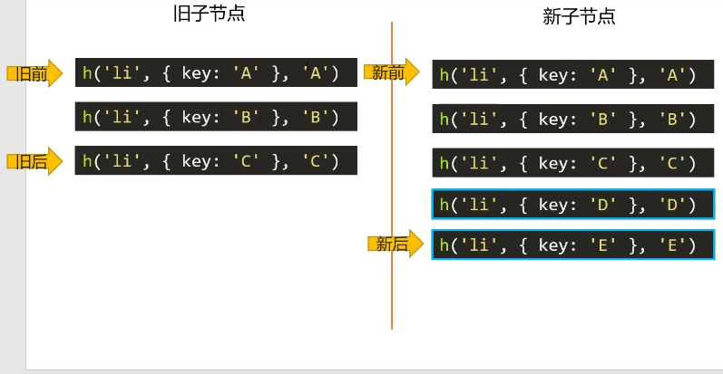
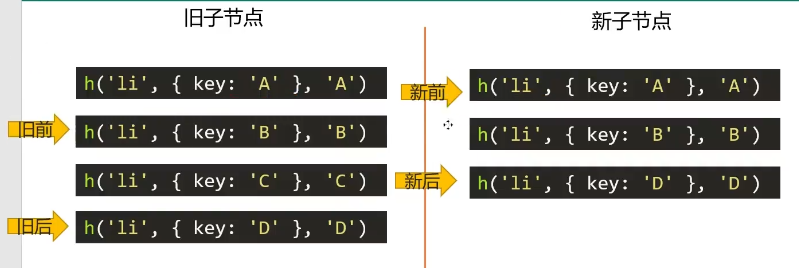
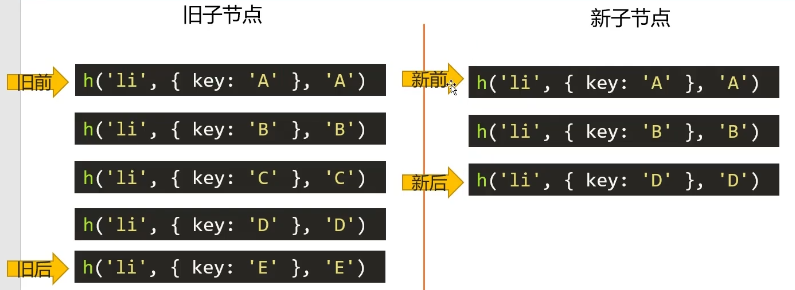
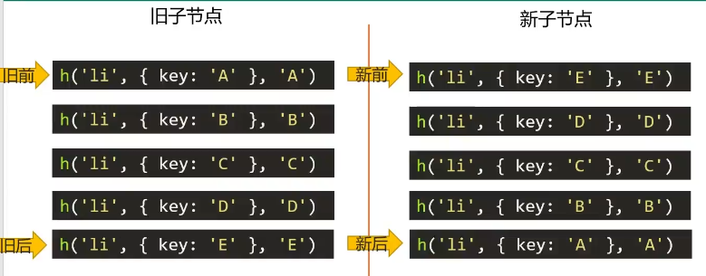

# 虚拟dom和diff算法的来源

vue 和 react 的虚拟dom和diff算法来源于一个叫 snabbdom 的库，这个库是用 typescript 写的是最早的 虚拟dom。这个库也就只有 200 行代码而已，如果想要使用看 js 版的源码可以使用npm安装查看。

```shell
npm i snabbdom -S
```

如果在 snabbdom 库的 package.json 中有 exports 属性，那个需要基于 webpack5 进行使用环境的搭建

```shell
npm i webpack@5 webpack-cli@3 webpack-dev-server@3 html-webpack-plugin -D
```


## 虚拟DOM 

虚拟dom简单来说就是使用 JavaScript 描述 DOM 的层次结构，DOM中的一切属性都在虚拟DOM 中有相对应的属性。如

```html
<div class="box">
  <h3>hello</h3>
  <ul>
    <li>milk</li>
    <li>coffe</li>
    <li>collo</li>
  </ul>
</div>
```

对应的虚拟DOM结构应该是

```json
{
  "sel":"div",
  "data":{
    "class":{"box":true}
  },
  "children":[
    {
      "sel":"h3",
      "text":"hello"
    },
    {
      "sel":"ul",
      "data":{},
      "children":[
        {"sel":"li","text":"milk"},
        {"sel":"li","text":"coffe"},
        {"sel":"li","text":"collo"},
      ]
    },
  ]
}
```

**注意**：diff 算法是将**新的虚拟DOM** 和**老的虚拟DOM** 进行比较，得出不同的地方。

**虚拟DOM 应该有的属性**

```json
{
  children:undefined,//子节点
  data:{
    class:{},
    props:{
      id,href
    },//除class外的属性数据
  },//属性数据
  elm:undefined,//转化成真实dom后的节点
  key:undefined,//唯一标识
  sel:"div",//节点名
  text:"hello",//文本节点值（内容）
}
```

在snabbdom上可以使用 h 函数生成虚拟dom 

```js
h ("a",{
    class:{box:true},
    props:{
        href:"https://www.baidu.com",
        target:"_blank",
        id:'sss'
    },
},"百度")
```

第一参数是节点名，第二个是节点的属性（可以不写），第三个是节点的内容可以是文本也可以是虚拟DOM或虚拟DOM数组

```js
h("div",[
  h("h3","hello"),
  h("ul",[
    h("li","milk"),
    h("li","coffe"),
    h("li","collo"),
  ]),
])
```


## 手写简单版 h 函数

h 函数是用来创建虚拟dom的。`h(tag,props,content)` 函数接三个参数，tag：标签名，props：标签属性，content：标签内容。

```js
function vnode(sel,data,children,text,elm){
  const key = data.key
  return {sel,data,children,text,elm,key}
}

/**
1:h("div",{},"文本")
2:h("div",{},[])
3:h("div",{},h())
*/
function h(sel,data,c){
  if(arguments.length != 3) throw new Error("必须要有三个参数");
  if(typeof c === 'string' || typeof c === 'number'){
    //情况1
   	return vnode(sel,data,undefined,c,undefined);
  }else if(Array.isArray(c)){
    //情况2
    let children = [];
    for(let i = 0;i<c.length;i++){
      if(!(typeof c[i] === "object" && c[i].hasOwnProperty("sel"))){
        throw new Error("传入的数组参数中有不是虚拟DOM的");
      }
     	children.push(c[i]);
    }
    return vnode(sel,data,children,undefined,undefined);
  }else if(typeof c === "object"){
    //情况3,这个情况说明也是有子元素的
    let children = [c];
    return vnode(sel,data,children,undefined,undefined);
  }else{
    throw new Error("")
  }
}
```


## patch 对比和挂载函数

snabbdom 中的diff算法是通过 patch 实现的，有一下特点

+ **key属性是虚拟节点的唯一标识符**，再有顺序结构的虚拟dom数组中，如果没有写key并且数据顺序有修改，在新旧虚拟dom节点进行对比的时候即使是一模一样的节点因为顺序改变也是会被认为不是原来的节点。
+ 只有是**同一个虚拟节点**(选择器和key都和原来的相同)，才进行精细化比较，否则就是暴力删除旧的、插入新的。
+ **只进行同层比较**，不会进行跨层比较，即使是同一片虚拟节点但是跨层了，依然会被暴力删除旧的，然后插入新的。

### **patch 的工作流程**



### 实现 patch 

```js
function patch(oldVnode,newVnode){
  //判断oldVnode 是虚拟节点还是dom节点
  if(oldVnode.sel === undefined && oldVnode.sel === ""){
     //是dom节点
    oldVnode = vnode(oldVnode.tagName.toLowerCase(),{},[],undefined,oldVnode);
  }
  //是虚拟节点
  //新旧虚拟节点是否是相同的
  if(oldVnode.key === newVnode.key && oldVnode.sel === newVnode.sel){
  	//是同一节点，进行精细化比较
  }else{
  	//不是同一节点，插入新的节点后暴力拆除原来的
  	let newVnodeElm = createElement(newVnode);
  	//将节点插入到原来dom之前
  	if(oldNode.elm.parentNode && newVnodeElm) {
  		oldNode.elm.parentNode.insertBefore(newVnodeElm,oldNode.elm);
  	}
    //删除老节点
    oldVnode.elm.parentNode.removeChild(oldVnode.elm);
  }
}
```

### 创建真实dom 的方法

```js
//通过虚拟节点创建真实dom节点，并将节挂载到虚拟dom 的elm属性上
function createElement(vnode){
  //创建dom节点
  let domNode = document.createElement(vnode.sel);
  //为节点添加上属性
  //是否有子节点还是有文本
  if(vnode.text !== "" && (vnode.children == undefined || vnode.children.length === 0)){ 
     //内部文字
     domNode.innerText = vnode.text;
  }else if(Array.isArray(vnode.children) && vnode.children.length > 0){
    for(let i = 0; i<vnode.children.length; i++){
      let item = vnode.children[i]
      let chDom = createElement(item);
      domNode.appendChild(chDom);
    }
  }
  
  //将节点挂载到elm上
  vnodm.elm = domNode;
  return vnode.elm;
}
```

之后就是需要实现相同虚拟节点的比较



### 相同节点的子节点对比策略

将同一节点的对比抽离成一个函数为 patchVnode ，对于子节点的diff算法可以分为下面几种情况，依次对比四种情况，当命中了一种情况后就不在往后匹配新的情况

1. 新前与旧前
2. 新后与旧后
3. 新后与旧前
4. 新前与旧后

如果以上四种情况都无人找到匹配的那么就进行循环查找旧子节点中是否有节点和当前要找的节点匹配，如果找到了就将这个旧节点设置成undefined，并将对应的真实dom节点插入到旧前节点之前，然后新前继续下移。

**需要注意**：

2. 当第三种情况 新后与旧前 命中的时候，此时要移动节点。移动新后指向的节点到老节点的**旧后的后面**
2. 当第四种情况 新前与旧后 命中的时候，此时要移动节点。移动新前指向的节点到老节点的**旧前的前面**

需要准备四个指针（新前，旧前，新后，旧后）去记录区别位。

#### **情况1**：新增

当在1的位置时，判断节点是相同的，新前和旧前指针同时向下移动一位到达2位发现也是一样的，所以再向下移动到达3位，发现还是相同的，此时 新前<新后，旧前=旧后，循环结束（新前<=新后&&旧前<=旧后），得出结果 旧后 到 新后的内容D，E是新增的。如果旧节点先循环完毕，说明新节点中有要插入的节点



#### **情况2**：单删除

当新前和旧前到达3位时，发现这两个节点不一样，新前与旧前这种情况结束，然后开始新后与旧后这种情况，此时新后与旧后位置节点匹配上了，然后新后和旧后同时往上移动一步，循环结束；如果是新节点先循环完毕，如果老节点中还有剩余节点，说明他们是要被删除的节点。



#### **情况3**：多删除情况

当到达3位后，新前与旧前方式无法匹配，然后依次进行其他三种方式，发现都不匹配，开始循环查找，将在旧子节点中查找到的D节点， 设置成undefined，并将真实dom插入到旧前指向的位置之前，然后新前继续下移发现循环结束；如果是新节点先循环完毕，如果老节点中还有剩余节点（旧前和新后中间的节点），说明他们是要被删除的节点。



#### **情况4**：位置变化

程序开始，当实验到第三种情况 新后和旧前 的时候才命中了，所以将 A 节点移动到旧后之后，并且将，旧前指向的位置设置成undefined，然后旧前向下移动一位，新后向上移动一位，发现也匹配了然后将B移动到旧后的后面并将旧前的位置设置成undefined，以此类推可以得出最终结果。



根据以上的规则可以写出下面的程序

```js
/**
检查子节点属于的情况
@param parentElm 父节点
@param oldCh 旧子节点数组
@param newCh 新子节点数组
*/
function updateChildren(parentElm,oldCh,newCh){
  let oldStartIdx = 0;//旧前
  let newStartIdx = 0;//新前
  let oldEndIdx = oldCh.length - 1;//旧后
  let newEndIdx = newCh.length - 1;//新后
  let oldStartVnode = oldCh[oldStartIdx];//旧前节点
  let newStartVnode = newCh[newStartIdx];//新前节点
  let oldEndVnode = oldCh[oldEndIdx];//旧后节点
  let newEndVnode = newCh[newEndIdx];//新后节点
  let keyMap = null;
  
  while(newStartIdx <= newEndIdx && oldStartIdx <= oldEndIdx){
    //要先判断是否为undefined，如果是就是已经处理过了的需要略过
    if(oldStartVnode == null || oldCh[oldStartIdx] == undefiend){
      oldStartVnode = oldCh[++oldStartIdx];
    }else if(oldEndVnode == null || oldCh[oldEndIdx] == undefiend){
      oldEndVnode = oldCh[--oldEndIdx];
    }elseif(newStartVnode == null || newCh[oldStartIdx] == undefiend){
      newStartVnode = newCh[++newStartIdx];
    }else if(newEndVnode == null || newCh[newEndIdx] == undefiend){
      newEndVnode = newCh[--newEndIdx];
    }else 
    if(checkSameVnode(newStartVnode,oldStartVnode)){//新前与旧前
      //对比两个节点
      patchVnode(oldStartVnode,newStartVnode);
      //指针与节点后移
      newStartVnode = newCh[++newStartIdx];
      oldStartVnode = oldCh[++oldStartIdx];
    }else if(checkSameVnode(newEndVnode,oldEndVnode)){//新后与旧后
      //对比两个节点
      patchVnode(oldEndVnode,newEndVnode);
      //指针与节点前移
      newEndVnode = newCh[--newEndIdx];
      oldEndVnode = oldCh[--oldEndIdx];
    }else if(checkSameVnode(newEndVnode,oldStartVnode)){//新后与旧前
      //对比两个节点
      patchVnode(oldStartVnode,newEndVnode);
      //将新后指向的节点移动到旧后指向的节点之后，因为新后与旧前节点是一样的，为确保有elm属性应该使用 旧的节点
      parentElm.insertBefore(oldStartVnode.elm,oldEndVnode.elm.nextSibling);
      oldStartVnode = oldCh[++oldStartIdx];
      newEndVnode = newCh[--newEndIdx];
    }else if(checkSameVnode(newStartVnode,oldEndVnode)){//新前与旧后
      //对比两个节点
      patchVnode(oldEndVnode,newStartVnode);
      //将新前指向的节点移动到旧前指向的节点之前，因为新前与旧后节点是一样的，为确保有elm属性应该使用 旧的节点
      parentElm.insertBefore(oldEndVnode.elm,oldStartVnode.elm);
      oldEndVnode = oldCh[--oldEndIdx];
      newStartVnode = newCh[++newStartIdx];
    }else{//循环查找
      //创建 key-index 的map，方便后面通过key查找到原来key对应的位置
      if(!keyMap){
        keyMap = {};
        for(let i = oldStartIdx; i <= oldEndIdx; i++){
          const key = oldCh[i].key;
          if(key != undefiend){
            keyMap[key] = i;
          }
        }
      }
      
      //寻找当前新前节点在keyMap中映射的位置序号
      const idxInOld = keyMap[newStartVnode.key];
      if(idxInOld == undefined){
        //如果idxInOld 是 undefined 说明是全新的项，需要插入到旧前之前
        parentElm.insertBefore(createElement(newStartVnode),oldStartVnode.elm);
      }else{
        //如果idxInOld 不是 undefined 说明节点需要移动到旧前之前，并设置当前找到的节点为undefined
        const elmToMove = oldCh[idxInOld];
        patchVnode(elmToMove,newStartVnode);
        oldCh[idxInOld] = undefiend;
        parentElm.insertBefore(elmToMove.elm,oldStartVnode.elm);
      }
      newStartVnode = newCh[++newStartIdx];
    }
  }
  
  //循环结束，如果 新前<=新后 表示 新前后新后之间的节点是新增的，将节点添加到旧前之前
  if(newStartIdx <= newEndIdx){
    for(let i = newStartIdx; i <= newEndIdx; i++){
      //对于insertbefore,如果第二个参数是null则效果同appendChild
     let oldBeforeVnode = oldCh[oldStartIdx] ? oldCh[oldStartIdx].elm : null; parentElm.insertBefore(createElement(newCh[i]),oldBeforeVnode);
    }
  }else if(oldStartIdx <= oldEndIdx){//旧前<=旧后，表示旧前与旧后之间的节点应该被删除
    for(let i = oldStartIdx; i <= oldEndIdx; i++){
      if(oldCh[i]){
        parentElm.removeChild(oldCh[i].elm);
      }
    }
  }
}

/**检查节点是否相同*/
function checkSameVnode(oldVnode,newVnode){
  return oldVnode.sel == newVnode.sel && oldVnode.key == newVnode.key;
}
```


```js
//检查是否是同一个节点
function patchVnode(oldVnode,newVnode){
  	//如果新旧虚拟节点是同一节点：直接返回
    if(oldVnode === newVnode) return;
    //如果新节点有text：将旧节点的内容直接替换
    if(newVnode.text !== undefined && (newVnode.children === undefined || newVnode.children.length === 0)){
      if(newVnode.text !== oldVnode.text){//内容不同，替换
        oldVnode.elm.innerText = newVnode.text;
      }
    }else{
       //如果新节点没有text，意味新节点有children节点：旧节点有text节点——使用新节点的children替换旧节点的内容
      if(oldVnode.text !== undefined && (oldVnode.children === undefined || oldVnode.children.length === 0){
        oldVnode.elm.innerText = "";
        for(let i = 0;i < newVnode.children.length;i++){
        	let vnode = newVnode.children[i];
        	let dom = createElement(vnode);
        	oldVnode.elm.appendChild(dom);
      	}
      }else{
        //如果新旧节点都有children节点:逐层比较。
        updateChildren(oldVnode.elm,oldVnode.children,newVnode.children);
      }
    }
}
```


```js
function patch(oldVnode,newVnode){
  //判断oldVnode 是虚拟节点还是dom节点
  ......
  //是虚拟节点
  //新旧虚拟节点是否是相同的
  if(oldVnode.key === newVnode.key && oldVnode.sel === newVnode.sel){
  	//是同一节点，进行精细化比较
    patchVnode(oldVnode,newVnode);
  }else{
  	//不是同一节点，插入新的节点后暴力拆除原来的
    .....
  }
}
```


以上代码结果不完整，如设置属性，将新的虚拟节点挂载到树上，以及设置节点内容方面都是还没有完整的。