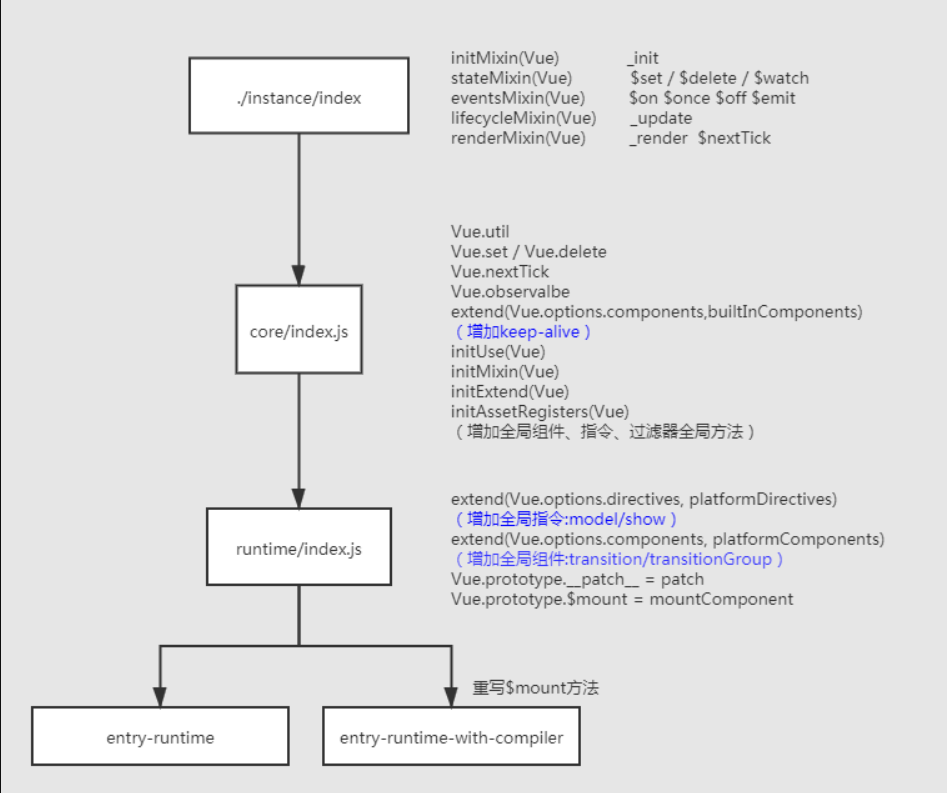
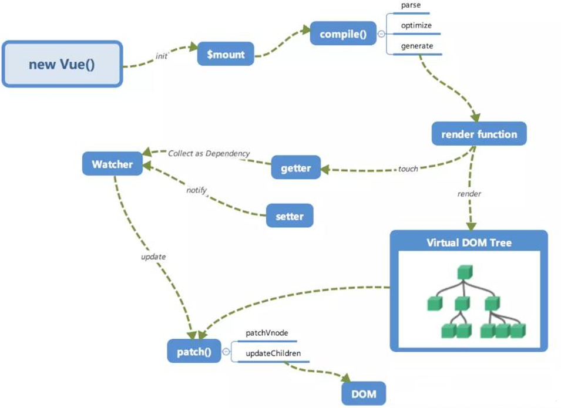

## 源码获取

在看源码的时候首先要做的就是将源代码从github上下载下来。

```shell
git clone https://github.com/vuejs/vue.git
```

需要注意的是，要注意版本，目前vue已经到了3的版本，默认情况下是克隆主干的，所以可以克隆指定分支到本地

```SHELL
git clone --branch dev https://github.com/vuejs/vue.git
```

或者也可以在克隆主干后切换到`dev`分支上`git checkout -b dev origin/dev`

下载之后运行`npm install`安装依赖。之后运行`npm run dev`命令就可以打包生成源码了


## 源码目录结构

```
benchmarks  目录是用来做性能测试的
dist  最终打包出来的结果都放到 dist
examples 官方的例子
flow 类型检查（和ts类似，但是现在没人用了）
packages  一些写好的包（vue源码中包含weex）
scripts  所有打包的脚本都放这里
src 源代码目录
 - compiler 专门用来做模板编译的
 - core vue2代码核心
 - platform 平台
 - server 服务端渲染相关
 - sfc 解析单文件组件的（single file component）
 - shared 就是模块之间的共享属性和方法
```


## 寻找入口文件

在 `package.json` 中的 `scripts`可以看到大多数的命令打包配置都是`scripts/config.js`。所以可以去这个文件中查看打包的配置

```js
const builds = {}
-
function genConfig(){}
-
if (process.env.TARGET) {
  module.exports = genConfig(process.env.TARGET)
} else {
  exports.getBuild = genConfig
  exports.getAllBuilds = () => Object.keys(builds).map(genConfig)
}
```

可以看出最终打包的配置是根据命令传入的环境变量`TARGET`在`builds`中找到对应的配置的，而在运行`npm run dev`的之后传入的`TARGET`就为`web-full-dev`。他们的含义如下

```
dev 开发   
prod 生产
web-runtime 运行时，无法解析new Vue传入的template
web-full 含有runtime和模板解析
web-compiler 只有模板解析
cjs commonjs规范
esm es6模块规范
browser 浏览器规范可以通过script引入使用
umd 支持global amd + cjs
```

那么在`builds`中找到`web-full-dev`可以看到，打包的入口是`web/entry-runtime-with-compiler.js`。但是需要注意的是，这个并不是真正的入口，因为这个路径还需要经过`resolve`方法进行解析得到`src/platforms/web/entry-runtime-with-compiler.js`

> 对比`src/platforms/web/entry-runtime-with-compiler.js`和`src/platforms/web/entry-runtime.js`会发现他们之间的却别其实就是重写了`$mount`方法

可以看到在`entry-runtime-with-compiler.js`中的Vue是来自于`runtime/index.js`中的，所以要看`runtime/index.js`中的Vue，如此往复就能找到vue的定义了。

+ `entry-runtime-with-compiler.js` 重写 `mount`方法
+ => `runtime/index.js`  所谓的运行时会提供一些dom操作的api，如属性操作，元素操作，提供一些组件和指令
+ => `core/index.js` 有`initGlobalAPI`初始化全局api
+ => `/instance/index` Vue的构造函数

**总体流程**




知道大致每个文件都干了些什么之后就可以看一下其中的方法是怎么实现的了，主要的方式有两种

+ 如果已经知道了核心的流程你那么可以单独打开源码去看
+ 如果不知道流程 可以通过一些测试用例来debugger，查看其中的流程和实现

在用第二种方法的时候要注意啊，默认的配置中是不回打包出`sourcemap`文件的，也就是断点看看不了源码。所以我们需要开启已`sourcemap`打包设置。有两种方式开启，一种是到`scripts/config.js`的`genConfig`方法的`output`中加上`sourcemap:true`；一种是直接在`package.json`文件的`scripts`脚本命令中添加一个`--sourcemap` 参数.

```shell
"dev": "rollup -w -c scripts/config.js --sourcemap --environment TARGET:web-full-dev",
```

之后就可以运行`npm run dev`就会重新运行生成文件，从实例中开始调试了。


## 关于Vue的响应式数据

通过断点可以知道，在实例化Vue（`core/instance/index.js`）的时候会传入 data 属性，实例化Vue的时候会调用`this._init()`方法来进行初始化，而这个`_init`是通过`initMixin`注入的，在其中又会调用`initState(vm)`来进行响应式数据的初始化，而在其中又使用了`observer()`来对对象的每个属性进行观察，创建成为`Observer`（在这里面用`defineReactive`来劫持数据）。

`core/instance/index.js -> this._init()|initMixin() -> initState(vm) -> observer() ->   new Observer(val) -> this.walk(value) -> defineReactive()（首次一定会执行这个方法，因为根的数据只会是一个对象）`

**那么对Vue响应式数据的理解**

可以监控一个数据的修改和获取操作，针对对象格式会给每个对象的属性使用`Object.defineProperty`进行劫持

在源码层面来说就是在初始化数据的时候，使用`observe`方法来为数据创建`Observer`对象，在实例化这个对象的时候会调用`defineReactive`方法来劫持对象中的每个属性，递归的为每个对象中的属性增加`getter setter`。

`defineReactive`方法内部对所有属性进行重写，这会导致性能问题，所以我们在使用Vue的时候如果数据的层级过高就需要考虑优化，如果数据不是响应式的就不要放到data中，在属性取值的时候尽量避免多次取值，比如在循环中`this.num++;`，如果有些对象是放到data中，但是不是响应式的数据的时候可以考虑使用`Object.freeze`来冻结对象。


## 关于Vue对数组数据的观察

在Vue中通过索引的方式来改变数据`this.arr[2]='jack'`，页面不会做出响应，因为在Vue中并没有对数组进行数据劫持，因为这样做的性价比不高，在开发中很少会有需要使用索引来修改数据的情况，比如说`this.arr[122]`这种情况很少出现，还有一个原因就是当数组数据很长的时候（比如`length = 122`的空内容数组），如果对每一想都进行数据劫持的话那么性能消耗是很高的。

所以在Vue中不会对数组中的每项做数据劫持，而是通过重写数据的变异方法（函数劫持）来实现响应式数据。所以通过索引修改数组数据，修改长度都是无法进行监控的

`core/instance/index.js -> this._init()|initMixin() -> initState(vm) -> observer() ->   new Observer(val) ->  protoAugment(value, arrayMethods) `

`protoAugment(value, arrayMethods)`方法对传入的数组数据进行原型链（`__proto__`）修改，后续调用的方法都是重写后的方法，同时也会对数组中的每个对象也再次进行代理，实现对数组中的对象进行代理。


## 关于Vue中的依赖收集

所谓的依赖收集（观察者模式）被观察者指的是数据（dep），观察者（watcher，有3种：渲染watcher、计算属性watcher、用户watcher），一个watcher中可能会对应多个数据 watcher 中还需要保存dep（重新渲染的时候可以让属性重新记录watcher）计算属性也会用到

watcher 和 dep 是一个多对多的关系，一个dep对应多个watcher，一个watcher有多个dep，默认渲染的时候会进行依赖收集（会触发get方法），数据更新了就找到属性对应的watcher去触发更新

`platforms/web/runtime/index.js -> $mount() -> mountComponent() -> new Watcher() -> this.get() -> this.getter()`

`this.getter()`就是调用`vm._update(vm._render())`，此时会触发数据的 getter 方法，这时候就会做依赖收集的工作




## 关于Vue模板模板编译原理

当向Vue中传递 template 属性，我们需要将这个template编译成render函数

`template -> ast语法树 -> 对语法树进行标记（标记的是静态节点）-> 将ast语法树生成render函数`

最终每次渲染可以调用render函数返回对应的虚拟节点（递归是先子后父），之后调用`_update`就可以将虚拟DOM生成为真实DOM

`src/platforms/web/entry-runtime-with-compiler.js -> $mount() -> compileToFunctions() -> `


## 关于Vue生命周期钩子如何实现

就是内部利用一个发布订阅模式，将用户写的钩子维护成一个数组，后续一次调用callHook，主要靠的是 mergeOptions 方法将根的 options 和子组件的 options 合并在一起

`instance/index.js -> _init() -> mergeOptions()`


## 关于Vue生命周期有都用来做什么

vue 中生命周期函数一共有11个，在`instance/index.js -> _init() -> mergeOptions()`合并了选项之后，就会有生命周期函数，之后在某些执行时机就会通过`callHook`调用对应的生命周期函数，比如在`instance/index.js -> _init()`中就有

```js
initLifecycle(vm) //这里初始化组件之间的父子关系 $parent $children
initEvents(vm) //这里初始化 $on $emit $off
initRender(vm) //声明一些变量和方法 $slot $createElement $nextTick
callHook(vm, 'beforeCreate')
initInjections(vm) //定义 inject方法
initState(vm) //初始化响应式数据
initProvide(vm) //定义 provide方法
callHook(vm, 'created')
```

**什么时候发请求获取数据比较合适？**

一般来说是在`mounted`中发送请求，但是生命周期函数都是同步执行的，所以其实放在`created`中也是可以的。这里有一个很常见的误解，就是一位在created发送请求，到执行mounted的时候就以为请求完成了，其实是错误的，因为请求是异步操作，而生命周期是同步执行的，所以请求结果一定是在mounted之后返回。

+ `beforeCreate` 这里没有响应式数据，能够访问到的数据非常少，而且也用得很少，所以在Vue3中已经启用了
+ `created` 能拿到的是响应式的属性（不涉及到dom渲染）这个api可以用在服务端渲染中使用
+ `beforeMount` 没有实际价值
+ `mounted` mounted中可以获取$el
+ `beforeUpdate` 更新前
+ `updated` 更新前后
+ `activated`  `<keep-alive>`组件特有的生命周期，在激活时执行
+ `deactivated`  `<keep-alive>`组件特有的生命周期，在离开时执行
+ `beforeDestroy` 手动调用移除回触发
+ `destroyed` 销毁后触发
+ `errorCaptured` 错误捕获


## 关于 `Vue.mixin`的使用场景和原理

我们可以通过`Vue.mixin`来实现逻辑的复用，但是容易导致数据来源不明确，难以排除bug，也可以会导致命名冲突，高级组件，vue3采用compositionAPI来解决。

`core/global-api/mixin.js`

mixin 的核心就是合并属性（内部采用了策略模式进行合并）全局mixin，局部mixin，针对不用的属性有不用的合并策略


## 组件的 data 为什么必须是一个函数

原因在于针对根实例而言，`new Vue`，组件是通过一个构造函数多次创建实例，如果是同一个对象的话那么数据会被相互影响。每个组件的数据都是独立的，那每次都要调用data函数创建一个新的对象。

`core/global-api/extend.js`


## 关于`$nextTick`的实现

nextTick 内部采用了异步任务进行了包装（多个nextTick调用会被合并成一次，内部会合并回调）最后在异步任务中批处理，主要的应用场景就是异步更新（默认调度的时候就会添加一个nextTick任务），用户为了获取最终的渲染结果需要在内部执行之后在执行用户定义的函数，这时候用户需要将对应的逻辑放到nextTick中。

在数据发生变动的时候，会调用`core/observer/watcher.js -> update() -> queueWatcher()`方法，这个方法也会把更新任务放到`nextTick`等待执行，之后会运行各个生命周期函数，将里面用户自己定义的nextTick添加到队列中所以先执行了渲染的 nextTick 然后再执行用户自己定义的nextTick，所以可以拿到最新的DOM。**同时也要注意，nextTick 要定义在数据更新之后**。

`core/util/next-tick.js` 


## Vue组件间传值的方式及区别

props 父传递数据给儿子，属性的原理就是把解析后的props，验证后就会将属性定义再当前的实例上 `vm._props`（这个对象上的属性都是通过`defineReactive`来定义的（都是响应式数据）组件在渲染的过程中会去vm上取值 _props 属性会被代理到vm上）

`core/instance/state.js -> initState() -> initProps()`

emit 儿子出发组件更新，在创建虚拟节点的时候将所有的事件绑定到 listeners，通过 `$on` 方法绑定事件，`$emit`方法来触发事件（发布订阅的模式）

eventBus 原理就是发布订阅模式`$bus = new Vue()`简单的通信可以采用这种方式

`$parent $children`就是在创造子组件的时候会将父组件的实例传入。在组件本身初始化的时候会构建组件间的父子关系， `$parent`获取父组件的实例，`$children`可以获取所有子组件的实例

`core/instance/lifecycle.js -> initLifecycle()`

ref 可以获取dom元素和组件实例（虚拟dom没有处理ref，这里无法拿到实例 也无法获取组件）创建dom的时候如何处理 ref 的？会将用户的所有的dom操作及属性都维护到一个cbs（create update insert destroy）属性中。依次调用cbs中create方法，这里就包含ref相关的操作，会操作ref并赋值

`core/vdom/modules/ref.js -> registerRef()`

provide 在父组件中将属性暴露出来，inject 在后代组件中通过 inject 注入熟悉，在父组件中提供数据，在子组件中递归向上查找

`core/instance/inject.js`

`$attr` 所有的组件上的属性，不含盖props，`$listeners`组件上所有事件，通过`v-bind="$attrs"`可以给组件绑定说有的属性，`v-on="$listeners"`可以绑定所有的事件

`core/instance/render.js`

`Vue.observalble`可以创建一个全局的响应式数据，返回的对象可以直接用于渲染函数和计算属性内，并且会在发生变更时触发相应的更新。也可以作为最小化的跨组件状态存储器

vuex


## v-for 和 v-if 的优先级

可以在[这里](https://v2.template-explorer.vuejs.org/#%3Cdiv%20id%3D%22app%22%3E%7B%7B%20msg%20%7D%7D%3C%2Fdiv%3E)查看模版生成的渲染函数

```jsx
<div>
	<span v-if="d in 3" v-if="flag">{d}</span>
</div>
-------------------------
function render() {
  with(this) {
    return _c('div', _l((3), function (d) {
      return (flag) ? _c('span', [_v("{d}")]) : _e()
    }), 0)
  }
}
```

可以看出 v-for 的优先级比 v-if 的优先级高。所以在每次循环的时候都会做判断，所以`v-if`和`v-for`不要一起使用。如果`v-if`和`v-for`使用的数据是没有关联的可以将`v-if`移动到外层的`template`上；如果使用的数据有关联可以使用计算属性对`v-for`的数据先做处理，过滤出需要显示的数据。

`compiler/codegen/index.js -> genElement()`


## v-if 和 v-show 的区别

`v-if` 控制是否渲染，如果为`false`那么在一开始的时候就不会去渲染出来，在页面上也找不到这个元素；`v-show`控制的是样式，通过控制`display`来控制是否显示，如果是`false`就是设置`display:none;`，如果重新设置为`true`就会设置`display`为原来的属性。

为什么不用`visbility:hidden;`或`opacity:0`？因为他们两个都会占位，而且`opacity`还是响应事件。

`v-if`在编译的时候会变成三元表达式，`v-show`会变成一个指令

`platform/web/runtime/directives/show.js -> bind()`


## `v-if`,`v-for`,`v-model`的实现原理

`v-if` 会被编译成三元运算符 

`compiler/codegen/index.js -> genElement() -> genIf()`

`v-for` 会被编译成`_l`循环

`compiler/codegen/index.js -> genElement() -> genFor()` ，`core/instance/render-helpers/index.js -> renderList()`。

`v-model` 放在表单元素上是实现双向绑定，放在组件上就不一样。对于`input`上`type`的值不一样生成的渲染函数也不一样。

`compiler/codegen/index.js ->  genDirectives() -> gen()`

`platforms/web/compiler/directives/model.js -> model()`

而且`v-model`对中文输入是做了处理的，会等到输入完成之后才更新页面。

`platforms/web/runtime/directives/model.js -> directive -> inserted() -> onCompositionStart() ,onCompositionEnd()`

这里指令的作用就是处理中文输入完毕之后手动触发更新。

我们知道`v-modal`其实是`@input :vaule`的语法糖，当`v-modal`绑定到组件上的时候也会生成一个指令，我们可以在组件中可以通过`modal:{prop,event}`来自定义原来的`input`事件和`value`。

`core/vdom/create-component.js -> transformModel()`


## `.sync`修饰符的作用，用法及实现原理

有时后可能需要给组件绑定多个响应式数据，但是在同一个组件下不能使用多次`v-modal`所以就出现了`<com :data.sync="xx">`本质上就是一个语法糖，表示`<com :data="xx" @update:data="xx = $event">`。


## Vue.use 是干什么的？原理是什么？

这里的use方法目的就是将 vue 的构造函数传递给插件中，让所有的插件依赖的Vue是同一个版本，如果传入的插件是一个函数就默认调用，如果传入的是一个对象就调用他里面的`install`方法。并且重复的插件不会被重复安装

`core/global-api/use.js`


## 组件中name的作用

在 Vue 中有name属性的组件可以被递归调用（在写模版语法的时候我们可以通过name属性来递归调用自己，但是主要使用`v-if`来中断递归）

在声明组件的时候 `Sub.options.components[name] = Sub`

可以用来标识组件，通过 name 来找到对应的组件，自己封装跨级通信。

可以用在devtool中标识组件。

`core/global-api/extend.js`


## Vue中插槽 slot 是如何实现的？什么时候使用它？

在Vue2中有三种插槽，普通插槽、具名插槽、作用域插槽。要了解插槽的实现，首先要知道它是怎么使用的，编译出来是什么样子的。在Vue中模版的编译模版使用的是`vue-template-compiler`来实现。

**对于普通插槽**

```js
const templateCompiler = require("vue-template-compiler");
let result = templateCompiler.compiler(`
<my><div>{{msg}}</div></my>
`);
```

编译得到的结果中有渲染函数`_c('my',[_c('div',[_v(_s(msg))])])`，编译出来的函数会立即执行，所以`_v(_s(msg))`就会去当起的环境去取值，也就是当前使用`my`组件的环境的`data`，而`_c`表示的是函数`core/vdom/create-component.js -> createComponent() `在这里会给节点创建一个虚拟节点这个这个节点会传入一个`componentOptions`，里面包含了子节点和自己节点的信息（组件的孩子叫插槽）。

之后就可以创建组件的真实节点，`core/instance/init.js -> _init() -> initInternalComponent()`，在这里会将`componentOptions.children`（插槽）保存到`vm.$options._renderChildren`中，之后在渲染的时候就会去`core/instance/render.js -> resolveSlots()`初始化解析出当前组件相应的插槽并挂载到`vm.$slots`


