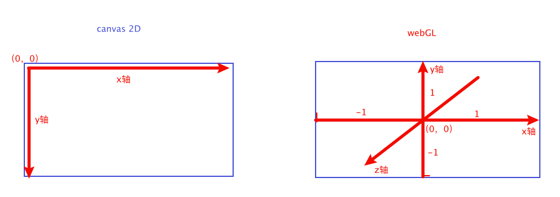
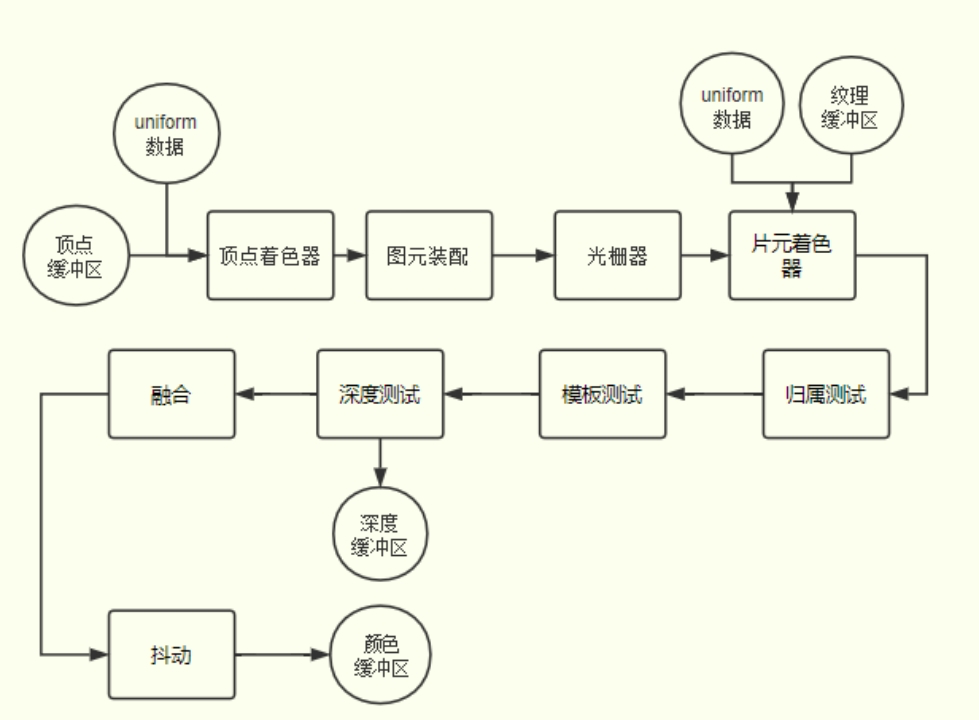
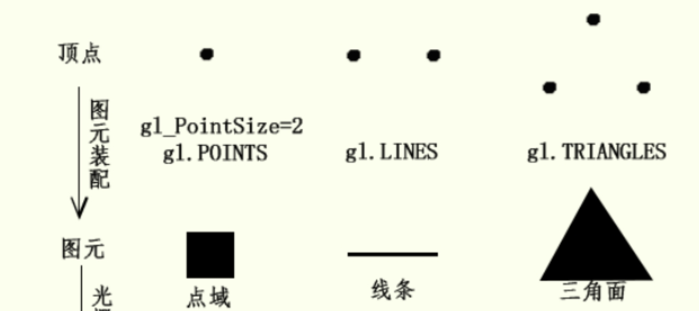
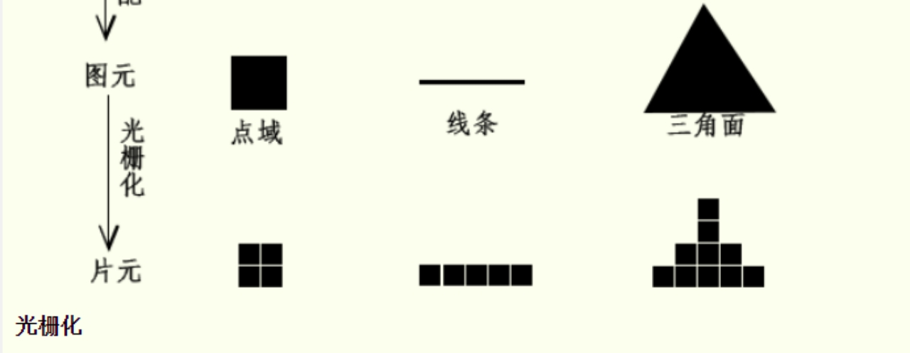

## webGL 概念

WebGL（Web图形库）是一个JavaScript API。可在任何兼容的Web浏览器中渲染高性能的交互式3D和2D图形，而无需使用插件。webGL 和 canvas 2D 一样需要使用到`<canvas>`标签来提供展示的容器和环境，而且 webGL 可以根据 js 提供的数据和调用的 api 来直接将数据提供给GPU来计算。

在 webGL 上运行的代码需要有成对的方法，每对方法中一个叫顶点着色器， 另一个叫片断着色器，并且使用一种和C或C++类似的强类型的语言 [GLSL](https://webglfundamentals.org/webgl/lessons/zh_cn/webgl-shaders-and-glsl.html)。 (GL着色语言)。 每一对组合起来称作一个 *program*（着色程序）。


## webGL 坐标系

在 canvas 2D 中坐标系的原点是我们熟知的从从容器左上角距离和尺寸单位都是px，而在 webGL 中坐标系的原点是从容器的中心开始的，并且坐标的长度都是 1，所以在坐标系中空间范围是[-1,1]，也可以理解为比例[-1,1]的长度正式容器的宽高成度。



也就是在宽高为 300，200 的canvas 容器中，设置webGL 一个点坐标为（0.5，0.2），这个点会显示在`（150 + 150*0.5，100 + 100*0.2）`中。


## webGL 的工作流程

webGL 的工作流程其实也就是渲染的流程。在这里称之为渲染管线。

渲染管线就像一条流水线，由一系列具有特定功能的数字电路单元组成，下一个功能单元处理上一个功能单元生成的数据，逐级处理数据。

顶点着色器和片元着色器是可编程的功能单元，拥有更大的自主性，还有光栅器、深度测试等不可编程的功能单元。CPU会通过WebGL API和GPU通信，传递着色器程序和数据，GPU执行的着色器程序可以通过useProgram方法切换，传递数据就是把CPU主存中的数据传送到GPU的显存中。



### 顶点着色器

顶点着色器是GPU渲染管线上一个可以执行着色器语言的功能单元，具体执行的就是顶点着色器程序，WebGL顶点着色器程序在Javascript中以字符串的形式存在，通过编译处理后传递给顶点着色器执行。 顶点着色器主要作用就是执行顶点着色器程序对顶点进行变换计算，比如顶点位置坐标执行进行旋转、平移等矩阵变换，变换后新的顶点坐标然后赋值给内置变量gl_Position，作为顶点着色器的输出，图元装配和光栅化环节的输入。

> 顶点着色器的内置变量除了gl_Position外还有gl_FrontFacing、gl_PointSize
>
> **attribute**：是存储限定符，表示接下来的变量是一个attribute变量。attribute 变量必须声明成全局变量，数据将从着色器外部传给该变量。
>
> **uniform**：用来从 js 程序向顶点着色器和片元着色器传输一致的数据

### 图元装配

顶点变换后的操作是图元装配(primitive assembly)，硬件上具体是怎么回事不用思考，从程序的角度来看，就是绘制函数drawArrays()或drawElements()第一个参数绘制模式mode控制顶点如何装配为图元， gl.LINES的定义的是把两个顶点装配成一个线条图元，gl.TRIANGLES定义的是三个顶点装配为一个三角面图元，gl.POINTS定义的是一个点域图元。



### 光栅化

片元着色器和顶点着色器一样是GPU渲染管线上一个可以执行着色器程序的功能单元，顶点着色器处理的是逐顶点处理顶点数据，片元着色器是逐片元处理片元数据。通过给内置变量gl_FragColor赋值可以给每一个片元进行着色， 值可以是一个确定的RGBA值，可以是一个和片元位置相关的值，也可以是插值后的顶点颜色。除了给片元进行着色之外，通过关键字discard还可以实现哪些片元可以被丢弃，被丢弃的片元不会出现在帧缓冲区，自然不会显示在canvas画布上。




## webGL 画个三角形

首先我们需要创建一个canvas 容器

```html
<canvas id="canvas" width="300" height="200"></canvas>
```

然后创建获取并且创建webGL上下文

```js
let canvas = document.getElementById("canvas");
let gl = canvas.getContext('webgl');
if(!gl){
  alert('您的浏览器不支持webgl');
}
//设置视口大小
gl.viewport(0,0,canvas.width,canvas.height);
```

之后可以创建着色器程序了，可以通过字符串模版创建，也可以使用不被浏览器解析的标签创建，比如`<script type='notjs' id='vertex-shader-2d'>`之后获取这个标签的内容就好。

```html
这是一个顶点着色器
<script type='notjs' id='vertex-shader-2d'>
	//一个属性变量，将会从缓冲中获取数据，vec4 表示每4个值为一个数据
	attribute vec4 a_position;
	//所有着色器的入口都是 main
	void main(){
		//gl_Position 用来设置绘制的点位坐标
		gl_Position = a_position;
	}
</script>

这是一个片元着色器
<script type='notjs' id='fragment-shader-2d'>
	//片元着色器没有默认精度，这里设置为中等精度
	precision mediump float;
	void main(){
		//gl_FragColor 设置片段填充的颜色
		gl_FragColor = vec4(1,0,0.5,1);//vec4 和 rgba 颜色表示类似，不过值是0～1
	}
</script>
```

创建完成着色字符模版之后，还需要通过编译才能形成GPU认识的的代码

```js
/**
@param gl 渲染上下文
@param type 着色器类型
@param source 传递给着色器的数据
*/
function createShader(gl,type,source){
  let shader = gl.createShader(type);//创建着色器对象
  gl.shaderSource(shader,source);//提供数据源
  gl.compileShader(shader);//编译 生成着色器
  //获取编译状态
  let success = gl.getShaderParameter(shader,gl.COMPILE_STATUS);
  if(success){
    return shader;
  }
  //如果编译生成着色器失败，输出日志，并删除shader释放内存
  console.log(gl.getShaderInfoLog(shader));
  gl.deleteShader(shader);
}
```

在生成着色器之后还不能直接使用，因为可能存在多个着色器，而且顶点着色器和片元着色器是成对出现的，所以需要将对应的顶点着色器和片元着色器配对，形成**着色程序**

```js
function createProgram(gl,vertexShader,fragmentShader){
  let program = gl.createProgram();//创建一个程序
  gl.attachShader(program,vertexShader);//绑定顶点着色器
  gl.attachShader(program,fragmentShader);//绑定片元着色器
  gl.linkProgram(program);//将程序添加到gl中
  var success = gl.getProgramParameter(program, gl.LINK_STATUS);
  if (success) {
    return program;
  }
  console.log(gl.getProgramInfoLog(program));
  gl.deleteProgram(program);
}
```

创建程序

```js
let vertexText = document.getElementById('vertex-shader-2d').text
let fragmentText = document.getElementById('fragment-shader-2d').text
let vertexShader = createShader(gl,gl.VERTEX_SHADER,vertexText);
let fragmentShader = createShader(gl,gl.FRAGMENT_SHADER,fragmentText);
let program = createProgram(gl,vertexShader,fragmentShader);
```

有了程序之后，还需要数据才能将我们想要的图案绘制出来，接下来就可以准备数据了，在webgl中数据是通过缓冲来进行传递的，所以还需要了解一下TypedArray

```js
let positionBuffer = gl.createBuffer();
gl.bindBuffer(gl.ARRAY_BUFFER,positionBuffer);
```

> 可以把绑定操作想象成在WebGL内部添加一个全局变量。 首先绑定一个数据源到绑定点，然后可以引用绑定点指向该数据源

```js
let positions = [0,0, 0,0.5, 0.7,0];
gl.bufferData(gl.ARRAY_BUFFER,new Float32Array(positions),gl.STATIC_DRAW);
```

> 第一件事是我们有了一个JavaScript序列`positions` 。 然而WebGL需要强类型数据，所以`new Float32Array(positions)`创建了32位浮点型数据序列， 并从`positions`中复制数据到序列中，然后`gl.bufferData`复制这些数据到GPU的`positionBuffer`对象上。 它最终传递到`positionBuffer`上是因为在前一步中我们我们将它绑定到了`ARRAY_BUFFER`（也就是绑定点）上

现在我们已经将顶位坐标设置好了并且将数据传入到webGL中了，之后我们还需要告诉webGL 这些数据用在哪里，是用在顶点着色器中的哪个属性。这里我们告诉webGL将数据用于`a_position`.

```js
//从着色器程序中获取到 a_position；
let positionAttributeLocation = gl.getAttribLocation(program,'a_position');
//启用对应属性,告诉WebGL怎么从我们之前准备的缓冲中获取数据给着色器中的属性
gl.enableVertexAttribArray(positionAttributeLocation);
// 告诉属性怎么从positionBuffer中读取数据 (ARRAY_BUFFER)
let size = 2;          // 每次迭代运行提取两个单位数据
let type = gl.FLOAT;   // 每个单位的数据类型是32位浮点型
let normalize = false; // 不需要归一化数据
let stride = 0;        // 0 = 移动单位数量 * 每个单位占用内存（sizeof(type)）
                       // 每次迭代运行运动多少内存到下一个数据开始点
let offset = 0;        // 从缓冲起始位置开始读取
gl.vertexAttribPointer(
    positionAttributeLocation, size, type, normalize, stride, offset)
```

一切准备就绪，可以开始绘制了

```js
// 清空画布
gl.clearColor(0, 0, 0, 0);
gl.clear(gl.COLOR_BUFFER_BIT);
// 告诉它用我们之前写好的着色程序（一个着色器对）
gl.useProgram(program);
// 告诉它开始绘制
gl.drawArrays(gl.TRIANGLES, 0, 3);
```


## GLSL 语法

+ `u_resolution` 画布尺寸，即代表画布宽高
+ `gl_FragCoord`是一个 vec4 类型的变量 (x, y, z, 1/w)，其中 x, y 是当前片元的窗口坐标。直译就是片元坐标
+ `gl_Position`是一个 vec3 类型的变量 (x, y, z)，就是我们自己设置在哪个位置进行绘制
+ `gl_FragColor`是一个 vec4 类型的变量 (r,g,b,a)，就是我们要绘制的片源的颜色
+ `uv`是一个 vec2 类型的变量 (x, y)， 这里是指u,v纹理贴图坐标的简称(它和空间模型的X, Y, Z轴是类似的). 它定义了图片上每个点的位置的信息. 这些点与3D模型是相互联系的, 以决定表面纹理贴图的位置. UV就是将图像上每一个点精确对应到模型物体的表面. 在点与点之间的间隙位置由软件进行图像光滑插值处理. 这就是所谓的UV贴图

画布的绘制是以左下角为原点，从左到右，从下往上进行绘制。并且尺寸为1

着色器程序在绘制每个像素点的时候都会调用，所以每次获取到的 gl_FragCoord 的值都是不一样的。

在OpenGL ES1.1中，顶点属性有四个预定义的名字：position（位置）, normal（法线）, color（颜色）, 和 texture coordinates（纹理坐标），这些都是每个像素的信息，比如 position 就是当前遍历到的像素的位置信息。


[GLSL 详解（基础篇）](https://colin1994.github.io/2017/11/11/OpenGLES-Lesson04/)

[GLSL 详解（高级篇）](https://colin1994.github.io/2017/11/12/OpenGLES-Lesson05/#7-_%E9%A2%84%E5%A4%84%E7%90%86)

[GLSL一文搞定入门](https://juejin.cn/post/7214517573584945208#heading-9)

[Opengl入门基础](https://zhuanlan.zhihu.com/p/482366921)

[卡通渲染（上）：致从没看懂过着色器代码的你](https://zhuanlan.zhihu.com/p/25595069)

GLSL 文档 https://registry.khronos.org/OpenGL-Refpages/gl4/，https://registry.khronos.org/OpenGL/specs/gl/GLSLangSpec.1.20.pdf

[ModelMatrix、ModelViewMatrix、ProjectionMatrix、NormalMatrix模型矩阵、模型视图矩阵、投影矩阵、正规矩阵详解](https://blog.csdn.net/aoxuestudy/article/details/109923749)


## 文章

[WebGL零基础快速入门](http://www.webgl3d.cn/WebGL/)

[three.js学习笔记](https://blog.csdn.net/weixin_43990650/category_11502477.html)

[Three.js教程](http://www.webgl3d.cn/pages/c0b143/)

[WebGL教程](http://www.webgl3d.cn/WebGL/)
