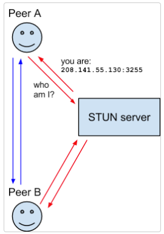
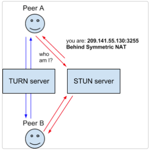
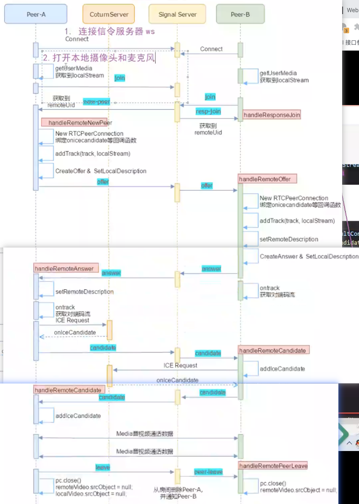

## webRTC 是什么

**WebRTC** (Web Real-Time Communications) 是一项**实时通讯技术**，它允许网络应用或者站点，在**不借助中间媒介**的情况下，建立**浏览器之间点对点**（Peer-to-Peer）的连接，实现视频流和（或）音频流或者其他任意数据的传输。也就是说它可以让浏览器之间直接进行数据交互而不需要借助服务器来进行数据通信。

以往客户端进行通信大多需要借助服务器来做数据传递的工作，这样也就必然会导致数据传递的速度比 peer-to-peer 的模式慢，因为p2p这种模式下也就不需要服务器进行数据传递，我们客户端之间就能直接通信，这就少走了一步路，使得通信的速度比`B/S`，`C/S`的模式快。

## webRTC 的能力

WebRTC 是一个音视频处理+ 即时通讯的开源库，它是一个非常优秀的多媒体框架，而且还跨平台。在音视频领域有两个泰山北斗级别的开源库，一个是FFmpeg， 另一个就是WebRTC 。他们拥有各自不同的侧重点，优势。FFmepg的侧重点是多媒体的编辑，音视频的编解码等对视频文件的处理。 而对于WebRTC, 它的优势是整个网络中实现音视频的传输，对网络的抖动，丢包，网络的评估，在网络层面的各自算法优化保证了音视频传输的稳定，此外它还可以对网络传输经常发生的回音等问题优化处理，如回音消除，降噪。虽然WebRTC最初被设想为纯粹的P2P技术，但许多日常业务应用程序需要集中式媒体功能，通过P2S（peer-to-server）[架构](https://so.csdn.net/so/search?q=架构&spm=1001.2101.3001.7020)提高可靠性、效率或扩展性。

总的来说，WebRTC能做下面这些事情：

- 音视频实时互动
- 游戏，即时通讯，文件传输等等
- 它是一个百宝箱，传输，音视频处理（回音消除，降噪）


## webRTC 前端使用关键模块

面向第三方开发者的WebRTC标准API（Javascript），使开发者能够容易地开发出类似于网络视频聊天的web应用，这些API可分成`Network Stream API`、 `RTCPeerConnection`、`Peer-to-peer Data API`三类。

**Network Stream API**

> MediaStream：用来表示一个媒体数据流。
> MediaStreamTrack: 在浏览器中表示一个媒体源。

对于浏览器而言，可以通过`navigator.mediaDevices.getDisplayMedia({video:true,audio});`来获得媒体流数据，这些数据将会被用来喝另一端的浏览器做通信。

**RTCPeerConnection**

> RTCPeerConnection：一个RTCPeerConnection对象允许用户在两个浏览器之间直接通讯。
> RTCIceCandidate ：表示一个ICE协议的候选者。
> RTCIceServer：表示一个ICE Server。

**Peer-to-peer Data API**

> DataChannel：数据通道( DataChannel)接口表示一个在两个节点之间的双向的数据通道 。


## WebRTC 协议

webRTC协议由几个核心部件组成，分别为`ICE、STUN、NAT、TURN、SDP`。

### ICE

交互式连接设施[Interactive Connectivity Establishment (ICE)](http://en.wikipedia.org/wiki/Interactive_Connectivity_Establishment) 是一个允许你的浏览器和对端浏览器建立连接的协议框架。在实际的网络当中，有很多原因能导致简单的从A端到B端直连不能如愿完成。这需要绕过阻止建立连接的防火墙，给你的设备分配一个唯一可见的地址（通常情况下我们的大部分设备没有一个固定的公网地址），如果路由器不允许主机直连，还得通过一台服务器转发数据。ICE通过使用以下几种技术完成上述工作。

媒体协商就是通知对端应该往哪个地址(ip+端口+协议)尝试连接，一般这个ICE可以通 STUN 或者 TURN 服务器中获取到，也可以是本地网络中获取到。

### STUN

NAT的会话穿越功能[Session Traversal Utilities for NAT (STUN)](http://en.wikipedia.org/wiki/STUN) (缩略语的最后一个字母是NAT的首字母)是一个允许位于NAT后的客户端找出自己的公网地址，判断出路由器阻止直连的限制方法的协议。

客户端通过给公网的STUN服务器发送请求获得自己的公网地址信息，以及是否能够被（穿过路由器）访问。



### NAT

网络地址转换协议[Network Address Translation (NAT)](http://en.wikipedia.org/wiki/NAT) 用来给你的（私网）设备映射一个公网的IP地址的协议。一般情况下，路由器的WAN口有一个公网IP，所有连接这个路由器LAN口的设备会分配一个私有网段的IP地址（例如192.168.1.3）。私网设备的IP被映射成路由器的公网IP和唯一的端口，通过这种方式不需要为每一个私网设备分配不同的公网IP，但是依然能被外网设备发现。

一些路由器严格地限定了部分私网设备的对外连接。这种情况下，即使STUN服务器识别了该私网设备的公网IP和端口的映射，依然无法和这个私网设备建立连接。这种情况下就需要转向TURN协议。

> 在访问外网资源的时候，一般会通过网关的路由表，这个表保存着多条数据，每条数据又包括`在本地局域网内的ip地址和端口号，映射到外网的ip和端口号，要访问的目标的ip和端口号`，其中将本地局域网地址映射到外网地址的工作就由NAT来完成。
>
> NAT 分为主要有四种，分别为
>
> + 对称NAT：对每个端都有不同的口令进行限制，仅允许符合条件的穿透
> + 完全锥形NAT：允许任意地址进行穿透
> + 端口限制锥形NAT：只允许对应ip+端口进行穿透
> + IP限制锥形NAT：只允许对应ip进行穿透


### TURN

一些路由器使用一种“对称型NAT”的NAT模型。这意味着路由器只接受和对端先前建立的连接（就是下一次请求建立新的连接映射）。

NAT的中继穿越方式[Traversal Using Relays around NAT (TURN)](http://en.wikipedia.org/wiki/TURN) 通过TURN服务器中继所有数据的方式来绕过“对称型NAT”。你需要在TURN服务器上创建一个连接，然后告诉所有对端设备发包到服务器上，TURN服务器再把包转发给你。很显然这种方式是开销很大的，所以只有在没得选择的情况下采用。



### SDP

会话描述协议[Session Description Protocol (SDP)](http://en.wikipedia.org/wiki/Session_Description_Protocol) 是一个描述多媒体连接内容的协议，例如分辨率，格式，编码，加密算法等。所以在数据传输时两端都能够理解彼此的数据。本质上，这些描述内容的元数据并不是媒体流本身。

从技术上讲，SDP并不是一个真正的协议，而是一种数据格式，用于描述在设备之间共享媒体的连接。


### 关系

总的来说，他们之间的关系是：ICE 为服务提供最优的端点连接方案；SDP 主要用来描述端点之间的设备情况和使用的数据解码器，以及端点地址等主要还是设备层面上的描述；STUN 这是用来为端点之间传输 SDP 使端点之间能建立连接；NAT则是让端点的暴露在外网环境下使得端点之间能相互发现对方；TURN 则是在端点之间不能直接建立连接的情况下提供一个备选方案用来传递端点之间的数据。


## webRTC 前端主要API

### 方法

+ `var rtc = new RTCPeerConnection(porp)`，创建一个 `RTCPeerConnection`实例，这个构造函数继承的 EventTarget 对象。实例中有几个比较常用的属性，如`currentLocalDescription/localDescription`当前本地的SDP，`currentRemoteDescription`当前连接的端点的SDP，`connectionState`当前连接状态等。prop 可以不传，如果你有ice服务的话可以通过`prop.iceServers = [{urls:'xxxx'}]`设置多个ice服务器。

  + ```js
    iceServers:[
      {
        urls:'stun:stun.services.mozilla.com',
        username:"",//用户名
        credential:"",//turn服务密码，可以使用password或者OAuth
      }
    ]
    ```

+ `rtc.createrOffer(sback,fback)`，创建一个offer（offer是一个RTCSessionDescription对象，获取本地的编解码能力，有两个属性，type和sdp），接收两个参数成功回调和失败回调，需要主要的可以通过回调函数返回，也可以通过promise 的方法返回

+ `rtc.createAnswer(sback,fback)`，这个方法和`createOffer`是几乎一样的，不过这个方法是根据远端发来的 offer 来生成 answer （answer是一个RTCSessionDescription对象，有两个属性，type和sdp））的，所以在创建之前需要先通过`setRemoteDescription`方法根据offer建立为连接的远程端描述。

+ `rtc.setLocalDescription(sdp,sback,fback)`，改变与连接相关的本地描述(设置本地的sdp)，sdp可以是offer/answer中的sdp。同样是异步的函数，可以使用回调和promise.

+ `rtc.setRemoteDescription(sdp,sback,fback)`，改变与连接相关的远端描述(设置要连接方的sdp)，sdp一般是offer中的sdp，最好通过`new RTCSessionDescription(offer.sdp)`生成一个新的sdp。同样是异步的函数，可以使用回调和promise.

+ `rtc.addIceCandidate(ice)`，添加候选的ice方案

+ `rtc.getLocalStreams()`，返回连接的本地媒体流数组。这个数组可能是空数组。

+ `rtc.getRemoteStreams()`，返回连接的远端媒体流数组。这个数组可能是空数组。

+ `rtc.addTrack(track,streams)`，将一个新的媒体音轨添加到一组音轨中，这些音轨将被传输给另一个对等点，同时返回一个标识 sender。可以通过`let t = await navigator.mediaDevices.getUserMedia({video: true, audio: true})`得到对象后通过`t.getTracks()`获取到轨道。

+ `rtc.removeTrack(sender)`，通过 addTrack 返回 sender 来移除 track。

+ `rtc.getSenders()`,返回一个对象数组RTCRtpSender，每个对象代表负责传输一个轨道数据的 RTP 发送方。可以用来获取RTP设置以及对RTP进行设置，比如设置传输速率（可以在`chrome://webrtc-internals`查看）

+ `rtc.close()`关闭一个RTCPeerConnection实例所调用的方法。

+ `var dc = rtc.createDataChannel(label,options)`，创建一个可以发送任意数据的数据通道(data channel)，label 是通道的名字，且需要进行协商，options里面比较重要的属性是 `ordered`数据是否与发送时相同的顺序到达目的地 。常用于后台传输内容, 例如: 图像, 文件传输, 聊天文字, 游戏数据更新包, 等等。返回一个 dataChannel 对象，这个对象可以通过`dc.send(data)`来发送数据。
  + `dc.onopen`处理建立连接
  + `dc.onmessage`接收消息事件。
  + `dc.onclose`关闭通道事件。
  + `dc.onerror`出错。
  + `dc.readyState`通道状态，`"connecting"` 该状态表示底层链路还未建立和激活；`"open"` 该状态表示底层链路已经连接成功并且运行；`"closing"` 该状态表示底层链路已经在关闭的过程中；`"closed"` 该状态表示底层链路已经完全被关闭
  + `dc.bufferedAmount`表示缓冲队列中等待发送的字节数。
  + `dc.binaryType`表示由链路发送的二进制数据的类型。该项的值应该为`"blob"`或者`"arraybuffer"`，默认值为`"blob"`。
  + `dc.send()`发送数据，可以是`USVString,Blob,ArrayBuffer,TypedArray`，需要注意的是send发送的数据是有大小限制的，一般大小为64KB，但是绝大多数浏览器只支持 16KB，如果过大会导致通道关闭（可以通过重新`createDataChannel`重写建立）。
  + `dc.close()`关闭通道


### 事件

+ `rtc.onicecandidate`当添加IceCandidate时触发
+ `rtc.oniceconnectionstatechange`当iceConnectionState改变时触发
+ `rtc.onnegotiationneeded`当需要进行协商时触发，比如创建数据通道`createDataChannel`时
+ `rtc.ondatachannel`当一个 RTCDataChannel 被添加到连接时，这个事件被触发。切回调的参数也是一个dataChannel
+ `rtc.ontrack`当添加track时触发
+ `rtc.onremovetrack`当移除track时触发


## 兼容性处理

目前 webRTC 的大多数接口都还是实验性阶段，所以需要做还兼通性处理，可以使用 [Adapter.js](https://github.com/webrtcHacks/adapter) 做兼容性 pollyfill。webRTC 的相关方法还是比较难用的，而且流程比较复杂，可以使用 peerjs 来简化操作。 


## 音视频通话原理

+ 如何发现对方
+ 音视频编解码能力沟通
+ 网络传输数据

发现对方需要使用到信令服务器，可以是http、websocket、tcp等只要能进行数据的交换都可以

音视频编解码能力沟通，只有使用两端都支持的编解码才能对音视频数据进行编解码，比如PeerA端支持VP8、H264多种编解码格式，而PeerB支持VP9、H264，那么要保证两遍都能正确编解码数据就只能选择 H264，SDP 就是用来做这个事情的

网络传输数据，在知道自己的SDP之后，我们需要让别人知道我们的SDP，我们也需要知道别人的SDP之后才能进行通信，那么我们可以使用服务进行SDP的交换，一般这个服务器是 STUN + TURN。客户端向 STUN 服务器请求打洞，获取到自己客户端到外网的映射地址，之后就可以进行SDP的交换，这种是端对端的方式。如果端对端的方式不能联通就可以使用 TURN 进行中继转发的方式进行SDP的交换




## 简单端点数据通信

实现两个浏览器标签页下的数据通信，只需要简单的几步就好。

在标签页一中写入如下代码

```js
let rtc1 = new RTCPeerConnection();
let dc = rtc1.createDataChannel('dc');
dc.onopen = e => console.log('数据通道建立成功')
dc.onmessage = e => console.log('接收到数据',e.data);
rtc1.onicecandidate = e => console.log('ice接点变化了,sdp:',rtc1.localDescription);
```

在标签页二中写入如下代码

```js
let rtc2 = new RTCPeerConnection();
rtc2.onicecandidate = e => console.log('ice接点变化了,sdp:',rtc2.localDescription);
rtc2.ondatachannel = e => {
  rtc2.dc = e.channel;
  rtc2.dc.onopen = e => console.log('数据通道建立成功');
  rtc2.dc.onmessage = e => console.log('接收到数据',e.data);
}
```

由于没有建立传输 offer/answer的服务器，所以我们需要手动将 offer 复制给到标签页二，将 answer 复杂到标签页一。

标签页一生成offer

```js
rtc1.createOffer().then(offer => rtc1.setLocalDescription(offer))
```

标签页二根据标签页一的offer生成answer

```js
rtc2.setRemoteDescription(offer).then(e => rtc2.createAnswer()).then(answer => rtc2.setLocalDescription(answer))
```

将标签二产生的answer 复制给标签页一，以此来建立连接

```js
rtc1.setRemoteDescription(answer)
```

之后我们就可以使用`send`方法发送数据了

```js
dc.send('hello world')
//-------------------------------------------
rtc2.dc.send('你好')
```


## 实现音视屏通话

使用webRTC实现视屏通话的话第一步就是要有一个公网的主机，因为我们需要一个公网的服务器来交换端点间的 SDP，让端点之间能够互相发现对方，同时因为信息安全问题，我们最好是能够搭建https服务器。同时为了方便访问，我们可以使用`serve-index`创建一个文件中心页面。

### 创建https服务器

```js
let express = require("express");
let http = require("http");
let https = require("https");
let fs = require("fs");
let serveIndex = require('serve-index');

// 设置目录页面
app.use(serveIndex('./public'));
app.use(express.static('./public'));

//配置https
const httpsOption = {
    key : fs.readFileSync("./https/xxxxxxxxxxxx.key"),
    cert: fs.readFileSync("./https/xxxxxxxxxxxx.pem")
}
// 创建服务
let app = express();
let http_server = http.createServer(app).listen(80);
let https_server = https.createServer(httpsOption, app).listen(443);
```

> 需要注意的是在云主机上记得开放端口

### 创建信令服务

信令服务其实就是一个普通的用于转发各种数据的服务。

在创建好https服务之后，为了方便交换SDP，我们还需要创建一个websocket服务，这里我们使用`socket.io`实现

```js
const socketIo = require('socket.io');
let io = socketIo.listen(https_server);
io.on('connection',(socket)=>{
	//转发信息
	socket.on('message', (room, data)=>{
    //向房间内所有人,除自己外转发消息
		socket.to(room).emit('message', room, socket.id, data)
	});
	
	//有用户加入到房间内
	socket.on('join',(room)=>{
		let myRoom = io.sockets.adapter.rooms[room];
		let users =(myRoom)?Object.keys(myRoom.sockets).length:0;
		
		//如果房间人还没满就加入进去
		if (users < 3) {
			//给本人回信息，加入成功
      socket.join(room);
			socket.emit('joined',room,socket.id);
			if(users>1){
        //如果房间内已经有人了就告诉其他人
				socket.to(room).emit('otherjoin',room,socket.id);
			}
		}else{
      // 满了就告诉他房间已满
			socket.emit('full',room,socket.id);
		}
	});

	//用户离开
	socket.on('leave',(room)=>{
		let myRoom = io.sockets.adapter.rooms[room];
		let users =(myRoom)?Object.keys(myRoom.sockets).length:0;
		
		socket.to(room).emit('bye',room,socket.id);
		socket.emit('leaved',room,socket.id);
	});
});
```

### 搭建 TURN 服务

在创建好信令服务器之后，为了避免NAT 无法穿透的情况，我们还需要创建一个TURN服务（中继服务），这里我们可以直接使用`coturn`来实现

因为`coturn`目前只有linux版本的所以，我们需要在云主机上直接安装使用，使用的系统是 `centos`.

coturn 是一个穿透和转发服务器 

**安装**

```SHELL
sudo yum install coturn
```

可以使用`which turnserver`测试看看有没有安装成功，如果安装成功了就会输入所在位置

**配置**

通过`find / -name turnserver.conf`找到配置文件所在位置，然后将配置文件复制一份出来备用，将原来的那份改名成`turnserver.conf.default`。在修改`turnserver.conf`如下

```conf
# 网卡名
relay-device=eth0
#内网IP
listening-ip=172.24.52.189 
listening-port=3478
#内网IP
relay-ip=172.24.52.189
tls-listening-port=5349
# 外网IP
external-ip=xx.xx.xx.xx
relay-threads=500
#打开密码验证
lt-cred-mech
#这两个密钥可用通过openssl生成
cert=/etc/turn_server_cert.pem
pkey=/etc/turn_server_pkey.pem
min-port=40000
max-port=65535
#设置用户名和密码，创建IceServer时使用
user=admin:123456
# 外网IP绑定的域名
realm=www.codeting.top
# 服务器名称，用于OAuth认证，默认和realm相同，部分浏览器本段不设可能会引发cors错误。
server-name=www.codeting.top
# 认证密码，和前面设置的密码保持一致
cli-password=123456
```

通过 openssl 生成密钥

```shell
openssl req -x509 -newkey rsa:2048 -keyout /etc/turn_server_pkey.pem -out /etc/turn_server_cert.pem -days 99999 -nodes 
```

之后在去**云主机控制**台端开启`3478/udp  3478/tcp  40000~65535/udp`端口

如果云主机上开启了防火墙也需要设置一下开放端口

```shell
#systemctl status firewalld 查看防火墙开启状态
#systemctl start firewalld 开启防火墙
#systemctl stop firewalld 开启防火墙
#开放端口
firewall-cmd --zone=public --add-port=3478/udp --permanent
firewall-cmd --zone=public --add-port=3478/tcp --permanent
#重启防火墙
firewall-cmd --reload
```

最后就可以启动服务了

```shell
turnserver -o -a -f
```

可以在[这里](https://webrtc.github.io/samples/src/content/peerconnection/trickle-ice/)进行联通性测试（*AddServer* 后点击 *Gather candidates*）

```shell
# 查看正在运行的服务
systemctl list-unit-files --type=service
# 使服务自动启动
sudo systemctl enable turnserver.service
# 启动服务
sudo systemctl start turnserver
# 停止服务
sudo systemctl stop turnserver
```


### 实现端点视频通信

由于目前webRTC有些接口还处于试验阶段，并不是每个浏览器都有，所以需要使用`adapter`做一下兼容处理。并且使用socketio实现通信。

页面结构

```HTML
<div class="box">
  <div class="title">
    <h3>localVideo</h3>
    <h3>remoteVideo</h3>
  </div>
  <div class="vedio-container">
    <video id="localVideo" autoplay playsinline></video>
    <video id="remoteVideo" autoplay playsinline></video>
  </div>
  <div class="handle-box">
    <button type="button" onclick="conn()">视屏通话</button>
    <button type="button" onclick="shareDisplay()">屏幕共享</button>
    <button type="button" onclick="close()">关闭</button>
    <div>
      <input type="file" id="file" /><br />
      <button type="button" onclick="sendData()">发送文件</button>
      <button type="button" onclick="abortSend()">取消发送</button><br />
      进度：<progress id="progress" max="0" value="0"></progress>
      下载：<a id="downloadLink"></a>
    </div>
  </div>
</div>
<script src="https://cdnjs.cloudflare.com/ajax/libs/socket.io/2.0.3/socket.io.js"></script>
<script src="https://webrtc.github.io/adapter/adapter-latest.js"></script>
<script src="./js/client.js"></script>
```

样式

```css
.box{
  width:70vw;position:relative;
  left:0;right:0;top:0;bottom:0;
  margin:auto;
}
.box .vedio-container,
.box .title{
  width:100%;
  display:flex;
  justify-content:center;
  align-items:center;
  background-color: red;
}
.box .title h3{
  width: 50%;text-align: center;
}
.vedio-container video{
  width:50%;height:60vh;
  background-color: blue;
}
#localVideo{
  background-color: yellow;
}
```

脚本 client.js

```js
let localVideo = document.querySelector('#localVideo')
let removeVideo = document.querySelector('#remoteVideo')
let roomid = 'room1';//房间id，目前代替socketid使用，不精确连接某一用户
let localStream = null;
let socket = null;
let pc = null;
let pcConfig = {
  iceServers:[{//ice turn 服务配置
    urls:'turn:xx.xx.xx.xx:3478',
    credential:'123456',
    username:'admin',
  }]
}
function conn(){
  if(!socket){
    socket = io.connect();
  }
  // 创建webRTC
  createPeerConnection();
  // 加入房间成功
  socket.on('joined',(roomid,id)=>{
    //获取本地媒体流
    getLocalTrack().then(stream => {
      localVideo.scrObject = stream
      localStream = stream
      return stream
    }).then(stream => {
      //添加轨道到远端
      stream.getTracks().forEach(track => pc.addTrack(track,stream))
    })
  })
  //有其他人加入，开始连接
  socket.on('otherjoin',(roomid,id)=>{
    let offerConfig = {
      offerToReceiveAudio:true,//是否向远程对等方提供尝试发送音频的机会
      offerToReceiveVideo:true,//是否向远程对等方提供尝试发送视频的机会
    }
    pc.createOffer().then(offer => {
      pc.setLocalDesctiption(offer);
      sendMessage(roomid,offer);
    })
  })
  //接收其他人的消息
  socket.on('message',(roomid,id,data)=>{
    if(data.type == 'offer'){
      //创建应答,并设置本地sdp
      pc.setRemoteDescription(new RTCSessionDescription(data));
      pc.createAnswer().then(answer => {
        pc.setLocalDescription(answer);
        sendMessage(roomid,answer);
      })
    }else if(data.type == 'answer'){
      //收到应答，设置远端sdp建立连接
      pc.setRemoteDescription(new RTCSessionDescription(data));
    }else if(data.type == 'candidate'){
      //更新ice
      let candidate = new RTCIceCandidate({
        sdpMLineIndex:data.label,
        candidate:data.candidate
      });
      pc.addIceCandidate(candidate);
    }
  })
  socket.emit('join',roomid);
}
//创建 webRTC 连接
function createPeerConnection(){
  if(!pc){
    pc = new RTCPeerConnection(pcConfig);
    // ice 变化时通知其他用户
    pc.onicecandidate = e => {
      if(e.candidate){
        sendMessage(roomid,{
          type:'candidate',
          lable:e.candidate.sdpMLineIndex,
          id:e.candidate,sdpMid,
          candidate:e.candidate.candidate,
        })
      }
    }
    // 添加远端的媒体轨道，本地的 pc.addTrack 并不会触发，远端的会
    pc.ontrack = e => {
      removeVideo.srcObject = e.streams[0]
    }
    // 作为接收方，接收文件
    pc.ondatachannel = e => {
      get_dc = e.channel;
      get_dc.onopen = e => console.log('fileChannel 建立成功')
      get_dc.onmessage = e => reciverData(e.data);
    }
  }
}
// 发送数据
function sendMessage(roomid,data){
  socket.send(roomid,data);
}
// 获取本地媒体流
function getLocalTrack(){
  if(!navigator.mediaDevices||!navigator.mediaDevices.getUserMedia){
    console.log('浏览器不支持getUserMedia接口')
    return false;
  }else{
    // 获取音视屏参数
    let constraints = {video:true,audio:true}
    // 获取媒体数据流
    return navigator.mediaDevices.getUserMedia(constraints)
  }
}
// 关闭连接
function close(){
  if (localStream&&localStream.getTracks()) {
		localStream.getTracks().forEach((track)=>{
			track.stop();	
		});
	}
	localStream = null;
  if(pc){
		pc.close();
		pc = null;
	}
}
```

共享屏幕只需要将`navigator.mediaDevices.getUserMedia`替换成`navigator.mediaDevices.getDisplayMedia`即可。 其实还可以使用`canvas.captureStream()`来获取canvas的实时数据流并通过webRTC进行共享

传输文件需要使用到`rtc.createDataChannel`实现。

```js
let prog = document.querySelector('#progress');
let downloadLink = document.querySelector('#downloadLink');
let fileInput = document.querySelector("#file");
let dc,get_dc,fileReader;
// 发送数据
function sendData(){
  //创建 dc
  createDataChannel();
  let file = fileInput.files[0];
  let chunkSize = 16384;
  let offset = 0;
  //修改文件进度条最大值
  prog.max = file.size;
  
  fileReader = new FileReader();
  fileReader.onerrer = e => console.log('传输文件错误',e);
  fileReader.onabort = e => console.log('取消传输文件');
  fileReader.onload(e => {
    let chunk = file.slice(offset,chunkSize);
    dc.send({
      chunk:e.target.result,//下面的数据可以先通过socket发送过去
      name:file.name,
      size:file.size,
      filetype:file.type,
      lastmodify: file.lastModified
    });
    offset += e.target.result.byteLength;
    prog.value = offset;
    if(offset < file.size){
      readSlice(offset)
    }
  })
  readSlice(offset)
}
// 分割文件
function readSlice(offset){
  let chunk = file.slice(offset,offset + chunkSize);
  fileReader.readAsArrayBuffer(chunk);
}
// 接收文件数据
let reciverInfo,reciverSize = 0,reciverBuffer = [];
function reciverData(data){
  if(!reciverInfo) reciverInfo = data;
  reciverBuffer.push(data.chunk);
  reciverSize += data.chunk.byteLength;
  if(reciverSize >= reciverInfo.size){
    let reciverFile = new Blob(reciverBuffer);
    let url = new URL.createObjectURL(reciverFile);
    downloadLink.download = reciver.filename;
    downloadLink.href = url;
    downloadLink.innerText = `${data.filename}-${data.size / 1024}k`
    URL.revokeObjectURL(url);
    reciverInfo = undefined;reciverSize = 0;reciverBuffer = [];
  }
}
// 取消发送
function abortSend(){
  if(fileReader && fileReader.readyState === 1){
    fileReader.abort();
    //最后再使用socket 通知一下文件取消发送了
  }
}
//创建 dc
function createDataChannel(){
  if(!dc){
    if(!pc) createPeerConnection();
    //作为发送方
    dc = pc.createDataChannel('fileChannel',{ordered:true});
    dc.onopen = e => console.log('fileChannel 建立成功')
    dc.onmessage = e => reciverData(e.data);
  }
}
```


## 参考

[webRTC专题-晓果博客](https://blog.csdn.net/huangxiaoguo1/category_9705009.html)

[webRTC专题-极客雨露](https://blog.csdn.net/kyl282889543/category_9327113_2.html)

[WebRTC原理与实战开发](./webRTC基础/WebRTC原理与实战开发（web端）.pdf)

[webRTC专题](https://blog.csdn.net/qq_34732729/category_9931095.html)

[WebRTC SDP协议](https://www.cnblogs.com/chyingp/p/sdp-in-webrtc.html)

[WebRTC ICE介绍](https://zhuanlan.zhihu.com/p/351105085)

[webrtc中ICE介绍](https://blog.csdn.net/u013692429/article/details/106529213)

[WebRTC 之ICE浅谈](https://zhuanlan.zhihu.com/p/60684464)

[你肯定不理解的技术，网络穿透，P2P，打洞的核心原理](https://www.bilibili.com/video/BV1Ey4y1z7JK)

[NAT的四种分类：全锥形NAT,地址受限锥形NAT,端口受限锥形NAT,对称NAT](https://blog.csdn.net/s2603898260/article/details/118755474)

