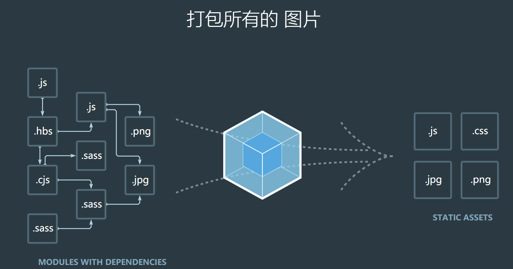
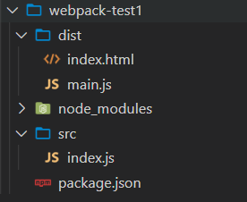

# webpack4

webpack可以看做是一个模块的打包机，它做的事情是，分析你的项目结构，找到js模块以及其他一些浏览器不能直接运行的拓展语言（scss,typescript等）,并将其打包为合适的格式以供浏览器使用。



可以做的事情

> 代码转换、文件优化、代码分割、模块合并、自动刷新、代码校验、自动发布

## 基础简介

### 安装

```shell
npm install webpack -g      #-g 代表全局安装
npm install webpack -s      #-s 代表局部安装

#webpack4以上需要安装webpack-cli
npm install webpack-cli -s  
```

### 卸载

```shell
npm uninstall webpack -g		#全局卸载
npm uninstall webpack -s		#局部卸载
```

> **一、-S,-D,-g的解释**
>
> ```shell
> npm install module_name -S    即    npm install module_name --save    写入dependencies
> npm install module_name -D    即    npm install module_name --save-dev 写入devDependencies
> npm install module_name -g 全局安装(命令行使用)
> npm install module_name 本地安装(将安装包放在 ./node_modules 下)
> ```
>
> **二、i是install的缩写，**
> npm install module_name -S  <=> npm i module_name -S
>
> **三、dependencies与devDependencies的区别**
> devDependencies 里面的插件只用于开发环境，不用于生产环境
>
> dependencies 是需要发布到生产环境的
>
> 比如说：
>
> 你开发一个前端项目，在项目中你需要使用gulp构建你的开发和本地运行环境,这时你就要放到devDependencies里。gulp是你用来压缩代码，打包等需要的工具，程序实际运行的时候并不需要，所以放到dev里就ok了。
>
> 你写程序要用element-ui,生产环境运行项目时肯定要用到element-ui,这时element-ui就应该安装到dependencies中去。

### 概念

+ 入口（entry）：指示 webpack 应该使用哪个文件作为入口起点开始打包，分析构建内部依赖图，默认的入口文件是`./src/index.js`
+ 输出（output）：指示 webpack 打包后的资源 bundles 输出到哪里去，以及如何命名
+ loader：让 webpack 能够去处理那些非 javascript 文件（webpack自身只能处理 js/json 文件），loader 的配置写在`{module:rules:[]}`中
+ plugins：插件，用于执行范围更广的任务，插件的范围包括打包，压缩，优化，一直到重新定义环境中的变量等
+ mode：模式，指定 webpack 使用相应的模式配置 

### **简单使用**

webpack可以进行0配置，也就是不用配置就可以直接使用了，但是这种0配置非常弱，很多地方都满足不了我们的需求。

浏览器不支持模块化，但是webpack会将js文件打包成模块，并且可以生成一个模块系统使得在浏览器上也可以使用js模块化功能。

webpack管理的是一整个项目，而且默认的项目入口文件是 项目/src/index.js 因此可以在项目中新建src文件夹，新建index.js文件；在项目目录下使用`npx webpack`或者`npx wepack ./src/index -o ./dist/ --mode=development`打包项目，会在项目下生成 dist 文件夹，这个文件夹存放的就是打包好的文件。



在/dist文件下就可以直接引用生成的js文件了。


## webpack使用

### 打包（支持 js / json 的模块化）

webpack的默认打包目录是 工程目录下的src目录，没有配置的话将会按生产环境`production`进行打包，打包出来的结果就会放到 dist下的 main.js 文件

```shell
# 工程目录下使用这个命令可以进行打包，或者使用npx wepack ./src/index -o ./dist/ --mode=development
npx webpack
# 这个命令的意思就是执行在node_modules目录下webpack.cmd文件，里面文件的内容就是使用node命令执行webpack.js文件
```

[npx 使用教程](http://www.ruanyifeng.com/blog/2019/02/npx.html)

### webpack 的配置

webpack的默认配置文件是`webpack.config.js`一般可以放在项目根目录下，但是也可以使用其他的配置文件，在运行的时候使用`npx webpack --config 地址`指定好那个哪个配置文件就好了。

当然如果这个命令过长久可以在`package.json`文件配置一些命令来执行

```json
"scripts":{
    "build":"webpack --config webpack.dev.config.js"
}
```

在`package.json`文件下使用不需要使用 `npx `命令了，因为会主动去`node_modules/bin`下找到对应的命令

#### webpack.config.js 的基本结构

```js
const path = require('path');
//设置环境
process.env.NODE_ENV = "development";
module.exports = {
	//模式 development | production
    mode:"development",
    //入口起点
    entry:"./src/index.js",
    //输出
    output:{
        //输入路径
        path:path.resolve(__dirname,"dist"),
        //输出文件名
        filename:"bundle.js",
    },
    //loader 的配置
    module:{
        rules:[
            //详细的配置规则
            {test:"/\.css$/",use:['style-loader',"css-loader"]}
        ]
    },
    //插件 plugins 的配置
    plugins:[
        //详细的配置规则
    ]
}
```


```js
//webpack.config.js  需要使用Commonjs规范导出一个对象
const path=require('path');
module.exports={
    mode:"production",//模式  默认两种 production development
    entry:path.join(__dirname,"./src/index.js"),//入口文件，是相对路径，可以使用node的path模块处理路径
    output:{//出口
    	path:path.resolve(__dirname,'./dist/'),//打包后的文件要放置的目录，必须是一个绝对路径
    	filename:'boundle.[hash:8].js',//打包后的文件名 [hash:8]添加8位hash戳，不写:8，默认添加32位
	}
}
```

> 1. **path.join(path1，path2，path3.......)**
>
> 作用：将路径片段使用特定的分隔符（window：\）连接起来形成路径，并规范化生成的路径。若任意一个路径片段类型错误，会报错。
>
> 2. #### **path.resolve([from...],to)**
>
> 作用：把一个路径或路径片段的序列解析为一个绝对路径。相当于执行cd操作。
>
> - **__dirname 是当前文件夹的绝对路径**
> - **__filename是当前文件的绝对路径**


### 处理 Html 文件

#### html-webpack-plugin 动态添加html模板文件

开始的时候，在项目下和打包出来的目录下是没有html文件的，我们需要自己手动添加html文件，相当麻烦。`html-webpack-plugin`插件可以将指定的模板html文件动态添加html文件到打包目录，并且会将打包出来的 js、css 文件自动添加到 html 文件中。

同样的在使用`webpack-dev-server`运行服务器的时候html文件也将被打包到虚拟的目录中，并不会被真正打包到输出目录，在运行`webpack`打包命令之后才会被打包到输出目录。

安装`npm i html-webpack-plugin -D`，在`webpack.config.js`添加配置

```js
const HtmlWebpackPlugin=require("html-webpack-plugin");
module.exports={
    plugins:[//插件数组，放着所有的webpack插件实例
        new HtmlWebpackPlugin({
            template:'./src/index.html',//将要打包的目标文件
            filename:'index.html',//打包后的文件名
            minify:{//压缩配置
                removeAttributeQuotes:true,//移除双引号
                collapseWhitespace:true,//移除空格
            },
            hash:true,//添加hash戳
        }),
    ]
}
```


### 样式处理

#### css-loader 和 style-loader 处理css

webpack 默认处理的是 js 文件，对于 css，ts 等文件需要使用其他的模块或者插件来处理。现在可以使用 `webpack `对 js 文件进行处理，用`html-webpack-plugin`对html文件处理并且将js文件自动导入，对于css，less，scss等样式文件就需要使用对应模块进行处理，将**样式文件**处理成**模块**，然后才可以**在入口文件 index.js 中使用 import 或者 require 进行导入。**

- **css-loader**：负责解析`@import`这种语法，并将文件变成commonjs模块加载到js中，里面的内容是样式字符串
- **style-loader**：负责将解析好的css文件插入到 head 的 style 标签中

**loader的用法**：只用一个loader的时候可以是一个字符串/对象`{loader:'...'}`，需要使用多个的时候是一个字符串数值。需要**注意**的是，使用多个loader的时候，要注意数组中loader的顺序，webpack将按**从右往左，从下到上**的顺序依次调用loader处理文件。处理css需要先解析再插入，所以顺序应该为`['style-loader','css-loader']`

在 webpack.config.js 配置

```js
module.exports={
    module:{
        rules:[
            {
                test:/\.css$/,//要处理的文件
                use:[{
                    loader:'style-loader',//如果需要用更多的 loader 配置可以使用对象的方式进行配置，比如配置这个 style 要插入的位置等。
                    options:{
                        insert:'head',
                    }
                }]
            },
            'css-loader'
        ],//处理这种文件需要使用的loader
    }
}
```

如果使用的是less，或者是sass，stylus则需要先安装对应的模块先

```shell
##less
npm i less less-loader -D
##stylus
npm i stylus stylus-loader -D
##sass
npm i node-sass sass-loader -D
```

这些 .less/.scss/.stylus 文件并不是单纯的css文件他们需要先被解析成css文件才能被正常使用是，所以现在配置就会是

```js
module.exports={
    module:{//模块
        rules:[//规则
            {
                test:/\.css$/,
                use:['style-loader','css-loader']
            },
            {
                test:/\.less$/,//先解析成css，在解析@import 再进行插入
                use:['style-loader','css-loader','less-loader']
            },
            {
                test:/\.scss$/,
                use:['style-loader','css-loader','sass-loader']
            },
            {
                test:/\.stylus/,
                use:['style-loader','css-loader','stylus-loader']
            },
        ]
    }
}
```

配置好之后记得要在入口文件`index.js`使用 require 或者 import 进行导入，`style-loader`才会将 css 文件插入到 html 中

在这里这些 css 将会被解析成 style 样式，然后被插入到html文档中，并不是引用 css 文件，如果需要抽离css样式文件可以使用 `mini-css-extract-plugin`


#### mini-css-extract-plugin 抽离css样式

这个插件可以将css抽离出来成为一个单独的文件。需要在webpack.config.js中添加配置

```js
const MCEP_CSS=require("mini-css-extract-plugin");
const MCEP_LESS=require("mini-css-extract-plugin");
const MCEP_SCSS=require("mini-css-extract-plugin");
module.exports={
    plugins:[//都是将css抽离成单独文件，less、scss、stylus可以使用同一个，因为最终结果都是css。
        new MCEP_CSS({filename:index.css}),//抽离出来的文件名
        new MCEP_LESS({filename:index.less.css}),
        new MCEP_SCSS({
            filename:'css/index.scss.css',//指定打包dist的css目录下，或使用outputPaht属性指定
        })
    ],
    module:{
        rules:[
            {
                test:/\.css$/,
                use:[MCEP_CSS.loader,'css-loader']
            },
            {
                test:/\.less$/,//先解析成css，在解析@import 再进行插入
                use:[MCEP_LESS.laoder,'css-loader','less-loader']
            },
            {
                test:/\.scss$/,
                use:[MCEP_SCSS.laoder,'css-loader','sass-loader']
            },
            {
                test:/\.stylus/,
                use:[MCEP_CSS.loader,'css-loader','stylus-loader']
            },
        ]
    }
}
```


#### postcss-loader   autoprefixer|postcss-preset-env   为css属性添加浏览器前缀

使用样式的处理工具 loader 或者抽离工具都不会为css的属性添加上浏览器的前缀，这样就会导致网页在浏览器的兼容性会变差。可使用`postcss-loader`和`autoprefixer`模块进行处理

安装` npm i postcss-loader autoprefixer -D`，loader的用法都是一样的 postcss-loader 的作用就是进行css代码的转化，既然是这样那么就需要有css文件吃可以，那么配置就是`['style-loader','css-loader','postcss-loader','less-loader']`

那么 postcss-loader 也需要按照指定的规则去对css文件的属性进行转化，所以在跟目录下添加 `postcss.config.js` 文件，并且在根目录下条件浏览器限制`.browserslistrc`

```js
//postcss.config.js
module.exports={
    plugins:[require('autoprefixer')]
}

//.browserslistrc
# Browsers that we support
defaults
not IE 11
not IE_Mob 11
```

（注意：autoprefixer 需要使用7版本的）

也可以使用`postcss-loader`和`postcss-preset-env`来实现

```js
module.exports = {
    module:{
        rules:[
            {
                test:/\.css$/,
                use:[
                    "style-loader",
                    "css-loader",
                    {
                        loader:"postcss-loader",
                        options:{
                            ident:"postcss",
                            plugins:()=>{
                                require("postcss-preset-css")();//帮助 postcss 找到browserslist 配置
                            }
                        }
                    }
                ]
            }
        ]
    }
}
```

browserslist的配置可以是

```json
{
    "browserslist":{
        "development":[
            "last 1 chrome version",
            "last 1 firefox version",
            "last 1 safari version",
        ],
        "production":[
            ">0.2%",
            "not dead",
            "not op_mini all"
        ]
    }
}
```


#### optimize-css-assets-webpack-plugin  css文件压缩插件

对 css 文件的压缩可以使用webpack自带的插件 `optimize-css-assets-webpack-plugin`，对css文件做一些压缩优化，但同时根据npm官网的配置要求还需要使用`uglifyjs-webpack-plugin`或者`terser-webpack-plugin`插件

添加配置

```js
const optimizeCssMini=require("optimize-css-assets-webpack-plugin");
const ug=require("uglifyjs-webpack-plugin");
module.exports={
    optimization:{//优化项配置
        minimizer:[
            new ug({
                cache:true,//缓存?
                parallel:true,//并发？
                sourceMap:true
            }),
            new optimizeCssMini(),
        ],//压缩优化
    }
}
```

需要注意的是，压缩会在 production 生成环境才会生效；现在配置了的压缩是会对入口文件 index.js 也进行压缩的，但是使用的压缩工具却只配置了针对 css 的操作，还没有对 js 进行配置所以打包的时候可能会报错。

#### 使用 css-minimizer-webpack-plugin 来进行压缩

也可以使用`css-minimizer-webpack-plugin`来进行压缩，不过最好是配合`mini-css-extract-plugin`使用

```js
const MiniCssExtractPlugin = require('mini-css-extract-plugin');
const CssMinimizerPlugin = require('css-minimizer-webpack-plugin');

module.exports = {
    module: {
        rules: [
            {
                test: /.s?css$/,
                use: [MiniCssExtractPlugin.loader, 'css-loader', 'sass-loader'],
            },
        ],
    },
    plugins:[
        new MiniCssExtractPlugin();
    ],
    optimization: {
        minimizer: [
            new CssMinimizerPlugin(),
        ],
    },
};
```


### 处理js文件

#### babel   转化 ES6 以上高级语法为 ES5 的语法

有些浏览器是不支持es6语法的但是会支持es5的语法，所以需要使用babel将高级的转化成es5的语法。

- babel-loader ：解析处理js文件				——- 8
- @babel/preset-env：es6转es5语法库，但是只支持做基本的语法转换，不支持 promise等转换    ——– 7
	- @babel/polyfill：全部js兼容处理，但是在7.4开始已经弃用，之后的是`core-js/stable`。并且会导致另外一个问题，就是不需要使用的也加载进来了，这样会使打包出来的文件变得很大，可以使用`core-js`来按需加载。
- @babel/core：babel核心库                     ——– 7

安装`npm i  babel-loader @babel/preset-env @babel/polyfill @babel/core -D`

添加配置

```js
// @babel/polyfill 直接引入即可，不需要配置
import "@babel/polyfill";
module.exports={
    module:{
        rules:[
            {
                test:/\.js$/,
                use:{
                    loader:'babel-loader',
                    options:{
                        //预设装换库，指示babel做怎样的兼容处理  es6 -> es5
                        //presets:["@babel/preset-env'"]
                        presets:[
                            [
                                '@babel/preset-env',
                                {
                                    useBuiltIns:"usage",//按需加载
                                    corejs:{version:3},//指定core-js的版本
                                    //指定兼容性做到哪个版本浏览器
                                    targets:{
                                        chrome:"60",
                                        firefox:"60",
                                        ie:"9",
                                        safari:"10",
                                        edge:"7"
                                    }
                                }
                            ]
                        ],
                        plugins:[
                            '@babel/plugin-proposal-decorators',//支持提案中es6 装饰器 语法
                            '@babel/plugin-proposal-class-properties',//支持提案中es6 class 语法
                        ]
                    },
                    include:path.resolve(__dirname,'./src/'),
                    exclude:/node_modules/,//默认会匹配整个项目的js文件，加上这个就是排除了node_modules目录
                }
            }
        ]
    }
}
```

如果根据现有的配置不支持 class 语法的话可以使用`@babel/plugin-proposal-class-properties`插件添加对 class 语法的支持。`@babel/plugin-proposal-decorators`，提供装饰器语法。

由于babel只会对 es6或以上的语法进行转义，所以对于 generator 生成器这种语法是不会进行转义的。我们也不能直接使用还需要其他工具帮助转化后才能使用。


#### @babel/plugin-transform-runtime  处理实例上的方法

处理使用`@babel/plugin-transform-runtime`外还需要使用到` @babel/polyfill @babel/runtime`插件

安装`npm i @babel/plugin-transform-runtime @babel/polyfill -D `，`npm i @babel/runtime -S`，在根目录下添加一个`.babelrc`配置文件

```json
{
  "plugins":['@babel/plugin-transform-runtime']
}
```

或者也可以直接在webpack.config.js中配置

```js
module.exports={
    module:{
        rules:[
            {
                test:/\.js$/,
                use:{
                    loader:'babel-loader',
                    options:{
                        presets:[
                            '@babel/preset-env'
                        ],
                        plugins:[
                            '@babel/plugin-transform-runtime'
                        ]
                    },
                }
            }
        ]
    }
}
```

对于`@babel/polyfill`安装之后只需要在入口文件中`require('@babel/polufill')`导入就可以了。


#### eslint 	JavaScript代码规范

eslint会检查代码是否符合整体的代码风格。具体的方格配置可以在[eslint官网](https://eslint.bootcss.com/)中设置好后添加到项目中

安装`npm i eslint eslint-loader -D`，在 webpack.config.js 中配置

```js
module.exports={
    module:{
        rules:[
            {
                test:/\.js$/,
                loader:'eslint-loader',
                options:{
                    enforce:"pre",//前置loader放在最前面，最后检查
                    fix:true,//自动修复
                },
                exclude:/node_modules/
            }
        ]
    }
}
```

- pre	前置执行loader
- normal	普通loader
- lloader	内联loader
- fs	后置loader

推荐使用的 js 验证规则可以使用`airbnb`，这个是使用比较广泛的规则，需要下载`eslint-config-airbnb-base eslint-plugin-import`，在 package.json 中配置验证规则，airbnb不认识浏览器变量，还需要配置`env`开启适配浏览器变量。

```json
{
    "eslintConfig":{
        "extends":"airbnb-base",
        "env":{
            "browser":true
        }
    }
}
```


#### expose-loader	引入全局变量

在webpack中大多插件都是以包的形式存在，需要使用的时候再引入就好了，但是有时候希望将这些包一次全局引用，比如说 jQ 。可以使用`expose-loader`进行全局变量的引用。

```js
import $ from "jquery";
console.log(window.$);//输出会使undefined
```

可以使用`window.$=$`进行挂载。也可以使用插件进行全局暴露

安装 `npm i expose-loader -S`，添加配置

```js
//便捷使用
import $ from 'expose-loader?exposes[]=$&exposes[]=jQuery!jquery';//这个将会把这个 $ 挂载到window上

//配置使用
module.exports={
    module:{
        rules:[
            {
                test:require.resolve('jquery'),//当使用require导入jq的时候使用
                use:{
                    loader:'expose-loader',
                    options:{
                        exposes:['$',"jQuery"],//将jquery以$暴露给window
                    }
                },
            }
        ]
    }
}
```

如果想要在每个模块中都可以拿到以`$`符代表的jquery的话，可以使用 webpack 自带的注入工具

```js
const webpack=require('webpack')
module.exports={
    plugins:[
        new webpack.ProvidePlugin({//提供道具
            $:'jquery',//以$符代表jquery暴露给每个模块
        })
    ]
}
```

也可以使用CDN的形式在html文件中直接引入，但是需要注意的时候如果在html中已经有引入了，那么就不要在js文件中再次`require('jquery')`了，因为再次引入会把jquery再次打包使得代码体积变大，如果非要加的话可以使用`externals`排除打包项.

```js
module.exports={
    externals:{
        jquery:'$',//jquery将不会被打包到boundle.js中
    }
}
```

还可以使用`html-webpack-externals-plugin`插件来引入

```js
// ...
const HtmlWebpackExternalsPlugin = require('html-webpack-externals-plugin');

const commonConfig = {
  // ...
	plugins: [
		// ...
		new HtmlWebpackExternalsPlugin({
			externals: [
				{
					module: 'react', // 模块名称
					entry: 'https://11.url.cn/now/lib/16.2.0/react.min.js', // 引入的cdn
					global: 'React', // 创建一个全局对象 React
				},
				{
					module: 'react-dom',
					entry: 'https://11.url.cn/now/lib/16.2.0/react-dom.min.js',
					global: 'ReactDOM',
				},
			]
		}),
	],
	// ...
}
```


#### 压缩js，移除console.log

默认在`mode:production`时就会压缩。

但是也可以使用`uglifyjs-webpack-plugin`来进行压缩，并且还可以做更多的配置，比如压缩的是时候去除调试用的`console`语句

```js
const UglifyJsPlugin = require("uglifyjs-webpack-plugin");
module.exports={
    plugins:[
        new UglifyJsPlugin({
            uglifyOptions: {
                compress: {
                    warnings: false,
                    drop_console: true,//console
                    pure_funcs: ['console.log']//移除console
                }
            },
            sourceMap: true,
            parallel: true
        }),
    ]
}
```


### webpack打包图片、文件

#### file-loader 或 url-loader 处理图片

webpack默认只会处理打包 js 文件，如果需要处理其他的文件需要使用对应的loader进行管理使用。图片也需要使用对应的插件或者loader处理

webpack打包处理图片的方法有

1. 在js中创建图片来引入

```js
let image=new Image();
image.src='./logo.png';
document.body.appendChild(image);
```

这样写会发现路径是不对的，因为最终访问的是dist目录，而图片并不会被主动打包到dis目录下，所以需要将图片以模块的形式先导入

```js
import logo from './logo.png';
//或者可以使用logo=require('./logo.png');
```

logo将会使一个新的经过 hash 处理的图片地址。

现在可以将图片进行打包导入到dist目录，但是webpack又会提示你这个文件无法解析，所以还需要使用`file-loader`或`url-loader`进行处理

- file-loader   默认会在内部生成一张图片，导入到dist目录下。可以处理任意文件，不只是图片。
- url-loader   url-loader可以看做是 file-loader 的上层封装，可以用做一个限制图片大小，当我们的图片小于n k的时候用base64转化，节约请求数，处理css中通过路径引用图片的情况
- html-loader  因为 url-loader 无法处理 html 中img的图片，所以要用 html-loader 来引入html中的img中用到的图片文件，然后通过 url-loader 进行处理，但是**需要注意的是**，url-loader 默认使用的es6的模块系统，而 html-loader 中的使用的是 commonjs 的模块系统，所以会冲突，可以关闭 url-loader 中的es6模块系统来解决。

安装 `npm i url-loader file-loader html-loader -D`，配置

```js
module.exports={
    module:{
        rules:[
            {
                test:/.(png|jpg|gif)$/,
                use:[
                    {
                        loader:'url-loader',
                        options:{
                            limit:10*1024,//小于10k的时候用base64转化
                            name:'img/[name].[ext]',//打包到dist的img目录下
                            esModule:false,//禁止使用es6模块系统
                        }
                    }
                ],
            },
            {
                test:/.html$/,
                laoder:"html-loader",
                options:{
                    esModule:false,//禁止使用es6模块系统
                }
            }
        ]
    }
}
```

2. 在css中引入的图片，如`background:url('./logo.png')`，url-loader 会帮我们引入

3. 在html文件中直接使用``标签导入。也可以使用 `html-withimg-loader`处理

```js
module.exports={
    module:{
        rules:[
            {
                test:/.html$/,
                use:'html-withimg-loader',
            },
        ]
    }
}
```


#### file-loader处理其他文件

file-loader 除了可以用来出来图片之外，还可以用来处理器其他文件，比如字体文件，图标字体等。

```js
module.exports={
    module:{
        rules:[
            {
                exclude:/\.(html|jpg|png|jpeg|gif)$/,//排除文件
                use:[
                    {
                        loader:"file-loader",
                        name:"fonts/[name].[ext]",//打包到 dist/fonts
                    }
                ],
            },
        ]
    }
}
```


#### 打包css文件分类

在webpack，对于能抽离或者报到出来的文件，都可以设置他们打包出来路径，比如对于css 使用`mini-css-extract-plugin`的filename属性可以设置保存在dist下的css目录，使用`url-loader`使用  name 可以设置将图片保存在 img 下。

如果想要为 html 中的每个url都添加上一个服务器的地址的话可以使用

```js
module.exports={
    output:{
        publicPath:'http://www.xxx.com/',
    }
}
```

这样打包处理的文件的 url 路径就会全部都加上 publicPath 的地址，如果想要只给图片添加的话也可以在 url-loader  中配置 publicPath

  

### 打包多页应用

webpack可以配置多页应用，根据多个入口，生成多个html页面

```js
module.exports={
    entry:{
        home:'./src/home.js',//入口1，key可以自定义
        other:'./src/other.js',//入口2
    },//多入口
    output:{
        filename:'[name][hash:8].js',//name代表entry的 key => name other
        path:path.resolve(__dirname,'./dist'),
    },
    plugins:[
        new HtmlWebpackPlugin({
            template:'./home.html',
            filename:'home.html',
            chunks:['home'],//定义要引用的代理快这里引入的home，如果不设置将会吧other.js和home.js以前引入
        }),
        new HtmlWebpackPlugin({
            template:'./other.html',
            filename:'other.html',
            chunks:['home','other'],
        }),
    ]
}
```


### 开发环境常用工具

#### **webpack-dev-server  本地开发服务**

`webpack-dev-server`默认在当前目录下开启一个服务，可以在指定的目录中开启一个本地的服务器，可以在webpack的配置文件中指定服务器目录。其好处就是不会进行真正的打包，而是会在内存中生成虚拟打包。因此不会再次从新打包内容浪费资源，支持热更新。

安装`npm i webpack-dev-server -D`，执行`npx webpack-dev-server`

在`package.json`添加命令

```json
"scripts":{
    "dev":"webpack-dev-server"
}
```

配置webpack.config.js

```js
module.exports={
    devServer:{
        port:3000,//端口号
        progress:true,//显示开启进度条
        contentBase:'./dist/',//要开启服务的目录
        open:true,//是否自动打开浏览器
        compress:true,//开启压缩
        hot:true,//是否开启热更新
    }
}
```


#### webpack  跨域代理

`webpack-dev-server`中自带`express`所以可以直接使用express，在前端开发的首由于前后端分离开发的原因一般在开发环境中都会有跨域的问题，所以在开发的时候可以使用跨域代理来解决跨域问题，到了生产环境的时候可以使用`ngix`或者在服务端设置 `CORS`解决

##### **CORS方式**

```js
response.setHeader("Access-Control-Allow-Origin", "http://m.qifeng.site/");  // 第二个参数填写允许跨域的域名称，不建议直接写 "*"
response.setHeader("Access-Control-Allow-Headers", "X-Requested-With");
response.setHeader("Access-Control-Allow-Methods", "PUT,POST,GET,DELETE,OPTIONS");

// 接收跨域的cookie
response.setHeader("Access-Control-Allow-Credentials", "true");
```

##### **开发环境下使用代理解决**（假设服务端的端口号是3000）

1. 有服务端提供，客户端和服务端不在同一项目下。使用代理

```js
module.exports={
    devServer:{
        port:9000,
        proxy:{
            '/api':{//检测 以 /api 开头的url地址将被代理到目标地址
                target:'http://localhost:3000',//要转发的地址
                changeOrigin:true,
                credentials:true,//是否携带cookie
                pathRewrite:{'/api':''},//将请求转发给 http://localhost:3000时将 /api 替换为空 ' '
            }
        }
    }
}
```

- `/api`：以 /api 开头的url地址将被代理到目标地址
- `target`：目标服务器的地址
- `changeOrigin`，控住服务器端接收的请求头Host的值，默认为false，当设置为true的时候服务端接收到的请求头中的Host将会是target：`http://localhost:3000`，如果是false那么将会是当前的本地服务地址`http://localhost:9000`。
- `pathRewrite`：重写请求的路径，将路径中的`/api`重写`http://localhost:9000/api/getStu --> http://localhost:3000/getStu`，如果没有配置这个那么将会发送这样的请求`http://localhost:3000/api/getStu`
- `credentials`：请求是否携带 cookie

**请求**

```js
let xhr=new XMLHttpRequire();
xhr.open('GET','/api/user',true);
xhr.onload=function(){
    console.log(xhr.response);
}
xhr.send();
```

这里默认的地址是 `http://localhost:9000`，但是经过代理处理后就会是`http://localhost:3000/user`

服务端代码

```js
let express=require('require');
let app=express();
app.get('/user',(req,res)=>{
    res.json({name:jack})
});
app.lisener(3000,()=>{
    console.log('server is run in :http://localhost:3000');
})
```

2. 有服务端且服务端和客户端处在同一开发环境的项目下。服务端可客户端开启相同接口的服务

```js
let express=require('require');
let app=express();
let webpack=require('webpack');
let config=require('./webpack.config.js');
let middle=require('webpack-dev-middleware');//webpack开发中间件
let complier=webpack(config);//根据配置编译好实例
app.use(middle(complier));//将webpack实例生成中间件之后挂载到express上。
app.get('/user',(req,res)=>{
    res.json({name:jack})
});
app.lisener(3000,()=>{
    console.log('server is run in :http://localhost:3000');
})
```

3. 无服务端，自模拟数据

当我们只需要获取自己写的服务端的模拟数据的时候，可以使用`webpack-dev-server`自带`express`的特性

```js
module.exports={
    devServer:{
        before(app){
            app.get('/user',(req,res)=>{
                res.json({name:'jack'})
            })
        }
    }
}
```

app：express实例

如果要使用虚拟数据最好还是使用 [mockjs](./mockjs虚拟数据.md) 虚拟数据工具。


#### watch 打包监控

开启webpack的watch打包监控时，当代码有修改的时候将会同步编译并打包，和 webpack-dev-server 的热更新相识。

```js
module.exports={
    watch:true,//开启监控
    watchOptions:{//监控的选项
        poll:1000,//每1s 检测1000次代码是否有更新
        aggregateTimeout:500,//防抖，在不在进行修改代码操作之后的500ms后更新
        ignored:/node_modules/,//忽略，不监控node_modules目录
    }
}
```


#### clear-webpack-plugin  清除webpack插件造成的缓存

在打包的时候，输出目录下有文件，然而当我们修改了配置的输出文件名在执行打包的时候就会产生一个新的文件。这个样有可能会报错，或者多出一个文件。所以我们需要在打包之前将原来的输出目录清空。

安装`npm i clear-webpack-plugin -D`

```js
const ClearWebpackPlugin=require('clear-webpack-plugin');
module.exports={
    plugins:[
        new ClearWebpackPlugin('./dist'),//需要清空的目录
    ]
}
```


#### copy-webpack-plugin  拷贝文件或者文件夹到输出目录

可以将一些用到的静态文件打包移动到输目录

```js
const CopyWebpackPlugin=require('copy-webpack-plugin');
module.exports={
    plugins:[
        new CopyWebpackPlugin([
            {from:'public',to:'./public'},//把public目录下的文件复制到dist/public下
        ]),
    ]
}
```


#### BannerPlugin 	webpack内存插件，设置代码版权

如果需要打包出来的代码有自己的签名可以使用这个插件

```js
const webpack=require('webpack');
module.exports={
    plugins:[
        new webpack.BannerPlugin('make by me'),//会以注释的新式加入到 boundle.js 文件中
    ]
}
```


#### resolve 	指定要解析的包

webpack基于nodejs开发，应用的模块规范是commonjs 所以当查找包的时候就会是从node_modules开始往外一层一层地找，但是我们也可以通过resolve来指定需要查找的第三方包的位置

```js
module.exports={
  resolve:[
    path.resolve(__dirname,'./node_modules'),//指定在node_modules下找包
    extensions:['.js','.css','.json','.vue'],//当引入不写后缀时按当前配置顺序查找 import './index',
  	mainFields:['style','main'],//主入口文件先找style目录再找main
  	mainFiles:[],//入口文件的名字 默认index.js
  	alias:{//别名 import 'bootstrap' => import 'bootstrap/dist/css/bootstrap.css'
      bootstrap:'bootstrap/dist/css/bootstrap.css',
    }
  ]
}
```


#### webpack.DefinePlugin() 	定义环境变量

环境变量`process.env`在node环境中可以访问，但是在浏览器环境中时不可访问，为了能支持在浏览器环境中也能访问到`process.env`环境变量需要使用到`webpack.DefinePlugin`插件为浏览器将环境变量`process.env`中的值创建出来

```js
module.exports={
  plugins:[
    new webpack.DefinePlugin({
      DEV:'dev', // console.log(DEV) 输出的会使变量 dev
      PROD:JSON.stringify('production'),// console.log(PROD) 字符串 'production'
      FLAG:true,// console.log(FLAG)  布尔值 true
      EXPORESSION:'1+1',// console.log(FLAG)  数字 2
    })
  ]
}
```


#### webpack-merge 	区分不同环境

一般在在开发的时候需要根据不同的环境进不同的配置，如开发环境下和生产环境下需要配置不同服务器地址，生成环境下需要进行压缩等优化。所以可以针对不同环境进行不同的配置，然后再将这些配置合并在执行编译或者打包。

`nppm i webpack-merge -D`，webpack-merge中有`smart`方法，用于合并配置，类似于 Object.assign()方法，可以将对象合并成一个新的对象。

```js
//公共配置 webpack.base.js
let base=require('./webpack.base.js')
let {smart}=require('webpack-merge');

//生产环境配置 webpack.prod.js
module.exports=smart(base,{
  mode:'production',
  optimization:{
    minimizer:[]
  }
})

//开发环境配置 webpack.dev.js
module.exports=smart(base,{
  mode:'development',
})
```

按需求执行打包`npm run build -- –-config webpack.dev.js`

#### cross-env 传递环境变量

可以使用 cross-env 在命令行传递环境变量，使用前需要先安装`npm i cross-env -D`

```shell
cross-env TEST="1" node test.js
```

在 test.js 中可以使用`process.env.TEST` 访问。

> `cross-env` 本质上是为了消除windows和macos上设置环境变量的差别，如果不用`cross-env`在设置环境变量时
>
> ```shell
> # windows
> set TEST="1" && node test.js
> # macos
> export TEST="1" && node test.js
> ```
>
> 


## webpack常用配置

###  开发环境配置（基本模板）

```js
const {resolve} = require('path');
const HtmlWebpackPlugin = require('html-webpack-plugin');

module.exports = {
  entry: './src/js/index.js',
  output: {
    filename: 'js/built.js',
    path: resolve(__dirname, 'build')
  },
  module: {
    rules: [
      // loader的配置
      {
        // 处理less资源
        test: /\.less$/,
        use: ['style-loader', 'css-loader', 'less-loader']
      }, {
        // 处理css资源
        test: /\.css$/,
        use: ['style-loader', 'css-loader']
      }, {
        // 处理图片资源
        test: /\.(jpg|png|gif)$/,
        loader: 'url-loader',
        options: {
          limit: 8 * 1024,
          name: '[hash:10].[ext]',
          // 关闭es6模块化
          esModule: false,
          outputPath: 'imgs'
        }
      }, {
        // 处理html中img资源
        test: /\.html$/,
        loader: 'html-loader'
      }, {
        // 处理其他资源
        exclude: /\.(html|js|css|less|jpg|png|gif)/,
        loader: 'file-loader',
        options: {
          name: '[hash:10].[ext]',
          outputPath: 'media'
        }
      }
    ]
  },
  plugins: [
    // plugins的配置
    new HtmlWebpackPlugin({
      template: './src/index.html'
    })
  ],
  mode: 'development',
  devServer: {
    contentBase: resolve(__dirname, 'build'),
    compress: true,
    port: 3000,
    open: true
  }
};

```

>   开发环境配置：能让代码运行
>     运行项目指令：
>       webpack 会将打包结果输出出去
>       npx webpack-dev-server 只会在内存中编译打包，没有输出
>
>   所有的代码打包输出到js/built.js文件中
>   随着我们的资源越来越多，我们还需要将代码分类打包，便是在每一个loader中使用outputPath: build文件夹下面的需要放置打包文件的文件夹名
>   css、less等文件不需要设置专门的outputPath，因为它们是直接打包成字符串放进js文件中的

### 生产环境配置

```js
const {
  resolve
} = require('path');
const MiniCssExtractPlugin = require('mini-css-extract-plugin');
const OptimizeCssAssetsWebpackPlugin = require('optimize-css-assets-webpack-plugin');
const HtmlWebpackPlugin = require('html-webpack-plugin');

// 定义nodejs环境变量：决定使用browserslist的哪个环境
process.env.NODE_ENV = 'production';

// 复用loader
const commonCssLoader = [
  MiniCssExtractPlugin.loader,
  'css-loader', {
    // 还需要在package.json中定义browserslist
    loader: 'postcss-loader',
    options: {
      ident: 'postcss',
      plugins: () => [require('postcss-preset-env')()]
    }
  }
];

module.exports = {
  entry: './src/js/index.js',
  output: {
    filename: 'js/built.js',
    path: resolve(__dirname, 'build')
  },
  module: {
    rules: [{
        test: /\.css$/,
        use: [...commonCssLoader]
      }, {
        test: /\.less$/,
        use: [...commonCssLoader, 'less-loader']
      },
      /*
        正常来讲，一个文件只能被一个loader处理。
        当一个文件要被多个loader处理，那么一定要指定loader执行的先后顺序：
          先执行eslint 在执行babel
      */
      {
        // 在package.json中eslintConfig --> airbnb
        test: /\.js$/,
        exclude: /node_modules/,
        // 优先执行
        enforce: 'pre',
        loader: 'eslint-loader',
        options: {
          fix: true
        }
      }, {
        test: /\.js$/,
        exclude: /node_modules/,
        loader: 'babel-loader',
        options: {
          presets: [
            [
              '@babel/preset-env', {
                useBuiltIns: 'usage',
                corejs: {
                  version: 3
                },
                targets: {
                  chrome: '60',
                  firefox: '60',
                  ie: '9',
                  safari: '10',
                  edge: '17'
                }
              }
            ]
          ]
        }
      }, {
        test: /\.(jpg|png|gif)/,
        loader: 'url-loader',
        options: {
          limit: 8 * 1024,
          name: '[hash:10].[ext]',
          outputPath: 'imgs',
          esModule: false
        }
      }, {
        test: /\.html$/,
        loader: 'html-loader'
      }, {
        exclude: /\.(js|css|less|html|jpg|png|gif)/,
        loader: 'file-loader',
        options: {
          outputPath: 'media'
        }
      }
    ]
  },
  plugins: [
    new MiniCssExtractPlugin({
      filename: 'css/built.css'
    }),
    new OptimizeCssAssetsWebpackPlugin(),
    new HtmlWebpackPlugin({
      template: './src/index.html',
      minify: {
        collapseWhitespace: true,
        removeComments: true
      }
    })
  ],
  mode: 'production'
};

```


## webpack 优化点

### 打包时间分析

可以使用 `speed-measure-webpack-plugin`插件来分析各个阶段消耗的时间

### 热更新

代码修改后实时更新带页面上。但是也可以使用watch或者webpack-dev-server实现。

```js
module.exports={
  devServer:{
    hot:true,
  },
  plugins:[
  	new webpack.NameModulePlugin(),//答应更新的文件
  	new webpack.HotModuleReplacementPlugin(),//热更新插件
  ]
}
```

上面这样配置只要有一个文件改变了都会全部刷新，如果需要控制那个文件改变了就改变那个文件还需要在入口文件设置

```js
if(module.hot){
    //一旦 module.hot 为true说明开启了HMR功能，
    module.hot.accept("./test.js",function(){
        //方法会监听 test.js 文件的变化，一旦发生变化，其他模块不会重新打包构建。
        //会执行后面的回调函数
    })
}
```


### oneOf 匹配规则后不再遍历

默认情况下在匹配规则的时候会遍历执行，即使已经匹配上了也会进行遍历规则数组，直到结束。可以使用 oneOf 属性来使匹配上后结束遍历

```js
module.exports = {
    module: {
        rules: [
            {
                oneOf:[
                    {test:/\.css$/,use:[/*...*/]},
                    {test:/\.scss$/,use:[/*...*/]},
                    {test:/\.less$/,use:[/*...*/]}
                ]
            }
        ],
    },
};
```


### source-map 	源码映射

在生产环境下使用webpack进行打包，代码会被高度压缩，并且使用`webpack-dev-server`也是会被压缩的，之前的代码格式将会改变，想要在浏览器上调试代码将变得比较困难，所以 可以使用 `devtool:'source-map'`配置源码映射

```js
module.exports={
    devtool:'source-map',
}
```

devtool 有很多种模式，其中比较常用的是`source-map cheap-module-source-map cheap-source-map `

- `source-map`：外部，错误代码准确信息和源代码的错误位置
- `inline-source-map`：内联，只会生成一个内联source-map，错误代码的准确信息和源代码的错误位置
- `hidden-source-map`：外部，错误代码错误原因，但是没有错误位置，不能追踪源代码错误，只能提示到构建后代码的错误位置
- `eval-source-map`：内联，每一个文件都生成对应的 source-map ，都在eval，错误代码准确信息和源代码的错误位置
- `nosources-source-map`：外部，错误代码准确信息，但是没有任何源代码信息
- `cheap-source-map`：外部，错误代码准确信息和源代码的错误位置，但是只准确到行
- `cheap-module-source-map`：外部，错误代码准确信息和源代码的错误位置，会将module中的loader的source-map也加入进来。

**区别与选择**

- 速度：`eval > inline > cheap > ...`
- 调试友好度：`source-map > cheap-module-source-map > cheap-source-map`


### 缓存

使用缓存可以减少请求次数，提高页面速度，在webpack 中使用缓存也可以提高打包效率。

+ 对babel进行缓存：配置`options:{cacheDirectory:true}`，在第二次打包时就会使用缓存
+ 文件资源缓存
	+ hash：输出文件名使用`filename:[name].[hash:8].[ext]`，这样每次webpack构建是会产生唯一的hash值，但是问题是每次打包hash都是不同的（即使没有改变文件内容），这样缓存就失效了。
	+ chunkhash：根据chunk生成的hash值。如果打包来源于同一个chunk，那么hash值就是一样的，但是这样又会有一个问题，就是在入口引入了 css 和 js，引入的js和css都变了，但是入口没有变hash也是不会变的，所以等不到最新的内容。
	+ contenthash：根据文件内容生成hash，不同文件hash值一定不一样。

还有可以使用`cache-loader`进行缓存处理，虽然第一次会比较慢，但是之后的就会比较快了


### tree shaking：去除无用代码

在开启`produciton`就会自动开启tree shaking，但是前提条件是开启了 ES6 模块化。

但是需要注意的是，在 package.json 中如果配置了`"sideEffect":false`会使所有代码都没有副作用（可以进行tree shaking），这样会可能会使 `css / @babel/polyfill`等文件被干掉。，可以设置指定文件进行tree shaking：`"sideEffect":[*.css]`。


### code split 代码分割

在配置中的`entry`配置了一个入口文件，这样被入口文件引用的其他文件会组成一个chunk，这样chunk最终会被输出为打包后的文件`bundle.js`。其实还可以配置多个入口文件，这样就会有多个chunk，打包出来的也会有多个文件。

```js
const {resolve} = require("path");
module.exports = {
    entry:{
        main:"./src/js/index.js",
        test:"./src/js/test.js",
    },
    output:{
        filename:"js/[name].[contenthash].[ext]",
        path:resolve(__dirname,"dist")
    }
}
```

但是这样也有不好的地方，因为有多少个js文件就要配置多少个。可以使用`splitChunks`优化选项配置，将 node_module 中代码单独打包一个chunk最终输出，并且自动分析多入口chunk中，有没有公共的文件，如果有就会打包成单独一个chunk

```js
const {resolve} = require("path");
module.exports = {
  entry:{
    main:"./src/js/index.js",
    test:"./src/js/test.js",
  },
  output:{
    filename:"js/[name].[contenthash].[ext]",
    path:resolve(__dirname,"dist")
  },
  optimization:{
    splitChunks:{
      chunks:"all",
			cacheGroups:{//自定打包出来的文件名字需要配置这个
        vendors:false,
        default:false,
      }
    }
  }
}
```

如果还想某个文件被单独打包出来，那么可以使用`import()`方法，这样webpack会将文件单独打包成一个chunk

```js
//index.js
// /* webpackChunkName:'test' */ 定义固定的chunk名
import(/* webpackChunkName:'test' */ "./test.js").then(res=>{
    console.log(res);
}).catch(err=>{
    console.err(err);
})
```


### 懒加载和预加载

`import()`方法可以用来做懒加载和预加载，只在点击`btn`的时候才加载`test.js`文件

```js
// /* webpackChunkName:'test' */ 定义固定的chunk名
// /* webpackPrefetch:true */ 提前加载，会在其他资源加载完毕之后就加载
document.querySelector("#btn").onclick = function(){
    import(/* webpackChunkName:'test',webpackPrefetch:true */ "./test.js").then(res=>{
    	console.log(res);
    }).catch(err=>{
        console.err(err);
    })
}
```


### PWA

PWA（Progressive Web App）是一种理念，使用多种技术来增强web app的功能，可以让网站的体验变得更好，能够模拟一些原生功能，比如通知推送。在移动端利用标准化框架，让网页应用呈现和原生应用相似的体验。

可以使用`workbox-webpack-plugin`插件实现

```js
const WorkboxPlugin = require('workbox-webpack-plugin');
module.exports = {
    plugins:[
        new WorkboxPlugin.GenerateSW({
       // 这些选项帮助快速启用 ServiceWorkers
       // 不允许遗留任何“旧的” ServiceWorkers
       clientsClaim: true,
       skipWaiting: true,
     }),
    ]
}
```

还需要入口处注册

```js
 if ('serviceWorker' in navigator) {
   window.addEventListener('load', () => {
     navigator.serviceWorker.register('/service-worker.js').then(registration => {
       console.log('SW registered: ', registration);
     }).catch(registrationError => {
       console.log('SW registration failed: ', registrationError);
     });
   });
 }
```


### 多线程打包

提供多线程打包，加快打包编译速度，可以使用`happypack`或者`thread-loader`实现；安装`npm i happypack -D`

```js
const Happypack=require('happypack');
module.exports={
  ...,
  module:{
    rules:[
      {
          test:/\.js$/,
          use:'Happypack/loader?id=js',//指定使用id为js的Happypack中的loader配置进行打包
          exclude:/node_modules/,
          include:'./src/css'
      }
  	]
	},
  plugins:[
    new Happaypack({
      id:'js',
      use:[
        {
          loader：'babel-loader',
          options:{
            presets:['@babel/preset-env'],
          }
        }
      ]
    })
  ]
}
```

使用`thread-loader`

```js
const thread = require('thread-loader');
module.exports={
    module:{
        rules:[
            {
                test:/\.js$/,
                use:[
                    "thread-loader",
                     {
                         loader:"babel-loader",
                         options:{
                             presets:["@babel/preset-env"]
                         }
                     }
                ],
                exclude:/node_modules/,
            }
        ]
    },
}
```

但是开启多线程打包，会比较消耗性能，所以不是必要尽量不要使用吧。可以分析查看那个模块比较耗时，就在那个模块使用


### externals  | noParse 排除打包

明确知道某些包不存在其他依赖可以将这个包排除解析。

+ externals ：**防止**将某些 `import` 的包(package)**打包**到 bundle 中，而是在运行时(runtime)再去从外部获取这些*扩展依赖(external dependencies)*。
+ noParse ：防止 webpack 解析那些任何与给定正则表达式相匹配的文件。忽略的文件中 **不应该含有** `import`, `require`, `define` 的调用，或任何其他导入机制。忽略大型的 library 可以提高构建性能。

```js
module.exports={
    externals:{
        jquery:"jQuery"
    },
    module:{
        noParse:/jquery/,//不解析jquery中的依赖库。
    }
}
```


### **exclude，include**：排除解析，指定解析

```js
module.exports={
    module:{
        rules:[
            test:/\.css$/,
            use:'style-loader',
            exclude:/node_modules/,
            include:'./src/css'
        ]
    }
}
```


### DLL  排除打包第三方库

有些库我们需要进行单独打包，这时候可以使用 DLL 来处理

先创建生成第三方库打包出来的文件的映射配置`webpack.dll.config`

```js
const {resolve} = require("path");
const webpack = require("webpack");
module.exports = {
    extry:{
        jquery:["jquery"],//key：最终要打包的得到的名，val：要打包的库
    },
    output:{
        filename:'[name].js',
        path:resolve(__dirname,'dll'),
        library:'[name]_[hash]',//打包的库向外暴露的库的名字
    },
    plugins:[
        //打包生成一个manifest.json文件，提供和第三方库（jquery）的映射关系
        new webpack.DllPlugin({
            name:"[name]_[hash]",//映射库的暴露的内容名称
            path:resolve(__dirname,'dll/manifest.json')//输入文件路径
        })
    ],
    mode:"production"
}
```

运算`npx webpack –-config webpack.dll.js`打包生成`dll/manifest.json`，然后继续配置`webpack.config.js`

```js
const {resolve} = require("path");
const webpack = require("webpack");
const AddAssetHtmlWebpackPlugin = require("add-asset-html-webpack-plugin");
module.exports = {
    plugins:[
        //告诉webpack哪些库不参与打包，同时使用时的名称也要变
        new webpack.DllReferencePlugin({
            manifest:resove(__dirname,"dll/manifest.json")
        }),
        // 将某个文件打包输出出去，并在html中自动引入改资源
        new AddAssetHtmlWebpackPlugin({
            filepath:resolve(__dirname,'dll/jquery.js')
        })
    ]
}
```


## 基本架构详细配置

### entry 详细配置

+ `entry:字符串`：单入口，打包形成一个chunk，输出一个bundle文件，此时chunk的名称默认是main
+ `entry:数组`：多入口，所有文件最终形成一个chunk，输出一个bundle文件，只有在HMR功能中让html热更新生效
+ `entry:对象`：多入口，有几个入口就有几个chunk，输出几个bundle文件，此时chunk的名称是 key
	+ 特殊用法：`entry:{index:['./a.js','./b.js']}`。

### output 详细配置

```js
module.exports = {
    entry:"./js/index.js",
    output:{
        //文件名，可以使用目录+名称
        filename:"js/[name].js",
        //输出目录
        path:resolve(__dirname,"dist"),
        //所有资源引入公共路径前缀，如果是 'img/a.jpg' -> '/img/a..jpg'
        publicPath:"/",
        // 非入口chunk的名称，如通过import()方法创建的
        chunkFilename:"js/[name]_chunk.js",
        // 整个库向外暴露的变量名
        library:"[name]",
        // 变量名要挂载的目标 window（浏览器） | global（node） | commonjs，不过一般不用。
        libraryTarget:"window",
    }
}
```

### module 详细配置

```js
module.exports = {
    module:{
        rules:[
            {
                //验证规则
                test:/\.js$/,
                //要使用的loader，如果有多个要使用use，且下面的每个属性都是放use中的，如果使用的只有一个loader可以将配置提取出来
                loader:"babel-loader",
                //loader 配置
                options:{
                    presets:["@babel/preset-env"]
                },
                //要排除的验证目录
                exclude:/node_modules/,
                //要包好的验证目录
                include:resolve(__dirname,"src"),
                //执行时机
                enforce:'pre',
            },
            {
                //多规则验证,匹配后退出遍历
            	oneOf:[]
            }
        ]
    }
}
```

### resolve 配置模块解析规则

```js
const {resolve} = require("path")
module.exports = {
    //模块解析规则
    resolve:{
        //配置解析模块路径别名，目录层级比较高时可以使用别名代替一部分路径 import '$css/a.css' -> import 'src/css/a.css';
        alias:{
           $css:resolve(__dirname,'src/css'),
        },
        //配置省略文件路径的后缀名，默认是[".js",'json']，也就是引入的时候可以不写后缀 import "./src/js/index",会按顺序进行匹配 index.js index.json。
        extensions:[".js",'json','.css'],
        //告诉webpack 解析模块是去那个目录找
        modules:[resolve(__dirname,"../../node_modules"),"node_modules"],
    }
}
```

### devServer  配置

```js
const {resolve} = require("path")
module.exports = {
    devServer:{
        //运行代码的目录
        contentBase:resolve(__dirname,'dist'),
        //开启gzip
        compress:true,
        //域名
        host:"localhost",
        // 端口
        port:5000,
        //自动打开浏览器
        open:true,
        // 开启 HMR 功能
        hot:true,
        // 监视contentBase目录，一旦文件变化就会reload
        watchContentBase:true,
        watchOptions:{
            //忽略监视
            ignored:/node_modules/
        },
        // 不要显示启动服务器日志信息
        clientLogLevel:"none",
        //除了一些基本启动信息之外，其他的内容不显示
        quiet:true,
        //如果出错了不要全屏提示
        overlay:false,
        //服务器代理，解决开发环境跨域问题
        proxy:{
            //一旦devServer（5000）服务器接收到/api/xxx,就会将请求转发给target服务器
            "/api":{
                target:"http://localhost:3000",
                //发送请求时，请求路径重写为 /api/xxx -> /xxx
                pathRewrite:{
                    '^/api':""
                }
            }
        }
    }
}
```

### optimization 优化配置

```js
const {resolve} = require("path");
module.exports = {
    entry:{
        main:"./src/js/index.js",
        test:"./src/js/test.js",
    },
    output:{
        filename:"js/[name].[contenthash].[ext]",
        path:resolve(__dirname,"dist")
    },
    optimization:{
        splitChunks:{
            chunks:"all",
            // 默认值，可以不写，基本上不修改~
            /* minSize: 30 * 1024, // 分割的chunk最小为30kb，小于30kb的不分割，大于30kb才分割
        maxSiza: 0, // 最大没有限制
        minChunks: 1, // 要提取的chunk最少被引用1次
        maxAsyncRequests: 5, // 按需加载时并行加载的文件的最大数量
        maxInitialRequests: 3, // 入口js文件最大并行请求数量
        automaticNameDelimiter: '~', // 名称连接符
        name: true, // 可以使用命名规则
        cacheGroups: {
          // 分割chunk的组
          // node_modules文件会被打包到 vendors 组的chunk中。--> vendors~xxx.js
          // 满足上面写的公共规则，如：大小超过30kb，至少被引用一次。
          vendors: {
            test: /[\\/]node_modules[\\/]/,
            // 优先级
            priority: -10
          },
          default: {
            // 要提取的chunk最少被引用2次
            minChunks: 2,
            // 优先级
            priority: -20,
            // 如果当前要打包的模块，和之前已经被提取的模块是同一个，就会复用，而不是重新打包模块
            reuseExistingChunk: true
          } */
        },
        //将当前模块的记录其他模块的hash单独打包为一个文件 runtime ，当a中引用了b，a中会保存b的contenthash，当b文件变化，导致b的hash变化，a中保存的b的contenthash也会变化，从而导致a内容变化，a的contenthash也会被更新，添加这个属性后可以解决，之后a不在保存b的contenthash，而是使用一个runtime文件保存。
        runtimeChunk:{
            name:entrypoint => `runtime-${entrypoint.name}`
        },
        //配置生产环境的压缩方案：js和css
        // uglifyjs-webpack-plugin 已经不再维护了，可以使用terser-webpack-plugin 来代替
        minimizer:[
            new TerserWebpackPlugin({
                cache:true,//开启缓存
                parallel:true,//开启多线程打包
                source-map:true,//启用source-map
            })
        ]
    }
}
```


## 小总结

webpack 的更新很快，插件的更新也很快，上面的一些配置很有可能已经别弃用或者配置方式已经更高，所以具体的配置还是要以[官网文档](https://webpack.docschina.org/concepts/)的配置为准，不过这么多插件和配置你应该不会想着全部记住吧？这里的笔记主要的作用还是让我理解一些概念和基本配置规律，还有就是有那些插件可以用，是用来干嘛的，为什么要用而已，前端技术一天一个样，可能今天把这些东西都搞懂了，明天就全变了。不过不用担心，因为基本的理念和方法还是通用的。而且webpack看看着配置很多，不过一般开发中都不会直接用webpack开打包项目，相关的项目都有自己的脚手架，如 react 有`create-react-app`，vue有`vue-cli`，甚至可以使用`vite`，使用脚手架基本就是0配置直接可用了，所以不必太过担心。也可以使用`gulp`，这个比webpack简单很多。

[尚硅谷最新版Webpack5实战教程(从入门到精通)](https://www.bilibili.com/video/BV1e7411j7T5?p=34&spm_id_from=pageDriver)


## webpack 配置 React 项目

```shell
# 新建目录，并且进入
mkdir react-webpack && cd $_
# 创建 package.json
npm init -y
# 安装 react react-dom依赖
npm i react react-dom
# 安装 webpack 和 webpack-cli 开发依赖
npm i webpack webpack-cli -D
# 安装 babel
npm i babel-loader @babel/core @babel/preset-env -D
# 安装 babel preset-react
npm i @babel/preset-react -D
```

```js
const path = require('path');
 
const HtmlWebPackPlugin = require('html-webpack-plugin');
 
module.exports = {
    mode: 'development',
    devtool: 'cheap-module-source-map',
    devServer: {
        contentBase: path.join(__dirname, './src/'),
        publicPath: '/',
        host: '127.0.0.1',
        port: 3000,
        stats: {
            colors: true
        }
    },
    entry: './src/index.jsx',
    // 将 jsx 添加到默认扩展名中，省略 jsx
    resolve: {
        extensions: ['.wasm', '.mjs', '.js', '.json', '.jsx']
    },
    module: {
        rules: [
            {
                test: /\.jsx?$/, // jsx文件的正则
                exclude: /node_modules/, // 排除 node_modules 文件夹
                use: {
                    // loader 是 babel
                    loader: 'babel-loader',
                    options: {
                        // babel 转义的配置选项
                        babelrc: false,
                        presets: [
                            // 添加 preset-react
                            require.resolve('@babel/preset-react'),
                            [require.resolve('@babel/preset-env'), {modules: false}]
                        ],
                        cacheDirectory: true
                    }
                }
            }
        ]
    },
    plugins: [
        new HtmlWebPackPlugin({
            template: 'src/index.html',
            filename: 'index.html',
            inject: true
        })
    ]
};
```


## webpack 配置vue 项目

```shell
# 新建目录，并且进入
mkdir vue-webpack && cd $_
# 创建 package.json
npm init -y
# 安装 vue 依赖
npm i vue
# 安装 webpack 和 webpack-cli 开发依赖
npm i webpack webpack-cli -D
# 安装 babel
npm i babel-loader @babel/core @babel/preset-env -D
# 安装 loader vue-template-compile版本要和vue的版本一致
npm i vue-loader vue-template-compiler -D
# 安装 html-webpack-plugin
npm i html-webpack-plugin -D
```

```js
const HtmlWebpackPlugin = require('html-webpack-plugin');
const VueLoaderPlugin = require('vue-loader/lib/plugin');
 
module.exports = {
    resolve: {
        alias: {
            vue$: 'vue/dist/vue.esm.js'
        },
        extensions: ['*', '.js', '.vue', '.json']
    },
    module: {
        rules: [
            {
                test: /\.js$/,
                exclude: /node_modules/,
                use: {
                    loader: 'babel-loader'
                }
            },
            {
                test: /\.vue$/,
                loader: 'vue-loader'
            }
        ]
    },
    plugins: [
        new VueLoaderPlugin(),
        new HtmlWebpackPlugin({
            template: './src/index.html',
            filename: 'index.html'
        })
    ]
};
```


