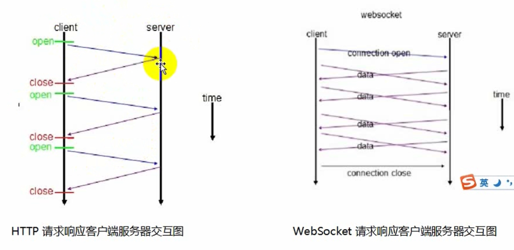
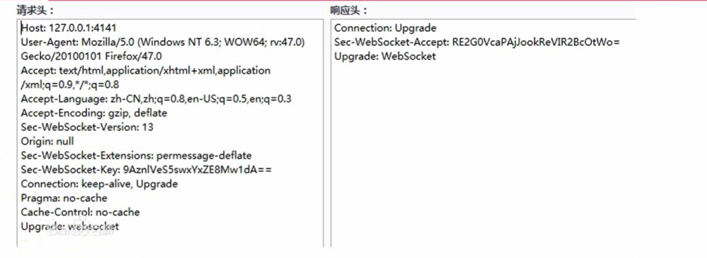

# webSocket

websocket 是一种 H5 通过的新的网络通行方式，是一种新的协议实现了浏览器与服务器全双工通信，**一开始的握手需要借助Http请求**。这个网路通行方式相比于以前的是 http 网络通行的优点是可以保持持久连接，服务端可以主动发送 信息给客户端。在以往要实现获取服务端信息的实时数据的话可以通过 ajax 轮询、 http1.1 长链接或者 http2 协议实现，但是前面的两种都过于消耗资源了。

> 还可以使用[`EventSource`](https://developer.mozilla.org/zh-CN/docs/Web/API/EventSource)实现
>
> `EventSource` 是服务器推送的一个网络事件接口。一个EventSource实例会对HTTP服务开启一个持久化的连接，以`text/event-stream` 格式发送事件, 会一直保持开启直到被要求关闭。
>
> 一旦连接开启，来自服务端传入的消息会以事件的形式分发至你代码中。如果接收消息中有一个事件字段，触发的事件与事件字段的值相同。如果没有事件字段存在，则将触发通用事件。
>
> 与 WebSockets,不同的是，服务端推送是单向的。数据信息被单向从服务端到客户端分发. 当不需要以消息形式将数据从客户端发送到服务器时，这使它们成为绝佳的选择。例如，对于处理社交媒体状态更新，新闻提要或将数据传递到客户端存储机制（如IndexedDB或Web存储）之类的，EventSource无疑是一个有效方案。


## http  与 websocket工作



可以看出 http 的工作流程是`建立连接->发送请求->请求响应->断开连接`，每次的请求都会走这个流程，而且客户端在接收到服务端的数据响应之后就会主动断开连接（利用这个特性可借助 http 1.1 实现长连接实现获取后端实时数据——发送请求后，服务端不立即响应，而是等有新数据是才将新数据响应回去，客户端接收都响应之后关闭旧连接后，从新发送请求建立长连接 ）。

websocket 的工作流程是 `建立连接->前后端通过消息进行通信->关闭连接`。

## websocket 的请求头和响应头



### **请求头中的信息：**

+ `Upgrade:websocket`：告知服务器通信协议已发生改变：我要发起的是websocket协议。以达到握手的目的。
+ `Sec-WebSocket-Version:13`:告知服务器使用websocket版本
+ `Sec-WebSocket-Extensions:permessage-deflate`:
+ `Sec-WebSocket-Key:xxxxxxxx`:字段记录着握手必不可少的键值，用于验证服务器是否支持websocket通信。
+ `Sec-WebSocket-Protocol:`:字段记录的是所需要使用的协议。

### **响应头中的信息：**

+ `connection:Upgrade`:客户端即将升级的协议是Websocket协议
+ `Sec-WebSocket-Accept:xxxxxxxx`:字段值是由握手请求中的Sec-WebSocket-Key字段值加上全局唯一ID(258EAFA5-E914-47DA-95CA-C5AB0DC85B11)后使用sha1摘要后，再以base64格式输出得到的。

websocket 需要类似 TCP 的客户端和服务器端通过握手连接，连接成功后才能相互通信，客户端可服务端都能主动发送数据给对方。


## 创建webSocket连接

websocket 对象提供了一组 API ，用于创建和管理 WebSocket连接，以及通过连接发送和接收数据。

### **创建 websocket**

```js
let ws = new WebSocket(url[,protocols]);
```

> **url**：表示要连接的URL，这个URL应该为响应 WebSocket 的地址
>
> **protocols**：可以是一个单个的协议名字字符串或者包含多个协议名字的字符串的数组

### 属性以及方法

`close([code][,reson])`关闭 WebSocket 连接或者停止正在进行的连接请求。

> + `code`：一个数字值，表示关闭连接的状态号，表示连接被关闭的原因
>
> + `reson`：一个可读字符串，表示连接被关闭的原因

`send(data)`通过WebSocket 连接向服务器发送数据。

> `data`：用于传输至服务器的数据，可以是 `USVString`、 `ArrayBuffer`、 `Blob`、 `ArrayBufferView`。

`onclose`：用于监听连接关闭事件，当 websocket 对象的 readyyState 状态变化为 CLOSE 时会触发该事件。会接收一个`close Event` 对象

`onerror`：当错误发生时用于监听 error 事件的事件监听器，会接收一个 error event 对象

`onmessage`：一个用于消息事件的事件监听器，这一事件当有消息达到的事件该事件会触发，会接收一个 message event 对象

`onopen`：一个用于监听打开事件的事件监听器，当 readyState 的值变为 OPEN 时触发，接收一个 open event 对象

`readyState`：连接状态。`0:连接还没有开启，1：连接已开启并准备好进行通信，2：连接正在关闭过程中， 3：连接已经关闭或者连接无法建立`。


## 后端 websocket 实现原理

### 建立连接

通过 nodejs 来实现 websocket，因为在 `new WebSocket('ws://localhost:3000')`的时候会先通过 http 发送`upgrade`请求进行连接，之后再将连接进行升级为socket连接的，所以服务器端应该首先搭建起一个http服务器接收`upgrade`请求。

```js
let http = require('http');
let crypto = require('crypto');//加密库
let server = http.createServer((req,res)=>{
  res.writeHead(200,{'Content-Type':'text/plain'})
  res.end('okay');
})

/** 获取 Sec-WebSocket-Accept */
function getSecWebSocketAccept(key){
  let sha1 = crypto.createHash('sha1');
  let str = `${key}258EAFA5-E914-47DA-95CA-C5AB0DC85B11`;
  let strToSha1 = sha1.update(str);
  let accpet = strToSha1.digest('base64');
 	return accpet;
}

/**
 	* req:HTTP 请求的参数
  * socket:服务器和客户端之间的网络套接字,简称连接对象
  * head:升级流的第一个数据包（可能为空），是一个 buffer 二进制数据
  */
server.on('upgrade',(req,socket,head)=>{
  // 通过请求数据的 sec-websocket-key 得到 Sec-WebSocket-Accept 值
  let secWebSocketAccept = getSecWebSocketAccept(req.headers['sec-websocket-key'])
  //返回数据告诉前端连接创建信息
  socket.write('HTTP/1.1 101 Web Socket Protocol Handshake\r\n' +
               'Upgrade: WebSocket\r\n' +
               'Connection: Upgrade\r\n' +
               `Sec-WebSocket-Accept: ${secWebSocketAccept}\r\n` +
               '\r\n');
})

server.listen(3000,()=>{
  console.log('server run in http://localhost:3000');
})
```

创建连接中最重要的就是`Sec-WebSocket-Accept`字段，如果没有这个字段或者值错了连接就建立不起来。

### 对数据进行解码

在建立起连接之后就可以通过`socket.on`来绑定`data`事件来接收数据了

```js
socket.on('data',(data)=>{
  console.log(data.toString());
})
```

然后你会发现输出的数据是一堆乱码，这是因为发送过来的数据是一个数据帧，除了本身信息数据之后还有一些协议规定的信息[RFC6455](https://datatracker.ietf.org/doc/html/rfc6455#section-5.2)，如下

```js
/**
    我在第二三行重新加了个按字节和比特来计算的比例尺
     0                   1                   2                   3
     0 1 2 3 4 5 6 7 8 9 0 1 2 3 4 5 6 7 8 9 0 1 2 3 4 5 6 7 8 9 0 1
                   1               2               3               4
     0 1 2 3 4 5 6 7 0 1 2 3 4 5 6 7 0 1 2 3 4 5 6 7 0 1 2 3 4 5 6 7
    +-+-+-+-+-------+-+-------------+-------------------------------+
    |F|R|R|R| opcode|M| Payload len |    Extended payload length    |
    |I|S|S|S|  (4)  |A|     (7)     |             (16/64)           |
    |N|V|V|V|       |S|             |   (if payload len==126/127)   |
    | |1|2|3|       |K|             |                               |
    +-+-+-+-+-------+-+-------------+ - - - - - - - - - - - - - - - +
    |     Extended payload length continued, if payload len == 127  |
    + - - - - - - - - - - - - - - - +-------------------------------+
    |                               |Masking-key, if MASK set to 1  |
    +-------------------------------+-------------------------------+
    | Masking-key (continued)       |          Payload Data         |
    +-------------------------------- - - - - - - - - - - - - - - - +
    :                     Payload Data continued ...                :
    + - - - - - - - - - - - - - - - - - - - - - - - - - - - - - - - +
    |                     Payload Data continued ...                |
    +---------------------------------------------------------------+
    */
```

（不要看上面的数据是二维的就以为 data 是二维的buffer，buffer 只可能是一维的，没 4字节（4x8=32位/比特）表示一行，然后所有数据连成一行）

```
---
第1个字节的第1个比特是FIN的值，用来标识这个frame信息传递是否结束，1是结束
第1个字节的第2-3个比特是RSV的值，用来标识这个frame信息传递是否结束
第1个字节的第4-8个比特是opcode的值，来标记状态
	0是附加帧
	1是文本数据
	2是二进制数据
	8是请求关闭链接
	9是ping-pong的ping 发送方->接收方
	10是ping-pong的pong 接收方->发送方
---
第2个字节的第1个比特是Mask的值，用来标识数据是否使用Masking-key来做异或解码
第2个字节的第2-8个比特PayloadLen,代表数据长度，
	如果小于126，则无需使用扩展数据长，第2个字节的第2-8个比特就表示长度值
	如果为126，则使用16位(第3-4字节)的扩展数据长表示长度值
	如果为127，则使用64位(第3-10字节)的扩展数据长度表示长度值，不过因为int是占4字节，所以前4字节留空，不然int会溢出
	扩展长度使用大字端读取就好
```

所以需要对data进行处理之后才能提取出前端传递过来的真正的数据

```js
//对数据帧进行解码
function decodeSocketFrame(bufData){
  let bufIndex = 0;//读取的数据索引位置
  //bufData.readUint8(n,len) n表示起点索引，len表示长度，单位是 字节，返回是十进制整数
  let byte1 = bufData.readUInt8(bufIndex++).toString(2);
  let byte2 = bufData.readUInt8(bufIndex++).toString(2);
  //frame 的数据用 10 进制保存，方便查看和修改
  let frame = {
    fin:parseInt(byte1.substring(0,1),2),//第一个字节中的第一位数据就是fin，
    rsv:parseInt(byte1.substring(1,4),2),//rsv是保留字段所以，暂时用不到
    opcode:parseInt(byte1.substring(4,8),2),
    mask:parseInt(byte2.substring(0,1),2),
    payloadLen:parseInt(byte2.substring(1,8),2),
  }
  // 如果frame.payloadLen为126或127说明这个长度不够了，要使用扩展长度了
  // 如果frame.payloadLen为126，则使用Extended payload length同时为16/8字节数
  // 如果frame.payloadLen为127，则使用Extended payload length同时为64/8字节数
  // 注意payloadLen得长度单位是字节(bytes)而不是比特(bit)
  if(frame.payloadLen === 126){
   	frame.payloadLen = bufData.readUIntBE(bufIndex,2)
    bufIndex+=2;
  }else if(frame.payloadLen === 127){
    // 虽然是8字节，但是前四字节目前留空，因为int型是4字节不留空int会溢出
    bufIndex+=4;
    frame.payloadLen = bufData.readUIntBE(bufIndex,4);
    bufIndex+=4;
  }
  //如果有设置掩码，就需要使用掩码key对数据进行解码
  if(frame.mask){
    let payloadBufList = [];
    //maskingKey 为4个字节数据
    frame.maskingKey = [bufData[bufIndex++],bufData[bufIndex++],bufData[bufIndex++],bufData[bufIndex++]]
    for(let i = 0;i < frame.payloadLen;i++){
      payloadBufList.push(bufData[bufIndex+i] ^ frame.maskingKey[i%4])
    }
    frame.payloadData = Buffer.from(payloadBufList).toString();
  }else{
    //如果没有设置掩码，后面payloadLen长度的数据就是真正的信息数据
    frame.payloadData = bufData.slice(bufIndex,bufIndex+frame.payloadLen).toString();
  }
  return frame;
}
```

> **掩码算法**
>
> 掩码键（Masking-key）是由客户端挑选出来的32位的随机数。掩码操作不会影响数据载荷的长度。掩码、反掩码操作都采用如下算法：
>
> 首先，假设：
>
> - original-octet-i：为原始数据的第i字节。
> - transformed-octet-i：为转换后的数据的第i字节。
> - j：为`i mod 4`的结果。
> - masking-key-octet-j：为mask key第j字节。
>
> 算法描述为： original-octet-i 与 masking-key-octet-j 异或后，得到 transformed-octet-i。
>
> ```js
> j = i MOD 4
> transformed-octet-i = original-octet-i XOR masking-key-octet-j
> ```

### 对数据进行编码

现在就可以获取到客户端发过来的数据了，那么服务端发给客户单的数据也需要将数据打包存数据帧再发送，不过不同的是服务端发数据的时候不需要使用掩码进行编码。客户端对数据帧进行解码的时候也不会验证 mask，所以可以直接忽略mask

```js
//对数据进行编码形成数据帧
function encodeSocketFrame(frame){
  frame.payloadBuf = Buffer.from(frame.payloadData)
  let frameBufList = [];
  //因为 rsv 一般都为0，所以
  //对 fin 向左位移 7 位则为 八位的 10000000 加上 opcode 为 10000001
  let header = (frame.fin<<7) + frame.opcode;
  frameBufList.push(header);
  //获取数据长度
  let bufBits = Buffer.byteLength(frame.payloadBuf);
  let payloadLen = bufBits;
  let extBuf;//长度超出 126 需要使用扩展空间
  if(bufBits >= 126){
    //如果长度超出2**16（65536，即两字节）极限，那么就需要使用 8 字节来描述
    if(bufBits >= 65536){
      // 这种情况下记得前4个字节要留空,避免溢出，而且使用的是大端序
      extBuf = Buffer.allocUnsafe(8);
      extBuf.writeUInt32BE(bufBits,4);
      payloadLen = 127;
    }else{
     	//没有超出，使用 2 字节就够了
      extBuf = Buffer.allocUnsafe(2);
      extBuf.writeUInt16BE(bufBits,0);
      payloadLen = 126;
    }
  }
  let payloadLenBitStr = payloadLen.toString(2);
  //因为服务端传递数据给客户端不需要mask，所以 payloadLen 总共要占 8个位
  payloadLenBitStr = payloadLenBitStr.padStart(8,'0');
  //这里其实可以直接填入 payloadLen，frameBufList.push(payloadLen);
  frameBufList.push(parseInt(payloadLenBitStr,2));
  if(bufBits >= 126){
    frameBufList.push(extBuf)
  }
  //最后放入消息内容
  frameBufList.push(...frame.payloadBuf)
  return Buffer.from(frameBufList);
}
```

### 分片处理

在传大数据量的时候需要将数据分成小分之后再进行传输，所以最后是处理分片情况，所谓分片，就是一个完整数据分为多个数据帧进行发送，其可以分为三个部分:

- 起始帧(数量==1): FIN == 0, opcode != 0
- 附加帧(数量>=0): FIN == 0, opcode == 0
- 终止帧(数量==1): FIN == 1, opcode == 0

```js
function rawFrameParseHandle(socket) {
  let frame;
  let frameArr = []; // 用来保存分片帧的数组
  let totalLen = 0;  // 记录所有分片帧负载叠加的总长度
  socket.on('data', rawFrame => {
    frame = decodeSocketFrame(rawFrame);
    if (frame.fin === 1) {
      if (frame.opcode === 0) {// 分片的终止帧
        frameArr.push(frame);
        totalLen += frame.payloadLen;

        let frame = frameArr[0];
        let payloadDataArr = [];
        payloadDataArr = frameArr
          .filter(frame => frame.payloadData)
          .map(frame => frame.payloadData);
        // 将所有分片负载合并
        frame.payloadData = Buffer.concat(payloadDataArr);
        frame.payloadLen = totalLen;
        // 根据帧类型进行处理
        opHandle(socket, frame);
        frameArr = [];
        totalLen = 0;
      } else { // 普通帧
        opHandle(socket, frame);
      }
    } else { // 分片起始帧与附加帧
      frameArr.push(frame);
      totalLen += frame.payloadLen;
    }
  });
}
```

服务端通过分片方式发送给客户端的数据，客户端会自动拼接上

### 测试

对客户端分片测试

```js
// 客户端将三个帧进行拼接为 'bbbcccddd'
socket.write(encodeSocketFrame({fin: 0, opcode: 1, payloadData:'bbb'}));
socket.write(encodeSocketFrame({fin: 0, opcode: 0, payloadData:'ccc'}));
socket.write(encodeSocketFrame({fin: 1, opcode: 0, payloadData:'ddd'}));
```

之后我们收发信息的时候就会方便很多了

```js
socket.on('data',(data)=>{
  console.log(decodeSocketFrame(data).payloadData);
  let msg = encodeSocketFrame({
    fin:1,
    opcode:1,
    payloadData:'hello'
  })
  socket.write(msg)
})
```


**关于协议**

协议说白了就是数据通信的规范，告诉别人应该如果解读自己的数据，协议的传输是通过比特流来进行的。所以想要解读数据也需要了解如何操作二进制数据。

websocket和http都是一种协议，而且都是基于TCP的，所以其实 http 也是可以做双向数据通信的

 http 协议每个资源都要建立一个新的连接，HTTP底层使用的是TCP，那么每次都要使用三次握手建立TCP连接，即每一个request对应一个response，将造成极大的资源浪费，所以一般都是用来做一次性的通信

 websocket 每次通信只需建立一次Request/Response消息对，之后都是TCP连接，避免了需要多次建立Request/Response消息对而产生的冗余头部信息，所以比较适合做双向数据通信。

> [WebSocket 和HTTP的区别及原理](https://www.cnblogs.com/goeasycloud/p/9355164.html)

**Tcp 分包和粘包**

**粘包**

在使用 TCP 协议传输数据的时候经常会有一种情况就是，客户端向服务端发送了多次数据，而服务端接收次数却少于接收次数，而且最后发现数据是完整的，并没有发现丢包。这是因为TCP在传输数据的时候是像水管那样连续将数据流向到服务端的（流式套接字，先发先到），这样就会导致多次发送的数据粘合在一起了（**粘包**），比如客户端发送了三次100byte的数据（100byte，100byte，100byte），那么如果发送的粘包服务端接收到的可能就会是2次（200byte，100byte），甚至是一次（300byte）。

**分包**

可以通过分包来解决粘包的问题，分包有两种方式。

+ 第一种：在协议头加长度，告诉服务端这条数据有多长
+ 第二种：通过一些特殊的符号、比如`\r\n`来将每次传递的数据进行分割、标记。

websocket 和 http 都是基于 TCP 的所以也会出现分包和粘包的问题，所以也是需要通过分包来解决粘包问题的。

websocket 是通过 `payload len` 来解决的，而 http 则是通过在同部添加`\r\n\r\n`或者设置`Content-Length`

**定义自己的协议**

一般来说一个完整的协议应该有以下几个关键点

1. 分包，定义长度
2. 需不需要传明文
3. 终止，fin。
4. optional，关于协议的操作

其中 **终止** 尤为重要，因为如果没有终止的话，服务端的这个链接在接收完数据之后并不会去关闭，应用层的数据也回不被释放掉，导致资源占用。如果此时由客户端通过调用`close`方法将链接关闭的话，服务端也会执行关闭方法，但是会先等应用层的资源先释放掉，此时关闭方法会轮询检查资源释放状态，导致输出大量的`close wait`。


# **参考资料**

[使用nodejs实现服务端websocket通讯](https://zhuanlan.zhihu.com/p/127889084)

[Nodejs教程20：WebSocket之二：用原生实现WebSocket应用](https://blog.csdn.net/chencl1986/article/details/88411056)

[WebSocket 学习--用nodejs搭建服务器](https://www.cnblogs.com/fps2tao/p/7875618.html)

[nodejs实现Websocket的数据接收发送](https://www.cnblogs.com/axes/p/4514199.html)

[nodejs的websocket的服务器端是如何实现的？](https://www.zhihu.com/question/37647173)

[原生模块打造一个简单的 WebSocket 服务器](https://zhuanlan.zhihu.com/p/26407649)

<hr />

[Http、Socket、WebSocket之间联系与区别](https://www.cnblogs.com/aspirant/p/11334957.html)

[WebSocket协议及优点](https://www.pianshen.com/article/3238281810/)

[WebSocket 协议有哪些缺点](https://www.zhihu.com/question/20155314)

[nodejs实现Websocket的数据接收发送](https://www.cnblogs.com/axes/p/4514199.html)

[用原生实现WebSocket应用](https://blog.csdn.net/chencl1986/article/details/88411056)


# 使用 websocket 实现服务

在 nodejs 中没有现成的 websocket 模块可以使用，但是可以使用其他人大牛写好的 websocket 库，避免重新造轮子。一些好用的 websocket 有 `socket.io`，`websocket`，`ws`等等，并且一般的 websocket 的库都提供了 前端版本的接口和后端版本的接口。这里使用 `websocket`库进行搭建 websocket 服务器

安装

```shell
npm install websocket
```

后端创建服务器

```js
//后端的websocket接口
var WebSocketServer = require('websocket').server;
//需要使用 http 模块进行连接通信
var http = require('http');

//全部客户端链接
var clients = [];

var server = http.createServer(function(request, response) {
    console.log((new Date()) + ' 收到请求来自：' + request.url);
    response.writeHead(404);
    response.end();
});
server.listen(3000, function() {
    console.log((new Date()) + '服务已开启于 3000 端口');
});

//搭建websocket 服务
wsServer = new WebSocketServer({
    httpServer: server,
});

//判断当前连接是否被允许
function originIsAllowed(origin) {
  return true;
}

wsServer.on('request', function(request) {
    if (!originIsAllowed(request.origin)) {
      request.reject();
      console.log((new Date()) + ' 这个连接被拒绝 ' + request.origin);
      return;
    }
    
    //得到当前连接
    var connection = request.accept(null, request.origin);
   	
    //将连接存入到 clients 中 
    clients.push(connection);
    
    //var connection = request.accept('echo-protocol', request.origin);//如果第一个参数为 'echo-protocol' 那么建立连接时也要加上这个 new WebSocket("ws://localhost:3000","echo-protocol");
    console.log((new Date()) + ' Connection accepted.');
    //监听前端发过来的 message 消息
    connection.on('message', function(message) {
        if (message.type === 'utf8') {
            console.log('Received Message: ' + message.utf8Data);
            //connection.sendUTF(message.utf8Data);
          	
            //将连接发送个所有的客户端
            clients.forEach(conn=>{
                conn.sendUTF(message.utf8Data);
            })
        }
        else if (message.type === 'binary') {
            console.log('Received Binary Message of ' + message.binaryData.length + ' bytes');
            connection.sendBytes(message.binaryData);
        }
    });
    // 监听连接关闭
    connection.on('close', function(reasonCode, description) {
        console.log((new Date()) + ' Peer ' + connection.remoteAddress + ' disconnected.');
        //将连接移除
        let index  = clients.indexOf(connection);
        clients.splice(index,1);
    });
});
```

前端连接

```html
<!DOCTYPE html>
<html lang="en">
<head>
    <meta charset="UTF-8">
    <meta http-equiv="X-UA-Compatible" content="IE=edge">
    <meta name="viewport" content="width=device-width, initial-scale=1.0">
    <title>Document</title>
</head>
<body>
    <script>
        let ws = new WebSocket("ws://localhost:3000");
        ws.onopen = function(res){
            console.log("连接成功",res);
        }
        ws.onmessage = function(res){
            console.log("新消息",res);
        }
        ws.onclose = function(res){
            console.log("连接断开",res);
        }
    </script>
</body>
</html>
```


# webSockets实现简易聊天室

1. 安装`socket.io  express`

   ```shell
   npm i socket.io express --save
   ```

2. 构建工程目录

   ```shell
   npm init -y
   ```

3. 新建server.js

   ```js
   const express=require('express');
   const io=reqire('socket.io');
   const path=require('path');
   
   const app=express();
   
   const server=require('http').createServer(app);
   
   //存储连线
   users=[];
   connections=[];
   
   server.listen(process.env.PORT||5000,function(){
     console.log("server is running in : http://localhost:5000")
   });
   
   app.get('/',function(req,res){
     res.sendFile(path.join(__dirname,'/index.html'));
   })
   
   //监听ws连线
   io.sockets.on('connection',function(socket){
    	//将连线存储起来
     connetions.push(socket);
     console.log('连线',connetions);
     
    	//断线处理：将连线去除
     socket.on('disconnect',function(data){
       connections.splice(connections.indexOf(socket),1);
       console.log("user disconnect:%s online",connections.length)
     })
     
     //接收来自客户端的信息后，向客户端发送信息
       socket.on('send message',function(data){
         io.sockets.emit('new message',{msg:data})
       })
     
     // 用户登录
   	socket.on('new user',function(data,callback){
   		if(users.indexOf(data)!=-1){
   			callback(true);
   		}else{
   			callback(true);
   			socket.username=data;
   			users.push(data);
   			io.sockets.emit('get users',users);
   		}
   	})
   })
   ```

   注意：server 和 client 分别是 sockets 和 socket，注意一下。

4. 新建index.html文件

   ```html
   <!DOCTYPE html>
   <html>
   	<head>
   		<meta charset="utf-8">
   		<title></title>
   		<link href="https://cdn.bootcdn.net/ajax/libs/twitter-bootstrap/4.4.1/css/bootstrap.min.css" rel="stylesheet">
   		<script src="https://cdn.bootcdn.net/ajax/libs/jquery/3.5.0/jquery.min.js"></script>
   		<script src="https://cdn.bootcdn.net/ajax/libs/socket.io/2.3.0/socket.io.js"></script>
   		<style type="text/css">
   			#chatroom{
   				display: none;
   			}
   		</style>
   	</head>
   	<body>
   		<div class="container">
   			<div id="userLogin" class="row">
   				<p id="loginError"></p>
   				<div class="col-md-12">
   					<form id="userForm" action="" method="">
   						<div class="form-group">
   							<input class="form-control" type="text" name="username" id="username" value="enter username" />
   							<input class="btn btn-primary" type="submit" name="loginBtn" id="loginBtn" value="Login" />
   						</div>
   					</form>
   				</div>
   			</div>
   			
   			<div id="chatroom" class="row">
   				<div class="col-md-4">
   					<div class="jumbotron">
   						<h1>Users</h1>
   						<ul class="list-group" id="users">
   							
   						</ul>
   					</div>
   				</div>
   				<div class="col-md-8">
   					<div class="chat" id="chat">
   					</div>
   					<form action="" id="mseeageForm">
   						<div class="form-group">
   							<textarea class="form-control" id="message" placeholder="请输入内容">
   							</textarea>
   							<input type="submit" name="btn" id="btn" class="btn btn-primary" value="ENTER" />
   						</div>
   					</form>
   				</div>
   			</div>
   		</div>
   		<script type="text/javascript">
   			$(function(){
   				const socket=io.connect();
   				const messageForm=$('#mseeageForm');
   				const message=$('#message');
   				const chat=$('#chat');
   				
   				const users=$('#users')
   				const loginError=$('#loginError');
   				const userLogin=$('#userLogin');
   				const userForm=$('#userForm');
   				const username=$('#username');
   				const chatroom=$('#chatroom');
   				
   				userForm.submit(function(e){
   					e.preventDefault();
   					// 登录
   					socket.emit('new user',username.val(),function(data){
   						if(data){
   							userLogin.hide();
   							chatroom.show();
   						}else{
   							loginError.text('login error')
   						}
   					});
   					username.val('');
   				})
   				// 登录成功后接收数据
   				socket.on('get users',function(data){
   					data.forEach(item=>{
   						users.append(`<li class="list-group-item">${item}</li>`)
   					})
   				})
   				
   				messageForm.submit(function(e){
   					e.preventDefault();
   					// 发送数据
   					socket.emit('send message',message.val());
   					message.val('');
   				})
   				// 接收数据
   				socket.on('new message',function({msg,username}){
   					chat.append(`<p><b>${username}：</b>${msg}</p>`)
   				})
   			})
   		</script>
   	</body>
   </html>
   ```

   