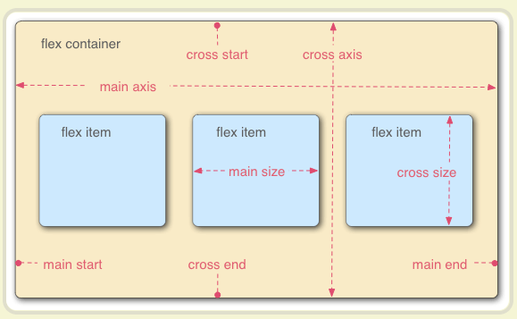

## 文本溢出显示省略号

### 单行文本溢出显示省略号

```css
width:50px;/*兼容部分浏览器*/
overflow: hidden;
text-overflow:ellipsis;
white-space: nowrap;
```


### 多行文本溢出显示省略号

```css
display: -webkit-box;/*将对象作为弹性伸缩盒子模型显示*/
-webkit-box-orient: vertical;/*设置或检索伸缩盒对象的子元素的排列方式*/
-webkit-line-clamp: 3;/*限制在一个块元素显示的文本的行数*/
overflow: hidden;
```


## 定义自增变量

在 css 中可以通过 `counter-reset:counte 0`属性来设置某个选择器出现次数的计数器的值，默认为 0（第一个为计数器名，第二个问初始值）。定义好计数器之后可以使用`counter-increment:counte 1;`属性对counte这个技术器进行自增的操作，增量为1（第一个是要操作的计算器，第二个为增量），之后就可以使用`counter(counte)`来访问 计数器 counte 的值了。

> **counter-reset**
>
> 如果使用 "display: none"，则无法重置计数器。如果使用 "visibility: hidden"，则可以重置计数器。
>
> **counter-increment**
>
> 如果使用了 "display: none"，则无法增加计数。如使用 "visibility: hidden"，则可增加计数。

自定义自增变量可以用来做文章标题的序号前缀。

```css
body {counter-reset:section;}
h1 {counter-reset:subsection;}
h1:before{
    counter-increment:section;
    content:"Section " counter(section) ". ";
}
h2:before {
    counter-increment:subsection;
    content:counter(section) "." counter(subsection) " ";
}
```

```html
<h1>HTML tutorials</h1>
    <h2>HTML Tutorial</h2>
    <h2>XHTML Tutorial</h2>
    <h2>CSS Tutorial</h2>

<h1>Scripting tutorials</h1>
    <h2>JavaScript</h2>
    <h2>VBScript</h2>

<h1>XML tutorials</h1>
    <h2>XML</h2>
    <h2>XSL</h2>
```

## 访问元素属性值

CSS函数 `attr()` 是用来获取被选中元素的任意属性值，并且在样式文件中使用。它也可以用在伪类元素里，在伪类元素里使用，它得到的是伪元素的原始元素的值。

使用这个函数可以做一些有趣而且实用的功能，比如显示tips。

```html
<div id="wrap" my-data="hansome" data-tips="this is my tips">
    tips
</div>
```

```css
body{
	height:100vh;
	display:flex;
	justify-content:center;
	align-items:center;
}
#wrap{
	width:100px;
	height:40px;
	border-radius:20px;
	background-color: skyblue;
	text-align:center;
	line-height:40px;
	font-size:20px;
	font-weight:600;
	color:white;
	position:relative;
	cursor:pointer;
}
#wrap::before{
    content:attr(data-tips) ": " attr(my-data);
	position:absolute;
	top:20px;
	left:0px;
	color:white;
	background-color: gray;
	border-radius:10px;
	background-image:url(https://picsum.photos/id/10/200/200);
	opacity:0;
	transition:all 0.5s;
	visibility:hidden;
}
#wrap::after{
	content:"";
	position:absolute;
	top:12px;
	left:50%;
	border: 8px solid transparent;
    border-bottom: 8px solid #000;
	transform:translateX(-50%);
	opacity:0;
	transition:all 0.5s;
	visibility:hidden;
}
#wrap:hover::after,#wrap:hover::before{
	opacity:1;
	visibility:visible;
}
#wrap:hover::after{
	top:44px;
}
#wrap:hover::before{
	top:60px;
}
```


## 定义变量

在 css3 中可以自定义变量，变量的命名规则和 js 中的变量命名规则是一样的，并且对大小写敏感。

1. 声明，使用 -- 定义

```css
:root{
  --redColor: red;
  --size:2;
}
```

2. css 中获取，使用 var(变量 , 默认值)，当变量值出错时使用默认值代替。

```css
.div{
  color: var(--redColor,#ffffff);
}
```

3. 在 js 中获取和操作

```js
//读取
var root = getComputedStyle(document.documentElement);
var color = root.getPropertyValue('--redColor').trim();
console.log(color); // 'red'

//改变，能引起页面更新
document.documentElement.style.setProperty('--redColor', 'yellow');
var color = root.getPropertyValue('--redColor').trim();
console.log(color);  // 'yellow'

//删除,并不能引起页面更新
document.documentElement.style.removeProperty('--redColor');
var color = root.getPropertyValue('--redColor').trim();
console.log(color); // ''
```

4. 变量组合

```css
:root{
  --a:2;
  --b:'hhh',
  --c:20px,
}
body:after {
  content: '--screen-category: 'var(--b);  // 直接拼接
  width:var(--a)'px';//无效
  height:calc(var(--a) * 1px);//有效
  font-size:var(--c);//有效
}
```

5. 作用域，和 js 一样由下到上找

```css
:root{
  color: red; //全局可用
}
.box {
  --1: #369;  //只在.box这个作用域可用 
}
body {
  background-color: var(--1, #cd0000);
}

<div class="wrapper">
   <div class="content1"></div> //yellow
   <div class="content2"></div> //red
</div>
```

6. 兼容性检查

```js
/*css*/
@supports ( (--a: 0)) {
    /* supported */
}

@supports ( not (--a: 0)) {
    /* not supported */
}

// Js
if (window.CSS && window.CSS.supports && window.CSS.supports('--a', 0)) {
    alert('CSS properties are supported');
} else {
    alert('CSS properties are NOT supported');
}
```


## 布局

### 多列布局

多列布局常用来做新闻的多栏分列布局，也可以用来做 **瀑布流**，但是只能实现比较简单的瀑布流，并且难以控制，可以使用一些库来快速实现，比如`isopojs`、`masonryjs`等插件。

#### 对容器的控制

+ `column-count:2`：表示将然后分为两列
+ `column-fill: balance|auto;`：指定如何填充列，
	+ `balance`列长短平衡。浏览器应尽量减少改变列的长度，
	+ `auto`列顺序填充，他们将有不同的长度
+ `column-gap:40px;`：设置列间距为40px.
+ `column-width:100px;`：设置每列宽为 100px
+ `column-rule:3px outset #ff00ff;`：设置列的样式，可以将每个列都看成是一个div，这个属性就是设置他的边框样式的如`border:3px outset #ff00ff;`
+ `column-span: 1|all;`：指定某个元素应该跨越多少列。

#### 实现简单瀑布流

```css
/*大层*/
.container{width:80%;margin: 0 auto;}
/*瀑布流层*/
.waterfall{
    -moz-column-count:4; /* Firefox */
    -webkit-column-count:4; /* Safari 和 Chrome */
    column-count:4; /* 用整数值来定义列数。不允许负值 */
    -moz-column-gap: 1em;
    -webkit-column-gap: 1em;
    column-gap: 1em; /*用长度值来定义列与列之间的间隙。不允许负值*/
}
/*一个内容层*/
.item{
    padding: 1em;
    margin: 0 0 1em 0;
    -moz-page-break-inside: avoid;
    -webkit-break-inside: avoid;
    break-inside: avoid;
    border: 1px solid #000;
}
.item img{
    width: 100%;
    margin-bottom:10px;
}
```

```html
<div class="container">
	<div class="waterfall">
		<div class="item">
			
			<p>1 convallis timestamp</p>
		</div>
		<div class="item">
			
			<p>2 convallis timestamp 2 Donec a fermentum nisi. </p>
		</div>
		<div class="item">
			
			<p>3 Nullam eget lectus augue. Donec eu sem sit amet ligula 
				faucibus suscipit. Suspendisse rutrum turpis quis nunc 
				convallis quis aliquam mauris suscipit.</p>
		</div>
		<div class="item">
			
			<p> 4 Donec a fermentum nisi. Integer dolor est, commodo ut 
				sagittis vitae, egestas at augue. </p>
		</div>
		<div class="item">
			
			<p> 5 Donec a fermentum nisi. Integer dolor est, commodo ut sagittis vitae, egestas at augue.</p>
		</div>
	</div>
</div>
```

#### 防止列项被截断

> 由于多列布局中各列的高度是均衡的。浏览器会自动调整每列会填充多少文本，然后让整个布局的高度保持均衡一致。而我们在做这种瀑布流的类似布局的时候，往往只需要设置每个容器的宽度，然后高度通过内容填充来自适应。所以，浏览器在处理的时候，为了保持高度的均衡分配，会将我们的布局截断，然后造成布局错乱。
>
> 在这里有几个比较不常见的属性 `page-break-inside break-inside`，这两个属性都是为了防止浏览器在在渲染项的时候，当空间不足的时候将项截断成两部分放在两列的情况。他们的属性值都是一样的，而且除了 `inside`之外还有`before`，`after`。
>
> + `break-before`：定义之前元素的中断点
> + `break-inside`：定义了之后元素的中断点
> + `break-after`：定义了当前元素的中断点。
>
> 他们的值有`auto | avoid | avoid-page | avoid-column | avoid-region`
>
> + `auto` 允许(既不禁止也不强制)在主框中插入任何中断(页、列或区域)
> + `avoid `避免以下全部情况
> + `avoid-page` 避免主框中任何页的中断点
> + `avoid-column` 避免主框中任何列的中断点
> + `avoid-region` 避免原则框内的任何区域中断

#### 防止列项被截断其他方式

也可以为每个项设置`overflow:auto;height:100%;`但是这个容易出现滚动条。


### flex布局

flex 布局，是 css3 新出的一种布局方式，flex布局又被称为弹性盒子布局，因为这个布局是可以根据容器大小自动变化盒子大小来自适应变化的。

#### 开启flex布局

```css
display:flex;
display: inline-flex;/*行内元素也可以使用 Flex 布局。*/
display: -webkit-flex;/*Webkit 内核的浏览器，必须加上-webkit前缀。*/
```

> 注意，设为 Flex 布局以后，子元素的`float`、`clear`和`vertical-align`属性将失效。
>
> **基本概念**
>
> 采用 Flex 布局的元素，称为 Flex 容器（flex container），简称"容器"。它的所有子元素自动成为容器成员，称为 Flex 项目（flex item），简称"项目"。
>
> 
>
> 容器默认存在两根轴：水平的主轴（main axis）和垂直的交叉轴（cross axis）。主轴的开始位置（与边框的交叉点）叫做`main start`，结束位置叫做`main end`；交叉轴的开始位置叫做`cross start`，结束位置叫做`cross end`。
>
> 项目默认沿主轴排列。单个项目占据的主轴空间叫做`main size`，占据的交叉轴空间叫做`cross size`。

#### 对容器的控制

+ `flex-direction: row | row-reverse | column | column-reverse;`属性决定主轴的方向（即项目的排列方向）。
+ `flex-wrap: nowrap | wrap | wrap-reverse;`属性定义，如果一条轴线排不下，如何换行。
	+ `nowrap`（默认）：不换行。
	+ `wrap`：换行，第一行在上方。
	+ `wrap-reverse`：换行，第一行在下方。
+ `flex-flow: <flex-direction> || <flex-wrap>;`属性是`flex-direction`属性和`flex-wrap`属性的简写形式，默认值为`row nowrap`。
+ `justify-content: flex-start | flex-end | center | space-between | space-around;`属性定义了项目在主轴上的对齐方式。
+ `align-items: flex-start | flex-end | center | baseline | stretch;`属性定义项目在交叉轴上如何对齐。
+ `align-content: flex-start | flex-end | center | space-between | space-around | stretch;`定义了多根轴线的对齐方式。如果项目只有一根轴线，该属性不起作用。

#### 对项目的控制

+ `order: <integer>;`属性定义项目的排列顺序。数值越小，排列越靠前，默认为0。
+ `flex-grow: <number>;`属性定义项目的放大比例，默认为`0`，即如果存在剩余空间，也不放大。
+ `flex-shrink: <number>;`属性定义了项目的缩小比例，默认为1，即如果空间不足，该项目将缩小。
+ `flex-basis: <length> | auto;`属性定义了在分配多余空间之前，项目占据的主轴空间（main size）。浏览器根据这个属性，计算主轴是否有多余空间。它的默认值为`auto`，即项目的本来大小。
+ `align-self`属性允许单个项目有与其他项目不一样的对齐方式，可覆盖`align-items`属性。默认值为`auto`，表示继承父元素的`align-items`属性，如果没有父元素，则等同于`stretch`。

**来源于 阮一峰老师的** [Flex 布局教程：语法篇](https://www.ruanyifeng.com/blog/2015/07/flex-grammar.html)

**使用参考** [Flex 布局教程：实例篇](https://www.ruanyifeng.com/blog/2015/07/flex-examples.html)


### grid布局

grid 布局可以和方便的实现多种布局，它将网页划分成一个个网格，可以任意组合不同的网格，做出各种各样的布局。以前，只能通过复杂的 CSS 框架达到的效果，现在浏览器内置了。我们可以将 gird 网格布局 想成一个可以任意调节的的表格，我们可以对网格的大小，位置，进行调控，甚至可以对网格线进行调控。

```html
<div>
  <div><p>1</p></div>
  <div><p>2</p></div>
  <div><p>3</p></div>
</div>
```


#### 开启 grid 布局

对容器开启 grid 布局

```css
display:gird
```

> 注意，设为网格布局以后，容器子元素（项目）的`float`、`display: inline-block`、`display: table-cell`、`vertical-align`和`column-*`等设置都将失效。

#### 对容器进行控制

#### 控制网格数量

+ `grid-template-columns:100px 100px 100px`：将容器内的子元素分成3列，每列的宽度为100px
+ `grid-template-rows:100px 100px 100px`：将容器内的子元素分成3行，每行的宽度为100px
	+ 设置行高、列宽的时候单位可以使用 `fr`、`%`、`px`等单位。
	+ 方法及特定属性
		+ `1fr`：是一种单位，表示占用容器的份数
		+ `repeat(2, 100px 50px)`：可以设置重复编写数据，这里表示`100px 50px 100px 50px`
		+ `repeat(auto-fill, 100px)`：用指定数据尽量填充满容器。表示每列宽度`100px`，然后自动填充，直到容器不能放置更多的列。
		+ `minmax(100px, 1fr)`：`minmax()`函数产生一个长度范围，表示长度就在这个范围之中。它接受两个参数，分别为最小值和最大值。
		+ `grid-template-columns: 100px auto 100px;`：`auto`关键字表示由浏览器自己决定长度。

#### 控制网格间距

+ `grid-row-gap: 20px`：设置行间隔
+ `grid-column-gap: 20px`：设置列间隔
	+ `grid-gap: <grid-row-gap> <grid-column-gap>;`：`grid-gap`属性是`grid-column-gap`和`grid-row-gap`的合并简写形式

#### 控制网格和网格线命名

+ `grid-template-areas: 'a b c' 'd e f' 'g h i';`：可以为分出来的区域定义名字，在子元素中可以使用`grid-area:e`将元素放置在指定的区域内。
	+ 注意，区域的命名会影响到网格线。每个区域的起始网格线，会自动命名为`区域名-start`，终止网格线自动命名为`区域名-end`。比如，区域名为`header`，则起始位置的水平网格线和垂直网格线叫做`header-start`，终止位置的水平网格线和垂直网格线叫做`header-end`。
	+ `grid-template-columns: [c1] 100px [c2] 100px [c3] auto [c4];`：还可以使用方括号，指定每一根网格线的名字，方便以后的引用，设置竖直网格线名称。
	+ `grid-template-rows: [r1] 100px [r2] 100px [r3] auto [r4];`：还可以使用方括号，指定每一根网格线的名字，方便以后的引用，设置横向网格线名称
		+ 可以使用在子元素中用`grid-column-start`等属性使用。

#### 控制网格排放顺序

+ `grid-auto-flow:row`：划分网格以后，容器的子元素会按照顺序，自动放置在每一个网格。默认的放置顺序是"先行后列"，即先填满第一行，再开始放入第二行，即下图数字的顺序。
	+ `grid-auto-flow`属性除了设置成`row`和`column`，还可以设成`row dense`和`column dense`。这两个值主要用于，某些项目指定位置以后，剩下的项目怎么自动放置，会尽量先将主方向先填满，然后再换行继续排。

#### 控制网格内容的对齐方式

+ `justify-items: start | end | center | stretch;`：控制单元格在主轴的位置
+ `align-items: start | end | center | stretch;`：设置单元格在侧轴的位置
	+ `place-items: <align-items> <justify-items>;`：是他们的简写方式

#### 控制网格的对齐方式

+ `justify-content: start | end | center | stretch | space-around | space-between | space-evenly;`：属性是整个内容区域在容器里面的主轴位置
+ `align-content: start | end | center | stretch | space-around | space-between | space-evenly;`：属性是整个内容区域的侧轴位置（上中下）。
	+ `place-content: <align-content> <justify-content>`

#### 控制溢出网格的大小

+ `grid-auto-columns|grid-auto-rows` ：比如网格只有3列，但是某一个项目指定在第5行。这时，浏览器会自动生成多余的网格，以便放置项目。`grid-auto-columns|grid-auto-rows`用来设置浏览器自动创建的多余网格的列宽和行高。它们的写法与`grid-template-columns`和`grid-template-rows`完全相同。如果不指定这两个属性，浏览器完全根据单元格内容的大小，决定新增网格的列宽和行高。


#### 对项目的控制

+ `grid-column-start:2;grid-column-end:3`：表示项目要占据第2条垂直网格线到第3条垂直网格线宽度的位置空间。
+ `grid-row-start: 2;grid-row-end: 4;`表示项目要占据第2条水平网格线到第4条水平网格线高度的位置空间。
	+ 除了可以使用数字来使用网格线外，还可以使用网格线名字来定位`grid-column-start: header-start;`
	+ 也可以使用`span`来设置跨越几个网格，`grid-column-start: span 2;`这个就表示项目的左边框距离右边框跨越2个网格
	+ `grid-column: <start-line> / <end-line>;`：是`grid-column-start`和`grid-column-end`的合并简写形式。
	+ `grid-row: <start-line> / <end-line>;`：是`grid-row-start`属性和`grid-row-end`的合并简写形式。
+ `grid-area:e`：指定项目放在哪一个区域。
	+ `grid-area`属性还可用作`grid-row-start`、`grid-column-start`、`grid-row-end`、`grid-column-end`的合并简写形式，直接指定项目的位置。`grid-area: <row-start> / <column-start> / <row-end> / <column-end>;`->`grid-area: 1 / 1 / 3 / 3;`
+ `justify-self`：设置单元格内容的水平位置（左中右），跟`justify-items`属性的用法完全一致，但只作用于单个项目。
+ `align-self:`设置单元格内容的垂直位置（上中下），跟`align-items`属性的用法完全一致，也是只作用于单个项目。
+ `place-self`：是`align-self`属性和`justify-self`属性的合并简写形式。

**来源于阮一峰老师的** [CSS Grid 网格布局教程](https://www.ruanyifeng.com/blog/2019/03/grid-layout-tutorial.html)


## 响应式布局核心：媒体查询 `@media`

```css
@media only|not 媒体类型 and|only|not (带条件的媒体属性1) and (带条件的媒体属性2){  }
```

### 媒体类型

+ all：全部
+ screen：彩色屏幕
+ print：打印机
+ ....

### 媒体属性

+ width：浏览器的窗口尺寸
+ device-width：设备尺寸
+ device-pixel-ratio(必须加 webkit 前缀)：像素比

上面的三个属性都可以将 min 或者 max 前缀，如`min-width max-width`

+ orientation：横竖屏切换 landscape(横屏) / portrait(竖屏)

### 关键字

+ and：用于连接两个条件
+ only
+ not：取反